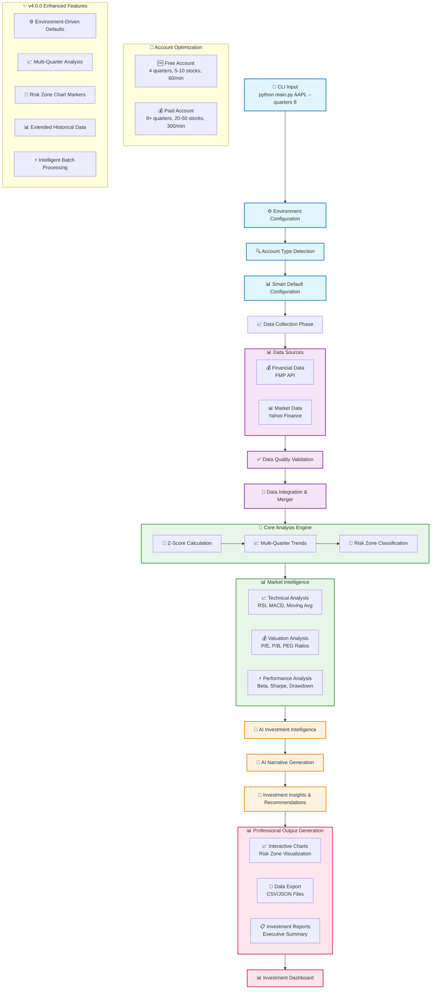

# Investment Analysis Platform v4.0.0 - User Guide

**Transform your investment decisions with AI-powered financial health analysis**

## 🎯 What You Get

### **Professional Investment Intelligence**
- **Bankruptcy Risk Assessment**: Predict financial distress 2+ years in advance using proven Altman Z-Score methodology
- **Investment Recommendations**: Clear BUY/SELL/HOLD guidance with confidence levels and price targets
- **Historical Trend Analysis**: 4-20+ quarters of financial health trends and seasonality patterns
- **AI-Powered Insights**: Natural language investment narratives combining fundamental and market analysis
- **Professional Charts**: Risk zone visualization with color-coded markers (green=safe, yellow=caution, red=distress)

### **Account-Optimized Experience**
The platform automatically adapts to your Financial Modeling Prep (FMP) account type:

| Account Type | Quarters | Batch Size | Rate Limit | Enhanced Features |
|--------------|----------|------------|------------|-------------------|
| **Free** | 4 quarters | 5-10 stocks | 60/min | Core analysis, standard charts |
| **Paid** | 8-20+ quarters | 20-50 stocks | 300/min | Peer comparison, industry benchmarks, quarterly trends |

**Version**: 4.0.0 (January 7, 2025)

## 🚀 Quick Start

### **Basic Analysis**
```bash
# Single stock analysis
python main.py AAPL

# Multi-stock portfolio
python main.py AAPL MSFT GOOGL

# Extended historical analysis
python main.py AAPL --quarters 8
```

### **Advanced Features**
```bash
# Large portfolio (paid accounts)
python main.py AAPL MSFT GOOGL NVDA TSLA --batch-size 20

# Cache management
python main.py --cache-stats    # View performance
python main.py --clear-cache   # Force fresh data
```

## 📊 What You'll Receive

### **Comprehensive Analysis Reports**
For each stock analyzed, you get:

1. **Z-Score Dashboard**: Interactive charts with risk zone visualization
2. **Investment Report**: Professional analysis with AI-generated insights
3. **Data Exports**: CSV and JSON files with complete financial metrics
4. **Executive Summary**: Quick overview with key recommendations

### **Risk Zone Classification**
- **🟢 Safe Zone (Z-Score > 2.99)**: Low bankruptcy risk, financially healthy
- **🟡 Grey Zone (1.8 - 2.99)**: Moderate risk, requires monitoring  
- **🔴 Distress Zone (< 1.8)**: High bankruptcy risk, potential value trap or turnaround opportunity

## 💡 Investment Use Cases

### **For Individual Investors**
- **Screening**: Identify financially healthy companies before investing
- **Portfolio Review**: Monitor existing holdings for deteriorating financial health
- **Value Investing**: Find potential turnaround opportunities in distress zone
- **Risk Management**: Avoid potential bankruptcy candidates

### **For Investment Professionals**
- **Due Diligence**: Comprehensive financial health assessment for investment decisions
- **Client Reporting**: Professional analysis reports with AI-generated insights
- **Portfolio Management**: Monitor multiple holdings efficiently with batch processing
- **Risk Assessment**: Quantify bankruptcy risk for risk management frameworks

## ⚙️ Configuration & Setup

### **Environment Configuration**
The platform uses a `.env` file for configuration. It automatically detects your FMP account type and optimizes settings:

**Free FMP Account Settings:**
```bash
FMP_ENHANCED_MODE=0
DEFAULT_QUARTERS=4
MAX_BATCH_SIZE=5
API_RATE_LIMIT_PER_MINUTE=60
```

**Paid FMP Account Settings:**
```bash
FMP_ENHANCED_MODE=1
DEFAULT_QUARTERS=8
MAX_BATCH_SIZE=25
API_RATE_LIMIT_PER_MINUTE=300
ENABLE_PEER_COMPARISON=1
ENABLE_QUARTERLY_TRENDS=1
```

### **Required API Keys**
Add these to your `.env` file:
```bash
FINANCIAL_MODELING_PREP_API_KEY=your-fmp-key-here
AZURE_OPENAI_API_KEY=your-azure-openai-key-here
AZURE_OPENAI_ENDPOINT=https://your-resource.openai.azure.com/
```

## 📈 Platform Benefits

### **Performance & Reliability**
- **Smart Caching**: 95% faster repeat analysis with intelligent data caching
- **Error Handling**: Graceful fallbacks and comprehensive error management
- **Account Optimization**: Automatic adaptation to your FMP account capabilities
- **Production Ready**: Tested with major companies (MSFT, AAPL, TSLA, NVDA, GOOGL)

### **Professional Features**
- **Multi-Model Analysis**: Automatic selection of appropriate Z-Score model (Original, Service, Private, Retail)
- **Technical Integration**: RSI, MACD, moving averages, volatility analysis
- **Valuation Metrics**: P/E, P/B, PEG ratios, sector comparisons
- **Risk Assessment**: Beta, Sharpe ratio, drawdown analysis
- **AI Narratives**: Natural language investment insights and recommendations

## 🔄 How It Works - Behind the Scenes



### **What This Means for You:**
1. **🎯 Simple Input**: Just specify stock symbols and the platform handles everything
2. **🔍 Smart Detection**: Automatically optimizes based on your account capabilities  
3. **📊 Comprehensive Data**: Fetches financial and market data from multiple sources
4. **🧮 Scientific Analysis**: Applies proven Altman Z-Score methodology with AI enhancement
5. **📈 Professional Output**: Generates investor-grade reports and visualizations
6. **⚡ Optimized Performance**: Intelligent caching makes repeat analysis lightning fast

---

## 📚 Additional Resources

- **[CHANGELOG.md](CHANGELOG.md)**: Complete feature history and updates
- **[TODO.md](TODO.md)**: Future development roadmap
- **[QUICK_START_ENHANCED.md](QUICK_START_ENHANCED.md)**: Detailed usage examples
- **Technical Documentation**: Available in `/docs` folder for developers

---

*Investment Analysis Platform v4.0.0 - Professional financial health assessment with AI-powered insights*
