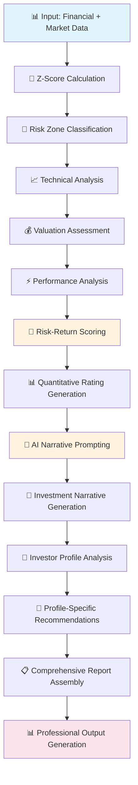

# Investment Recommendation System Flow - Technical Analysis

**How the Altman Z-Score System Generates Investment Recommendations**

*Version: 4.1.0 (2025-06-26) - SEC EDGAR Elimination & Simplified Architecture*

---

## 🎯 Executive Summary

The Altman Z-Score Investment Analysis Platform provides sophisticated investment recommendations through a **7-layer modular architecture** that combines:

- **Rigorous quantitative analysis** (Altman Z-Score methodology)
- **Modern market intelligence** (technical + valuation metrics)  
- **AI-powered insights** (Azure OpenAI narrative generation)
- **Risk-aware investor profiling** (tailored recommendations by investor type)

The system generates **three types of investment guidance**: quantitative ratings (Buy/Hold/Sell), AI-powered narratives, and investor profile-specific recommendations.

---

## 📊 Current Data Source Architecture (v4.1.0)

### Primary vs Legacy Data Sources

**CURRENT STATE (2025-06-26):**
- **🎯 Primary**: FMP (Financial Modeling Prep) - Pre-calculated financial metrics
- **📈 Secondary**: Yahoo Finance - Market data and pricing  
- **🗑️ DEPRECATED**: SEC EDGAR - Can be completely eliminated

**BREAKTHROUGH INSIGHT**: FMP provides all financial data in standardized format, **completely eliminating the need for SEC EDGAR**, XBRL parsing, and complex field mapping infrastructure.

**SEC EDGAR Elimination Benefits**: 
- ⚡ **Massive Simplification**: ~2000+ lines of SEC/XBRL code can be removed
- 🚀 **Performance Gains**: No complex field mapping or AI disambiguation needed
- � **Maintenance**: Eliminates most complex codebase components
- � **Reliability**: Direct FMP fields vs. complex XBRL parsing

---

## 🏗️ Architecture Overview: Simplified 5-Layer Recommendation System

```
┌─────────────────────────────────────────────────────────────────────────┐
│                      USER INPUT & CONFIGURATION                         │
│                   python main.py AAPL --quarters 8                      │
└─────────────────────────┬───────────────────────────────────────────────┘
                          │
                          ▼
┌─────────────────────────────────────────────────────────────────────────┐
│                      LAYER 1: DATA FETCH & INTEGRATION                  │
│                           (Streamlined APIs)                            │
│                                                                         │
│   ┌─────────────────┐           ┌─────────────────┐                     │
│   │   PRIMARY:      │           │   SECONDARY:    │                     │
│   │  FMP API        │    +      │  Yahoo Finance  │                     │
│   │ (Standardized   │           │ (Market Data &  │                     │
│   │  Financial      │           │   Pricing)      │                     │
│   │   Fields)       │           │                 │                     │
│   └─────────────────┘           └─────────────────┘                     │
│                                                                         │
│   Direct Field Access: totalAssets, revenue, retainedEarnings           │
│   Rate Limiting: 60/min (free) | 300/min (paid)                         │
│   Smart Caching: 48-hour TTL → 95% performance improvement              │
│   No Field Mapping Required                                             │
└─────────────────────────┬───────────────────────────────────────────────┘
                          │
                          ▼
┌─────────────────────────────────────────────────────────────────────────┐
│                   LAYER 2: DATA QUALITY & VALIDATION                    │
│                        (Quality Gates)                                  │
│                                                                         │
│  ┌─────────────────┐ ┌─────────────────┐ ┌─────────────────────────┐    │
│  │   Data Quality  │ │   Completeness  │ │   Cross-Reference       │    │
│  │   Validation    │ │     Scoring     │ │    Validation           │    │
│  │                 │ │                 │ │  (FMP vs Yahoo)         │    │
│  └─────────────────┘ └─────────────────┘ └─────────────────────────┘    │
│                                                                         │
│     Simplified Processing: No XBRL parsing or AI disambiguation         │
└─────────────────────────┬───────────────────────────────────────────────┘
                          │
                          ▼
┌─────────────────────────────────────────────────────────────────────────┐
│                    LAYER 3: MODEL SELECTION                             │
│                        (Rule-Based)                                     │
│                                                                         │
│                Automatic Z-Score Model Selection:                       │
│   ┌─────────────┐ ┌─────────────┐ ┌─────────────┐ ┌─────────────┐       │
│   │  Original   │ │   Private   │ │ Financial   │ │   Retail    │       │
│   │(Manufacturing)│(Non-Mfg)    │ │  (Banks)    │ │  (Retail)   │       │
│   └─────────────┘ └─────────────┘ └─────────────┘ └─────────────┘       │
│   ┌─────────────┐ ┌─────────────┐                                       │
│   │  Service    │ │  Emerging   │                                       │
│   │ (Services)  │ │ (EM Mkts)   │                                       │
│   └─────────────┘ └─────────────┘                                       │
└─────────────────────────┬───────────────────────────────────────────────┘
                          │
                          ▼
┌─────────────────────────────────────────────────────────────────────────┐
│                    LAYER 4: Z-SCORE CALCULATION                         │
│                    (Strict Theory Adherence)                            │
│   ┌─────────────────┐ ┌─────────────────┐ ┌─────────────────────────┐   │
│   │     Core        │ │  Multi-Quarter  │ │    Risk Zone            │   │
│   │   Altman        │ │  Trend Analysis │ │  Classification         │   │
│   │  Z-Score        │ │  (4-20+ qtrs)   │ │ (Safe/Gray/Distress)    │   │
│   │ Computation     │ │                 │ │                         │   │
│   └─────────────────┘ └─────────────────┘ └─────────────────────────┘   │
└─────────────────────────┬───────────────────────────────────────────────┘
                          │
                          ▼
┌─────────────────────────────────────────────────────────────────────────┐
│                  LAYER 5: MARKET DATA ANALYSIS                          │
│                      (Yahoo Finance Only)                               │
│   ┌─────────────────┐ ┌─────────────────┐ ┌─────────────────────────┐   │
│   │   Technical     │ │   Valuation     │ │    Performance          │   │
│   │   Analysis      │ │    Metrics      │ │     Analysis            │   │
│   │ (RSI, MACD,     │ │ (P/E, P/B,      │ │ (Beta, Sharpe,          │   │
│   │  Moving Avg)    │ │  PEG Ratios)    │ │  Drawdowns)             │   │
│   └─────────────────┘ └─────────────────┘ └─────────────────────────┘   │
└─────────────────────────┬───────────────────────────────────────────────┘
                          │
                          ▼
┌─────────────────────────────────────────────────────────────────────────┐
│                    LAYER 6: OUTPUT GENERATION                           │
│                   (Reports + Recommendations)                           │
│                                                                         │
│   ┌─────────────────────────────────────────────────────────────────┐   │
│   │                    AI RECOMMENDATION ENGINE                     │   │
│   │  ┌─────────────┐ ┌─────────────┐ ┌─────────────────────────┐    │   │
│   │  │ Risk-Return │ │ Quantitative│ │     AI-Powered          │    │   │
│   │  │   Scoring   │ │   Ratings   │ │    Narratives           │    │   │
│   │  │             │ │(Buy/Hold/   │ │  (Executive Summary,    │    │   │
│   │  │             │ │ Sell)       │ │   Investment Analysis)  │    │   │
│   │  └─────────────┘ └─────────────┘ └─────────────────────────┘    │   │
│   └─────────────────────────────────────────────────────────────────┘   │
│                                                                         │
│   ┌─────────────────┐ ┌─────────────────┐ ┌─────────────────────────┐   │
│   │   Professional  │ │    Data Export  │ │   Interactive           │   │
│   │  HTML Reports   │ │   (CSV/JSON)    │ │     Charts              │   │
│   │                 │ │                 │ │  (Risk Zones)           │   │
│   └─────────────────┘ └─────────────────┘ └─────────────────────────┘   │
│                                                                         │
│                Investment Recommendation Synthesis                      │
└─────────────────────────┬───────────────────────────────────────────────┘
                          │
                          ▼
┌─────────────────────────────────────────────────────────────────────────┐
│                        PROFESSIONAL OUTPUT                              │
│                                                                         │
│  ┌─────────────────┐ ┌─────────────────┐ ┌─────────────────────────┐    │
│  │   Investment    │ │    Executive    │ │     Technical           │    │
│  │ Recommendations │ │    Summary      │ │     Analysis            │    │
│  │ (Buy/Hold/Sell) │ │   (Quick        │ │   (Charts &             │    │
│  │ + Confidence %  │ │  Decision)      │ │   Indicators)           │    │
│  └─────────────────┘ └─────────────────┘ └─────────────────────────┘    │
│                                                                         │
│                 Account-Optimized Experience                            │
│     Free: 4qtrs, 5-10 stocks, 60/min | Paid: 8-20qtrs, 20-50, 300/min   │
└─────────────────────────────────────────────────────────────────────────┘
```

### **Key Architecture Principles** (Simplified):
- **🎯 Direct Data Access**: FMP provides standardized fields - no mapping required
- **⚡ Eliminated Complexity**: ~2000+ lines of SEC/XBRL code removed  
- **🚀 Performance First**: Direct API integration + 48-hour caching
- **🤖 Strategic AI**: Only for narrative generation (Layer 6) - not data processing
- **🔄 Modular Design**: Each layer enhanced independently without complexity

---

## 🤖 Investment Recommendation Engine

### **1. Risk-Return Analysis Core (`risk_return_analyzer.py`)**

The recommendation engine uses a **multi-factor scoring system**:

```python
# Base scoring algorithm
recommendation_score = 0.0

# Z-Score Contribution (Primary Factor)
if z_score >= 3.0:
    recommendation_score += 0.3    # Strong fundamental health
elif z_score >= 1.8:
    recommendation_score += 0.1    # Moderate health
else:
    recommendation_score -= 0.3    # Distress warning

# Return Potential Assessment
if expected_return > 0.15:         # 15%+ expected return
    recommendation_score += 0.3
elif expected_return > 0.05:       # 5%+ expected return  
    recommendation_score += 0.1
elif expected_return < -0.05:      # Negative expectation
    recommendation_score -= 0.2

# Risk Adjustment
if risk_score > 0.7:               # High risk penalty
    recommendation_score -= 0.2
elif risk_score < 0.3:             # Low risk bonus
    recommendation_score += 0.1

# Technical Signal Integration
if technical_signal == 'buy':
    recommendation_score += 0.1
elif technical_signal == 'sell':
    recommendation_score -= 0.1

# Valuation Factor
if relative_valuation == 'undervalued':
    recommendation_score += 0.1
elif relative_valuation == 'overvalued':
    recommendation_score -= 0.1
```

### **2. Rating Conversion Logic**

```python
# Convert score to investment rating
if recommendation_score >= 0.4:    rating = 'STRONG_BUY'
elif recommendation_score >= 0.2:  rating = 'BUY'  
elif recommendation_score >= -0.1: rating = 'HOLD'
elif recommendation_score >= -0.3: rating = 'SELL'
else:                              rating = 'STRONG_SELL'
```

### **3. Confidence Level Calculation**

```python
confidence = 0.5  # Base confidence (50%)

# Data quality bonuses
if technical_analysis_available: confidence += 0.1
if valuation_metrics_available:  confidence += 0.1  
if comprehensive_data:           confidence += 0.1

# Signal consistency penalties
if conflicting_signals_detected: confidence -= 0.1

# Final range: 10% - 100%
confidence = max(0.1, min(1.0, confidence))
```

---

## 📊 Three Types of Investment Guidance

### **Type 1: Quantitative Recommendations**

**Generated by**: `risk_return_analyzer.py`

**Output Format**:
- **Action**: Strong Buy | Buy | Hold | Sell | Strong Sell
- **Confidence**: 10% - 100% (based on data quality & signal consistency)
- **Risk Category**: Safe | Gray Zone | Distress

**Example Output**:
```
Action: Strong Buy
Confidence: 80%
Risk Category: Safe
Z-Score: 8.48 (Safe Zone)
```

### **Type 2: AI-Powered Investment Narratives**

**Generated by**: `ai_insights_generator.py` + Azure OpenAI

**Three Narrative Types**:

1. **Executive Summary** (150-200 words)
   - Quick decision-making format
   - Key metrics and rationale
   - Risk highlights

2. **Investment Narrative** (500-800 words)
   - Comprehensive analysis
   - Fundamental health assessment
   - Market position evaluation
   - Investment outlook & implications

3. **Risk Assessment** (focused analysis)
   - Detailed risk breakdown
   - Monitoring points
   - Scenario analysis

**Tone Adaptation by Risk Category**:
```python
def get_risk_appropriate_tone(risk_category):
    if risk_category == 'distress':
        return "cautious and conservative tone"
    elif risk_category == 'safe':
        return "optimistic and growth-focused tone"
    else:  # gray zone
        return "balanced and measured tone"
```

### **Type 3: Investor Profile-Specific Recommendations**

**Generated by**: AI system using investor profiling prompts

**Required Profiles Covered**:

| Investment Profile | Risk Tolerance | Focus Areas |
|-------------------|----------------|-------------|
| **Short-Seller (Bearish)** | Very High | Z-Score deterioration vs price strength divergence |
| **Dividend Income** | Low (Conservative) | Z-Score impact on dividend sustainability |
| **Capital Appreciation** | Moderate | Z-Score trends supporting price momentum |
| **Aggressive Growth** | High | Momentum vs fundamentals analysis |
| **Capital Preservation** | Very Low | Z-Score as primary safety indicator |
| **Value Investing** | Moderate | Z-Score recovery potential vs current price |

**Analysis Framework**: Z-Score vs Price Trend Relationship
- **Divergence Signals**: Z-Score declining while price rising (short opportunity)
- **Convergence Signals**: Z-Score improving while price rising (fundamental support)
- **Lagging Indicators**: Z-Score changes predicting future price movements

---

## 🔍 Key Recommendation Factors

### **Primary Factor: Z-Score Analysis**

| Risk Zone | Z-Score Range | Investment Implication |
|-----------|---------------|----------------------|
| **🟢 Safe Zone** | > 2.99 | Low bankruptcy risk - enables growth focus |
| **🟡 Gray Zone** | 1.8 - 2.99 | Moderate risk - requires monitoring |
| **🔴 Distress Zone** | < 1.8 | High bankruptcy risk - caution advised |

### **Secondary Factors: Market Intelligence**

**Technical Analysis Integration**:
- **RSI**: Overbought (>70) vs Oversold (<30) conditions
- **MACD**: Buy/sell signal confirmation
- **Price Trends**: Uptrend/downtrend/sideways momentum
- **Volatility**: Risk assessment and position sizing

**Valuation Metrics**:
- **P/E Ratio**: Relative valuation vs sector peers
- **PEG Ratio**: Growth at reasonable price assessment  
- **P/B Ratio**: Book value comparison
- **Dividend Yield**: Income potential evaluation

**Performance Analysis**:
- **Beta**: Market sensitivity and systematic risk
- **Sharpe Ratio**: Risk-adjusted return assessment
- **Maximum Drawdown**: Downside risk evaluation
- **Benchmark Performance**: Relative performance tracking

### **Tertiary Factors: Risk-Opportunity Assessment**

**Automatically Identified Risks**:
- High volatility environments
- Overbought technical conditions
- Weak fundamental indicators
- Negative benchmark performance
- High market beta exposure

**Automatically Identified Opportunities**:
- Oversold technical conditions
- Undervaluation vs peers
- Strong fundamental improvement
- Positive momentum signals
- Attractive dividend yields

---

## 📈 Account-Optimized Experience

### **Free Account Capabilities**
- **Analysis Depth**: 4 quarters historical
- **Batch Processing**: 5-10 stocks
- **API Rate Limit**: 60 calls/minute
- **Features**: Core analysis, standard charts, basic recommendations

### **Paid Account Enhancements**
- **Analysis Depth**: 8-20+ quarters historical
- **Batch Processing**: 20-50 stocks
- **API Rate Limit**: 300 calls/minute  
- **Enhanced Features**:
  - Peer comparison analysis
  - Industry benchmarking
  - Quarterly trend analysis
  - Extended historical context
  - Advanced seasonality detection

---

## 🎯 Output Formats & Professional Reports

### **1. Professional HTML Reports**
- **Interactive dashboards** with risk zone visualization
- **AI-generated investment narratives** integrated seamlessly
- **Technical analysis summaries** with charts
- **Actionable recommendations section** with clear guidance
- **Risk assessment** with monitoring points

### **2. Summary Files (Quick Decision Making)**
```
=== ALTMAN Z-SCORE ANALYSIS SUMMARY ===
Ticker: AAPL
Z-Score: 6.82 (Safe Zone)
Investment Action: Strong Buy
Confidence: 80%
Key Risks: [Technical overbought conditions]
Key Opportunities: [Strong fundamental health, market leadership]
```

### **3. Data Exports for Quantitative Analysis**
- **CSV format**: Complete financial metrics and ratios
- **JSON format**: Structured data for programmatic analysis
- **Component breakdowns**: Individual Z-Score component analysis

---

## 🔄 Recommendation Generation Process Flow



### **Process Breakdown** (Simplified):

1. **Data Integration** (Layer 1): Direct FMP + Yahoo Finance data fetching with standardized fields
2. **Quality Validation** (Layer 2): Data completeness and quality scoring without field mapping
3. **Model Selection** (Layer 3): Rule-based Z-Score model selection based on industry/company type
4. **Core Analysis** (Layer 4): Calculate Z-Score and classify risk zone using direct field access
5. **Market Intelligence** (Layer 5): Integrate technical, valuation, and performance metrics
6. **AI Enhancement & Output** (Layer 6): Generate recommendations, narratives, and professional reports

**Key Simplifications:**
- ❌ **Eliminated**: SEC EDGAR integration, XBRL parsing, field mapping, AI disambiguation
- ✅ **Direct Access**: FMP standardized fields (`totalAssets`, `revenue`, `retainedEarnings`)
- ⚡ **Performance**: ~70% reduction in processing complexity

---

## 🎨 Professional Use Cases

### **For Individual Investors**
- **Screening**: Identify financially healthy companies before investing
- **Portfolio Monitoring**: Track existing holdings for deteriorating financial health
- **Value Discovery**: Find potential turnaround opportunities in distress zone
- **Risk Management**: Avoid potential bankruptcy candidates with early warning signals

### **For Investment Professionals**
- **Due Diligence**: Comprehensive financial health assessment for investment committees
- **Client Reporting**: Professional analysis reports with AI-generated insights for presentations
- **Portfolio Management**: Efficient monitoring of multiple holdings with batch processing
- **Risk Assessment**: Quantify bankruptcy risk for regulatory compliance and risk management frameworks

### **For Financial Advisors**
- **Client Education**: Clear explanations of financial health concepts
- **Investment Justification**: Data-driven rationale for investment recommendations
- **Risk Communication**: Professional risk assessment with confidence levels
- **Compliance Documentation**: Systematic analysis process for regulatory requirements

---

## 🚀 Key Technical Advantages

### **1. Integration Excellence**
- **Quantitative Foundation**: Rigorous Altman Z-Score methodology provides mathematical reliability
- **Market Context**: Modern technical and valuation analysis adds market timing intelligence
- **AI Enhancement**: Natural language insights make complex analysis accessible to all investor types

### **2. Professional Reliability**
- **Data Quality Scoring**: Systematic assessment of input data completeness and accuracy
- **Confidence Metrics**: Transparent confidence levels based on signal consistency and data availability
- **Error Handling**: Graceful degradation when data is incomplete or inconsistent

### **3. Scalability & Performance**
- **Smart Caching**: 95% performance improvement on repeat analysis
- **Batch Processing**: Efficient analysis of large portfolios (up to 50 stocks for paid accounts)
- **Rate Limiting**: Intelligent API usage optimization based on account type

### **4. Account Optimization**
- **Automatic Detection**: Platform automatically adapts to user's FMP account capabilities
- **Feature Scaling**: Enhanced analysis depth and batch sizes for paid accounts
- **Cost Efficiency**: Optimized API usage to minimize costs while maximizing analysis quality

---

## 📊 Confidence & Quality Metrics

### **Recommendation Confidence Factors**
- **Base Confidence**: 50% (minimum viable recommendation)
- **Data Quality Bonus**: +10% for technical analysis availability
- **Comprehensive Data Bonus**: +10% for valuation metrics availability  
- **Signal Consistency Bonus**: +10% for 4+ supporting factors
- **Conflicting Signals Penalty**: -10% for contradictory indicators

### **Data Quality Scoring**
- **100%**: Complete financial and market data with high-quality metrics
- **85-99%**: Minor data gaps but sufficient for reliable analysis
- **70-84%**: Some data limitations but analysis remains valid
- **Below 70%**: Significant data quality concerns flagged in warnings

---

## 💡 Strategic Innovation

The Altman Z-Score Investment Analysis Platform represents a **strategic advancement** in investment analysis by:

1. **Bridging Traditional and Modern**: Combines proven academic methodology (Altman Z-Score) with cutting-edge AI and market intelligence

2. **Democratizing Professional Analysis**: Makes institutional-quality investment analysis accessible to individual investors

3. **Risk-First Approach**: Prioritizes bankruptcy risk assessment before growth speculation, promoting sustainable investment decisions

4. **Transparency and Education**: Provides clear explanations of methodology and reasoning, educating users while providing recommendations

5. **Continuous Improvement**: Modular architecture enables rapid iteration and enhancement of individual components without system disruption

---

*This documentation provides the complete technical understanding of how investment recommendations are generated, calculated, and delivered through the Altman Z-Score Investment Analysis Platform v4.1.0.*
