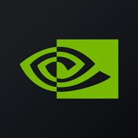

# Altman Z-Score Analysis Platform

**Version: 2.9.0 (2025-06-05)**

A robust, modular Python tool for comprehensive Altman Z-Score trend analysis with LLM-powered qualitative insights. This script orchestrates the analysis pipeline for single or multiple stock tickers.

---

## Architecture Overview
1. **Input Layer:** Accepts ticker(s) and analysis date; validates input.
2. **Data Fetching Layer:** Fetches financials (SEC EDGAR/XBRL) and market data (Yahoo Finance).
3. **Validation Layer:** Validates raw data using Pydantic schemas; reports missing/invalid fields.
4. **Computation Layer:** Computes Altman Z-Score using validated data; returns result object.
5. **Reporting Layer:** Outputs results to CSV, JSON, or stdout; logs all steps and errors.

### Key Principles
- **Modularity:** Each phase is implemented as a separate, testable module.
- **Robustness:** Strong error handling, logging, and data validation at every step.
- **Extensibility:** Easy to add new data sources, models, or output formats.
- **Testability:** Each module is independently testable with clear interfaces.

### Data Sources
- **Primary:** Yahoo Finance (real-time financials and market data)
- **Fallback:** SEC EDGAR/XBRL (official regulatory filings)
- **Executive Data:** Multi-source aggregation for comprehensive profiles

### Output Structure
All outputs are saved to `output/<TICKER>/`:
- `zscore_<TICKER>_zscore_full_report.md` (comprehensive analysis with LLM insights)
- `zscore_<TICKER>_trend.png` (trend visualization chart)
- `zscore_<TICKER>.csv` and `.json` (raw analytical data)
- `<TICKER>_NOT_AVAILABLE.txt` (marker for unavailable tickers)

---

## Usage
To analyze one or more stocks, run:
```sh
python main.py <TICKER1> <TICKER2> ... [--start YYYY-MM-DD] [--no-plot] [--test] [--log-level DEBUG]
```

Examples:
```sh
python main.py AAPL MSFT TSLA
python main.py TSLA --start 2023-01-01
python main.py AAPL MSFT --no-plot
python main.py --test
python main.py --log-level DEBUG
```
Replace `<TICKER1> <TICKER2> ...` with one or more stock ticker symbols (e.g., `AAPL`, `MSFT`).

---

## Sample Reports

The following table shows available reports for all analyzed tickers:

| Logo | Company Name | Full Report | Trend Chart |
|------|-------------|-------------|-------------|
|  | Apple Inc | [Report](output/AAPL/zscore_AAPL_zscore_full_report.md) | [Chart](output/AAPL/zscore_AAPL_trend.png) |
|  | Amazon.com Inc | [Report](output/AMZN/zscore_AMZN_zscore_full_report.md) | [Chart](output/AMZN/zscore_AMZN_trend.png) |
|  | Alibaba Group Holding Ltd | [Report](output/BABA/zscore_BABA_zscore_full_report.md) | [Chart](output/BABA/zscore_BABA_trend.png) |
|  | Baidu Inc | [Report](output/BIDU/zscore_BIDU_zscore_full_report.md) | [Chart](output/BIDU/zscore_BIDU_trend.png) |
|  | Caterpillar Inc | [Report](output/CAT/zscore_CAT_zscore_full_report.md) | [Chart](output/CAT/zscore_CAT_trend.png) |
|  | Carvana Co | [Report](output/CVNA/zscore_CVNA_zscore_full_report.md) | [Chart](output/CVNA/zscore_CVNA_trend.png) |
|  | Duke Energy Corp | [Report](output/DUK/zscore_DUK_zscore_full_report.md) | [Chart](output/DUK/zscore_DUK_trend.png) |
|  | Alphabet Inc | [Report](output/GOOGL/zscore_GOOGL_zscore_full_report.md) | [Chart](output/GOOGL/zscore_GOOGL_trend.png) |
|  | JPMorgan Chase & Co | [Report](output/JPM/zscore_JPM_zscore_full_report.md) | [Chart](output/JPM/zscore_JPM_trend.png) |
|  | MercadoLibre Inc | [Report](output/MELI/zscore_MELI_zscore_full_report.md) | [Chart](output/MELI/zscore_MELI_trend.png) |
|  | Microsoft Corp | [Report](output/MSFT/zscore_MSFT_zscore_full_report.md) | [Chart](output/MSFT/zscore_MSFT_trend.png) |
|  | NetEase Inc | [Report](output/NTES/zscore_NTES_zscore_full_report.md) | [Chart](output/NTES/zscore_NTES_trend.png) |
|  | NVIDIA Corp | [Report](output/NVDA/zscore_NVDA_zscore_full_report.md) | [Chart](output/NVDA/zscore_NVDA_trend.png) |
|  | Procter & Gamble Co | [Report](output/PG/zscore_PG_zscore_full_report.md) | [Chart](output/PG/zscore_PG_trend.png) |
|  | Palantir Technologies Inc | [Report](output/PLTR/zscore_PLTR_zscore_full_report.md) | [Chart](output/PLTR/zscore_PLTR_trend.png) |
|  | Shopify Inc | [Report](output/SHOP/zscore_SHOP_zscore_full_report.md) | [Chart](output/SHOP/zscore_SHOP_trend.png) |
|  | Snowflake Inc | [Report](output/SNOW/zscore_SNOW_zscore_full_report.md) | [Chart](output/SNOW/zscore_SNOW_trend.png) |
|  | Sonos Inc | [Report](output/SONO/zscore_SONO_zscore_full_report.md) | [Chart](output/SONO/zscore_SONO_trend.png) |
|  | Tesla Inc | [Report](output/TSLA/zscore_TSLA_zscore_full_report.md) | [Chart](output/TSLA/zscore_TSLA_trend.png) |
|  | Uber Technologies Inc | [Report](output/UBER/zscore_UBER_zscore_full_report.md) | [Chart](output/UBER/zscore_UBER_trend.png) |
|  | UnitedHealth Group Inc | [Report](output/UNH/zscore_UNH_zscore_full_report.md) | [Chart](output/UNH/zscore_UNH_trend.png) |
|  | Walmart Inc | [Report](output/WMT/zscore_WMT_zscore_full_report.md) | [Chart](output/WMT/zscore_WMT_trend.png) |

---

## Documentation & Release Process
- Version numbers and changelogs are up to date in documentation
- See `PLAN.md` and `TODO.md` for roadmap and actionable tasks
- See `LEARNINGS.md` for technical notes and known issues

---

## Environment Setup
- Copy `.env.example` to `.env` and fill in your API keys and configuration
- Install dependencies:
  ```sh
  pip install -r requirements.txt
  ```
- Use Python 3.11+ (see virtual environment setup instructions below)

---

## Development & Contribution
- All changes must pass existing and new tests
- New features require updated tests and documentation
- See `PLAN.md` for the feature roadmap and major decisions
- See `TODO.md` for actionable tasks and environment setup
- Document significant learnings in `LEARNINGS.md`

---

## License
MIT (see LICENSE file)

---

## Data/API Credits & Disclaimers

This project uses data and APIs from the following sources:
- **Yahoo Finance** (yfinance): Market data and financials. Not affiliated with or endorsed by Yahoo. Data may be delayed or incomplete. See Yahoo's terms of use.
- **Finnhub.io**: Company profiles, logos, and additional financial data. Not affiliated with or endorsed by Finnhub. Data provided under Finnhub's free and paid API terms.
- **SEC EDGAR/XBRL**: Official regulatory filings. Data is public domain but may be subject to update delays or errors.

**Disclaimers:**
- All trademarks, service marks, and company names are the property of their respective owners.
- This project is not affiliated with, endorsed by, or sponsored by Yahoo, Finnhub, the SEC, or any other data provider.
- Data is provided "as is" for informational and educational purposes only. No warranty is made as to accuracy, completeness, or timeliness. Use at your own risk.
- Always consult the official data provider's terms of service and licensing before commercial use.

---

For more details, see the full documentation in this repository and referenced files.
