# Altman Z-Score Analysis Platform

**Version: 3.5.0 (2025-06-17) 🥇 Golden Release**

A robust Python tool for comprehensive Altman Z-Score financial analysis with AI-powered insights. Features **47 pre-analyzed companies** with complete **CEO/CFO/Investor guidance matrix** - the industry's most comprehensive stakeholder decision support table.

---

## Quick Start

```sh
# Analyze a single company
python main.py MSFT

# Analyze with specific date
python main.py AAPL --date 2024-01-01

# Multiple companies
python main.py AAPL MSFT TSLA

# Generate portfolio table
python generate_readme_table.py
```

## Key Features

- **� Actionable Portfolio Table:** Immediate investment recommendations with visual indicators
- **🤖 AI-Powered Analysis:** LLM-generated comprehensive financial health reports  
- **� Professional Visualization:** Company-branded charts with trend analysis
- **🔄 Robust Data Pipeline:** SEC EDGAR + Yahoo Finance integration with error handling
- **🏢 47-Company Portfolio:** Real-world examples across 5 market segments

## Output Structure
All analysis saved to `output/<TICKER>/`:
- **Full Report:** `zscore_<TICKER>_zscore_full_report.md` (AI analysis + recommendations)
- **Trend Chart:** `zscore_<TICKER>_trend.png` (visual Z-Score analysis)
- **Data Files:** CSV/JSON with quarterly calculations and metadata

---

## 📊 Portfolio Analysis - 47 Companies

Strategic test portfolio demonstrating platform capabilities across market segments:

**🚀 Tech Giants (7):** AAPL, MSFT, NVDA, GOOGL, GOOG, AMZN, META  
**📈 High-Growth SaaS (12):** SNOW, PLTR, UBER, DDOG, DOCU, CRWD, NET, MDB, SHOP, ROKU, RBLX, ZM  
**🏦 Financial Services (3):** JPM, COIN, AFRM  
**⚠️ Distressed/Cyclical (8):** AAL, UAL, AMC, CCL, F, GE, GME, T  
**🏭 Established Industrials (17):** JNJ, PG, KO, UNH, VZ, WMT, CAT, DUK, ADP, SLB, and others

### Portfolio Table

**Recommendations by Role:**
- **CEO**: Strategic leadership focus • **CFO**: Financial strategy focus • **Conservative**: Capital Preservation • **Dividend**: Income-focused  
- **Value**: Value investing • **Growth**: Capital Appreciation  
- **Aggressive**: High-risk growth • **Short-Seller**: Bearish positions  
- **📈 BUY** • **⚖️ HOLD** • **📉 SELL**

**CEO Recommendations:** 🚀 FOCUS INNOVATION • 📢 COMMUNICATE GROWTH • 🔧 RESTRUCTURE • ⚡ EXECUTION FOCUS • 🎯 STRATEGIC FOCUS  
**CFO Recommendations:** 💰 OPTIMIZE & INVEST • 💰 OPTIMIZE CAPITAL • 📊 STRATEGIC INVEST • 📊 MONITOR CAPITAL • ⚖️ MAINTAIN STABILITY

<!-- BEGIN_TICKERS_TABLE -->
| Logo | Company Name | Full Report | Trend Chart | CEO/CFO & Investor Advice |
|------|-------------|-------------|:-------------:|:---------------------------:|
|  | American Airlines Group Inc | [Report](output/AAL/zscore_AAL_zscore_full_report.md) | <a href="output/AAL/zscore_AAL_trend.png">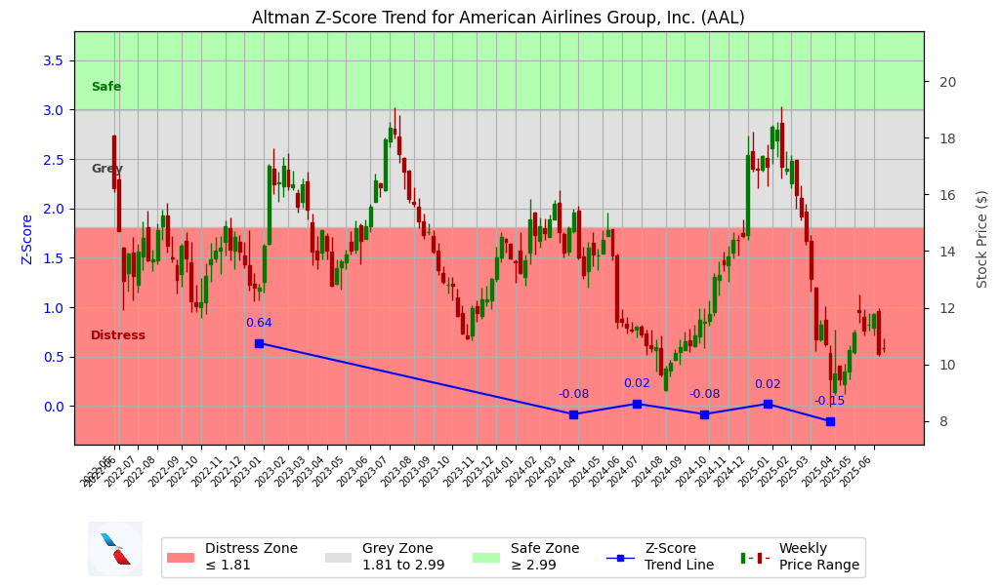</a> | **CEO**: 🔧 RESTRUCTURE<br>**CFO**: 💰 OPTIMIZE CAPITAL<br>**Conservative**: 📉 SELL<br>**Dividend**: 📉 SELL<br>**Value**: ⚖️ HOLD<br>**Growth**: 📉 SELL<br>**Aggressive**: ⚖️ HOLD<br>**Short-Seller**: 📈 BUY |
|  | Apple Inc | [Report](output/AAPL/zscore_AAPL_zscore_full_report.md) | <a href="output/AAPL/zscore_AAPL_trend.png"></a> | **CEO**: 🚀 FOCUS INNOVATION<br>**CFO**: 💰 OPTIMIZE & INVEST<br>**Conservative**: 📈 BUY<br>**Dividend**: ⚖️ HOLD<br>**Value**: 📈 BUY<br>**Growth**: 📈 BUY<br>**Aggressive**: 📈 BUY<br>**Short-Seller**: 📉 SELL |
|  | Automatic Data Processing Inc | [Report](output/ADP/zscore_ADP_zscore_full_report.md) | <a href="output/ADP/zscore_ADP_trend.png">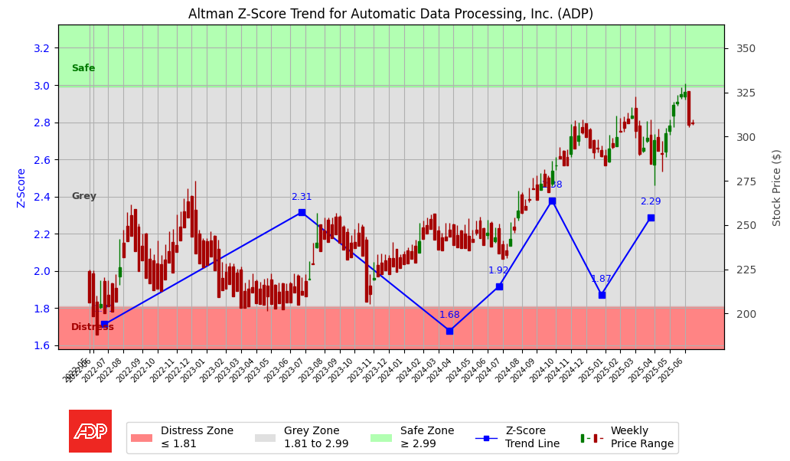</a> | **CEO**: 📢 COMMUNICATE GROWTH<br>**CFO**: 💰 OPTIMIZE CAPITAL<br>**Conservative**: ⚖️ HOLD<br>**Dividend**: ⚖️ HOLD<br>**Value**: ⚖️ HOLD<br>**Growth**: 📈 BUY<br>**Aggressive**: ⚖️ HOLD<br>**Short-Seller**: ⚖️ HOLD |
|  | Affirm Holdings Inc | [Report](output/AFRM/zscore_AFRM_zscore_full_report.md) | <a href="output/AFRM/zscore_AFRM_trend.png">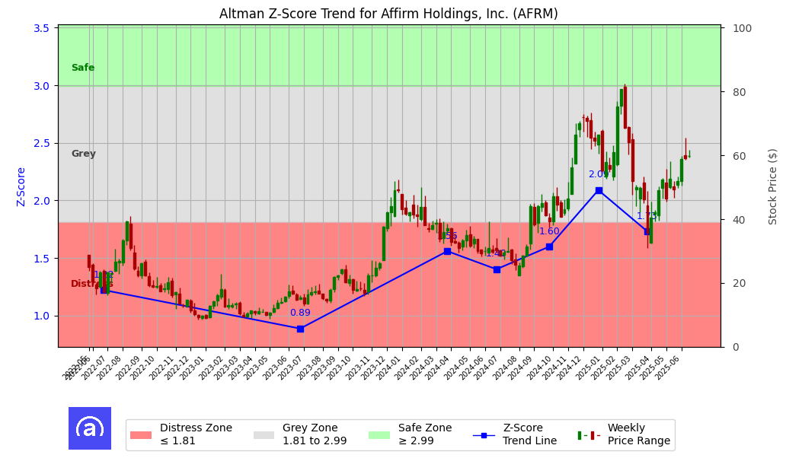</a> | **CEO**: 📢 COMMUNICATE GROWTH<br>**CFO**: 💰 OPTIMIZE CAPITAL<br>**Conservative**: 📉 SELL<br>**Dividend**: 📉 SELL<br>**Value**: ⚖️ HOLD<br>**Growth**: ⚖️ HOLD<br>**Aggressive**: 📈 BUY<br>**Short-Seller**: 📈 BUY |
|  | AMC Entertainment Holdings Inc | [Report](output/AMC/zscore_AMC_zscore_full_report.md) | <a href="output/AMC/zscore_AMC_trend.png">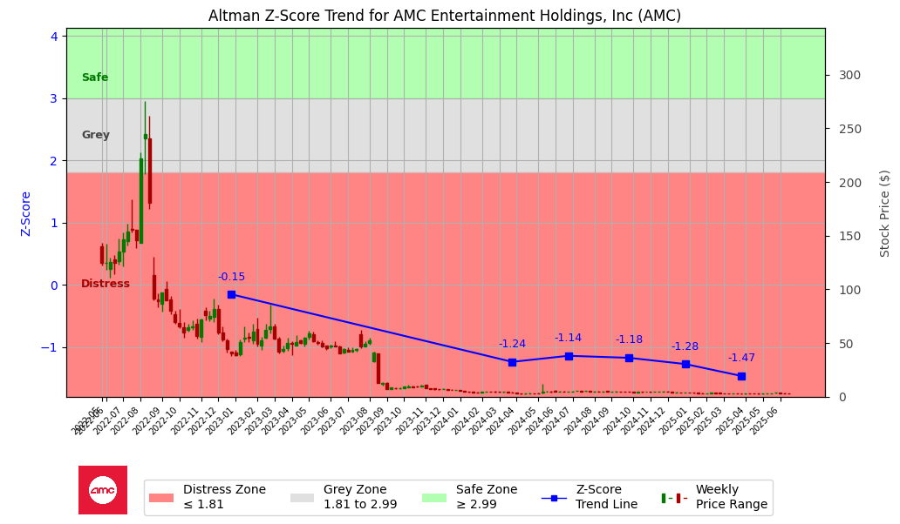</a> | **CEO**: 🔧 RESTRUCTURE<br>**CFO**: 💰 OPTIMIZE CAPITAL<br>**Conservative**: 📉 SELL<br>**Dividend**: 📉 SELL<br>**Value**: ⚖️ HOLD<br>**Growth**: 📉 SELL<br>**Aggressive**: 📉 SELL<br>**Short-Seller**: 📉 SELL |
|  | Amazon.com Inc | [Report](output/AMZN/zscore_AMZN_zscore_full_report.md) | <a href="output/AMZN/zscore_AMZN_trend.png">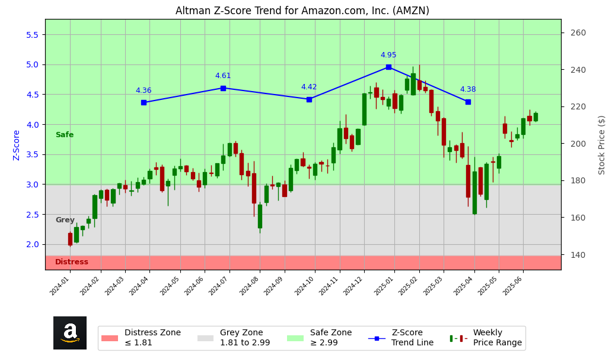</a> | **CEO**: 📢 COMMUNICATE GROWTH<br>**CFO**: 💰 OPTIMIZE & INVEST<br>**Conservative**: ⚖️ HOLD<br>**Dividend**: ⚖️ HOLD<br>**Value**: 📈 BUY<br>**Growth**: 📈 BUY<br>**Aggressive**: 📈 BUY<br>**Short-Seller**: 📉 SELL |
|  | Caterpillar Inc | [Report](output/CAT/zscore_CAT_zscore_full_report.md) | <a href="output/CAT/zscore_CAT_trend.png">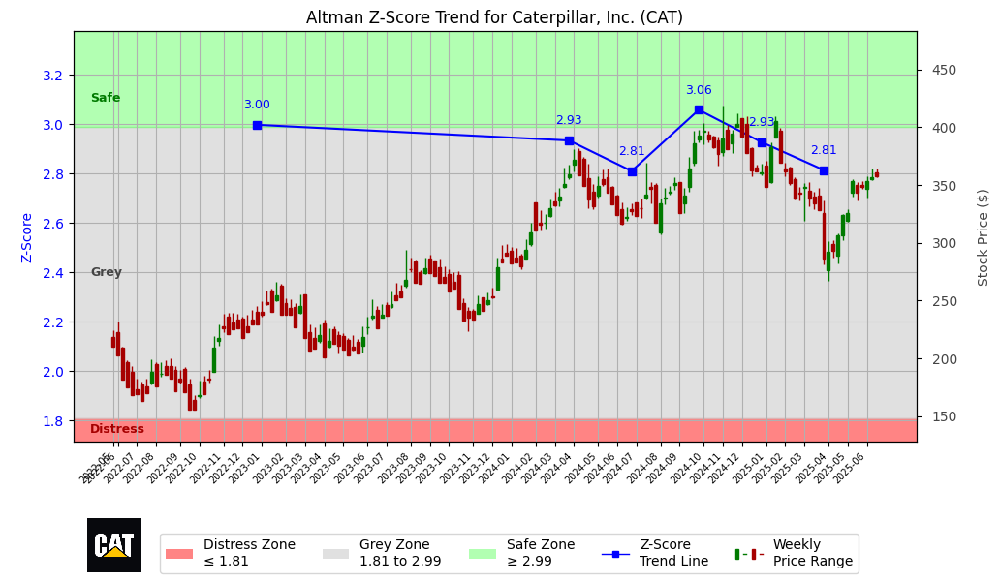</a> | **CEO**: 📢 COMMUNICATE GROWTH<br>**CFO**: 💰 OPTIMIZE CAPITAL<br>**Conservative**: ⚖️ HOLD<br>**Dividend**: ⚖️ HOLD<br>**Value**: ⚖️ HOLD<br>**Growth**: 📈 BUY<br>**Aggressive**: 📈 BUY<br>**Short-Seller**: ⚖️ HOLD |
|  | Carnival Corp | [Report](output/CCL/zscore_CCL_zscore_full_report.md) | <a href="output/CCL/zscore_CCL_trend.png">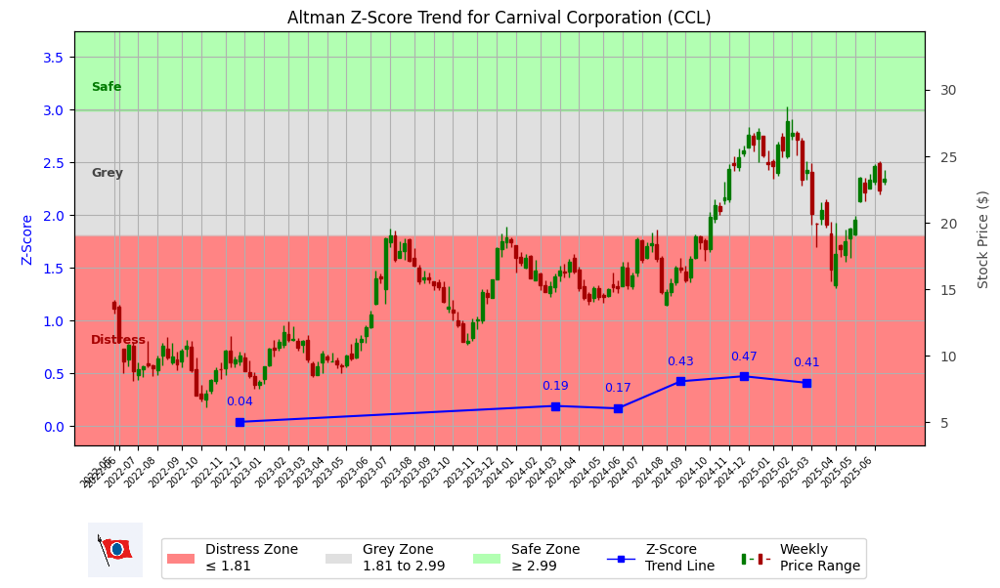</a> | **CEO**: 🔧 RESTRUCTURE<br>**CFO**: 📊 MONITOR CAPITAL<br>**Conservative**: 📉 SELL<br>**Dividend**: 📉 SELL<br>**Value**: ⚖️ HOLD<br>**Growth**: ⚖️ HOLD<br>**Aggressive**: 📈 BUY<br>**Short-Seller**: 📉 SELL |
|  | Coinbase Global Inc | [Report](output/COIN/zscore_COIN_zscore_full_report.md) | <a href="output/COIN/zscore_COIN_trend.png">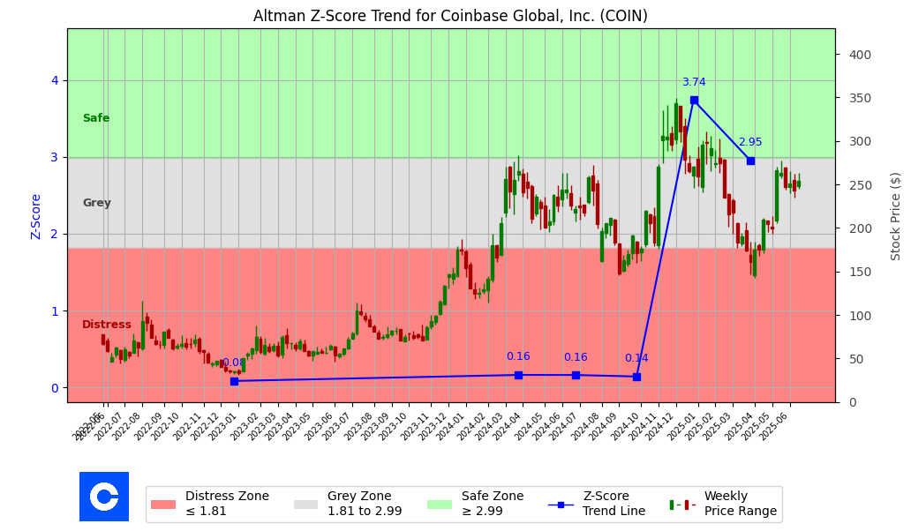</a> | **CEO**: 🔧 RESTRUCTURE<br>**CFO**: 💰 OPTIMIZE CAPITAL<br>**Conservative**: ⚖️ HOLD<br>**Dividend**: ⚖️ HOLD<br>**Value**: ⚖️ HOLD<br>**Growth**: 📈 BUY<br>**Aggressive**: 📈 BUY<br>**Short-Seller**: ⚖️ HOLD |
|  | CrowdStrike Holdings Inc | [Report](output/CRWD/zscore_CRWD_zscore_full_report.md) | <a href="output/CRWD/zscore_CRWD_trend.png">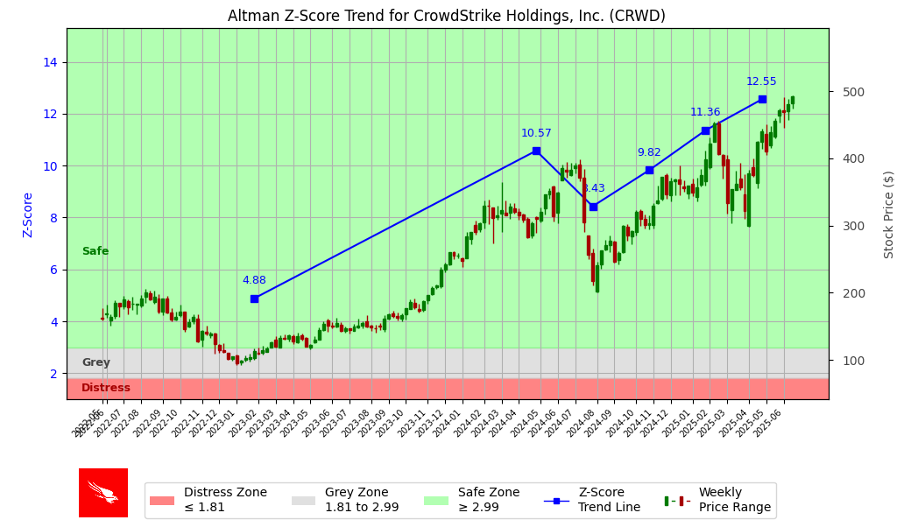</a> | **CEO**: 📢 COMMUNICATE GROWTH<br>**CFO**: 💰 OPTIMIZE & INVEST<br>**Conservative**: 📈 BUY<br>**Dividend**: ⚖️ HOLD<br>**Value**: 📈 BUY<br>**Growth**: 📈 BUY<br>**Aggressive**: 📈 BUY<br>**Short-Seller**: 📉 SELL |
|  | Datadog Inc | [Report](output/DDOG/zscore_DDOG_zscore_full_report.md) | <a href="output/DDOG/zscore_DDOG_trend.png">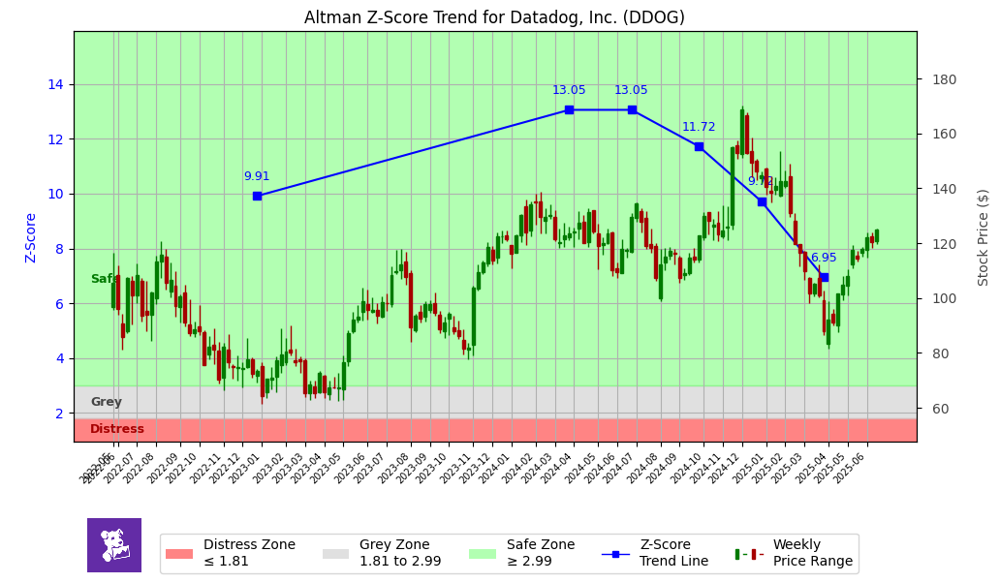</a> | **CEO**: 📢 COMMUNICATE GROWTH<br>**CFO**: 💰 OPTIMIZE CAPITAL<br>**Conservative**: 📈 BUY<br>**Dividend**: ⚖️ HOLD<br>**Value**: 📈 BUY<br>**Growth**: 📈 BUY<br>**Aggressive**: 📈 BUY<br>**Short-Seller**: ⚖️ HOLD |
|  | DocuSign Inc | [Report](output/DOCU/zscore_DOCU_zscore_full_report.md) | <a href="output/DOCU/zscore_DOCU_trend.png">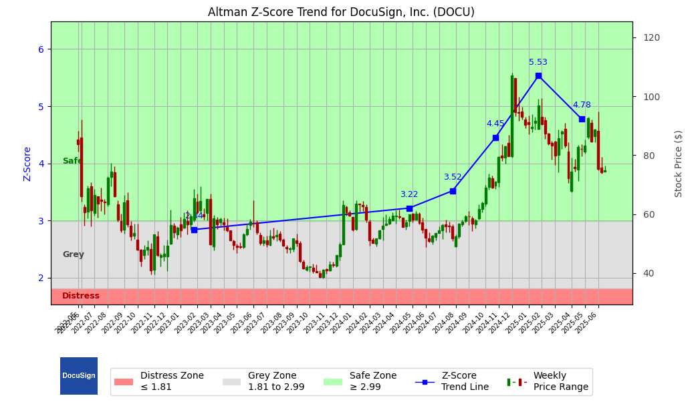</a> | **CEO**: 📢 COMMUNICATE GROWTH<br>**CFO**: 💰 OPTIMIZE CAPITAL<br>**Conservative**: ⚖️ HOLD<br>**Dividend**: ⚖️ HOLD<br>**Value**: 📈 BUY<br>**Growth**: 📈 BUY<br>**Aggressive**: 📈 BUY<br>**Short-Seller**: ⚖️ HOLD |
|  | Duke Energy Corp | [Report](output/DUK/zscore_DUK_zscore_full_report.md) | <a href="output/DUK/zscore_DUK_trend.png">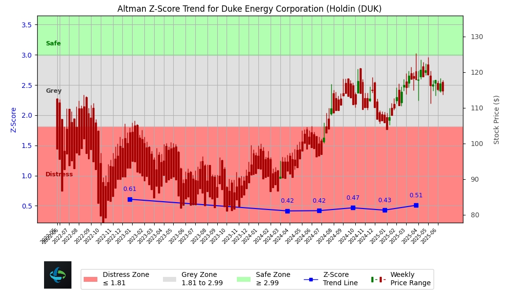</a> | **CEO**: 🔧 RESTRUCTURE<br>**CFO**: 💰 OPTIMIZE CAPITAL<br>**Conservative**: 📉 SELL<br>**Dividend**: 📉 SELL<br>**Value**: ⚖️ HOLD<br>**Growth**: ⚖️ HOLD<br>**Aggressive**: ⚖️ HOLD<br>**Short-Seller**: 📉 SELL |
|  | Ford Motor Co | [Report](output/F/zscore_F_zscore_full_report.md) | <a href="output/F/zscore_F_trend.png">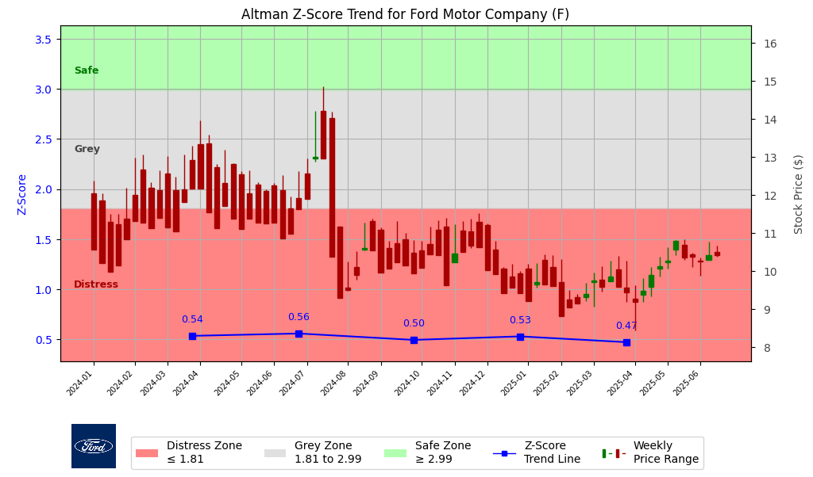</a> | **CEO**: 🔧 RESTRUCTURE<br>**CFO**: 📊 MONITOR CAPITAL<br>**Conservative**: 📉 SELL<br>**Dividend**: 📉 SELL<br>**Value**: ⚖️ HOLD<br>**Growth**: ⚖️ HOLD<br>**Aggressive**: 📉 SELL<br>**Short-Seller**: 📈 BUY |
|  | GE Aerospace | [Report](output/GE/zscore_GE_zscore_full_report.md) | <a href="output/GE/zscore_GE_trend.png">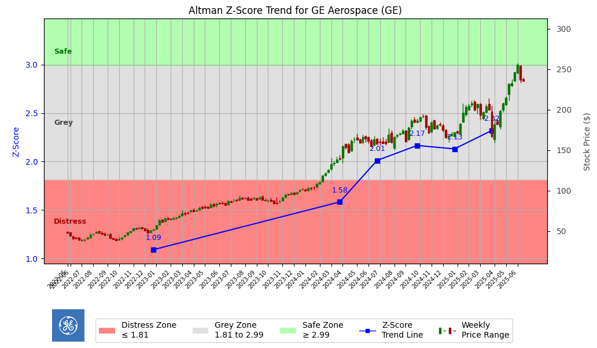</a> | **CEO**: 📢 COMMUNICATE GROWTH<br>**CFO**: 💰 OPTIMIZE CAPITAL<br>**Conservative**: ⚖️ HOLD<br>**Dividend**: ⚖️ HOLD<br>**Value**: 📈 BUY<br>**Growth**: 📈 BUY<br>**Aggressive**: 📈 BUY<br>**Short-Seller**: ⚖️ HOLD |
|  | GameStop Corp | [Report](output/GME/zscore_GME_zscore_full_report.md) | <a href="output/GME/zscore_GME_trend.png">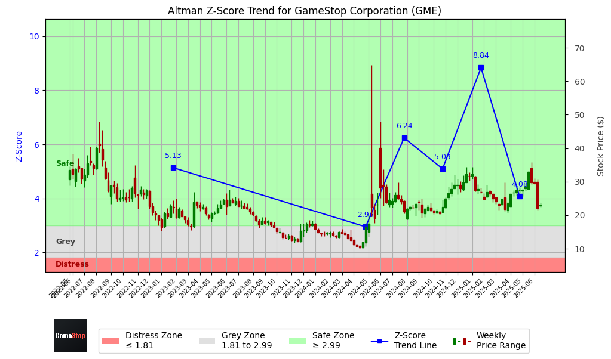</a> | **CEO**: 📢 COMMUNICATE GROWTH<br>**CFO**: 💰 OPTIMIZE CAPITAL<br>**Conservative**: 📈 BUY<br>**Dividend**: ⚖️ HOLD<br>**Value**: 📈 BUY<br>**Growth**: 📈 BUY<br>**Aggressive**: 📈 BUY<br>**Short-Seller**: ⚖️ HOLD |
|  | Alphabet Inc | [Report](output/GOOG/zscore_GOOG_zscore_full_report.md) | <a href="output/GOOG/zscore_GOOG_trend.png">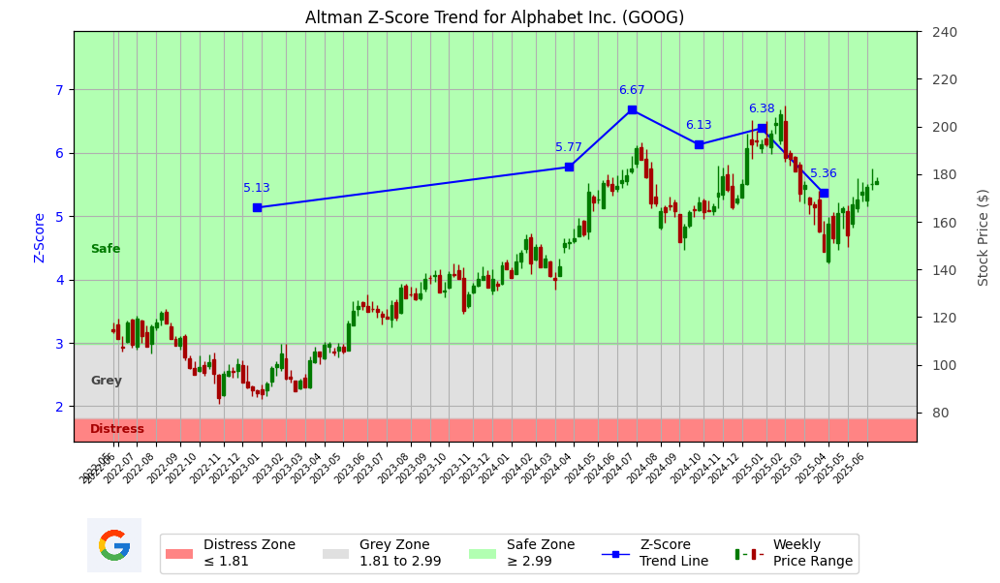</a> | **CEO**: 📢 COMMUNICATE GROWTH<br>**CFO**: 💰 OPTIMIZE CAPITAL<br>**Conservative**: ⚖️ HOLD<br>**Dividend**: ⚖️ HOLD<br>**Value**: 📈 BUY<br>**Growth**: 📈 BUY<br>**Aggressive**: 📈 BUY<br>**Short-Seller**: 📉 SELL |
|  | Alphabet Inc | [Report](output/GOOGL/zscore_GOOGL_zscore_full_report.md) | <a href="output/GOOGL/zscore_GOOGL_trend.png">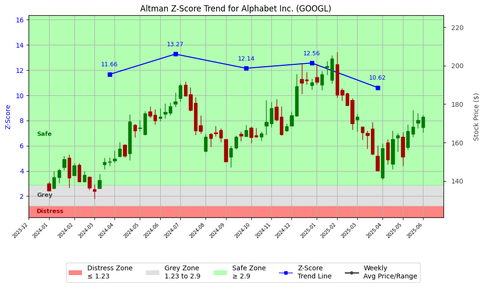</a> | **CEO**: 📢 COMMUNICATE GROWTH<br>**CFO**: 💰 OPTIMIZE CAPITAL<br>**Conservative**: ⚖️ HOLD<br>**Dividend**: ⚖️ HOLD<br>**Value**: 📈 BUY<br>**Growth**: 📈 BUY<br>**Aggressive**: 📈 BUY<br>**Short-Seller**: 📉 SELL |
|  | Johnson & Johnson | [Report](output/JNJ/zscore_JNJ_zscore_full_report.md) | <a href="output/JNJ/zscore_JNJ_trend.png">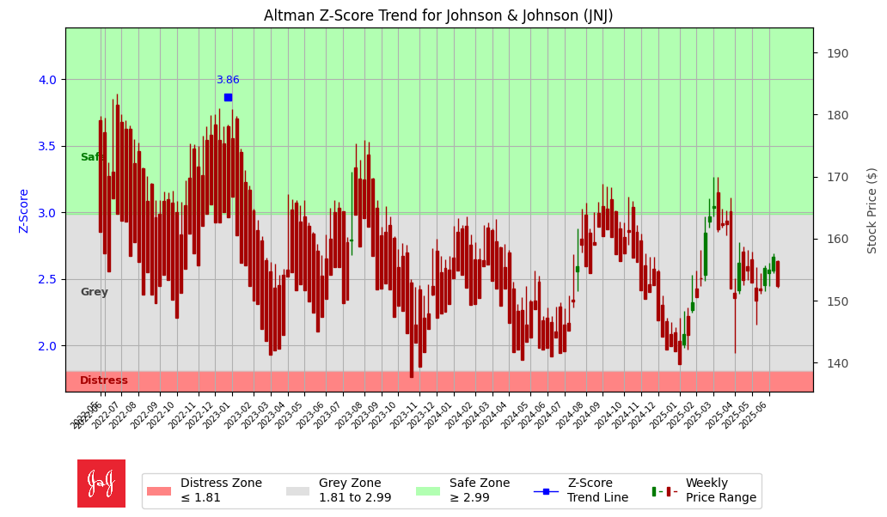</a> | **CEO**: 📢 COMMUNICATE GROWTH<br>**CFO**: 💰 OPTIMIZE CAPITAL<br>**Conservative**: ⚖️ HOLD<br>**Dividend**: 📈 BUY<br>**Value**: 📈 BUY<br>**Growth**: 📈 BUY<br>**Aggressive**: 📈 BUY<br>**Short-Seller**: ⚖️ HOLD |
|  | JPMorgan Chase & Co | [Report](output/JPM/zscore_JPM_zscore_full_report.md) | <a href="output/JPM/zscore_JPM_trend.png">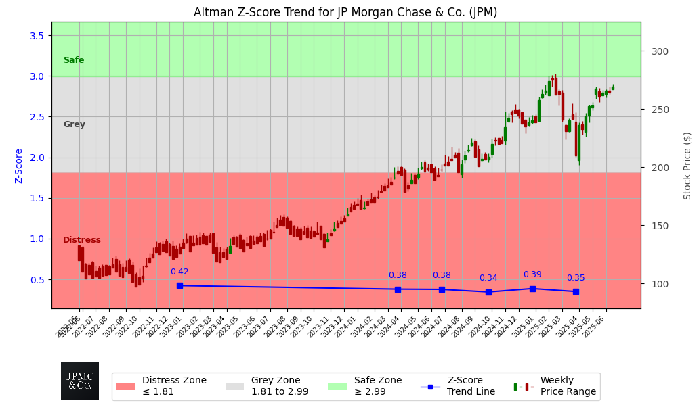</a> | **CEO**: 📢 COMMUNICATE GROWTH<br>**CFO**: 💰 OPTIMIZE CAPITAL<br>**Conservative**: 📉 SELL<br>**Dividend**: 📉 SELL<br>**Value**: ⚖️ HOLD<br>**Growth**: ⚖️ HOLD<br>**Aggressive**: ⚖️ HOLD<br>**Short-Seller**: 📉 SELL |
|  | Coca-Cola Co | [Report](output/KO/zscore_KO_zscore_full_report.md) | <a href="output/KO/zscore_KO_trend.png">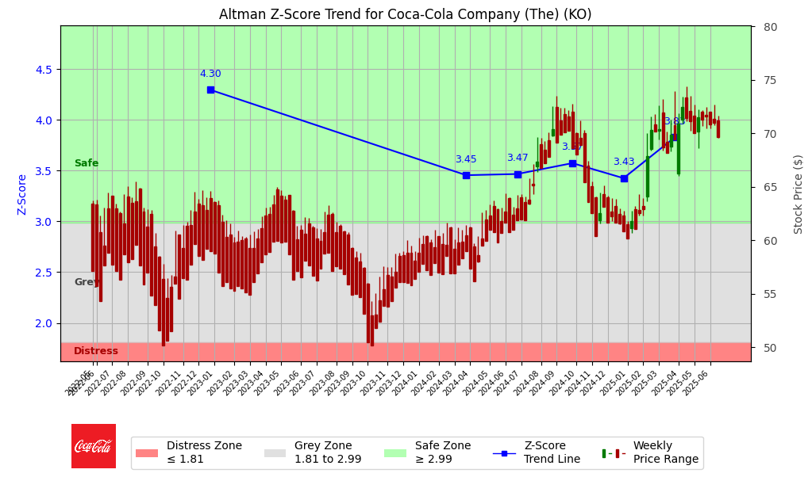</a> | **CEO**: 📢 COMMUNICATE GROWTH<br>**CFO**: 💰 OPTIMIZE & INVEST<br>**Conservative**: ⚖️ HOLD<br>**Dividend**: 📈 BUY<br>**Value**: 📈 BUY<br>**Growth**: 📈 BUY<br>**Aggressive**: 📈 BUY<br>**Short-Seller**: 📉 SELL |
|  | MongoDB Inc | [Report](output/MDB/zscore_MDB_zscore_full_report.md) | <a href="output/MDB/zscore_MDB_trend.png">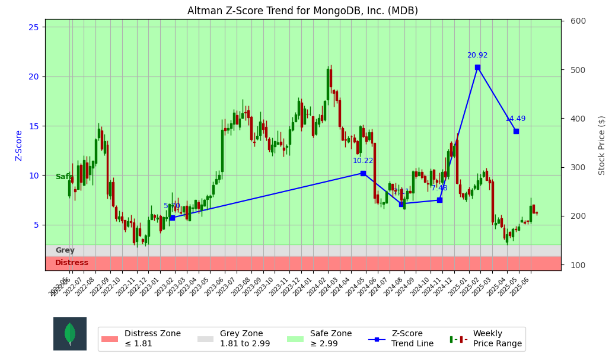</a> | **CEO**: 📢 COMMUNICATE GROWTH<br>**CFO**: 📊 STRATEGIC INVEST<br>**Conservative**: ⚖️ HOLD<br>**Dividend**: ⚖️ HOLD<br>**Value**: 📈 BUY<br>**Growth**: 📈 BUY<br>**Aggressive**: 📈 BUY<br>**Short-Seller**: 📉 SELL |
|  | Microsoft Corp | [Report](output/MSFT/zscore_MSFT_zscore_full_report.md) | <a href="output/MSFT/zscore_MSFT_trend.png">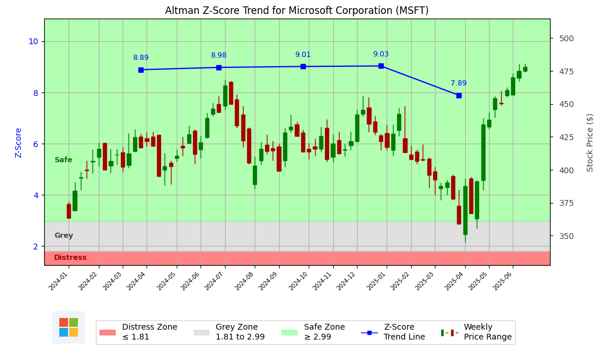</a> | **CEO**: 🚀 INNOVATE & MONITOR<br>**CFO**: 💰 OPTIMIZE & INVEST<br>**Conservative**: 📈 BUY<br>**Dividend**: 📈 BUY<br>**Value**: 📈 BUY<br>**Growth**: 📈 BUY<br>**Aggressive**: 📈 BUY<br>**Short-Seller**: 📉 SELL |
|  | Cloudflare Inc | [Report](output/NET/zscore_NET_zscore_full_report.md) | <a href="output/NET/zscore_NET_trend.png">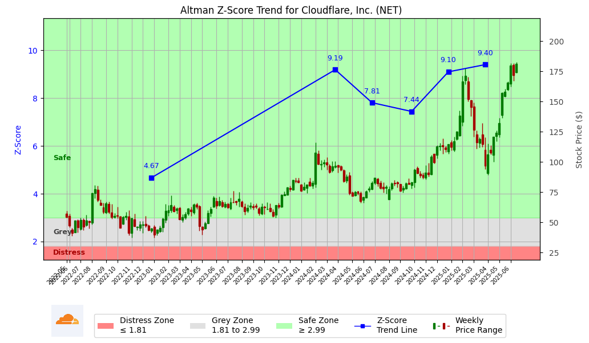</a> | **CEO**: 🚀 FOCUS INNOVATION<br>**CFO**: 💰 OPTIMIZE & INVEST<br>**Conservative**: ⚖️ HOLD<br>**Dividend**: ⚖️ HOLD<br>**Value**: 📈 BUY<br>**Growth**: 📈 BUY<br>**Aggressive**: 📈 BUY<br>**Short-Seller**: 📉 SELL |
|  | NVIDIA Corp | [Report](output/NVDA/zscore_NVDA_zscore_full_report.md) | <a href="output/NVDA/zscore_NVDA_trend.png">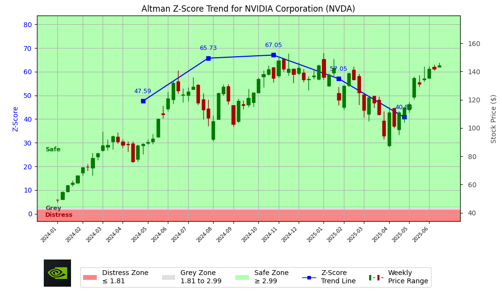</a> | **CEO**: 🚀 INNOVATE & MONITOR<br>**CFO**: 📊 STRATEGIC INVEST<br>**Conservative**: ⚖️ HOLD<br>**Dividend**: ⚖️ HOLD<br>**Value**: 📈 BUY<br>**Growth**: 📈 BUY<br>**Aggressive**: 📈 BUY<br>**Short-Seller**: 📉 SELL |
|  | Procter & Gamble Co | [Report](output/PG/zscore_PG_zscore_full_report.md) | <a href="output/PG/zscore_PG_trend.png"></a> | **CEO**: 📊 MONITOR INDICATORS<br>**CFO**: � PLAN STRATEGY<br>**Conservative**: ⚖️ HOLD<br>**Dividend**: 📈 BUY<br>**Value**: 📈 BUY<br>**Growth**: 📈 BUY<br>**Aggressive**: 📈 BUY<br>**Short-Seller**: 📉 SELL |
|  | Palantir Technologies Inc | [Report](output/PLTR/zscore_PLTR_zscore_full_report.md) | <a href="output/PLTR/zscore_PLTR_trend.png">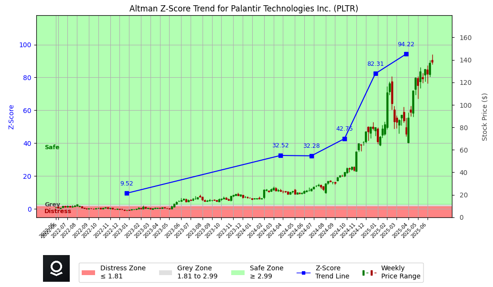</a> | **CEO**: 📢 COMMUNICATE GROWTH<br>**CFO**: 📊 STRATEGIC INVEST<br>**Conservative**: ⚖️ HOLD<br>**Dividend**: ⚖️ HOLD<br>**Value**: 📈 BUY<br>**Growth**: 📈 BUY<br>**Aggressive**: 📈 BUY<br>**Short-Seller**: 📉 SELL |
|  | Roblox Corp | [Report](output/RBLX/zscore_RBLX_zscore_full_report.md) | <a href="output/RBLX/zscore_RBLX_trend.png">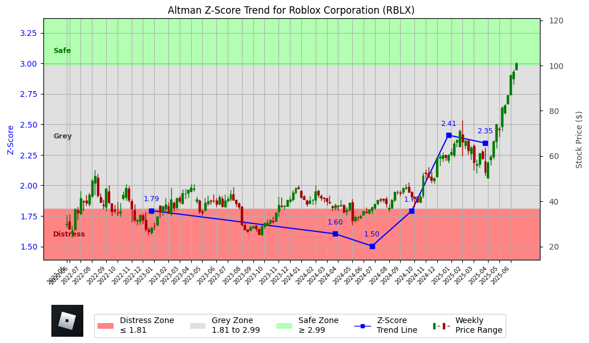</a> | **CEO**: 🔧 RESTRUCTURE<br>**CFO**: 💰 OPTIMIZE CAPITAL<br>**Conservative**: ⚖️ HOLD<br>**Dividend**: ⚖️ HOLD<br>**Value**: ⚖️ HOLD<br>**Growth**: 📈 BUY<br>**Aggressive**: 📈 BUY<br>**Short-Seller**: ⚖️ HOLD |
|  | Roku Inc | [Report](output/ROKU/zscore_ROKU_zscore_full_report.md) | <a href="output/ROKU/zscore_ROKU_trend.png">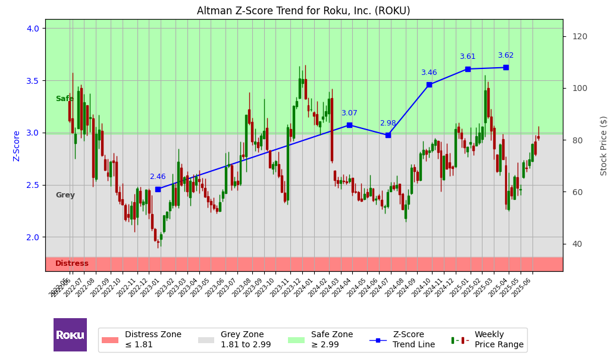</a> | **CEO**: 🚀 FOCUS INNOVATION<br>**CFO**: 💰 OPTIMIZE CAPITAL<br>**Conservative**: ⚖️ HOLD<br>**Dividend**: ⚖️ HOLD<br>**Value**: 📈 BUY<br>**Growth**: 📈 BUY<br>**Aggressive**: 📈 BUY<br>**Short-Seller**: ⚖️ HOLD |
|  | Shopify Inc | [Report](output/SHOP/zscore_SHOP_zscore_full_report.md) | <a href="output/SHOP/zscore_SHOP_trend.png">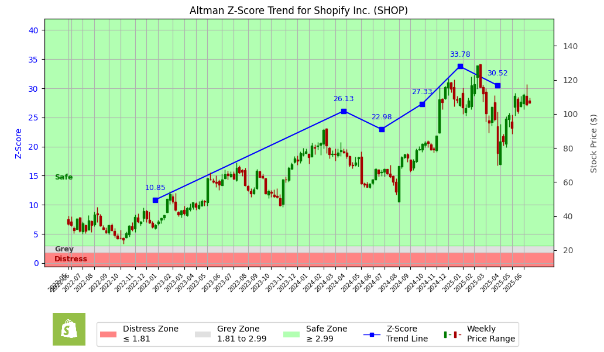</a> | **CEO**: 📊 MONITOR INDICATORS<br>**CFO**: ⚖️ MAINTAIN STABILITY<br>**Conservative**: ⚖️ HOLD<br>**Dividend**: ⚖️ HOLD<br>**Value**: 📈 BUY<br>**Growth**: 📈 BUY<br>**Aggressive**: 📈 BUY<br>**Short-Seller**: 📉 SELL |
|  | Schlumberger NV | [Report](output/SLB/zscore_SLB_zscore_full_report.md) | <a href="output/SLB/zscore_SLB_trend.png">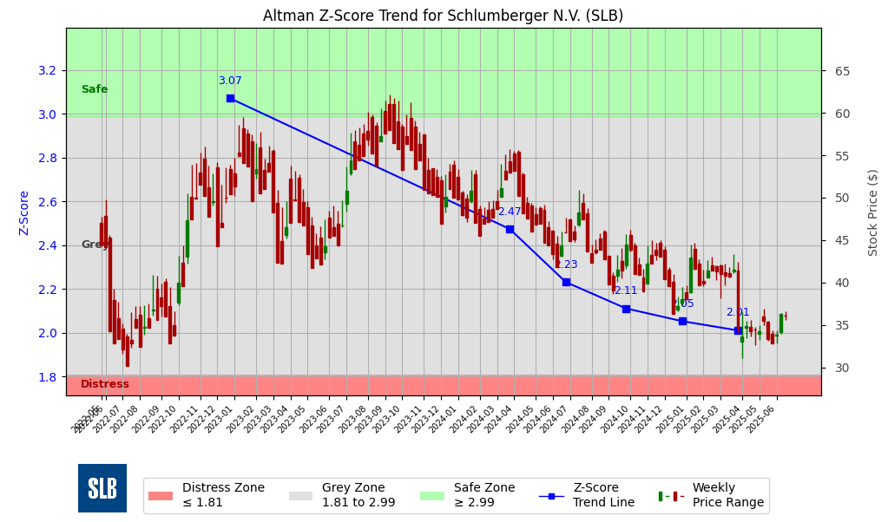</a> | **CEO**: ✂️ COST CONTROL<br>**CFO**: 💰 OPTIMIZE CAPITAL<br>**Conservative**: 📉 SELL<br>**Dividend**: ⚖️ HOLD<br>**Value**: ⚖️ HOLD<br>**Growth**: ⚖️ HOLD<br>**Aggressive**: 📈 BUY<br>**Short-Seller**: ⚖️ HOLD |
|  | Snowflake Inc | [Report](output/SNOW/zscore_SNOW_zscore_full_report.md) | <a href="output/SNOW/zscore_SNOW_trend.png">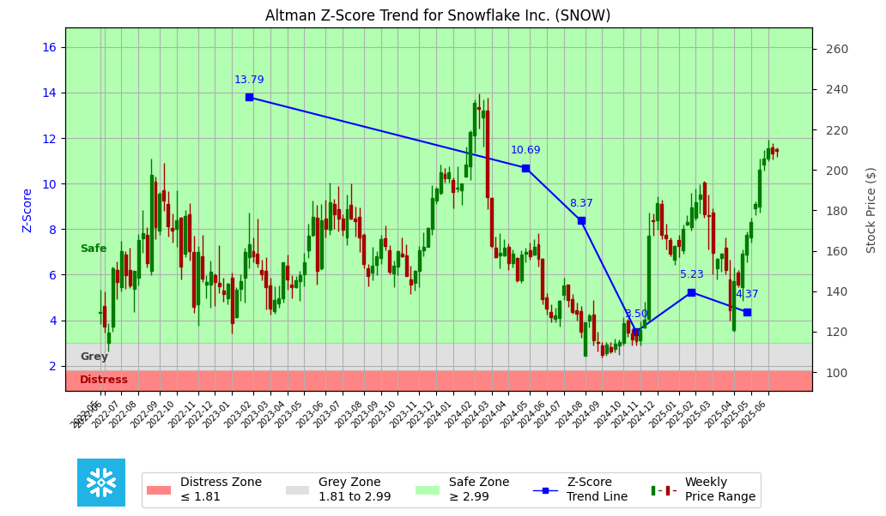</a> | **CEO**: 📢 COMMUNICATE GROWTH<br>**CFO**: 💰 OPTIMIZE CAPITAL<br>**Conservative**: ⚖️ HOLD<br>**Dividend**: ⚖️ HOLD<br>**Value**: 📈 BUY<br>**Growth**: 📈 BUY<br>**Aggressive**: 📈 BUY<br>**Short-Seller**: 📉 SELL |
|  | AT&T Inc | [Report](output/T/zscore_T_zscore_full_report.md) | <a href="output/T/zscore_T_trend.png">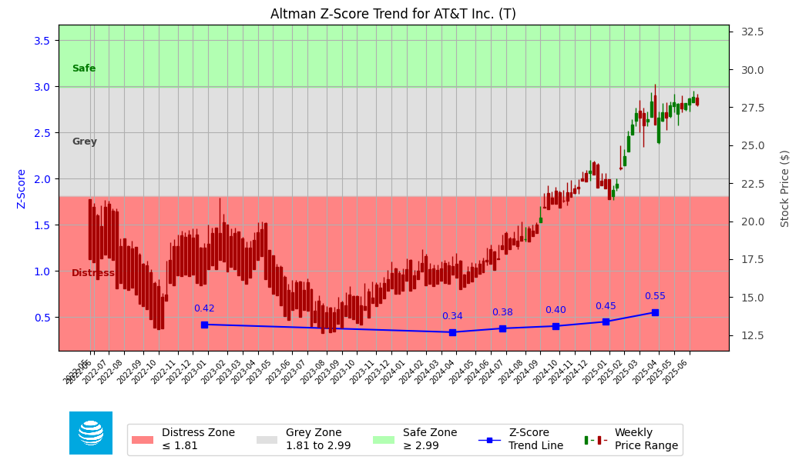</a> | **CEO**: 🔧 RESTRUCTURE<br>**CFO**: 💰 OPTIMIZE CAPITAL<br>**Conservative**: 📉 SELL<br>**Dividend**: 📉 SELL<br>**Value**: ⚖️ HOLD<br>**Growth**: ⚖️ HOLD<br>**Aggressive**: ⚖️ HOLD<br>**Short-Seller**: 📉 SELL |
|  | Tesla Inc | [Report](output/TSLA/zscore_TSLA_zscore_full_report.md) | <a href="output/TSLA/zscore_TSLA_trend.png">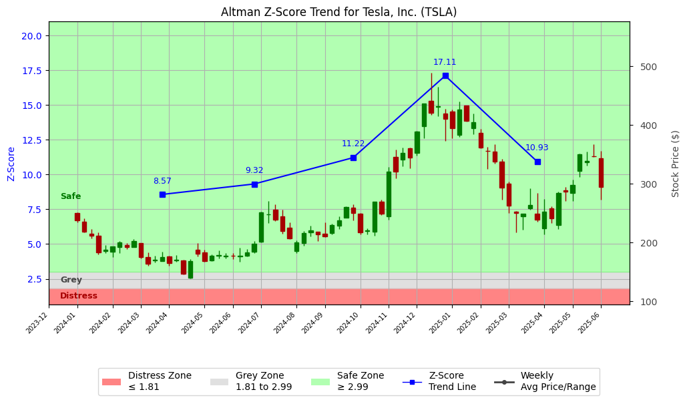</a> | **CEO**: 📊 MONITOR INDICATORS<br>**CFO**: 💰 OPTIMIZE & INVEST<br>**Conservative**: ⚖️ HOLD<br>**Dividend**: ⚖️ HOLD<br>**Value**: 📈 BUY<br>**Growth**: 📈 BUY<br>**Aggressive**: 📈 BUY<br>**Short-Seller**: 📉 SELL |
|  | United Airlines Holdings Inc | [Report](output/UAL/zscore_UAL_zscore_full_report.md) | <a href="output/UAL/zscore_UAL_trend.png">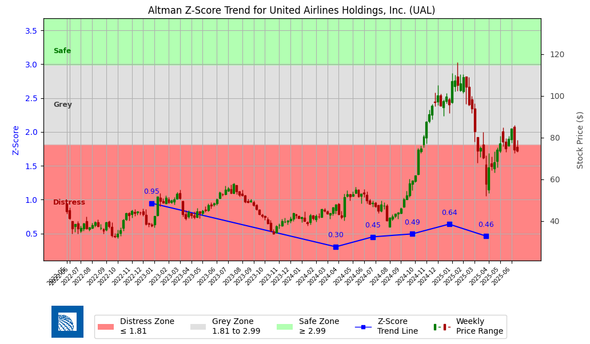</a> | **CEO**: 📢 COMMUNICATE GROWTH<br>**CFO**: 💰 OPTIMIZE CAPITAL<br>**Conservative**: 📉 SELL<br>**Dividend**: 📉 SELL<br>**Value**: ⚖️ HOLD<br>**Growth**: ⚖️ HOLD<br>**Aggressive**: ⚖️ HOLD<br>**Short-Seller**: 📈 BUY |
|  | Uber Technologies Inc | [Report](output/UBER/zscore_UBER_zscore_full_report.md) | <a href="output/UBER/zscore_UBER_trend.png">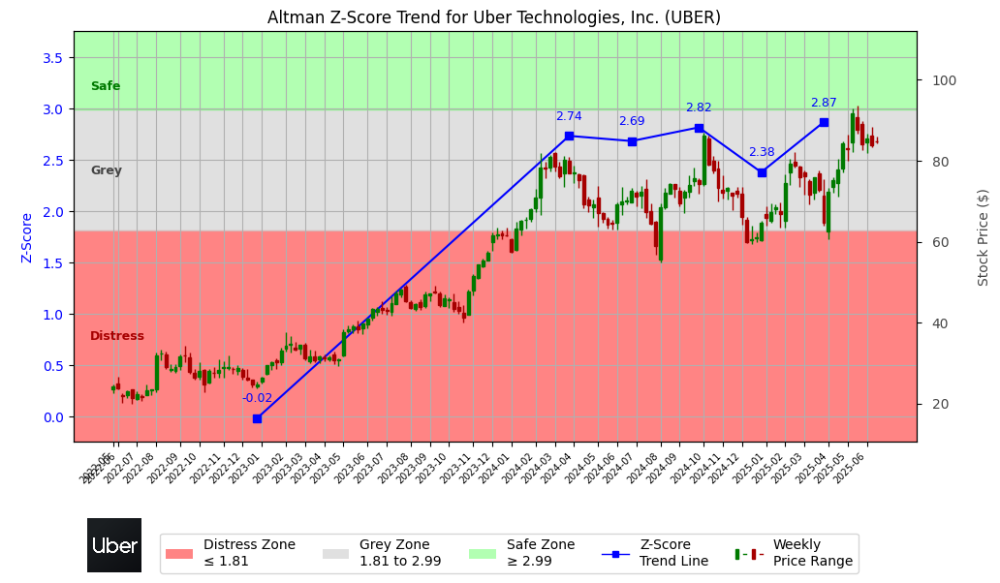</a> | **CEO**: 📢 COMMUNICATE GROWTH<br>**CFO**: 💰 OPTIMIZE CAPITAL<br>**Conservative**: ⚖️ HOLD<br>**Dividend**: ⚖️ HOLD<br>**Value**: ⚖️ HOLD<br>**Growth**: 📈 BUY<br>**Aggressive**: 📈 BUY<br>**Short-Seller**: ⚖️ HOLD |
|  | UnitedHealth Group Inc | [Report](output/UNH/zscore_UNH_zscore_full_report.md) | <a href="output/UNH/zscore_UNH_trend.png">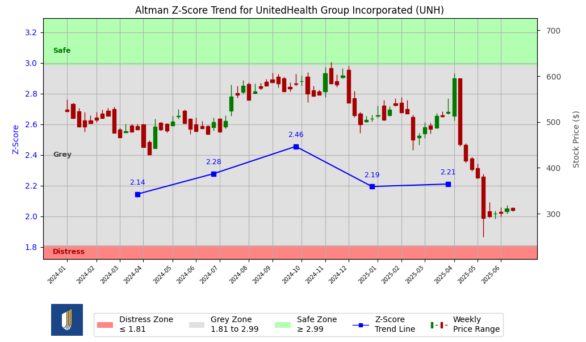</a> | **CEO**: 📢 COMMUNICATE GROWTH<br>**CFO**: 💰 OPTIMIZE CAPITAL<br>**Conservative**: ⚖️ HOLD<br>**Dividend**: 📈 BUY<br>**Value**: 📈 BUY<br>**Growth**: ⚖️ HOLD<br>**Aggressive**: 📈 BUY<br>**Short-Seller**: ⚖️ HOLD |
|  | Verizon Communications Inc | [Report](output/VZ/zscore_VZ_zscore_full_report.md) | <a href="output/VZ/zscore_VZ_trend.png">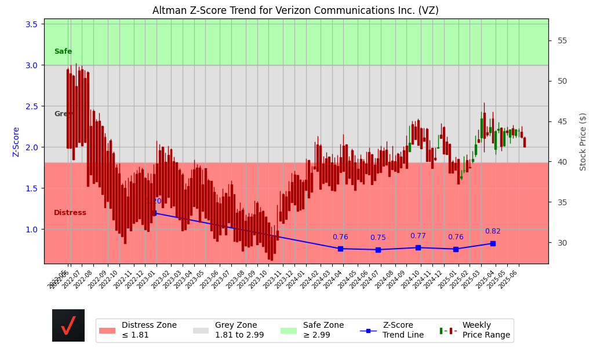</a> | **CEO**: 🔧 RESTRUCTURE<br>**CFO**: 💰 OPTIMIZE CAPITAL<br>**Conservative**: 📉 SELL<br>**Dividend**: 📉 SELL<br>**Value**: ⚖️ HOLD<br>**Growth**: ⚖️ HOLD<br>**Aggressive**: ⚖️ HOLD<br>**Short-Seller**: 📉 SELL |
|  | Walmart Inc | [Report](output/WMT/zscore_WMT_zscore_full_report.md) | <a href="output/WMT/zscore_WMT_trend.png">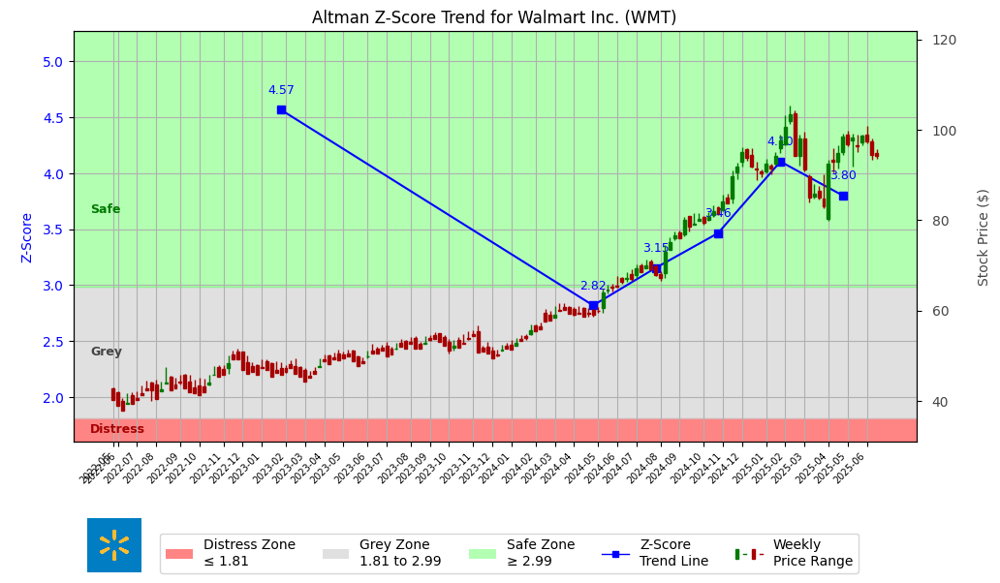</a> | **CEO**: 📢 COMMUNICATE GROWTH<br>**CFO**: 💰 OPTIMIZE CAPITAL<br>**Conservative**: 📈 BUY<br>**Dividend**: 📈 BUY<br>**Value**: ⚖️ HOLD<br>**Growth**: 📈 BUY<br>**Aggressive**: 📈 BUY<br>**Short-Seller**: ⚖️ HOLD |
|  | Zoom Communications Inc | [Report](output/ZM/zscore_ZM_zscore_full_report.md) | <a href="output/ZM/zscore_ZM_trend.png">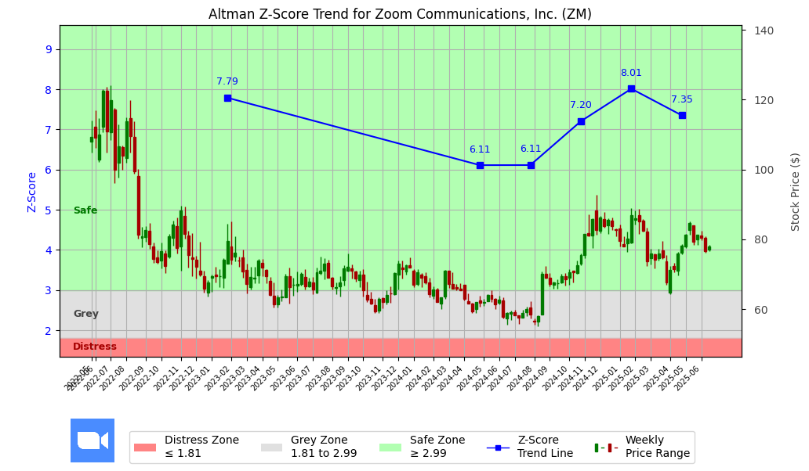</a> | **CEO**: 📢 COMMUNICATE GROWTH<br>**CFO**: 💰 OPTIMIZE & INVEST<br>**Conservative**: 📈 BUY<br>**Dividend**: ⚖️ HOLD<br>**Value**: 📈 BUY<br>**Growth**: 📈 BUY<br>**Aggressive**: 📈 BUY<br>**Short-Seller**: 📉 SELL |
<!-- END_TICKERS_TABLE -->

---

## Table Generation

Update the portfolio table automatically:

```sh
python generate_readme_table.py
```

**Enhanced Features:**
- **Detailed Investor Profiles**: Shows BUY/HOLD/SELL for each investor type
- **Multi-line Format**: Clear, readable recommendations in table cells
- **Professional Layout**: Full profile names with emoji indicators
- **Comprehensive Coverage**: 6 investor profiles per company analysis

**Features:**
- **Profile-Based Recommendations:** Shows BUY/HOLD/SELL for each investor type
- **Conservative to Aggressive:** Covers all risk tolerance levels  
- **Visual Indicators:** 📈 BUY, ⚖️ HOLD, 📉 SELL with compact notation
- **Auto-updates README** between table markers

---

## Setup & Installation

```sh
# Install dependencies
pip install -r requirements.txt

# Copy environment template (add your API keys)
cp .env.example .env

# Test installation
python main.py --test
```

**Requirements:** Python 3.11+

---

## Documentation

- **[TODO.md](./TODO.md)** - Project roadmap and completed milestones
- **[MODELS.md](MODELS.md)** - Z-Score model details and selection logic
- **[LEARNINGS.md](./LEARNINGS.md)** - Technical notes and known issues
- **[CHANGELOG.md](CHANGELOG.md)** - Version history and improvements

---

## License & Data Sources

**License:** MIT (see LICENSE file)

**Data Sources:**
- Yahoo Finance (market data)
- SEC EDGAR (regulatory filings)  
- Finnhub.io (company profiles/logos)

*All trademarks are property of their respective owners. This project is not affiliated with any data provider. Use for educational/informational purposes only.*
