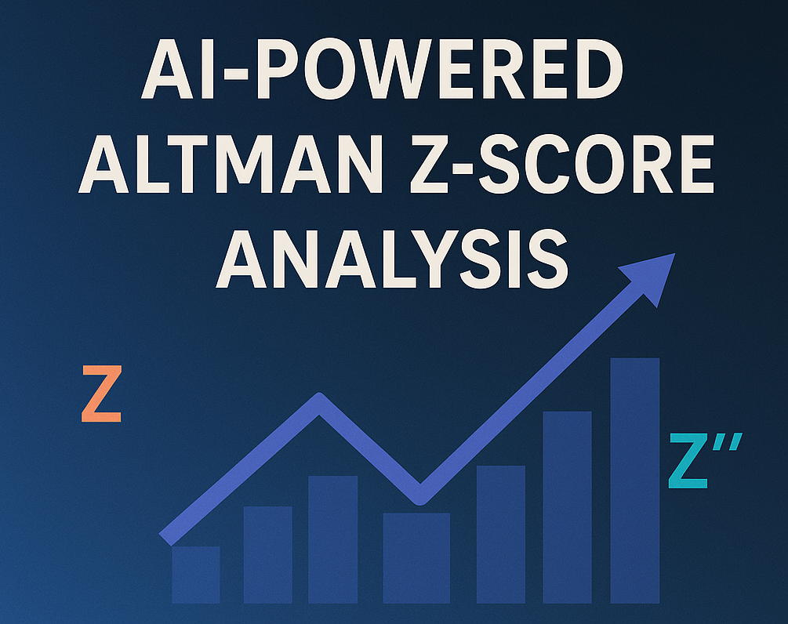

# AI-Powered Altman Z-Score Analysis

**Version: 4.0.0 (2025-06-25) 🚀 Golden Release - Professional Investment Analysis Platform**

Transform your investment decisions with **AI-powered financial health analysis**. Get instant, actionable insights on company bankruptcy risk, investment opportunities, and strategic recommendations with **production-ready multi-quarter analysis**.

## 🚀 **NEW v4.0.0 GOLDEN RELEASE: PROFESSIONAL FEATURES**

### ⚡ **Enhanced Multi-Quarter Analysis**
- **📊 Extended Historical Data:** 4-20+ quarters of Z-Score trend analysis with seasonality detection
- **🎯 Environment-Driven Configuration:** Smart CLI defaults based on your FMP account type and .env settings
- **📈 Enhanced Chart Generation:** Risk zone colored markers, improved visualization, professional formatting
- **🔄 Intelligent Batch Processing:** Optimized individual ticker processing with API rate limiting

### 🎯 **Account-Optimized Experience**
```bash
# CLI automatically adapts to your account type
python main.py AAPL                # Uses intelligent defaults from .env
python main.py AAPL --quarters 8   # Extended analysis for paid accounts

# Large portfolio analysis with enhanced batch script
pwsh.exe -File run_batch_examples.ps1   # Interactive menu with 8 sector groups
```

### 🏢 **Professional Portfolio Analysis**
- **🎯 8 Sector Groups:** 130+ companies across distressed, tech, consumer, industrial, energy, healthcare, mega-cap, and recent IPOs
- **📊 Smart Processing:** Individual ticker processing to respect API limits and ensure reliability
- **⏱️ Rate Limiting:** Intelligent delays between groups and tickers for optimal API usage
- **📈 Comprehensive Coverage:** From distressed companies to mega-cap tech leaders

**📖 See [QUICK_START_ENHANCED.md](QUICK_START_ENHANCED.md) for complete features guide**

---

## 🎯 **What You Get**

### 💡 **Professional Investment Intelligence v4.0.0**
- **🚨 Multi-Quarter Risk Assessment:** Z-Score trend analysis over 4-20+ quarters with predictive insights
- **💡 Investment Recommendations:** Clear BUY/HOLD/SELL guidance with historical context and confidence scoring
- **🤖 AI-Powered Insights:** Comprehensive reports integrating multi-quarter trends and market intelligence
- **⚡ Production-Ready Performance:** Environment-driven configuration with intelligent caching and batch processing

### 💡 **Smart Investment Decisions with Historical Context**
- **🎯 Risk-Adjusted Recommendations:** Tailored advice with multi-quarter trend analysis for all investor profiles
- **📱 Enhanced Interactive Dashboards:** Professional charts with risk zone markers and multi-quarter visualizations
- **🔍 Trend Pattern Recognition:** AI identifies seasonal patterns, trends, and turning points in financial health
- **📊 Intelligent Portfolio Optimization:** Analyze multiple stocks with account-optimized batch processing

---

## 🚀 **Get Started in 60 Seconds**

```bash
# Install and analyze your first stock
pip install -r requirements.txt
python main.py AAPL

# Analyze multiple companies with enhanced batch processing
pwsh.exe -File run_batch_examples.ps1    # Interactive menu for sector analysis

# Generate comprehensive portfolio table
python generate_readme_table.py
```

### 💡 **What You'll Receive**
- **📋 Comprehensive Report:** 11-section AI analysis with strategic insights
- **📈 Interactive Dashboard:** Professional charts and trend analysis
- **💾 Data Export:** CSV/JSON files for your own analysis
- **💡 Investment Recommendations:** Personalized for your risk profile
- **🏢 Portfolio Analysis:** 8 sector groups with 130+ companies

---

## 📊 **Investment Portfolio - Major Companies**

**Analyze the companies that matter to your portfolio.** From blue-chip dividend stocks to high-growth tech darlings, get professional-grade analysis on the stocks you care about.

### 🏆 **Market Leaders Included**
- **💎 Mega-Cap Tech:** AAPL, MSFT, GOOGL, AMZN, META, TSLA, NVDA
- **🏛️ Warren Buffett Holdings:** AAPL, KO, PG, CVX
- **📈 Growth Champions:** NVDA, TSLA, NFLX, CRM, ADBE, NOW
- **💰 Dividend Aristocrats:** KO, PG, JNJ, CAT, MMM, VZ
- **🚀 AI & Cloud Leaders:** NVDA, MSFT, GOOGL, SNOW, CRWD
- **⚡ High-Growth SaaS:** SNOW, PLTR, CRWD, NOW, DDOG

### 🎯 **Investment Profiles Supported**
Get tailored recommendations for your investment style:

| Profile | Focus | Risk Level | Typical Holdings |
|---------|-------|------------|------------------|
| **📊 Conservative** | Capital preservation | Low | JNJ, PG, KO, VZ |
| **💰 Dividend** | Income generation | Low-Medium | VZ, T, XOM, CVX |
| **💎 Value** | Undervalued stocks | Medium | IBM, INTC, F, GM |
| **📈 Growth** | Capital appreciation | Medium-High | NVDA, TSLA, AMZN |
| **🚀 Aggressive** | Maximum returns | High | PLTR, SNOW, ROKU |

### 💼 **For Investment Professionals**
- **CEO Insights:** Strategic leadership recommendations
- **CFO Analysis:** Financial strategy and capital allocation
- **Risk Assessment:** Comprehensive financial health scoring

---

<!-- BEGIN_TICKERS_TABLE -->
| Company | Report | Dashboard | Investment Recommendation |
|---------|--------|:---------:|---------------------------|
| <div style="display: flex; align-items: center;"> <span>American Airlines Group Inc.</span></div> | [Full Report](output/AAL/AAL_comprehensive_report.html) | <a href="output/AAL/AAL_zscore_dashboard.html" target="_blank"><div style="border:1px solid #ddd;padding:10px;text-align:center;border-radius:4px;background:#f8f9fa;">📊 Interactive Dashboard<br/><small>Click to view full dashboard</small></div></a> | 📉 SELL<br/><sub>Z-Score: -0.15 (Distress)</sub> |
| <div style="display: flex; align-items: center;"> <span>Apple Inc.</span></div> | [Full Report](output/AAPL/AAPL_comprehensive_report.html) | <a href="output/AAPL/AAPL_zscore_dashboard.html" target="_blank"><div style="border:1px solid #ddd;padding:10px;text-align:center;border-radius:4px;background:#f8f9fa;">📊 Interactive Dashboard<br/><small>Click to view full dashboard</small></div></a> | 📈 STRONG BUY<br/><sub>Z-Score: 7.25 (Safe)</sub> |
| <div style="display: flex; align-items: center;">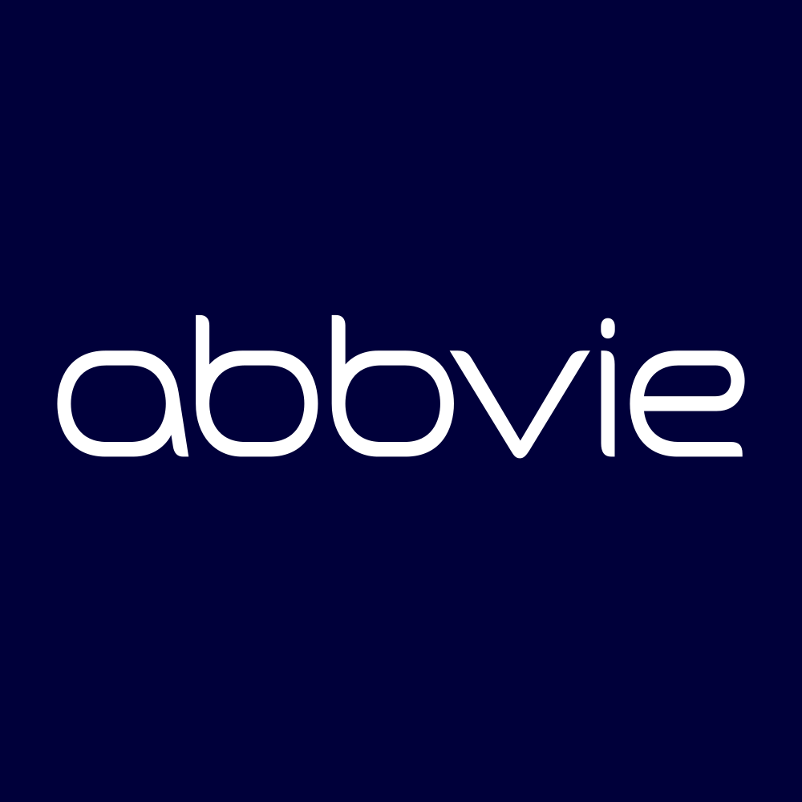 <span>AbbVie Inc.</span></div> | [Full Report](output/ABBV/ABBV_comprehensive_report.html) | <a href="output/ABBV/ABBV_zscore_dashboard.html" target="_blank"><div style="border:1px solid #ddd;padding:10px;text-align:center;border-radius:4px;background:#f8f9fa;">📊 Interactive Dashboard<br/><small>Click to view full dashboard</small></div></a> | 📉 SELL<br/><sub>Z-Score: 1.47 (Distress)</sub> |
| <div style="display: flex; align-items: center;">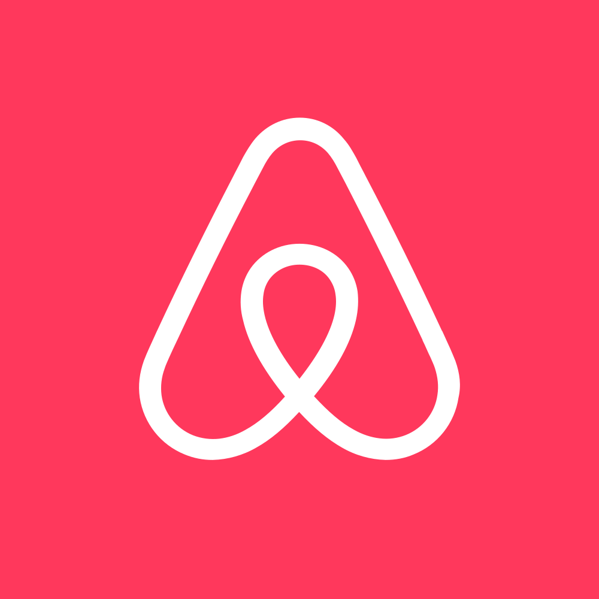 <span>Airbnb, Inc.</span></div> | [Full Report](output/ABNB/ABNB_comprehensive_report.html) | <a href="output/ABNB/ABNB_zscore_dashboard.html" target="_blank"><div style="border:1px solid #ddd;padding:10px;text-align:center;border-radius:4px;background:#f8f9fa;">📊 Interactive Dashboard<br/><small>Click to view full dashboard</small></div></a> | ⚖️ HOLD<br/><sub>Z-Score: 2.85 (Gray Zone)</sub> |
| <div style="display: flex; align-items: center;"> <span>Adobe Inc.</span></div> | [Full Report](output/ADBE/ADBE_comprehensive_report.html) | <a href="output/ADBE/ADBE_zscore_dashboard.html" target="_blank"><div style="border:1px solid #ddd;padding:10px;text-align:center;border-radius:4px;background:#f8f9fa;">📊 Interactive Dashboard<br/><small>Click to view full dashboard</small></div></a> | 📈 STRONG BUY<br/><sub>Z-Score: 8.48 (Safe)</sub> |
| <div style="display: flex; align-items: center;"> <span>Automatic Data Processing, Inc.</span></div> | [Full Report](output/ADP/ADP_comprehensive_report.html) | <a href="output/ADP/ADP_zscore_dashboard.html" target="_blank"><div style="border:1px solid #ddd;padding:10px;text-align:center;border-radius:4px;background:#f8f9fa;">📊 Interactive Dashboard<br/><small>Click to view full dashboard</small></div></a> | ⚖️ HOLD<br/><sub>Z-Score: 2.17 (Gray Zone)</sub> |
| <div style="display: flex; align-items: center;"> <span>American Electric Power Company, Inc.</span></div> | [Full Report](output/AEP/AEP_comprehensive_report.html) | <a href="output/AEP/AEP_zscore_dashboard.html" target="_blank"><div style="border:1px solid #ddd;padding:10px;text-align:center;border-radius:4px;background:#f8f9fa;">📊 Interactive Dashboard<br/><small>Click to view full dashboard</small></div></a> | 📉 SELL<br/><sub>Z-Score: 0.61 (Distress)</sub> |
| <div style="display: flex; align-items: center;"> <span>Affirm Holdings, Inc.</span></div> | [Full Report](output/AFRM/AFRM_comprehensive_report.html) | <a href="output/AFRM/AFRM_zscore_dashboard.html" target="_blank"><div style="border:1px solid #ddd;padding:10px;text-align:center;border-radius:4px;background:#f8f9fa;">📊 Interactive Dashboard<br/><small>Click to view full dashboard</small></div></a> | ⚖️ HOLD<br/><sub>Z-Score: 2.38 (Gray Zone)</sub> |
| <div style="display: flex; align-items: center;"> <span>Applied Materials, Inc.</span></div> | [Full Report](output/AMAT/AMAT_comprehensive_report.html) | <a href="output/AMAT/AMAT_zscore_dashboard.html" target="_blank"><div style="border:1px solid #ddd;padding:10px;text-align:center;border-radius:4px;background:#f8f9fa;">📊 Interactive Dashboard<br/><small>Click to view full dashboard</small></div></a> | 📈 STRONG BUY<br/><sub>Z-Score: 9.03 (Safe)</sub> |
| <div style="display: flex; align-items: center;">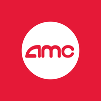 <span>AMC Entertainment Holdings, Inc.</span></div> | [Full Report](output/AMC/AMC_comprehensive_report.html) | <a href="output/AMC/AMC_zscore_dashboard.html" target="_blank"><div style="border:1px solid #ddd;padding:10px;text-align:center;border-radius:4px;background:#f8f9fa;">📊 Interactive Dashboard<br/><small>Click to view full dashboard</small></div></a> | 📉 SELL<br/><sub>Z-Score: -1.49 (Distress)</sub> |
| <div style="display: flex; align-items: center;"> <span>Advanced Micro Devices, Inc.</span></div> | [Full Report](output/AMD/AMD_comprehensive_report.html) | <a href="output/AMD/AMD_zscore_dashboard.html" target="_blank"><div style="border:1px solid #ddd;padding:10px;text-align:center;border-radius:4px;background:#f8f9fa;">📊 Interactive Dashboard<br/><small>Click to view full dashboard</small></div></a> | 📈 STRONG BUY<br/><sub>Z-Score: 10.64 (Safe)</sub> |
| <div style="display: flex; align-items: center;">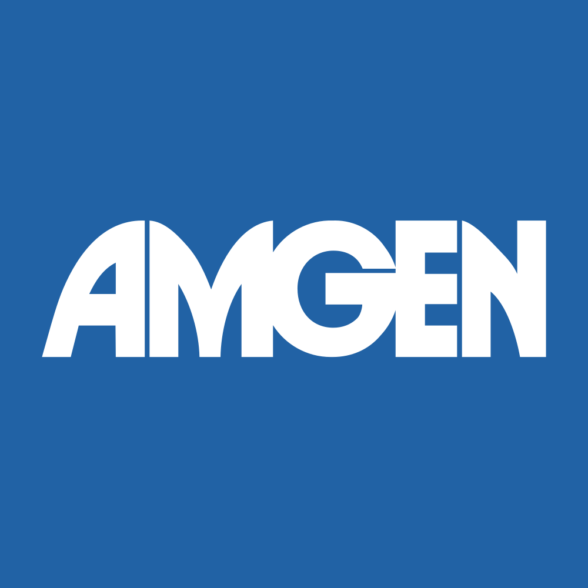 <span>Amgen Inc.</span></div> | [Full Report](output/AMGN/AMGN_comprehensive_report.html) | <a href="output/AMGN/AMGN_zscore_dashboard.html" target="_blank"><div style="border:1px solid #ddd;padding:10px;text-align:center;border-radius:4px;background:#f8f9fa;">📊 Interactive Dashboard<br/><small>Click to view full dashboard</small></div></a> | 📉 SELL<br/><sub>Z-Score: 0.85 (Distress)</sub> |
| <div style="display: flex; align-items: center;"> <span>Amazon.com, Inc.</span></div> | [Full Report](output/AMZN/AMZN_comprehensive_report.html) | <a href="output/AMZN/AMZN_zscore_dashboard.html" target="_blank"><div style="border:1px solid #ddd;padding:10px;text-align:center;border-radius:4px;background:#f8f9fa;">📊 Interactive Dashboard<br/><small>Click to view full dashboard</small></div></a> | 📈 STRONG BUY<br/><sub>Z-Score: 4.77 (Safe)</sub> |
| <div style="display: flex; align-items: center;">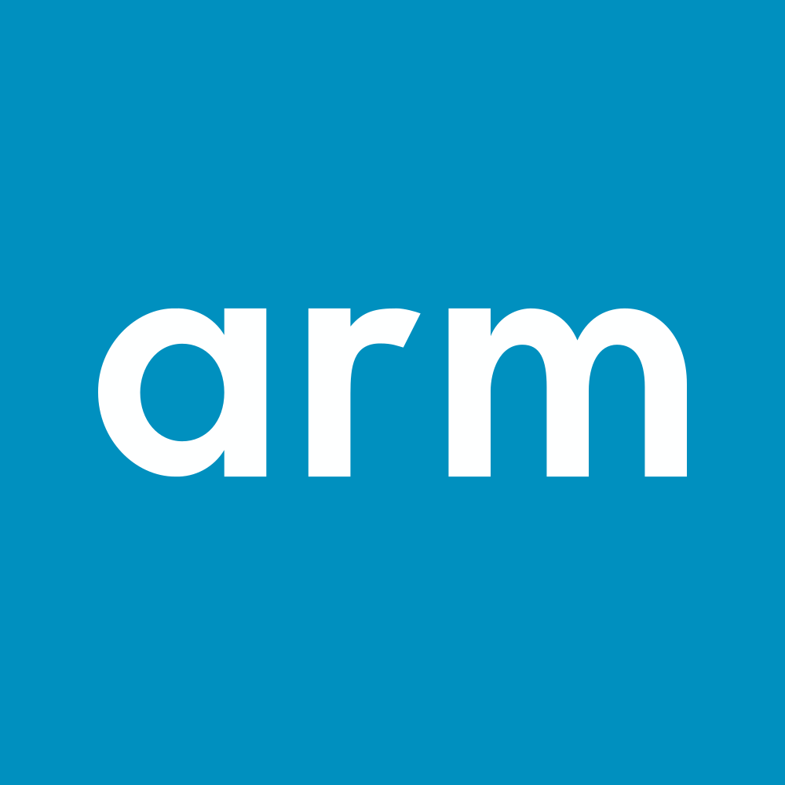 <span>Arm Holdings plc American Depositary Shares</span></div> | [Full Report](output/ARM/ARM_comprehensive_report.html) | <a href="output/ARM/ARM_zscore_dashboard.html" target="_blank"><div style="border:1px solid #ddd;padding:10px;text-align:center;border-radius:4px;background:#f8f9fa;">📊 Interactive Dashboard<br/><small>Click to view full dashboard</small></div></a> | 📈 STRONG BUY<br/><sub>Z-Score: 49.14 (Safe)</sub> |
| <div style="display: flex; align-items: center;">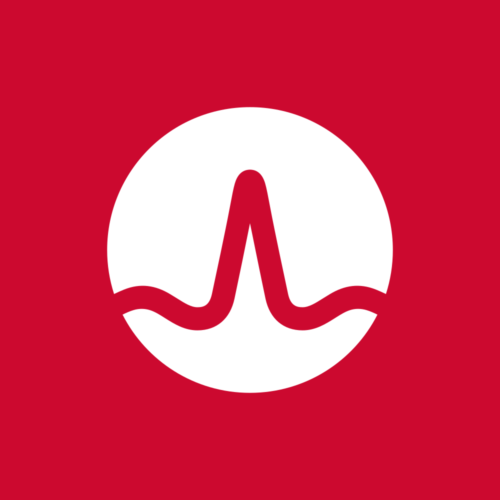 <span>Broadcom Inc.</span></div> | [Full Report](output/AVGO/AVGO_comprehensive_report.html) | <a href="output/AVGO/AVGO_zscore_dashboard.html" target="_blank"><div style="border:1px solid #ddd;padding:10px;text-align:center;border-radius:4px;background:#f8f9fa;">📊 Interactive Dashboard<br/><small>Click to view full dashboard</small></div></a> | 📈 STRONG BUY<br/><sub>Z-Score: 8.10 (Safe)</sub> |
| <div style="display: flex; align-items: center;"> <span>American Water Works Company, Inc.</span></div> | [Full Report](output/AWK/AWK_comprehensive_report.html) | <a href="output/AWK/AWK_zscore_dashboard.html" target="_blank"><div style="border:1px solid #ddd;padding:10px;text-align:center;border-radius:4px;background:#f8f9fa;">📊 Interactive Dashboard<br/><small>Click to view full dashboard</small></div></a> | 📉 SELL<br/><sub>Z-Score: 0.85 (Distress)</sub> |
| <div style="display: flex; align-items: center;">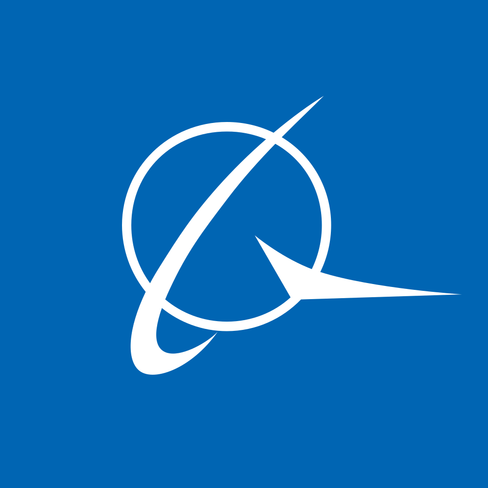 <span>The Boeing Company</span></div> | [Full Report](output/BA/BA_comprehensive_report.html) | <a href="output/BA/BA_zscore_dashboard.html" target="_blank"><div style="border:1px solid #ddd;padding:10px;text-align:center;border-radius:4px;background:#f8f9fa;">📊 Interactive Dashboard<br/><small>Click to view full dashboard</small></div></a> | 📉 SELL<br/><sub>Z-Score: 1.02 (Distress)</sub> |
| <div style="display: flex; align-items: center;">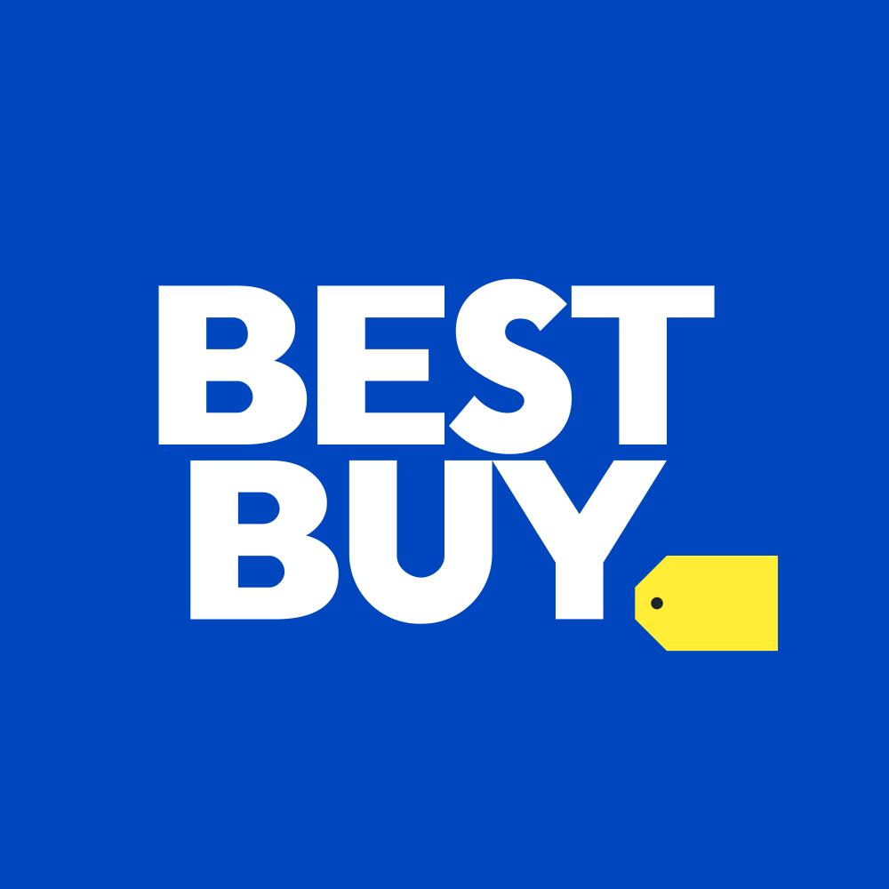 <span>Best Buy Co., Inc.</span></div> | [Full Report](output/BBY/BBY_comprehensive_report.html) | <a href="output/BBY/BBY_zscore_dashboard.html" target="_blank"><div style="border:1px solid #ddd;padding:10px;text-align:center;border-radius:4px;background:#f8f9fa;">📊 Interactive Dashboard<br/><small>Click to view full dashboard</small></div></a> | 📉 SELL<br/><sub>Z-Score: 1.69 (Distress)</sub> |
| <div style="display: flex; align-items: center;"> <span>Bumble Inc.</span></div> | [Full Report](output/BMBL/BMBL_comprehensive_report.html) | <a href="output/BMBL/BMBL_zscore_dashboard.html" target="_blank"><div style="border:1px solid #ddd;padding:10px;text-align:center;border-radius:4px;background:#f8f9fa;">📊 Interactive Dashboard<br/><small>Click to view full dashboard</small></div></a> | 📉 SELL<br/><sub>Z-Score: 0.37 (Distress)</sub> |
| <div style="display: flex; align-items: center;"> <span>Cardinal Health, Inc.</span></div> | [Full Report](output/CAH/CAH_comprehensive_report.html) | <a href="output/CAH/CAH_zscore_dashboard.html" target="_blank"><div style="border:1px solid #ddd;padding:10px;text-align:center;border-radius:4px;background:#f8f9fa;">📊 Interactive Dashboard<br/><small>Click to view full dashboard</small></div></a> | 📉 SELL<br/><sub>Z-Score: 1.57 (Distress)</sub> |
| <div style="display: flex; align-items: center;"> <span>Caterpillar Inc.</span></div> | [Full Report](output/CAT/CAT_comprehensive_report.html) | <a href="output/CAT/CAT_zscore_dashboard.html" target="_blank"><div style="border:1px solid #ddd;padding:10px;text-align:center;border-radius:4px;background:#f8f9fa;">📊 Interactive Dashboard<br/><small>Click to view full dashboard</small></div></a> | 📈 STRONG BUY<br/><sub>Z-Score: 2.99 (Safe)</sub> |
| <div style="display: flex; align-items: center;"> <span>Carnival Corporation & plc</span></div> | [Full Report](output/CCL/CCL_comprehensive_report.html) | <a href="output/CCL/CCL_zscore_dashboard.html" target="_blank"><div style="border:1px solid #ddd;padding:10px;text-align:center;border-radius:4px;background:#f8f9fa;">📊 Interactive Dashboard<br/><small>Click to view full dashboard</small></div></a> | 📉 SELL<br/><sub>Z-Score: 0.54 (Distress)</sub> |
| <div style="display: flex; align-items: center;"> <span>Colgate-Palmolive Company</span></div> | [Full Report](output/CL/CL_comprehensive_report.html) | <a href="output/CL/CL_zscore_dashboard.html" target="_blank"><div style="border:1px solid #ddd;padding:10px;text-align:center;border-radius:4px;background:#f8f9fa;">📊 Interactive Dashboard<br/><small>Click to view full dashboard</small></div></a> | 📈 STRONG BUY<br/><sub>Z-Score: 5.34 (Safe)</sub> |
| <div style="display: flex; align-items: center;">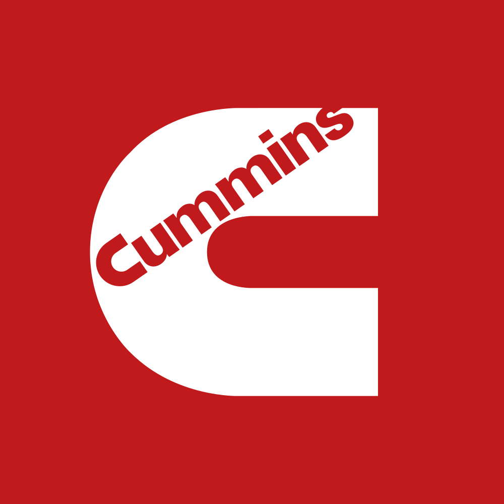 <span>Cummins Inc.</span></div> | [Full Report](output/CMI/CMI_comprehensive_report.html) | <a href="output/CMI/CMI_zscore_dashboard.html" target="_blank"><div style="border:1px solid #ddd;padding:10px;text-align:center;border-radius:4px;background:#f8f9fa;">📊 Interactive Dashboard<br/><small>Click to view full dashboard</small></div></a> | ⚖️ HOLD<br/><sub>Z-Score: 2.71 (Gray Zone)</sub> |
| <div style="display: flex; align-items: center;"> <span>Coinbase Global, Inc.</span></div> | [Full Report](output/COIN/COIN_comprehensive_report.html) | <a href="output/COIN/COIN_zscore_dashboard.html" target="_blank"><div style="border:1px solid #ddd;padding:10px;text-align:center;border-radius:4px;background:#f8f9fa;">📊 Interactive Dashboard<br/><small>Click to view full dashboard</small></div></a> | 📈 STRONG BUY<br/><sub>Z-Score: 5.93 (Safe)</sub> |
| <div style="display: flex; align-items: center;"> <span>ConocoPhillips</span></div> | [Full Report](output/COP/COP_comprehensive_report.html) | <a href="output/COP/COP_zscore_dashboard.html" target="_blank"><div style="border:1px solid #ddd;padding:10px;text-align:center;border-radius:4px;background:#f8f9fa;">📊 Interactive Dashboard<br/><small>Click to view full dashboard</small></div></a> | ⚖️ HOLD<br/><sub>Z-Score: 2.29 (Gray Zone)</sub> |
| <div style="display: flex; align-items: center;">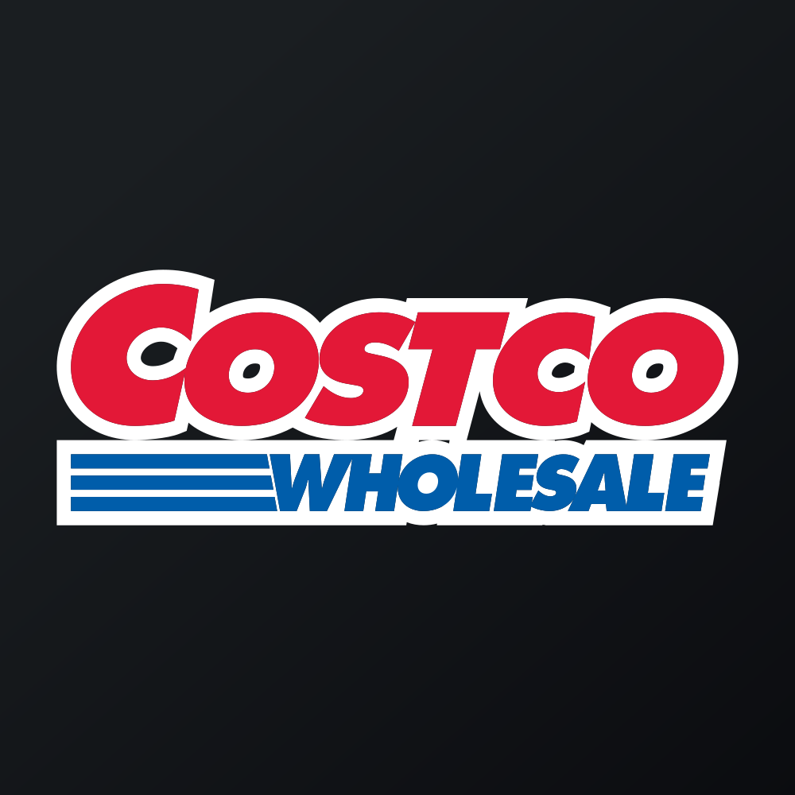 <span>Costco Wholesale Corporation</span></div> | [Full Report](output/COST/COST_comprehensive_report.html) | <a href="output/COST/COST_zscore_dashboard.html" target="_blank"><div style="border:1px solid #ddd;padding:10px;text-align:center;border-radius:4px;background:#f8f9fa;">📊 Interactive Dashboard<br/><small>Click to view full dashboard</small></div></a> | 📈 STRONG BUY<br/><sub>Z-Score: 6.77 (Safe)</sub> |
| <div style="display: flex; align-items: center;">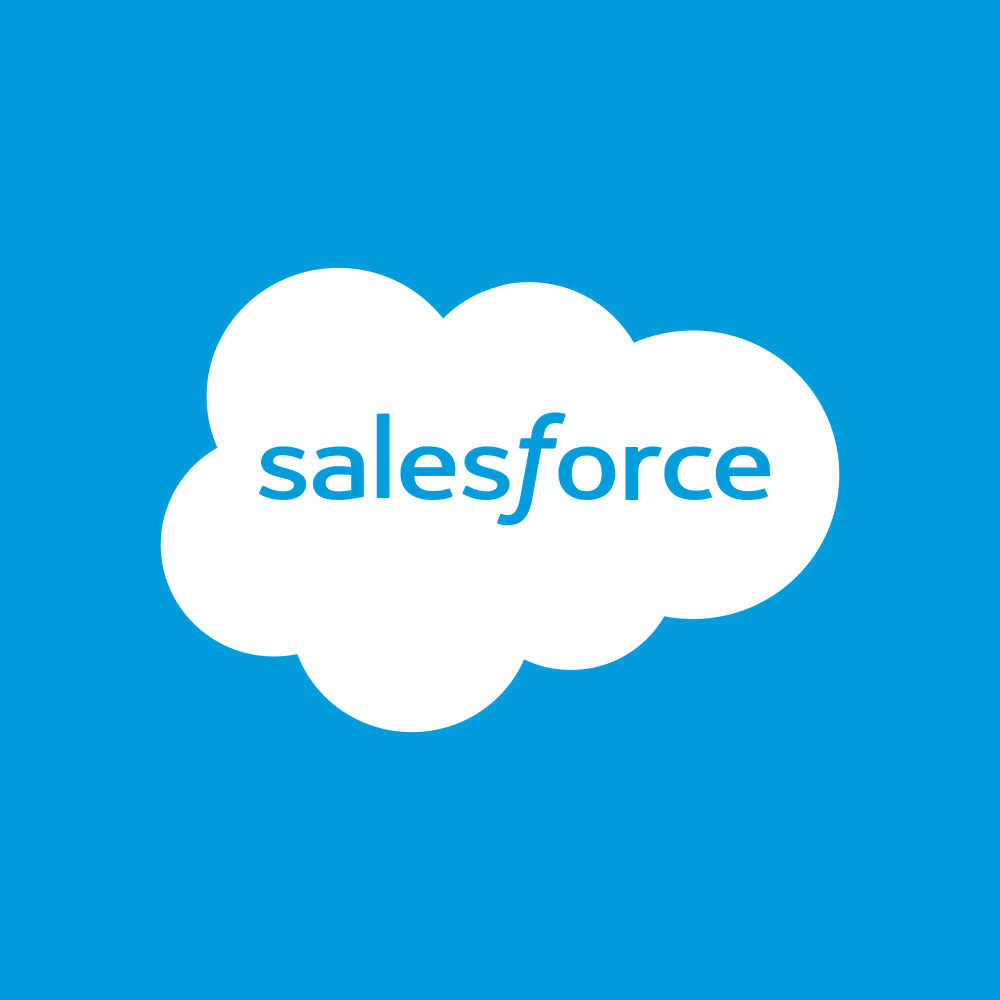 <span>Salesforce, Inc.</span></div> | [Full Report](output/CRM/CRM_comprehensive_report.html) | <a href="output/CRM/CRM_zscore_dashboard.html" target="_blank"><div style="border:1px solid #ddd;padding:10px;text-align:center;border-radius:4px;background:#f8f9fa;">📊 Interactive Dashboard<br/><small>Click to view full dashboard</small></div></a> | 📈 STRONG BUY<br/><sub>Z-Score: 4.48 (Safe)</sub> |
| <div style="display: flex; align-items: center;"> <span>CrowdStrike Holdings, Inc.</span></div> | [Full Report](output/CRWD/CRWD_comprehensive_report.html) | <a href="output/CRWD/CRWD_zscore_dashboard.html" target="_blank"><div style="border:1px solid #ddd;padding:10px;text-align:center;border-radius:4px;background:#f8f9fa;">📊 Interactive Dashboard<br/><small>Click to view full dashboard</small></div></a> | 📈 STRONG BUY<br/><sub>Z-Score: 14.40 (Safe)</sub> |
| <div style="display: flex; align-items: center;">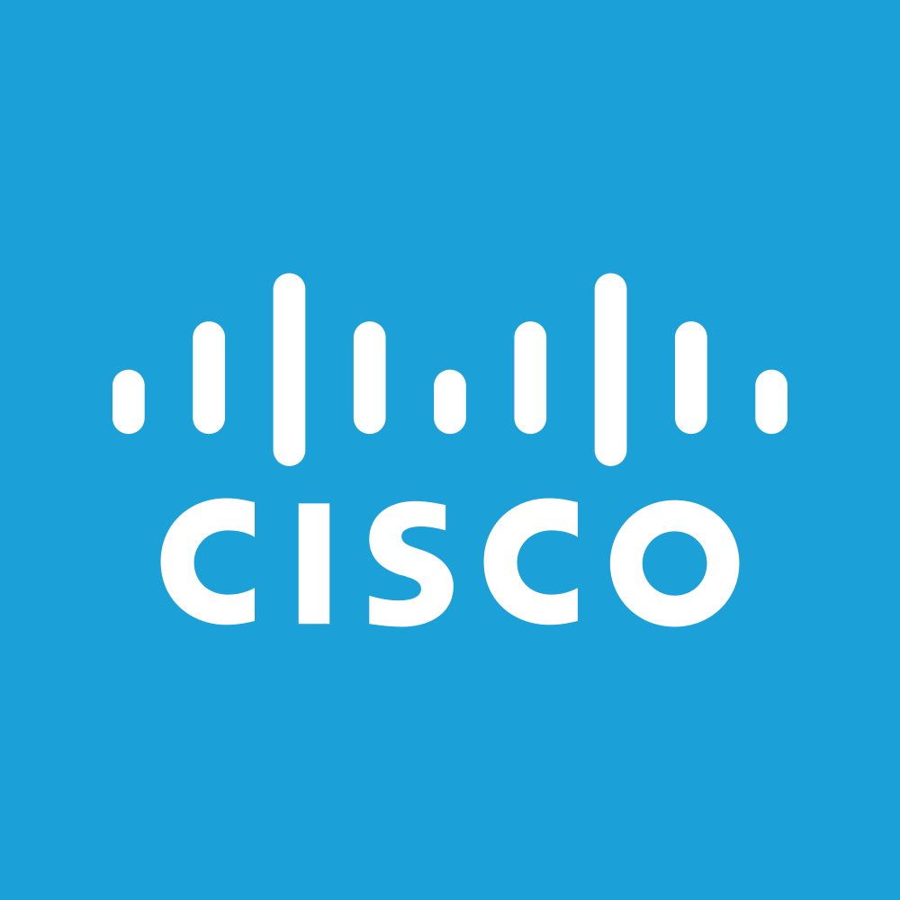 <span>Cisco Systems, Inc.</span></div> | [Full Report](output/CSCO/CSCO_comprehensive_report.html) | <a href="output/CSCO/CSCO_zscore_dashboard.html" target="_blank"><div style="border:1px solid #ddd;padding:10px;text-align:center;border-radius:4px;background:#f8f9fa;">📊 Interactive Dashboard<br/><small>Click to view full dashboard</small></div></a> | ⚖️ HOLD<br/><sub>Z-Score: 2.39 (Gray Zone)</sub> |
| <div style="display: flex; align-items: center;">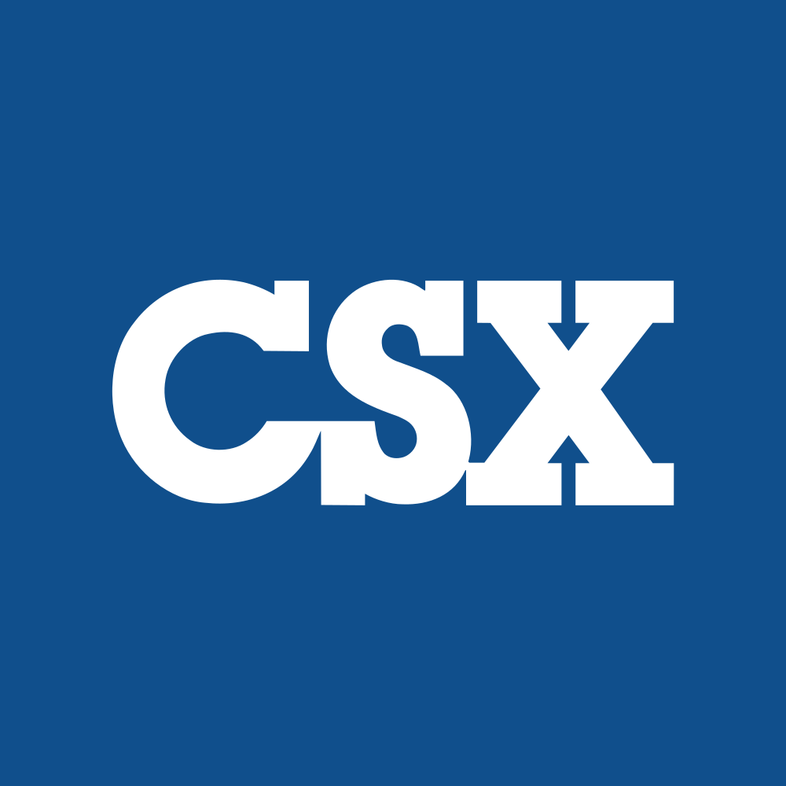 <span>CSX Corporation</span></div> | [Full Report](output/CSX/CSX_comprehensive_report.html) | <a href="output/CSX/CSX_zscore_dashboard.html" target="_blank"><div style="border:1px solid #ddd;padding:10px;text-align:center;border-radius:4px;background:#f8f9fa;">📊 Interactive Dashboard<br/><small>Click to view full dashboard</small></div></a> | 📉 SELL<br/><sub>Z-Score: 1.64 (Distress)</sub> |
| <div style="display: flex; align-items: center;"> <span>CVS Health Corporation</span></div> | [Full Report](output/CVS/CVS_comprehensive_report.html) | <a href="output/CVS/CVS_zscore_dashboard.html" target="_blank"><div style="border:1px solid #ddd;padding:10px;text-align:center;border-radius:4px;background:#f8f9fa;">📊 Interactive Dashboard<br/><small>Click to view full dashboard</small></div></a> | 📉 SELL<br/><sub>Z-Score: 0.97 (Distress)</sub> |
| <div style="display: flex; align-items: center;">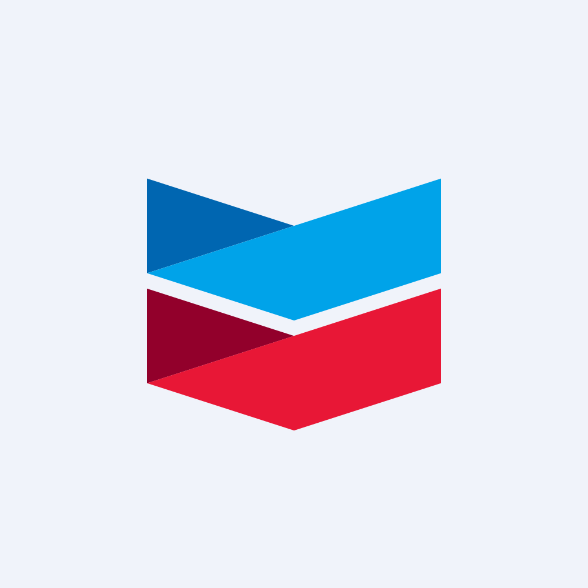 <span>Chevron Corporation</span></div> | [Full Report](output/CVX/CVX_comprehensive_report.html) | <a href="output/CVX/CVX_zscore_dashboard.html" target="_blank"><div style="border:1px solid #ddd;padding:10px;text-align:center;border-radius:4px;background:#f8f9fa;">📊 Interactive Dashboard<br/><small>Click to view full dashboard</small></div></a> | ⚖️ HOLD<br/><sub>Z-Score: 2.70 (Gray Zone)</sub> |
| <div style="display: flex; align-items: center;"> <span>Dominion Energy, Inc.</span></div> | [Full Report](output/D/D_comprehensive_report.html) | <a href="output/D/D_zscore_dashboard.html" target="_blank"><div style="border:1px solid #ddd;padding:10px;text-align:center;border-radius:4px;background:#f8f9fa;">📊 Interactive Dashboard<br/><small>Click to view full dashboard</small></div></a> | 📉 SELL<br/><sub>Z-Score: 0.46 (Distress)</sub> |
| <div style="display: flex; align-items: center;"> <span>Delta Air Lines, Inc.</span></div> | [Full Report](output/DAL/DAL_comprehensive_report.html) | <a href="output/DAL/DAL_zscore_dashboard.html" target="_blank"><div style="border:1px solid #ddd;padding:10px;text-align:center;border-radius:4px;background:#f8f9fa;">📊 Interactive Dashboard<br/><small>Click to view full dashboard</small></div></a> | 📉 SELL<br/><sub>Z-Score: 0.39 (Distress)</sub> |
| <div style="display: flex; align-items: center;"> <span>DoorDash, Inc.</span></div> | [Full Report](output/DASH/DASH_comprehensive_report.html) | <a href="output/DASH/DASH_zscore_dashboard.html" target="_blank"><div style="border:1px solid #ddd;padding:10px;text-align:center;border-radius:4px;background:#f8f9fa;">📊 Interactive Dashboard<br/><small>Click to view full dashboard</small></div></a> | 📈 STRONG BUY<br/><sub>Z-Score: 11.46 (Safe)</sub> |
| <div style="display: flex; align-items: center;"> <span>Datadog, Inc.</span></div> | [Full Report](output/DDOG/DDOG_comprehensive_report.html) | <a href="output/DDOG/DDOG_zscore_dashboard.html" target="_blank"><div style="border:1px solid #ddd;padding:10px;text-align:center;border-radius:4px;background:#f8f9fa;">📊 Interactive Dashboard<br/><small>Click to view full dashboard</small></div></a> | 📈 STRONG BUY<br/><sub>Z-Score: 9.50 (Safe)</sub> |
| <div style="display: flex; align-items: center;"> <span>Deere & Company</span></div> | [Full Report](output/DE/DE_comprehensive_report.html) | <a href="output/DE/DE_zscore_dashboard.html" target="_blank"><div style="border:1px solid #ddd;padding:10px;text-align:center;border-radius:4px;background:#f8f9fa;">📊 Interactive Dashboard<br/><small>Click to view full dashboard</small></div></a> | ⚖️ HOLD<br/><sub>Z-Score: 2.44 (Gray Zone)</sub> |
| <div style="display: flex; align-items: center;"> <span>Danaher Corporation</span></div> | [Full Report](output/DHR/DHR_comprehensive_report.html) | <a href="output/DHR/DHR_zscore_dashboard.html" target="_blank"><div style="border:1px solid #ddd;padding:10px;text-align:center;border-radius:4px;background:#f8f9fa;">📊 Interactive Dashboard<br/><small>Click to view full dashboard</small></div></a> | 📈 STRONG BUY<br/><sub>Z-Score: 4.02 (Safe)</sub> |
| <div style="display: flex; align-items: center;">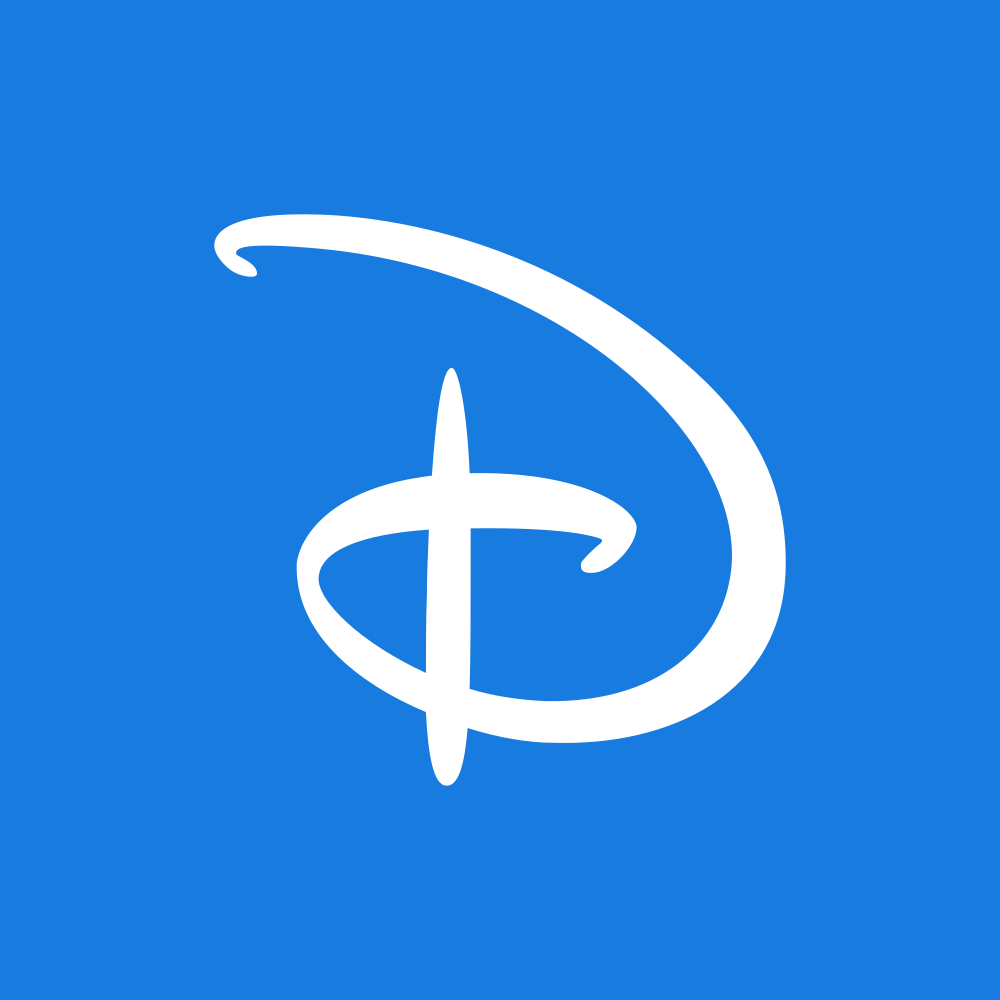 <span>The Walt Disney Company</span></div> | [Full Report](output/DIS/DIS_comprehensive_report.html) | <a href="output/DIS/DIS_zscore_dashboard.html" target="_blank"><div style="border:1px solid #ddd;padding:10px;text-align:center;border-radius:4px;background:#f8f9fa;">📊 Interactive Dashboard<br/><small>Click to view full dashboard</small></div></a> | ⚖️ HOLD<br/><sub>Z-Score: 1.97 (Gray Zone)</sub> |
| <div style="display: flex; align-items: center;"> <span>DocuSign, Inc.</span></div> | [Full Report](output/DOCU/DOCU_comprehensive_report.html) | <a href="output/DOCU/DOCU_zscore_dashboard.html" target="_blank"><div style="border:1px solid #ddd;padding:10px;text-align:center;border-radius:4px;background:#f8f9fa;">📊 Interactive Dashboard<br/><small>Click to view full dashboard</small></div></a> | 📈 STRONG BUY<br/><sub>Z-Score: 4.34 (Safe)</sub> |
| <div style="display: flex; align-items: center;"> <span>Duke Energy Corporation</span></div> | [Full Report](output/DUK/DUK_comprehensive_report.html) | <a href="output/DUK/DUK_zscore_dashboard.html" target="_blank"><div style="border:1px solid #ddd;padding:10px;text-align:center;border-radius:4px;background:#f8f9fa;">📊 Interactive Dashboard<br/><small>Click to view full dashboard</small></div></a> | 📉 SELL<br/><sub>Z-Score: 0.49 (Distress)</sub> |
| <div style="display: flex; align-items: center;"><div style="width:40px;height:40px;background:#2c3e50;color:white;display:flex;align-items:center;justify-content:center;margin-right:8px;font-weight:bold;border-radius:4px;">ED</div> <span>Consolidated Edison, Inc.</span></div> | [Full Report](output/ED/ED_comprehensive_report.html) | <a href="output/ED/ED_zscore_dashboard.html" target="_blank"><div style="border:1px solid #ddd;padding:10px;text-align:center;border-radius:4px;background:#f8f9fa;">📊 Interactive Dashboard<br/><small>Click to view full dashboard</small></div></a> | 📉 SELL<br/><sub>Z-Score: 0.88 (Distress)</sub> |
| <div style="display: flex; align-items: center;"> <span>Emerson Electric Co.</span></div> | [Full Report](output/EMR/EMR_comprehensive_report.html) | <a href="output/EMR/EMR_zscore_dashboard.html" target="_blank"><div style="border:1px solid #ddd;padding:10px;text-align:center;border-radius:4px;background:#f8f9fa;">📊 Interactive Dashboard<br/><small>Click to view full dashboard</small></div></a> | 📈 STRONG BUY<br/><sub>Z-Score: 3.37 (Safe)</sub> |
| <div style="display: flex; align-items: center;"> <span>EOG Resources, Inc.</span></div> | [Full Report](output/EOG/EOG_comprehensive_report.html) | <a href="output/EOG/EOG_zscore_dashboard.html" target="_blank"><div style="border:1px solid #ddd;padding:10px;text-align:center;border-radius:4px;background:#f8f9fa;">📊 Interactive Dashboard<br/><small>Click to view full dashboard</small></div></a> | 📈 STRONG BUY<br/><sub>Z-Score: 3.49 (Safe)</sub> |
| <div style="display: flex; align-items: center;">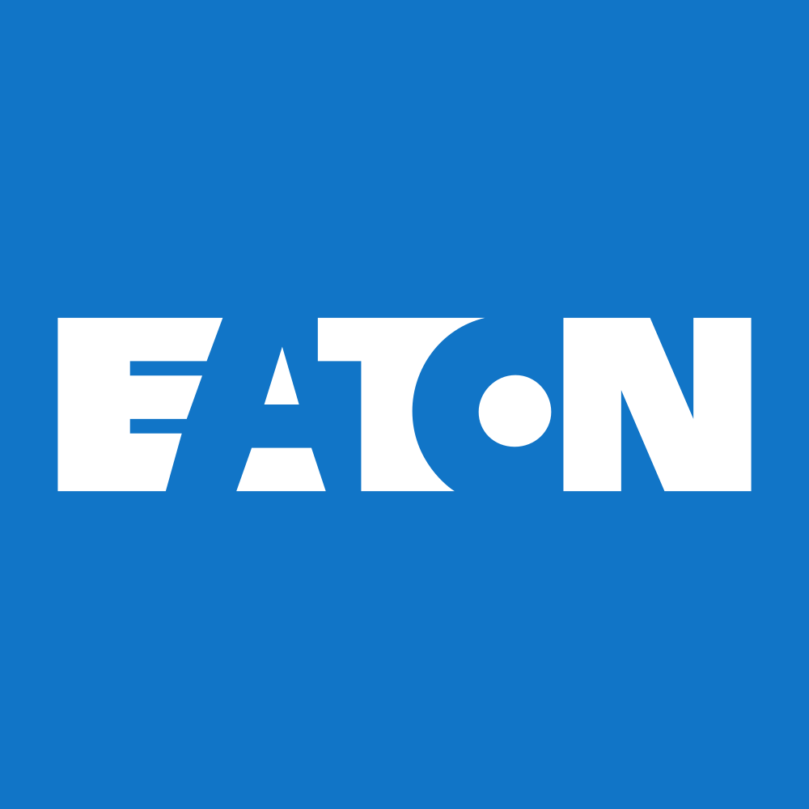 <span>Eaton Corporation plc</span></div> | [Full Report](output/ETN/ETN_comprehensive_report.html) | <a href="output/ETN/ETN_zscore_dashboard.html" target="_blank"><div style="border:1px solid #ddd;padding:10px;text-align:center;border-radius:4px;background:#f8f9fa;">📊 Interactive Dashboard<br/><small>Click to view full dashboard</small></div></a> | 📈 STRONG BUY<br/><sub>Z-Score: 4.60 (Safe)</sub> |
| <div style="display: flex; align-items: center;"> <span>Exelon Corporation</span></div> | [Full Report](output/EXC/EXC_comprehensive_report.html) | <a href="output/EXC/EXC_zscore_dashboard.html" target="_blank"><div style="border:1px solid #ddd;padding:10px;text-align:center;border-radius:4px;background:#f8f9fa;">📊 Interactive Dashboard<br/><small>Click to view full dashboard</small></div></a> | 📉 SELL<br/><sub>Z-Score: 0.52 (Distress)</sub> |
| <div style="display: flex; align-items: center;"> <span>Ford Motor Company</span></div> | [Full Report](output/F/F_comprehensive_report.html) | <a href="output/F/F_zscore_dashboard.html" target="_blank"><div style="border:1px solid #ddd;padding:10px;text-align:center;border-radius:4px;background:#f8f9fa;">📊 Interactive Dashboard<br/><small>Click to view full dashboard</small></div></a> | 📉 SELL<br/><sub>Z-Score: 0.47 (Distress)</sub> |
| <div style="display: flex; align-items: center;"> <span>Freeport-McMoRan Inc.</span></div> | [Full Report](output/FCX/FCX_comprehensive_report.html) | <a href="output/FCX/FCX_zscore_dashboard.html" target="_blank"><div style="border:1px solid #ddd;padding:10px;text-align:center;border-radius:4px;background:#f8f9fa;">📊 Interactive Dashboard<br/><small>Click to view full dashboard</small></div></a> | 📉 SELL<br/><sub>Z-Score: 1.69 (Distress)</sub> |
| <div style="display: flex; align-items: center;"> <span>FedEx Corporation</span></div> | [Full Report](output/FDX/FDX_comprehensive_report.html) | <a href="output/FDX/FDX_zscore_dashboard.html" target="_blank"><div style="border:1px solid #ddd;padding:10px;text-align:center;border-radius:4px;background:#f8f9fa;">📊 Interactive Dashboard<br/><small>Click to view full dashboard</small></div></a> | 📉 SELL<br/><sub>Z-Score: 1.56 (Distress)</sub> |
| <div style="display: flex; align-items: center;"> <span>First Solar, Inc.</span></div> | [Full Report](output/FSLR/FSLR_comprehensive_report.html) | <a href="output/FSLR/FSLR_zscore_dashboard.html" target="_blank"><div style="border:1px solid #ddd;padding:10px;text-align:center;border-radius:4px;background:#f8f9fa;">📊 Interactive Dashboard<br/><small>Click to view full dashboard</small></div></a> | ⚖️ HOLD<br/><sub>Z-Score: 2.85 (Gray Zone)</sub> |
| <div style="display: flex; align-items: center;"> <span>General Dynamics Corporation</span></div> | [Full Report](output/GD/GD_comprehensive_report.html) | <a href="output/GD/GD_zscore_dashboard.html" target="_blank"><div style="border:1px solid #ddd;padding:10px;text-align:center;border-radius:4px;background:#f8f9fa;">📊 Interactive Dashboard<br/><small>Click to view full dashboard</small></div></a> | ⚖️ HOLD<br/><sub>Z-Score: 2.81 (Gray Zone)</sub> |
| <div style="display: flex; align-items: center;">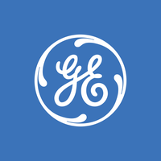 <span>General Electric Company</span></div> | [Full Report](output/GE/GE_comprehensive_report.html) | <a href="output/GE/GE_zscore_dashboard.html" target="_blank"><div style="border:1px solid #ddd;padding:10px;text-align:center;border-radius:4px;background:#f8f9fa;">📊 Interactive Dashboard<br/><small>Click to view full dashboard</small></div></a> | ⚖️ HOLD<br/><sub>Z-Score: 2.61 (Gray Zone)</sub> |
| <div style="display: flex; align-items: center;"> <span>Gilead Sciences, Inc.</span></div> | [Full Report](output/GILD/GILD_comprehensive_report.html) | <a href="output/GILD/GILD_zscore_dashboard.html" target="_blank"><div style="border:1px solid #ddd;padding:10px;text-align:center;border-radius:4px;background:#f8f9fa;">📊 Interactive Dashboard<br/><small>Click to view full dashboard</small></div></a> | ⚖️ HOLD<br/><sub>Z-Score: 2.73 (Gray Zone)</sub> |
| <div style="display: flex; align-items: center;"> <span>General Mills, Inc.</span></div> | [Full Report](output/GIS/GIS_comprehensive_report.html) | <a href="output/GIS/GIS_zscore_dashboard.html" target="_blank"><div style="border:1px solid #ddd;padding:10px;text-align:center;border-radius:4px;background:#f8f9fa;">📊 Interactive Dashboard<br/><small>Click to view full dashboard</small></div></a> | 📉 SELL<br/><sub>Z-Score: 1.79 (Distress)</sub> |
| <div style="display: flex; align-items: center;">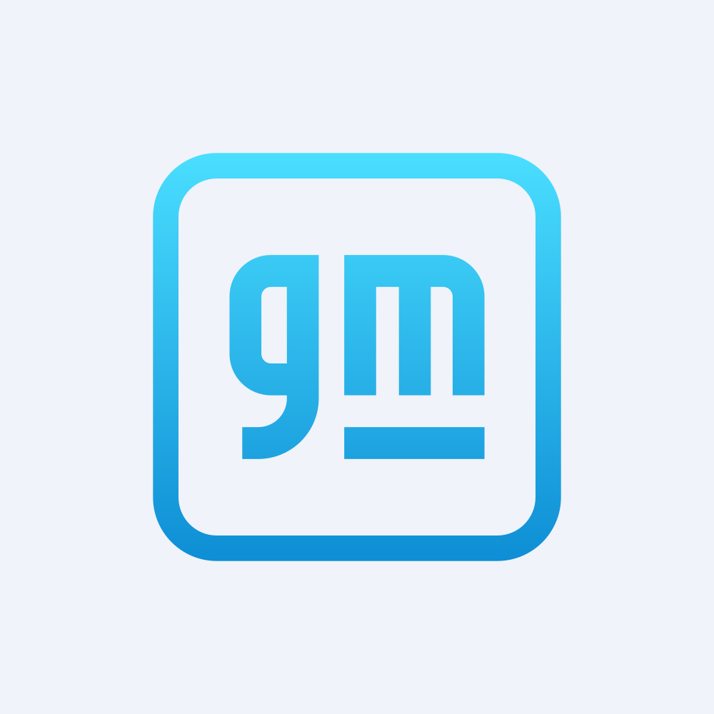 <span>General Motors Company</span></div> | [Full Report](output/GM/GM_comprehensive_report.html) | <a href="output/GM/GM_zscore_dashboard.html" target="_blank"><div style="border:1px solid #ddd;padding:10px;text-align:center;border-radius:4px;background:#f8f9fa;">📊 Interactive Dashboard<br/><small>Click to view full dashboard</small></div></a> | 📉 SELL<br/><sub>Z-Score: 0.68 (Distress)</sub> |
| <div style="display: flex; align-items: center;"> <span>GameStop Corp.</span></div> | [Full Report](output/GME/GME_comprehensive_report.html) | <a href="output/GME/GME_zscore_dashboard.html" target="_blank"><div style="border:1px solid #ddd;padding:10px;text-align:center;border-radius:4px;background:#f8f9fa;">📊 Interactive Dashboard<br/><small>Click to view full dashboard</small></div></a> | 📈 STRONG BUY<br/><sub>Z-Score: 3.62 (Safe)</sub> |
| <div style="display: flex; align-items: center;"> <span>Alphabet Inc.</span></div> | [Full Report](output/GOOG/GOOG_comprehensive_report.html) | <a href="output/GOOG/GOOG_zscore_dashboard.html" target="_blank"><div style="border:1px solid #ddd;padding:10px;text-align:center;border-radius:4px;background:#f8f9fa;">📊 Interactive Dashboard<br/><small>Click to view full dashboard</small></div></a> | 📈 STRONG BUY<br/><sub>Z-Score: 10.92 (Safe)</sub> |
| <div style="display: flex; align-items: center;"> <span>Alphabet Inc.</span></div> | [Full Report](output/GOOGL/GOOGL_comprehensive_report.html) | <a href="output/GOOGL/GOOGL_zscore_dashboard.html" target="_blank"><div style="border:1px solid #ddd;padding:10px;text-align:center;border-radius:4px;background:#f8f9fa;">📊 Interactive Dashboard<br/><small>Click to view full dashboard</small></div></a> | 📈 STRONG BUY<br/><sub>Z-Score: 10.93 (Safe)</sub> |
| <div style="display: flex; align-items: center;">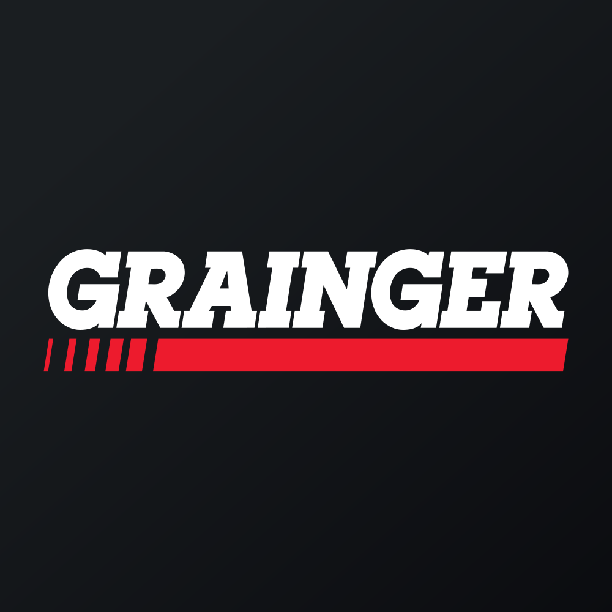 <span>W.W. Grainger, Inc.</span></div> | [Full Report](output/GWW/GWW_comprehensive_report.html) | <a href="output/GWW/GWW_zscore_dashboard.html" target="_blank"><div style="border:1px solid #ddd;padding:10px;text-align:center;border-radius:4px;background:#f8f9fa;">📊 Interactive Dashboard<br/><small>Click to view full dashboard</small></div></a> | 📈 STRONG BUY<br/><sub>Z-Score: 7.37 (Safe)</sub> |
| <div style="display: flex; align-items: center;"> <span>Halliburton Company</span></div> | [Full Report](output/HAL/HAL_comprehensive_report.html) | <a href="output/HAL/HAL_zscore_dashboard.html" target="_blank"><div style="border:1px solid #ddd;padding:10px;text-align:center;border-radius:4px;background:#f8f9fa;">📊 Interactive Dashboard<br/><small>Click to view full dashboard</small></div></a> | ⚖️ HOLD<br/><sub>Z-Score: 2.05 (Gray Zone)</sub> |
| <div style="display: flex; align-items: center;">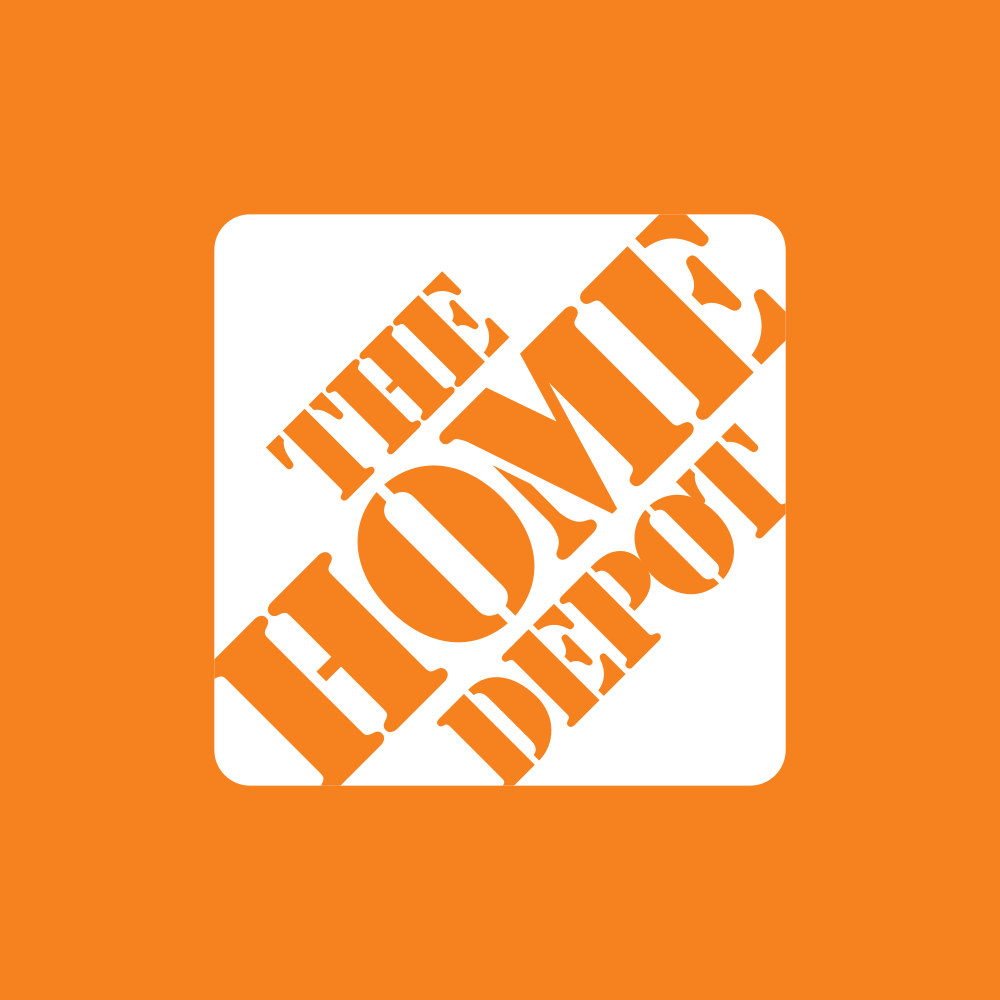 <span>The Home Depot, Inc.</span></div> | [Full Report](output/HD/HD_comprehensive_report.html) | <a href="output/HD/HD_zscore_dashboard.html" target="_blank"><div style="border:1px solid #ddd;padding:10px;text-align:center;border-radius:4px;background:#f8f9fa;">📊 Interactive Dashboard<br/><small>Click to view full dashboard</small></div></a> | 📈 STRONG BUY<br/><sub>Z-Score: 4.26 (Safe)</sub> |
| <div style="display: flex; align-items: center;"> <span>Honeywell International Inc.</span></div> | [Full Report](output/HON/HON_comprehensive_report.html) | <a href="output/HON/HON_zscore_dashboard.html" target="_blank"><div style="border:1px solid #ddd;padding:10px;text-align:center;border-radius:4px;background:#f8f9fa;">📊 Interactive Dashboard<br/><small>Click to view full dashboard</small></div></a> | ⚖️ HOLD<br/><sub>Z-Score: 2.76 (Gray Zone)</sub> |
| <div style="display: flex; align-items: center;"> <span>Robinhood Markets, Inc.</span></div> | [Full Report](output/HOOD/HOOD_comprehensive_report.html) | <a href="output/HOOD/HOOD_zscore_dashboard.html" target="_blank"><div style="border:1px solid #ddd;padding:10px;text-align:center;border-radius:4px;background:#f8f9fa;">📊 Interactive Dashboard<br/><small>Click to view full dashboard</small></div></a> | ⚖️ HOLD<br/><sub>Z-Score: 2.43 (Gray Zone)</sub> |
| <div style="display: flex; align-items: center;"> <span>The Hershey Company</span></div> | [Full Report](output/HSY/HSY_comprehensive_report.html) | <a href="output/HSY/HSY_zscore_dashboard.html" target="_blank"><div style="border:1px solid #ddd;padding:10px;text-align:center;border-radius:4px;background:#f8f9fa;">📊 Interactive Dashboard<br/><small>Click to view full dashboard</small></div></a> | 📈 STRONG BUY<br/><sub>Z-Score: 3.20 (Safe)</sub> |
| <div style="display: flex; align-items: center;">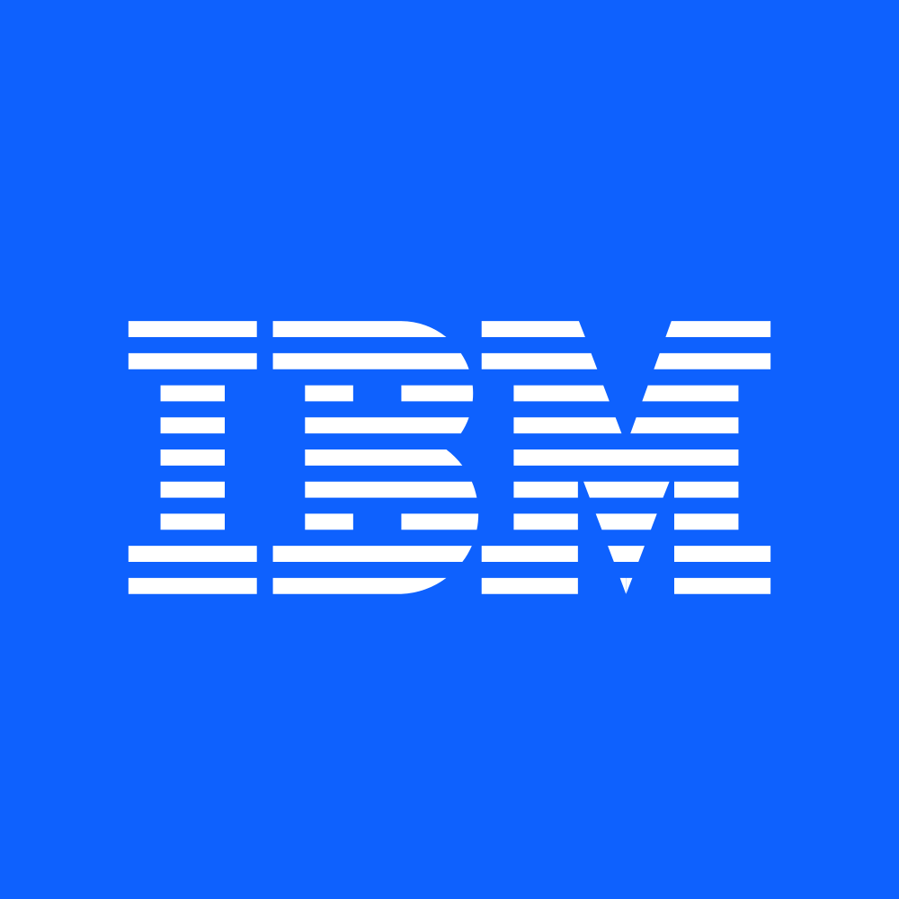 <span>International Business Machines Corporation</span></div> | [Full Report](output/IBM/IBM_comprehensive_report.html) | <a href="output/IBM/IBM_zscore_dashboard.html" target="_blank"><div style="border:1px solid #ddd;padding:10px;text-align:center;border-radius:4px;background:#f8f9fa;">📊 Interactive Dashboard<br/><small>Click to view full dashboard</small></div></a> | ⚖️ HOLD<br/><sub>Z-Score: 2.96 (Gray Zone)</sub> |
| <div style="display: flex; align-items: center;">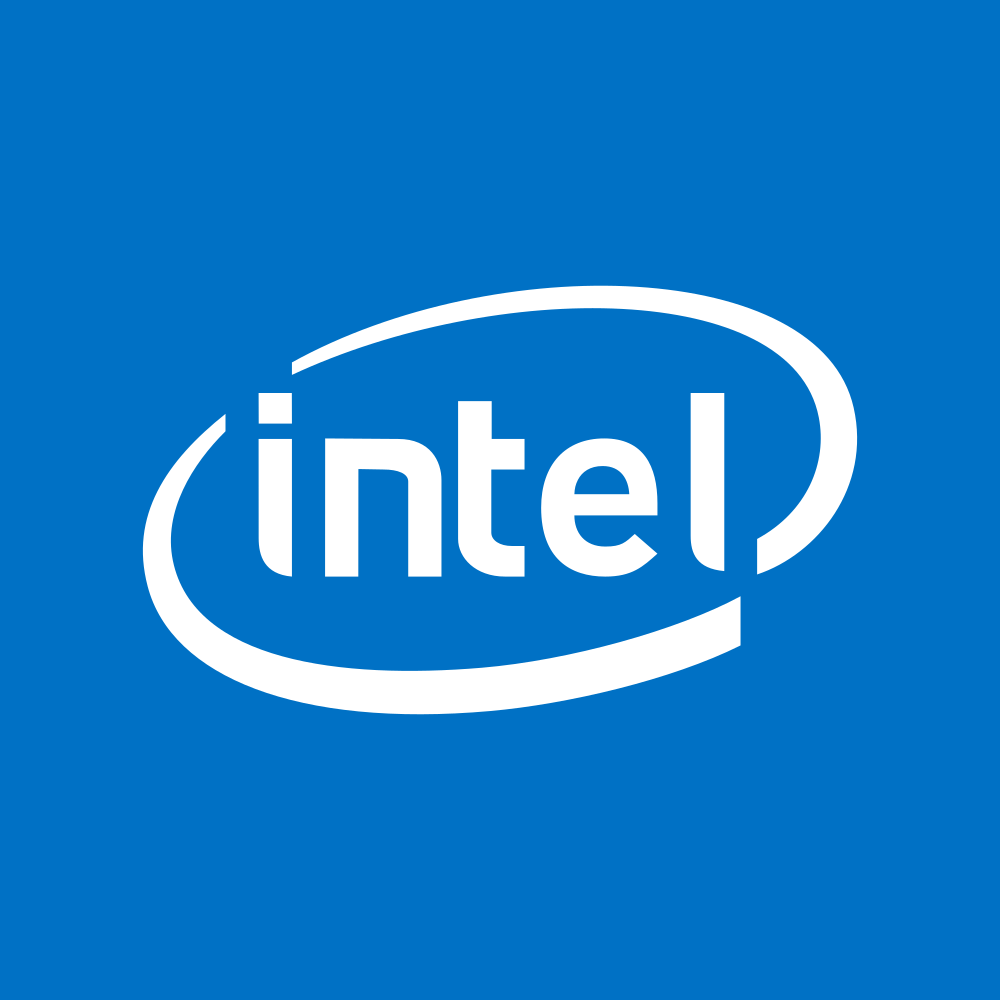 <span>Intel Corporation</span></div> | [Full Report](output/INTC/INTC_comprehensive_report.html) | <a href="output/INTC/INTC_zscore_dashboard.html" target="_blank"><div style="border:1px solid #ddd;padding:10px;text-align:center;border-radius:4px;background:#f8f9fa;">📊 Interactive Dashboard<br/><small>Click to view full dashboard</small></div></a> | 📉 SELL<br/><sub>Z-Score: 1.15 (Distress)</sub> |
| <div style="display: flex; align-items: center;"> <span>Intuit Inc.</span></div> | [Full Report](output/INTU/INTU_comprehensive_report.html) | <a href="output/INTU/INTU_zscore_dashboard.html" target="_blank"><div style="border:1px solid #ddd;padding:10px;text-align:center;border-radius:4px;background:#f8f9fa;">📊 Interactive Dashboard<br/><small>Click to view full dashboard</small></div></a> | 📈 STRONG BUY<br/><sub>Z-Score: 9.14 (Safe)</sub> |
| <div style="display: flex; align-items: center;"> <span>Illinois Tool Works Inc.</span></div> | [Full Report](output/ITW/ITW_comprehensive_report.html) | <a href="output/ITW/ITW_zscore_dashboard.html" target="_blank"><div style="border:1px solid #ddd;padding:10px;text-align:center;border-radius:4px;background:#f8f9fa;">📊 Interactive Dashboard<br/><small>Click to view full dashboard</small></div></a> | 📈 STRONG BUY<br/><sub>Z-Score: 6.80 (Safe)</sub> |
| <div style="display: flex; align-items: center;">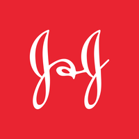 <span>Johnson & Johnson</span></div> | [Full Report](output/JNJ/JNJ_comprehensive_report.html) | <a href="output/JNJ/JNJ_zscore_dashboard.html" target="_blank"><div style="border:1px solid #ddd;padding:10px;text-align:center;border-radius:4px;background:#f8f9fa;">📊 Interactive Dashboard<br/><small>Click to view full dashboard</small></div></a> | 📈 STRONG BUY<br/><sub>Z-Score: 3.39 (Safe)</sub> |
| <div style="display: flex; align-items: center;">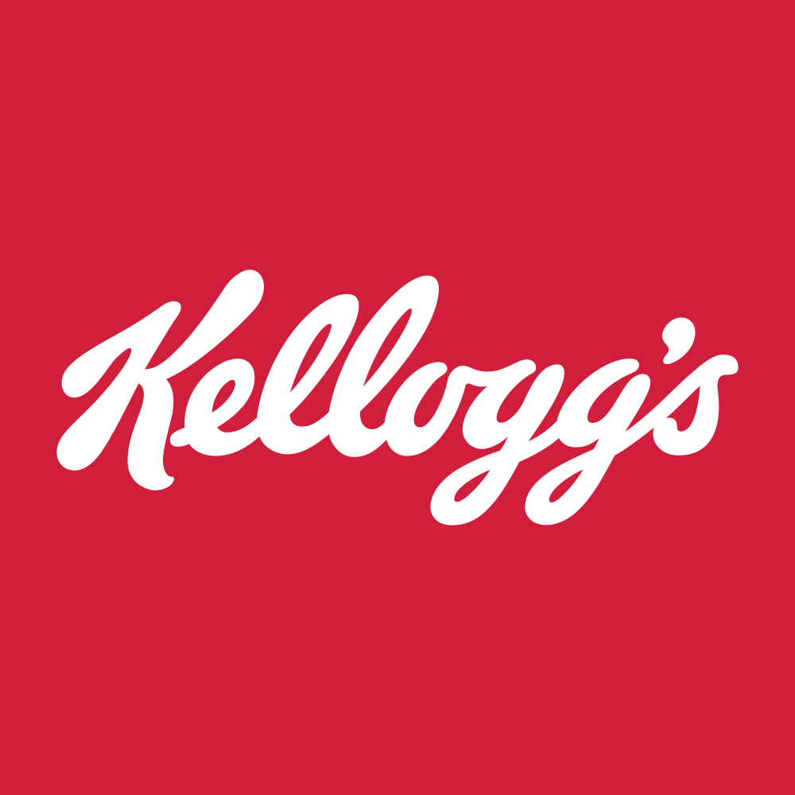 <span>Kellanova</span></div> | [Full Report](output/K/K_comprehensive_report.html) | <a href="output/K/K_zscore_dashboard.html" target="_blank"><div style="border:1px solid #ddd;padding:10px;text-align:center;border-radius:4px;background:#f8f9fa;">📊 Interactive Dashboard<br/><small>Click to view full dashboard</small></div></a> | ⚖️ HOLD<br/><sub>Z-Score: 2.50 (Gray Zone)</sub> |
| <div style="display: flex; align-items: center;">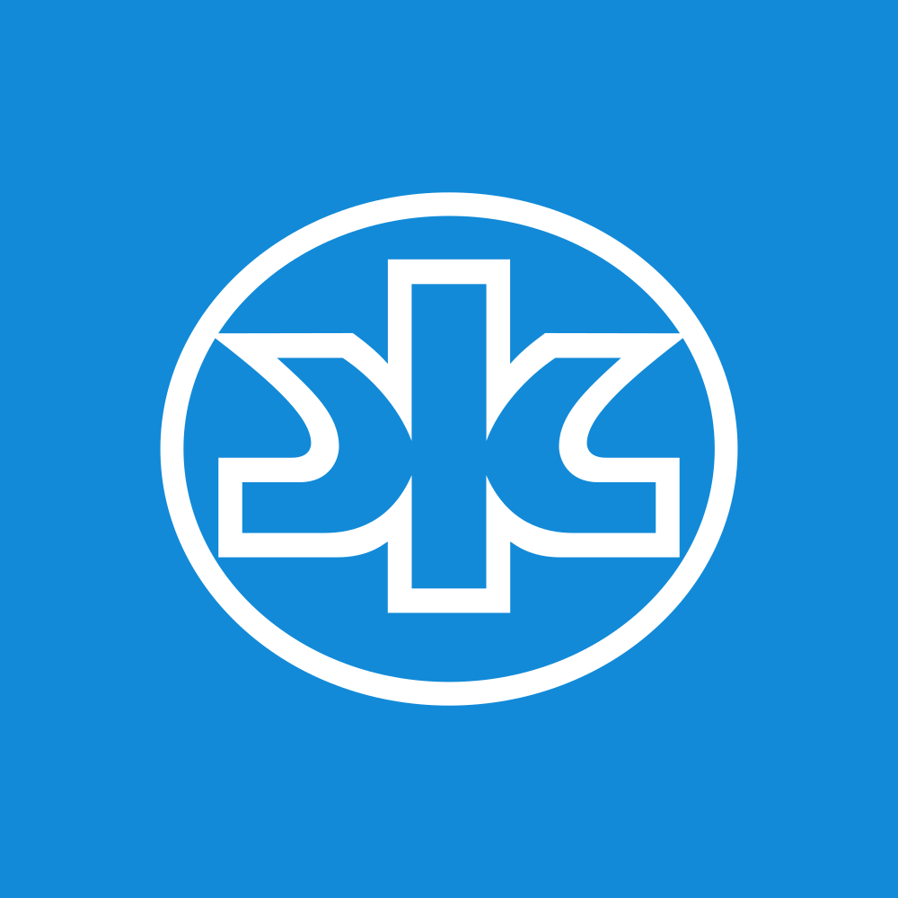 <span>Kimberly-Clark Corporation</span></div> | [Full Report](output/KMB/KMB_comprehensive_report.html) | <a href="output/KMB/KMB_zscore_dashboard.html" target="_blank"><div style="border:1px solid #ddd;padding:10px;text-align:center;border-radius:4px;background:#f8f9fa;">📊 Interactive Dashboard<br/><small>Click to view full dashboard</small></div></a> | ⚖️ HOLD<br/><sub>Z-Score: 2.83 (Gray Zone)</sub> |
| <div style="display: flex; align-items: center;">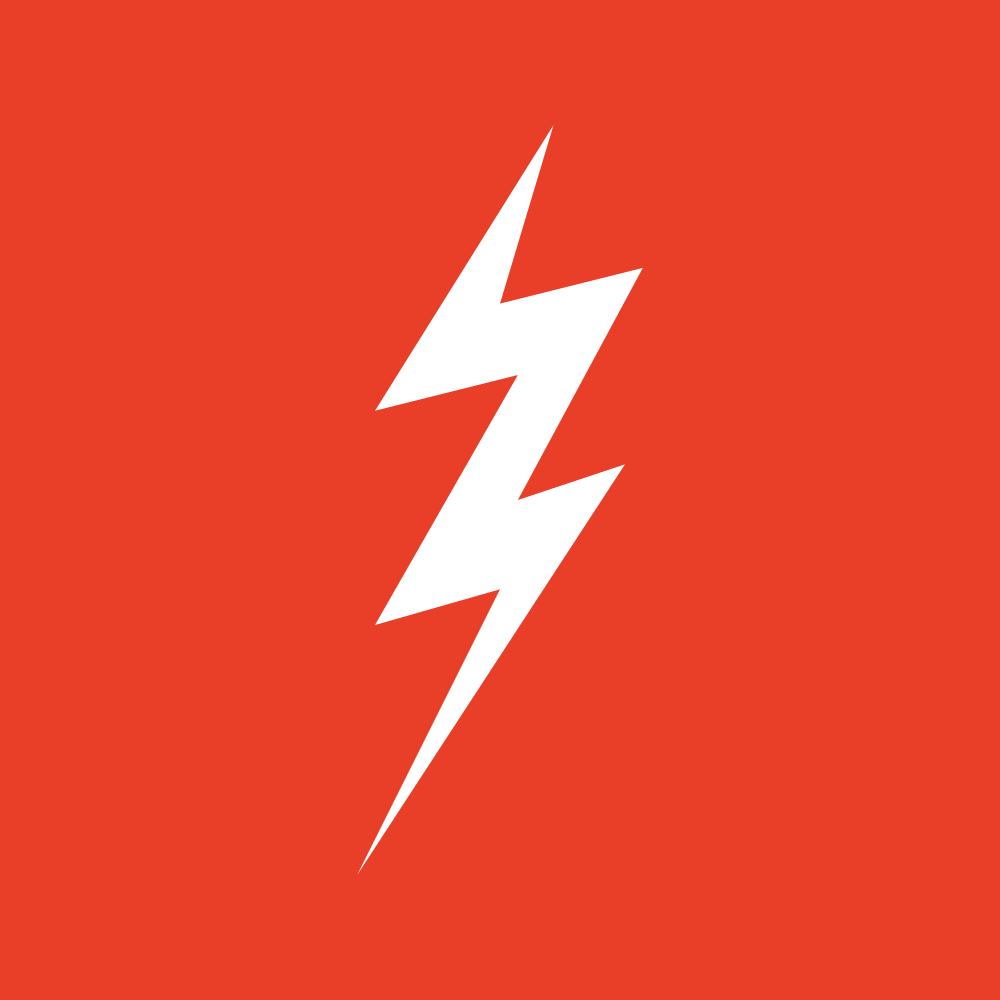 <span>Kinder Morgan, Inc.</span></div> | [Full Report](output/KMI/KMI_comprehensive_report.html) | <a href="output/KMI/KMI_zscore_dashboard.html" target="_blank"><div style="border:1px solid #ddd;padding:10px;text-align:center;border-radius:4px;background:#f8f9fa;">📊 Interactive Dashboard<br/><small>Click to view full dashboard</small></div></a> | 📉 SELL<br/><sub>Z-Score: 0.79 (Distress)</sub> |
| <div style="display: flex; align-items: center;">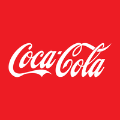 <span>The Coca-Cola Company</span></div> | [Full Report](output/KO/KO_comprehensive_report.html) | <a href="output/KO/KO_zscore_dashboard.html" target="_blank"><div style="border:1px solid #ddd;padding:10px;text-align:center;border-radius:4px;background:#f8f9fa;">📊 Interactive Dashboard<br/><small>Click to view full dashboard</small></div></a> | 📈 STRONG BUY<br/><sub>Z-Score: 3.75 (Safe)</sub> |
| <div style="display: flex; align-items: center;">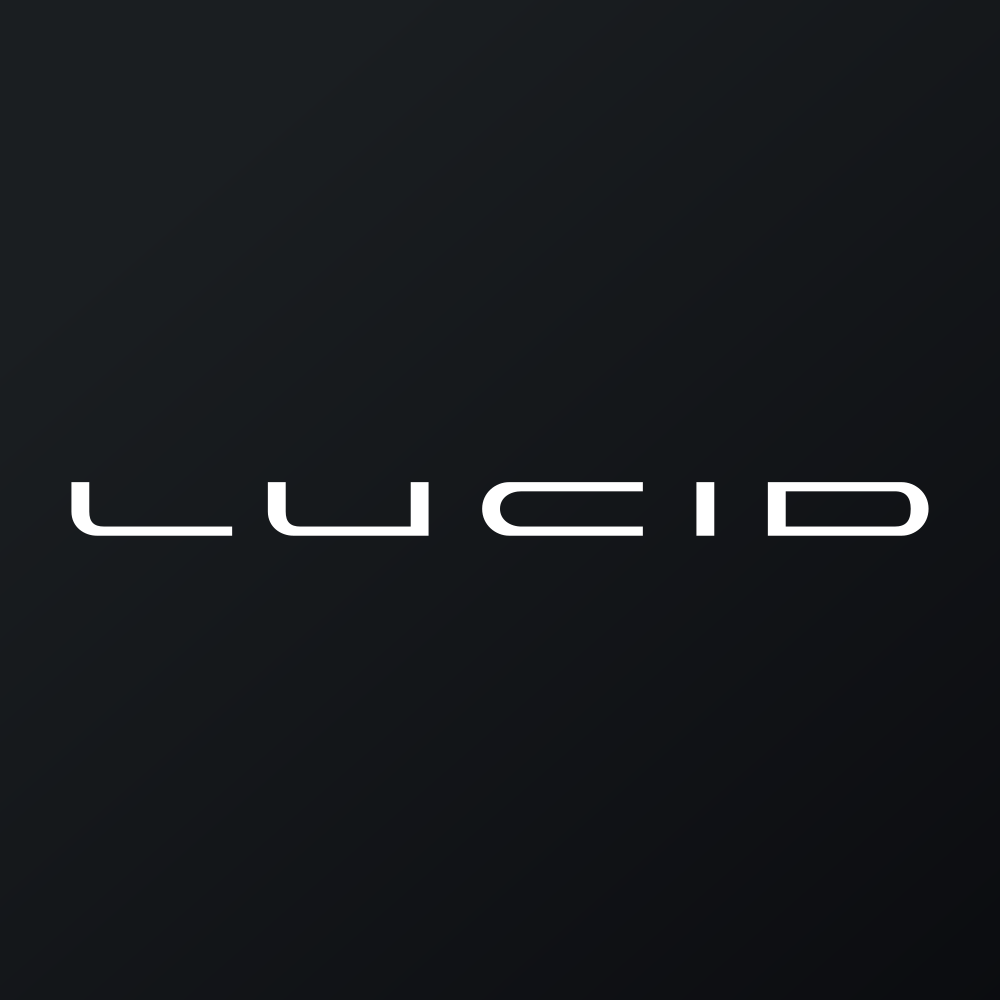 <span>Lucid Group, Inc.</span></div> | [Full Report](output/LCID/LCID_comprehensive_report.html) | <a href="output/LCID/LCID_zscore_dashboard.html" target="_blank"><div style="border:1px solid #ddd;padding:10px;text-align:center;border-radius:4px;background:#f8f9fa;">📊 Interactive Dashboard<br/><small>Click to view full dashboard</small></div></a> | 📉 SELL<br/><sub>Z-Score: -1.19 (Distress)</sub> |
| <div style="display: flex; align-items: center;"> <span>Lockheed Martin Corporation</span></div> | [Full Report](output/LMT/LMT_comprehensive_report.html) | <a href="output/LMT/LMT_zscore_dashboard.html" target="_blank"><div style="border:1px solid #ddd;padding:10px;text-align:center;border-radius:4px;background:#f8f9fa;">📊 Interactive Dashboard<br/><small>Click to view full dashboard</small></div></a> | ⚖️ HOLD<br/><sub>Z-Score: 2.14 (Gray Zone)</sub> |
| <div style="display: flex; align-items: center;">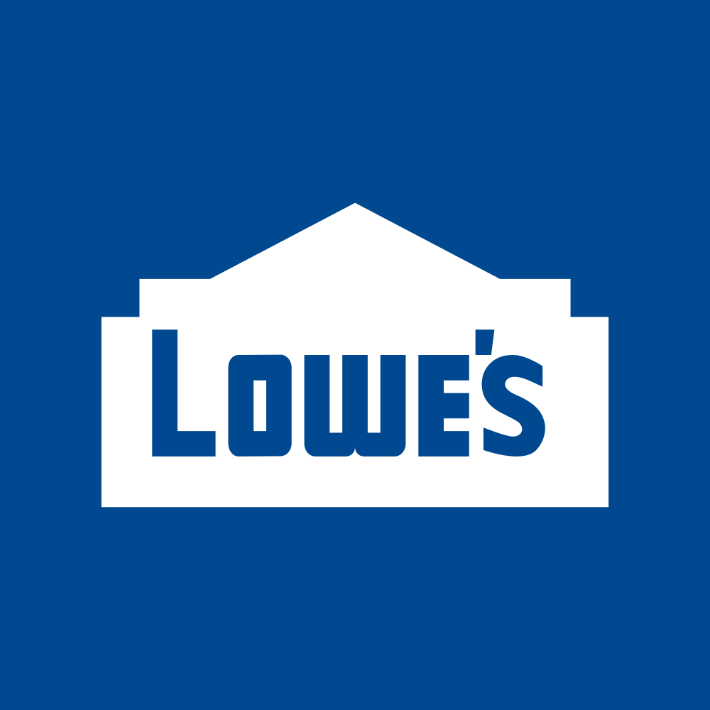 <span>Lowe's Companies, Inc.</span></div> | [Full Report](output/LOW/LOW_comprehensive_report.html) | <a href="output/LOW/LOW_zscore_dashboard.html" target="_blank"><div style="border:1px solid #ddd;padding:10px;text-align:center;border-radius:4px;background:#f8f9fa;">📊 Interactive Dashboard<br/><small>Click to view full dashboard</small></div></a> | 📉 SELL<br/><sub>Z-Score: 1.49 (Distress)</sub> |
| <div style="display: flex; align-items: center;">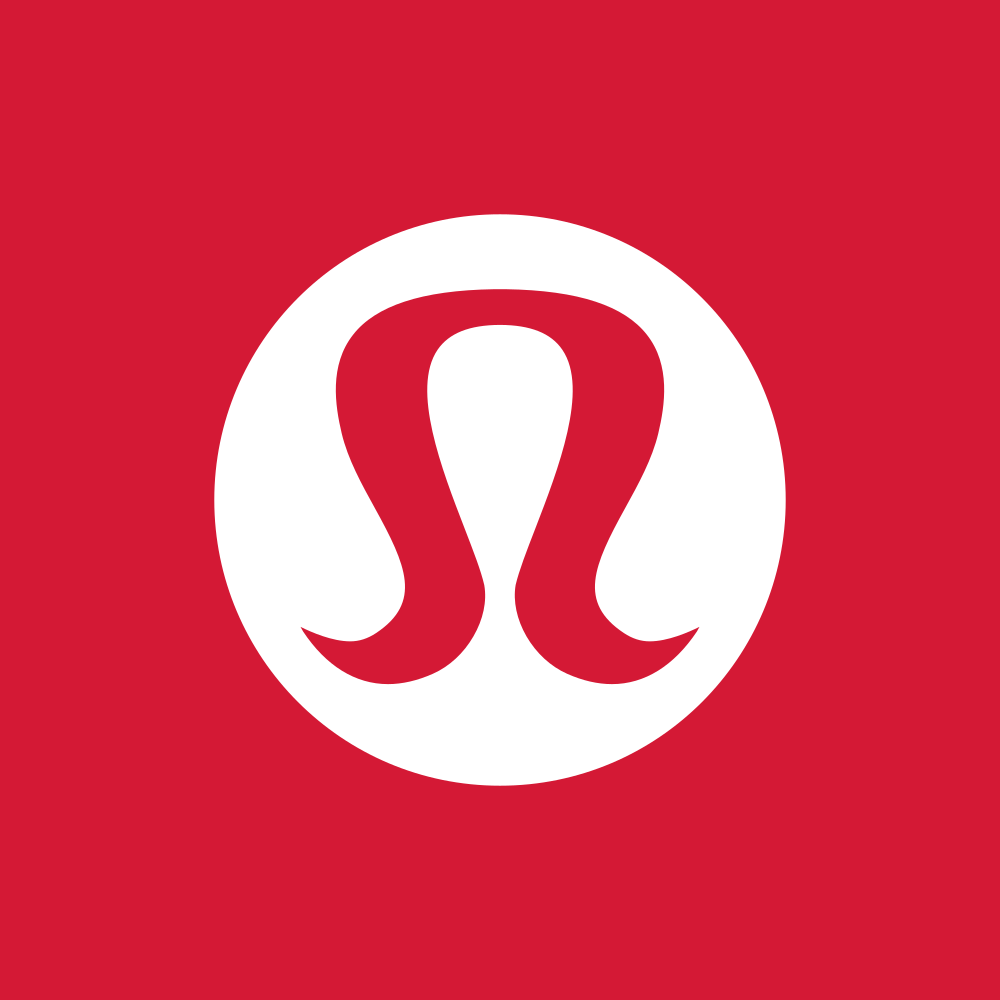 <span>Lululemon Athletica Inc.</span></div> | [Full Report](output/LULU/LULU_comprehensive_report.html) | <a href="output/LULU/LULU_zscore_dashboard.html" target="_blank"><div style="border:1px solid #ddd;padding:10px;text-align:center;border-radius:4px;background:#f8f9fa;">📊 Interactive Dashboard<br/><small>Click to view full dashboard</small></div></a> | 📈 STRONG BUY<br/><sub>Z-Score: 6.90 (Safe)</sub> |
| <div style="display: flex; align-items: center;"> <span>Southwest Airlines Co.</span></div> | [Full Report](output/LUV/LUV_comprehensive_report.html) | <a href="output/LUV/LUV_zscore_dashboard.html" target="_blank"><div style="border:1px solid #ddd;padding:10px;text-align:center;border-radius:4px;background:#f8f9fa;">📊 Interactive Dashboard<br/><small>Click to view full dashboard</small></div></a> | 📉 SELL<br/><sub>Z-Score: 1.18 (Distress)</sub> |
| <div style="display: flex; align-items: center;"> <span>Lyft, Inc.</span></div> | [Full Report](output/LYFT/LYFT_comprehensive_report.html) | <a href="output/LYFT/LYFT_zscore_dashboard.html" target="_blank"><div style="border:1px solid #ddd;padding:10px;text-align:center;border-radius:4px;background:#f8f9fa;">📊 Interactive Dashboard<br/><small>Click to view full dashboard</small></div></a> | 📉 SELL<br/><sub>Z-Score: -1.68 (Distress)</sub> |
| <div style="display: flex; align-items: center;">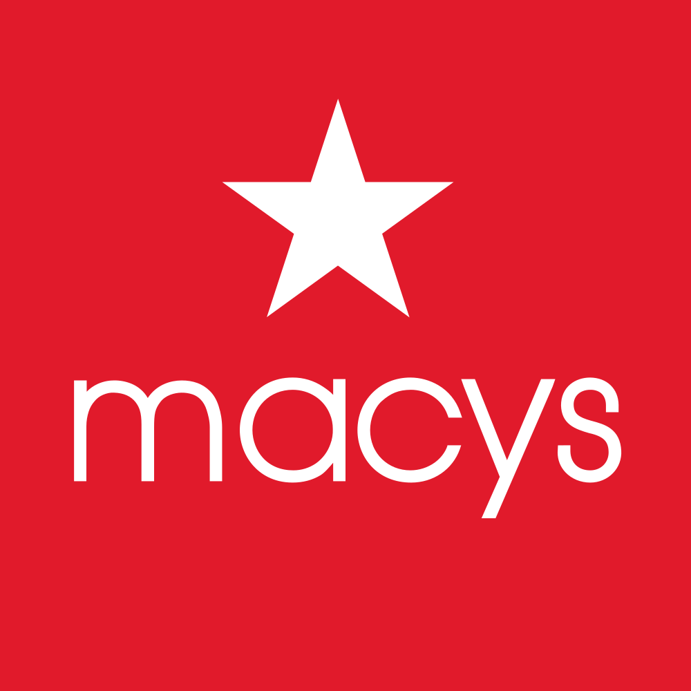 <span>Macy's, Inc.</span></div> | [Full Report](output/M/M_comprehensive_report.html) | <a href="output/M/M_zscore_dashboard.html" target="_blank"><div style="border:1px solid #ddd;padding:10px;text-align:center;border-radius:4px;background:#f8f9fa;">📊 Interactive Dashboard<br/><small>Click to view full dashboard</small></div></a> | 📉 SELL<br/><sub>Z-Score: 1.44 (Distress)</sub> |
| <div style="display: flex; align-items: center;"> <span>McKesson Corporation</span></div> | [Full Report](output/MCK/MCK_comprehensive_report.html) | <a href="output/MCK/MCK_zscore_dashboard.html" target="_blank"><div style="border:1px solid #ddd;padding:10px;text-align:center;border-radius:4px;background:#f8f9fa;">📊 Interactive Dashboard<br/><small>Click to view full dashboard</small></div></a> | ⚖️ HOLD<br/><sub>Z-Score: 2.21 (Gray Zone)</sub> |
| <div style="display: flex; align-items: center;"> <span>MongoDB, Inc.</span></div> | [Full Report](output/MDB/MDB_comprehensive_report.html) | <a href="output/MDB/MDB_zscore_dashboard.html" target="_blank"><div style="border:1px solid #ddd;padding:10px;text-align:center;border-radius:4px;background:#f8f9fa;">📊 Interactive Dashboard<br/><small>Click to view full dashboard</small></div></a> | 📈 STRONG BUY<br/><sub>Z-Score: 17.33 (Safe)</sub> |
| <div style="display: flex; align-items: center;"> <span>Meta Platforms, Inc.</span></div> | [Full Report](output/META/META_comprehensive_report.html) | <a href="output/META/META_zscore_dashboard.html" target="_blank"><div style="border:1px solid #ddd;padding:10px;text-align:center;border-radius:4px;background:#f8f9fa;">📊 Interactive Dashboard<br/><small>Click to view full dashboard</small></div></a> | 📈 STRONG BUY<br/><sub>Z-Score: 12.34 (Safe)</sub> |
| <div style="display: flex; align-items: center;">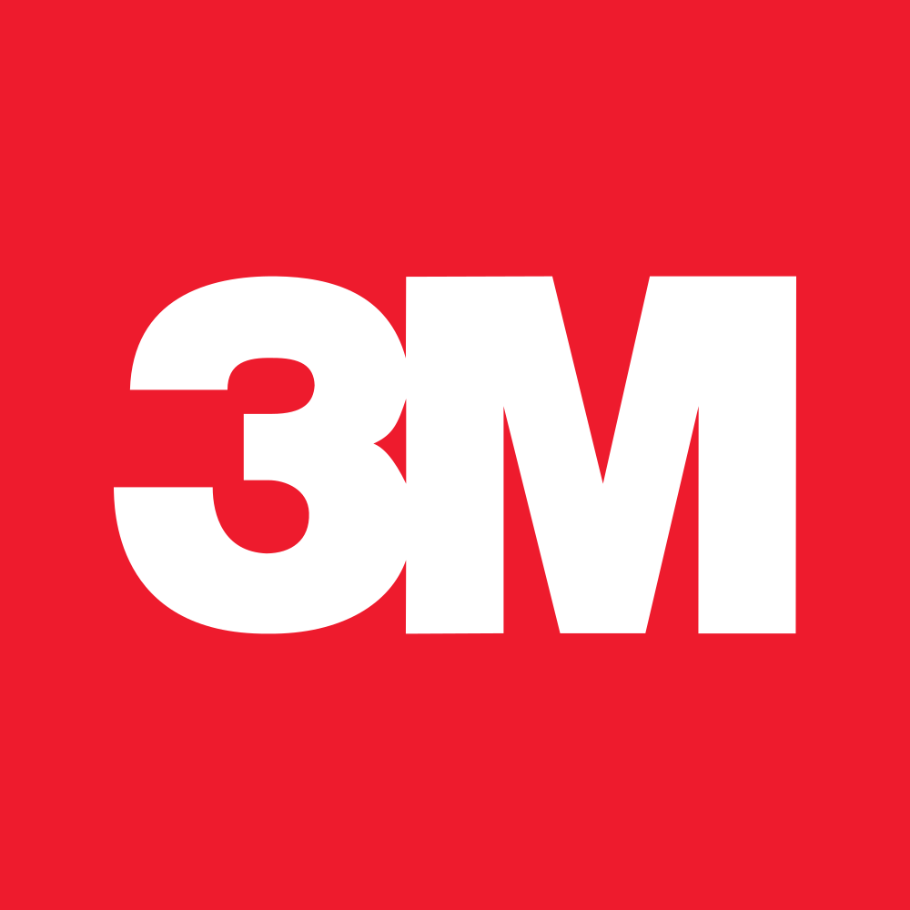 <span>3M Company</span></div> | [Full Report](output/MMM/MMM_comprehensive_report.html) | <a href="output/MMM/MMM_zscore_dashboard.html" target="_blank"><div style="border:1px solid #ddd;padding:10px;text-align:center;border-radius:4px;background:#f8f9fa;">📊 Interactive Dashboard<br/><small>Click to view full dashboard</small></div></a> | 📈 STRONG BUY<br/><sub>Z-Score: 3.10 (Safe)</sub> |
| <div style="display: flex; align-items: center;">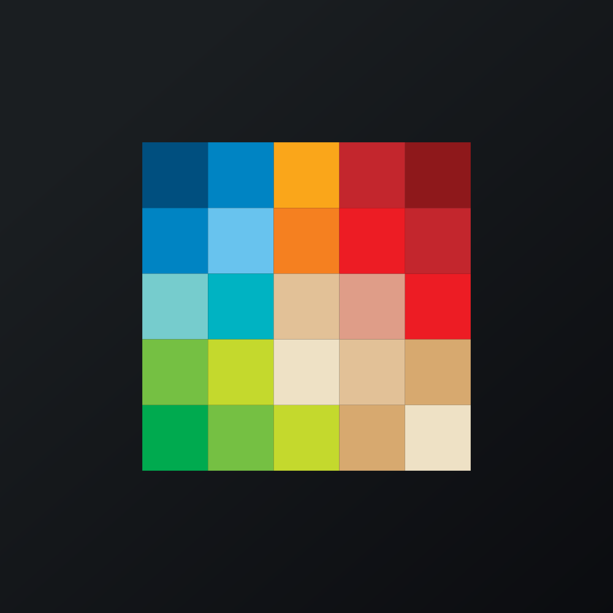 <span>Altria Group, Inc.</span></div> | [Full Report](output/MO/MO_comprehensive_report.html) | <a href="output/MO/MO_zscore_dashboard.html" target="_blank"><div style="border:1px solid #ddd;padding:10px;text-align:center;border-radius:4px;background:#f8f9fa;">📊 Interactive Dashboard<br/><small>Click to view full dashboard</small></div></a> | 📈 STRONG BUY<br/><sub>Z-Score: 3.02 (Safe)</sub> |
| <div style="display: flex; align-items: center;">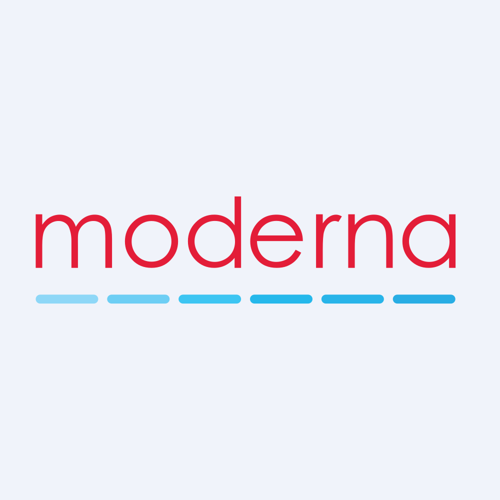 <span>Moderna, Inc.</span></div> | [Full Report](output/MRNA/MRNA_comprehensive_report.html) | <a href="output/MRNA/MRNA_zscore_dashboard.html" target="_blank"><div style="border:1px solid #ddd;padding:10px;text-align:center;border-radius:4px;background:#f8f9fa;">📊 Interactive Dashboard<br/><small>Click to view full dashboard</small></div></a> | 📈 STRONG BUY<br/><sub>Z-Score: 3.59 (Safe)</sub> |
| <div style="display: flex; align-items: center;"> <span>Microsoft Corporation</span></div> | [Full Report](output/MSFT/MSFT_comprehensive_report.html) | <a href="output/MSFT/MSFT_zscore_dashboard.html" target="_blank"><div style="border:1px solid #ddd;padding:10px;text-align:center;border-radius:4px;background:#f8f9fa;">📊 Interactive Dashboard<br/><small>Click to view full dashboard</small></div></a> | 📈 STRONG BUY<br/><sub>Z-Score: 10.07 (Safe)</sub> |
| <div style="display: flex; align-items: center;"> <span>Norwegian Cruise Line Holdings Ltd.</span></div> | [Full Report](output/NCLH/NCLH_comprehensive_report.html) | <a href="output/NCLH/NCLH_zscore_dashboard.html" target="_blank"><div style="border:1px solid #ddd;padding:10px;text-align:center;border-radius:4px;background:#f8f9fa;">📊 Interactive Dashboard<br/><small>Click to view full dashboard</small></div></a> | 📉 SELL<br/><sub>Z-Score: -0.29 (Distress)</sub> |
| <div style="display: flex; align-items: center;">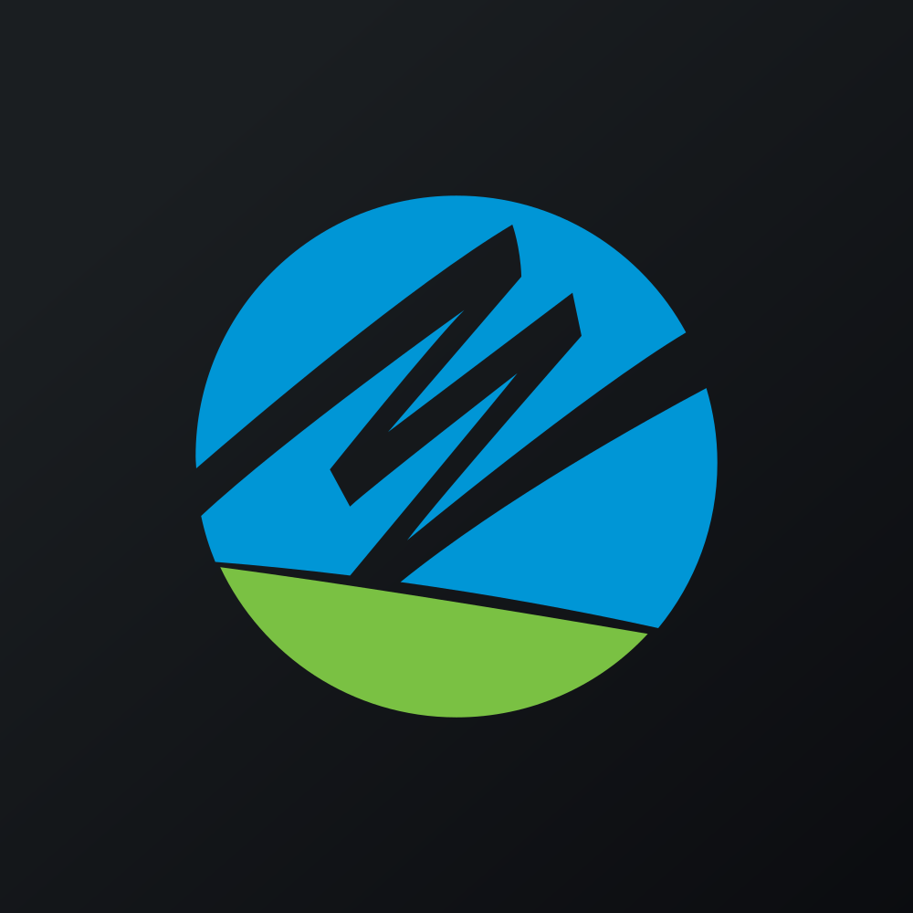 <span>NextEra Energy, Inc.</span></div> | [Full Report](output/NEE/NEE_comprehensive_report.html) | <a href="output/NEE/NEE_zscore_dashboard.html" target="_blank"><div style="border:1px solid #ddd;padding:10px;text-align:center;border-radius:4px;background:#f8f9fa;">📊 Interactive Dashboard<br/><small>Click to view full dashboard</small></div></a> | 📉 SELL<br/><sub>Z-Score: 0.89 (Distress)</sub> |
| <div style="display: flex; align-items: center;"> <span>Cloudflare, Inc.</span></div> | [Full Report](output/NET/NET_comprehensive_report.html) | <a href="output/NET/NET_zscore_dashboard.html" target="_blank"><div style="border:1px solid #ddd;padding:10px;text-align:center;border-radius:4px;background:#f8f9fa;">📊 Interactive Dashboard<br/><small>Click to view full dashboard</small></div></a> | 📈 STRONG BUY<br/><sub>Z-Score: 17.46 (Safe)</sub> |
| <div style="display: flex; align-items: center;">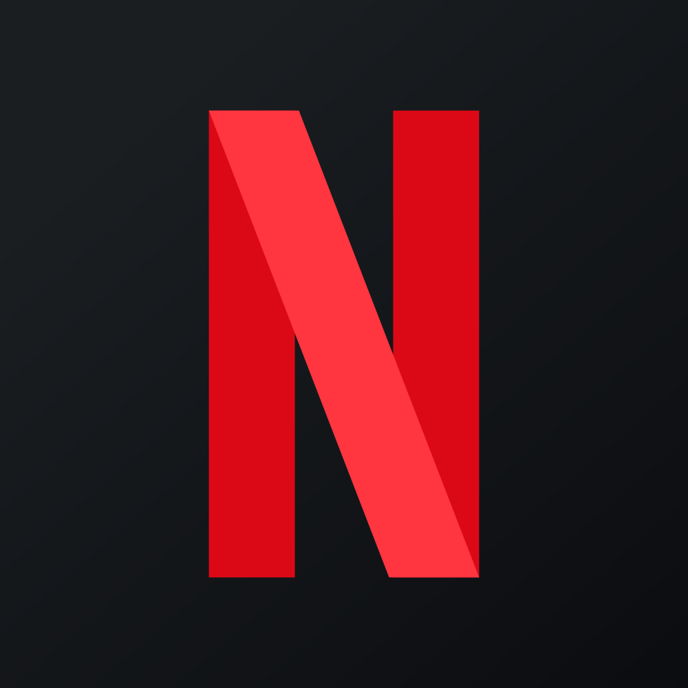 <span>Netflix, Inc.</span></div> | [Full Report](output/NFLX/NFLX_comprehensive_report.html) | <a href="output/NFLX/NFLX_zscore_dashboard.html" target="_blank"><div style="border:1px solid #ddd;padding:10px;text-align:center;border-radius:4px;background:#f8f9fa;">📊 Interactive Dashboard<br/><small>Click to view full dashboard</small></div></a> | 📈 STRONG BUY<br/><sub>Z-Score: 12.98 (Safe)</sub> |
| <div style="display: flex; align-items: center;">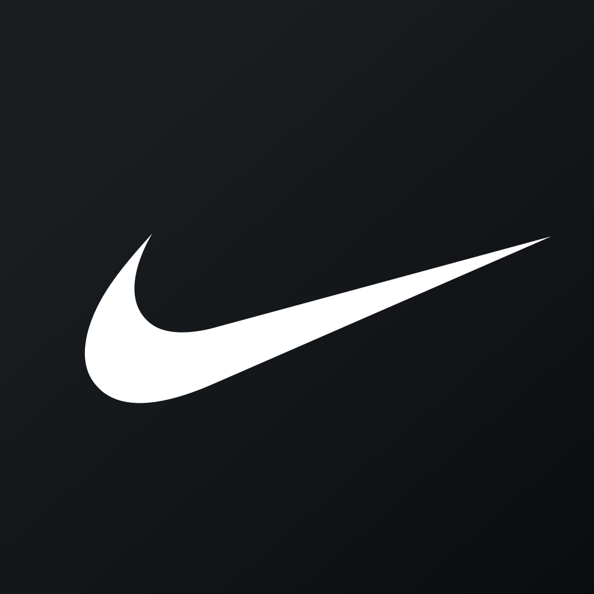 <span>NIKE, Inc.</span></div> | [Full Report](output/NKE/NKE_comprehensive_report.html) | <a href="output/NKE/NKE_zscore_dashboard.html" target="_blank"><div style="border:1px solid #ddd;padding:10px;text-align:center;border-radius:4px;background:#f8f9fa;">📊 Interactive Dashboard<br/><small>Click to view full dashboard</small></div></a> | 📈 STRONG BUY<br/><sub>Z-Score: 3.05 (Safe)</sub> |
| <div style="display: flex; align-items: center;"> <span>ServiceNow, Inc.</span></div> | [Full Report](output/NOW/NOW_comprehensive_report.html) | <a href="output/NOW/NOW_zscore_dashboard.html" target="_blank"><div style="border:1px solid #ddd;padding:10px;text-align:center;border-radius:4px;background:#f8f9fa;">📊 Interactive Dashboard<br/><small>Click to view full dashboard</small></div></a> | 📈 STRONG BUY<br/><sub>Z-Score: 12.07 (Safe)</sub> |
| <div style="display: flex; align-items: center;">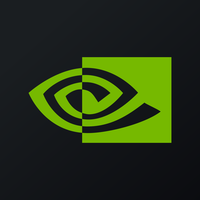 <span>NVIDIA Corporation</span></div> | [Full Report](output/NVDA/NVDA_comprehensive_report.html) | <a href="output/NVDA/NVDA_zscore_dashboard.html" target="_blank"><div style="border:1px solid #ddd;padding:10px;text-align:center;border-radius:4px;background:#f8f9fa;">📊 Interactive Dashboard<br/><small>Click to view full dashboard</small></div></a> | 📈 STRONG BUY<br/><sub>Z-Score: 56.86 (Safe)</sub> |
| <div style="display: flex; align-items: center;">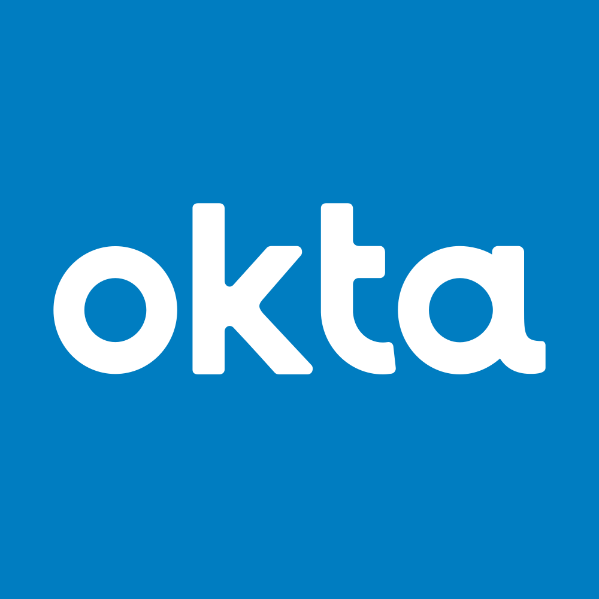 <span>Okta, Inc.</span></div> | [Full Report](output/OKTA/OKTA_comprehensive_report.html) | <a href="output/OKTA/OKTA_zscore_dashboard.html" target="_blank"><div style="border:1px solid #ddd;padding:10px;text-align:center;border-radius:4px;background:#f8f9fa;">📊 Interactive Dashboard<br/><small>Click to view full dashboard</small></div></a> | 📈 STRONG BUY<br/><sub>Z-Score: 3.50 (Safe)</sub> |
| <div style="display: flex; align-items: center;">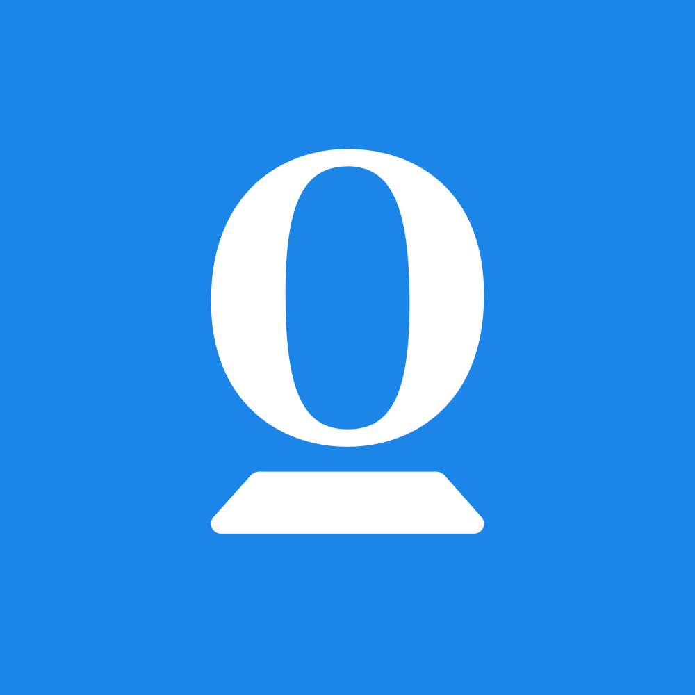 <span>Opendoor Technologies Inc.</span></div> | [Full Report](output/OPEN/OPEN_comprehensive_report.html) | <a href="output/OPEN/OPEN_zscore_dashboard.html" target="_blank"><div style="border:1px solid #ddd;padding:10px;text-align:center;border-radius:4px;background:#f8f9fa;">📊 Interactive Dashboard<br/><small>Click to view full dashboard</small></div></a> | 📉 SELL<br/><sub>Z-Score: -0.48 (Distress)</sub> |
| <div style="display: flex; align-items: center;">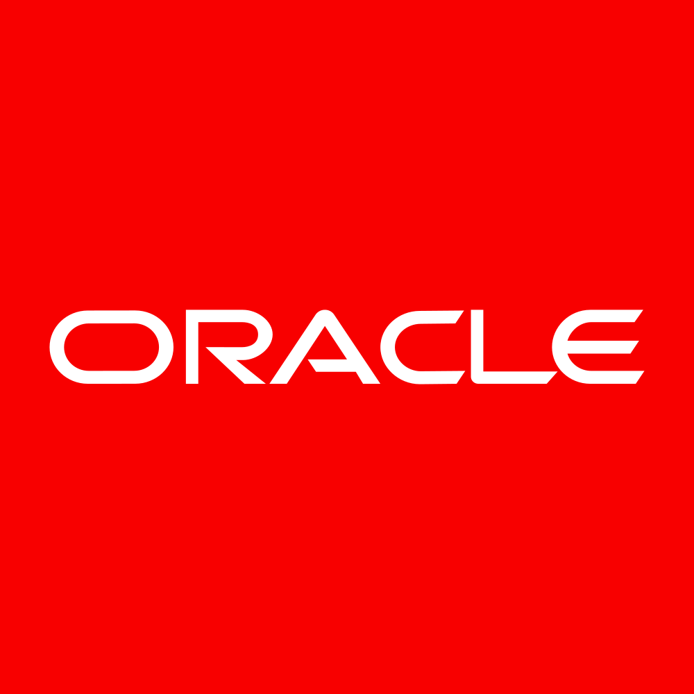 <span>Oracle Corporation</span></div> | [Full Report](output/ORCL/ORCL_comprehensive_report.html) | <a href="output/ORCL/ORCL_zscore_dashboard.html" target="_blank"><div style="border:1px solid #ddd;padding:10px;text-align:center;border-radius:4px;background:#f8f9fa;">📊 Interactive Dashboard<br/><small>Click to view full dashboard</small></div></a> | ⚖️ HOLD<br/><sub>Z-Score: 2.55 (Gray Zone)</sub> |
| <div style="display: flex; align-items: center;">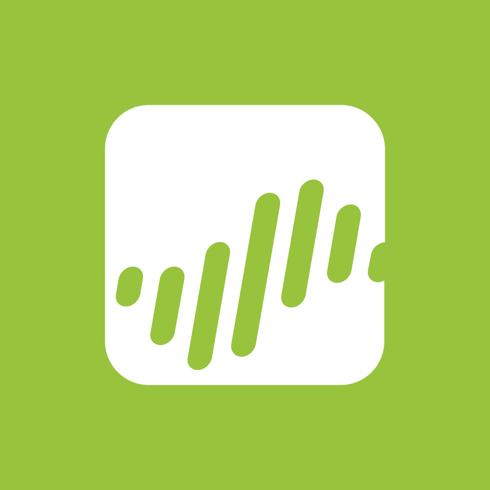 <span>Palo Alto Networks, Inc.</span></div> | [Full Report](output/PANW/PANW_comprehensive_report.html) | <a href="output/PANW/PANW_zscore_dashboard.html" target="_blank"><div style="border:1px solid #ddd;padding:10px;text-align:center;border-radius:4px;background:#f8f9fa;">📊 Interactive Dashboard<br/><small>Click to view full dashboard</small></div></a> | 📈 STRONG BUY<br/><sub>Z-Score: 5.77 (Safe)</sub> |
| <div style="display: flex; align-items: center;"> <span>UiPath Inc.</span></div> | [Full Report](output/PATH/PATH_comprehensive_report.html) | <a href="output/PATH/PATH_zscore_dashboard.html" target="_blank"><div style="border:1px solid #ddd;padding:10px;text-align:center;border-radius:4px;background:#f8f9fa;">📊 Interactive Dashboard<br/><small>Click to view full dashboard</small></div></a> | 📈 STRONG BUY<br/><sub>Z-Score: 3.91 (Safe)</sub> |
| <div style="display: flex; align-items: center;"> <span>PACCAR Inc</span></div> | [Full Report](output/PCAR/PCAR_comprehensive_report.html) | <a href="output/PCAR/PCAR_zscore_dashboard.html" target="_blank"><div style="border:1px solid #ddd;padding:10px;text-align:center;border-radius:4px;background:#f8f9fa;">📊 Interactive Dashboard<br/><small>Click to view full dashboard</small></div></a> | ⚖️ HOLD<br/><sub>Z-Score: 2.64 (Gray Zone)</sub> |
| <div style="display: flex; align-items: center;">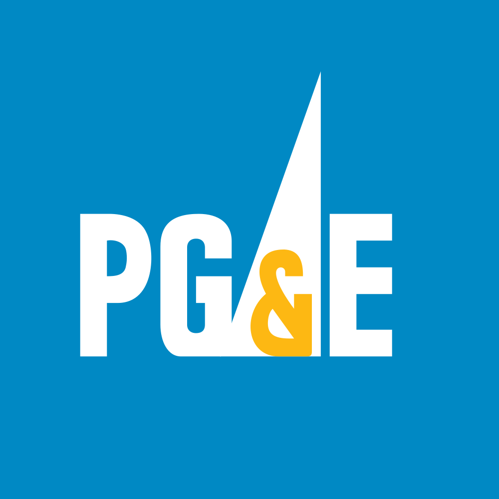 <span>PG&E Corporation</span></div> | [Full Report](output/PCG/PCG_comprehensive_report.html) | <a href="output/PCG/PCG_zscore_dashboard.html" target="_blank"><div style="border:1px solid #ddd;padding:10px;text-align:center;border-radius:4px;background:#f8f9fa;">📊 Interactive Dashboard<br/><small>Click to view full dashboard</small></div></a> | 📉 SELL<br/><sub>Z-Score: 0.21 (Distress)</sub> |
| <div style="display: flex; align-items: center;"> <span>PepsiCo, Inc.</span></div> | [Full Report](output/PEP/PEP_comprehensive_report.html) | <a href="output/PEP/PEP_zscore_dashboard.html" target="_blank"><div style="border:1px solid #ddd;padding:10px;text-align:center;border-radius:4px;background:#f8f9fa;">📊 Interactive Dashboard<br/><small>Click to view full dashboard</small></div></a> | ⚖️ HOLD<br/><sub>Z-Score: 2.46 (Gray Zone)</sub> |
| <div style="display: flex; align-items: center;">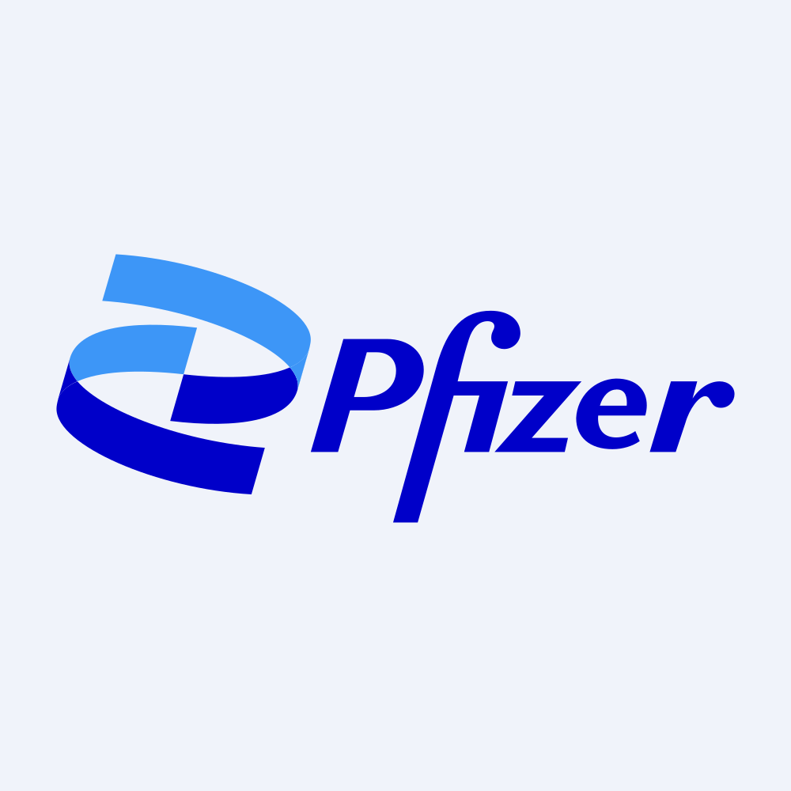 <span>Pfizer Inc.</span></div> | [Full Report](output/PFE/PFE_comprehensive_report.html) | <a href="output/PFE/PFE_zscore_dashboard.html" target="_blank"><div style="border:1px solid #ddd;padding:10px;text-align:center;border-radius:4px;background:#f8f9fa;">📊 Interactive Dashboard<br/><small>Click to view full dashboard</small></div></a> | 📉 SELL<br/><sub>Z-Score: 1.70 (Distress)</sub> |
| <div style="display: flex; align-items: center;">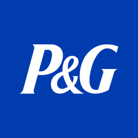 <span>The Procter & Gamble Company</span></div> | [Full Report](output/PG/PG_comprehensive_report.html) | <a href="output/PG/PG_zscore_dashboard.html" target="_blank"><div style="border:1px solid #ddd;padding:10px;text-align:center;border-radius:4px;background:#f8f9fa;">📊 Interactive Dashboard<br/><small>Click to view full dashboard</small></div></a> | 📈 STRONG BUY<br/><sub>Z-Score: 4.83 (Safe)</sub> |
| <div style="display: flex; align-items: center;">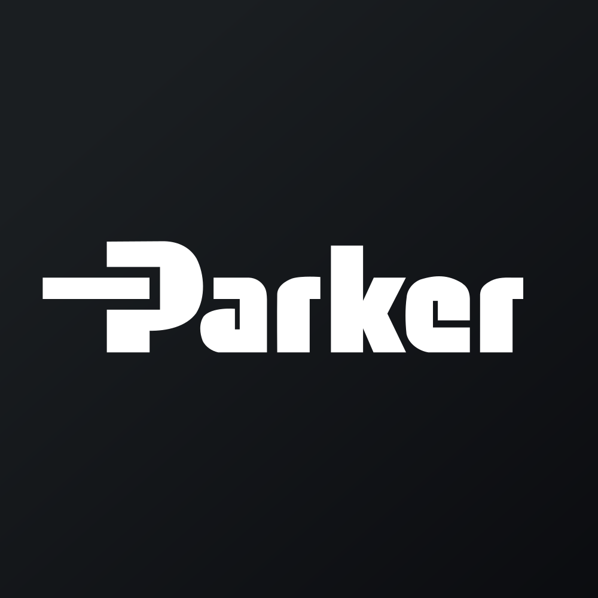 <span>Parker-Hannifin Corporation</span></div> | [Full Report](output/PH/PH_comprehensive_report.html) | <a href="output/PH/PH_zscore_dashboard.html" target="_blank"><div style="border:1px solid #ddd;padding:10px;text-align:center;border-radius:4px;background:#f8f9fa;">📊 Interactive Dashboard<br/><small>Click to view full dashboard</small></div></a> | 📈 STRONG BUY<br/><sub>Z-Score: 3.67 (Safe)</sub> |
| <div style="display: flex; align-items: center;"> <span>Palantir Technologies Inc.</span></div> | [Full Report](output/PLTR/PLTR_comprehensive_report.html) | <a href="output/PLTR/PLTR_zscore_dashboard.html" target="_blank"><div style="border:1px solid #ddd;padding:10px;text-align:center;border-radius:4px;background:#f8f9fa;">📊 Interactive Dashboard<br/><small>Click to view full dashboard</small></div></a> | 📈 STRONG BUY<br/><sub>Z-Score: 166.26 (Safe)</sub> |
| <div style="display: flex; align-items: center;"> <span>Philip Morris International Inc.</span></div> | [Full Report](output/PM/PM_comprehensive_report.html) | <a href="output/PM/PM_zscore_dashboard.html" target="_blank"><div style="border:1px solid #ddd;padding:10px;text-align:center;border-radius:4px;background:#f8f9fa;">📊 Interactive Dashboard<br/><small>Click to view full dashboard</small></div></a> | ⚖️ HOLD<br/><sub>Z-Score: 2.48 (Gray Zone)</sub> |
| <div style="display: flex; align-items: center;"> <span>PayPal Holdings, Inc.</span></div> | [Full Report](output/PYPL/PYPL_comprehensive_report.html) | <a href="output/PYPL/PYPL_zscore_dashboard.html" target="_blank"><div style="border:1px solid #ddd;padding:10px;text-align:center;border-radius:4px;background:#f8f9fa;">📊 Interactive Dashboard<br/><small>Click to view full dashboard</small></div></a> | 📉 SELL<br/><sub>Z-Score: 1.56 (Distress)</sub> |
| <div style="display: flex; align-items: center;">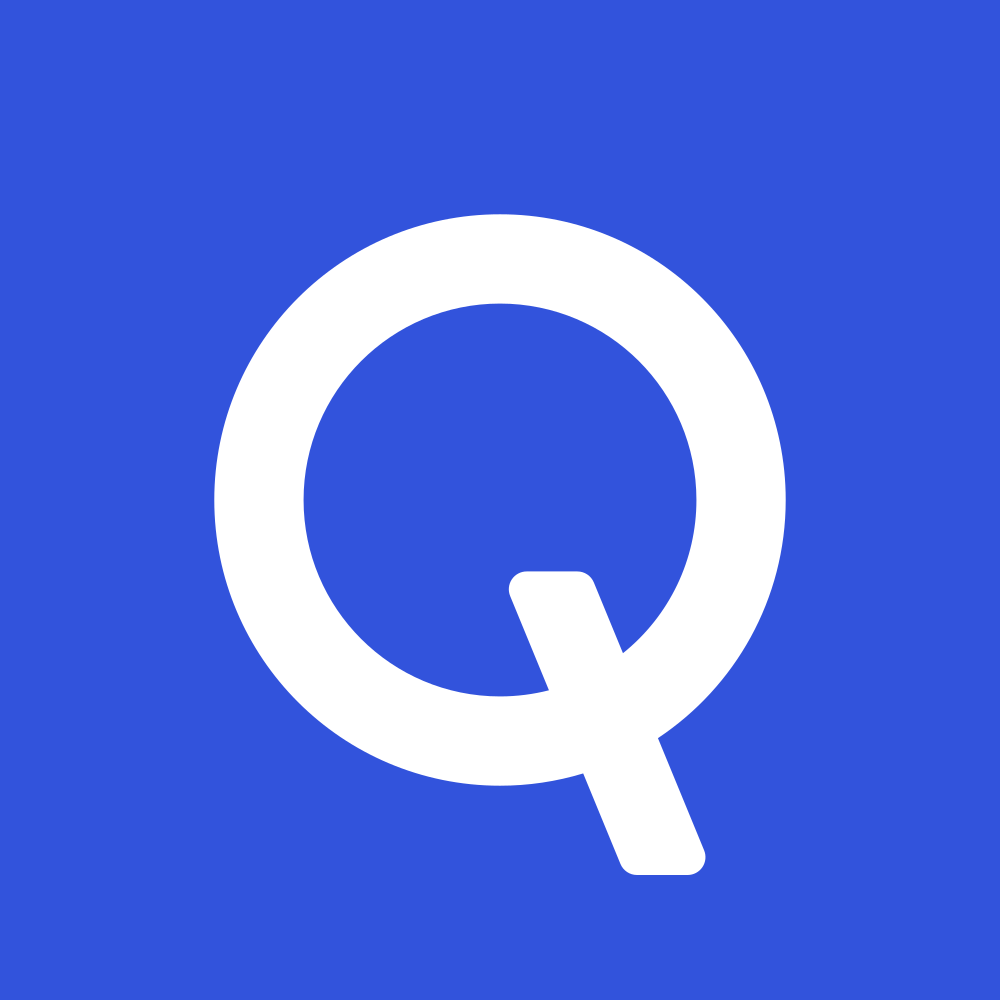 <span>QUALCOMM Incorporated</span></div> | [Full Report](output/QCOM/QCOM_comprehensive_report.html) | <a href="output/QCOM/QCOM_zscore_dashboard.html" target="_blank"><div style="border:1px solid #ddd;padding:10px;text-align:center;border-radius:4px;background:#f8f9fa;">📊 Interactive Dashboard<br/><small>Click to view full dashboard</small></div></a> | 📈 STRONG BUY<br/><sub>Z-Score: 5.15 (Safe)</sub> |
| <div style="display: flex; align-items: center;">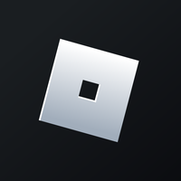 <span>Roblox Corporation</span></div> | [Full Report](output/RBLX/RBLX_comprehensive_report.html) | <a href="output/RBLX/RBLX_zscore_dashboard.html" target="_blank"><div style="border:1px solid #ddd;padding:10px;text-align:center;border-radius:4px;background:#f8f9fa;">📊 Interactive Dashboard<br/><small>Click to view full dashboard</small></div></a> | 📈 STRONG BUY<br/><sub>Z-Score: 5.10 (Safe)</sub> |
| <div style="display: flex; align-items: center;"> <span>Rivian Automotive, Inc.</span></div> | [Full Report](output/RIVN/RIVN_comprehensive_report.html) | <a href="output/RIVN/RIVN_zscore_dashboard.html" target="_blank"><div style="border:1px solid #ddd;padding:10px;text-align:center;border-radius:4px;background:#f8f9fa;">📊 Interactive Dashboard<br/><small>Click to view full dashboard</small></div></a> | 📉 SELL<br/><sub>Z-Score: -0.60 (Distress)</sub> |
| <div style="display: flex; align-items: center;">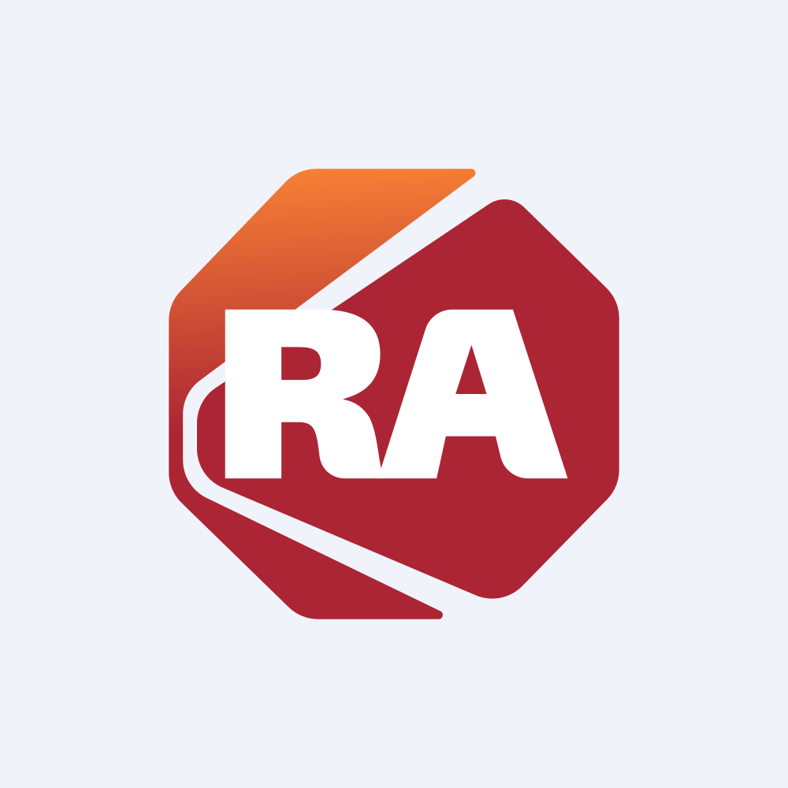 <span>Rockwell Automation, Inc.</span></div> | [Full Report](output/ROK/ROK_comprehensive_report.html) | <a href="output/ROK/ROK_zscore_dashboard.html" target="_blank"><div style="border:1px solid #ddd;padding:10px;text-align:center;border-radius:4px;background:#f8f9fa;">📊 Interactive Dashboard<br/><small>Click to view full dashboard</small></div></a> | 📈 STRONG BUY<br/><sub>Z-Score: 3.93 (Safe)</sub> |
| <div style="display: flex; align-items: center;"> <span>Roku, Inc.</span></div> | [Full Report](output/ROKU/ROKU_comprehensive_report.html) | <a href="output/ROKU/ROKU_zscore_dashboard.html" target="_blank"><div style="border:1px solid #ddd;padding:10px;text-align:center;border-radius:4px;background:#f8f9fa;">📊 Interactive Dashboard<br/><small>Click to view full dashboard</small></div></a> | 📈 STRONG BUY<br/><sub>Z-Score: 4.75 (Safe)</sub> |
| <div style="display: flex; align-items: center;">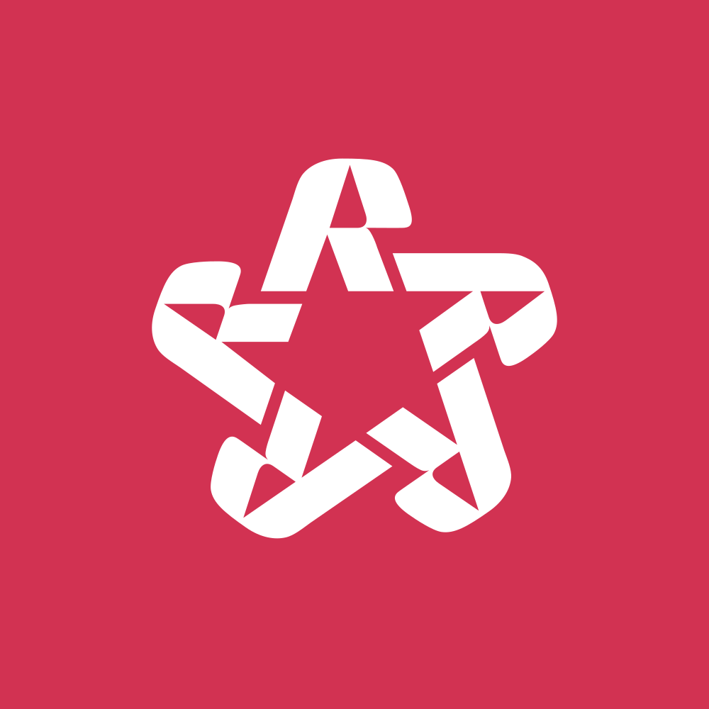 <span>Republic Services, Inc.</span></div> | [Full Report](output/RSG/RSG_comprehensive_report.html) | <a href="output/RSG/RSG_zscore_dashboard.html" target="_blank"><div style="border:1px solid #ddd;padding:10px;text-align:center;border-radius:4px;background:#f8f9fa;">📊 Interactive Dashboard<br/><small>Click to view full dashboard</small></div></a> | ⚖️ HOLD<br/><sub>Z-Score: 2.72 (Gray Zone)</sub> |
| <div style="display: flex; align-items: center;">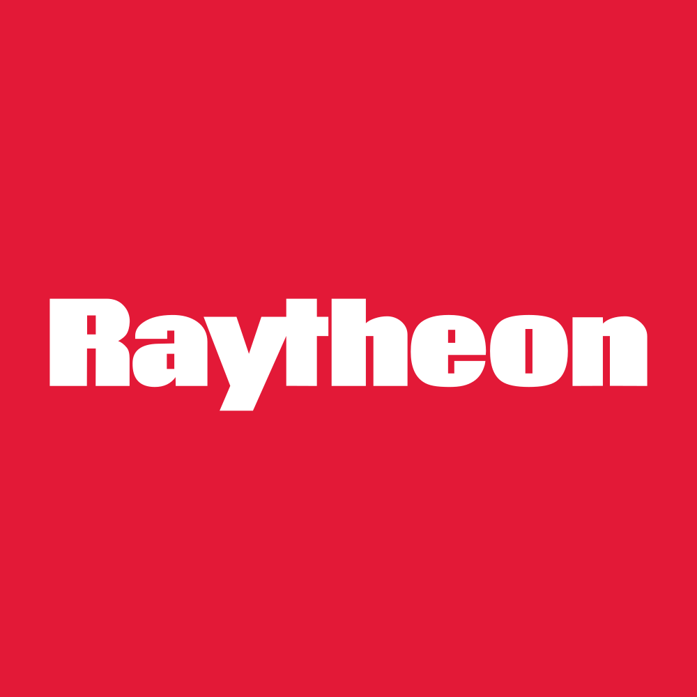 <span>RTX Corporation</span></div> | [Full Report](output/RTX/RTX_comprehensive_report.html) | <a href="output/RTX/RTX_zscore_dashboard.html" target="_blank"><div style="border:1px solid #ddd;padding:10px;text-align:center;border-radius:4px;background:#f8f9fa;">📊 Interactive Dashboard<br/><small>Click to view full dashboard</small></div></a> | 📉 SELL<br/><sub>Z-Score: 1.74 (Distress)</sub> |
| <div style="display: flex; align-items: center;">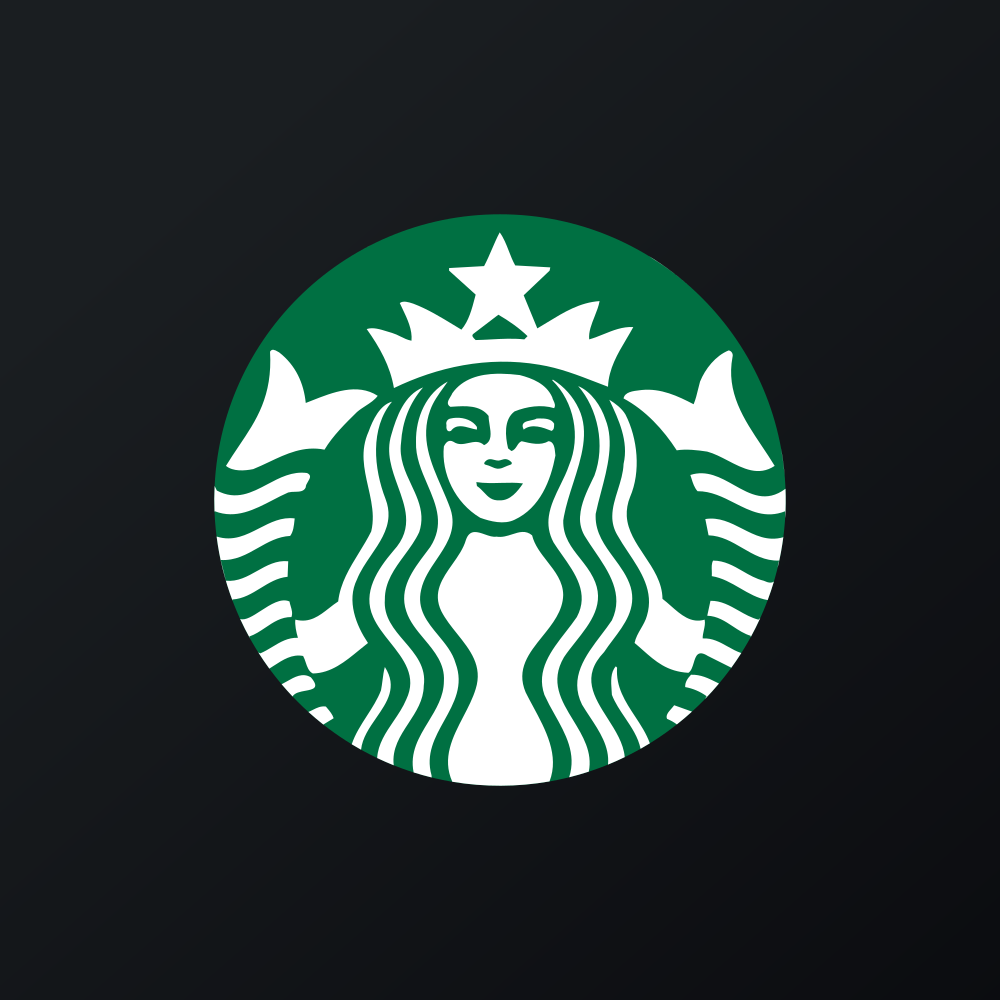 <span>Starbucks Corporation</span></div> | [Full Report](output/SBUX/SBUX_comprehensive_report.html) | <a href="output/SBUX/SBUX_zscore_dashboard.html" target="_blank"><div style="border:1px solid #ddd;padding:10px;text-align:center;border-radius:4px;background:#f8f9fa;">📊 Interactive Dashboard<br/><small>Click to view full dashboard</small></div></a> | 📉 SELL<br/><sub>Z-Score: 1.45 (Distress)</sub> |
| <div style="display: flex; align-items: center;"> <span>Shopify Inc.</span></div> | [Full Report](output/SHOP/SHOP_comprehensive_report.html) | <a href="output/SHOP/SHOP_zscore_dashboard.html" target="_blank"><div style="border:1px solid #ddd;padding:10px;text-align:center;border-radius:4px;background:#f8f9fa;">📊 Interactive Dashboard<br/><small>Click to view full dashboard</small></div></a> | 📈 STRONG BUY<br/><sub>Z-Score: 38.53 (Safe)</sub> |
| <div style="display: flex; align-items: center;"> <span>Schlumberger Limited</span></div> | [Full Report](output/SLB/SLB_comprehensive_report.html) | <a href="output/SLB/SLB_zscore_dashboard.html" target="_blank"><div style="border:1px solid #ddd;padding:10px;text-align:center;border-radius:4px;background:#f8f9fa;">📊 Interactive Dashboard<br/><small>Click to view full dashboard</small></div></a> | 📉 SELL<br/><sub>Z-Score: 1.78 (Distress)</sub> |
| <div style="display: flex; align-items: center;"> <span>Snowflake Inc.</span></div> | [Full Report](output/SNOW/SNOW_comprehensive_report.html) | <a href="output/SNOW/SNOW_zscore_dashboard.html" target="_blank"><div style="border:1px solid #ddd;padding:10px;text-align:center;border-radius:4px;background:#f8f9fa;">📊 Interactive Dashboard<br/><small>Click to view full dashboard</small></div></a> | 📈 STRONG BUY<br/><sub>Z-Score: 6.50 (Safe)</sub> |
| <div style="display: flex; align-items: center;">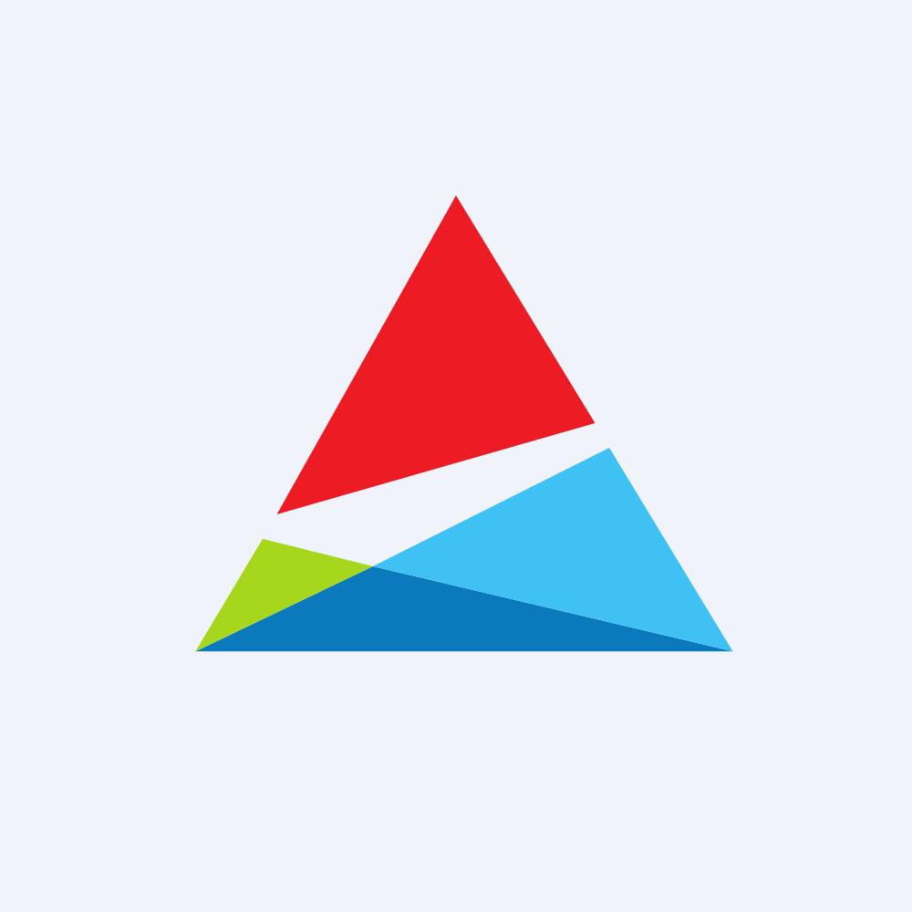 <span>The Southern Company</span></div> | [Full Report](output/SO/SO_comprehensive_report.html) | <a href="output/SO/SO_zscore_dashboard.html" target="_blank"><div style="border:1px solid #ddd;padding:10px;text-align:center;border-radius:4px;background:#f8f9fa;">📊 Interactive Dashboard<br/><small>Click to view full dashboard</small></div></a> | 📉 SELL<br/><sub>Z-Score: 0.75 (Distress)</sub> |
| <div style="display: flex; align-items: center;">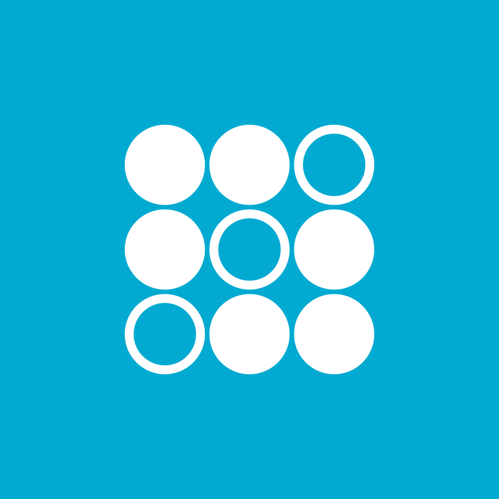 <span>SoFi Technologies, Inc.</span></div> | [Full Report](output/SOFI/SOFI_comprehensive_report.html) | <a href="output/SOFI/SOFI_zscore_dashboard.html" target="_blank"><div style="border:1px solid #ddd;padding:10px;text-align:center;border-radius:4px;background:#f8f9fa;">📊 Interactive Dashboard<br/><small>Click to view full dashboard</small></div></a> | 📉 SELL<br/><sub>Z-Score: 0.47 (Distress)</sub> |
| <div style="display: flex; align-items: center;">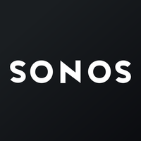 <span>Sonos, Inc.</span></div> | [Full Report](output/SONO/SONO_comprehensive_report.html) | <a href="output/SONO/SONO_zscore_dashboard.html" target="_blank"><div style="border:1px solid #ddd;padding:10px;text-align:center;border-radius:4px;background:#f8f9fa;">📊 Interactive Dashboard<br/><small>Click to view full dashboard</small></div></a> | ⚖️ HOLD<br/><sub>Z-Score: 2.09 (Gray Zone)</sub> |
| <div style="display: flex; align-items: center;">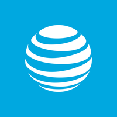 <span>AT&T Inc.</span></div> | [Full Report](output/T/T_comprehensive_report.html) | <a href="output/T/T_zscore_dashboard.html" target="_blank"><div style="border:1px solid #ddd;padding:10px;text-align:center;border-radius:4px;background:#f8f9fa;">📊 Interactive Dashboard<br/><small>Click to view full dashboard</small></div></a> | 📉 SELL<br/><sub>Z-Score: 0.53 (Distress)</sub> |
| <div style="display: flex; align-items: center;">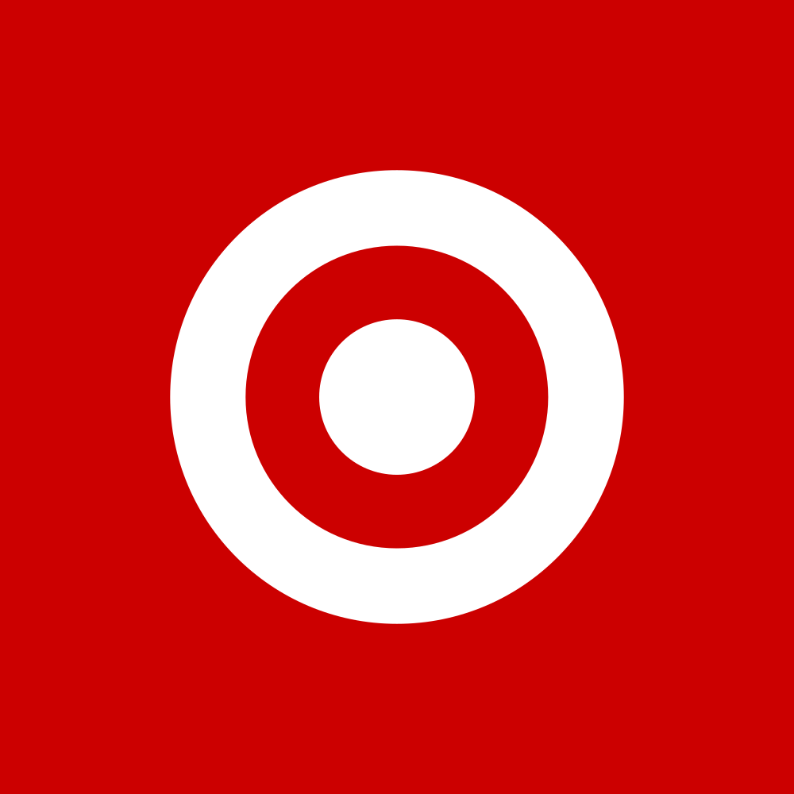 <span>Target Corporation</span></div> | [Full Report](output/TGT/TGT_comprehensive_report.html) | <a href="output/TGT/TGT_zscore_dashboard.html" target="_blank"><div style="border:1px solid #ddd;padding:10px;text-align:center;border-radius:4px;background:#f8f9fa;">📊 Interactive Dashboard<br/><small>Click to view full dashboard</small></div></a> | 📉 SELL<br/><sub>Z-Score: 1.33 (Distress)</sub> |
| <div style="display: flex; align-items: center;"> <span>Thermo Fisher Scientific Inc.</span></div> | [Full Report](output/TMO/TMO_comprehensive_report.html) | <a href="output/TMO/TMO_zscore_dashboard.html" target="_blank"><div style="border:1px solid #ddd;padding:10px;text-align:center;border-radius:4px;background:#f8f9fa;">📊 Interactive Dashboard<br/><small>Click to view full dashboard</small></div></a> | ⚖️ HOLD<br/><sub>Z-Score: 2.16 (Gray Zone)</sub> |
| <div style="display: flex; align-items: center;">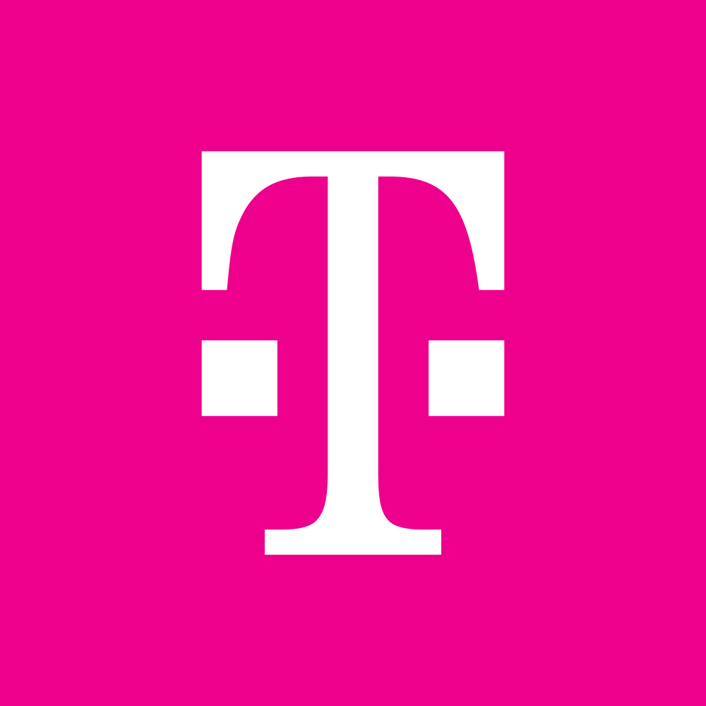 <span>T-Mobile US, Inc.</span></div> | [Full Report](output/TMUS/TMUS_comprehensive_report.html) | <a href="output/TMUS/TMUS_zscore_dashboard.html" target="_blank"><div style="border:1px solid #ddd;padding:10px;text-align:center;border-radius:4px;background:#f8f9fa;">📊 Interactive Dashboard<br/><small>Click to view full dashboard</small></div></a> | 📉 SELL<br/><sub>Z-Score: 1.32 (Distress)</sub> |
| <div style="display: flex; align-items: center;"> <span>Tesla, Inc.</span></div> | [Full Report](output/TSLA/TSLA_comprehensive_report.html) | <a href="output/TSLA/TSLA_zscore_dashboard.html" target="_blank"><div style="border:1px solid #ddd;padding:10px;text-align:center;border-radius:4px;background:#f8f9fa;">📊 Interactive Dashboard<br/><small>Click to view full dashboard</small></div></a> | 📈 STRONG BUY<br/><sub>Z-Score: 13.59 (Safe)</sub> |
| <div style="display: flex; align-items: center;"> <span>Twilio Inc.</span></div> | [Full Report](output/TWLO/TWLO_comprehensive_report.html) | <a href="output/TWLO/TWLO_zscore_dashboard.html" target="_blank"><div style="border:1px solid #ddd;padding:10px;text-align:center;border-radius:4px;background:#f8f9fa;">📊 Interactive Dashboard<br/><small>Click to view full dashboard</small></div></a> | 📈 STRONG BUY<br/><sub>Z-Score: 5.44 (Safe)</sub> |
| <div style="display: flex; align-items: center;"> <span>Texas Instruments Incorporated</span></div> | [Full Report](output/TXN/TXN_comprehensive_report.html) | <a href="output/TXN/TXN_zscore_dashboard.html" target="_blank"><div style="border:1px solid #ddd;padding:10px;text-align:center;border-radius:4px;background:#f8f9fa;">📊 Interactive Dashboard<br/><small>Click to view full dashboard</small></div></a> | 📈 STRONG BUY<br/><sub>Z-Score: 9.24 (Safe)</sub> |
| <div style="display: flex; align-items: center;"> <span>Unity Software Inc.</span></div> | [Full Report](output/U/U_comprehensive_report.html) | <a href="output/U/U_zscore_dashboard.html" target="_blank"><div style="border:1px solid #ddd;padding:10px;text-align:center;border-radius:4px;background:#f8f9fa;">📊 Interactive Dashboard<br/><small>Click to view full dashboard</small></div></a> | 📉 SELL<br/><sub>Z-Score: 1.33 (Distress)</sub> |
| <div style="display: flex; align-items: center;"> <span>United Airlines Holdings, Inc.</span></div> | [Full Report](output/UAL/UAL_comprehensive_report.html) | <a href="output/UAL/UAL_zscore_dashboard.html" target="_blank"><div style="border:1px solid #ddd;padding:10px;text-align:center;border-radius:4px;background:#f8f9fa;">📊 Interactive Dashboard<br/><small>Click to view full dashboard</small></div></a> | 📉 SELL<br/><sub>Z-Score: 0.35 (Distress)</sub> |
| <div style="display: flex; align-items: center;"> <span>Uber Technologies, Inc.</span></div> | [Full Report](output/UBER/UBER_comprehensive_report.html) | <a href="output/UBER/UBER_zscore_dashboard.html" target="_blank"><div style="border:1px solid #ddd;padding:10px;text-align:center;border-radius:4px;background:#f8f9fa;">📊 Interactive Dashboard<br/><small>Click to view full dashboard</small></div></a> | 📈 STRONG BUY<br/><sub>Z-Score: 3.61 (Safe)</sub> |
| <div style="display: flex; align-items: center;"> <span>Unilever PLC</span></div> | [Full Report](output/UL/UL_comprehensive_report.html) | <a href="output/UL/UL_zscore_dashboard.html" target="_blank"><div style="border:1px solid #ddd;padding:10px;text-align:center;border-radius:4px;background:#f8f9fa;">📊 Interactive Dashboard<br/><small>Click to view full dashboard</small></div></a> | ⚖️ HOLD<br/><sub>Z-Score: 2.87 (Gray Zone)</sub> |
| <div style="display: flex; align-items: center;"> <span>UnitedHealth Group Incorporated</span></div> | [Full Report](output/UNH/UNH_comprehensive_report.html) | <a href="output/UNH/UNH_zscore_dashboard.html" target="_blank"><div style="border:1px solid #ddd;padding:10px;text-align:center;border-radius:4px;background:#f8f9fa;">📊 Interactive Dashboard<br/><small>Click to view full dashboard</small></div></a> | 📉 SELL<br/><sub>Z-Score: 1.63 (Distress)</sub> |
| <div style="display: flex; align-items: center;">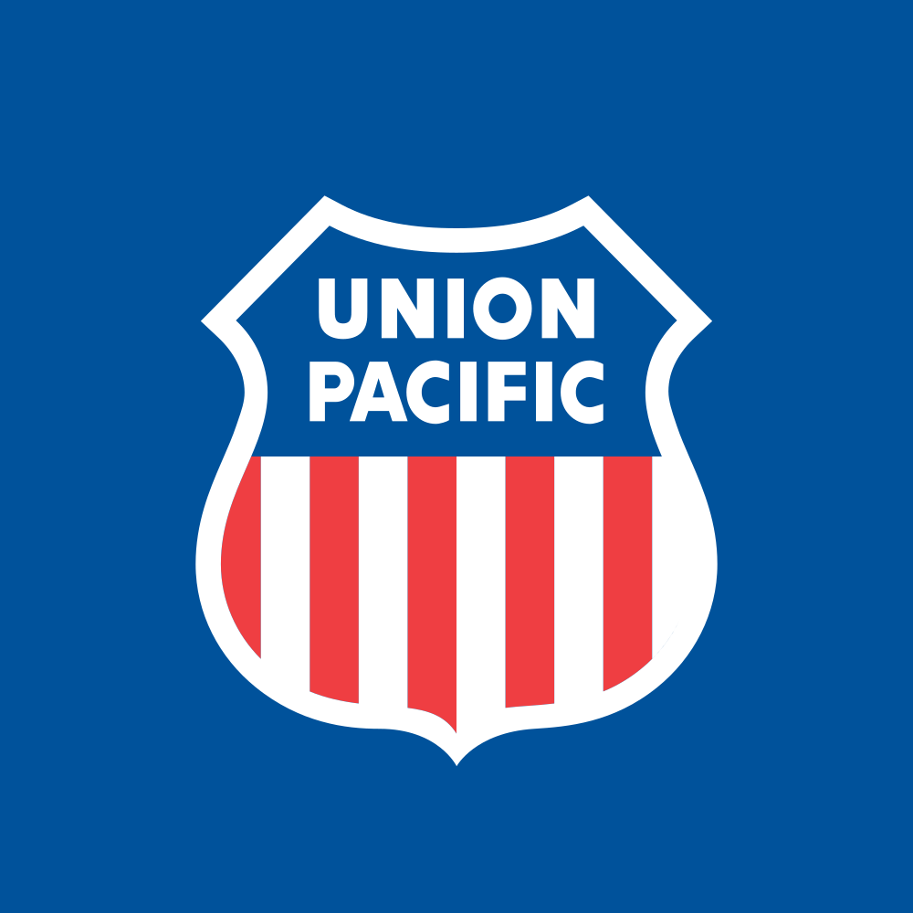 <span>Union Pacific Corporation</span></div> | [Full Report](output/UNP/UNP_comprehensive_report.html) | <a href="output/UNP/UNP_zscore_dashboard.html" target="_blank"><div style="border:1px solid #ddd;padding:10px;text-align:center;border-radius:4px;background:#f8f9fa;">📊 Interactive Dashboard<br/><small>Click to view full dashboard</small></div></a> | 📈 STRONG BUY<br/><sub>Z-Score: 3.08 (Safe)</sub> |
| <div style="display: flex; align-items: center;"> <span>United Parcel Service, Inc.</span></div> | [Full Report](output/UPS/UPS_comprehensive_report.html) | <a href="output/UPS/UPS_zscore_dashboard.html" target="_blank"><div style="border:1px solid #ddd;padding:10px;text-align:center;border-radius:4px;background:#f8f9fa;">📊 Interactive Dashboard<br/><small>Click to view full dashboard</small></div></a> | 📉 SELL<br/><sub>Z-Score: 1.78 (Distress)</sub> |
| <div style="display: flex; align-items: center;"> <span>Upstart Holdings, Inc.</span></div> | [Full Report](output/UPST/UPST_comprehensive_report.html) | <a href="output/UPST/UPST_zscore_dashboard.html" target="_blank"><div style="border:1px solid #ddd;padding:10px;text-align:center;border-radius:4px;background:#f8f9fa;">📊 Interactive Dashboard<br/><small>Click to view full dashboard</small></div></a> | ⚖️ HOLD<br/><sub>Z-Score: 2.35 (Gray Zone)</sub> |
| <div style="display: flex; align-items: center;"> <span>Verizon Communications Inc.</span></div> | [Full Report](output/VZ/VZ_comprehensive_report.html) | <a href="output/VZ/VZ_zscore_dashboard.html" target="_blank"><div style="border:1px solid #ddd;padding:10px;text-align:center;border-radius:4px;background:#f8f9fa;">📊 Interactive Dashboard<br/><small>Click to view full dashboard</small></div></a> | 📉 SELL<br/><sub>Z-Score: 0.80 (Distress)</sub> |
| <div style="display: flex; align-items: center;"> <span>Walgreens Boots Alliance, Inc.</span></div> | [Full Report](output/WBA/WBA_comprehensive_report.html) | <a href="output/WBA/WBA_zscore_dashboard.html" target="_blank"><div style="border:1px solid #ddd;padding:10px;text-align:center;border-radius:4px;background:#f8f9fa;">📊 Interactive Dashboard<br/><small>Click to view full dashboard</small></div></a> | 📉 SELL<br/><sub>Z-Score: 0.77 (Distress)</sub> |
| <div style="display: flex; align-items: center;"> <span>Waste Management, Inc.</span></div> | [Full Report](output/WM/WM_comprehensive_report.html) | <a href="output/WM/WM_zscore_dashboard.html" target="_blank"><div style="border:1px solid #ddd;padding:10px;text-align:center;border-radius:4px;background:#f8f9fa;">📊 Interactive Dashboard<br/><small>Click to view full dashboard</small></div></a> | ⚖️ HOLD<br/><sub>Z-Score: 2.24 (Gray Zone)</sub> |
| <div style="display: flex; align-items: center;">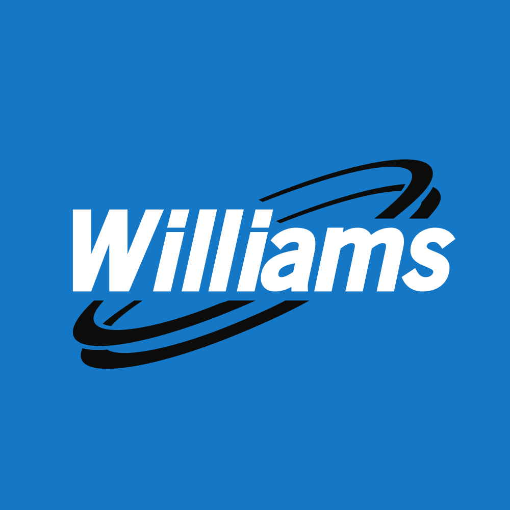 <span>The Williams Companies, Inc.</span></div> | [Full Report](output/WMB/WMB_comprehensive_report.html) | <a href="output/WMB/WMB_zscore_dashboard.html" target="_blank"><div style="border:1px solid #ddd;padding:10px;text-align:center;border-radius:4px;background:#f8f9fa;">📊 Interactive Dashboard<br/><small>Click to view full dashboard</small></div></a> | 📈 STRONG BUY<br/><sub>Z-Score: 18.42 (Safe)</sub> |
| <div style="display: flex; align-items: center;">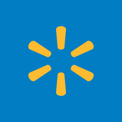 <span>Walmart Inc.</span></div> | [Full Report](output/WMT/WMT_comprehensive_report.html) | <a href="output/WMT/WMT_zscore_dashboard.html" target="_blank"><div style="border:1px solid #ddd;padding:10px;text-align:center;border-radius:4px;background:#f8f9fa;">📊 Interactive Dashboard<br/><small>Click to view full dashboard</small></div></a> | 📈 STRONG BUY<br/><sub>Z-Score: 3.81 (Safe)</sub> |
| <div style="display: flex; align-items: center;">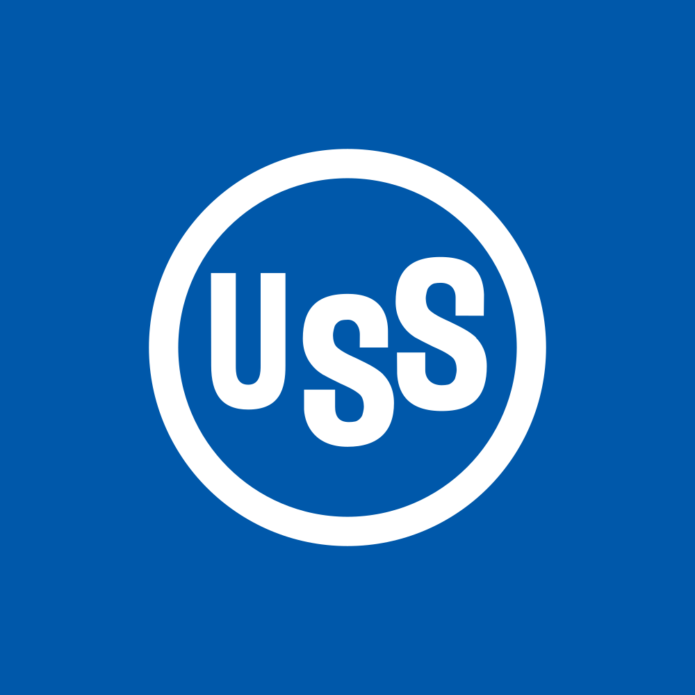 <span>United States Steel Corporation</span></div> | [Full Report](output/X/X_comprehensive_report.html) | <a href="output/X/X_zscore_dashboard.html" target="_blank"><div style="border:1px solid #ddd;padding:10px;text-align:center;border-radius:4px;background:#f8f9fa;">📊 Interactive Dashboard<br/><small>Click to view full dashboard</small></div></a> | ⚖️ HOLD<br/><sub>Z-Score: 2.09 (Gray Zone)</sub> |
| <div style="display: flex; align-items: center;"> <span>Exxon Mobil Corporation</span></div> | [Full Report](output/XOM/XOM_comprehensive_report.html) | <a href="output/XOM/XOM_zscore_dashboard.html" target="_blank"><div style="border:1px solid #ddd;padding:10px;text-align:center;border-radius:4px;background:#f8f9fa;">📊 Interactive Dashboard<br/><small>Click to view full dashboard</small></div></a> | 📈 STRONG BUY<br/><sub>Z-Score: 3.23 (Safe)</sub> |
| <div style="display: flex; align-items: center;"> <span>Zoom Video Communications, Inc.</span></div> | [Full Report](output/ZM/ZM_comprehensive_report.html) | <a href="output/ZM/ZM_zscore_dashboard.html" target="_blank"><div style="border:1px solid #ddd;padding:10px;text-align:center;border-radius:4px;background:#f8f9fa;">📊 Interactive Dashboard<br/><small>Click to view full dashboard</small></div></a> | 📈 STRONG BUY<br/><sub>Z-Score: 8.21 (Safe)</sub> |
<!-- END_TICKERS_TABLE -->

---

## 🔄 **Update Your Analysis**

Keep your portfolio analysis current with a single command:

```bash
python generate_readme_table.py
```

This updates the comprehensive investment table with the latest market data and AI insights for all 135+ companies.

---

## ⚙️ **Quick Setup**

### **Step 1: Install**
```bash
pip install -r requirements.txt
```

### **Step 2: Configure APIs** 
Create a `.env` file with your API keys:
```bash
# Required for financial data
FINANCIAL_MODELING_PREP_API_KEY="your-fmp-key"

# Required for AI insights  
AZURE_OPENAI_ENDPOINT="your-azure-endpoint"
AZURE_OPENAI_API_KEY="your-azure-key"
AZURE_OPENAI_DEPLOYMENT="your-deployment"

# Required for SEC compliance
SEC_EDGAR_USER_AGENT="YourCompany/1.0 your.email@domain.com"
```

### **Step 3: Start Analyzing**
```bash
# Single company
python main.py AAPL

# Your favorite stocks
python main.py AAPL MSFT GOOGL TSLA NVDA
```

### **📊 API Costs**
- **Free Tier Available:** 250 API calls/day (analyze ~50 companies)
- **Paid Plans:** Unlimited analysis for serious investors
- **Smart Caching:** Reduces API usage by 95%

---

## 🎯 **Perfect For**

### 👨‍💼 **Individual Investors**
- Research stocks before buying
- Monitor portfolio health
- Get AI-powered insights
- Identify bankruptcy risks early

### 🏢 **Investment Professionals**
- Due diligence automation
- Client reporting
- Risk assessment
- Portfolio optimization

### 📚 **Students & Educators**
- Learn financial analysis
- Understand Z-Score methodology
- Practice with real data
- Academic research projects

---

## � **Support & Community**

### 🚀 **Getting Started**
- Check the **[Quick Start Guide](docs/guides/)** for detailed setup
- Browse **[Sample Reports](output/)** to see what you'll get
- Review **[API Documentation](APIS.md)** for configuration help

### 📈 **Advanced Features**
- **[Technical Documentation](docs/)** for developers
- **[Customization Guide](docs/guides/)** for power users
- **[Integration Examples](scripts/exploration/)** for workflows

---

## 📄 **Legal & Data Sources**

**License:** MIT License - Free for personal and commercial use

**Data Sources:**
- 📊 **Financial Modeling Prep** - Professional financial data
- 📈 **Yahoo Finance** - Real-time market pricing  
- 🤖 **Azure OpenAI** - AI-powered analysis and insights

**Disclaimer:** This tool is for educational and informational purposes. Always consult with qualified financial advisors before making investment decisions. Past performance does not guarantee future results.
