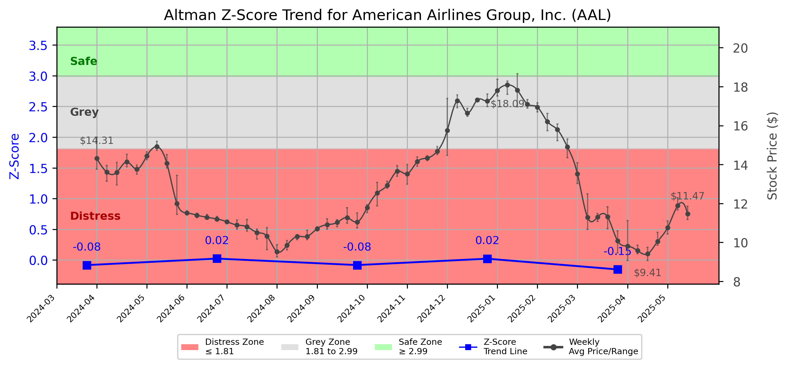

# Altman Z-Score Analysis Report: American Airlines Group, Inc. (AAL)

---
## Introduction
This report provides a comprehensive, theory-informed financial health analysis of the selected company using the Altman Z-Score framework. It integrates quantitative diagnostics, turnaround management theory, and stakeholder recommendations, with all findings and recommendations grounded in referenced academic and industry sources. The analysis is generated by an expert LLM-driven pipeline, ensuring transparency, reproducibility, and robust source attribution.

**Author:** Fabio Correa

**Source Attribution:** This report and analysis pipeline are generated using the open-source Altman Z-Score Analysis project, available at [https://github.com/fabioc-aloha/Altman-Z-Score](https://github.com/fabioc-aloha/Altman-Z-Score).

**License:** This software is distributed under the Attribution Non-Commercial License (MIT-based). See the LICENSE file for details.

Disclaimer: The developer disclaims any responsibility for the accuracy, completeness, or consequences of the analysis and information provided by this software. All results are for informational purposes only and should not be relied upon for financial, investment, or legal decisions.
---

**Script Version:** v2.7.1

## Analysis Context and Z-Score Model Selection Criteria

- **Industry:** SIC 4512 (SIC 4512)
- **Ticker:** AAL
- **Public:** True
- **Emerging Market:** False
- **Maturity:** Mature Company
- **Model:** Zʺ-Score (Public Non-Manufacturing, 1995) (service)
- **Analysis Date:** 2025-06-03

## Z-Score Formula Used

Z = 6.56*X1 + 3.26*X2 + 6.72*X3 + 1.05*X4
- X1 = (Current Assets - Current Liabilities) / Total Assets
- X2 = Retained Earnings / Total Assets
- X3 = EBIT / Total Assets
- X4 = Equity / Total Liabilities

**Thresholds:**
- Safe Zone: > 2.90
- Grey Zone: > 1.23 and <= 2.90
- Distress Zone: <= 1.23

---

# Graphical View of the Z-Score Analysis

*Figure: Z-Score and stock price trend for AAL (image not available yet; will be generated after analysis)*

## Z-Score Component Table (by Quarter)
| Quarter   |     X1 |     X2 |     X3 |    X4 |   Z-Score | Diagnostic    | Consistency Warning   |
|-----------|--------|--------|--------|-------|-----------|---------------|-----------------------|
| 2025 Q1   | -0.2   | -0.117 | -0.004 | 0.104 |    -1.606 | Distress Zone | No issues             |
| 2024 Q4   | -0.18  | -0.111 |  0.02  | 0.175 |    -1.223 | Distress Zone | No issues             |
| 2024 Q3   | -0.174 | -0.117 |  0.004 | 0.108 |    -1.388 | Distress Zone | No issues             |
| 2024 Q2   | -0.153 | -0.114 |  0.024 | 0.108 |    -1.102 | Distress Zone | No issues             |
| 2024 Q1   | -0.162 | -0.124 |  0.001 | 0.145 |    -1.309 | Distress Zone | No issues             |
# Altman Z-Score Analysis Report: American Airlines Group, Inc. (AAL)

---

## Company Profile

American Airlines Group Inc. (AAL) is a major player in the air transportation industry, classified under SIC 4512. The company operates a vast network of scheduled air transportation services, competing with other large airlines such as Delta Air Lines and United Airlines. American Airlines offers a range of products and services, including passenger flights, cargo services, and loyalty programs, catering to both domestic and international travelers.

The leadership team is headed by Mr. Robert D. Isom Jr., who serves as the CEO, President, and Director, overseeing the company's strategic vision and operational execution. Other key executives include Mr. Devon E. May, the Executive VP and CFO, responsible for financial stewardship and risk management, and Mr. David G. Seymour, the Executive VP and COO, who manages day-to-day operations. The team also includes Mr. Stephen L. Johnson, the Chief Strategy Officer and Vice Chair, who focuses on long-term strategic initiatives. Notably, the executive compensation packages reflect the company's commitment to retaining top talent, with Mr. Isom receiving total compensation of approximately $4.36 million.

---

## 1. Diagnostic Evaluation of Financial Health

### Liquidity
American Airlines has been struggling with liquidity, as indicated by a negative X1 value across multiple quarters. This suggests that current liabilities exceed current assets, raising concerns about the company's ability to meet short-term obligations.

### Profitability
The profitability measure (X3) shows negative EBIT values, indicating that the company has been operating at a loss. This is a significant concern, especially in a capital-intensive industry like air transportation.

### Capital Efficiency
The retained earnings ratio (X2) is also negative, reflecting accumulated losses over time. This is detrimental to the company's equity base and overall financial health.

### Leverage
The leverage ratio (X4) indicates that equity is insufficient to cover liabilities, which is a red flag for creditors and investors alike.

### Z-Score Trajectory and Risk Status
The Z-Score has consistently remained in the Distress Zone, with values ranging from -1.102 to -1.606 over the last five quarters. This trajectory indicates a high risk of bankruptcy and necessitates immediate action to stabilize the company.

---

## 2. Turnaround & Renewal Theory Application

Given that American Airlines is firmly in the **Distress Zone**, the focus must be on urgent retrenchment, cash preservation, and creditor negotiations. 

### Phased Response
- **Immediate Actions**: Implement cost-cutting measures, including workforce reductions and renegotiation of supplier contracts.
- **Cash Preservation**: Prioritize cash flow management by deferring non-essential capital expenditures and optimizing working capital.
- **Creditor Negotiations**: Engage with creditors to restructure debt obligations and seek temporary relief from financial covenants.

### Theoretical Frameworks
- **Hofer (1980)**: Emphasizes the importance of a structured turnaround strategy, which American Airlines must adopt to stabilize operations.
- **Bibeault (1999)**: Highlights the need for a clear understanding of the causes of failure, which in this case include high operational costs and reduced demand.
- **Hoskisson et al. (2004)**: Suggests strategic restructuring, which may involve divesting non-core assets to focus on profitable routes and services.

---

## 3. Internal Stakeholder Recommendations

| Title/Role | Responsibilities | Key Performance Metrics | Recommended Actions (Cited) |
| ---------- | ---------------- | ---------------------- | --------------------------- |
| CEO | Strategic vision, operational execution | Revenue growth, cost reduction | Implement immediate cost-cutting measures; engage with stakeholders for transparency |
| CFO | Financial stewardship, risk management | Liquidity ratios, debt levels | Focus on cash flow management; renegotiate debt terms |
| COO | Day-to-day operations | Operational efficiency, customer satisfaction | Streamline operations; enhance service delivery |
| Chief Strategy Officer | Long-term strategic initiatives | Market share, strategic partnerships | Identify potential divestitures; explore new revenue streams |
| Employees | Organizational roles and teams | Employee engagement, productivity | Communicate transparently about changes; involve teams in cost-saving initiatives |
| Shareholders | Investment community relations | Share price performance, dividend yield | Provide regular updates on turnaround progress; maintain open lines of communication |
| Creditors | Financial stability monitoring | Debt service coverage ratio | Negotiate for more favorable terms; maintain regular communication |
| Customers | Product/service experience | Customer satisfaction, loyalty | Enhance customer service; offer promotions to retain loyalty |
| Partners | Strategic alliances | Partnership performance | Explore new partnerships to enhance service offerings |

---

## 4. Communication, Marketing & Execution Strategy

### Multi-Level Communication Strategy
- **Executive Leadership Communications**: Clearly articulate the turnaround strategy and its importance to stakeholders.
- **Investor Relations**: Provide regular updates on financial performance and strategic initiatives.
- **Internal Communications**: Foster employee engagement through transparent communication about changes and expectations.
- **External Relations**: Maintain customer and partner relationships through proactive communication about service changes.

### Phased Execution Plan
- **Near-term (1-3 months)**: Implement immediate cost-cutting measures and engage with creditors.
- **Mid-term (4-6 months)**: Focus on operational efficiency and explore new revenue streams.
- **Long-term (7-18 months)**: Aim for strategic repositioning and innovation to regain market share.

---

## 5. Investor Recommendation (Risk-Aware)

**Recommendation: Sell**. Given the company's persistent distress signals and negative Z-Score, it is advisable for investors to divest their holdings until a clear turnaround strategy is effectively implemented and shows signs of success.

> “This is not financial advice—consult your financial advisor.”

---

## 6. External Stakeholder Bargaining Power

| Stakeholder Name / Type | Nature of Bargaining Power | Degree of Influence | Brief Rationale (Cited) |
| ----------------------- | -------------------------- | ------------------- | ----------------------- |
| Creditors | High | High | Creditors hold significant leverage due to the company's financial distress, necessitating negotiations for favorable terms. |
| Employees | Medium | Medium | Employees can influence operational efficiency and customer satisfaction, making their engagement crucial during restructuring. |
| Customers | Medium | High | Customer loyalty is vital; dissatisfaction could lead to revenue loss, impacting recovery efforts. |
| Shareholders | Medium | Medium | Shareholders expect transparency and performance; their support is critical for long-term recovery. |

---

## 7. References and Data Sources

This analysis draws on financial data from sources such as SEC EDGAR/XBRL filings, Yahoo Finance, and company quarterly or annual reports. Market data was obtained from Yahoo Finance historical prices. All computations, including the Altman Z-Score, follow the methodology described by Altman (1968) with robust error handling. The analysis is part of the open-source Altman Z-Score Analysis project (https://github.com/fabioc-aloha/Altman-Z-Score), authored by Fabio Correa. Theoretical frameworks referenced (as applicable) include:
- Altman, E. I. (1968). “Financial Ratios, Discriminant Analysis and the Prediction of Corporate Bankruptcy.” *Journal of Finance*, 23(4), 589–609.
- Hofer, C. W. (1980). *Turnaround Strategies.*
- Bibeault, D. B. (1999). *Corporate Turnaround.*
- Hoskisson, R. E., White, R. E., & Johnson, R. A. (2004). *Corporate Restructuring.*

---

# Appendix

## Raw Data Field Mapping Table (by Quarter)
| Quarter   | Canonical Field     | Mapped Raw Field                        | Value (USD millions)   |
|-----------|---------------------|-----------------------------------------|------------------------|
| 2025 Q1   | total_assets        | Total Assets                            | 62,609.0               |
| 2025 Q1   | current_assets      | Current Assets                          | 13,603.0               |
| 2025 Q1   | current_liabilities | Current Liabilities                     | 26,112.0               |
| 2025 Q1   | retained_earnings   | Retained Earnings                       | -7,316.0               |
| 2025 Q1   | total_liabilities   | Total Liabilities Net Minority Interest | 67,117.0               |
| 2025 Q1   | market_value_equity | Common Stock Equity                     | -4,508.0               |
| 2025 Q1   | ebit                | EBIT                                    | -220.0                 |
| 2025 Q1   | sales               | Total Revenue                           | 12,551.0               |
| ---       | ---                 | ---                                     | ---                    |
| 2024 Q4   | total_assets        | Total Assets                            | 61,783.0               |
| 2024 Q4   | current_assets      | Current Assets                          | 13,154.0               |
| 2024 Q4   | current_liabilities | Current Liabilities                     | 24,295.0               |
| 2024 Q4   | retained_earnings   | Retained Earnings                       | -6,843.0               |
| 2024 Q4   | total_liabilities   | Total Liabilities Net Minority Interest | 65,760.0               |
| 2024 Q4   | market_value_equity | Common Stock Equity                     | -3,977.0               |
| 2024 Q4   | ebit                | EBIT                                    | 1,265.0                |
| 2024 Q4   | sales               | Total Revenue                           | 13,660.0               |
| ---       | ---                 | ---                                     | ---                    |
| 2024 Q3   | total_assets        | Total Assets                            | 63,528.0               |
| 2024 Q3   | current_assets      | Current Assets                          | 14,456.0               |
| 2024 Q3   | current_liabilities | Current Liabilities                     | 25,532.0               |
| 2024 Q3   | retained_earnings   | Retained Earnings                       | -7,433.0               |
| 2024 Q3   | total_liabilities   | Total Liabilities Net Minority Interest | 68,382.0               |
| 2024 Q3   | market_value_equity | Common Stock Equity                     | -4,854.0               |
| 2024 Q3   | ebit                | EBIT                                    | 224.0                  |
| 2024 Q3   | sales               | Total Revenue                           | 13,647.0               |
| ---       | ---                 | ---                                     | ---                    |
| 2024 Q2   | total_assets        | Total Assets                            | 64,125.0               |
| 2024 Q2   | current_assets      | Current Assets                          | 14,795.0               |
| 2024 Q2   | current_liabilities | Current Liabilities                     | 24,610.0               |
| 2024 Q2   | retained_earnings   | Retained Earnings                       | -7,284.0               |
| 2024 Q2   | total_liabilities   | Total Liabilities Net Minority Interest | 68,871.0               |
| 2024 Q2   | market_value_equity | Common Stock Equity                     | -4,746.0               |
| 2024 Q2   | ebit                | EBIT                                    | 1,514.0                |
| 2024 Q2   | sales               | Total Revenue                           | 14,334.0               |
| ---       | ---                 | ---                                     | ---                    |
| 2024 Q1   | total_assets        | Total Assets                            | 64,384.0               |
| 2024 Q1   | current_assets      | Current Assets                          | 14,542.0               |
| 2024 Q1   | current_liabilities | Current Liabilities                     | 24,993.0               |
| 2024 Q1   | retained_earnings   | Retained Earnings                       | -8,001.0               |
| 2024 Q1   | total_liabilities   | Total Liabilities Net Minority Interest | 69,884.0               |
| 2024 Q1   | market_value_equity | Common Stock Equity                     | -5,500.0               |
| 2024 Q1   | ebit                | EBIT                                    | 84.0                   |
| 2024 Q1   | sales               | Total Revenue                           | 12,570.0               |

All values are shown in millions of USD as reported by the data source.

