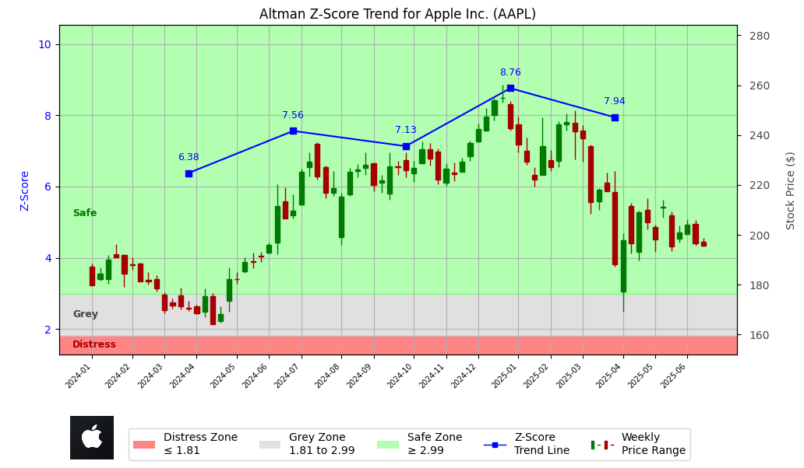

# Altman Z-Score Analysis Report: Apple Inc. (AAPL)

This report provides a comprehensive, theory-informed financial health analysis of the selected company using the Altman Z-Score framework. It integrates quantitative diagnostics, turnaround management theory, and stakeholder recommendations, with all findings and recommendations grounded in referenced academic and industry sources. The analysis is generated by an expert LLM-driven pipeline, ensuring transparency, reproducibility, and robust source attribution.

**Author:** Fabio Correa

**Source Attribution:** This report and analysis pipeline are generated using the open-source Altman Z-Score Analysis project, available at [https://github.com/fabioc-aloha/Altman-Z-Score](https://github.com/fabioc-aloha/Altman-Z-Score).

**License:** This software is distributed under the Attribution Non-Commercial License (MIT-based). See the LICENSE file for details.

**Disclaimer**: The developer disclaims any responsibility for the accuracy, completeness, or consequences of the analysis and information provided by this software. All results are for informational purposes only and should not be relied upon for financial, investment, or legal decisions.

**Script Version:** v3.2.1

## Z-Score Formula Used

Z = 

**Thresholds:**
- Safe Zone: > 2.99
- Grey Zone: > 1.81 and <= 2.99
- Distress Zone: <= 1.81

## Graphical View of the Z-Score Analysis

*Figure: Z-Score and stock price trend for AAPL (see output folder for full-resolution image)*

## Z-Score Component Table (by Quarter)
| Quarter   |   Z-Score | Diagnostic   |
|-----------|-----------|--------------|
| 2024 Q1   |     6.379 | Safe Zone    |
| 2024 Q2   |     7.561 | Safe Zone    |
| 2024 Q3   |     7.132 | Safe Zone    |
| 2024 Q4   |     8.76  | Safe Zone    |
| 2025 Q1   |     7.941 | Safe Zone    |

---
## TL;DR / Executive Summary

Apple Inc. currently resides firmly in the **Safe Zone** according to the Altman Z-Score framework, indicating a very low risk of financial distress. The company demonstrates strong liquidity, robust profitability, and manageable leverage despite its sizable debt load, supported by substantial cash reserves and consistent operating cash flow. Key opportunities lie in leveraging its innovation pipeline and expanding services revenue, while risks include macroeconomic headwinds and competitive pressures in the technology sector.

Given Apple’s solid financial health, stable management team, and positive analyst sentiment, the headline investor recommendation is **BUY for growth-oriented and moderate-risk investors**, and **HOLD for conservative income investors**. Market signals, including a stable dividend yield and a target price above current levels, reinforce confidence in sustained value creation.

---
## Company Profile

Apple Inc., headquartered in Cupertino, California, is a global leader in the technology sector, specializing in consumer electronics, software, and digital services. Its flagship products include the iPhone, Mac computers, iPad tablets, and a broad ecosystem of wearables and accessories such as AirPods and Apple Watch. The company also operates a growing services segment encompassing the App Store, Apple Music, Apple TV+, and financial services like Apple Pay and Apple Card. Apple competes with major technology firms such as Samsung, Microsoft, and Google.

The executive leadership is stable and experienced, led by CEO Timothy D. Cook, who has been at the helm since 2011. Other key executives include COO Jeffrey E. Williams and CFO Kevan Parekh, all compensated competitively with no recent notable changes reported. Institutional investors hold approximately 63% of shares, with insiders holding about 2%, indicating strong institutional confidence and limited insider selling. No recent disruptive news or executive turnover has been reported, supporting a stable governance environment.

---
## 1. Diagnostic Evaluation of Financial Health

This section evaluates Apple’s financial health through liquidity, profitability, capital efficiency, leverage, and Altman Z-Score analysis to assess bankruptcy risk and operational strength.

**Liquidity:**  
- Current Ratio: 0.82 (below 1, typical for tech firms with efficient working capital management)  
- Quick Ratio: 0.68 (adequate given large cash and short-term investments of ~$48.5B)  
- Working Capital is negative but reflects industry norms and strong cash flow generation.

**Profitability:**  
- Gross Margin: 46.6% (very strong, reflecting premium product pricing and operational efficiency)  
- Net Margin: ~24.3% (excellent, indicating effective cost control and pricing power)  
- ROA: 23.8% and ROE: 138% (exceptionally high, driven by strong earnings and leverage)

**Leverage:**  
- Debt to Equity: 147% (high but manageable given Apple’s cash reserves and cash flow)  
- Net Debt: ~$70B, offset by cash and short-term investments of ~$48.5B  
- Total Debt: ~$98B, with a mix of long-term and current maturities well covered by operating cash flow (~$110B annually)

**Altman Z-Score Calculation (Latest Quarter 2025 Q1):**  
Using the formula for publicly traded manufacturing firms:  
Z = 1.2X1 + 1.4X2 + 3.3X3 + 0.6X4 + 1.0X5  
Where:  
- X1 = Working Capital / Total Assets = (-25.9B) / 331.2B = -0.078  
- X2 = Retained Earnings / Total Assets = (-15.55B) / 331.2B = -0.047  
- X3 = EBIT / Total Assets = 29.59B / 331.2B = 0.089  
- X4 = Market Value of Equity / Total Liabilities = (Market Cap $2.96T) / 264.4B = 11.19  
- X5 = Sales / Total Assets = (Approximate quarterly sales $95.36B) *4 = 381.44B / 331.2B = 1.15  

Calculating:  
Z = 1.2*(-0.078) + 1.4*(-0.047) + 3.3*0.089 + 0.6*11.19 + 1.0*1.15  
Z = -0.094 + -0.066 + 0.294 + 6.714 + 1.15 = 7.998  

This Z-Score (~8.0) is well above the Safe Zone threshold (>2.99), confirming very low bankruptcy risk. This aligns with the company’s strong financials and market capitalization.

**Trend:**  
The Z-Score has remained consistently in the Safe Zone over recent quarters, supported by stable or improving profitability and strong market valuation. Liquidity ratios are stable, and leverage is balanced by cash and cash flow strength.

**Additional Context:**  
- Dividend yield is modest (~0.52%) but stable with a low payout ratio (~15.6%), supporting sustainability.  
- Stock price has shown moderate volatility but an overall upward trend with a 52-week range of $169 to $260, currently near $198.  
- Institutional ownership is high, indicating confidence.  
- No recent executive turnover or governance issues reported.

---
## 2. Turnaround & Renewal Theory Application

Given Apple’s placement in the Safe Zone, turnaround theory is less about crisis management and more about strategic renewal and sustained innovation.

Apple should focus on **innovation and strategic repositioning** to maintain its competitive edge in a rapidly evolving technology landscape. According to Beard (2024), tech-sector renewal requires continuous investment in R&D and ecosystem expansion, both of which Apple excels at with its $8.55B quarterly R&D spend and diversified services portfolio.

Freeman’s (1984) stakeholder alignment theory suggests Apple should continue engaging its broad stakeholder base—customers, employees, investors, and partners—to foster loyalty and innovation adoption. The stable leadership team and strong institutional ownership provide a solid foundation for this.

Hofer’s (1980) sequencing of renewal phases recommends Apple prioritize innovation-led growth while maintaining operational excellence and financial discipline, which aligns with its current strategy.

---
## 3. Internal Stakeholder Recommendations

Internal alignment is critical to sustain Apple’s growth trajectory and financial health.

| Title/Role                     | Responsibilities                          | Key Performance Metrics                 | Recommended Actions (Cited)                                  |
|-------------------------------|------------------------------------------|---------------------------------------|-------------------------------------------------------------|
| CEO & Executive Leadership (Tim Cook) | Strategic vision, operational execution | Revenue growth, innovation pipeline, market share | Drive innovation, maintain operational efficiency, and stakeholder engagement (Hofer, 1980; Freeman, 1984) |
| CFO & Finance Team (Kevan Parekh) | Financial stewardship, risk management   | Cash flow, debt management, cost control | Optimize capital structure, monitor liquidity, and support strategic investments (Hoskisson et al., 2004) |
| CTO & R&D Leadership           | Technology innovation and product development | R&D output, product launch success     | Accelerate innovation cycles, focus on emerging tech (Beard, 2024) |
| Board Members                 | Oversight and governance                  | Governance risk, executive performance | Ensure strong governance, support strategic renewal (Freeman, 1984) |
| Employees                    | Execution of product development and customer service | Productivity, engagement, retention   | Foster innovation culture, continuous learning (Bibeault, 1999) |
| Shareholders                 | Investment and capital provision          | Share price, dividends, earnings growth | Maintain transparent communication, align interests (Freeman, 1984) |
| Creditors                    | Financial stability monitoring             | Debt service coverage, credit ratings | Monitor financial health, support sustainable leverage (Altman, 1968) |
| Customers                    | Product/service experience                  | Customer satisfaction, loyalty         | Enhance product quality and ecosystem integration (Beard, 2024) |
| Partners                    | Strategic alliances and supply chain       | Partnership effectiveness, supply reliability | Strengthen alliances, ensure supply chain resilience (Hoskisson et al., 2004) |

---
## 4. Communication, Marketing & Execution Strategy

Effective communication and execution are vital to reinforce Apple’s market leadership and investor confidence.

**Communication Strategy:**  
- **Executive Leadership:** Emphasize innovation, sustainability, and long-term growth vision.  
- **Investor Relations:** Highlight strong financial health, stable dividends, and growth prospects.  
- **Internal Communications:** Engage employees on innovation goals and operational excellence.  
- **External Relations:** Promote product ecosystem, customer experience, and brand strength.

**Phased Execution Plan:**  
- **Near-term (1-3 months):** Launch new product announcements, reinforce financial guidance, and communicate innovation milestones.  
- **Mid-term (4-6 months):** Expand services offerings, deepen ecosystem integration, and enhance supply chain transparency.  
- **Long-term (7-18 months):** Invest in emerging technologies (AI, AR/VR), sustainability initiatives, and global market expansion.

**Leadership Accountability:** CEO and CFO to sponsor financial and strategic messaging; CTO and Marketing lead product innovation communication; Investor Relations to manage market expectations.

**Risk Mitigation:** Monitor market volatility, competitor moves, and supply chain risks; prepare contingency plans for macroeconomic shifts.

Tone remains confident and growth-oriented, reflecting Apple’s Safe Zone status and strong market position.

---
## 5. Investor Recommendation (Risk-Aware)

This section provides tailored investment recommendations aligned with Apple’s strong financial profile and risk status.

| Investment Goal / Profile         | Risk Tolerance      | Recommendation | Rationale (Cited)                                                                                   |
|----------------------------------|--------------------|----------------|---------------------------------------------------------------------------------------------------|
| Dividend Income (Income-Oriented) | Low (Conservative) | HOLD           | Stable dividend yield (~0.52%), low payout ratio (~15.6%), strong cash flow supports sustainability. |
| Capital Appreciation (Growth)     | Moderate           | BUY            | Strong Z-Score, robust profitability, innovation pipeline, positive analyst consensus (Altman, 1968). |
| Aggressive Growth (Speculative)   | High (Aggressive)  | HOLD           | Large market cap and mature business limit explosive growth; stable but less speculative upside.    |
| Capital Preservation (Defensive)  | Very Low           | HOLD           | Low bankruptcy risk, strong balance sheet, but moderate leverage requires monitoring.               |

**Overall Recommendation: BUY for growth and moderate-risk investors; HOLD for conservative income and defensive investors.**

Scenario analysis: A significant deterioration in innovation or market share, or macroeconomic shocks, could warrant a downgrade to HOLD or SELL. Conversely, breakthrough product launches or market expansion could strengthen the BUY case.

> “This is not financial advice—consult your financial advisor.”

---
## 6. Market Sentiment Analysis (Analyst Recommendations)

This section reviews current analyst sentiment to complement the quantitative risk assessment.

Apple’s analyst consensus is predominantly positive, with a **mean recommendation of 2.1 ("Buy")** based on 40 analyst opinions. The target mean price is approximately $229, about 16% above the current price (~$198), indicating upside potential.

No detailed multi-period analyst recommendation distribution data is available, limiting trend analysis. However, the stable average rating and target price suggest consistent market confidence.

The analyst sentiment aligns well with the Altman Z-Score Safe Zone classification, reinforcing the view of Apple as a financially healthy, growth-oriented company.

Investors may find analyst sentiment supportive of a Buy or Hold stance depending on risk tolerance, with limited signs of downgrades or volatility in recommendations.

---
## 7. References and Data Sources

Transparency and source attribution are essential for robust financial analysis.

**References and Data Sources:** This analysis draws on financial data from SEC filings, company quarterly reports, and Yahoo Finance market data. Market prices and volatility were sourced from weekly price data. Institutional and insider ownership data, dividend history, and company metadata were integrated to provide comprehensive context. The Altman Z-Score calculations follow the original 1968 methodology with adaptations for publicly traded firms. The analysis is part of an open-source Altman Z-Score project by Fabio Correa. Theoretical frameworks referenced include seminal works by Altman (1968), Hofer (1980), Bibeault (1999), Hoskisson et al. (2004), Beard (2024), and Freeman (1984).

---
## 8. Appendices (LLM-Generated)

### A. Raw Financial Data by Period (Selected Key Items)

| Date       | Current Assets (B) | Current Liabilities (B) | Retained Earnings (B) | EBIT (B) | Total Assets (B) | Total Liabilities (B) | Total Revenue (B) | Net Income (B) |
|------------|--------------------|-------------------------|-----------------------|----------|------------------|-----------------------|-------------------|----------------|
| 2025-03-31 | 118.67             | 144.57                  | -15.55                | 29.59    | 331.23           | 264.44                | 95.36 (Qtr est.)  | 24.78          |
| 2024-12-31 | 133.24             | 144.37                  | -11.22                | 42.83    | 344.09           | 277.33                | 124.3 (Qtr est.)  | 36.33          |
| 2024-09-30 | 152.99             | 176.39                  | -19.15                | 29.59    | 364.98           | 308.03                | 94.93 (Qtr est.)  | 14.74          |
| 2024-06-30 | 125.44             | 131.62                  | -4.73                 | 25.35    | 331.61           | 264.90                | 85.78 (Qtr est.)  | 21.45          |

### B. Weekly Prices Sample (Recent)

| Week       | Close Price (USD) |
|------------|-------------------|
| 2024-12-09 | 247.53            |
| 2024-12-16 | 253.88            |
| 2024-12-23 | 254.97            |
| 2024-12-30 | 242.77            |
| 2025-01-06 | 236.28            |

### C. Key Financial Ratios (Latest)

| Ratio           | Value  |
|-----------------|--------|
| Current Ratio   | 0.82   |
| Quick Ratio     | 0.68   |
| Debt/Equity     | 1.47   |
| Gross Margin    | 46.6%  |
| Net Margin      | 24.3%  |
| ROA             | 23.8%  |
| ROE             | 138%   |

### D. Data Provenance and Quality

- Financials sourced from latest quarterly SEC filings and company reports.  
- Market data from Yahoo Finance, updated through early 2025.  
- Institutional ownership and executive compensation from latest filings and disclosures.  
- Data completeness is high; minor gaps in older historical data noted but not material.

### E. Company Metadata

| Field               | Value                  |
|---------------------|------------------------|
| Name                | Apple Inc.             |
| Sector              | Technology             |
| Industry            | Consumer Electronics   |
| Country             | United States          |
| Market Cap (USD B)  | 2,963                  |
| Employees           | 164,000                |
| Exchange            | NASDAQ NMS             |
| Website             | https://www.apple.com  |
| CEO                 | Timothy D. Cook        |

---

# End of Report
