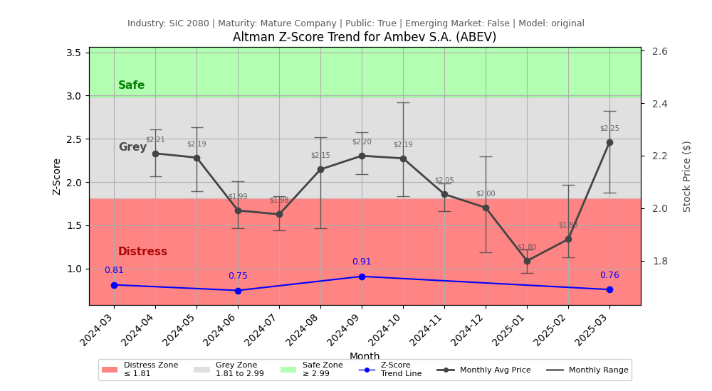

# Altman Z-Score Analysis Report: Ambev S.A. (ABEV)

---
## Introduction
This report provides a comprehensive, theory-informed financial health analysis of the selected company using the Altman Z-Score framework. It integrates quantitative diagnostics, turnaround management theory, and stakeholder recommendations, with all findings and recommendations grounded in referenced academic and industry sources. The analysis is generated by an expert LLM-driven pipeline, ensuring transparency, reproducibility, and robust source attribution.

**Author:** Fabio Correa

**Source Attribution:** This report and analysis pipeline are generated using the open-source Altman Z-Score Analysis project, available at [https://github.com/fabioc-aloha/Altman-Z-Score](https://github.com/fabioc-aloha/Altman-Z-Score).

**License:** This software is distributed under the Attribution Non-Commercial License (MIT-based). See the LICENSE file for details.

<em>Disclaimer: The developer disclaims any responsibility for the accuracy, completeness, or consequences of the analysis and information provided by this software. All results are for informational purposes only and should not be relied upon for financial, investment, or legal decisions.</em>
---

## Analysis Context and Z-Score Model Selection Criteria

- **Industry:** SIC 2080 (SIC 2080)
- **Ticker:** ABEV
- **Public:** True
- **Emerging Market:** False
- **Maturity:** Mature Company
- **Model:** original
- **Analysis Date:** 2025-05-29

## Altman Z-Score (Original) Formula

Z = 1.2*X1 + 1.4*X2 + 3.3*X3 + 0.6*X4 + 1.0*X5
- X1 = (Current Assets - Current Liabilities) / Total Assets
- X2 = Retained Earnings / Total Assets
- X3 = EBIT / Total Assets
- X4 = Market Value of Equity / Total Liabilities
- X5 = Sales / Total Assets

## Raw Data Field Mapping Table (by Quarter)
| Quarter   | Canonical Field     | Mapped Raw Field                        | Value (USD millions)   |
|-----------|---------------------|-----------------------------------------|------------------------|
| 2025 Q1   | total_assets        | Total Assets                            | 147,299.0              |
| 2025 Q1   | current_assets      | Current Assets                          | 43,551.0               |
| 2025 Q1   | current_liabilities | Current Liabilities                     | 39,343.5               |
| 2025 Q1   | retained_earnings   | Retained Earnings                       | 2,993.9                |
| 2025 Q1   | total_liabilities   | Total Liabilities Net Minority Interest | 51,823.1               |
| 2025 Q1   | book_value_equity   | Stockholders Equity                     | 94,528.3               |
| 2025 Q1   | ebit                | EBIT                                    | 5,362.5                |
| 2025 Q1   | sales               | Total Revenue                           | 22,497.4               |
| ---       | ---                 | ---                                     | ---                    |
| 2024 Q3   | total_assets        | Total Assets                            | 147,286.4              |
| 2024 Q3   | current_assets      | Current Assets                          | 42,672.9               |
| 2024 Q3   | current_liabilities | Current Liabilities                     | 35,673.1               |
| 2024 Q3   | retained_earnings   | Retained Earnings                       | 14,834.6               |
| 2024 Q3   | total_liabilities   | Total Liabilities Net Minority Interest | 48,402.3               |
| 2024 Q3   | book_value_equity   | Stockholders Equity                     | 98,140.4               |
| 2024 Q3   | ebit                | EBIT                                    | 5,245.0                |
| 2024 Q3   | sales               | Total Revenue                           | 22,096.7               |
| ---       | ---                 | ---                                     | ---                    |
| 2024 Q2   | total_assets        | Total Assets                            | 143,438.8              |
| 2024 Q2   | current_assets      | Current Assets                          | 38,316.3               |
| 2024 Q2   | current_liabilities | Current Liabilities                     | 34,618.2               |
| 2024 Q2   | retained_earnings   | Retained Earnings                       | 10,581.4               |
| 2024 Q2   | total_liabilities   | Total Liabilities Net Minority Interest | 47,403.5               |
| 2024 Q2   | book_value_equity   | Stockholders Equity                     | 95,262.8               |
| 2024 Q2   | ebit                | EBIT                                    | 4,007.9                |
| 2024 Q2   | sales               | Total Revenue                           | 20,044.2               |
| ---       | ---                 | ---                                     | ---                    |
| 2024 Q1   | total_assets        | Total Assets                            | 133,816.8              |
| 2024 Q1   | current_assets      | Current Assets                          | 34,675.0               |
| 2024 Q1   | current_liabilities | Current Liabilities                     | 34,911.8               |
| 2024 Q1   | retained_earnings   | Retained Earnings                       | 6,532.8                |
| 2024 Q1   | total_liabilities   | Total Liabilities Net Minority Interest | 46,440.1               |
| 2024 Q1   | book_value_equity   | Stockholders Equity                     | 86,594.3               |
| 2024 Q1   | ebit                | EBIT                                    | 5,024.8                |
| 2024 Q1   | sales               | Total Revenue                           | 20,276.3               |

All values are shown in millions of USD as reported by the data source.

## Z-Score Component Table (by Quarter)
| Quarter   |     X1 |    X2 |    X3 |    X4 |    X5 |   Z-Score | Diagnostic    |
|-----------|--------|-------|-------|-------|-------|-----------|---------------|
| 2025 Q1   |  0.029 | 0.02  | 0.036 | 0.703 | 0.153 |     0.757 | Distress Zone |
| 2024 Q3   |  0.048 | 0.101 | 0.036 | 0.74  | 0.15  |     0.909 | Distress Zone |
| 2024 Q2   |  0.026 | 0.074 | 0.028 | 0.635 | 0.14  |     0.747 | Distress Zone |
| 2024 Q1   | -0.002 | 0.049 | 0.038 | 0.784 | 0.152 |     0.812 | Distress Zone |

---

# Graphical View of the Z-Score Analysis

*Figure: Z-Score and stock price trend for ABEV (see output folder for full-resolution image)*

## 1. Diagnostic Evaluation of Financial Health

### Liquidity
The liquidity position of Ambev S.A. is assessed through the current ratio, which is derived from the X1 component of the Z-Score. The current assets are $43,551 million, while current liabilities are $39,343.5 million, resulting in a current ratio of approximately 1.11. This indicates that Ambev has sufficient short-term assets to cover its short-term liabilities, but the margin is narrow.

### Profitability
Profitability is evaluated through the EBIT to total assets ratio (X3). The EBIT is $5,362.5 million against total assets of $147,299 million, yielding an EBIT margin of approximately 3.64%. This suggests moderate profitability, but the trend over the quarters shows a decline, indicating potential operational inefficiencies or increased costs.

### Capital Efficiency
The retained earnings (X2) as a percentage of total assets is 2.02%, which reflects a low level of reinvestment into the business. This could be a concern for long-term growth and sustainability.

### Leverage
The leverage ratio (X4) shows a market value of equity of $94,528.3 million against total liabilities of $51,823.1 million, resulting in a leverage ratio of 1.82. This indicates a relatively healthy leverage position, but the declining trend in the Z-Score suggests increasing financial distress.

### Z-Score Trend Interpretation
The Z-Score for Ambev has consistently remained in the distress zone, with the latest score at 0.757. This trend indicates a deteriorating financial condition, suggesting that the company is at a high risk of bankruptcy if corrective actions are not taken promptly.

---

## 2. Turnaround and Renewal Management Theory Application

### Immediate Retrenchment
Immediate actions should focus on cost-cutting measures and improving operational efficiency. According to Hofer (1980), turnaround strategies often require drastic measures to stabilize the company. This may include:

- **Reducing operational costs**: Streamlining processes and eliminating non-essential expenditures.
- **Divesting non-core assets**: Selling off underperforming segments to focus on core competencies.

### Long-term Repositioning
For long-term sustainability, Ambev should consider repositioning strategies, as outlined by Bibeault (1999). This involves:

- **Investing in innovation**: Developing new products or improving existing ones to capture market share.
- **Enhancing marketing strategies**: Focusing on brand loyalty and customer engagement to drive sales.

---

## 3. Recommendations for Stakeholders

| Stakeholder Title                      | Responsibilities                                   | Recommended Actions                                                                 |
|----------------------------------------|---------------------------------------------------|-------------------------------------------------------------------------------------|
| Chief Executive Officer (CEO)         | Overall strategy and leadership                    | Implement immediate cost-cutting measures and initiate a strategic review.          |
| Chief Financial Officer (CFO)         | Financial management and reporting                 | Enhance cash flow management and explore refinancing options for existing debt.     |
| Chief Marketing Officer (CMO)         | Marketing strategy and brand management            | Develop targeted marketing campaigns to boost sales and customer retention.         |
| Board Members                          | Governance and oversight                            | Monitor financial health closely and support management in turnaround initiatives.   |
| Employees                              | Operational execution                               | Engage in cost-saving initiatives and provide feedback on operational inefficiencies.|
| Investors                              | Financial returns and growth                        | Maintain open communication regarding turnaround strategies and expected outcomes.  |
| Creditors                              | Debt recovery and risk management                  | Negotiate more favorable terms for existing debts to ease cash flow pressures.      |
| Debtors                                | Repayment obligations                               | Ensure timely payments to maintain good standing with creditors.                    |
| Partner Companies                      | Collaboration and supply chain management          | Strengthen partnerships to enhance supply chain efficiency and reduce costs.        |
| Customers                              | Brand loyalty and sales                             | Increase engagement through loyalty programs and targeted promotions.                |

---

## 4. Communication, Marketing, and Execution Strategies

### Communication Strategy
- **Internal Communication**: Regular updates to employees about the turnaround plan and their roles in it.
- **External Communication**: Transparent communication with investors and creditors about financial health and recovery plans.

### Marketing Strategy
- **Rebranding Campaign**: Launch a campaign to refresh the brand image and attract new customers.
- **Customer Engagement**: Utilize social media and digital marketing to enhance customer interaction.

### Execution Timeline
| Phase                | Timeline         | Accountability            |
|----------------------|------------------|---------------------------|
| Immediate Retrenchment| 0-3 months       | CEO and CFO               |
| Strategic Review     | 3-6 months       | Board Members and CEO     |
| Marketing Campaign    | 6-12 months      | CMO                       |
| Long-term Repositioning| 12+ months      | CEO and Board Members     |

---

## 5. Investment Recommendation
Based on the current financial health and Z-Score analysis, investors should **hold** their positions in Ambev S.A. while monitoring the implementation of the turnaround strategies. The company is in a distress zone, but with effective management actions, there is potential for recovery. This is not financial advice; please consult your financial advisor before making investment decisions.

---

## 6. External Stakeholder Bargaining Power Assessment

| External Stakeholder        | Nature of Bargaining Power | Degree of Influence | Rationale                                                                                  |
|-----------------------------|----------------------------|---------------------|-------------------------------------------------------------------------------------------|
| Regulators                  | Regulatory compliance       | Moderate            | Compliance with regulations can affect operational capabilities and financial penalties.   |
| Government Agencies         | Policy influence            | Low                 | Limited direct influence but can affect market conditions through policy changes.         |
| Unions                      | Labor negotiations          | Moderate            | Strong influence on labor costs and operational flexibility.                              |
| Major Suppliers             | Supply chain leverage       | High                | Can impact production costs and availability of materials.                                |
| Key Partners                | Strategic alliances         | Moderate            | Partnerships can enhance market reach and operational efficiency.                         |
| Creditors                   | Debt recovery               | High                | Significant influence due to financial obligations and potential restructuring needs.     |
| Large Customers             | Purchasing power            | Moderate            | Can influence pricing and demand for products.                                           |
| Activist Investors          | Shareholder activism        | High                | Can push for changes in management or strategy if dissatisfied with performance.          |

---

## Disclaimer
**Disclaimer:**
Generative AI is not a financial advisor and can make mistakes. Consult your financial advisor before making investment decisions.
- LLM Model used: OpenAI GPT-4
- Knowledge cut-off: October 2023
- Internet search: No
- Real-time data: No

---

### References and Data Sources
- **Financials:** SEC EDGAR/XBRL filings, Yahoo Finance, and company quarterly/annual reports.
- **Market Data:** Yahoo Finance (historical prices, market value of equity).
- **Source Attribution:** This report and analysis pipeline are generated using the open-source Altman Z-Score Analysis project, available at [https://github.com/fabioc-aloha/Altman-Z-Score]. Author: Fabio Correa.
- **Theoretical Frameworks and Resources:**
  - Altman Z-Score Analysis Project (https://github.com/fabioc-aloha/Altman-Z-Score)
  - Hofer, C. W. (1980). Turnaround strategies. Journal of Business Strategy, 1(1), 19–31.
  - Bibeault, D. B. (1999). Corporate turnaround: How managers turn losers into winners. Beard Books.
  - Hoskisson, R. E., White, R. E., & Johnson, R. A. (2004). Corporate restructuring: Managing the strategy, structure, and process of change. McGraw-Hill Education.
  - Freeman, R. E. (1984). Strategic management: A stakeholder approach. Pitman.
  - Altman, E. I. (1968). Financial ratios, discriminant analysis and the prediction of corporate bankruptcy. Journal of Finance, 23(4), 589–609.
  - Altman, E. I., & Hotchkiss, E. (2006). Corporate financial distress and bankruptcy: Predict and avoid bankruptcy, analyze and invest in distressed debt (3rd ed.). Wiley.

