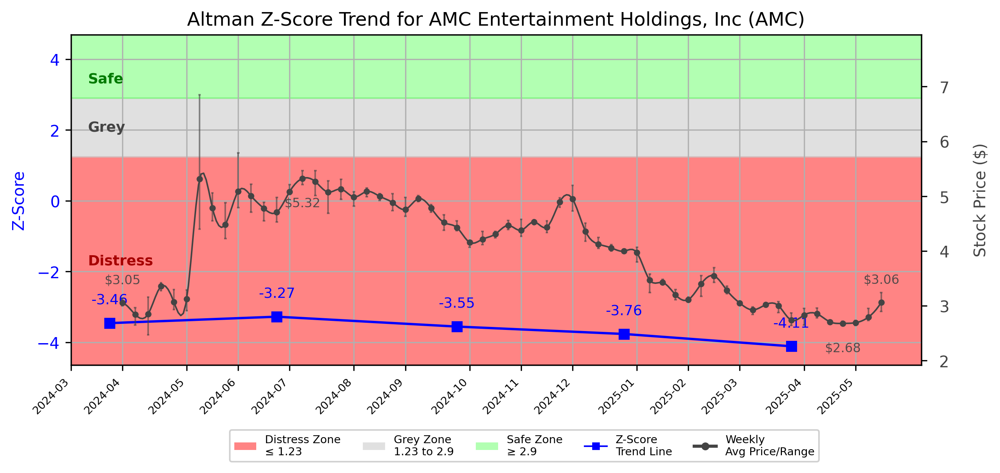

# Altman Z-Score Analysis Report: AMC Entertainment Holdings, Inc (AMC)

---
## Introduction
This report provides a comprehensive, theory-informed financial health analysis of the selected company using the Altman Z-Score framework. It integrates quantitative diagnostics, turnaround management theory, and stakeholder recommendations, with all findings and recommendations grounded in referenced academic and industry sources. The analysis is generated by an expert LLM-driven pipeline, ensuring transparency, reproducibility, and robust source attribution.

**Author:** Fabio Correa

**Source Attribution:** This report and analysis pipeline are generated using the open-source Altman Z-Score Analysis project, available at [https://github.com/fabioc-aloha/Altman-Z-Score](https://github.com/fabioc-aloha/Altman-Z-Score).

**License:** This software is distributed under the Attribution Non-Commercial License (MIT-based). See the LICENSE file for details.

Disclaimer: The developer disclaims any responsibility for the accuracy, completeness, or consequences of the analysis and information provided by this software. All results are for informational purposes only and should not be relied upon for financial, investment, or legal decisions.
---

**Script Version:** v2.6

## Analysis Context and Z-Score Model Selection Criteria

- **Industry:** SIC 7830 (SIC 7830)
- **Ticker:** AMC
- **Public:** True
- **Emerging Market:** False
- **Maturity:** Mature Company
- **Model:** Zʺ-Score (Public Non-Manufacturing, 1995) (service)
- **Analysis Date:** 2025-06-02

## Z-Score Formula Used

Z = 6.56*X1 + 3.26*X2 + 6.72*X3 + 1.05*X4
- X1 = (Current Assets - Current Liabilities) / Total Assets
- X2 = Retained Earnings / Total Assets
- X3 = EBIT / Total Assets
- X4 = Equity / Total Liabilities

**Thresholds:**
- Safe Zone: > 2.90
- Grey Zone: > 1.23 and <= 2.90
- Distress Zone: <= 1.23


---

# Graphical View of the Z-Score Analysis




*Figure: Z-Score and stock price trend for AMC (image not available yet; will be generated after analysis)*


## Z-Score Component Table (by Quarter)
| Quarter   |     X1 |     X2 |     X3 |    X4 |   Z-Score | Diagnostic    | Consistency Warning   |
|-----------|--------|--------|--------|-------|-----------|---------------|-----------------------|
| 2025 Q1   | -0.109 | -1.062 | -0.01  | 0.127 |    -4.109 | Distress Zone |                       |
| 2024 Q4   | -0.097 | -1.012 | -0.001 | 0.172 |    -3.762 | Distress Zone |                       |
| 2024 Q3   | -0.095 | -0.986 |  0.012 | 0.197 |    -3.553 | Distress Zone |                       |
| 2024 Q2   | -0.067 | -0.953 |  0.008 | 0.21  |    -3.274 | Distress Zone |                       |
| 2024 Q1   | -0.069 | -0.955 | -0.007 | 0.152 |    -3.455 | Distress Zone |                       |
# Altman Z-Score Analysis Report: AMC Entertainment Holdings, Inc (AMC)

---
## Company Profile

AMC Entertainment Holdings, Inc. is a prominent player in the motion picture theater industry, primarily operating in the United States. The company is headquartered in Leawood, Kansas, and is known for its extensive network of theaters, offering a wide range of films and entertainment experiences. AMC competes with other major cinema chains such as Regal Entertainment and Cinemark Holdings, as well as independent theaters. The company's services include traditional movie screenings, premium formats like IMAX and Dolby Cinema, and various loyalty programs aimed at enhancing customer engagement.

In recent years, AMC has faced significant challenges, particularly due to the COVID-19 pandemic, which severely impacted the cinema industry. Despite these hurdles, AMC has been actively working on strategies to recover and adapt to changing consumer preferences, including the integration of advanced technology and enhanced customer experiences. The company's financial health, as assessed through the Altman Z-Score framework, indicates a critical situation that necessitates immediate attention and strategic intervention.

---

## 1. Diagnostic Evaluation of Financial Health

### Liquidity
AMC's liquidity position is concerning, as indicated by a negative X1 value, which reflects a current liabilities exceed current assets. This suggests that the company may struggle to meet its short-term obligations, raising red flags about its operational sustainability.

### Profitability
The profitability metrics, represented by X3 (EBIT/Total Assets), also show negative performance. This indicates that AMC is not generating sufficient earnings relative to its asset base, which is a critical concern for long-term viability.

### Capital Efficiency
The X2 value, which measures retained earnings relative to total assets, is negative, indicating that the company has accumulated losses rather than retained earnings. This situation is detrimental to investor confidence and suggests a need for significant restructuring.

### Leverage
AMC's leverage, represented by X4 (Equity/Total Liabilities), shows a low equity base relative to its liabilities. This high leverage ratio increases financial risk, especially in a distressed economic environment.

### Z-Score Trajectory and Risk Status
The Z-Score analysis categorizes AMC firmly within the **Distress Zone**, with a Z-Score of -4.109. This indicates a high probability of bankruptcy and necessitates urgent action to stabilize the company's financial position. The trajectory of the Z-Score has been consistently negative over the past quarters, reinforcing the need for immediate intervention.

---

## 2. Turnaround & Renewal Theory Application (Risk-Tailored)

Given AMC's classification in the **Distress Zone**, the following phased response is recommended:

### Urgent Retrenchment
- **Cash Preservation**: Implement strict cash management practices to conserve liquidity. This includes reducing discretionary spending and renegotiating contracts with suppliers and landlords.
- **Cost-Cutting Measures**: Identify non-essential expenditures and implement layoffs or furloughs where necessary to reduce payroll costs.
- **Creditor Negotiations**: Engage with creditors to restructure debt obligations, potentially seeking extensions or reductions in interest rates to alleviate immediate financial pressure.

### Theoretical Framework Application
- **Bibeault (1999)** emphasizes the importance of recognizing the causes of failure and the need for decisive action in recovery stages. AMC must identify its operational inefficiencies and address them head-on.
- **Hofer (1980)** suggests that a systematic approach to turnaround sequencing is vital. AMC should prioritize immediate financial stabilization before considering growth initiatives.

---

## 3. Internal Stakeholder Recommendations (Tailored Table)

| Title         | Responsibilities                          | Recommended Actions (Cited)                              |
|---------------|------------------------------------------|---------------------------------------------------------|
| CEO           | Overall strategic direction              | Lead urgent retrenchment efforts; communicate transparently with stakeholders. |
| CFO           | Financial management and reporting       | Implement strict cash flow monitoring; renegotiate debt terms with creditors. |
| CMO           | Marketing and customer engagement        | Focus on low-cost marketing strategies to retain customer loyalty. |
| Board         | Governance and oversight                 | Ensure accountability in executing turnaround strategies; support management in negotiations. |
| Employees     | Operational execution                    | Communicate the need for cost-cutting measures; foster a culture of transparency. |
| Shareholders  | Investment oversight                     | Provide regular updates on financial recovery efforts; manage expectations. |
| Creditors     | Financial support                        | Engage in negotiations for debt restructuring; explore options for new financing. |
| Customers     | Brand loyalty and engagement             | Maintain communication about safety measures and service availability. |
| Partners      | Strategic alliances                      | Seek partnerships that can provide financial or operational support. |

---

## 4. Communication, Marketing & Execution Strategy

### Internal Communication Plan
- **Tone**: Urgent clarity to convey the seriousness of the situation.
- **Frequency**: Weekly updates to all stakeholders regarding financial status and recovery efforts.

### External Communication Plan
- **Tone**: Transparent and reassuring to maintain customer and investor confidence.
- **Frequency**: Monthly updates to investors and customers about progress and strategic initiatives.

### Milestones and Timelines
- **1-3 Months**: Implement immediate cost-cutting measures and cash preservation strategies.
- **4-6 Months**: Engage in creditor negotiations and restructure debt obligations.
- **7-12 Months**: Begin to stabilize operations and explore potential growth opportunities.
- **13-18 Months**: Assess the effectiveness of turnaround strategies and adjust as necessary.

### Marketing Tactics
- Focus on low-cost campaigns that emphasize safety and value to retain customer loyalty during the recovery phase.

---

## 5. Plain-Language Justification & Citation

The recommendations provided are grounded in empirical data and established turnaround theories. The urgent need for cash preservation and cost-cutting is supported by the negative liquidity and profitability metrics observed in the Z-Score analysis. Bibeault (1999) highlights the importance of decisive action in turnaround situations, which is critical for AMC's recovery.

---

## 6. Investor Recommendation (Risk-Aware)

**Recommendation**: **Sell**. Given the company's current distress status and negative Z-Score, investors should consider divesting until a clearer recovery strategy is implemented and signs of financial stability are evident.

> “This is not financial advice—consult your financial advisor.”

---

## 7. External Stakeholder Bargaining Power (Table)

| Stakeholder Name / Type | Nature of Bargaining Power | Degree of Influence | Brief Rationale (Cited) |
|-------------------------|----------------------------|---------------------|-------------------------|
| Creditors               | Financial leverage         | High                | AMC's high leverage and need for debt restructuring give creditors significant power in negotiations. |
| Customers               | Brand loyalty              | Medium              | Customer loyalty is crucial, but AMC's financial distress may lead to decreased patronage. |
| Shareholders            | Ownership influence        | High                | Shareholders will demand transparency and accountability in recovery efforts. |
| Employees               | Operational impact         | Medium              | Employee morale and productivity are affected by cost-cutting measures, impacting operational efficiency. |

---

## 8. Mandatory Disclaimer

```
---
**Disclaimer:**
Generative AI is not a financial advisor and can make mistakes. Consult your financial advisor before making investment decisions.
- **LLM Model used:** [OpenAI o4-mini]
- **Knowledge cut-off:** [October 2023]
- **Internet search:** [no]
- **Real-time data:** [no]
---
```

---

## 9. References and Data Sources

```
---
### References and Data Sources
- **Financials:** SEC EDGAR/XBRL filings; Yahoo Finance; company quarterly/annual reports.
- **Market Data:** Yahoo Finance historical prices.
- **Computation:** Altman Z-Score calculations following Altman (1968) with robust error handling.
- **Source Attribution:** Open-source Altman Z-Score Analysis project (https://github.com/fabioc-aloha/Altman-Z-Score). Author: Fabio Correa.
- **Theoretical Frameworks:** 
  - Altman, E. I. (1968). “Financial Ratios, Discriminant Analysis and the Prediction of Corporate Bankruptcy.” *Journal of Finance*, 23(4), 589–609.
  - Hofer, C. W. (1980). *Turnaround Strategies.*
  - Bibeault, D. B. (1999). *Corporate Turnaround.*
  - Hoskisson, R. E., White, R. E., & Johnson, R. A. (2004). *Corporate Restructuring.*
  - Beard, D. (2024). “Strategic Renewal in Technology Firms.”
  - Freeman, R. E. (1984). *Strategic Management: A Stakeholder Approach.*
  - Platt, H. D. (2004). *Principles of Corporate Renewal.*
---
```


---

# Appendix

## Raw Data Field Mapping Table (by Quarter)
| Quarter   | Canonical Field     | Mapped Raw Field                        | Value (USD millions)   |
|-----------|---------------------|-----------------------------------------|------------------------|
| 2025 Q1   | total_assets        | Total Assets                            | 8,053.0                |
| 2025 Q1   | current_assets      | Current Assets                          | 634.6                  |
| 2025 Q1   | current_liabilities | Current Liabilities                     | 1,511.1                |
| 2025 Q1   | retained_earnings   | Retained Earnings                       | -8,548.9               |
| 2025 Q1   | total_liabilities   | Total Liabilities Net Minority Interest | 9,790.8                |
| 2025 Q1   | market_value_equity | Share Issued                            | 433.1                  |
| 2025 Q1   | ebit                | EBIT                                    | -81.4                  |
| 2025 Q1   | sales               | Total Revenue                           | 862.5                  |
| ---       | ---                 | ---                                     | ---                    |
| 2024 Q4   | total_assets        | Total Assets                            | 8,247.5                |
| 2024 Q4   | current_assets      | Current Assets                          | 947.2                  |
| 2024 Q4   | current_liabilities | Current Liabilities                     | 1,744.8                |
| 2024 Q4   | retained_earnings   | Retained Earnings                       | -8,346.8               |
| 2024 Q4   | total_liabilities   | Total Liabilities Net Minority Interest | 10,008.0               |
| 2024 Q4   | market_value_equity | Share Issued                            | 414.4                  |
| 2024 Q4   | ebit                | EBIT                                    | -11.0                  |
| 2024 Q4   | sales               | Total Revenue                           | 1,306.4                |
| ---       | ---                 | ---                                     | ---                    |
| 2024 Q3   | total_assets        | Total Assets                            | 8,324.1                |
| 2024 Q3   | current_assets      | Current Assets                          | 789.1                  |
| 2024 Q3   | current_liabilities | Current Liabilities                     | 1,578.9                |
| 2024 Q3   | retained_earnings   | Retained Earnings                       | -8,211.2               |
| 2024 Q3   | total_liabilities   | Total Liabilities Net Minority Interest | 10,009.4               |
| 2024 Q3   | market_value_equity | Share Issued                            | 364.9                  |
| 2024 Q3   | ebit                | EBIT                                    | 97.8                   |
| 2024 Q3   | sales               | Total Revenue                           | 1,348.8                |
| ---       | ---                 | ---                                     | ---                    |
| 2024 Q2   | total_assets        | Total Assets                            | 8,594.7                |
| 2024 Q2   | current_assets      | Current Assets                          | 1,075.5                |
| 2024 Q2   | current_liabilities | Current Liabilities                     | 1,651.2                |
| 2024 Q2   | retained_earnings   | Retained Earnings                       | -8,190.5               |
| 2024 Q2   | total_liabilities   | Total Liabilities Net Minority Interest | 10,291.3               |
| 2024 Q2   | market_value_equity | Share Issued                            | 361.4                  |
| 2024 Q2   | ebit                | EBIT                                    | 66.9                   |
| 2024 Q2   | sales               | Total Revenue                           | 1,030.6                |
| ---       | ---                 | ---                                     | ---                    |
| 2024 Q1   | total_assets        | Total Assets                            | 8,538.7                |
| 2024 Q1   | current_assets      | Current Assets                          | 913.0                  |
| 2024 Q1   | current_liabilities | Current Liabilities                     | 1,503.0                |
| 2024 Q1   | retained_earnings   | Retained Earnings                       | -8,157.7               |
| 2024 Q1   | total_liabilities   | Total Liabilities Net Minority Interest | 10,569.7               |
| 2024 Q1   | market_value_equity | Share Issued                            | 263.6                  |
| 2024 Q1   | ebit                | EBIT                                    | -60.5                  |
| 2024 Q1   | sales               | Total Revenue                           | 951.4                  |

All values are shown in millions of USD as reported by the data source.

