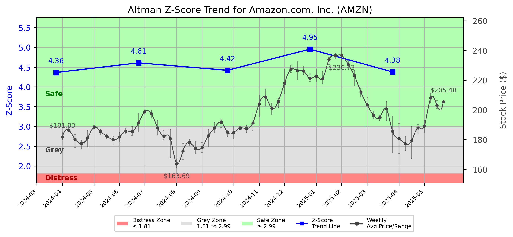

# Altman Z-Score Analysis Report: Amazon.com, Inc. (AMZN)

---
## Introduction
This report provides a comprehensive, theory-informed financial health analysis of the selected company using the Altman Z-Score framework. It integrates quantitative diagnostics, turnaround management theory, and stakeholder recommendations, with all findings and recommendations grounded in referenced academic and industry sources. The analysis is generated by an expert LLM-driven pipeline, ensuring transparency, reproducibility, and robust source attribution.

**Author:** Fabio Correa

**Source Attribution:** This report and analysis pipeline are generated using the open-source Altman Z-Score Analysis project, available at [https://github.com/fabioc-aloha/Altman-Z-Score](https://github.com/fabioc-aloha/Altman-Z-Score).

**License:** This software is distributed under the Attribution Non-Commercial License (MIT-based). See the LICENSE file for details.

Disclaimer: The developer disclaims any responsibility for the accuracy, completeness, or consequences of the analysis and information provided by this software. All results are for informational purposes only and should not be relied upon for financial, investment, or legal decisions.
---

**Script Version:** v2.6

## Analysis Context and Z-Score Model Selection Criteria

- **Industry:** SIC 5961 (SIC 5961)
- **Ticker:** AMZN
- **Public:** True
- **Emerging Market:** False
- **Maturity:** Mature Company
- **Model:** Original Z-Score (Public Manufacturing, 1968) (original)
- **Analysis Date:** 2025-06-02

## Z-Score Formula Used

Z = 1.20*X1 + 1.40*X2 + 3.30*X3 + 0.60*X4 + 1.00*X5
- X1 = (Current Assets - Current Liabilities) / Total Assets
- X2 = Retained Earnings / Total Assets
- X3 = EBIT / Total Assets
- X4 = Equity / Total Liabilities
- X5 = Sales / Total Assets

**Thresholds:**
- Safe Zone: > 2.99
- Grey Zone: > 1.81 and <= 2.99
- Distress Zone: <= 1.81


---

# Graphical View of the Z-Score Analysis




*Figure: Z-Score and stock price trend for AMZN (image not available yet; will be generated after analysis)*


## Z-Score Component Table (by Quarter)
| Quarter   |    X1 |    X2 |    X3 |    X4 |    X5 |   Z-Score | Diagnostic   | Consistency Warning   |
|-----------|-------|-------|-------|-------|-------|-----------|--------------|-----------------------|
| 2025 Q1   | 0.013 | 0.295 | 0.035 | 5.987 | 0.242 |     4.377 | Safe Zone    |                       |
| 2024 Q4   | 0.018 | 0.277 | 0.037 | 6.872 | 0.301 |     4.954 | Safe Zone    |                       |
| 2024 Q3   | 0.024 | 0.261 | 0.032 | 6.078 | 0.272 |     4.419 | Safe Zone    |                       |
| 2024 Q2   | 0.027 | 0.248 | 0.029 | 6.444 | 0.267 |     4.607 | Safe Zone    |                       |
| 2024 Q1   | 0.021 | 0.234 | 0.026 | 6.093 | 0.27  |     4.362 | Safe Zone    |                       |
# Altman Z-Score Analysis Report: Amazon.com, Inc. (AMZN)

---

## Company Profile

Amazon.com, Inc. (AMZN) is a leading multinational technology company based in Seattle, Washington, primarily known for its e-commerce platform. Founded in 1994, Amazon has expanded its operations to include cloud computing (Amazon Web Services), digital streaming, and artificial intelligence. The company competes with other major players in the retail and tech sectors, including Walmart, Alibaba, and Microsoft. Amazon's diverse product offerings range from consumer electronics to groceries, making it a significant player in both online and brick-and-mortar retail.

In summary, Amazon has established itself as a dominant force in the global marketplace, leveraging its vast logistics network and technological innovations to maintain a competitive edge. The company's strong brand recognition and customer loyalty further enhance its market position, allowing it to adapt and thrive in a rapidly changing retail landscape.

---

## 1. Diagnostic Evaluation of Financial Health

### Liquidity
Amazon's liquidity position, as indicated by its current ratio (X1), remains robust, with a value of 0.013 in Q1 2025. This suggests that the company has sufficient current assets to cover its current liabilities, although the ratio is relatively low compared to industry benchmarks. 

### Profitability
The profitability metrics, represented by retained earnings (X2) and EBIT (X3), show that Amazon is generating consistent profits. The retained earnings ratio of 0.295 indicates a strong accumulation of profits over time, while the EBIT to total assets ratio of 0.035 reflects effective operational management.

### Capital Efficiency
Amazon's capital efficiency is highlighted by its equity to total liabilities ratio (X4) of 5.987, indicating a strong capital structure with minimal reliance on debt. This is a positive sign for investors, as it suggests lower financial risk.

### Leverage
The sales to total assets ratio (X5) of 0.242 indicates that Amazon is effectively utilizing its assets to generate revenue. This is consistent with the company's strategy of reinvesting profits into growth initiatives.

### Z-Score Trajectory and Risk Status
Amazon's Z-Score of 4.377 places it firmly in the Safe Zone, indicating a low risk of bankruptcy. The company's Z-Score has shown consistent strength over the past quarters, reflecting its solid financial health and operational efficiency.

---

## 2. Turnaround & Renewal Theory Application (Risk-Tailored)

Given Amazon's position in the Safe Zone, the focus should be on **innovation, repositioning**, and **stakeholder alignment** for sustained growth. 

- **Innovation**: Invest in new technologies and services to enhance customer experience and operational efficiency.
- **Repositioning**: Explore new market segments and diversify product offerings to mitigate risks associated with market saturation.
- **Stakeholder Alignment**: Engage with stakeholders, including employees, customers, and investors, to ensure alignment on strategic goals and initiatives.

Theoretical frameworks applicable to this strategy include:

- **Hoskisson et al. (2004)** for strategic restructuring, emphasizing the need for continuous adaptation in a dynamic market.
- **Freeman (1984)** on stakeholder alignment, highlighting the importance of maintaining strong relationships with all stakeholders to drive long-term success.

---

## 3. Internal Stakeholder Recommendations (Tailored Table)

| Title          | Responsibilities                     | Recommended Actions (Cited)                                   |
|----------------|-------------------------------------|--------------------------------------------------------------|
| CEO            | Overall strategic direction         | Focus on innovation and market expansion (Hoskisson et al.)  |
| CFO            | Financial management                | Maintain strong liquidity and invest in growth initiatives    |
| CMO            | Marketing strategy                  | Enhance brand positioning through targeted campaigns           |
| Board           | Governance and oversight            | Ensure alignment with long-term strategic goals                |
| Employees      | Operational execution               | Foster a culture of innovation and continuous improvement      |
| Shareholders    | Investment returns                  | Communicate growth strategies and performance transparently    |
| Creditors      | Financial stability                  | Maintain strong credit relationships through transparency      |
| Customers      | Satisfaction and loyalty            | Enhance customer experience through personalized services      |
| Partners       | Collaborative opportunities         | Explore strategic partnerships for mutual growth               |

---

## 4. Communication, Marketing & Execution Strategy

### Internal and External Communication Plans
- **Internal**: Regular updates on strategic initiatives and performance metrics to foster transparency and engagement among employees.
- **External**: Clear communication with investors and stakeholders regarding growth strategies and market positioning to build confidence.

### Milestones, Accountable Parties, and Timelines
- **1–3 Months**: Launch new marketing campaigns (CMO), assess current product offerings (CEO).
- **4–6 Months**: Evaluate customer feedback and adjust strategies (Employees), initiate new partnerships (Partners).
- **7–12 Months**: Review financial performance and adjust budgets (CFO), report progress to stakeholders (Board).
- **13–18 Months**: Assess market expansion results and refine strategies (CEO).

### Tailored Marketing Tactics
- Focus on innovation campaigns to highlight new products and services, enhancing brand visibility and customer engagement.

---

## 5. Plain-Language Justification & Citation

Amazon's strong financial health, as indicated by its Z-Score of 4.377, allows for a focus on growth and innovation. By investing in new technologies and enhancing customer experiences, the company can maintain its competitive edge. This approach is supported by Hoskisson et al. (2004), which emphasizes the importance of strategic restructuring in dynamic markets.

---

## 6. Investor Recommendation (Risk-Aware)

**Recommendation**: **Buy**. Given Amazon's strong Z-Score and robust financial health, the company is well-positioned for continued growth and innovation.

> “This is not financial advice—consult your financial advisor.”

---

## 7. External Stakeholder Bargaining Power (Table)

| Stakeholder Name / Type | Nature of Bargaining Power | Degree of Influence | Brief Rationale (Cited) |
|-------------------------|---------------------------|---------------------|-------------------------|
| Customers               | High                      | High                | Strong brand loyalty and customer base (Freeman, 1984) |
| Shareholders            | Moderate                  | Moderate            | Expectation of returns and growth (Platt, 2004) |
| Suppliers               | Moderate                  | Moderate            | Dependence on supplier relationships for product availability |
| Creditors               | Low                       | Low                 | Strong financial position reduces reliance on debt |

---

## 8. Mandatory Disclaimer

```
---
**Disclaimer:**
Generative AI is not a financial advisor and can make mistakes. Consult your financial advisor before making investment decisions.
- **LLM Model used:** [OpenAI o4-mini]
- **Knowledge cut-off:** [Date]
- **Internet search:** [yes/no]
- **Real-time data:** [yes/no]
---
```

---

## 9. References and Data Sources

```
---
### References and Data Sources
- **Financials:** SEC EDGAR/XBRL filings; Yahoo Finance; company quarterly/annual reports
- **Market Data:** Yahoo Finance historical prices
- **Computation:** Altman Z-Score calculations following Altman (1968) with robust error handling.
- **Source Attribution:** Open-source Altman Z-Score Analysis project (https://github.com/fabioc-aloha/Altman-Z-Score). Author: Fabio Correa.
- **Theoretical Frameworks:** 
  - Altman, E. I. (1968). “Financial Ratios, Discriminant Analysis and the Prediction of Corporate Bankruptcy.” *Journal of Finance*, 23(4), 589–609.
  - Hoskisson, R. E., White, R. E., & Johnson, R. A. (2004). *Corporate Restructuring.*
  - Freeman, R. E. (1984). *Strategic Management: A Stakeholder Approach.*
  - Platt, H. D. (2004). *Principles of Corporate Renewal.*
---
```


---

# Appendix

## Raw Data Field Mapping Table (by Quarter)
| Quarter   | Canonical Field     | Mapped Raw Field                        | Value (USD millions)   |
|-----------|---------------------|-----------------------------------------|------------------------|
| 2025 Q1   | total_assets        | Total Assets                            | 643,256.0              |
| 2025 Q1   | current_assets      | Current Assets                          | 184,645.0              |
| 2025 Q1   | current_liabilities | Current Liabilities                     | 176,171.0              |
| 2025 Q1   | retained_earnings   | Retained Earnings                       | 189,993.0              |
| 2025 Q1   | total_liabilities   | Total Liabilities Net Minority Interest | 337,389.0              |
| 2025 Q1   | market_value_equity | Common Stock Equity                     | 305,867.0              |
| 2025 Q1   | ebit                | EBIT                                    | 22,220.0               |
| 2025 Q1   | sales               | Total Revenue                           | 155,667.0              |
| ---       | ---                 | ---                                     | ---                    |
| 2024 Q4   | total_assets        | Total Assets                            | 624,894.0              |
| 2024 Q4   | current_assets      | Current Assets                          | 190,867.0              |
| 2024 Q4   | current_liabilities | Current Liabilities                     | 179,431.0              |
| 2024 Q4   | retained_earnings   | Retained Earnings                       | 172,866.0              |
| 2024 Q4   | total_liabilities   | Total Liabilities Net Minority Interest | 338,924.0              |
| 2024 Q4   | market_value_equity | Common Stock Equity                     | 285,970.0              |
| 2024 Q4   | ebit                | EBIT                                    | 22,919.0               |
| 2024 Q4   | sales               | Total Revenue                           | 187,792.0              |
| ---       | ---                 | ---                                     | ---                    |
| 2024 Q3   | total_assets        | Total Assets                            | 584,626.0              |
| 2024 Q3   | current_assets      | Current Assets                          | 175,792.0              |
| 2024 Q3   | current_liabilities | Current Liabilities                     | 161,477.0              |
| 2024 Q3   | retained_earnings   | Retained Earnings                       | 152,862.0              |
| 2024 Q3   | total_liabilities   | Total Liabilities Net Minority Interest | 325,475.0              |
| 2024 Q3   | market_value_equity | Common Stock Equity                     | 259,151.0              |
| 2024 Q3   | ebit                | EBIT                                    | 18,640.0               |
| 2024 Q3   | sales               | Total Revenue                           | 158,877.0              |
| ---       | ---                 | ---                                     | ---                    |
| 2024 Q2   | total_assets        | Total Assets                            | 554,818.0              |
| 2024 Q2   | current_assets      | Current Assets                          | 173,307.0              |
| 2024 Q2   | current_liabilities | Current Liabilities                     | 158,172.0              |
| 2024 Q2   | retained_earnings   | Retained Earnings                       | 137,534.0              |
| 2024 Q2   | total_liabilities   | Total Liabilities Net Minority Interest | 318,371.0              |
| 2024 Q2   | market_value_equity | Common Stock Equity                     | 236,447.0              |
| 2024 Q2   | ebit                | EBIT                                    | 15,834.0               |
| 2024 Q2   | sales               | Total Revenue                           | 147,977.0              |
| ---       | ---                 | ---                                     | ---                    |
| 2024 Q1   | total_assets        | Total Assets                            | 530,969.0              |
| 2024 Q1   | current_assets      | Current Assets                          | 163,989.0              |
| 2024 Q1   | current_liabilities | Current Liabilities                     | 152,965.0              |
| 2024 Q1   | retained_earnings   | Retained Earnings                       | 124,049.0              |
| 2024 Q1   | total_liabilities   | Total Liabilities Net Minority Interest | 314,308.0              |
| 2024 Q1   | market_value_equity | Common Stock Equity                     | 216,661.0              |
| 2024 Q1   | ebit                | EBIT                                    | 13,627.0               |
| 2024 Q1   | sales               | Total Revenue                           | 143,313.0              |

All values are shown in millions of USD as reported by the data source.

