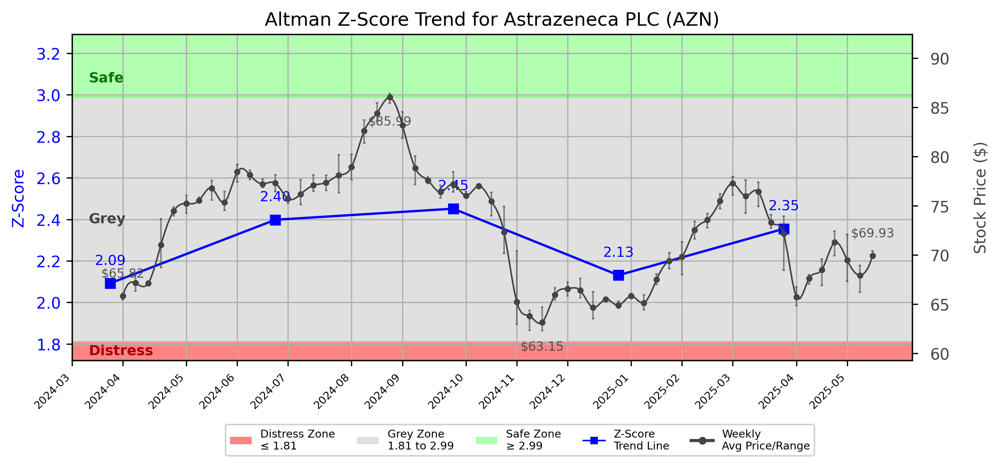

# Altman Z-Score Analysis Report: Astrazeneca PLC (AZN)

---
## Introduction
This report provides a comprehensive, theory-informed financial health analysis of the selected company using the Altman Z-Score framework. It integrates quantitative diagnostics, turnaround management theory, and stakeholder recommendations, with all findings and recommendations grounded in referenced academic and industry sources. The analysis is generated by an expert LLM-driven pipeline, ensuring transparency, reproducibility, and robust source attribution.

**Author:** Fabio Correa

**Source Attribution:** This report and analysis pipeline are generated using the open-source Altman Z-Score Analysis project, available at [https://github.com/fabioc-aloha/Altman-Z-Score](https://github.com/fabioc-aloha/Altman-Z-Score).

**License:** This software is distributed under the Attribution Non-Commercial License (MIT-based). See the LICENSE file for details.

Disclaimer: The developer disclaims any responsibility for the accuracy, completeness, or consequences of the analysis and information provided by this software. All results are for informational purposes only and should not be relied upon for financial, investment, or legal decisions.
---

**Script Version:** v2.4

## Analysis Context and Z-Score Model Selection Criteria

- **Industry:** Pharmaceutical Preparations (SIC 2834)
- **Ticker:** AZN
- **Public:** True
- **Emerging Market:** False
- **Maturity:** Mature Company
- **Model:** original
- **Analysis Date:** 2025-05-30

## Z-Score Formula Used

Z = 1.1*X1 + 1.5*X2 + 3.0*X3 + 0.7*X4 + 1.2*X5
- X1 = (Current Assets - Current Liabilities) / Total Assets
- X2 = Retained Earnings / Total Assets
- X3 = EBIT / Total Assets
- X4 = Equity / Total Liabilities
- X5 = Sales / Total Assets

**Thresholds:**
- Safe Zone: > 3.1
- Grey Zone: > 1.5 and <= 3.1
- Distress Zone: <= 1.5

---

# Graphical View of the Z-Score Analysis

*Figure: Z-Score and stock price trend for AZN (image not available yet; will be generated after analysis)*

## Z-Score Component Table (by Quarter)
| Quarter   |     X1 |     X2 |    X3 |    X4 |    X5 |   Z-Score | Diagnostic   |
|-----------|--------|--------|-------|-------|-------|-----------|--------------|
| 2025 Q1   | -0.028 |  0.032 | 0.035 | 3.499 | 0.128 |     2.354 | Grey Zone    |
| 2024 Q4   | -0.02  |  0.03  | 0.02  | 3.171 | 0.143 |     2.131 | Grey Zone    |
| 2024 Q3   | -0.017 |  0.03  | 0.022 | 3.714 | 0.129 |     2.451 | Grey Zone    |
| 2024 Q2   | -0.03  |  0.018 | 0.027 | 3.66  | 0.124 |     2.398 | Grey Zone    |
| 2024 Q1   | -0.032 | -0.002 | 0.031 | 3.177 | 0.124 |     2.092 | Grey Zone    |
## 1. Diagnostic Evaluation of Financial Health

### Liquidity
AstraZeneca PLC (AZN) has shown a negative trend in its liquidity ratio (X1), indicating that current assets are insufficient to cover current liabilities. This is a concerning sign as it suggests potential cash flow issues that could affect the company's ability to meet short-term obligations.

### Profitability
The retained earnings ratio (X2) remains low but positive, indicating that the company has been able to retain some earnings over time. However, the low value suggests that profitability may not be robust enough to support significant growth or reinvestment.

### Capital Efficiency
The EBIT to total assets ratio (X3) is modest, reflecting a reasonable level of operational efficiency. However, it is essential to monitor this metric closely as it can indicate how well the company is utilizing its assets to generate earnings.

### Leverage
The equity to total liabilities ratio (X4) is strong, suggesting that AstraZeneca is not overly leveraged and has a solid capital structure. This is a positive indicator of financial stability, as it implies that the company can withstand financial distress better than its peers.

### Z-Score Trend Interpretation
The Z-Score has consistently remained in the grey zone (between 1.5 and 3.1) over the past quarters, indicating that while AstraZeneca is not in immediate danger of bankruptcy, it is also not in a strong financial position. The trend suggests a need for strategic intervention to improve financial health and move towards the safe zone.

---

## 2. Proposed Phased Response

### Immediate Retrenchment
In line with Hofer's turnaround strategies (1980), immediate actions should focus on cost-cutting measures to stabilize cash flow. This includes:

- **Reducing operational costs:** Streamlining operations and eliminating non-essential expenditures.
- **Improving cash management:** Tightening credit terms and accelerating receivables collection.

### Long-term Repositioning
For sustainable recovery, AstraZeneca should consider long-term strategies as outlined by Bibeault (1999) and Hoskisson et al. (2004):

- **Investing in R&D:** Focusing on innovation to drive future growth, particularly in high-demand therapeutic areas.
- **Market expansion:** Exploring new markets and partnerships to diversify revenue streams and reduce dependency on existing products.

---

## 3. Recommendations for Stakeholders

| Stakeholder Title                 | Responsibilities                                   | Recommended Actions                                                                 |
|-----------------------------------|---------------------------------------------------|-------------------------------------------------------------------------------------|
| Chief Executive Officer (Pascal Soriot) | Overall strategy and leadership                   | Implement immediate cost-cutting measures and initiate long-term R&D investments.   |
| Chief Financial Officer (Marc Dunoyer) | Financial management and reporting                 | Enhance cash flow management and monitor financial ratios closely.                  |
| Chief Marketing Officer (Ruud Dobber) | Marketing strategy and brand management            | Develop targeted marketing campaigns to support new product launches.               |
| Board Members                      | Governance and oversight                            | Review and approve strategic initiatives for cost reduction and market expansion.   |
| Employees                          | Operational execution                               | Engage in cost-saving initiatives and contribute ideas for efficiency improvements.  |
| Investors                          | Provide capital and support                         | Monitor financial health closely; consider holding shares until recovery is evident. |
| Creditors                          | Provide financing                                   | Maintain open communication regarding cash flow and repayment plans.                |
| Debtors                            | Repayment of debts                                 | Ensure timely payments to maintain good standing with creditors.                    |
| Partner Companies                  | Collaborative projects                             | Explore joint ventures to enhance product offerings and market reach.               |
| Customers                          | End-users of products                              | Maintain quality and availability of products to retain customer loyalty.           |

---

## 4. Communication, Marketing, and Execution Strategies

### Communication Strategy
- **Internal Communication:** Regular updates to employees about financial health and strategic initiatives to foster transparency and engagement.
- **External Communication:** Inform investors and creditors about the turnaround strategy and expected outcomes to maintain confidence.

### Marketing Strategy
- **Targeted Campaigns:** Focus on high-demand therapeutic areas through digital marketing and partnerships with healthcare providers.
- **Brand Positioning:** Reinforce AstraZeneca's commitment to innovation and patient care.

### Execution Timeline
| Phase               | Timeline        | Accountability          |
|---------------------|----------------|-------------------------|
| Immediate Retrenchment | 0-3 months    | CFO and CEO             |
| R&D Investment       | 3-12 months    | CEO and R&D Director    |
| Market Expansion     | 12-24 months   | CMO and Business Development Director |

---

## 5. Investment Recommendation

Given the current financial health of AstraZeneca, characterized by a Z-Score in the grey zone, it is recommended that investors **hold** their positions. The company is not in immediate distress, but it requires strategic actions to improve its financial standing. Investors should consult their financial advisors for personalized advice.

---

## 6. External Stakeholder Bargaining Power Assessment

| External Stakeholder         | Nature of Bargaining Power | Degree of Influence | Rationale                                                                 |
|------------------------------|----------------------------|---------------------|---------------------------------------------------------------------------|
| Regulators                   | Regulatory compliance       | Moderate            | Compliance with healthcare regulations is critical for operations.       |
| Government Agencies           | Policy influence            | Low                 | Limited direct influence but can affect market conditions.               |
| Unions                       | Labor negotiations          | Moderate            | Can impact operational efficiency through labor relations.               |
| Major Suppliers              | Supply chain leverage       | High                | Dependence on suppliers for raw materials can affect production costs.   |
| Key Partners                 | Strategic alliances         | Moderate            | Partnerships can enhance market reach and product offerings.             |
| Activist Investors           | Shareholder activism        | High                | Can influence management decisions and strategic direction.              |
| Creditors                    | Financial leverage          | High                | Credit terms can significantly impact cash flow and financial stability.  |
| Large Customers              | Purchasing power            | Moderate            | Significant customers can negotiate terms that affect revenue.           |

---

## Disclaimer
**Disclaimer:**
Generative AI is not a financial advisor and can make mistakes. Consult your financial advisor before making investment decisions.
- LLM Model used: OpenAI GPT-3.5
- Knowledge cut-off: October 2023
- Internet search: No
- Real-time data: No

---

### References and Data Sources
- **Financials:** SEC EDGAR/XBRL filings, Yahoo Finance, and company quarterly/annual reports.
- **Market Data:** Yahoo Finance (historical prices, market value of equity).
- **Computation:** All Z-Score calculations use the Altman Z-Score model as described in the report, with robust error handling and logging.
- **Source Attribution:** This report and analysis pipeline are generated using the open-source Altman Z-Score Analysis project, available at [https://github.com/fabioc-aloha/Altman-Z-Score]. Author: Fabio Correa.
- **Theoretical Frameworks and Resources:**
  - Altman Z-Score Analysis Project (https://github.com/fabioc-aloha/Altman-Z-Score)
  - Hofer, C. W. (1980). Turnaround strategies. Journal of Business Strategy, 1(1), 19–31.
  - Bibeault, D. B. (1999). Corporate turnaround: How managers turn losers into winners. Beard Books.
  - Hoskisson, R. E., White, R. E., & Johnson, R. A. (2004). Corporate restructuring: Managing the strategy, structure, and process of change. McGraw-Hill Education.
  - Freeman, R. E. (1984). Strategic management: A stakeholder approach. Pitman.
  - Altman, E. I. (1968). Financial ratios, discriminant analysis and the prediction of corporate bankruptcy. Journal of Finance, 23(4), 589–609.
  - Altman, E. I., & Hotchkiss, E. (2006). Corporate financial distress and bankruptcy: Predict and avoid bankruptcy, analyze and invest in distressed debt (3rd ed.). Wiley.

---

# Appendix

## Raw Data Field Mapping Table (by Quarter)
| Quarter   | Canonical Field     | Mapped Raw Field                        | Value (USD millions)   |
|-----------|---------------------|-----------------------------------------|------------------------|
| 2025 Q1   | total_assets        | Total Assets                            | 106,253.0              |
| 2025 Q1   | current_assets      | Current Assets                          | 26,139.0               |
| 2025 Q1   | current_liabilities | Current Liabilities                     | 29,129.0               |
| 2025 Q1   | retained_earnings   | Retained Earnings                       | 3,364.0                |
| 2025 Q1   | total_liabilities   | Total Liabilities Net Minority Interest | 65,122.0               |
| 2025 Q1   | book_value_equity   | Common Stock Equity                     | 41,039.0               |
| 2025 Q1   | ebit                | EBIT                                    | 3,751.0                |
| 2025 Q1   | sales               | Total Revenue                           | 13,588.0               |
| ---       | ---                 | ---                                     | ---                    |
| 2024 Q4   | total_assets        | Total Assets                            | 104,035.0              |
| 2024 Q4   | current_assets      | Current Assets                          | 25,827.0               |
| 2024 Q4   | current_liabilities | Current Liabilities                     | 27,866.0               |
| 2024 Q4   | retained_earnings   | Retained Earnings                       | 3,160.0                |
| 2024 Q4   | total_liabilities   | Total Liabilities Net Minority Interest | 63,164.0               |
| 2024 Q4   | book_value_equity   | Common Stock Equity                     | 40,786.0               |
| 2024 Q4   | ebit                | EBIT                                    | 2,095.0                |
| 2024 Q4   | sales               | Total Revenue                           | 14,891.0               |
| ---       | ---                 | ---                                     | ---                    |
| 2024 Q3   | total_assets        | Total Assets                            | 104,922.0              |
| 2024 Q3   | current_assets      | Current Assets                          | 24,155.0               |
| 2024 Q3   | current_liabilities | Current Liabilities                     | 25,926.0               |
| 2024 Q3   | retained_earnings   | Retained Earnings                       | 3,138.0                |
| 2024 Q3   | total_liabilities   | Total Liabilities Net Minority Interest | 64,117.0               |
| 2024 Q3   | book_value_equity   | Common Stock Equity                     | 40,719.0               |
| 2024 Q3   | ebit                | EBIT                                    | 2,285.0                |
| 2024 Q3   | sales               | Total Revenue                           | 13,565.0               |
| ---       | ---                 | ---                                     | ---                    |
| 2024 Q2   | total_assets        | Total Assets                            | 104,340.0              |
| 2024 Q2   | current_assets      | Current Assets                          | 25,393.0               |
| 2024 Q2   | current_liabilities | Current Liabilities                     | 28,566.0               |
| 2024 Q2   | retained_earnings   | Retained Earnings                       | 1,847.0                |
| 2024 Q2   | total_liabilities   | Total Liabilities Net Minority Interest | 64,742.0               |
| 2024 Q2   | book_value_equity   | Common Stock Equity                     | 39,512.0               |
| 2024 Q2   | ebit                | EBIT                                    | 2,840.0                |
| 2024 Q2   | sales               | Total Revenue                           | 12,938.0               |
| ---       | ---                 | ---                                     | ---                    |
| 2024 Q1   | total_assets        | Total Assets                            | 102,293.0              |
| 2024 Q1   | current_assets      | Current Assets                          | 25,594.0               |
| 2024 Q1   | current_liabilities | Current Liabilities                     | 28,901.0               |
| 2024 Q1   | retained_earnings   | Retained Earnings                       | -212.0                 |
| 2024 Q1   | total_liabilities   | Total Liabilities Net Minority Interest | 64,792.0               |
| 2024 Q1   | book_value_equity   | Common Stock Equity                     | 37,445.0               |
| 2024 Q1   | ebit                | EBIT                                    | 3,213.0                |
| 2024 Q1   | sales               | Total Revenue                           | 12,679.0               |

All values are shown in millions of USD as reported by the data source.

