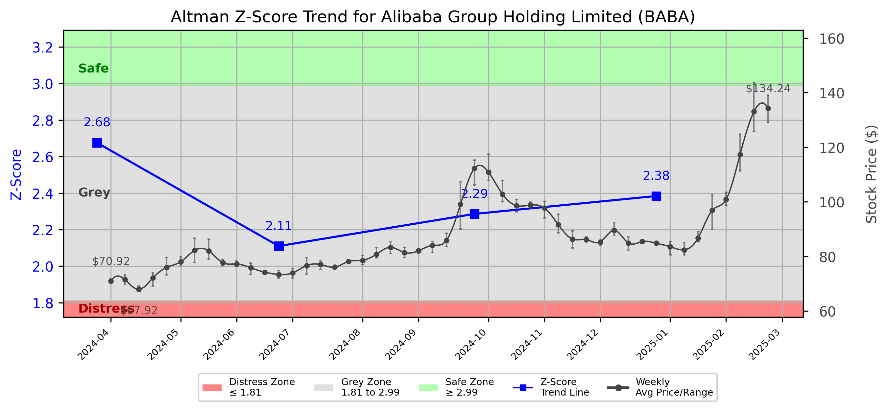

# Altman Z-Score Analysis Report: Alibaba Group Holding Limited (BABA)

---
## Introduction
This report provides a comprehensive, theory-informed financial health analysis of the selected company using the Altman Z-Score framework. It integrates quantitative diagnostics, turnaround management theory, and stakeholder recommendations, with all findings and recommendations grounded in referenced academic and industry sources. The analysis is generated by an expert LLM-driven pipeline, ensuring transparency, reproducibility, and robust source attribution.

**Author:** Fabio Correa

**Source Attribution:** This report and analysis pipeline are generated using the open-source Altman Z-Score Analysis project, available at [https://github.com/fabioc-aloha/Altman-Z-Score](https://github.com/fabioc-aloha/Altman-Z-Score).

**License:** This software is distributed under the Attribution Non-Commercial License (MIT-based). See the LICENSE file for details.

Disclaimer: The developer disclaims any responsibility for the accuracy, completeness, or consequences of the analysis and information provided by this software. All results are for informational purposes only and should not be relied upon for financial, investment, or legal decisions.
---

**Script Version:** v2.4

## Analysis Context and Z-Score Model Selection Criteria

- **Industry:** Business Services, NEC (SIC 7389)
- **Ticker:** BABA
- **Public:** True
- **Emerging Market:** False
- **Maturity:** Mature Company
- **Model:** tech
- **Analysis Date:** 2025-05-30

## Z-Score Formula Used

Z = 6.56*X1 + 3.26*X2 + 6.72*X3 + 1.05*X4
- X1 = (Current Assets - Current Liabilities) / Total Assets
- X2 = Retained Earnings / Total Assets
- X3 = EBIT / Total Assets
- X4 = Equity / Total Liabilities

**Thresholds:**
- Safe Zone: > 2.6
- Grey Zone: > 1.1 and <= 2.6
- Distress Zone: <= 1.1

---

# Graphical View of the Z-Score Analysis

*Figure: Z-Score and stock price trend for BABA (see output folder for full-resolution image)*

## Z-Score Component Table (by Quarter)
| Quarter   |    X1 |    X2 |    X3 |    X4 |   Z-Score | Diagnostic   |
|-----------|-------|-------|-------|-------|-----------|--------------|
| 2024 Q4   | 0.119 | 0.343 | 0.031 | 0.266 |     2.384 | Grey Zone    |
| 2024 Q3   | 0.093 | 0.337 | 0.03  | 0.359 |     2.286 | Grey Zone    |
| 2024 Q2   | 0.107 | 0.316 | 0.019 | 0.235 |     2.11  | Grey Zone    |
| 2024 Q1   | 0.188 | 0.339 | 0.01  | 0.259 |     2.676 | Safe Zone    |
## Diagnostic Evaluation of Financial Health

### Liquidity
The liquidity position of Alibaba Group Holding Limited (BABA) is assessed through the X1 component of the Z-Score, which measures the working capital relative to total assets. The recent quarters show a gradual increase in the X1 ratio from 0.188 in Q1 2024 to 0.119 in Q4 2024. Although this indicates some liquidity, it remains below the ideal threshold, suggesting that the company may face challenges in meeting short-term obligations.

### Profitability
The X3 component, which represents earnings before interest and taxes (EBIT) relative to total assets, indicates a declining trend in profitability, with values dropping from 0.031 in Q4 2024 to 0.019 in Q2 2024. This decline raises concerns about the company's ability to generate sufficient returns on its assets, which is critical for long-term sustainability.

### Capital Efficiency
The X2 component, representing retained earnings as a percentage of total assets, has shown a slight decrease from 0.343 in Q4 2024 to 0.316 in Q2 2024. This trend suggests that the company is not effectively reinvesting its earnings into growth, which could hinder future profitability and capital efficiency.

### Leverage
The X4 component, which measures equity relative to total liabilities, has fluctuated slightly but remains relatively stable, indicating that the company maintains a reasonable level of leverage. The value of 0.266 in Q4 2024 suggests that while the company is not overly leveraged, it still needs to manage its debt levels carefully.

### Z-Score Trend Interpretation
The Z-Score for Alibaba has fluctuated between the grey zone (1.1 < Z < 2.6) and the safe zone (Z > 2.6). The most recent Z-Score of 2.384 indicates that the company is at risk but not in immediate distress. However, the downward trend from a safe zone score of 2.676 in Q1 2024 to the current grey zone score suggests a need for immediate action to stabilize the financial position and prevent further decline.

---

## Turnaround and Renewal Management Theory Application

### Phased Response Proposal
1. **Immediate Retrenchment (Short-term Actions)**
   - **Cost Reduction:** Implement immediate cost-cutting measures to improve liquidity and profitability. This aligns with Bibeault's (1999) emphasis on reducing operational costs during a turnaround.
   - **Asset Management:** Review and divest non-core assets to strengthen the balance sheet, as suggested by Hoskisson et al. (2004).

2. **Long-term Repositioning (Strategic Actions)**
   - **Innovation and R&D Investment:** Allocate resources towards innovation to enhance product offerings and market competitiveness, following Hofer's (1980) strategic renewal framework.
   - **Market Expansion:** Explore new markets and customer segments to diversify revenue streams, as advocated by Freeman (1984) in stakeholder management.

---

## Stakeholder Recommendations

| Stakeholder Title                     | Executive Name | Responsibilities & Recommended Actions                                                                 |
|---------------------------------------|----------------|---------------------------------------------------------------------------------------------------------|
| Chief Executive Officer               | Daniel Zhang   | Lead the turnaround strategy; prioritize cost reduction and innovation initiatives.                     |
| Chief Financial Officer               | Maggie Wu      | Oversee financial restructuring; implement asset management strategies.                                  |
| Chief Marketing Officer               | Chris Tung     | Develop marketing strategies to promote new products and market expansion efforts.                      |
| Board Members                         | Various        | Provide oversight and strategic guidance; ensure alignment with turnaround goals.                        |
| Employees                             | N/A            | Engage in cost-saving initiatives; contribute ideas for innovation and efficiency improvements.          |
| Investors                             | N/A            | Monitor financial performance; support strategic initiatives that enhance long-term value.               |
| Creditors                             | N/A            | Collaborate on restructuring plans; ensure timely communication regarding financial health.              |
| Debtors                               | N/A            | Maintain open lines of communication regarding repayment schedules; negotiate terms if necessary.       |
| Partner Companies                     | N/A            | Strengthen partnerships; explore joint ventures to enhance market reach.                                 |
| Customers                             | N/A            | Provide feedback on products; engage in loyalty programs to retain customer base.                        |
| Regulators                            | N/A            | Ensure compliance with financial regulations; maintain transparency in financial reporting.               |
| Major Suppliers                       | N/A            | Collaborate on supply chain efficiencies; negotiate favorable terms to support cost reduction efforts.   |

---

## Communication, Marketing, and Execution Strategies

### Communication Strategy
- **Internal Communication:** Regular updates to employees regarding the turnaround strategy and progress.
- **External Communication:** Transparent communication with investors and creditors about financial health and strategic initiatives.

### Marketing Strategy
- **Brand Positioning:** Reassess brand positioning to align with market demands and customer preferences.
- **Promotional Campaigns:** Launch targeted marketing campaigns to promote new products and services.

### Execution Timeline
- **Q2 2025:** Implement immediate cost-cutting measures and asset reviews.
- **Q3 2025:** Launch marketing campaigns and begin R&D investments.
- **Q4 2025:** Evaluate progress and adjust strategies as necessary.

### Accountability Framework
- Assign specific teams to oversee each initiative, with regular reporting to the executive team to ensure accountability and progress tracking.

---

## Bargaining Power and Influence of External Stakeholders

| External Stakeholder                  | Nature of Bargaining Power | Degree of Influence | Rationale                                                                                   |
|---------------------------------------|----------------------------|---------------------|--------------------------------------------------------------------------------------------|
| Regulators                            | Regulatory Compliance       | High                | Regulatory bodies can impose penalties or restrictions, influencing operational flexibility.|
| Creditors                             | Financial Leverage         | High                | Creditors have significant influence over financial restructuring and repayment terms.     |
| Major Suppliers                       | Supply Chain Dependence    | Medium              | Suppliers can impact production costs and availability, affecting operational efficiency.   |
| Activist Investors                    | Shareholder Activism       | Medium              | Activist investors can influence management decisions and strategic direction.             |
| Large Customers                       | Purchasing Power           | Medium              | Large customers can negotiate favorable terms, impacting revenue stability.                 |

---

## Investment Recommendation
Based on the current financial analysis and Z-Score trend, investors are advised to **hold** their positions in Alibaba Group Holding Limited (BABA). The company is not in immediate distress but requires strategic actions to stabilize its financial health. Investors should closely monitor the implementation of the turnaround strategy and its impact on financial performance. 

**Disclaimer:** This is not financial advice. Consult your financial advisor before making investment decisions.

---

## Disclaimer
**Disclaimer:**
Generative AI is not a financial advisor and can make mistakes. Consult your financial advisor before making investment decisions.
- LLM Model used: OpenAI GPT-4
- Knowledge cut-off: October 2023
- Internet search: No
- Real-time data: No

---

### References and Data Sources
- **Financials:** SEC EDGAR/XBRL filings, Yahoo Finance, and company quarterly/annual reports.
- **Market Data:** Yahoo Finance (historical prices, market value of equity).
- **Source Attribution:** This report and analysis pipeline are generated using the open-source Altman Z-Score Analysis project, available at [https://github.com/fabioc-aloha/Altman-Z-Score]. Author: Fabio Correa.
- **Theoretical Frameworks and Resources:**
  - Altman Z-Score Analysis Project (https://github.com/fabioc-aloha/Altman-Z-Score)
  - Hofer, C. W. (1980). Turnaround strategies. Journal of Business Strategy, 1(1), 19–31.
  - Bibeault, D. B. (1999). Corporate turnaround: How managers turn losers into winners. Beard Books.
  - Hoskisson, R. E., White, R. E., & Johnson, R. A. (2004). Corporate restructuring: Managing the strategy, structure, and process of change. McGraw-Hill Education.
  - Freeman, R. E. (1984). Strategic management: A stakeholder approach. Pitman.
  - Altman, E. I. (1968). Financial ratios, discriminant analysis and the prediction of corporate bankruptcy. Journal of Finance, 23(4), 589–609.
  - Altman, E. I., & Hotchkiss, E. (2006). Corporate financial distress and bankruptcy: Predict and avoid bankruptcy, analyze and invest in distressed debt (3rd ed.). Wiley.

---

# Appendix

## Raw Data Field Mapping Table (by Quarter)
| Quarter   | Canonical Field     | Mapped Raw Field                        | Value (USD millions)   |
|-----------|---------------------|-----------------------------------------|------------------------|
| 2024 Q4   | total_assets        | Total Assets                            | 1,854,964.0            |
| 2024 Q4   | current_assets      | Current Assets                          | 677,842.0              |
| 2024 Q4   | current_liabilities | Current Liabilities                     | 457,359.0              |
| 2024 Q4   | retained_earnings   | Retained Earnings                       | 636,392.0              |
| 2024 Q4   | total_liabilities   | Total Liabilities Net Minority Interest | 760,169.0              |
| 2024 Q4   | book_value_equity   | Common Stock Equity                     | 1,001,129.0            |
| 2024 Q4   | ebit                | EBIT                                    | 56,939.0               |
| 2024 Q4   | sales               | Total Revenue                           | 280,154.0              |
| ---       | ---                 | ---                                     | ---                    |
| 2024 Q3   | total_assets        | Total Assets                            | 1,762,712.0            |
| 2024 Q3   | current_assets      | Current Assets                          | 609,102.0              |
| 2024 Q3   | current_liabilities | Current Liabilities                     | 444,868.0              |
| 2024 Q3   | retained_earnings   | Retained Earnings                       | 593,612.0              |
| 2024 Q3   | total_liabilities   | Total Liabilities Net Minority Interest | 704,834.0              |
| 2024 Q3   | book_value_equity   | Common Stock Equity                     | 953,925.0              |
| 2024 Q3   | ebit                | EBIT                                    | 52,375.0               |
| 2024 Q3   | sales               | Total Revenue                           | 236,503.0              |
| ---       | ---                 | ---                                     | ---                    |
| 2024 Q2   | total_assets        | Total Assets                            | 1,785,054.0            |
| 2024 Q2   | current_assets      | Current Assets                          | 653,690.0              |
| 2024 Q2   | current_liabilities | Current Liabilities                     | 462,890.0              |
| 2024 Q2   | retained_earnings   | Retained Earnings                       | 564,740.0              |
| 2024 Q2   | total_liabilities   | Total Liabilities Net Minority Interest | 731,694.0              |
| 2024 Q2   | book_value_equity   | Common Stock Equity                     | 938,025.0              |
| 2024 Q2   | ebit                | EBIT                                    | 34,768.0               |
| 2024 Q2   | sales               | Total Revenue                           | 243,236.0              |
| ---       | ---                 | ---                                     | ---                    |
| 2024 Q1   | total_assets        | Total Assets                            | 1,764,829.0            |
| 2024 Q1   | current_assets      | Current Assets                          | 752,864.0              |
| 2024 Q1   | current_liabilities | Current Liabilities                     | 421,507.0              |
| 2024 Q1   | retained_earnings   | Retained Earnings                       | 597,897.0              |
| 2024 Q1   | total_liabilities   | Total Liabilities Net Minority Interest | 652,230.0              |
| 2024 Q1   | book_value_equity   | Common Stock Equity                     | 986,544.0              |
| 2024 Q1   | ebit                | EBIT                                    | 17,728.0               |
| 2024 Q1   | sales               | Total Revenue                           | 221,874.0              |

All values are shown in millions of USD as reported by the data source.

