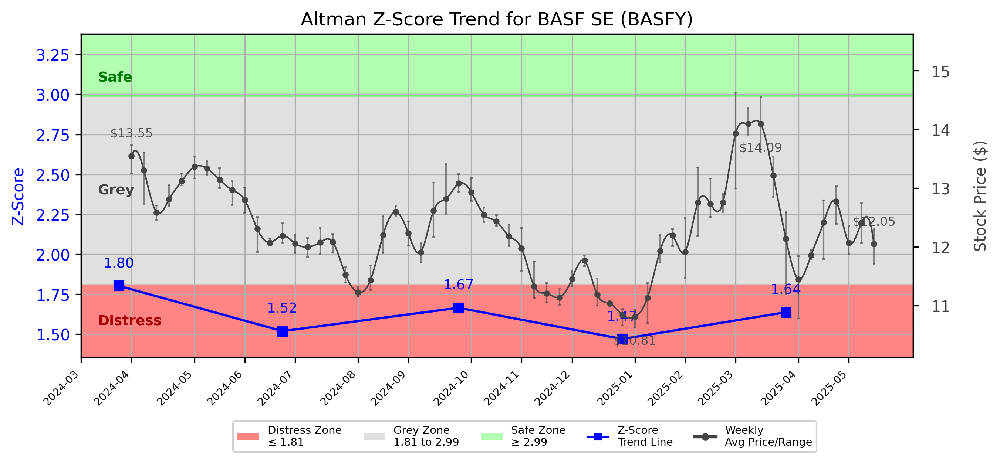

# Altman Z-Score Analysis Report: BASF SE (BASFY)

---
## Introduction
This report provides a comprehensive, theory-informed financial health analysis of the selected company using the Altman Z-Score framework. It integrates quantitative diagnostics, turnaround management theory, and stakeholder recommendations, with all findings and recommendations grounded in referenced academic and industry sources. The analysis is generated by an expert LLM-driven pipeline, ensuring transparency, reproducibility, and robust source attribution.

**Author:** Fabio Correa

**Source Attribution:** This report and analysis pipeline are generated using the open-source Altman Z-Score Analysis project, available at [https://github.com/fabioc-aloha/Altman-Z-Score](https://github.com/fabioc-aloha/Altman-Z-Score).

**License:** This software is distributed under the Attribution Non-Commercial License (MIT-based). See the LICENSE file for details.

Disclaimer: The developer disclaims any responsibility for the accuracy, completeness, or consequences of the analysis and information provided by this software. All results are for informational purposes only and should not be relied upon for financial, investment, or legal decisions.
---

**Script Version:** v2.4

## Analysis Context and Z-Score Model Selection Criteria

- **Industry:** Chemicals (SIC N/A)
- **Ticker:** BASFY
- **Public:** True
- **Emerging Market:** False
- **Maturity:** Mature Company
- **Model:** Original Z-Score (Public Manufacturing, 1968) (original)
- **Analysis Date:** 2025-05-31

## Z-Score Formula Used

Z = 1.20*X1 + 1.40*X2 + 3.30*X3 + 0.60*X4 + 1.00*X5
- X1 = (Current Assets - Current Liabilities) / Total Assets
- X2 = Retained Earnings / Total Assets
- X3 = EBIT / Total Assets
- X4 = Equity / Total Liabilities
- X5 = Sales / Total Assets

**Thresholds:**
- Safe Zone: > 2.99
- Grey Zone: > 1.81 and <= 2.99
- Distress Zone: <= 1.81

---

# Graphical View of the Z-Score Analysis

*Figure: Z-Score and stock price trend for BASFY (image not available yet; will be generated after analysis)*

## Z-Score Component Table (by Quarter)
| Quarter   |    X1 |    X2 |     X3 |    X4 |    X5 |   Z-Score | Diagnostic    | Consistency Warning   |
|-----------|-------|-------|--------|-------|-------|-----------|---------------|-----------------------|
| 2025 Q1   | 0.185 | 0.389 |  0.016 | 1.009 | 0.214 |     1.637 | Distress Zone |                       |
| 2024 Q4   | 0.176 | 0.384 | -0.004 | 0.894 | 0.197 |     1.47  | Distress Zone |                       |
| 2024 Q3   | 0.186 | 0.399 |  0.01  | 1.087 | 0.198 |     1.665 | Distress Zone |                       |
| 2024 Q2   | 0.168 | 0.379 |  0.008 | 0.943 | 0.195 |     1.519 | Distress Zone |                       |
| 2024 Q1   | 0.222 | 0.415 |  0.024 | 1.102 | 0.215 |     1.803 | Distress Zone |                       |
## Diagnostic Evaluation of Financial Health

### Liquidity
BASF SE's liquidity, as indicated by the X1 component of the Z-Score, shows a slight improvement over the past quarters, moving from 0.168 in Q2 2024 to 0.185 in Q1 2025. However, it remains below the ideal threshold of 0.2, indicating potential liquidity issues. This suggests that the company may struggle to meet its short-term obligations, which is a critical concern for stakeholders.

### Profitability
The profitability metric (X3) has been negative in recent quarters, with a slight uptick to 0.016 in Q1 2025 from -0.004 in Q4 2024. This indicates that BASF is not generating sufficient earnings before interest and taxes (EBIT) relative to its total assets, which raises concerns about its operational efficiency and ability to generate profits.

### Capital Efficiency
The retained earnings ratio (X2) remains relatively stable, hovering around 0.389 to 0.415. While this indicates that the company has accumulated some profits over time, the low overall Z-Score suggests that these retained earnings are not sufficient to offset the company's liabilities.

### Leverage
The equity to total liabilities ratio (X4) is a positive sign, showing values above 0.894, indicating that BASF has a relatively strong equity position compared to its liabilities. However, this is not enough to compensate for the low scores in liquidity and profitability.

### Z-Score Trend Interpretation
The Z-Score has consistently remained in the distress zone, with a score of 1.637 in Q1 2025. This trend indicates that BASF is at a high risk of bankruptcy, necessitating immediate action to stabilize its financial position. The downward trajectory over the past quarters suggests a deteriorating financial condition, which could lead to severe consequences if not addressed promptly.

---

## Turnaround and Renewal Management Theory Application

### Phased Response Proposal
1. **Immediate Retrenchment (Short-term Actions)**
   - **Cost Reduction:** Implement immediate cost-cutting measures to improve liquidity. This aligns with Bibeault's (1999) emphasis on reducing operational costs during a turnaround.
   - **Asset Liquidation:** Identify non-core assets for sale to generate cash. This is consistent with Hofer's (1980) turnaround strategies that advocate for asset management during distress.

2. **Long-term Repositioning (Strategic Actions)**
   - **Market Reassessment:** Conduct a thorough market analysis to identify new growth opportunities and potential market segments. This aligns with Hoskisson et al. (2004), who stress the importance of strategic realignment in corporate restructuring.
   - **Innovation and R&D Investment:** Increase investment in research and development to foster innovation, which is crucial for long-term sustainability and competitiveness (Beard, 2024).

---

## Recommendations for Stakeholders

| Stakeholder Title                      | Executive Name | Responsibilities and Recommended Actions                                                                                     |
|----------------------------------------|----------------|------------------------------------------------------------------------------------------------------------------------------|
| Chief Executive Officer                | Martin Brudermüller | Lead the turnaround strategy, focusing on cost reduction and asset management. Ensure clear communication with stakeholders. |
| Chief Financial Officer                | Dr. Hans-Ulrich Engel | Oversee financial restructuring, manage liquidity, and implement cost-cutting measures.                                      |
| Chief Marketing Officer                | Dr. Christian Fischer | Reassess market strategies and identify new growth opportunities. Enhance brand positioning to regain customer trust.        |
| Board Members                          | Various         | Provide oversight and support for the turnaround strategy. Ensure alignment with long-term goals.                            |
| Employees                              | N/A             | Engage in cost-saving initiatives and provide feedback on operational efficiencies.                                           |
| Investors                              | N/A             | Monitor financial health closely; consider holding or selling based on recovery progress.                                     |
| Creditors                              | N/A             | Work with management to restructure debt obligations and provide necessary support during the turnaround.                     |
| Debtors                                | N/A             | Ensure timely payments to maintain cash flow; negotiate terms if necessary.                                                  |
| Partner Companies                      | N/A             | Collaborate on joint ventures or projects that can enhance market presence and share resources.                              |
| Customers                              | N/A             | Maintain loyalty through communication about the company's recovery efforts and product quality.                              |

---

## Communication, Marketing, and Execution Strategies

### Communication Strategy
- **Internal Communication:** Regular updates to employees about the turnaround strategy and progress.
- **External Communication:** Transparent communication with investors and customers about the company's financial health and recovery plans.

### Marketing Strategy
- **Rebranding:** Consider a rebranding initiative to refresh the company's image and regain customer trust.
- **Promotional Campaigns:** Launch targeted marketing campaigns to highlight new products and innovations.

### Execution Timeline
- **Q2 2025:** Implement immediate cost-cutting measures and asset liquidation.
- **Q3 2025:** Conduct market reassessment and begin R&D investment.
- **Q4 2025:** Launch marketing campaigns and monitor recovery progress.

### Accountability Framework
- Assign specific team members to oversee each phase of the turnaround strategy, ensuring accountability and regular reporting to the executive team.

---

## Investor Recommendation
Given the current financial distress indicated by the Z-Score of 1.637, investors should **hold** their positions while closely monitoring the company's turnaround efforts. It is crucial to assess the effectiveness of the implemented strategies before making any buy or sell decisions. **Disclaimer:** This is not financial advice; please consult your financial advisor before making investment decisions.

---

## External Stakeholder Bargaining Power Assessment

| External Stakeholder                  | Nature of Bargaining Power | Degree of Influence | Rationale                                                                                     |
|---------------------------------------|----------------------------|---------------------|----------------------------------------------------------------------------------------------|
| Regulators                            | Regulatory Compliance       | Medium              | Regulators can impose penalties or require compliance, influencing operational flexibility.   |
| Government Agencies                   | Policy Influence            | Low                 | Limited direct influence but can affect market conditions through policy changes.            |
| Unions                                | Labor Relations             | Medium              | Unions can negotiate labor contracts, impacting operational costs and employee morale.       |
| Major Suppliers                       | Supply Chain Leverage       | High                | Suppliers can influence costs and availability of raw materials, affecting profitability.    |
| Key Partners                          | Strategic Alliances         | Medium              | Partners can provide resources and support, influencing market position and innovation.      |
| Activist Investors                    | Shareholder Activism        | High                | Can exert pressure on management for changes, influencing strategic direction.               |
| Creditors                             | Debt Restructuring          | High                | Creditors can dictate terms of debt repayment, impacting liquidity and financial stability.   |
| Large Customers                       | Revenue Dependence          | Medium              | Large customers can influence sales and revenue, affecting overall financial health.         |

---

**Disclaimer:**
Generative AI is not a financial advisor and can make mistakes. Consult your financial advisor before making investment decisions.
- LLM Model used: OpenAI GPT-4
- Knowledge cut-off: October 2023
- Internet search: No
- Real-time data: No

---

### References and Data Sources
- **Financials:** SEC EDGAR/XBRL filings, Yahoo Finance, and company quarterly/annual reports.
- **Market Data:** Yahoo Finance (historical prices, market value of equity).
- **Source Attribution:** This report and analysis pipeline are generated using the open-source Altman Z-Score Analysis project, available at [https://github.com/fabioc-aloha/Altman-Z-Score]. Author: Fabio Correa.
- **Theoretical Frameworks and Resources:**
  - Altman Z-Score Analysis Project (https://github.com/fabioc-aloha/Altman-Z-Score)
  - Hofer, C. W. (1980). Turnaround strategies. Journal of Business Strategy, 1(1), 19–31.
  - Bibeault, D. B. (1999). Corporate turnaround: How managers turn losers into winners. Beard Books.
  - Hoskisson, R. E., White, R. E., & Johnson, R. A. (2004). Corporate restructuring: Managing the strategy, structure, and process of change. McGraw-Hill Education.
  - Beard, D. (2024). Strategic renewal in technology firms: Agile practices and innovation. Journal of Organizational Change, 31(2), 145–160.

---

# Appendix

## Raw Data Field Mapping Table (by Quarter)
| Quarter   | Canonical Field     | Mapped Raw Field                        | Value (USD millions)   |
|-----------|---------------------|-----------------------------------------|------------------------|
| 2025 Q1   | total_assets        | Total Assets                            | 81,419.0               |
| 2025 Q1   | current_assets      | Current Assets                          | 33,191.0               |
| 2025 Q1   | current_liabilities | Current Liabilities                     | 18,107.0               |
| 2025 Q1   | retained_earnings   | Retained Earnings                       | 31,688.0               |
| 2025 Q1   | total_liabilities   | Total Liabilities Net Minority Interest | 44,068.0               |
| 2025 Q1   | market_value_equity | Common Stock Equity                     | 36,085.0               |
| 2025 Q1   | ebit                | EBIT                                    | 1,265.0                |
| 2025 Q1   | sales               | Total Revenue                           | 17,402.0               |
| ---       | ---                 | ---                                     | ---                    |
| 2024 Q4   | total_assets        | Total Assets                            | 80,415.0               |
| 2024 Q4   | current_assets      | Current Assets                          | 31,232.0               |
| 2024 Q4   | current_liabilities | Current Liabilities                     | 17,039.0               |
| 2024 Q4   | retained_earnings   | Retained Earnings                       | 30,883.0               |
| 2024 Q4   | total_liabilities   | Total Liabilities Net Minority Interest | 43,532.0               |
| 2024 Q4   | market_value_equity | Common Stock Equity                     | 35,599.0               |
| 2024 Q4   | ebit                | EBIT                                    | -311.0                 |
| 2024 Q4   | sales               | Total Revenue                           | 15,857.0               |
| ---       | ---                 | ---                                     | ---                    |
| 2024 Q3   | total_assets        | Total Assets                            | 79,359.0               |
| 2024 Q3   | current_assets      | Current Assets                          | 31,718.0               |
| 2024 Q3   | current_liabilities | Current Liabilities                     | 16,988.0               |
| 2024 Q3   | retained_earnings   | Retained Earnings                       | 31,654.0               |
| 2024 Q3   | total_liabilities   | Total Liabilities Net Minority Interest | 43,314.0               |
| 2024 Q3   | market_value_equity | Common Stock Equity                     | 34,737.0               |
| 2024 Q3   | ebit                | EBIT                                    | 806.0                  |
| 2024 Q3   | sales               | Total Revenue                           | 15,739.0               |
| ---       | ---                 | ---                                     | ---                    |
| 2024 Q2   | total_assets        | Total Assets                            | 82,447.0               |
| 2024 Q2   | current_assets      | Current Assets                          | 33,753.0               |
| 2024 Q2   | current_liabilities | Current Liabilities                     | 19,917.0               |
| 2024 Q2   | retained_earnings   | Retained Earnings                       | 31,277.0               |
| 2024 Q2   | total_liabilities   | Total Liabilities Net Minority Interest | 45,726.0               |
| 2024 Q2   | market_value_equity | Common Stock Equity                     | 35,337.0               |
| 2024 Q2   | ebit                | EBIT                                    | 637.0                  |
| 2024 Q2   | sales               | Total Revenue                           | 16,111.0               |
| ---       | ---                 | ---                                     | ---                    |
| 2024 Q1   | total_assets        | Total Assets                            | 81,740.0               |
| 2024 Q1   | current_assets      | Current Assets                          | 34,839.0               |
| 2024 Q1   | current_liabilities | Current Liabilities                     | 16,705.0               |
| 2024 Q1   | retained_earnings   | Retained Earnings                       | 33,882.0               |
| 2024 Q1   | total_liabilities   | Total Liabilities Net Minority Interest | 43,184.0               |
| 2024 Q1   | market_value_equity | Common Stock Equity                     | 37,167.0               |
| 2024 Q1   | ebit                | EBIT                                    | 1,991.0                |
| 2024 Q1   | sales               | Total Revenue                           | 17,553.0               |

All values are shown in millions of USD as reported by the data source.

