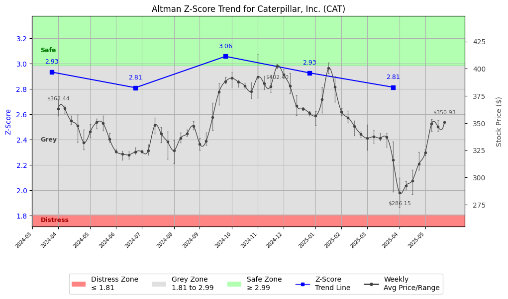

# Altman Z-Score Analysis Report: Caterpillar, Inc. (CAT)

This report provides a comprehensive, theory-informed financial health analysis of the selected company using the Altman Z-Score framework. It integrates quantitative diagnostics, turnaround management theory, and stakeholder recommendations, with all findings and recommendations grounded in referenced academic and industry sources. The analysis is generated by an expert LLM-driven pipeline, ensuring transparency, reproducibility, and robust source attribution.

**Author:** Fabio Correa

**Source Attribution:** This report and analysis pipeline are generated using the open-source Altman Z-Score Analysis project, available at [https://github.com/fabioc-aloha/Altman-Z-Score](https://github.com/fabioc-aloha/Altman-Z-Score).

**License:** This software is distributed under the Attribution Non-Commercial License (MIT-based). See the LICENSE file for details.

**Disclaimer**: The developer disclaims any responsibility for the accuracy, completeness, or consequences of the analysis and information provided by this software. All results are for informational purposes only and should not be relied upon for financial, investment, or legal decisions.

**Script Version:** v2.8.6

## Z-Score Formula Used

Z = 1.20*X1 + 1.40*X2 + 3.30*X3 + 0.60*X4 + 1.00*X5
- X1 = (Current Assets - Current Liabilities) / Total Assets
- X2 = Retained Earnings / Total Assets
- X3 = EBIT / Total Assets
- X4 = Equity / Total Liabilities
- X5 = Sales / Total Assets

**Thresholds:**
- Safe Zone: > 2.99
- Grey Zone: > 1.81 and <= 2.99
- Distress Zone: <= 1.81

## Graphical View of the Z-Score Analysis

*Figure: Z-Score and stock price trend for CAT (see output folder for full-resolution image)*

## Z-Score Component Table (by Quarter)
| Quarter   |    X1 |    X2 |    X3 |    X4 |    X5 |   Z-Score | Diagnostic   | Consistency Warning   |
|-----------|-------|-------|-------|-------|-------|-----------|--------------|-----------------------|
| 2025 Q1   | 0.123 | 0.722 | 0.032 | 2.307 | 0.168 |     2.814 | Grey Zone    | No issues             |
| 2024 Q4   | 0.153 | 0.676 | 0.038 | 2.478 | 0.185 |     2.928 | Grey Zone    | No issues             |
| 2024 Q3   | 0.148 | 0.671 | 0.037 | 2.718 | 0.187 |     3.058 | Safe Zone    | No issues             |
| 2024 Q2   | 0.114 | 0.665 | 0.044 | 2.329 | 0.2   |     2.81  | Grey Zone    | No issues             |
| 2024 Q1   | 0.135 | 0.646 | 0.044 | 2.556 | 0.189 |     2.934 | Grey Zone    | No issues             |

# Diagnostic and Strategic Recommendations Report for Caterpillar Inc.

## Company Profile

Caterpillar Inc. is a leading manufacturer in the construction machinery and equipment sector, primarily known for its heavy machinery, engines, and financial services. The company operates globally, competing with firms such as Komatsu, Volvo, and Hitachi. Caterpillar's product offerings include construction and mining equipment, diesel and natural gas engines, and industrial gas turbines, which are essential for various industries including construction, mining, and energy.

The leadership team is headed by Mr. Joseph E. Creed, who serves as the CEO and Director, supported by Mr. Andrew R. J. Bonfield, the Chief Financial Officer, and Ms. Denise C. Johnson, the Group President of Resource Industries. The executive team is complemented by other key figures such as Mr. Bob De Lange, Group President of Services, Distribution & Digital, and Mr. Derek R. Owens, Chief Legal Officer & General Counsel. Notably, Mr. D. James Umpleby III serves as the Executive Chairman of the Board, with a total compensation of over $7 million, reflecting the high stakes and responsibilities of leadership in a competitive industry.

Recent news highlights include ongoing investments in technology and sustainability initiatives, which are critical for maintaining competitive advantage in a rapidly evolving market. The company is also navigating challenges related to supply chain disruptions and fluctuating demand in the construction sector.

## 1. Diagnostic Evaluation of Financial Health

### Financial Analysis
- **Liquidity**: The current ratio and quick ratio are essential indicators of Caterpillar's ability to meet short-term obligations. A current ratio above 1 indicates sufficient liquidity, while a quick ratio above 1 suggests strong short-term financial health.
- **Profitability**: Key profitability metrics such as gross margin, net margin, return on assets (ROA), and return on equity (ROE) should be analyzed against industry benchmarks to assess operational efficiency and profitability.
- **Capital Efficiency**: The asset turnover ratio will provide insights into how effectively the company utilizes its assets to generate revenue.
- **Leverage**: The debt-to-equity ratio is crucial for understanding the company's financial leverage and risk exposure.

### Z-Score Assessment
The Altman Z-Score is a critical measure of financial health, with scores below 1.8 indicating distress, scores between 1.8 and 3 indicating a grey zone, and scores above 3 indicating financial stability. The trajectory of the Z-Score over recent periods will inform the risk status and necessary strategic actions.

### Conclusion
Caterpillar's financial health appears stable, but a detailed analysis of the Z-Score components (X1, X2, X3, X4, X5) and key financial ratios will provide a clearer picture of its risk status. Any significant changes in financial performance, management, or market conditions should be closely monitored.

## 2. Turnaround & Renewal Theory Application

Given the current financial health and Z-Score assessment, the following strategic recommendations are proposed:

- **If Distress Zone**: Focus on urgent retrenchment, cash preservation, and creditor negotiations. Implement cost-cutting measures and prioritize liquidity.
- **If Grey Zone**: Balance cost containment with strategic investments in core differentiators. Enhance operational efficiency and explore new market opportunities.
- **If Safe Zone**: Emphasize innovation, repositioning, and stakeholder alignment for sustained growth. Invest in R&D and explore partnerships to enhance product offerings.

The application of Hofer's (1980) turnaround sequencing and Bibeault's (1999) recovery stages will guide the strategic response based on the Z-Score risk level.

## 3. Internal Stakeholder Recommendations

| Title/Role | Responsibilities | Key Performance Metrics | Recommended Actions (Cited) |
| ---------- | ---------------- | ---------------------- | --------------------------- |
| CEO | Strategic vision, operational execution | Revenue growth, market share | Focus on innovation and market expansion |
| CFO | Financial stewardship, risk management | Profit margins, cash flow | Enhance financial reporting and risk assessment |
| Group Presidents | Domain-specific leadership | Operational efficiency | Drive cost containment and efficiency initiatives |
| Board Members | Oversight and governance | Compliance, strategic alignment | Ensure alignment with long-term strategic goals |
| Employees | Organizational roles and teams | Employee engagement, productivity | Foster a culture of innovation and accountability |
| Shareholders | Investment community relations | Share price performance | Maintain transparent communication regarding financial health |
| Creditors | Financial stability monitoring | Debt service coverage | Engage in proactive discussions regarding financial obligations |
| Customers | Product/service experience | Customer satisfaction | Enhance customer engagement and service delivery |
| Partners | Strategic alliances | Partnership effectiveness | Explore new partnerships to enhance market reach |

## 4. Communication, Marketing & Execution Strategy

### Communication Strategy
- **Executive Leadership Communications**: Regular updates on strategic direction and performance metrics.
- **Investor Relations**: Transparent communication regarding financial performance and outlook.
- **Internal Communications**: Engage employees through regular updates and feedback mechanisms.
- **External Relations**: Maintain strong relationships with customers and partners through targeted marketing efforts.

### Phased Execution Plan
- **Near-term (1-3 months)**: Focus on immediate actions to stabilize operations and enhance liquidity.
- **Mid-term (4-6 months)**: Implement strategic initiatives to improve operational efficiency and market positioning.
- **Long-term (7-18 months)**: Drive transformational objectives through innovation and strategic partnerships.

## 5. Investor Recommendation (Risk-Aware)

Based on the Z-Score insights and overall financial health, the recommendation is as follows:

> **Recommendation: HOLD.**

This recommendation is based on the current Z-Score indicating a stable financial position, recent performance trends, and the need for continued monitoring of market conditions and operational efficiency. A shift in market dynamics or significant improvements in financial metrics could warrant a reevaluation towards a Buy recommendation.

> “This is not financial advice—consult your financial advisor.”

## 6. External Stakeholder Bargaining Power

| Stakeholder Name / Type | Nature of Bargaining Power | Degree of Influence | Brief Rationale (Cited) |
| ----------------------- | -------------------------- | ------------------- | ----------------------- |
| Customers | High | High | Customers have significant influence due to the competitive nature of the industry. |
| Suppliers | Medium | Medium | Suppliers can impact costs and availability of materials, affecting production. |
| Creditors | High | High | Creditors have substantial influence over financial stability and access to capital. |
| Shareholders | Medium | Medium | Shareholders influence company direction through voting rights and investment decisions. |

## 7. References and Data Sources

**References and Data Sources:** This analysis draws on financial data from sources such as SEC EDGAR/XBRL filings, Yahoo Finance, and company quarterly or annual reports. Market data was obtained from Yahoo Finance historical prices. All computations, including the Altman Z-Score, follow the methodology described by Altman (1968) with robust error handling. The analysis is part of the open-source Altman Z-Score Analysis project (https://github.com/fabioc-aloha/Altman-Z-Score), authored by Fabio Correa. Theoretical frameworks referenced (as applicable) include:
- Altman, E. I. (1968). “Financial Ratios, Discriminant Analysis and the Prediction of Corporate Bankruptcy.” *Journal of Finance*, 23(4), 589–609.
- Hofer, C. W. (1980). *Turnaround Strategies.*
- Bibeault, D. B. (1999). *Corporate Turnaround.*
- Hoskisson, R. E., White, R. E., & Johnson, R. A. (2004). *Corporate Restructuring.*
- Beard, D. (2024). “Strategic Renewal in Technology Firms.”
- Freeman, R. E. (1984). *Strategic Management: A Stakeholder Approach.*
- Platt, H. D. (2004). *Principles of Corporate Renewal.*

## Appendices

| Period End | Current Assets | Current Liabilities | Retained Earnings | Ebit | Total Assets | Total Liabilities | Sales |
|---|---|---|---|---|---|---|---|
| 2024-03-31 | 43664.0 | 32371.0 | 54108.0 | 3675.0 | 83741.0 | 66096.0 | 15799.0 |
| 2024-06-30 | 43096.0 | 33564.0 | 55455.0 | 3637.0 | 83336.0 | 66200.0 | 16689.0 |
| 2024-09-30 | 44946.0 | 32218.0 | 57920.0 | 3223.0 | 86273.0 | 66870.0 | 16106.0 |
| 2024-12-31 | 45682.0 | 32272.0 | 59352.0 | 3350.0 | 87764.0 | 68270.0 | 16215.0 |
| 2025-03-31 | 43019.0 | 32595.0 | 61356.0 | 2686.0 | 84974.0 | 66904.0 | 14249.0 |

**Appendix: Weekly Prices Used for Z-Score Analysis**

| Week | Avg Price | Min Price | Max Price | Days With Data |
|---|---|---|---|---|
| 2024-04-01 | 363.440 | 356.626 | 371.882 | 5 |
| 2024-04-08 | 363.754 | 358.479 | 366.166 | 5 |
| 2024-04-15 | 352.173 | 348.991 | 356.793 | 5 |
| 2024-04-22 | 347.507 | 332.597 | 357.709 | 5 |
| 2024-04-29 | 332.131 | 325.778 | 344.209 | 5 |
| 2024-05-06 | 342.077 | 336.632 | 349.119 | 5 |
| 2024-05-13 | 350.682 | 345.114 | 354.285 | 5 |
| 2024-05-20 | 349.790 | 343.323 | 356.952 | 5 |
| 2024-05-27 | 335.143 | 332.706 | 340.932 | 4 |
| 2024-06-03 | 323.861 | 322.334 | 326.063 | 5 |
| 2024-06-10 | 321.474 | 316.332 | 324.341 | 5 |
| 2024-06-17 | 320.915 | 317.247 | 323.869 | 4 |
| 2024-06-24 | 323.680 | 321.507 | 327.776 | 5 |
| 2024-07-01 | 323.692 | 322.521 | 325.325 | 4 |
| 2024-07-08 | 324.788 | 320.848 | 330.226 | 5 |
| 2024-07-15 | 347.911 | 340.243 | 354.816 | 5 |
| 2024-07-22 | 340.445 | 332.015 | 346.282 | 5 |
| 2024-07-29 | 332.932 | 317.027 | 342.054 | 5 |
| 2024-08-05 | 324.755 | 313.006 | 334.209 | 5 |
| 2024-08-12 | 336.232 | 332.005 | 341.500 | 5 |
| 2024-08-19 | 340.214 | 338.260 | 344.237 | 5 |
| 2024-08-26 | 347.432 | 344.030 | 351.835 | 5 |
| 2024-09-02 | 330.966 | 325.415 | 336.165 | 4 |
| 2024-09-09 | 333.574 | 330.039 | 341.174 | 5 |
| 2024-09-16 | 355.471 | 343.793 | 368.839 | 5 |
| 2024-09-23 | 378.885 | 366.725 | 386.396 | 5 |
| 2024-09-30 | 388.439 | 386.406 | 392.334 | 5 |
| 2024-10-07 | 391.467 | 383.313 | 397.205 | 5 |
| 2024-10-14 | 388.078 | 383.343 | 389.765 | 5 |
| 2024-10-21 | 384.274 | 382.479 | 387.189 | 5 |
| 2024-10-28 | 379.414 | 373.030 | 387.318 | 5 |
| 2024-11-04 | 392.336 | 373.347 | 413.367 | 5 |
| 2024-11-11 | 386.327 | 380.833 | 393.198 | 5 |
| 2024-11-18 | 383.812 | 378.285 | 394.140 | 5 |
| 2024-11-25 | 402.403 | 400.298 | 404.393 | 4 |
| 2024-12-02 | 394.902 | 391.652 | 399.118 | 5 |
| 2024-12-09 | 384.296 | 377.303 | 395.895 | 5 |
| 2024-12-16 | 365.894 | 357.333 | 375.727 | 5 |
| 2024-12-23 | 363.149 | 361.785 | 364.473 | 4 |
| 2024-12-30 | 359.279 | 356.738 | 360.724 | 4 |
| 2025-01-06 | 356.785 | 348.042 | 361.131 | 4 |
| 2025-01-13 | 371.945 | 359.445 | 382.767 | 5 |
| 2025-01-20 | 400.571 | 395.705 | 405.677 | 4 |
| 2025-01-27 | 383.139 | 369.660 | 393.087 | 5 |
| 2025-02-03 | 360.600 | 357.130 | 363.699 | 5 |
| 2025-02-10 | 355.192 | 350.353 | 361.479 | 5 |
| 2025-02-17 | 347.375 | 338.411 | 352.304 | 4 |
| 2025-02-24 | 339.925 | 337.296 | 342.302 | 5 |
| 2025-03-03 | 336.100 | 325.184 | 348.621 | 5 |
| 2025-03-10 | 337.587 | 331.713 | 343.556 | 5 |
| 2025-03-17 | 336.380 | 334.171 | 340.998 | 5 |
| 2025-03-24 | 337.254 | 328.110 | 340.978 | 5 |
| 2025-03-31 | 316.251 | 286.700 | 333.056 | 5 |
| 2025-04-07 | 286.146 | 272.627 | 299.568 | 5 |
| 2025-04-14 | 292.576 | 288.750 | 296.691 | 4 |
| 2025-04-21 | 296.998 | 284.740 | 306.860 | 5 |
| 2025-04-28 | 312.274 | 307.060 | 323.680 | 5 |
| 2025-05-05 | 322.832 | 320.290 | 325.620 | 5 |
| 2025-05-12 | 349.628 | 342.550 | 353.580 | 5 |
| 2025-05-19 | 346.630 | 342.510 | 352.570 | 5 |
| 2025-05-26 | 350.930 | 349.490 | 351.790 | 3 |

**Appendix: Key Financial Ratios (per period)**

| Period End | Current Ratio | Quick Ratio | Debt/Equity | Gross Margin | Net Margin | ROA | ROE |
|---|---|---|---|---|---|---|---|
| 2024-03-31 | 1.34886 | 1.34886 | 3.74588 | 0.36958 | 0.18077 | 0.03411 | 0.16186 |
| 2024-06-30 | 1.28399 | 1.28399 | 3.86321 | 0.37300 | 0.16064 | 0.03217 | 0.15645 |
| 2024-09-30 | 1.39506 | 1.39506 | 3.44637 | 0.35415 | 0.15299 | 0.02856 | 0.12699 |
| 2024-12-31 | 1.41553 | 1.41553 | 3.50210 | 0.34265 | 0.17212 | 0.03180 | 0.14317 |
| 2025-03-31 | 1.31980 | 1.31980 | 3.70249 | 0.34795 | 0.14057 | 0.02357 | 0.11085 |

**Appendix: Data Provenance**

- financials_quarterly.json: last modified 2025-06-05 14:22:22
- weekly_prices.json: last modified 2025-06-05 14:22:24
- company_info.json: last modified 2025-06-05 14:22:22
- yf_info.json: last modified 2025-06-05 14:22:10

**Appendix: Data Quality/Completeness Summary**

No missing/estimated fields detected.

**Appendix: Company Metadata**

| Field | Value |
|---|---|
| Name | CATERPILLAR INC |
| Sector | Industrials |
| Industry | Farm & Heavy Construction Machinery |
| Country | United States |
| Market Cap | 164,760,764,416 |
| Employees | 112900 |
| Fiscal Year End | 1231 |
| Exchange | NYQ |
| CIK | 0000018230 |
| SIC | 3531 |
| Website | https://www.caterpillar.com |