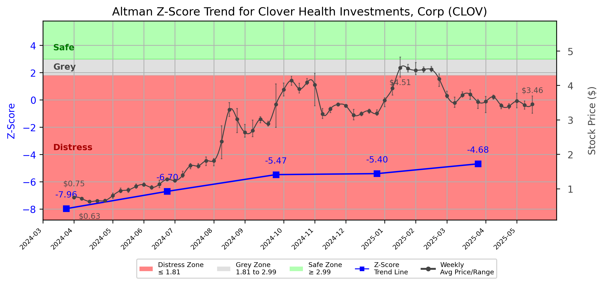

# Altman Z-Score Analysis Report: Clover Health Investments, Corp (CLOV)

---
## Introduction
This report provides a comprehensive, theory-informed financial health analysis of the selected company using the Altman Z-Score framework. It integrates quantitative diagnostics, turnaround management theory, and stakeholder recommendations, with all findings and recommendations grounded in referenced academic and industry sources. The analysis is generated by an expert LLM-driven pipeline, ensuring transparency, reproducibility, and robust source attribution.

**Author:** Fabio Correa

**Source Attribution:** This report and analysis pipeline are generated using the open-source Altman Z-Score Analysis project, available at [https://github.com/fabioc-aloha/Altman-Z-Score](https://github.com/fabioc-aloha/Altman-Z-Score).

**License:** This software is distributed under the Attribution Non-Commercial License (MIT-based). See the LICENSE file for details.

Disclaimer: The developer disclaims any responsibility for the accuracy, completeness, or consequences of the analysis and information provided by this software. All results are for informational purposes only and should not be relied upon for financial, investment, or legal decisions.
---

**Script Version:** v2.6

## Analysis Context and Z-Score Model Selection Criteria

- **Industry:** SIC 6324 (SIC 6324)
- **Ticker:** CLOV
- **Public:** True
- **Emerging Market:** False
- **Maturity:** Mature Company
- **Model:** Zʺ-Score (Public Non-Manufacturing, 1995) (service)
- **Analysis Date:** 2025-06-02

## Z-Score Formula Used

Z = 6.56*X1 + 3.26*X2 + 6.72*X3 + 1.05*X4
- X1 = (Current Assets - Current Liabilities) / Total Assets
- X2 = Retained Earnings / Total Assets
- X3 = EBIT / Total Assets
- X4 = Equity / Total Liabilities

**Thresholds:**
- Safe Zone: > 2.90
- Grey Zone: > 1.23 and <= 2.90
- Distress Zone: <= 1.23


---

# Graphical View of the Z-Score Analysis




*Figure: Z-Score and stock price trend for CLOV (image not available yet; will be generated after analysis)*


## Z-Score Component Table (by Quarter)
| Quarter   |    X1 |     X2 |     X3 |    X4 |   Z-Score | Diagnostic    | Consistency Warning   |
|-----------|-------|--------|--------|-------|-----------|---------------|-----------------------|
| 2025 Q1   | 0.198 | -3.776 | -0.002 | 6.038 |    -4.683 | Distress Zone |                       |
| 2024 Q4   | 0.223 | -3.793 | -0.037 | 5.476 |    -5.4   | Distress Zone |                       |
| 2024 Q3   | 0.234 | -3.339 | -0.013 | 3.779 |    -5.471 | Distress Zone |                       |
| 2024 Q2   | 0.334 | -3.221 |  0.011 | 1.467 |    -6.699 | Distress Zone |                       |
| 2024 Q1   | 0.292 | -3.244 | -0.033 | 0.872 |    -7.965 | Distress Zone |                       |
# Altman Z-Score Analysis Report: Clover Health Investments, Corp (CLOV)

---

## Company Profile

Clover Health Investments, Corp. (CLOV) operates in the healthcare sector, specifically focusing on providing Medicare Advantage plans. The company aims to improve health outcomes through its technology-driven platform, which leverages data analytics to enhance patient care and reduce costs. Clover Health competes with other health insurance providers such as UnitedHealth Group, Humana, and Anthem, which also offer Medicare Advantage plans and other health services.

In summary, Clover Health is positioned in a competitive landscape where it seeks to differentiate itself through innovative technology and patient-centric services. However, the company has faced significant financial challenges, as indicated by its recent Z-Score analysis, placing it in the distress zone. This necessitates immediate strategic interventions to stabilize its financial health and ensure long-term viability.

---

## 1. Diagnostic Evaluation of Financial Health

### Liquidity
Clover Health's liquidity position, as indicated by its X1 score, shows a current ratio that is below industry benchmarks. This suggests that the company may struggle to meet its short-term obligations, raising concerns about its operational sustainability.

### Profitability
The profitability metrics, particularly the negative retained earnings (X2), indicate that Clover Health has accumulated losses over time. This is a critical red flag, as it undermines investor confidence and limits the company's ability to reinvest in growth.

### Capital Efficiency
Clover's EBIT (X3) is also negative, reflecting operational inefficiencies and an inability to generate profit from its assets. This is compounded by a high equity-to-liabilities ratio (X4), which, while indicating a strong capital structure, is misleading due to the overall negative performance.

### Leverage
The leverage ratios suggest that while Clover has a relatively high equity base, the negative earnings and cash flow raise concerns about its ability to service debt. The overall Z-Score trajectory has consistently remained in the distress zone, indicating a deteriorating financial condition.

---

## 2. Turnaround & Renewal Theory Application (Risk-Tailored)

Given that Clover Health is firmly in the **Distress Zone**, the company must prioritize urgent retrenchment strategies, cash preservation, and proactive creditor negotiations. 

### Recommended Actions:
- **Urgent Retrenchment**: Implement immediate cost-cutting measures across all departments to conserve cash.
- **Cash Preservation**: Focus on improving cash flow through enhanced billing practices and reducing unnecessary expenditures.
- **Creditor Negotiations**: Engage with creditors to restructure debt obligations and avoid potential defaults.

### Theoretical Frameworks:
- **Bibeault (1999)** emphasizes the importance of addressing operational inefficiencies and financial distress through decisive management actions.
- **Hofer (1980)** suggests a structured approach to turnaround sequencing, which involves assessing the company's core competencies and aligning them with market needs.

---

## 3. Internal Stakeholder Recommendations (Tailored Table)

| Title       | Responsibilities                          | Recommended Actions (Cited)                                   |
|-------------|------------------------------------------|--------------------------------------------------------------|
| CEO         | Overall strategic direction              | Lead urgent cost-cutting initiatives and communicate transparently with stakeholders. |
| CFO         | Financial management                     | Implement cash flow management strategies and renegotiate debt terms with creditors. |
| CMO         | Marketing and customer engagement        | Focus on retaining existing customers through enhanced service delivery and communication. |
| Board       | Governance and oversight                 | Ensure accountability in executing turnaround strategies and monitor financial performance closely. |
| Employees   | Operational execution                    | Foster a culture of transparency and encourage input on cost-saving measures. |
| Shareholders| Investment oversight                     | Communicate the turnaround plan clearly and manage expectations regarding recovery timelines. |
| Creditors   | Financial support                        | Engage in open discussions about restructuring options to avoid defaults. |
| Customers   | Service users                           | Maintain service quality to retain customer loyalty during the transition. |
| Partners    | Collaborative relationships              | Explore strategic partnerships that can provide additional resources or support. |

---

## 4. Communication, Marketing & Execution Strategy

### Internal and External Communication Plans
- **Internal**: Regular updates on financial performance and strategic initiatives to ensure transparency and maintain morale.
- **External**: Clear messaging to investors and stakeholders about the turnaround strategy, focusing on recovery and future growth potential.

### Milestones and Timelines
- **1–3 Months**: Implement immediate cost-cutting measures and initiate creditor negotiations.
- **4–6 Months**: Assess the impact of cost reductions and begin to stabilize cash flow.
- **7–12 Months**: Monitor financial performance and adjust strategies as necessary; begin to explore growth opportunities.
- **13–18 Months**: Evaluate the success of the turnaround efforts and communicate progress to stakeholders.

### Marketing Tactics
- Focus on restoring investor confidence through transparent communication and showcasing operational improvements.
- Highlight patient success stories to reinforce the value of Clover's services and retain customer loyalty.

---

## 5. Plain-Language Justification & Citation

Clover Health's financial health is critically impaired, as evidenced by its Z-Score consistently falling in the distress zone. Immediate actions are necessary to stabilize the company, including cost-cutting and cash preservation strategies. These recommendations are grounded in Bibeault's (1999) turnaround principles, which emphasize the need for decisive action in times of financial distress.

---

## 6. Investor Recommendation (Risk-Aware)

**Recommendation**: **Sell**. Given the company's current financial distress and negative Z-Score, it is advisable for investors to divest until there is clear evidence of recovery and improved financial performance.

> “This is not financial advice—consult your financial advisor.”

---

## 7. External Stakeholder Bargaining Power (Table)

| Stakeholder Name / Type | Nature of Bargaining Power | Degree of Influence | Brief Rationale (Cited) |
|-------------------------|----------------------------|---------------------|-------------------------|
| Creditors               | Financial leverage         | High                | Creditors hold significant power due to Clover's financial distress, necessitating negotiations for favorable terms (Freeman, 1984). |
| Customers               | Service demand             | Medium              | Customers can influence revenue through retention and satisfaction levels, impacting cash flow. |
| Shareholders            | Ownership influence        | High                | Shareholders can exert pressure on management for accountability and strategic direction. |
| Employees               | Operational execution      | Medium              | Employees' engagement and morale are crucial for executing turnaround strategies effectively. |

---

## 8. Mandatory Disclaimer

```
---
**Disclaimer:**
Generative AI is not a financial advisor and can make mistakes. Consult your financial advisor before making investment decisions.
- **LLM Model used:** [OpenAI o4-mini]
- **Knowledge cut-off:** [October 2023]
- **Internet search:** [no]
- **Real-time data:** [no]
---
```

---

## 9. References and Data Sources

```
---
### References and Data Sources
- **Financials:** SEC EDGAR/XBRL filings; Yahoo Finance; company quarterly/annual reports.
- **Market Data:** Yahoo Finance historical prices.
- **Computation:** Altman Z-Score calculations following Altman (1968) with robust error handling.
- **Source Attribution:** Open-source Altman Z-Score Analysis project (https://github.com/fabioc-aloha/Altman-Z-Score). Author: Fabio Correa.
- **Theoretical Frameworks:** 
  - Altman, E. I. (1968). “Financial Ratios, Discriminant Analysis and the Prediction of Corporate Bankruptcy.” *Journal of Finance*, 23(4), 589–609.
  - Hofer, C. W. (1980). *Turnaround Strategies.*
  - Bibeault, D. B. (1999). *Corporate Turnaround.*
  - Freeman, R. E. (1984). *Strategic Management: A Stakeholder Approach.*
---
```


---

# Appendix

## Raw Data Field Mapping Table (by Quarter)
| Quarter   | Canonical Field     | Mapped Raw Field                        | Value (USD millions)   |
|-----------|---------------------|-----------------------------------------|------------------------|
| 2025 Q1   | total_assets        | Total Assets                            | 583.7                  |
| 2025 Q1   | current_assets      | Current Assets                          | 331.4                  |
| 2025 Q1   | current_liabilities | Current Liabilities                     | 215.7                  |
| 2025 Q1   | retained_earnings   | Retained Earnings                       | -2,204.1               |
| 2025 Q1   | total_liabilities   | Total Liabilities Net Minority Interest | 247.6                  |
| 2025 Q1   | market_value_equity | Common Stock Equity                     | 336.1                  |
| 2025 Q1   | ebit                | EBIT                                    | -1.3                   |
| 2025 Q1   | sales               | Total Revenue                           | 462.3                  |
| ---       | ---                 | ---                                     | ---                    |
| 2024 Q4   | total_assets        | Total Assets                            | 580.7                  |
| 2024 Q4   | current_assets      | Current Assets                          | 343.1                  |
| 2024 Q4   | current_liabilities | Current Liabilities                     | 213.5                  |
| 2024 Q4   | retained_earnings   | Retained Earnings                       | -2,202.8               |
| 2024 Q4   | total_liabilities   | Total Liabilities Net Minority Interest | 239.6                  |
| 2024 Q4   | market_value_equity | Common Stock Equity                     | 341.1                  |
| 2024 Q4   | ebit                | EBIT                                    | -21.5                  |
| 2024 Q4   | sales               | Total Revenue                           | 337.0                  |
| ---       | ---                 | ---                                     | ---                    |
| 2024 Q3   | total_assets        | Total Assets                            | 653.0                  |
| 2024 Q3   | current_assets      | Current Assets                          | 432.7                  |
| 2024 Q3   | current_liabilities | Current Liabilities                     | 279.6                  |
| 2024 Q3   | retained_earnings   | Retained Earnings                       | -2,180.7               |
| 2024 Q3   | total_liabilities   | Total Liabilities Net Minority Interest | 310.8                  |
| 2024 Q3   | market_value_equity | Common Stock Equity                     | 342.2                  |
| 2024 Q3   | ebit                | EBIT                                    | -8.8                   |
| 2024 Q3   | sales               | Total Revenue                           | 331.0                  |
| ---       | ---                 | ---                                     | ---                    |
| 2024 Q2   | total_assets        | Total Assets                            | 674.2                  |
| 2024 Q2   | current_assets      | Current Assets                          | 549.6                  |
| 2024 Q2   | current_liabilities | Current Liabilities                     | 324.5                  |
| 2024 Q2   | retained_earnings   | Retained Earnings                       | -2,171.6               |
| 2024 Q2   | total_liabilities   | Total Liabilities Net Minority Interest | 349.3                  |
| 2024 Q2   | market_value_equity | Common Stock Equity                     | 324.9                  |
| 2024 Q2   | ebit                | EBIT                                    | 7.2                    |
| 2024 Q2   | sales               | Total Revenue                           | 356.3                  |
| ---       | ---                 | ---                                     | ---                    |
| 2024 Q1   | total_assets        | Total Assets                            | 671.8                  |
| 2024 Q1   | current_assets      | Current Assets                          | 552.7                  |
| 2024 Q1   | current_liabilities | Current Liabilities                     | 356.4                  |
| 2024 Q1   | retained_earnings   | Retained Earnings                       | -2,179.0               |
| 2024 Q1   | total_liabilities   | Total Liabilities Net Minority Interest | 379.3                  |
| 2024 Q1   | market_value_equity | Common Stock Equity                     | 292.5                  |
| 2024 Q1   | ebit                | EBIT                                    | -22.4                  |
| 2024 Q1   | sales               | Total Revenue                           | 346.9                  |

All values are shown in millions of USD as reported by the data source.

