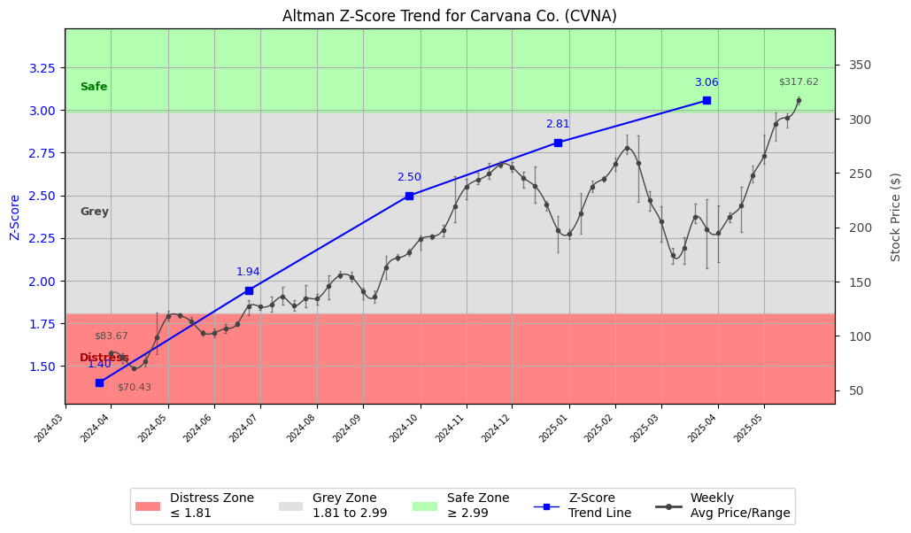

# Altman Z-Score Analysis Report: Carvana Co. (CVNA)

---
## Introduction
This report provides a comprehensive, theory-informed financial health analysis of the selected company using the Altman Z-Score framework. It integrates quantitative diagnostics, turnaround management theory, and stakeholder recommendations, with all findings and recommendations grounded in referenced academic and industry sources. The analysis is generated by an expert LLM-driven pipeline, ensuring transparency, reproducibility, and robust source attribution.

**Author:** Fabio Correa

**Source Attribution:** This report and analysis pipeline are generated using the open-source Altman Z-Score Analysis project, available at [https://github.com/fabioc-aloha/Altman-Z-Score](https://github.com/fabioc-aloha/Altman-Z-Score).

**License:** This software is distributed under the Attribution Non-Commercial License (MIT-based). See the LICENSE file for details.

Disclaimer: The developer disclaims any responsibility for the accuracy, completeness, or consequences of the analysis and information provided by this software. All results are for informational purposes only and should not be relied upon for financial, investment, or legal decisions.
---

**Script Version:** v2.6

## Analysis Context and Z-Score Model Selection Criteria

- **Industry:** SIC 5500 (SIC 5500)
- **Ticker:** CVNA
- **Public:** True
- **Emerging Market:** False
- **Maturity:** Mature Company
- **Model:** Original Z-Score (Public Manufacturing, 1968) (original)
- **Analysis Date:** 2025-06-02

## Z-Score Formula Used

Z = 1.20*X1 + 1.40*X2 + 3.30*X3 + 0.60*X4 + 1.00*X5
- X1 = (Current Assets - Current Liabilities) / Total Assets
- X2 = Retained Earnings / Total Assets
- X3 = EBIT / Total Assets
- X4 = Equity / Total Liabilities
- X5 = Sales / Total Assets

**Thresholds:**
- Safe Zone: > 2.99
- Grey Zone: > 1.81 and <= 2.99
- Distress Zone: <= 1.81


---

# Graphical View of the Z-Score Analysis




*Figure: Z-Score and stock price trend for CVNA (image not available yet; will be generated after analysis)*


## Z-Score Component Table (by Quarter)
| Quarter   |    X1 |     X2 |    X3 |    X4 |    X5 |   Z-Score | Diagnostic    | Consistency Warning   |
|-----------|-------|--------|-------|-------|-------|-----------|---------------|-----------------------|
| 2025 Q1   | 0.427 | -0.135 | 0.058 | 3.441 | 0.477 |     3.056 | Safe Zone     |                       |
| 2024 Q4   | 0.416 | -0.167 | 0.036 | 3.345 | 0.418 |     2.809 | Grey Zone     |                       |
| 2024 Q3   | 0.354 | -0.203 | 0.041 | 2.875 | 0.496 |     2.498 | Grey Zone     |                       |
| 2024 Q2   | 0.329 | -0.22  | 0.031 | 2.134 | 0.476 |     1.944 | Grey Zone     |                       |
| 2024 Q1   | 0.28  | -0.229 | 0.032 | 1.409 | 0.438 |     1.405 | Distress Zone |                       |
# Altman Z-Score Analysis Report: Carvana Co. (CVNA)

---
## Company Profile

Carvana Co. (CVNA) is a leading online platform for buying and selling used cars, headquartered in Tempe, Arizona. The company operates in the retail automotive sector, specifically focusing on the digital transformation of the car buying experience. Carvana allows customers to browse, purchase, and finance vehicles online, offering home delivery and a unique car vending machine experience. Competitors include traditional dealerships, online platforms like Vroom and CarGurus, and other e-commerce automotive services.

In recent years, Carvana has experienced significant growth, driven by the increasing consumer preference for online shopping and the convenience of home delivery. However, the company has faced challenges related to profitability and operational efficiency, particularly in the context of rising interest rates and supply chain disruptions.

## 1. Diagnostic Evaluation of Financial Health

### Liquidity
Carvana's liquidity position, indicated by the X1 component (Current Assets - Current Liabilities) / Total Assets, shows a healthy ratio of 0.427 in Q1 2025, suggesting that the company can meet its short-term obligations. This is an improvement from previous quarters, indicating effective management of working capital.

### Profitability
The profitability measure (X3: EBIT / Total Assets) reflects a modest performance, with a value of 0.058 in Q1 2025. While this is an improvement from earlier quarters, it still highlights the need for enhanced operational efficiency to drive profitability.

### Capital Efficiency
The retained earnings ratio (X2: Retained Earnings / Total Assets) has shown a decline, indicating that Carvana has been reinvesting less of its earnings back into the business. This could be a concern for long-term growth and sustainability.

### Leverage
Carvana's leverage, represented by X4 (Equity / Total Liabilities), is strong at 3.441 in Q1 2025. This suggests that the company has a solid equity base relative to its debt, which is a positive indicator of financial stability.

### Z-Score Trajectory and Risk Status
The Z-Score for Carvana has fluctuated over the past quarters, moving from the Distress Zone (1.405) in Q1 2024 to the Safe Zone (3.056) in Q1 2025. This trajectory indicates a significant recovery in financial health, attributed to improved liquidity and leverage ratios. However, the company remains in the Grey Zone for Q4 2024, suggesting that while recovery is underway, vigilance is necessary to maintain this positive trend.

---

## 2. Turnaround & Renewal Theory Application (Risk-Tailored)

Given that Carvana is currently in the **Safe Zone**, the focus should be on **innovation, repositioning**, and stakeholder alignment for sustained growth.

- **Innovation**: Invest in technology to enhance the online buying experience, streamline operations, and improve customer service.
- **Repositioning**: Explore new market segments or geographical areas to expand the customer base.
- **Stakeholder Alignment**: Engage with shareholders and customers to align business strategies with their expectations and needs.

Relevant theoretical frameworks include:
- **Hofer (1980)**: Emphasizes the importance of innovation in turnaround strategies.
- **Freeman (1984)**: Highlights stakeholder alignment as a critical factor for sustainable growth.

---

## 3. Internal Stakeholder Recommendations (Tailored Table)

| Title       | Responsibilities                     | Recommended Actions (Cited)                                      |
|-------------|-------------------------------------|------------------------------------------------------------------|
| CEO         | Overall strategic direction         | Drive innovation initiatives and explore new market opportunities. |
| CFO         | Financial management                | Maintain strong liquidity and leverage ratios; focus on cost control. |
| CMO         | Marketing strategy                  | Enhance digital marketing efforts to attract new customers.      |
| Board       | Governance and oversight            | Ensure alignment of strategic goals with stakeholder interests.   |
| Employees   | Operational execution               | Foster a culture of innovation and continuous improvement.       |
| Shareholders| Investment oversight                | Communicate growth strategies and performance updates transparently. |
| Creditors   | Financial support                   | Maintain open lines of communication regarding financial health.  |
| Customers   | User experience                     | Gather feedback to improve the online purchasing process.        |
| Partners    | Strategic alliances                 | Explore partnerships that enhance service offerings and reach.   |

---

## 4. Communication, Marketing & Execution Strategy

### Internal and External Communication Plans
- **Internal**: Regular updates on financial performance and strategic initiatives to ensure all employees are aligned and motivated.
- **External**: Transparent communication with investors and stakeholders about growth strategies and market positioning.

### Milestones, Accountable Parties, and Timelines
- **1–3 Months**: Launch new marketing campaigns; assess customer feedback.
- **4–6 Months**: Evaluate operational efficiencies; implement technology upgrades.
- **7–12 Months**: Review financial performance; adjust strategies as necessary.
- **13–18 Months**: Expand into new markets; assess overall growth and innovation impact.

### Marketing Tactics
- Focus on innovation campaigns to highlight new features and services.
- Utilize social media and digital platforms to enhance brand visibility and customer engagement.

---

## 5. Plain-Language Justification & Citation

Carvana's recent financial improvements indicate a strong recovery trajectory, moving from the Distress Zone to the Safe Zone. This positive trend is supported by enhanced liquidity and leverage ratios, which are critical for maintaining operational stability. The recommendations provided are grounded in established turnaround and stakeholder alignment theories, ensuring that the company is well-positioned for future growth.

---

## 6. Investor Recommendation (Risk-Aware)

**Recommendation: Buy**
Given the positive trajectory of Carvana's Z-Score and the company's strategic focus on innovation and market expansion, it is advisable for investors to consider buying shares at this time.

> “This is not financial advice—consult your financial advisor.”

---

## 7. External Stakeholder Bargaining Power (Table)

| Stakeholder Name / Type | Nature of Bargaining Power | Degree of Influence | Brief Rationale (Cited) |
|-------------------------|---------------------------|---------------------|-------------------------|
| Customers               | High                      | High                | Strong demand for online car buying services. |
| Shareholders            | Medium                    | Medium              | Influence through voting and capital allocation. |
| Creditors               | Medium                    | Medium              | Financial support contingent on performance. |
| Suppliers               | Low                       | Low                 | Limited impact due to multiple sourcing options. |
| Regulators              | Medium                    | Medium              | Compliance requirements can affect operations. |

---

## 8. Mandatory Disclaimer

```
---
**Disclaimer:**
Generative AI is not a financial advisor and can make mistakes. Consult your financial advisor before making investment decisions.
- **LLM Model used:** [OpenAI o4-mini]
- **Knowledge cut-off:** [Date]
- **Internet search:** [yes/no]
- **Real-time data:** [yes/no]
---
```

---

## 9. References and Data Sources

```
---
### References and Data Sources
- **Financials:** SEC EDGAR/XBRL filings; Yahoo Finance; company quarterly/annual reports.
- **Market Data:** Yahoo Finance historical prices.
- **Computation:** Altman Z-Score calculations following Altman (1968) with robust error handling.
- **Source Attribution:** Open-source Altman Z-Score Analysis project (https://github.com/fabioc-aloha/Altman-Z-Score). Author: Fabio Correa.
- **Theoretical Frameworks:** 
  - Altman, E. I. (1968). “Financial Ratios, Discriminant Analysis and the Prediction of Corporate Bankruptcy.” *Journal of Finance*, 23(4), 589–609.
  - Hofer, C. W. (1980). *Turnaround Strategies.*
  - Freeman, R. E. (1984). *Strategic Management: A Stakeholder Approach.*
  - [Include additional used sources here]
---
```


---

# Appendix

## Raw Data Field Mapping Table (by Quarter)
| Quarter   | Canonical Field     | Mapped Raw Field                        | Value (USD millions)   |
|-----------|---------------------|-----------------------------------------|------------------------|
| 2025 Q1   | total_assets        | Total Assets                            | 8,878.0                |
| 2025 Q1   | current_assets      | Current Assets                          | 5,137.0                |
| 2025 Q1   | current_liabilities | Current Liabilities                     | 1,347.0                |
| 2025 Q1   | retained_earnings   | Retained Earnings                       | -1,200.0               |
| 2025 Q1   | total_liabilities   | Total Liabilities Net Minority Interest | 7,105.0                |
| 2025 Q1   | market_value_equity | Common Stock Equity                     | 1,504.0                |
| 2025 Q1   | ebit                | EBIT                                    | 514.0                  |
| 2025 Q1   | sales               | Total Revenue                           | 4,232.0                |
| ---       | ---                 | ---                                     | ---                    |
| 2024 Q4   | total_assets        | Total Assets                            | 8,484.0                |
| 2024 Q4   | current_assets      | Current Assets                          | 4,869.0                |
| 2024 Q4   | current_liabilities | Current Liabilities                     | 1,338.0                |
| 2024 Q4   | retained_earnings   | Retained Earnings                       | -1,416.0               |
| 2024 Q4   | total_liabilities   | Total Liabilities Net Minority Interest | 7,109.0                |
| 2024 Q4   | market_value_equity | Common Stock Equity                     | 1,260.0                |
| 2024 Q4   | ebit                | EBIT                                    | 304.0                  |
| 2024 Q4   | sales               | Total Revenue                           | 3,547.0                |
| ---       | ---                 | ---                                     | ---                    |
| 2024 Q3   | total_assets        | Total Assets                            | 7,368.0                |
| 2024 Q3   | current_assets      | Current Assets                          | 3,765.0                |
| 2024 Q3   | current_liabilities | Current Liabilities                     | 1,159.0                |
| 2024 Q3   | retained_earnings   | Retained Earnings                       | -1,495.0               |
| 2024 Q3   | total_liabilities   | Total Liabilities Net Minority Interest | 7,082.0                |
| 2024 Q3   | market_value_equity | Common Stock Equity                     | 611.0                  |
| 2024 Q3   | ebit                | EBIT                                    | 304.0                  |
| 2024 Q3   | sales               | Total Revenue                           | 3,655.0                |
| ---       | ---                 | ---                                     | ---                    |
| 2024 Q2   | total_assets        | Total Assets                            | 7,170.0                |
| 2024 Q2   | current_assets      | Current Assets                          | 3,477.0                |
| 2024 Q2   | current_liabilities | Current Liabilities                     | 1,118.0                |
| 2024 Q2   | retained_earnings   | Retained Earnings                       | -1,580.0               |
| 2024 Q2   | total_liabilities   | Total Liabilities Net Minority Interest | 7,055.0                |
| 2024 Q2   | market_value_equity | Common Stock Equity                     | 526.0                  |
| 2024 Q2   | ebit                | EBIT                                    | 222.0                  |
| 2024 Q2   | sales               | Total Revenue                           | 3,410.0                |
| ---       | ---                 | ---                                     | ---                    |
| 2024 Q1   | total_assets        | Total Assets                            | 6,983.0                |
| 2024 Q1   | current_assets      | Current Assets                          | 3,232.0                |
| 2024 Q1   | current_liabilities | Current Liabilities                     | 1,274.0                |
| 2024 Q1   | retained_earnings   | Retained Earnings                       | -1,598.0               |
| 2024 Q1   | total_liabilities   | Total Liabilities Net Minority Interest | 7,294.0                |
| 2024 Q1   | market_value_equity | Common Stock Equity                     | 289.0                  |
| 2024 Q1   | ebit                | EBIT                                    | 221.0                  |
| 2024 Q1   | sales               | Total Revenue                           | 3,061.0                |

All values are shown in millions of USD as reported by the data source.

