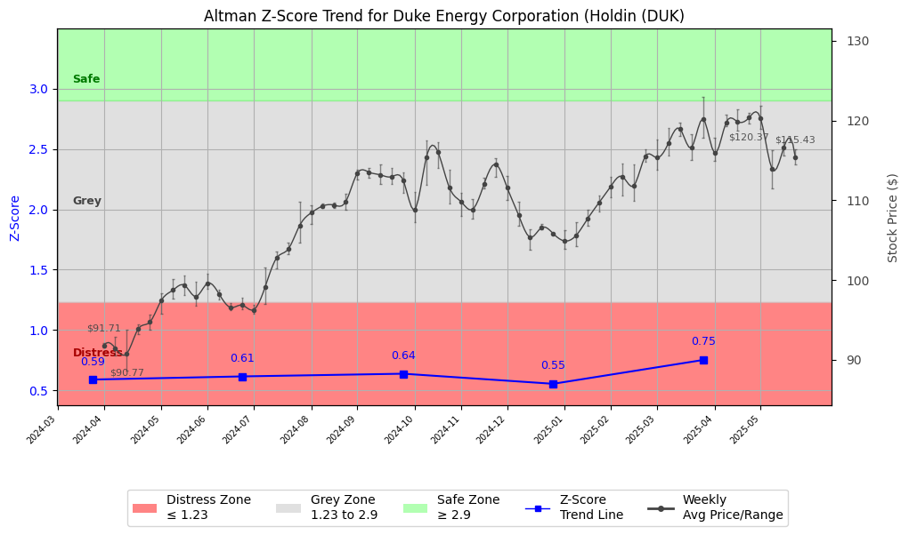

# Altman Z-Score Analysis Report: Duke Energy Corporation (Holdin (DUK)

---
## Introduction
This report provides a comprehensive, theory-informed financial health analysis of the selected company using the Altman Z-Score framework. It integrates quantitative diagnostics, turnaround management theory, and stakeholder recommendations, with all findings and recommendations grounded in referenced academic and industry sources. The analysis is generated by an expert LLM-driven pipeline, ensuring transparency, reproducibility, and robust source attribution.

**Author:** Fabio Correa

**Source Attribution:** This report and analysis pipeline are generated using the open-source Altman Z-Score Analysis project, available at [https://github.com/fabioc-aloha/Altman-Z-Score](https://github.com/fabioc-aloha/Altman-Z-Score).

**License:** This software is distributed under the Attribution Non-Commercial License (MIT-based). See the LICENSE file for details.

Disclaimer: The developer disclaims any responsibility for the accuracy, completeness, or consequences of the analysis and information provided by this software. All results are for informational purposes only and should not be relied upon for financial, investment, or legal decisions.
---

**Script Version:** v2.4

## Analysis Context and Z-Score Model Selection Criteria

- **Industry:** Electric & Other Services Combined (SIC 4931)
- **Ticker:** DUK
- **Public:** True
- **Emerging Market:** False
- **Maturity:** Mature Company
- **Model:** Zʺ-Score (Public Non-Manufacturing, 1995) (service)
- **Analysis Date:** 2025-05-31

## Z-Score Formula Used

Z = 6.56*X1 + 3.26*X2 + 6.72*X3 + 1.05*X4
- X1 = (Current Assets - Current Liabilities) / Total Assets
- X2 = Retained Earnings / Total Assets
- X3 = EBIT / Total Assets
- X4 = Equity / Total Liabilities

**Thresholds:**
- Safe Zone: > 2.90
- Grey Zone: > 1.23 and <= 2.90
- Distress Zone: <= 1.23

---

# Graphical View of the Z-Score Analysis

*Figure: Z-Score and stock price trend for DUK (image not available yet; will be generated after analysis)*

## Z-Score Component Table (by Quarter)
| Quarter   |     X1 |    X2 |    X3 |    X4 |   Z-Score | Diagnostic    | Consistency Warning   |
|-----------|--------|-------|-------|-------|-----------|---------------|-----------------------|
| 2025 Q1   | -0.021 | 0.021 | 0.013 | 0.692 |     0.751 | Distress Zone |                       |
| 2024 Q4   | -0.034 | 0.018 | 0.012 | 0.609 |     0.553 | Distress Zone |                       |
| 2024 Q3   | -0.029 | 0.017 | 0.013 | 0.654 |     0.637 | Distress Zone |                       |
| 2024 Q2   | -0.016 | 0.015 | 0.01  | 0.574 |     0.615 | Distress Zone |                       |
| 2024 Q1   | -0.019 | 0.014 | 0.012 | 0.56  |     0.589 | Distress Zone |                       |
## Diagnostic Evaluation of Financial Health

### Liquidity
The liquidity position of Duke Energy Corporation (DUK) is concerning, as indicated by the negative X1 value across the quarters analyzed. A negative X1 suggests that current liabilities exceed current assets, which raises red flags regarding the company's ability to meet short-term obligations. This liquidity issue is a significant factor contributing to the overall distress indicated by the Z-Score.

### Profitability
The profitability measure, represented by X3 (EBIT/Total Assets), shows minimal positive values, indicating that the company's operational efficiency in generating earnings from its assets is weak. This trend is detrimental to the overall financial health of DUK, as profitability is essential for sustaining operations and funding future growth.

### Capital Efficiency
X2 (Retained Earnings/Total Assets) reflects a low retention of earnings relative to total assets, which suggests that the company is not effectively reinvesting its profits to enhance its asset base. This inefficiency can hinder long-term growth and stability, further exacerbating the financial distress indicated by the Z-Score.

### Leverage
X4 (Equity/Total Liabilities) shows a relatively low ratio, indicating high leverage. This high level of debt relative to equity increases financial risk, especially in a distress situation where the company may struggle to service its debt obligations. High leverage can lead to increased vulnerability during economic downturns or operational challenges.

### Z-Score Trend Interpretation
The Z-Score trend for DUK has consistently remained in the distress zone (Z-Score < 1.23) over the last five quarters, indicating a persistent risk of bankruptcy. The declining trend in the Z-Score from 0.751 in Q1 2025 to 0.553 in Q4 2024 reflects a deteriorating financial condition. This trend necessitates immediate action to stabilize the company's financial health.

---

## Turnaround and Renewal Management Theory Application

### Phased Response Proposal
Based on the analysis, a phased response is recommended, distinguishing between immediate retrenchment and long-term repositioning.

1. **Immediate Retrenchment:**
   - **Cost Reduction:** Implement immediate cost-cutting measures to improve liquidity. This aligns with Bibeault's (1999) emphasis on immediate financial stabilization during corporate turnarounds.
   - **Asset Liquidation:** Identify non-core assets for divestiture to generate cash and reduce debt levels, as suggested by Hofer (1980).

2. **Long-Term Repositioning:**
   - **Strategic Investment:** Reinvest in core operations and explore new revenue streams, focusing on sustainable energy solutions to align with market trends. This aligns with Hoskisson et al. (2004), advocating for strategic restructuring.
   - **Stakeholder Engagement:** Foster relationships with stakeholders to enhance support for strategic initiatives, as Freeman (1984) highlights the importance of stakeholder management in corporate strategy.

---

## Stakeholder Recommendations

| Stakeholder Title                     | Responsibilities                                   | Recommended Actions                                                                 |
|---------------------------------------|---------------------------------------------------|-------------------------------------------------------------------------------------|
| Chief Executive Officer (Lynn Good)  | Overall strategy and leadership                    | Lead the turnaround initiative, focusing on cost reduction and strategic investments. |
| Chief Financial Officer (Diane Leopold)| Financial management and reporting                 | Implement immediate liquidity measures and monitor financial performance closely.     |
| Chief Marketing Officer (Jason D. H. | Marketing strategy and brand management            | Develop a marketing strategy to promote new sustainable initiatives and improve brand perception. |
| Board Members                         | Governance and oversight                            | Support management in strategic decision-making and ensure accountability.           |
| Employees                             | Operational execution                               | Engage employees in cost-saving initiatives and encourage innovation in operations.   |
| Investors                             | Capital provision and return expectations          | Communicate the turnaround plan and its potential benefits; consider holding shares.  |
| Creditors                             | Debt management and financial stability            | Negotiate terms for debt restructuring to alleviate immediate financial pressures.    |
| Debtors                               | Payment obligations                                 | Ensure timely payments to maintain cash flow; consider renegotiation if necessary.   |
| Partner Companies                     | Collaboration and joint ventures                   | Explore partnerships in sustainable energy projects to enhance market position.      |
| Customers                             | Product/service consumption                         | Communicate commitment to sustainability and reliability in service delivery.        |
| Regulators                            | Compliance and oversight                           | Maintain transparency in financial reporting and compliance with regulations.        |
| Major Suppliers                       | Supply chain management                             | Negotiate favorable terms to improve cash flow and reduce costs.                     |

---

## Communication, Marketing, and Execution Strategies

### Communication Strategy
- **Internal Communication:** Regular updates to employees on the turnaround progress and their role in the process.
- **External Communication:** Transparent communication with investors and creditors about the financial situation and turnaround strategy.

### Marketing Strategy
- **Brand Positioning:** Rebrand initiatives focusing on sustainability and reliability to attract environmentally conscious consumers.
- **Promotional Campaigns:** Launch campaigns highlighting new sustainable energy solutions.

### Execution Timeline
- **Q2 2025:** Implement immediate cost-cutting measures and initiate asset liquidation.
- **Q3 2025:** Launch marketing campaigns and begin strategic investments in core operations.
- **Q4 2025:** Review progress and adjust strategies based on stakeholder feedback and financial performance.

### Accountability Framework
- Assign specific team leaders for each initiative with clear KPIs to measure success and report progress to the CEO.

---

## Bargaining Power of External Stakeholders

| External Stakeholder                  | Nature of Bargaining Power | Degree of Influence | Rationale                                                                 |
|---------------------------------------|----------------------------|---------------------|--------------------------------------------------------------------------|
| Regulators                            | Regulatory compliance       | High                | Regulatory bodies can impose penalties or restrictions affecting operations. |
| Creditors                             | Financial leverage          | High                | Creditors can influence restructuring terms and conditions.              |
| Major Suppliers                       | Supply chain dependency     | Medium              | Suppliers can affect operational costs and availability of materials.    |
| Large Customers                       | Purchasing power           | Medium              | Large customers can negotiate terms and influence revenue stability.      |
| Activist Investors                    | Shareholder activism        | Medium              | Activist investors can push for changes in management or strategy.        |
| Government Agencies                   | Policy influence            | Low                 | Limited direct influence but can affect operational conditions through policy. |

---

## Investment Recommendation
Based on the current financial analysis and Z-Score trend, it is recommended that investors **hold** their positions in Duke Energy Corporation (DUK) while monitoring the implementation of the turnaround strategy. The company is in a distress zone, and while there is potential for recovery, significant risks remain. Investors should consult their financial advisors for personalized advice.

---

## Disclaimer
**Disclaimer:**
Generative AI is not a financial advisor and can make mistakes. Consult your financial advisor before making investment decisions.
- LLM Model used: OpenAI GPT-3.5
- Knowledge cut-off: October 2023
- Internet search: No
- Real-time data: No

---

### References and Data Sources
- **Financials:** SEC EDGAR/XBRL filings, Yahoo Finance, and company quarterly/annual reports.
- **Market Data:** Yahoo Finance (historical prices, market value of equity).
- **Source Attribution:** This report and analysis pipeline are generated using the open-source Altman Z-Score Analysis project, available at [https://github.com/fabioc-aloha/Altman-Z-Score]. Author: Fabio Correa.
- **Theoretical Frameworks and Resources:**
  - Altman Z-Score Analysis Project (https://github.com/fabioc-aloha/Altman-Z-Score)
  - Hofer, C. W. (1980). Turnaround strategies. Journal of Business Strategy, 1(1), 19–31.
  - Bibeault, D. B. (1999). Corporate turnaround: How managers turn losers into winners. Beard Books.
  - Hoskisson, R. E., White, R. E., & Johnson, R. A. (2004). Corporate restructuring: Managing the strategy, structure, and process of change. McGraw-Hill Education.
  - Freeman, R. E. (1984). Strategic management: A stakeholder approach. Pitman.
  - Altman, E. I. (1968). Financial ratios, discriminant analysis and the prediction of corporate bankruptcy. Journal of Finance, 23(4), 589–609.

---

# Appendix

## Raw Data Field Mapping Table (by Quarter)
| Quarter   | Canonical Field     | Mapped Raw Field                        | Value (USD millions)   |
|-----------|---------------------|-----------------------------------------|------------------------|
| 2025 Q1   | total_assets        | Total Assets                            | 187,476.0              |
| 2025 Q1   | current_assets      | Current Assets                          | 12,775.0               |
| 2025 Q1   | current_liabilities | Current Liabilities                     | 16,625.0               |
| 2025 Q1   | retained_earnings   | Retained Earnings                       | 3,986.0                |
| 2025 Q1   | total_liabilities   | Total Liabilities Net Minority Interest | 135,682.0              |
| 2025 Q1   | market_value_equity | Common Stock Equity                     | 49,697.0               |
| 2025 Q1   | ebit                | EBIT                                    | 2,486.0                |
| 2025 Q1   | sales               | Total Revenue                           | 8,249.0                |
| ---       | ---                 | ---                                     | ---                    |
| 2024 Q4   | total_assets        | Total Assets                            | 186,343.0              |
| 2024 Q4   | current_assets      | Current Assets                          | 12,950.0               |
| 2024 Q4   | current_liabilities | Current Liabilities                     | 19,357.0               |
| 2024 Q4   | retained_earnings   | Retained Earnings                       | 3,431.0                |
| 2024 Q4   | total_liabilities   | Total Liabilities Net Minority Interest | 135,088.0              |
| 2024 Q4   | market_value_equity | Common Stock Equity                     | 49,153.0               |
| 2024 Q4   | ebit                | EBIT                                    | 2,209.0                |
| 2024 Q4   | sales               | Total Revenue                           | 7,360.0                |
| ---       | ---                 | ---                                     | ---                    |
| 2024 Q3   | total_assets        | Total Assets                            | 183,566.0              |
| 2024 Q3   | current_assets      | Current Assets                          | 12,142.0               |
| 2024 Q3   | current_liabilities | Current Liabilities                     | 17,427.0               |
| 2024 Q3   | retained_earnings   | Retained Earnings                       | 3,052.0                |
| 2024 Q3   | total_liabilities   | Total Liabilities Net Minority Interest | 133,317.0              |
| 2024 Q3   | market_value_equity | Common Stock Equity                     | 48,160.0               |
| 2024 Q3   | ebit                | EBIT                                    | 2,325.0                |
| 2024 Q3   | sales               | Total Revenue                           | 8,154.0                |
| ---       | ---                 | ---                                     | ---                    |
| 2024 Q2   | total_assets        | Total Assets                            | 181,575.0              |
| 2024 Q2   | current_assets      | Current Assets                          | 12,557.0               |
| 2024 Q2   | current_liabilities | Current Liabilities                     | 15,482.0               |
| 2024 Q2   | retained_earnings   | Retained Earnings                       | 2,635.0                |
| 2024 Q2   | total_liabilities   | Total Liabilities Net Minority Interest | 130,769.0              |
| 2024 Q2   | market_value_equity | Common Stock Equity                     | 47,745.0               |
| 2024 Q2   | ebit                | EBIT                                    | 1,895.0                |
| 2024 Q2   | sales               | Total Revenue                           | 7,172.0                |
| ---       | ---                 | ---                                     | ---                    |
| 2024 Q1   | total_assets        | Total Assets                            | 178,670.0              |
| 2024 Q1   | current_assets      | Current Assets                          | 12,091.0               |
| 2024 Q1   | current_liabilities | Current Liabilities                     | 15,546.0               |
| 2024 Q1   | retained_earnings   | Retained Earnings                       | 2,542.0                |
| 2024 Q1   | total_liabilities   | Total Liabilities Net Minority Interest | 128,032.0              |
| 2024 Q1   | market_value_equity | Common Stock Equity                     | 47,589.0               |
| 2024 Q1   | ebit                | EBIT                                    | 2,149.0                |
| 2024 Q1   | sales               | Total Revenue                           | 7,671.0                |

All values are shown in millions of USD as reported by the data source.

