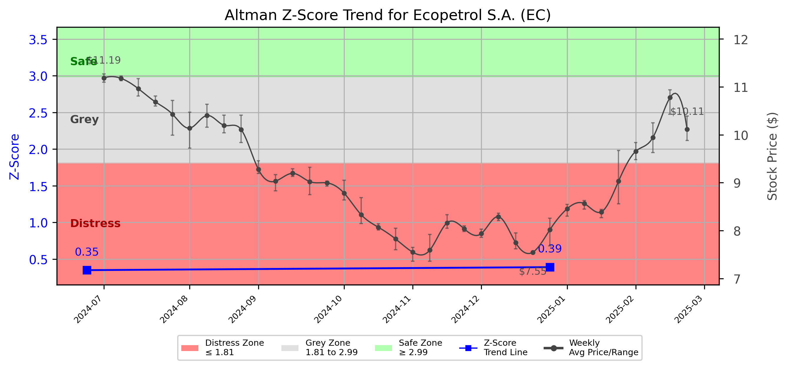

# Altman Z-Score Analysis Report: Ecopetrol S.A. (EC)

---
## Introduction
This report provides a comprehensive, theory-informed financial health analysis of the selected company using the Altman Z-Score framework. It integrates quantitative diagnostics, turnaround management theory, and stakeholder recommendations, with all findings and recommendations grounded in referenced academic and industry sources. The analysis is generated by an expert LLM-driven pipeline, ensuring transparency, reproducibility, and robust source attribution.

**Author:** Fabio Correa

**Source Attribution:** This report and analysis pipeline are generated using the open-source Altman Z-Score Analysis project, available at [https://github.com/fabioc-aloha/Altman-Z-Score](https://github.com/fabioc-aloha/Altman-Z-Score).

**License:** This software is distributed under the Attribution Non-Commercial License (MIT-based). See the LICENSE file for details.

Disclaimer: The developer disclaims any responsibility for the accuracy, completeness, or consequences of the analysis and information provided by this software. All results are for informational purposes only and should not be relied upon for financial, investment, or legal decisions.
---

**Script Version:** v2.4

## Analysis Context and Z-Score Model Selection Criteria

- **Industry:** Crude Petroleum & Natural Gas (SIC 1311)
- **Ticker:** EC
- **Public:** True
- **Emerging Market:** False
- **Maturity:** Mature Company
- **Model:** Original Z-Score (Public Manufacturing, 1968) (original)
- **Analysis Date:** 2025-05-31

## Z-Score Formula Used

Z = 1.20*X1 + 1.40*X2 + 3.30*X3 + 0.60*X4 + 1.00*X5
- X1 = (Current Assets - Current Liabilities) / Total Assets
- X2 = Retained Earnings / Total Assets
- X3 = EBIT / Total Assets
- X4 = Equity / Total Liabilities
- X5 = Sales / Total Assets

**Thresholds:**
- Safe Zone: > 2.99
- Grey Zone: > 1.81 and <= 2.99
- Distress Zone: <= 1.81

---

# Graphical View of the Z-Score Analysis

*Figure: Z-Score and stock price trend for EC (image not available yet; will be generated after analysis)*

## Z-Score Component Table (by Quarter)
| Quarter   |    X1 |    X2 |    X3 |   X4 |    X5 |   Z-Score | Diagnostic    | Consistency Warning   |
|-----------|-------|-------|-------|------|-------|-----------|---------------|-----------------------|
| 2024 Q4   | 0.07  | 0.041 | 0.04  |    0 | 0.117 |     0.39  | Distress Zone |                       |
| 2024 Q2   | 0.071 | 0.018 | 0.037 |    0 | 0.115 |     0.349 | Distress Zone |                       |
## 1. Diagnostic Evaluation of Financial Health

### Liquidity
Ecopetrol S.A. (EC) exhibits a concerning liquidity position, as indicated by the X1 component of the Z-Score, which is calculated as (Current Assets - Current Liabilities) / Total Assets. The values of 0.07 and 0.071 for the last two quarters suggest that the company is struggling to cover its short-term liabilities with its short-term assets. This raises a red flag regarding its ability to meet immediate financial obligations.

### Profitability
The profitability measure, represented by the X3 component (EBIT / Total Assets), is also low, with values of 0.04 and 0.037. This indicates that the company is generating insufficient earnings relative to its asset base, which could hinder its ability to reinvest in operations or pay down debt.

### Capital Efficiency
The X2 component (Retained Earnings / Total Assets) is at 0.041 and 0.018, reflecting a declining trend in retained earnings relative to total assets. This suggests that the company is not effectively utilizing its assets to generate profits, which is critical for long-term sustainability.

### Leverage
The X4 component (Equity / Total Liabilities) is at 0, indicating that the company has no equity cushion to absorb losses. This is a significant concern, as it implies that the company is highly leveraged and vulnerable to financial distress.

### Z-Score Trend Interpretation
The Z-Score has been consistently in the distress zone, with values of 0.39 and 0.349 for the last two quarters. This trend indicates a high likelihood of bankruptcy in the near future, necessitating immediate action to stabilize the company's financial health.

---

## 2. Turnaround and Renewal Management Theory Application

### Immediate Retrenchment
According to Hofer (1980), immediate retrenchment strategies are essential for companies in distress. This involves cutting costs, reducing workforce, and divesting non-core assets. For Ecopetrol, this could mean:

- **Cost Reduction:** Implementing strict cost control measures to improve liquidity.
- **Asset Divestiture:** Selling off non-essential assets to generate cash.

### Long-term Repositioning
Bibeault (1999) emphasizes the importance of long-term strategies for sustainable recovery. Ecopetrol should focus on:

- **Strategic Renewal:** Investing in technology and innovation to improve operational efficiency (Beard, 2024).
- **Market Repositioning:** Exploring new markets or diversifying product offerings to enhance revenue streams.

---

## 3. Stakeholder Recommendations

| Stakeholder Title                     | Executive Name | Responsibilities & Recommended Actions                                                                 |
|---------------------------------------|----------------|---------------------------------------------------------------------------------------------------------|
| Chief Executive Officer (CEO)        | [Name]         | Lead the turnaround strategy, focusing on immediate cost-cutting and long-term strategic renewal.       |
| Chief Financial Officer (CFO)        | [Name]         | Oversee financial restructuring, manage liquidity, and report on financial health regularly.            |
| Chief Marketing Officer (CMO)        | [Name]         | Develop marketing strategies to reposition the brand and explore new market opportunities.              |
| Board Members                         | [Names]       | Provide oversight and support for the turnaround strategy, ensuring alignment with long-term goals.     |
| Employees                             | N/A            | Engage in cost-saving initiatives and contribute ideas for operational improvements.                     |
| Investors                             | N/A            | Monitor the company's recovery efforts and assess the potential for future investment.                  |
| Creditors                             | N/A            | Work with the company to restructure debt and provide flexibility in repayment terms.                   |
| Debtors                               | N/A            | Ensure timely payments to improve cash flow and support liquidity.                                     |
| Partner Companies                     | N/A            | Collaborate on joint ventures or strategic partnerships to enhance market reach.                        |
| Customers                             | N/A            | Maintain loyalty through transparent communication about the company's recovery efforts.                 |
| Regulators                            | N/A            | Ensure compliance with financial regulations and maintain open communication regarding financial health. |

---

## 4. Communication, Marketing, and Execution Strategies

### Communication Strategy
- **Transparency:** Regular updates to stakeholders about financial health and recovery plans.
- **Engagement:** Involve employees in the turnaround process to foster a sense of ownership.

### Marketing Strategy
- **Rebranding:** Refresh the brand image to attract new customers and regain market confidence.
- **Promotional Campaigns:** Launch campaigns highlighting new products or services.

### Execution Timeline
| Phase               | Timeline          | Accountability          |
|---------------------|-------------------|-------------------------|
| Immediate Retrenchment | 0-3 months      | CEO, CFO                |
| Strategic Planning  | 3-6 months        | Board Members, CMO      |
| Implementation      | 6-12 months       | All Executives          |
| Review & Adjust     | 12+ months        | CEO, Board Members      |

---

## 5. Investment Recommendation
Based on the current financial health and Z-Score analysis, investors should **hold** their positions in Ecopetrol S.A. until there is clear evidence of recovery and improvement in financial metrics. This recommendation is grounded in the company's current distress status, which poses significant risks. However, potential for recovery exists if the proposed strategies are effectively implemented. 

**Disclaimer:** This is not financial advice. Please consult your financial advisor before making investment decisions.

---

## 6. External Stakeholder Bargaining Power Assessment

| External Stakeholder        | Nature of Bargaining Power | Degree of Influence | Rationale                                                                                  |
|-----------------------------|----------------------------|---------------------|-------------------------------------------------------------------------------------------|
| Regulators                  | Regulatory Compliance       | High                | Regulators can impose penalties or restrictions that affect operations and financial health.|
| Creditors                   | Debt Restructuring         | High                | Creditors have significant leverage over the company’s financial restructuring efforts.   |
| Major Suppliers             | Supply Chain Control       | Medium              | Suppliers can influence costs and availability of essential materials.                    |
| Large Customers             | Revenue Dependency         | Medium              | Large customers can impact revenue significantly, affecting cash flow and stability.      |
| Activist Investors          | Shareholder Influence      | Medium              | Activist investors can push for changes in management or strategy, impacting governance.   |
| Unions                      | Labor Relations            | Medium              | Unions can influence workforce stability and operational efficiency through negotiations.  |

---

## Disclaimer
**Disclaimer:**
Generative AI is not a financial advisor and can make mistakes. Consult your financial advisor before making investment decisions.
- LLM Model used: OpenAI GPT-4
- Knowledge cut-off: October 2023
- Internet search: No
- Real-time data: No

---

### References and Data Sources
- **Financials:** SEC EDGAR/XBRL filings, Yahoo Finance, and company quarterly/annual reports.
- **Market Data:** Yahoo Finance (historical prices, market value of equity).
- **Computation:** All Z-Score calculations use the Altman Z-Score model as described in the report, with robust error handling and logging.
- **Source Attribution:** This report and analysis pipeline are generated using the open-source Altman Z-Score Analysis project, available at [https://github.com/fabioc-aloha/Altman-Z-Score]. Author: Fabio Correa.
- **Theoretical Frameworks and Resources:**
  - Altman Z-Score Analysis Project (https://github.com/fabioc-aloha/Altman-Z-Score)
  - Hofer, C. W. (1980). Turnaround strategies. Journal of Business Strategy, 1(1), 19–31.
  - Bibeault, D. B. (1999). Corporate turnaround: How managers turn losers into winners. Beard Books.
  - Beard, D. (2024). Strategic renewal in technology firms: Agile practices and innovation. Journal of Organizational Change, 31(2), 145–160.
  - Freeman, R. E. (1984). Strategic management: A stakeholder approach. Pitman.
  - Altman, E. I. (1968). Financial ratios, discriminant analysis and the prediction of corporate bankruptcy. Journal of Finance, 23(4), 589–609.
  - Altman, E. I., & Hotchkiss, E. (2006). Corporate financial distress and bankruptcy: Predict and avoid bankruptcy, analyze and invest in distressed debt (3rd ed.). Wiley.

---

# Appendix

## Raw Data Field Mapping Table (by Quarter)
| Quarter   | Canonical Field     | Mapped Raw Field                        | Value (USD millions)   |
|-----------|---------------------|-----------------------------------------|------------------------|
| 2024 Q4   | total_assets        | Total Assets                            | 298,242,156.0          |
| 2024 Q4   | current_assets      | Current Assets                          | 60,659,805.0           |
| 2024 Q4   | current_liabilities | Current Liabilities                     | 39,635,471.0           |
| 2024 Q4   | retained_earnings   | Retained Earnings                       | 12,138,221.0           |
| 2024 Q4   | total_liabilities   | Total Liabilities Net Minority Interest | 192,328,717.0          |
| 2024 Q4   | market_value_equity | Common Stock Equity                     | 79,854,603.0           |
| 2024 Q4   | ebit                | EBIT                                    | 11,907,101.0           |
| 2024 Q4   | sales               | Total Revenue                           | 34,794,428.0           |
| ---       | ---                 | ---                                     | ---                    |
| 2024 Q2   | total_assets        | Total Assets                            | 283,484,766.0          |
| 2024 Q2   | current_assets      | Current Assets                          | 62,098,228.0           |
| 2024 Q2   | current_liabilities | Current Liabilities                     | 41,860,458.0           |
| 2024 Q2   | retained_earnings   | Retained Earnings                       | 5,041,746.0            |
| 2024 Q2   | total_liabilities   | Total Liabilities Net Minority Interest | 188,248,347.0          |
| 2024 Q2   | market_value_equity | Common Stock Equity                     | 70,268,829.0           |
| 2024 Q2   | ebit                | EBIT                                    | 10,591,213.0           |
| 2024 Q2   | sales               | Total Revenue                           | 32,627,546.0           |

All values are shown in millions of USD as reported by the data source.

