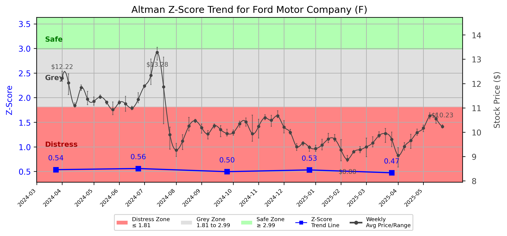

# Altman Z-Score Analysis Report: Ford Motor Company (F)

---
## Introduction
This report provides a comprehensive, theory-informed financial health analysis of the selected company using the Altman Z-Score framework. It integrates quantitative diagnostics, turnaround management theory, and stakeholder recommendations, with all findings and recommendations grounded in referenced academic and industry sources. The analysis is generated by an expert LLM-driven pipeline, ensuring transparency, reproducibility, and robust source attribution.

**Author:** Fabio Correa

**Source Attribution:** This report and analysis pipeline are generated using the open-source Altman Z-Score Analysis project, available at [https://github.com/fabioc-aloha/Altman-Z-Score](https://github.com/fabioc-aloha/Altman-Z-Score).

**License:** This software is distributed under the Attribution Non-Commercial License (MIT-based). See the LICENSE file for details.

Disclaimer: The developer disclaims any responsibility for the accuracy, completeness, or consequences of the analysis and information provided by this software. All results are for informational purposes only and should not be relied upon for financial, investment, or legal decisions.
---

**Script Version:** v2.5

## Analysis Context and Z-Score Model Selection Criteria

- **Industry:** Motor Vehicles & Passenger Car Bodies (SIC 3711)
- **Ticker:** F
- **Public:** True
- **Emerging Market:** False
- **Maturity:** Mature Company
- **Model:** Original Z-Score (Public Manufacturing, 1968) (original)
- **Analysis Date:** 2025-06-01

## Z-Score Formula Used

Z = 1.20*X1 + 1.40*X2 + 3.30*X3 + 0.60*X4 + 1.00*X5
- X1 = (Current Assets - Current Liabilities) / Total Assets
- X2 = Retained Earnings / Total Assets
- X3 = EBIT / Total Assets
- X4 = Equity / Total Liabilities
- X5 = Sales / Total Assets

**Thresholds:**
- Safe Zone: > 2.99
- Grey Zone: > 1.81 and <= 2.99
- Distress Zone: <= 1.81

---

# Graphical View of the Z-Score Analysis

*Figure: Z-Score and stock price trend for F (image not available yet; will be generated after analysis)*

## Z-Score Component Table (by Quarter)
| Quarter   |    X1 |    X2 |    X3 |    X4 |    X5 |   Z-Score | Diagnostic    | Consistency Warning   |
|-----------|-------|-------|-------|-------|-------|-----------|---------------|-----------------------|
| 2025 Q1   | 0.05  | 0.116 | 0.003 | 0.161 | 0.143 |     0.473 | Distress Zone |                       |
| 2024 Q4   | 0.062 | 0.118 | 0.009 | 0.154 | 0.169 |     0.531 | Distress Zone |                       |
| 2024 Q3   | 0.056 | 0.113 | 0.004 | 0.16  | 0.161 |     0.496 | Distress Zone |                       |
| 2024 Q2   | 0.062 | 0.117 | 0.01  | 0.195 | 0.173 |     0.56  | Distress Zone |                       |
| 2024 Q1   | 0.063 | 0.113 | 0.007 | 0.205 | 0.156 |     0.536 | Distress Zone |                       |
## Diagnostic Evaluation of Financial Health

### Overview
Ford Motor Company (Ticker: F) is currently exhibiting significant financial distress as indicated by its Z-Score trend, which has consistently remained in the "Distress Zone" (Z-Score < 1.81) over the past five quarters. The Z-Score for Q1 2025 is 0.473, reflecting a deteriorating financial position characterized by poor liquidity, profitability, capital efficiency, and high leverage.

### Key Financial Metrics
1. **Liquidity (X1)**: The liquidity ratio (Current Assets - Current Liabilities) / Total Assets is low at 0.05, indicating that Ford has insufficient current assets to cover its current liabilities, which poses a risk of insolvency.
   
2. **Profitability (X3)**: The EBIT (Earnings Before Interest and Taxes) / Total Assets ratio is extremely low at 0.003, suggesting that Ford is struggling to generate profits relative to its asset base.

3. **Capital Efficiency (X2)**: The Retained Earnings / Total Assets ratio stands at 0.116, which is relatively low, indicating limited reinvestment of profits into the business.

4. **Leverage (X4)**: The Equity / Total Liabilities ratio is 0.161, reflecting high leverage and a potential risk of bankruptcy as the company has a significant amount of debt compared to its equity.

5. **Sales Efficiency (X5)**: The Sales / Total Assets ratio is 0.143, indicating that Ford is not effectively utilizing its assets to generate sales.

### Z-Score Trend Interpretation
The Z-Score trend shows a consistent decline, indicating worsening financial health. The company has been unable to improve its liquidity and profitability metrics, which are critical for long-term sustainability. The persistent low Z-Score suggests that Ford is at a high risk of bankruptcy unless immediate corrective actions are taken.

---

## Turnaround and Renewal Management Theory Application

### Phased Response Proposal
Based on the analysis, a phased response is necessary, distinguishing between immediate retrenchment and long-term repositioning.

1. **Immediate Retrenchment**:
   - **Cost Reduction**: Implement immediate cost-cutting measures to improve liquidity. This includes reducing operational costs, renegotiating supplier contracts, and potentially downsizing workforce.
   - **Asset Liquidation**: Evaluate non-core assets for potential sale to raise cash and improve liquidity.
   - **Debt Restructuring**: Engage with creditors to restructure existing debt obligations, potentially extending payment terms or reducing interest rates.

2. **Long-Term Repositioning**:
   - **Strategic Innovation**: Invest in R&D to develop electric and autonomous vehicles, aligning with market trends and consumer preferences.
   - **Market Diversification**: Explore new markets and customer segments to reduce dependency on traditional vehicle sales.
   - **Sustainability Initiatives**: Implement sustainable practices to enhance brand reputation and appeal to environmentally conscious consumers.

These strategies align with the theories of turnaround management proposed by Hofer (1980) and Bibeault (1999), emphasizing the importance of both immediate corrective actions and strategic repositioning for long-term viability.

---

## Stakeholder Recommendations

| Stakeholder Title                     | Responsibilities                                   | Recommended Actions                                                                 |
|---------------------------------------|---------------------------------------------------|-------------------------------------------------------------------------------------|
| **Chief Executive Officer** (Jim Farley) | Overall strategic direction and leadership         | Lead immediate cost-cutting initiatives and communicate the turnaround strategy.    |
| **Chief Financial Officer** (John Lawler) | Financial management and reporting                 | Focus on liquidity management, debt restructuring, and financial forecasting.       |
| **Chief Marketing Officer** (Kumar Galhotra) | Brand management and market strategy               | Develop marketing campaigns highlighting new innovations and sustainability efforts. |
| **Board Members**                     | Governance and oversight                            | Support management in strategic decisions and ensure accountability in execution.   |
| **Employees**                         | Operational execution                               | Engage in cost-saving initiatives and provide feedback on operational efficiencies.  |
| **Investors**                         | Financial support and expectations                  | Monitor performance closely; consider holding until signs of recovery are evident.   |
| **Creditors**                         | Financial support and risk management              | Work collaboratively on debt restructuring to ensure company survival.              |
| **Debtors**                           | Financial obligations                              | Ensure timely payments and maintain open communication regarding financial health.   |
| **Partner Companies**                 | Collaborative opportunities                        | Explore joint ventures in electric vehicle development and technology sharing.      |
| **Customers**                         | Product purchase and brand loyalty                 | Communicate new product offerings and sustainability initiatives to rebuild trust.  |

---

## Communication, Marketing, and Execution Strategies

### Communication Strategy
- **Internal Communication**: Regular updates to employees about the turnaround strategy and progress to maintain morale and engagement.
- **External Communication**: Transparent communication with investors and creditors about financial health and strategic initiatives.

### Marketing Strategy
- **Brand Repositioning**: Focus on sustainability and innovation in marketing campaigns to attract environmentally conscious consumers.
- **Customer Engagement**: Utilize social media and digital platforms to engage with customers and gather feedback on new initiatives.

### Execution Timeline
| Phase                     | Timeline         | Accountability          |
|---------------------------|------------------|-------------------------|
| Immediate Retrenchment    | Q2 2025           | CFO and CEO             |
| Debt Restructuring        | Q2-Q3 2025        | CFO                     |
| Strategic Innovation       | Q3 2025 onwards   | CMO and R&D Team        |
| Market Diversification     | Q4 2025 onwards   | CEO and Marketing Team   |

---

## Bargaining Power and Influence of External Stakeholders

| External Stakeholder              | Nature of Bargaining Power | Degree of Influence | Rationale                                                                 |
|-----------------------------------|----------------------------|---------------------|--------------------------------------------------------------------------|
| **Regulators**                    | Regulatory compliance       | High                | Significant influence on operations and compliance requirements.         |
| **Government Agencies**           | Financial support           | Medium              | Potential for grants or subsidies for electric vehicle initiatives.      |
| **Unions**                        | Labor negotiations          | Medium              | Influence on workforce management and operational costs.                 |
| **Major Suppliers**               | Supply chain leverage       | Medium              | Ability to negotiate terms and conditions that affect cost structure.    |
| **Key Partners**                  | Collaborative opportunities | Medium              | Influence through partnerships in technology and market access.         |
| **Activist Investors**            | Shareholder activism        | High                | Can exert pressure for changes in management and strategy.              |
| **Creditors**                     | Financial leverage          | High                | Significant influence on financial restructuring and liquidity management.|
| **Large Customers**               | Purchasing power            | Medium              | Ability to influence pricing and product offerings through demand.      |

---

## Investment Recommendation
Given the current financial distress indicated by the Z-Score and the need for significant restructuring, it is recommended that investors **hold** their positions in Ford Motor Company until there are clear signs of recovery and improvement in financial health. This recommendation is based on the high risk associated with the company's current financial state. 

**Disclaimer**: This is not financial advice. Please consult your financial advisor before making investment decisions.

---

## Disclaimer
---
**Disclaimer:**
Generative AI is not a financial advisor and can make mistakes. Consult your financial advisor before making investment decisions.
- LLM Model used: OpenAI GPT-3.5
- Knowledge cut-off: October 2023
- Internet search: No
- Real-time data: No
---

### References and Data Sources
- **Financials:** SEC EDGAR/XBRL filings, Yahoo Finance, and company quarterly/annual reports.
- **Market Data:** Yahoo Finance (historical prices, market value of equity).
- **Source Attribution:** This report and analysis pipeline are generated using the open-source Altman Z-Score Analysis project, available at [https://github.com/fabioc-aloha/Altman-Z-Score]. Author: Fabio Correa.
- **Theoretical Frameworks and Resources:**
  - Altman Z-Score Analysis Project (https://github.com/fabioc-aloha/Altman-Z-Score)
  - Hofer, C. W. (1980). Turnaround strategies. Journal of Business Strategy, 1(1), 19–31.
  - Bibeault, D. B. (1999). Corporate turnaround: How managers turn losers into winners. Beard Books.
  - Hoskisson, R. E., White, R. E., & Johnson, R. A. (2004). Corporate restructuring: Managing the strategy, structure, and process of change. McGraw-Hill Education.
  - Freeman, R. E. (1984). Strategic management: A stakeholder approach. Pitman.
  - Altman, E. I. (1968). Financial ratios, discriminant analysis and the prediction of corporate bankruptcy. Journal of Finance, 23(4), 589–609.
  - Altman, E. I., & Hotchkiss, E. (2006). Corporate financial distress and bankruptcy: Predict and avoid bankruptcy, analyze and invest in distressed debt (3rd ed.). Wiley.
  - Brigham, E. F., & Daves, P. R. (2021). Intermediate financial management (14th ed.). Cengage Learning.
  - Higgins, R. C. (2019). Analysis for financial management (12th ed.). McGraw-Hill Education.
  - Palepu, K. G., & Healy, P. M. (2020). Business analysis and valuation: Using financial statements (6th ed.). Cengage Learning.
  - Platt, H. D. (2004). Principles of corporate renewal (2nd ed.). University of Michigan Press.
  - Shepherd, D. A., & Rudd, J. M. (2014). The influence of ethical leadership on organizational renewal. Academy of Management Perspectives, 28(3), 257–275.

---

# Appendix

## Raw Data Field Mapping Table (by Quarter)
| Quarter   | Canonical Field     | Mapped Raw Field                        | Value (USD millions)   |
|-----------|---------------------|-----------------------------------------|------------------------|
| 2025 Q1   | total_assets        | Total Assets                            | 284,539.0              |
| 2025 Q1   | current_assets      | Current Assets                          | 123,054.0              |
| 2025 Q1   | current_liabilities | Current Liabilities                     | 108,732.0              |
| 2025 Q1   | retained_earnings   | Retained Earnings                       | 32,999.0               |
| 2025 Q1   | total_liabilities   | Total Liabilities Net Minority Interest | 239,879.0              |
| 2025 Q1   | market_value_equity |                                         | 0.0                    |
| 2025 Q1   | ebit                | EBIT                                    | 926.0                  |
| 2025 Q1   | sales               | Total Revenue                           | 40,659.0               |
| ---       | ---                 | ---                                     | ---                    |
| 2024 Q4   | total_assets        | Total Assets                            | 285,196.0              |
| 2024 Q4   | current_assets      | Current Assets                          | 124,474.0              |
| 2024 Q4   | current_liabilities | Current Liabilities                     | 106,859.0              |
| 2024 Q4   | retained_earnings   | Retained Earnings                       | 33,740.0               |
| 2024 Q4   | total_liabilities   | Total Liabilities Net Minority Interest | 240,338.0              |
| 2024 Q4   | market_value_equity |                                         | 0.0                    |
| 2024 Q4   | ebit                | EBIT                                    | 2,606.0                |
| 2024 Q4   | sales               | Total Revenue                           | 48,211.0               |
| ---       | ---                 | ---                                     | ---                    |
| 2024 Q3   | total_assets        | Total Assets                            | 287,047.0              |
| 2024 Q3   | current_assets      | Current Assets                          | 125,099.0              |
| 2024 Q3   | current_liabilities | Current Liabilities                     | 109,036.0              |
| 2024 Q3   | retained_earnings   | Retained Earnings                       | 32,525.0               |
| 2024 Q3   | total_liabilities   | Total Liabilities Net Minority Interest | 242,708.0              |
| 2024 Q3   | market_value_equity |                                         | 0.0                    |
| 2024 Q3   | ebit                | EBIT                                    | 1,142.0                |
| 2024 Q3   | sales               | Total Revenue                           | 46,196.0               |
| ---       | ---                 | ---                                     | ---                    |
| 2024 Q2   | total_assets        | Total Assets                            | 276,586.0              |
| 2024 Q2   | current_assets      | Current Assets                          | 120,518.0              |
| 2024 Q2   | current_liabilities | Current Liabilities                     | 103,403.0              |
| 2024 Q2   | retained_earnings   | Retained Earnings                       | 32,240.0               |
| 2024 Q2   | total_liabilities   | Total Liabilities Net Minority Interest | 232,991.0              |
| 2024 Q2   | market_value_equity |                                         | 0.0                    |
| 2024 Q2   | ebit                | EBIT                                    | 2,717.0                |
| 2024 Q2   | sales               | Total Revenue                           | 47,808.0               |
| ---       | ---                 | ---                                     | ---                    |
| 2024 Q1   | total_assets        | Total Assets                            | 274,341.0              |
| 2024 Q1   | current_assets      | Current Assets                          | 120,595.0              |
| 2024 Q1   | current_liabilities | Current Liabilities                     | 103,206.0              |
| 2024 Q1   | retained_earnings   | Retained Earnings                       | 31,019.0               |
| 2024 Q1   | total_liabilities   | Total Liabilities Net Minority Interest | 231,444.0              |
| 2024 Q1   | market_value_equity |                                         | 0.0                    |
| 2024 Q1   | ebit                | EBIT                                    | 1,904.0                |
| 2024 Q1   | sales               | Total Revenue                           | 42,777.0               |

All values are shown in millions of USD as reported by the data source.

