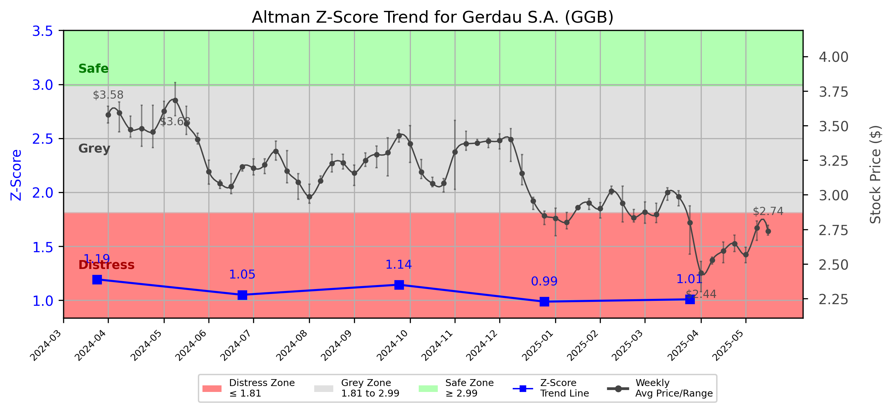

# Altman Z-Score Analysis Report: Gerdau S.A. (GGB)

---
## Introduction
This report provides a comprehensive, theory-informed financial health analysis of the selected company using the Altman Z-Score framework. It integrates quantitative diagnostics, turnaround management theory, and stakeholder recommendations, with all findings and recommendations grounded in referenced academic and industry sources. The analysis is generated by an expert LLM-driven pipeline, ensuring transparency, reproducibility, and robust source attribution.

**Author:** Fabio Correa

**Source Attribution:** This report and analysis pipeline are generated using the open-source Altman Z-Score Analysis project, available at [https://github.com/fabioc-aloha/Altman-Z-Score](https://github.com/fabioc-aloha/Altman-Z-Score).

**License:** This software is distributed under the Attribution Non-Commercial License (MIT-based). See the LICENSE file for details.

Disclaimer: The developer disclaims any responsibility for the accuracy, completeness, or consequences of the analysis and information provided by this software. All results are for informational purposes only and should not be relied upon for financial, investment, or legal decisions.
---

**Script Version:** v2.7.1

## Analysis Context and Z-Score Model Selection Criteria

- **Industry:** SIC 3310 (SIC 3310)
- **Ticker:** GGB
- **Public:** True
- **Emerging Market:** False
- **Maturity:** Mature Company
- **Model:** Original Z-Score (Public Manufacturing, 1968) (original)
- **Analysis Date:** 2025-06-03

## Z-Score Formula Used

Z = 1.20*X1 + 1.40*X2 + 3.30*X3 + 0.60*X4 + 1.00*X5
- X1 = (Current Assets - Current Liabilities) / Total Assets
- X2 = Retained Earnings / Total Assets
- X3 = EBIT / Total Assets
- X4 = Equity / Total Liabilities
- X5 = Sales / Total Assets

**Thresholds:**
- Safe Zone: > 2.99
- Grey Zone: > 1.81 and <= 2.99
- Distress Zone: <= 1.81

---

# Graphical View of the Z-Score Analysis

*Figure: Z-Score and stock price trend for GGB (image not available yet; will be generated after analysis)*

## Z-Score Component Table (by Quarter)
| Quarter   |    X1 |    X2 |    X3 |    X4 |    X5 |   Z-Score | Diagnostic    | Consistency Warning   |
|-----------|-------|-------|-------|-------|-------|-----------|---------------|-----------------------|
| 2025 Q1   | 0.234 | 0.284 | 0.016 | 0.125 | 0.203 |     1.007 | Distress Zone | No issues             |
| 2024 Q4   | 0.251 | 0.279 | 0.007 | 0.129 | 0.194 |     0.986 | Distress Zone | No issues             |
| 2024 Q3   | 0.266 | 0.307 | 0.025 | 0.168 | 0.212 |     1.143 | Distress Zone | No issues             |
| 2024 Q2   | 0.25  | 0.291 | 0.015 | 0.154 | 0.202 |     1.049 | Distress Zone | No issues             |
| 2024 Q1   | 0.248 | 0.334 | 0.032 | 0.184 | 0.211 |     1.193 | Distress Zone | No issues             |
# Altman Z-Score Analysis Report: Gerdau S.A. (GGB)

---

## Company Profile

Gerdau S.A., headquartered in São Paulo, Brazil, is a leading player in the steel manufacturing industry, classified under SIC 3310 (Steel Works, Blast Furnaces & Rolling & Finishing Mills). The company produces a wide range of steel products, serving various sectors including construction, automotive, and industrial applications. Gerdau operates in a competitive landscape, facing rivals such as ArcelorMittal, Nucor Corporation, and Tata Steel, among others.

The leadership team at Gerdau is led by Mr. Gustavo Werneck Da Cunha, who serves as the CEO and Director. He is supported by a diverse executive team, including Mr. Rafael Dorneles Japur, the CFO and Director of Investor Relations, and Mr. Marcos Eduardo Faraco Wahrhaftig, the Executive VP of Strategy. The board also includes independent members such as Mr. Claudio Gerdau Johannpeter, who serves as the Independent Vice Chairman. The executive team is responsible for strategic vision, operational execution, and financial stewardship, ensuring the company navigates the complexities of the steel market effectively.

---

## 1. Diagnostic Evaluation of Financial Health

### Financial Analysis

- **Liquidity:** Gerdau's liquidity, as indicated by the X1 component (Current Assets - Current Liabilities) / Total Assets, has shown a declining trend, currently at 0.234. This suggests potential challenges in meeting short-term obligations, especially in a volatile market.

- **Profitability:** The profitability measure (X3: EBIT / Total Assets) is notably low at 0.016, indicating that the company is struggling to generate earnings relative to its asset base. This is a critical area of concern that needs immediate attention.

- **Capital Efficiency:** The retained earnings ratio (X2: Retained Earnings / Total Assets) is at 0.284, which reflects a moderate level of reinvestment into the business. However, this is not sufficient to offset the profitability issues.

- **Leverage:** The leverage ratio (X4: Equity / Total Liabilities) is at 0.125, indicating a high level of debt relative to equity. This raises concerns about financial stability and the ability to withstand economic downturns.

### Z-Score Trajectory and Risk Status

Gerdau's Z-Score has consistently remained in the **Distress Zone**, with the latest score at 1.007. This indicates a high risk of bankruptcy and necessitates urgent action to stabilize the company's financial health. The trend shows no significant improvement over the past quarters, which is alarming for stakeholders.

---

## 2. Turnaround & Renewal Theory Application

Given Gerdau's position in the **Distress Zone**, the company must prioritize **urgent retrenchment** strategies, focusing on cash preservation and creditor negotiations. 

### Recommended Actions:
- **Cash Preservation:** Implement strict cost-cutting measures across all departments, focusing on non-essential expenditures.
- **Creditor Negotiations:** Engage with creditors to restructure debt obligations, potentially extending payment terms or negotiating lower interest rates.
- **Operational Efficiency:** Conduct a thorough review of operational processes to identify inefficiencies and areas for cost reduction.

Theoretical frameworks such as Hofer (1980) on turnaround sequencing and Bibeault (1999) on causes of failure and recovery stages will guide these efforts, emphasizing the need for immediate action to stabilize the company.

---

## 3. Internal Stakeholder Recommendations

| Title/Role | Responsibilities | Key Performance Metrics | Recommended Actions (Cited) |
| ---------- | ---------------- | ---------------------- | --------------------------- |
| CEO | Strategic vision, operational execution | Z-Score improvement, cash flow | Implement immediate cost-cutting measures |
| CFO | Financial stewardship, risk management | Debt-to-equity ratio, liquidity ratios | Negotiate with creditors for better terms |
| VP of Strategy | Strategic planning | Market share, operational efficiency | Identify core competencies for focus |
| Board Members | Oversight and governance | Compliance, strategic alignment | Increase oversight on financial performance |
| Employees | Operational roles | Productivity metrics | Engage in cost-saving initiatives |
| Shareholders | Investment community relations | Share price stability | Communicate transparently about recovery plans |
| Creditors | Financial stability monitoring | Debt service coverage ratio | Maintain open lines of communication |
| Customers | Product/service experience | Customer satisfaction | Ensure product quality and service reliability |
| Partners | Strategic alliances | Partnership effectiveness | Explore joint ventures to share risks |

---

## 4. Communication, Marketing & Execution Strategy

### Multi-Level Communication Strategy
- **Executive Leadership Communications:** Regular updates on financial health and strategic direction.
- **Investor Relations:** Transparent communication regarding recovery plans and financial performance.
- **Internal Communications:** Foster employee engagement through regular updates and involvement in cost-saving initiatives.
- **External Relations:** Maintain customer trust through consistent product quality and service.

### Phased Execution Plan
- **Near-term (1-3 months):** Implement immediate cost-cutting measures and engage with creditors.
- **Mid-term (4-6 months):** Focus on operational efficiency and begin restructuring efforts.
- **Long-term (7-18 months):** Develop a comprehensive recovery strategy that includes innovation and market repositioning.

---

## 5. Investor Recommendation (Risk-Aware)

**Recommendation:** **Sell**. Given Gerdau's current Z-Score of 1.007, which places it firmly in the Distress Zone, the company faces significant financial risks. Investors should consider divesting until there are clear signs of recovery and improved financial health.

> “This is not financial advice—consult your financial advisor.”

---

## 6. External Stakeholder Bargaining Power

| Stakeholder Name / Type | Nature of Bargaining Power | Degree of Influence | Brief Rationale (Cited) |
| ----------------------- | -------------------------- | ------------------- | ----------------------- |
| Creditors | High | High | High debt levels give creditors significant leverage in negotiations. |
| Customers | Moderate | Moderate | Customer loyalty can influence pricing and demand stability. |
| Suppliers | Moderate | Moderate | Dependence on raw materials gives suppliers some bargaining power. |
| Shareholders | High | High | Shareholder pressure can influence management decisions and strategy. |

---

## 7. References and Data Sources

This analysis draws on financial data from sources such as SEC EDGAR/XBRL filings, Yahoo Finance, and company quarterly or annual reports. Market data was obtained from Yahoo Finance historical prices. All computations, including the Altman Z-Score, follow the methodology described by Altman (1968) with robust error handling. The analysis is part of the open-source Altman Z-Score Analysis project (https://github.com/fabioc-aloha/Altman-Z-Score), authored by Fabio Correa. Theoretical frameworks referenced (as applicable) include:
- Altman, E. I. (1968). “Financial Ratios, Discriminant Analysis and the Prediction of Corporate Bankruptcy.” *Journal of Finance*, 23(4), 589–609.
- Hofer, C. W. (1980). *Turnaround Strategies.*
- Bibeault, D. B. (1999). *Corporate Turnaround.* 

--- 

This report provides a comprehensive overview of Gerdau S.A.'s financial health and strategic recommendations based on the Altman Z-Score framework, emphasizing the urgent need for action in light of its current distress status.

---

# Appendix

## Raw Data Field Mapping Table (by Quarter)
| Quarter   | Canonical Field     | Mapped Raw Field                        | Value (USD millions)   |
|-----------|---------------------|-----------------------------------------|------------------------|
| 2025 Q1   | total_assets        | Total Assets                            | 85,576.2               |
| 2025 Q1   | current_assets      | Current Assets                          | 32,193.9               |
| 2025 Q1   | current_liabilities | Current Liabilities                     | 12,193.0               |
| 2025 Q1   | retained_earnings   | Retained Earnings                       | 24,287.7               |
| 2025 Q1   | total_liabilities   | Total Liabilities Net Minority Interest | 29,356.7               |
| 2025 Q1   | market_value_equity | Common Stock Equity                     | 56,017.1               |
| 2025 Q1   | ebit                | EBIT                                    | 1,337.0                |
| 2025 Q1   | sales               | Total Revenue                           | 17,375.3               |
| ---       | ---                 | ---                                     | ---                    |
| 2024 Q4   | total_assets        | Total Assets                            | 86,814.5               |
| 2024 Q4   | current_assets      | Current Assets                          | 32,669.4               |
| 2024 Q4   | current_liabilities | Current Liabilities                     | 10,851.4               |
| 2024 Q4   | retained_earnings   | Retained Earnings                       | 24,238.2               |
| 2024 Q4   | total_liabilities   | Total Liabilities Net Minority Interest | 28,640.7               |
| 2024 Q4   | market_value_equity | Common Stock Equity                     | 57,948.8               |
| 2024 Q4   | ebit                | EBIT                                    | 585.5                  |
| 2024 Q4   | sales               | Total Revenue                           | 16,822.5               |
| ---       | ---                 | ---                                     | ---                    |
| 2024 Q3   | total_assets        | Total Assets                            | 81,851.3               |
| 2024 Q3   | current_assets      | Current Assets                          | 32,818.0               |
| 2024 Q3   | current_liabilities | Current Liabilities                     | 11,026.2               |
| 2024 Q3   | retained_earnings   | Retained Earnings                       | 25,089.9               |
| 2024 Q3   | total_liabilities   | Total Liabilities Net Minority Interest | 26,335.4               |
| 2024 Q3   | market_value_equity | Common Stock Equity                     | 55,295.0               |
| 2024 Q3   | ebit                | EBIT                                    | 2,010.3                |
| 2024 Q3   | sales               | Total Revenue                           | 17,378.0               |
| ---       | ---                 | ---                                     | ---                    |
| 2024 Q2   | total_assets        | Total Assets                            | 82,399.3               |
| 2024 Q2   | current_assets      | Current Assets                          | 31,828.1               |
| 2024 Q2   | current_liabilities | Current Liabilities                     | 11,246.9               |
| 2024 Q2   | retained_earnings   | Retained Earnings                       | 23,996.8               |
| 2024 Q2   | total_liabilities   | Total Liabilities Net Minority Interest | 27,057.4               |
| 2024 Q2   | market_value_equity | Common Stock Equity                     | 55,130.3               |
| 2024 Q2   | ebit                | EBIT                                    | 1,203.6                |
| 2024 Q2   | sales               | Total Revenue                           | 16,615.8               |
| ---       | ---                 | ---                                     | ---                    |
| 2024 Q1   | total_assets        | Total Assets                            | 76,961.1               |
| 2024 Q1   | current_assets      | Current Assets                          | 29,742.5               |
| 2024 Q1   | current_liabilities | Current Liabilities                     | 10,642.4               |
| 2024 Q1   | retained_earnings   | Retained Earnings                       | 25,741.0               |
| 2024 Q1   | total_liabilities   | Total Liabilities Net Minority Interest | 24,850.1               |
| 2024 Q1   | market_value_equity | Common Stock Equity                     | 51,919.4               |
| 2024 Q1   | ebit                | EBIT                                    | 2,461.3                |
| 2024 Q1   | sales               | Total Revenue                           | 16,210.3               |

All values are shown in millions of USD as reported by the data source.

