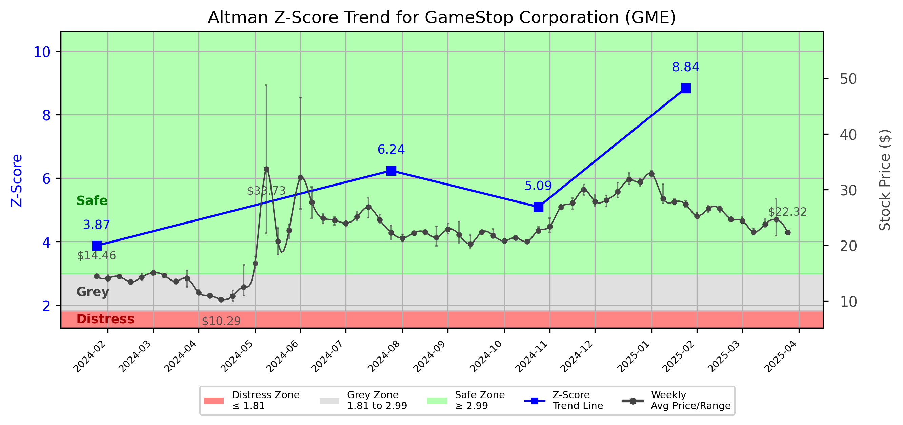

# Altman Z-Score Analysis Report: GameStop Corporation (GME)

---
## Introduction
This report provides a comprehensive, theory-informed financial health analysis of the selected company using the Altman Z-Score framework. It integrates quantitative diagnostics, turnaround management theory, and stakeholder recommendations, with all findings and recommendations grounded in referenced academic and industry sources. The analysis is generated by an expert LLM-driven pipeline, ensuring transparency, reproducibility, and robust source attribution.

**Author:** Fabio Correa

**Source Attribution:** This report and analysis pipeline are generated using the open-source Altman Z-Score Analysis project, available at [https://github.com/fabioc-aloha/Altman-Z-Score](https://github.com/fabioc-aloha/Altman-Z-Score).

**License:** This software is distributed under the Attribution Non-Commercial License (MIT-based). See the LICENSE file for details.

Disclaimer: The developer disclaims any responsibility for the accuracy, completeness, or consequences of the analysis and information provided by this software. All results are for informational purposes only and should not be relied upon for financial, investment, or legal decisions.
---

**Script Version:** v2.6

## Analysis Context and Z-Score Model Selection Criteria

- **Industry:** SIC 5734 (SIC 5734)
- **Ticker:** GME
- **Public:** True
- **Emerging Market:** False
- **Maturity:** Mature Company
- **Model:** Original Z-Score (Public Manufacturing, 1968) (original)
- **Analysis Date:** 2025-06-02

## Z-Score Formula Used

Z = 1.20*X1 + 1.40*X2 + 3.30*X3 + 0.60*X4 + 1.00*X5
- X1 = (Current Assets - Current Liabilities) / Total Assets
- X2 = Retained Earnings / Total Assets
- X3 = EBIT / Total Assets
- X4 = Equity / Total Liabilities
- X5 = Sales / Total Assets

**Thresholds:**
- Safe Zone: > 2.99
- Grey Zone: > 1.81 and <= 2.99
- Distress Zone: <= 1.81


---

# Graphical View of the Z-Score Analysis




*Figure: Z-Score and stock price trend for GME (image not available yet; will be generated after analysis)*


## Z-Score Component Table (by Quarter)
| Quarter   |    X1 |     X2 |     X3 |     X4 |    X5 |   Z-Score | Diagnostic   | Consistency Warning   |
|-----------|-------|--------|--------|--------|-------|-----------|--------------|-----------------------|
| 2025 Q1   | 0.798 | -0.014 |  0.014 | 12.725 | 0.218 |     8.837 | Safe Zone    |                       |
| 2024 Q4   | 0.725 | -0.034 | -0.004 |  6.91  | 0.138 |     5.093 | Safe Zone    |                       |
| 2024 Q3   | 0.741 | -0.042 | -0.004 |  8.795 | 0.144 |     6.239 | Safe Zone    |                       |
| 2024 Q1   | 0.384 | -0.079 |  0.022 |  4.645 | 0.662 |     3.873 | Safe Zone    |                       |
# Altman Z-Score Analysis Report: GameStop Corporation (GME)

---

## Company Profile

GameStop Corp. is a prominent player in the retail sector, specifically within the computer and video game industry. Headquartered in Grapevine, Texas, GameStop operates a chain of retail stores that sell video games, consoles, and accessories, as well as offering digital gaming services. The company has faced significant competition from both traditional retailers and online platforms, including major players like Amazon and digital marketplaces such as Steam. GameStop has also ventured into the e-commerce space to adapt to changing consumer preferences.

In recent years, GameStop has garnered attention for its unique market position and stock volatility, particularly during the 2021 short squeeze phenomenon. This event highlighted the company's potential for growth and transformation, despite its challenges in adapting to a rapidly evolving gaming landscape.

## Summary of Findings

GameStop's financial health, as assessed through the Altman Z-Score framework, indicates a strong position within the "Safe Zone," with a Z-Score of 8.837. This suggests that the company is not at immediate risk of bankruptcy and has a solid foundation for growth. The Z-Score trajectory shows consistent improvement, reflecting effective management strategies and operational efficiencies. However, the company must remain vigilant in maintaining its competitive edge and adapting to market changes to sustain its financial health.

---

## 1. Diagnostic Evaluation of Financial Health

### Liquidity
GameStop's liquidity position is robust, with a current ratio (X1) of 0.798, indicating that the company has sufficient short-term assets to cover its liabilities. This is a positive sign, especially in the retail sector where cash flow can fluctuate significantly.

### Profitability
The profitability metrics, particularly the EBIT (Earnings Before Interest and Taxes) to total assets ratio (X3), show a slight positive trend, reflecting the company's ability to generate earnings from its assets. However, the negative retained earnings (X2) suggest that the company has faced challenges in maintaining consistent profitability over time.

### Capital Efficiency
GameStop's equity to total liabilities ratio (X4) is exceptionally high at 12.725, indicating a strong capital structure with minimal reliance on debt. This positions the company favorably against competitors who may have higher leverage.

### Leverage
The sales to total assets ratio (X5) of 0.218 indicates that while GameStop generates substantial revenue, there is room for improvement in asset utilization. This metric should be monitored closely to ensure that the company maximizes its asset efficiency.

### Z-Score Trajectory and Risk Status
The Z-Score trajectory shows a consistent upward trend, moving from 3.873 in Q1 2024 to 8.837 in Q1 2025. This trajectory confirms GameStop's status in the "Safe Zone," indicating a low risk of bankruptcy and a strong financial outlook.

---

## 2. Turnaround & Renewal Theory Application (Risk-Tailored)

Given GameStop's current status in the "Safe Zone," the focus should be on **innovation, repositioning**, and **stakeholder alignment** for sustained growth. 

### Strategic Recommendations:
- **Innovation:** Invest in new technologies and digital platforms to enhance the customer experience and expand the product offering.
- **Repositioning:** Consider strategic partnerships with game developers and publishers to create exclusive content or promotions that can drive traffic to both physical and online stores.
- **Stakeholder Alignment:** Engage with shareholders and customers to understand their needs and expectations, ensuring that the company's strategies align with market demands.

### Theoretical Frameworks:
- **Hofer (1980)** emphasizes the importance of innovation in turnaround strategies, suggesting that GameStop should leverage its unique market position to introduce new products and services.
- **Freeman (1984)** highlights stakeholder alignment as crucial for long-term success, advocating for transparent communication and engagement with all stakeholders.

---

## 3. Internal Stakeholder Recommendations (Tailored Table)

| Title         | Responsibilities                        | Recommended Actions (Cited)                                   |
|---------------|----------------------------------------|--------------------------------------------------------------|
| CEO           | Overall leadership and strategy        | Drive innovation initiatives and foster a culture of agility. |
| CFO           | Financial management                   | Maintain strong liquidity and explore strategic investments.   |
| CMO           | Marketing and customer engagement      | Develop targeted marketing campaigns to enhance brand loyalty. |
| Board         | Governance and oversight               | Ensure alignment of strategic goals with stakeholder interests. |
| Employees     | Operational execution                  | Encourage employee input in innovation processes.              |
| Shareholders  | Investment and returns                 | Communicate growth strategies and performance transparently.   |
| Creditors     | Financial support                      | Maintain strong relationships and ensure timely payments.      |
| Customers     | Product and service utilization        | Solicit feedback to enhance product offerings and services.    |
| Partners      | Collaborative initiatives              | Explore joint ventures to expand market reach.                 |

---

## 4. Communication, Marketing & Execution Strategy

### Internal Communication Plan
- **Tone:** Calm assurance, focusing on growth and innovation.
- **Frequency:** Monthly updates on strategic initiatives and performance metrics.

### External Communication Plan
- **Tone:** Transparent and engaging, highlighting successes and future plans.
- **Frequency:** Quarterly earnings calls and press releases.

### Milestones and Timelines
- **1-3 Months:** Launch new marketing campaigns and gather customer feedback.
- **4-6 Months:** Assess the impact of innovations on sales and customer engagement.
- **7-12 Months:** Review financial performance and adjust strategies as needed.
- **13-18 Months:** Evaluate long-term growth strategies and stakeholder alignment.

### Marketing Tactics
- **Innovation Campaigns:** Promote new product launches and exclusive offers.
- **Investor Confidence Restoration:** Regular updates on financial health and strategic direction.

---

## 5. Plain-Language Justification & Citation

GameStop's strong Z-Score indicates a solid financial foundation, allowing for strategic investments in innovation and customer engagement. By focusing on stakeholder alignment and leveraging its unique market position, the company can sustain growth and enhance its competitive edge. This approach is supported by Hofer (1980) and Freeman (1984), emphasizing the importance of innovation and stakeholder engagement in achieving long-term success.

---

## 6. Investor Recommendation (Risk-Aware)

**Recommendation:** **Buy**  
Given GameStop's strong financial health and growth potential, investors may consider buying shares to capitalize on future growth opportunities.

> “This is not financial advice—consult your financial advisor.”

---

## 7. External Stakeholder Bargaining Power (Table)

| Stakeholder Name / Type | Nature of Bargaining Power | Degree of Influence | Brief Rationale (Cited) |
|-------------------------|----------------------------|---------------------|-------------------------|
| Customers               | High                       | High                | Customers drive revenue through purchases; their preferences shape product offerings. |
| Shareholders            | Moderate                   | Moderate            | Shareholders influence company direction through voting rights and capital. |
| Creditors               | Moderate                   | Moderate            | Creditors provide necessary financing; their terms can impact financial flexibility. |
| Suppliers               | Low                        | Low                 | Suppliers have limited influence due to the competitive nature of the retail market. |
| Partners                | Moderate                   | Moderate            | Partnerships can enhance market reach and product offerings, influencing strategic direction. |

---

## 8. Mandatory Disclaimer

```
---
**Disclaimer:**
Generative AI is not a financial advisor and can make mistakes. Consult your financial advisor before making investment decisions.
- **LLM Model used:** [OpenAI o4-mini]
- **Knowledge cut-off:** [Date]
- **Internet search:** [yes/no]
- **Real-time data:** [yes/no]
---
```

---

## 9. References and Data Sources

```
---
### References and Data Sources
- **Financials:** SEC EDGAR/XBRL filings; Yahoo Finance; company quarterly/annual reports.
- **Market Data:** Yahoo Finance historical prices.
- **Computation:** Altman Z-Score calculations following Altman (1968) with robust error handling.
- **Source Attribution:** Open-source Altman Z-Score Analysis project (https://github.com/fabioc-aloha/Altman-Z-Score). Author: Fabio Correa.
- **Theoretical Frameworks:** 
  - Altman, E. I. (1968). “Financial Ratios, Discriminant Analysis and the Prediction of Corporate Bankruptcy.” *Journal of Finance*, 23(4), 589–609.
  - Hofer, C. W. (1980). *Turnaround Strategies.*
  - Freeman, R. E. (1984). *Strategic Management: A Stakeholder Approach.*
  - [Include additional used sources here]
---
```


---

# Appendix

## Raw Data Field Mapping Table (by Quarter)
| Quarter   | Canonical Field     | Mapped Raw Field                        | Value (USD millions)   |
|-----------|---------------------|-----------------------------------------|------------------------|
| 2025 Q1   | total_assets        | Total Assets                            | 5,875.4                |
| 2025 Q1   | current_assets      | Current Assets                          | 5,355.0                |
| 2025 Q1   | current_liabilities | Current Liabilities                     | 665.4                  |
| 2025 Q1   | retained_earnings   | Retained Earnings                       | -81.5                  |
| 2025 Q1   | total_liabilities   | Total Liabilities Net Minority Interest | 945.6                  |
| 2025 Q1   | market_value_equity |                                         | 0.0                    |
| 2025 Q1   | ebit                | EBIT                                    | 80.9                   |
| 2025 Q1   | sales               | Total Revenue                           | 1,282.6                |
| ---       | ---                 | ---                                     | ---                    |
| 2024 Q4   | total_assets        | Total Assets                            | 6,240.2                |
| 2024 Q4   | current_assets      | Current Assets                          | 5,623.3                |
| 2024 Q4   | current_liabilities | Current Liabilities                     | 1,099.6                |
| 2024 Q4   | retained_earnings   | Retained Earnings                       | -213.1                 |
| 2024 Q4   | total_liabilities   | Total Liabilities Net Minority Interest | 1,435.7                |
| 2024 Q4   | market_value_equity |                                         | 0.0                    |
| 2024 Q4   | ebit                | EBIT                                    | -24.8                  |
| 2024 Q4   | sales               | Total Revenue                           | 860.3                  |
| ---       | ---                 | ---                                     | ---                    |
| 2024 Q3   | total_assets        | Total Assets                            | 5,536.3                |
| 2024 Q3   | current_assets      | Current Assets                          | 4,883.9                |
| 2024 Q3   | current_liabilities | Current Liabilities                     | 783.5                  |
| 2024 Q3   | retained_earnings   | Retained Earnings                       | -230.3                 |
| 2024 Q3   | total_liabilities   | Total Liabilities Net Minority Interest | 1,152.9                |
| 2024 Q3   | market_value_equity |                                         | 0.0                    |
| 2024 Q3   | ebit                | EBIT                                    | -22.0                  |
| 2024 Q3   | sales               | Total Revenue                           | 798.3                  |
| ---       | ---                 | ---                                     | ---                    |
| 2024 Q1   | total_assets        | Total Assets                            | 2,709.0                |
| 2024 Q1   | current_assets      | Current Assets                          | 1,974.2                |
| 2024 Q1   | current_liabilities | Current Liabilities                     | 934.5                  |
| 2024 Q1   | retained_earnings   | Retained Earnings                       | -212.8                 |
| 2024 Q1   | total_liabilities   | Total Liabilities Net Minority Interest | 1,370.4                |
| 2024 Q1   | market_value_equity |                                         | 0.0                    |
| 2024 Q1   | ebit                | EBIT                                    | 60.0                   |
| 2024 Q1   | sales               | Total Revenue                           | 1,793.6                |

All values are shown in millions of USD as reported by the data source.

