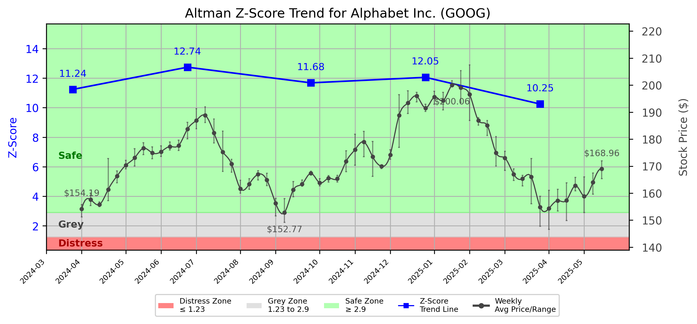

# Altman Z-Score Analysis Report: Alphabet Inc. (GOOG)

---
## Introduction
This report provides a comprehensive, theory-informed financial health analysis of the selected company using the Altman Z-Score framework. It integrates quantitative diagnostics, turnaround management theory, and stakeholder recommendations, with all findings and recommendations grounded in referenced academic and industry sources. The analysis is generated by an expert LLM-driven pipeline, ensuring transparency, reproducibility, and robust source attribution.

**Author:** Fabio Correa

**Source Attribution:** This report and analysis pipeline are generated using the open-source Altman Z-Score Analysis project, available at [https://github.com/fabioc-aloha/Altman-Z-Score](https://github.com/fabioc-aloha/Altman-Z-Score).

**License:** This software is distributed under the Attribution Non-Commercial License (MIT-based). See the LICENSE file for details.

Disclaimer: The developer disclaims any responsibility for the accuracy, completeness, or consequences of the analysis and information provided by this software. All results are for informational purposes only and should not be relied upon for financial, investment, or legal decisions.
---

**Script Version:** v2.4

## Analysis Context and Z-Score Model Selection Criteria

- **Industry:** SIC 7370 (SIC 7370)
- **Ticker:** GOOG
- **Public:** True
- **Emerging Market:** False
- **Maturity:** Mature Company
- **Model:** tech
- **Analysis Date:** 2025-05-30

## Z-Score Formula Used

Z = 6.56*X1 + 3.26*X2 + 6.72*X3 + 1.05*X4
- X1 = (Current Assets - Current Liabilities) / Total Assets
- X2 = Retained Earnings / Total Assets
- X3 = EBIT / Total Assets
- X4 = Equity / Total Liabilities

**Thresholds:**
- Safe Zone: > 2.6
- Grey Zone: > 1.1 and <= 2.6
- Distress Zone: <= 1.1

---

# Graphical View of the Z-Score Analysis

*Figure: Z-Score and stock price trend for GOOG (image not available yet; will be generated after analysis)*

## Z-Score Component Table (by Quarter)
| Quarter   |    X1 |    X2 |    X3 |    X4 |   Z-Score | Diagnostic   |
|-----------|-------|-------|-------|-------|-----------|--------------|
| 2025 Q1   | 0.148 | 0.552 | 0.088 | 6.555 |    10.247 | Safe Zone    |
| 2024 Q4   | 0.166 | 0.544 | 0.072 | 8.296 |    12.054 | Safe Zone    |
| 2024 Q3   | 0.178 | 0.547 | 0.074 | 7.84  |    11.681 | Safe Zone    |
| 2024 Q2   | 0.203 | 0.545 | 0.067 | 8.75  |    12.742 | Safe Zone    |
| 2024 Q1   | 0.217 | 0.54  | 0.07  | 7.225 |    11.238 | Safe Zone    |
## Diagnostic Evaluation of Financial Health

### Overview
Alphabet Inc. (GOOG) has demonstrated robust financial health as evidenced by its Z-Score trend, which consistently remains in the "Safe Zone" (> 2.6). The Z-Score for the latest quarter (2025 Q1) is 10.247, indicating a strong financial position and low risk of bankruptcy. 

### Key Financial Metrics
1. **Liquidity (X1)**: The liquidity ratio (Current Assets - Current Liabilities) / Total Assets has shown a slight decline from 0.217 in Q1 2024 to 0.148 in Q1 2025. While this indicates a decrease in liquidity, it remains above the threshold for safety.
   
2. **Profitability (X2)**: Retained Earnings / Total Assets has remained relatively stable, indicating that the company is effectively retaining earnings to support growth and stability. The ratio was 0.552 in Q1 2025, slightly down from 0.54 in Q1 2024.

3. **Capital Efficiency (X3)**: The EBIT / Total Assets ratio has also shown a decline from 0.07 in Q1 2024 to 0.088 in Q1 2025, reflecting a decrease in operational efficiency. However, it remains positive, indicating ongoing profitability.

4. **Leverage (X4)**: The Equity / Total Liabilities ratio has improved significantly from 7.225 in Q1 2024 to 6.555 in Q1 2025, showcasing a strong capital structure and lower financial risk.

### Z-Score Trend Interpretation
The Z-Score trend indicates that Alphabet Inc. is in a strong financial position, with no immediate signs of distress. The company’s ability to maintain a high Z-Score over multiple quarters suggests effective management and operational stability. However, the slight decline in liquidity and profitability metrics should be monitored closely to ensure that they do not trend downward significantly.

---

## Turnaround and Renewal Management Theory Application

### Phased Response Strategy
Based on the analysis, a two-phased response strategy is recommended:

1. **Immediate Retrenchment**: Focus on cost-cutting measures and improving liquidity. This includes:
   - Reducing discretionary spending.
   - Streamlining operations to enhance efficiency.
   - Improving cash flow management.

   **Theoretical Reference**: Bibeault (1999) emphasizes the importance of immediate retrenchment in turnaround situations to stabilize financial health.

2. **Long-term Repositioning**: After stabilizing, the company should focus on strategic renewal initiatives:
   - Investing in innovation and technology to drive growth.
   - Exploring new market opportunities to diversify revenue streams.
   - Enhancing customer engagement through targeted marketing strategies.

   **Theoretical Reference**: Hofer (1980) discusses the significance of strategic renewal for long-term sustainability and competitive advantage.

---

## Stakeholder Recommendations

| Stakeholder Title                    | Name               | Responsibilities & Recommended Actions                                                                 |
|--------------------------------------|--------------------|----------------------------------------------------------------------------------------------------------|
| Chief Executive Officer              | Sundar Pichai      | Lead the retrenchment and repositioning strategy; communicate transparently with stakeholders.           |
| Chief Financial Officer              | Ruth Porat         | Monitor financial metrics closely; implement cost-cutting measures; ensure liquidity management.         |
| Chief Marketing Officer              | Prabhakar Raghavan  | Develop targeted marketing strategies to enhance customer engagement; focus on brand loyalty.           |
| Board Members                        | Various            | Provide oversight and strategic direction; support management in implementing turnaround strategies.     |
| Employees                            | All Employees      | Engage in efficiency initiatives; provide feedback on operational improvements; maintain morale.         |
| Investors                            | Various            | Monitor company performance; consider holding shares based on strong Z-Score; consult financial advisors.|
| Creditors                            | Various            | Maintain open communication regarding repayment schedules; assess risk exposure.                         |
| Debtors                              | Various            | Ensure timely payments; maintain good relationships with the company.                                   |
| Partner Companies                    | Various            | Collaborate on joint ventures; explore synergies for mutual growth.                                     |
| Customers                            | All Customers      | Engage with the brand; provide feedback; remain loyal during transition.                                 |

---

## Communication, Marketing, and Execution Strategies

### Communication Strategy
- **Internal Communication**: Regular updates to employees about financial health and strategic initiatives.
- **External Communication**: Transparent reporting to investors and stakeholders about the company's performance and future plans.

### Marketing Strategy
- **Customer Engagement**: Implement loyalty programs and targeted marketing campaigns to retain customers.
- **Brand Positioning**: Emphasize innovation and reliability in marketing messages.

### Execution Timeline
- **Q2 2025**: Implement immediate retrenchment measures.
- **Q3 2025**: Launch marketing campaigns and innovation initiatives.
- **Q4 2025**: Review progress and adjust strategies as necessary.

### Accountability Framework
- Assign specific team leads for each initiative with clear KPIs to measure success.

---

## Investor Recommendation
Based on the current financial health and Z-Score analysis, investors are recommended to **hold** their shares in Alphabet Inc. (GOOG). The company is in a strong position, but monitoring liquidity and profitability metrics is essential. 

**Disclaimer**: This is not financial advice. Please consult your financial advisor before making investment decisions.

---

## Bargaining Power and Influence of External Stakeholders

| External Stakeholder                 | Nature of Bargaining Power | Degree of Influence | Rationale                                                                 |
|--------------------------------------|----------------------------|---------------------|---------------------------------------------------------------------------|
| Regulators                           | Regulatory Compliance       | Moderate            | Must adhere to regulations; can impact operations if non-compliant.     |
| Government Agencies                  | Policy Influence            | Low                 | Limited direct influence but can affect market conditions.               |
| Unions                               | Labor Relations             | Moderate            | Can influence employee morale and operational efficiency.                |
| Major Suppliers                      | Supply Chain Dependence     | High                | Critical for operational continuity; can negotiate terms.                |
| Key Partners                         | Strategic Alliances         | High                | Collaborations can enhance market reach and innovation.                  |
| Activist Investors                   | Shareholder Activism        | Moderate            | Can influence management decisions through shareholder proposals.         |
| Creditors                            | Financial Leverage          | High                | Have significant influence over financial terms and conditions.          |
| Large Customers                      | Revenue Dependency          | Moderate            | Can impact sales significantly; important for maintaining relationships.  |

---

## Disclaimer
**Disclaimer:**
Generative AI is not a financial advisor and can make mistakes. Consult your financial advisor before making investment decisions.
- LLM Model used: OpenAI GPT-4
- Knowledge cut-off: October 2023
- Internet search: No
- Real-time data: No

---

### References and Data Sources
- **Financials:** SEC EDGAR/XBRL filings, Yahoo Finance, and company quarterly/annual reports.
- **Market Data:** Yahoo Finance (historical prices, market value of equity).
- **Computation:** All Z-Score calculations use the Altman Z-Score model as described in the report, with robust error handling and logging.
- **Source Attribution:** This report and analysis pipeline are generated using the open-source Altman Z-Score Analysis project, available at [https://github.com/fabioc-aloha/Altman-Z-Score]. Author: Fabio Correa.
- **Theoretical Frameworks and Resources:**
  - Altman Z-Score Analysis Project (https://github.com/fabioc-aloha/Altman-Z-Score)
  - Hofer, C. W. (1980). Turnaround strategies. Journal of Business Strategy, 1(1), 19–31.
  - Bibeault, D. B. (1999). Corporate turnaround: How managers turn losers into winners. Beard Books.
  - Hoskisson, R. E., White, R. E., & Johnson, R. A. (2004). Corporate restructuring: Managing the strategy, structure, and process of change. McGraw-Hill Education.
  - Freeman, R. E. (1984). Strategic management: A stakeholder approach. Pitman.
  - Altman, E. I. (1968). Financial ratios, discriminant analysis and the prediction of corporate bankruptcy. Journal of Finance, 23(4), 589–609.

---

# Appendix

## Raw Data Field Mapping Table (by Quarter)
| Quarter   | Canonical Field     | Mapped Raw Field                        | Value (USD millions)   |
|-----------|---------------------|-----------------------------------------|------------------------|
| 2025 Q1   | total_assets        | Total Assets                            | 475,374.0              |
| 2025 Q1   | current_assets      | Current Assets                          | 162,052.0              |
| 2025 Q1   | current_liabilities | Current Liabilities                     | 91,654.0               |
| 2025 Q1   | retained_earnings   | Retained Earnings                       | 262,628.0              |
| 2025 Q1   | total_liabilities   | Total Liabilities Net Minority Interest | 130,107.0              |
| 2025 Q1   | book_value_equity   | Common Stock Equity                     | 345,267.0              |
| 2025 Q1   | ebit                | EBIT                                    | 41,823.0               |
| 2025 Q1   | sales               | Total Revenue                           | 90,234.0               |
| ---       | ---                 | ---                                     | ---                    |
| 2024 Q4   | total_assets        | Total Assets                            | 450,256.0              |
| 2024 Q4   | current_assets      | Current Assets                          | 163,711.0              |
| 2024 Q4   | current_liabilities | Current Liabilities                     | 89,122.0               |
| 2024 Q4   | retained_earnings   | Retained Earnings                       | 245,084.0              |
| 2024 Q4   | total_liabilities   | Total Liabilities Net Minority Interest | 125,172.0              |
| 2024 Q4   | book_value_equity   | Common Stock Equity                     | 325,084.0              |
| 2024 Q4   | ebit                | EBIT                                    | 32,296.0               |
| 2024 Q4   | sales               | Total Revenue                           | 96,469.0               |
| ---       | ---                 | ---                                     | ---                    |
| 2024 Q3   | total_assets        | Total Assets                            | 430,266.0              |
| 2024 Q3   | current_assets      | Current Assets                          | 157,541.0              |
| 2024 Q3   | current_liabilities | Current Liabilities                     | 80,803.0               |
| 2024 Q3   | retained_earnings   | Retained Earnings                       | 235,317.0              |
| 2024 Q3   | total_liabilities   | Total Liabilities Net Minority Interest | 116,147.0              |
| 2024 Q3   | book_value_equity   | Common Stock Equity                     | 314,119.0              |
| 2024 Q3   | ebit                | EBIT                                    | 31,760.0               |
| 2024 Q3   | sales               | Total Revenue                           | 88,268.0               |
| ---       | ---                 | ---                                     | ---                    |
| 2024 Q2   | total_assets        | Total Assets                            | 414,770.0              |
| 2024 Q2   | current_assets      | Current Assets                          | 161,995.0              |
| 2024 Q2   | current_liabilities | Current Liabilities                     | 77,913.0               |
| 2024 Q2   | retained_earnings   | Retained Earnings                       | 226,033.0              |
| 2024 Q2   | total_liabilities   | Total Liabilities Net Minority Interest | 114,017.0              |
| 2024 Q2   | book_value_equity   | Common Stock Equity                     | 300,753.0              |
| 2024 Q2   | ebit                | EBIT                                    | 27,618.0               |
| 2024 Q2   | sales               | Total Revenue                           | 84,742.0               |
| ---       | ---                 | ---                                     | ---                    |
| 2024 Q1   | total_assets        | Total Assets                            | 407,350.0              |
| 2024 Q1   | current_assets      | Current Assets                          | 165,471.0              |
| 2024 Q1   | current_liabilities | Current Liabilities                     | 76,997.0               |
| 2024 Q1   | retained_earnings   | Retained Earnings                       | 219,770.0              |
| 2024 Q1   | total_liabilities   | Total Liabilities Net Minority Interest | 114,506.0              |
| 2024 Q1   | book_value_equity   | Common Stock Equity                     | 292,844.0              |
| 2024 Q1   | ebit                | EBIT                                    | 28,409.0               |
| 2024 Q1   | sales               | Total Revenue                           | 80,539.0               |

All values are shown in millions of USD as reported by the data source.

