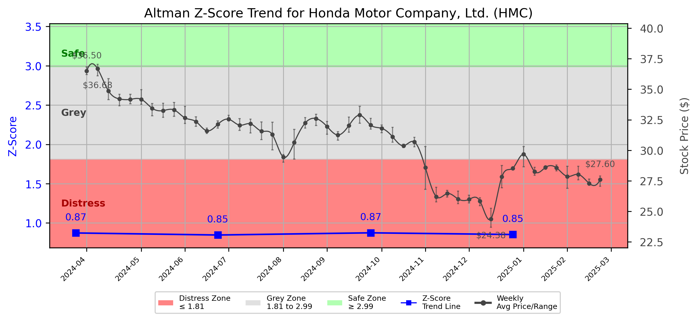

# Altman Z-Score Analysis Report: Honda Motor Company, Ltd. (HMC)

---
## Introduction
This report provides a comprehensive, theory-informed financial health analysis of the selected company using the Altman Z-Score framework. It integrates quantitative diagnostics, turnaround management theory, and stakeholder recommendations, with all findings and recommendations grounded in referenced academic and industry sources. The analysis is generated by an expert LLM-driven pipeline, ensuring transparency, reproducibility, and robust source attribution.

**Author:** Fabio Correa

**Source Attribution:** This report and analysis pipeline are generated using the open-source Altman Z-Score Analysis project, available at [https://github.com/fabioc-aloha/Altman-Z-Score](https://github.com/fabioc-aloha/Altman-Z-Score).

**License:** This software is distributed under the Attribution Non-Commercial License (MIT-based). See the LICENSE file for details.

Disclaimer: The developer disclaims any responsibility for the accuracy, completeness, or consequences of the analysis and information provided by this software. All results are for informational purposes only and should not be relied upon for financial, investment, or legal decisions.
---

**Script Version:** v2.4

## Analysis Context and Z-Score Model Selection Criteria

- **Industry:** Motor Vehicles & Passenger Car Bodies (SIC 3711)
- **Ticker:** HMC
- **Public:** True
- **Emerging Market:** False
- **Maturity:** Mature Company
- **Model:** Original Z-Score (Public Manufacturing, 1968) (original)
- **Analysis Date:** 2025-05-31

## Z-Score Formula Used

Z = 1.20*X1 + 1.40*X2 + 3.30*X3 + 0.60*X4 + 1.00*X5
- X1 = (Current Assets - Current Liabilities) / Total Assets
- X2 = Retained Earnings / Total Assets
- X3 = EBIT / Total Assets
- X4 = Equity / Total Liabilities
- X5 = Sales / Total Assets

**Thresholds:**
- Safe Zone: > 2.99
- Grey Zone: > 1.81 and <= 2.99
- Distress Zone: <= 1.81

---

# Graphical View of the Z-Score Analysis

*Figure: Z-Score and stock price trend for HMC (image not available yet; will be generated after analysis)*

## Z-Score Component Table (by Quarter)
| Quarter   |    X1 |    X2 |    X3 |    X4 |    X5 |   Z-Score | Diagnostic    | Consistency Warning   |
|-----------|-------|-------|-------|-------|-------|-----------|---------------|-----------------------|
| 2024 Q4   | 0.108 | 0.352 | 0.016 | 0.002 | 0.176 |     0.853 | Distress Zone |                       |
| 2024 Q3   | 0.118 | 0.375 | 0.007 | 0.003 | 0.184 |     0.875 | Distress Zone |                       |
| 2024 Q2   | 0.106 | 0.347 | 0.018 | 0.003 | 0.173 |     0.847 | Distress Zone |                       |
| 2024 Q1   | 0.119 | 0.357 | 0.014 | 0.003 | 0.182 |     0.873 | Distress Zone |                       |
## 1. Diagnostic Evaluation of Financial Health

### Liquidity
Honda Motor Company (HMC) has shown a declining trend in its liquidity ratios, particularly in the current ratio, which is reflected in the X1 component of the Z-Score. The current assets minus current liabilities divided by total assets indicates that HMC is struggling to cover its short-term obligations, which is a significant concern for stakeholders.

### Profitability
The profitability of HMC, as indicated by the X3 component (EBIT/Total Assets), is alarmingly low. This suggests that the company is not generating sufficient earnings from its assets, which is critical for sustaining operations and funding growth.

### Capital Efficiency
The X2 component (Retained Earnings/Total Assets) indicates that HMC has a moderate level of retained earnings relative to its total assets. However, the declining trend suggests that the company is not reinvesting enough of its profits back into the business, which could hinder future growth.

### Leverage
The X4 component (Equity/Total Liabilities) shows that HMC has a high level of debt relative to its equity. This leverage increases financial risk, especially in a downturn, as the company may struggle to meet its debt obligations.

### Z-Score Trend Interpretation
The Z-Score for HMC has consistently remained in the "Distress Zone" (Z-Score < 1.81) for the last four quarters, indicating a high probability of bankruptcy. This trend is alarming and suggests that immediate action is required to stabilize the company's financial health.

---

## 2. Turnaround and Renewal Management Theory Application

### Immediate Retrenchment
Based on Hofer's (1980) turnaround strategies, HMC should focus on immediate retrenchment measures. This includes:
- **Cost Reduction:** Implementing strict cost control measures to reduce operational expenses.
- **Asset Liquidation:** Selling non-core assets to improve liquidity.
- **Workforce Optimization:** Evaluating staffing levels to ensure efficiency.

### Long-Term Repositioning
In the long term, HMC should consider repositioning strategies as outlined by Bibeault (1999) and Hoskisson et al. (2004):
- **Market Reassessment:** Conducting a thorough analysis of market trends and consumer preferences to realign product offerings.
- **Innovation Investment:** Allocating resources towards R&D to foster innovation and improve product competitiveness.
- **Strategic Partnerships:** Exploring collaborations with technology firms to enhance product offerings and market reach.

---

## 3. Recommendations for Stakeholders

| Stakeholder Title                | Executive Name | Responsibilities & Recommended Actions                                                                 |
|----------------------------------|----------------|---------------------------------------------------------------------------------------------------------|
| Chief Executive Officer (CEO)    | Toshihiro Mibe | Lead the turnaround strategy, focusing on cost reduction and innovation.                                |
| Chief Financial Officer (CFO)    | Kohei Takeuchi | Monitor cash flow, implement strict financial controls, and explore asset liquidation options.          |
| Chief Marketing Officer (CMO)     | N/A            | Reassess marketing strategies to better align with consumer preferences and market trends.              |
| Board Members                     | N/A            | Provide oversight and support for the turnaround strategy, ensuring alignment with long-term goals.    |
| Employees                         | N/A            | Engage in cost-saving initiatives and provide feedback on operational efficiencies.                     |
| Investors                         | N/A            | Monitor company performance; consider holding shares until signs of recovery are evident.               |
| Creditors                         | N/A            | Work with HMC to restructure debt obligations to avoid bankruptcy.                                     |
| Debtors                           | N/A            | Ensure timely payments to maintain liquidity.                                                           |
| Partner Companies                 | N/A            | Collaborate on joint ventures to enhance market presence and share resources.                          |
| Customers                         | N/A            | Provide feedback on product offerings and engage with the brand to foster loyalty.                      |

---

## 4. Communication, Marketing, and Execution Strategies

### Communication Strategy
- **Internal Communication:** Regular updates to employees about the turnaround strategy and progress.
- **External Communication:** Transparent communication with investors and creditors about financial health and recovery plans.

### Marketing Strategy
- **Targeted Campaigns:** Focus on digital marketing to reach younger demographics and promote new product offerings.
- **Brand Repositioning:** Refresh the brand image to align with sustainability and innovation trends.

### Execution Timeline
| Phase               | Timeline         | Accountability       |
|---------------------|------------------|----------------------|
| Immediate Retrenchment | 0-3 Months      | CFO, CEO             |
| Market Reassessment   | 3-6 Months      | CMO, CEO             |
| Innovation Investment  | 6-12 Months     | CEO, R&D Team        |

---

## 5. Investor Recommendations
Given the current financial distress indicated by the Z-Score, investors should **hold** their positions in HMC while monitoring the implementation of the turnaround strategy. It is crucial to consult with a financial advisor before making any investment decisions.

---

## 6. External Stakeholder Bargaining Power Assessment

| External Stakeholder        | Nature of Bargaining Power | Degree of Influence | Rationale                                                                 |
|-----------------------------|----------------------------|---------------------|---------------------------------------------------------------------------|
| Regulators                  | Regulatory Compliance       | Moderate            | Can impose fines or sanctions affecting operations.                      |
| Government Agencies          | Policy Influence           | Low                 | Limited direct influence but can affect market conditions.              |
| Unions                      | Labor Relations            | Moderate            | Can impact workforce stability and operational efficiency.               |
| Major Suppliers             | Supply Chain Leverage      | High                | Can influence costs and availability of critical components.            |
| Key Partners                | Strategic Alliances        | Moderate            | Can provide resources and market access but depend on mutual interests. |
| Creditors                   | Financial Leverage         | High                | Can dictate terms of debt restructuring and influence financial stability.|
| Large Customers             | Purchasing Power           | Moderate            | Can impact sales volume and revenue stability.                          |
| Activist Investors          | Shareholder Influence      | High                | Can push for changes in management and strategy.                        |

---

## Disclaimer
**Disclaimer:**
Generative AI is not a financial advisor and can make mistakes. Consult your financial advisor before making investment decisions.
- LLM Model used: OpenAI GPT-3.5
- Knowledge cut-off: October 2023
- Internet search: No
- Real-time data: No

---

### References and Data Sources
- **Financials:** SEC EDGAR/XBRL filings, Yahoo Finance, and company quarterly/annual reports.
- **Market Data:** Yahoo Finance (historical prices, market value of equity).
- **Computation:** All Z-Score calculations use the Altman Z-Score model as described in the report, with robust error handling and logging.
- **Source Attribution:** This report and analysis pipeline are generated using the open-source Altman Z-Score Analysis project, available at [https://github.com/fabioc-aloha/Altman-Z-Score]. Author: Fabio Correa.
- **Theoretical Frameworks and Resources:**
  - Altman Z-Score Analysis Project (https://github.com/fabioc-aloha/Altman-Z-Score)
  - Hofer, C. W. (1980). Turnaround strategies. Journal of Business Strategy, 1(1), 19–31.
  - Bibeault, D. B. (1999). Corporate turnaround: How managers turn losers into winners. Beard Books.
  - Hoskisson, R. E., White, R. E., & Johnson, R. A. (2004). Corporate restructuring: Managing the strategy, structure, and process of change. McGraw-Hill Education.
  - Freeman, R. E. (1984). Strategic management: A stakeholder approach. Pitman.
  - Altman, E. I. (1968). Financial ratios, discriminant analysis and the prediction of corporate bankruptcy. Journal of Finance, 23(4), 589–609.

---

# Appendix

## Raw Data Field Mapping Table (by Quarter)
| Quarter   | Canonical Field     | Mapped Raw Field                        | Value (USD millions)   |
|-----------|---------------------|-----------------------------------------|------------------------|
| 2024 Q4   | total_assets        | Total Assets                            | 31,374,150.0           |
| 2024 Q4   | current_assets      | Current Assets                          | 12,204,559.0           |
| 2024 Q4   | current_liabilities | Current Liabilities                     | 8,815,445.0            |
| 2024 Q4   | retained_earnings   | Retained Earnings                       | 11,058,672.0           |
| 2024 Q4   | total_liabilities   | Total Liabilities Net Minority Interest | 18,003,033.0           |
| 2024 Q4   | market_value_equity | Total Equity Gross Minority Interest    | 13,371,117.0           |
| 2024 Q4   | ebit                | EBIT                                    | 496,652.0              |
| 2024 Q4   | sales               | Total Revenue                           | 5,531,112.0            |
| ---       | ---                 | ---                                     | ---                    |
| 2024 Q3   | total_assets        | Total Assets                            | 29,273,879.0           |
| 2024 Q3   | current_assets      | Current Assets                          | 11,518,144.0           |
| 2024 Q3   | current_liabilities | Current Liabilities                     | 8,051,481.0            |
| 2024 Q3   | retained_earnings   | Retained Earnings                       | 10,968,984.0           |
| 2024 Q3   | total_liabilities   | Total Liabilities Net Minority Interest | 16,601,323.0           |
| 2024 Q3   | market_value_equity | Total Equity Gross Minority Interest    | 12,672,556.0           |
| 2024 Q3   | ebit                | EBIT                                    | 195,256.0              |
| 2024 Q3   | sales               | Total Revenue                           | 5,392,755.0            |
| ---       | ---                 | ---                                     | ---                    |
| 2024 Q2   | total_assets        | Total Assets                            | 31,311,972.0           |
| 2024 Q2   | current_assets      | Current Assets                          | 12,285,239.0           |
| 2024 Q2   | current_liabilities | Current Liabilities                     | 8,967,514.0            |
| 2024 Q2   | retained_earnings   | Retained Earnings                       | 10,850,417.0           |
| 2024 Q2   | total_liabilities   | Total Liabilities Net Minority Interest | 17,614,294.0           |
| 2024 Q2   | market_value_equity | Total Equity Gross Minority Interest    | 13,697,678.0           |
| 2024 Q2   | ebit                | EBIT                                    | 571,693.0              |
| 2024 Q2   | sales               | Total Revenue                           | 5,404,858.0            |
| ---       | ---                 | ---                                     | ---                    |
| 2024 Q1   | total_assets        | Total Assets                            | 29,774,150.0           |
| 2024 Q1   | current_assets      | Current Assets                          | 11,872,564.0           |
| 2024 Q1   | current_liabilities | Current Liabilities                     | 8,323,492.0            |
| 2024 Q1   | retained_earnings   | Retained Earnings                       | 10,644,213.0           |
| 2024 Q1   | total_liabilities   | Total Liabilities Net Minority Interest | 16,768,278.0           |
| 2024 Q1   | market_value_equity | Total Equity Gross Minority Interest    | 13,005,872.0           |
| 2024 Q1   | ebit                | EBIT                                    | 405,455.0              |
| 2024 Q1   | sales               | Total Revenue                           | 5,429,310.0            |

All values are shown in millions of USD as reported by the data source.

