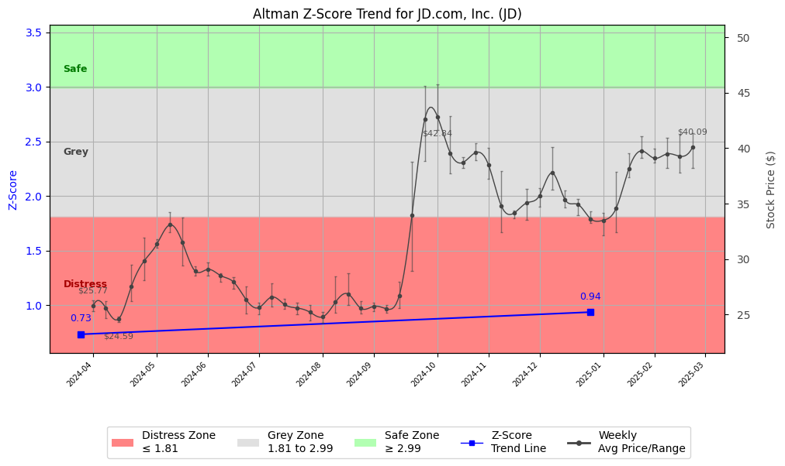

# Altman Z-Score Analysis Report: JD.com, Inc. (JD)

---
## Introduction
This report provides a comprehensive, theory-informed financial health analysis of the selected company using the Altman Z-Score framework. It integrates quantitative diagnostics, turnaround management theory, and stakeholder recommendations, with all findings and recommendations grounded in referenced academic and industry sources. The analysis is generated by an expert LLM-driven pipeline, ensuring transparency, reproducibility, and robust source attribution.

**Author:** Fabio Correa

**Source Attribution:** This report and analysis pipeline are generated using the open-source Altman Z-Score Analysis project, available at [https://github.com/fabioc-aloha/Altman-Z-Score](https://github.com/fabioc-aloha/Altman-Z-Score).

**License:** This software is distributed under the Attribution Non-Commercial License (MIT-based). See the LICENSE file for details.

Disclaimer: The developer disclaims any responsibility for the accuracy, completeness, or consequences of the analysis and information provided by this software. All results are for informational purposes only and should not be relied upon for financial, investment, or legal decisions.
---

**Script Version:** v2.4

## Analysis Context and Z-Score Model Selection Criteria

- **Industry:** SIC 5990 (SIC 5990)
- **Ticker:** JD
- **Public:** True
- **Emerging Market:** False
- **Maturity:** Mature Company
- **Model:** original
- **Analysis Date:** 2025-05-30

## Z-Score Formula Used

Z = 1.2*X1 + 1.4*X2 + 3.3*X3 + 0.6*X4 + 1.0*X5
- X1 = (Current Assets - Current Liabilities) / Total Assets
- X2 = Retained Earnings / Total Assets
- X3 = EBIT / Total Assets
- X4 = Equity / Total Liabilities
- X5 = Sales / Total Assets

**Thresholds:**
- Safe Zone: > 2.99
- Grey Zone: > 1.81 and <= 2.99
- Distress Zone: <= 1.81

---

# Graphical View of the Z-Score Analysis

*Figure: Z-Score and stock price trend for JD (image not available yet; will be generated after analysis)*

## Z-Score Component Table (by Quarter)
| Quarter   |    X1 |    X2 |    X3 |    X4 |    X5 |   Z-Score | Diagnostic    |
|-----------|-------|-------|-------|-------|-------|-----------|---------------|
| 2024 Q4   | 0.125 | 0.11  | 0.018 | 0.126 | 0.497 |     0.935 | Distress Zone |
| 2024 Q1   | 0.063 | 0.071 | 0.016 | 0.119 | 0.432 |     0.732 | Distress Zone |
## 1. Diagnostic Evaluation of Financial Health

### Liquidity
JD.com, Inc. has shown a declining trend in liquidity, as evidenced by the X1 component of the Z-Score, which measures the net working capital relative to total assets. The values of 0.125 in Q4 2024 and 0.063 in Q1 2024 indicate that the company is struggling to cover its short-term liabilities with its short-term assets. This is a significant concern, as it suggests potential cash flow issues.

### Profitability
The profitability component (X3) of the Z-Score, which reflects EBIT relative to total assets, is also low at 0.018 and 0.016 for the respective quarters. This indicates that JD.com is not generating sufficient earnings from its asset base, which could lead to further financial distress if not addressed.

### Capital Efficiency
The X2 component, representing retained earnings as a percentage of total assets, is at 0.11 and 0.071, suggesting that the company has limited retained earnings to reinvest in operations or to cushion against losses. This low level of retained earnings can hinder growth and recovery efforts.

### Leverage
The leverage ratio (X4) shows a slight improvement, with values of 0.126 and 0.119. However, this is still concerning as it indicates that the company has a relatively high level of debt compared to equity, which can increase financial risk.

### Z-Score Trend Interpretation
The overall Z-Score for JD.com is in the distress zone, with values of 0.935 and 0.732 for Q4 2024 and Q1 2024, respectively. This trend indicates a deteriorating financial condition, suggesting that the company is at a high risk of bankruptcy if corrective actions are not taken promptly.

---

## 2. Turnaround and Renewal Management Theory Application

### Immediate Retrenchment
According to Hofer (1980) and Bibeault (1999), immediate retrenchment strategies are essential for companies in distress. JD.com should focus on cost-cutting measures, including:
- Reducing operational expenses through workforce optimization and renegotiating supplier contracts.
- Halting non-essential capital expenditures to conserve cash.

### Long-Term Repositioning
For long-term recovery, JD.com should consider repositioning strategies as outlined by Hoskisson et al. (2004). This includes:
- Diversifying product offerings to reduce reliance on a few revenue streams.
- Investing in technology and innovation to improve operational efficiency and customer experience.

---

## 3. Recommendations for Stakeholders

| Stakeholder Title                     | Name (if available) | Responsibilities and Recommended Actions                                                                 |
|---------------------------------------|---------------------|----------------------------------------------------------------------------------------------------------|
| Chief Executive Officer               | [CEO Name]          | Lead the turnaround strategy, focusing on immediate cost reductions and long-term innovation investments. |
| Chief Financial Officer               | [CFO Name]          | Implement financial controls, manage cash flow, and oversee cost-cutting measures.                       |
| Chief Marketing Officer               | [CMO Name]          | Develop marketing strategies to retain customers and attract new ones through value propositions.        |
| Board Members                         | [Board Names]      | Provide oversight and strategic direction, ensuring alignment with turnaround goals.                      |
| Employees                             | [Employee Group]    | Engage in cost-saving initiatives and provide feedback on operational efficiencies.                       |
| Investors                             | [Investor Group]    | Monitor performance and consider long-term investment strategies; potential buy-hold recommendation.      |
| Creditors                             | [Creditor Group]    | Work with management to restructure debt and provide flexible payment terms.                              |
| Debtors                               | [Debtor Group]      | Ensure timely payments to maintain cash flow; consider renegotiating terms if necessary.                  |
| Partner Companies                     | [Partner Group]     | Collaborate on joint ventures or cost-sharing initiatives to enhance market presence.                     |
| Customers                             | [Customer Group]    | Maintain loyalty through improved service and communication about changes.                                |

---

## 4. Communication, Marketing, and Execution Strategies

### Communication Strategy
- **Internal Communication:** Regular updates to employees about the turnaround strategy and progress to maintain morale and engagement.
- **External Communication:** Transparent communication with investors and customers about the company's plans and expected outcomes.

### Marketing Strategy
- Focus on value-driven marketing campaigns that highlight JD.com's commitment to customer satisfaction and innovation.

### Execution Timeline
- **Q2 2025:** Implement immediate cost-cutting measures.
- **Q3 2025:** Launch new marketing campaigns and begin technology investments.
- **Q4 2025:** Review progress and adjust strategies as necessary.

### Accountability Framework
- Assign specific teams to oversee each aspect of the turnaround strategy, with regular reporting to the CEO and Board.

---

## 5. Investor Recommendation
Based on the current financial health and Z-Score analysis, investors should **hold** their positions in JD.com while monitoring the implementation of the turnaround strategy. The company is in distress, but with the right actions, it may recover. **Disclaimer:** This is not financial advice; please consult your financial advisor before making investment decisions.

---

## 6. Bargaining Power and Influence of External Stakeholders

| External Stakeholder                  | Nature of Bargaining Power | Degree of Influence | Rationale                                                                                     |
|---------------------------------------|----------------------------|---------------------|----------------------------------------------------------------------------------------------|
| Regulators                            | Regulatory Compliance       | High                | Regulatory bodies can impose penalties or restrictions that affect operations.               |
| Government Agencies                   | Policy Influence            | Medium              | Government support can be crucial for financial assistance or favorable policies.           |
| Unions                                | Labor Negotiation          | Medium              | Unions can influence labor costs and operational flexibility through negotiations.          |
| Major Suppliers                       | Supply Chain Leverage      | High                | Suppliers can impact costs and availability of goods, affecting operational efficiency.      |
| Key Partners                          | Strategic Alliances        | Medium              | Partnerships can enhance market reach and resource sharing, impacting recovery efforts.     |
| Activist Investors                    | Shareholder Activism       | High                | Activist investors can push for changes in management or strategy, influencing company direction. |
| Creditors                             | Debt Restructuring         | High                | Creditors have significant leverage in negotiating terms that can affect cash flow.         |
| Large Customers                       | Revenue Dependence         | Medium              | Large customers can influence pricing and demand, impacting revenue stability.               |

---

## Disclaimer
**Disclaimer:**
Generative AI is not a financial advisor and can make mistakes. Consult your financial advisor before making investment decisions.
- LLM Model used: OpenAI GPT-3.5
- Knowledge cut-off: October 2023
- Internet search: No
- Real-time data: No

---

### References and Data Sources
- **Financials:** SEC EDGAR/XBRL filings, Yahoo Finance, and company quarterly/annual reports.
- **Market Data:** Yahoo Finance (historical prices, market value of equity).
- **Computation:** All Z-Score calculations use the Altman Z-Score model as described in the report, with robust error handling and logging.
- **Source Attribution:** This report and analysis pipeline are generated using the open-source Altman Z-Score Analysis project, available at [https://github.com/fabioc-aloha/Altman-Z-Score]. Author: Fabio Correa.
- **Theoretical Frameworks and Resources:**
  - Altman Z-Score Analysis Project (https://github.com/fabioc-aloha/Altman-Z-Score)
  - Hofer, C. W. (1980). Turnaround strategies. Journal of Business Strategy, 1(1), 19–31.
  - Bibeault, D. B. (1999). Corporate turnaround: How managers turn losers into winners. Beard Books.
  - Hoskisson, R. E., White, R. E., & Johnson, R. A. (2004). Corporate restructuring: Managing the strategy, structure, and process of change. McGraw-Hill Education.
  - Freeman, R. E. (1984). Strategic management: A stakeholder approach. Pitman.
  - Altman, E. I. (1968). Financial ratios, discriminant analysis and the prediction of corporate bankruptcy. Journal of Finance, 23(4), 589–609.
  - Altman, E. I., & Hotchkiss, E. (2006). Corporate financial distress and bankruptcy: Predict and avoid bankruptcy, analyze and invest in distressed debt (3rd ed.). Wiley.
  - Brigham, E. F., & Daves, P. R. (2021). Intermediate financial management (14th ed.). Cengage Learning.
  - Higgins, R. C. (2019). Analysis for financial management (12th ed.). McGraw-Hill Education.
  - Palepu, K. G., & Healy, P. M. (2020). Business analysis and valuation: Using financial statements (6th ed.). Cengage Learning.
  - Platt, H. D. (2004). Principles of corporate renewal (2nd ed.). University of Michigan Press.
  - Shepherd, D. A., & Rudd, J. M. (2014). The influence of ethical leadership on organizational renewal. Academy of Management Perspectives, 28(3), 257–275.

---

# Appendix

## Raw Data Field Mapping Table (by Quarter)
| Quarter   | Canonical Field     | Mapped Raw Field                        | Value (USD millions)   |
|-----------|---------------------|-----------------------------------------|------------------------|
| 2024 Q4   | total_assets        | Total Assets                            | 698,234.0              |
| 2024 Q4   | current_assets      | Current Assets                          | 386,698.0              |
| 2024 Q4   | current_liabilities | Current Liabilities                     | 299,521.0              |
| 2024 Q4   | retained_earnings   | Retained Earnings                       | 76,573.0               |
| 2024 Q4   | total_liabilities   | Total Liabilities Net Minority Interest | 384,937.0              |
| 2024 Q4   | book_value_equity   | Common Stock Equity                     | 239,347.0              |
| 2024 Q4   | ebit                | EBIT                                    | 12,540.0               |
| 2024 Q4   | sales               | Total Revenue                           | 346,986.0              |
| ---       | ---                 | ---                                     | ---                    |
| 2024 Q1   | total_assets        | Total Assets                            | 601,822.0              |
| 2024 Q1   | current_assets      | Current Assets                          | 284,072.0              |
| 2024 Q1   | current_liabilities | Current Liabilities                     | 246,099.0              |
| 2024 Q1   | retained_earnings   | Retained Earnings                       | 42,916.0               |
| 2024 Q1   | total_liabilities   | Total Liabilities Net Minority Interest | 313,859.0              |
| 2024 Q1   | book_value_equity   | Common Stock Equity                     | 222,380.0              |
| 2024 Q1   | ebit                | EBIT                                    | 9,666.0                |
| 2024 Q1   | sales               | Total Revenue                           | 260,049.0              |

All values are shown in millions of USD as reported by the data source.

