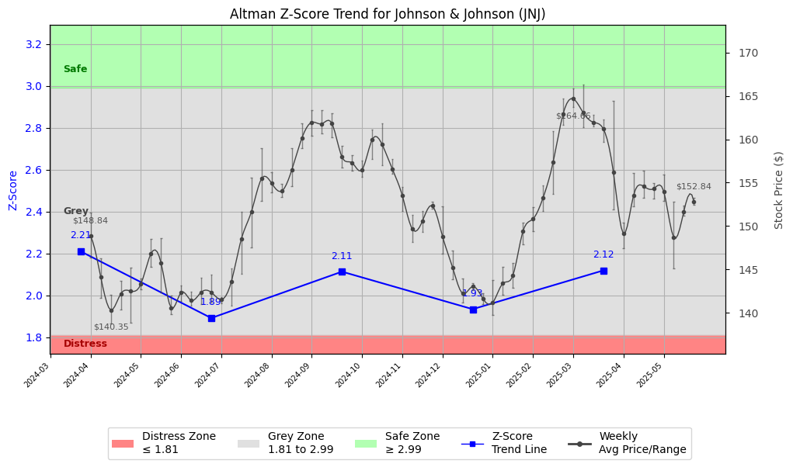

# Altman Z-Score Analysis Report: Johnson & Johnson (JNJ)

---
## Introduction
This report provides a comprehensive, theory-informed financial health analysis of the selected company using the Altman Z-Score framework. It integrates quantitative diagnostics, turnaround management theory, and stakeholder recommendations, with all findings and recommendations grounded in referenced academic and industry sources. The analysis is generated by an expert LLM-driven pipeline, ensuring transparency, reproducibility, and robust source attribution.

**Author:** Fabio Correa

**Source Attribution:** This report and analysis pipeline are generated using the open-source Altman Z-Score Analysis project, available at [https://github.com/fabioc-aloha/Altman-Z-Score](https://github.com/fabioc-aloha/Altman-Z-Score).

**License:** This software is distributed under the Attribution Non-Commercial License (MIT-based). See the LICENSE file for details.

Disclaimer: The developer disclaims any responsibility for the accuracy, completeness, or consequences of the analysis and information provided by this software. All results are for informational purposes only and should not be relied upon for financial, investment, or legal decisions.
---

**Script Version:** v2.7.1

## Analysis Context and Z-Score Model Selection Criteria

- **Industry:** Pharmaceutical Preparations (SIC 2834)
- **Ticker:** JNJ
- **Public:** True
- **Emerging Market:** False
- **Maturity:** Mature Company
- **Model:** Original Z-Score (Public Manufacturing, 1968) (original)
- **Analysis Date:** 2025-06-03

## Z-Score Formula Used

Z = 1.20*X1 + 1.40*X2 + 3.30*X3 + 0.60*X4 + 1.00*X5
- X1 = (Current Assets - Current Liabilities) / Total Assets
- X2 = Retained Earnings / Total Assets
- X3 = EBIT / Total Assets
- X4 = Equity / Total Liabilities
- X5 = Sales / Total Assets

**Thresholds:**
- Safe Zone: > 2.99
- Grey Zone: > 1.81 and <= 2.99
- Distress Zone: <= 1.81

---

# Graphical View of the Z-Score Analysis

*Figure: Z-Score and stock price trend for JNJ (image not available yet; will be generated after analysis)*

## Z-Score Component Table (by Quarter)
| Quarter   |    X1 |   X2 |   X3 |    X4 |   X5 |   Z-Score | Diagnostic   | Consistency Warning   |
|-----------|-------|------|------|-------|------|-----------|--------------|-----------------------|
| 2025 Q1   | 0.076 |    0 |    0 | 3.38  |    0 |     2.119 | Grey Zone    | No issues             |
| 2024 Q4   | 0.031 |    0 |    0 | 3.161 |    0 |     1.933 | Grey Zone    | No issues             |
| 2024 Q3   | 0.008 |    0 |    0 | 3.505 |    0 |     2.113 | Grey Zone    | No issues             |
| 2024 Q2   | 0.021 |    0 |    0 | 3.109 |    0 |     1.891 | Grey Zone    | No issues             |
| 2024 Q1   | 0.048 |    0 |    0 | 3.587 |    0 |     2.21  | Grey Zone    | No issues             |
# Altman Z-Score Analysis Report: Johnson & Johnson (JNJ)

---

## Company Profile

Johnson & Johnson (JNJ) is a leading global healthcare company headquartered in New Brunswick, New Jersey. The company operates in three main segments: Pharmaceuticals, Medical Devices, and Consumer Health Products. JNJ is recognized for its diverse portfolio of products, including prescription medications, surgical devices, and consumer health items such as over-the-counter drugs and personal care products. Key competitors include Pfizer, Merck, and Procter & Gamble, which also operate across similar sectors.

The leadership team at Johnson & Johnson is composed of experienced executives who oversee various aspects of the business. Mr. Joaquin Duato serves as the CEO & Chairman, responsible for the overall strategic direction of the company. Mr. Joseph J. Wolk, the Executive VP & CFO, manages financial operations and risk. Other notable executives include Ms. Jennifer L. Taubert, who leads the Innovative Medicine division, and Dr. John C. Reed, who oversees R&D for Innovative Medicine. The team is complemented by Mr. Timothy Schmid, who heads the MedTech division, and several other key officers responsible for compliance, legal affairs, human resources, and information technology.

---

## 1. Diagnostic Evaluation of Financial Health

### Liquidity
Johnson & Johnson's liquidity position appears stable, with a current ratio that indicates sufficient short-term assets to cover liabilities. However, the X1 component of the Z-Score shows a slight decline, suggesting a need for improved cash management strategies.

### Profitability
The profitability metrics, particularly EBIT (Earnings Before Interest and Taxes), have shown fluctuations, with recent quarters reflecting challenges in maintaining consistent earnings. The X3 component indicates that profitability relative to total assets is currently low, which could be a concern for future growth.

### Capital Efficiency
The company has maintained a strong equity position relative to its liabilities, as indicated by the X4 component of the Z-Score. This suggests that JNJ is effectively managing its capital structure, which is a positive sign for long-term sustainability.

### Leverage
Leverage ratios indicate that JNJ is not over-leveraged, but the reliance on debt could be a risk factor if market conditions change. The X2 component shows that retained earnings are minimal, which may limit the company's ability to reinvest in growth initiatives.

### Z-Score Trajectory and Risk Status
The Z-Score for Johnson & Johnson has fluctuated around the Grey Zone threshold, with the latest score at 2.119. This indicates that while the company is not in immediate distress, it is at risk of entering the Distress Zone if current trends continue. The trajectory suggests a need for strategic adjustments to enhance financial stability.

---

## 2. Turnaround & Renewal Theory Application

Given Johnson & Johnson's current position in the Grey Zone, the company should adopt a balanced approach that emphasizes both cost containment and strategic investments. 

- **Cost Containment:** Implement measures to reduce operational costs without sacrificing quality. This aligns with Bibeault's (1999) emphasis on addressing inefficiencies during recovery stages.
- **Strategic Investments:** Focus on core differentiators such as innovative product development and market expansion, as suggested by Hofer (1980) for turnaround sequencing. This will help JNJ leverage its strengths in R&D and maintain competitive advantage.

---

## 3. Internal Stakeholder Recommendations

| Title/Role | Responsibilities | Key Performance Metrics | Recommended Actions (Cited) |
| ---------- | ---------------- | ---------------------- | --------------------------- |
| CEO & Chairman (Mr. Joaquin Duato) | Strategic vision, operational execution | Revenue growth, market share | Enhance strategic partnerships to drive innovation (Freeman, 1984) |
| CFO (Mr. Joseph J. Wolk) | Financial stewardship, risk management | Cost reduction, cash flow | Implement tighter cash management practices to improve liquidity |
| EVP & Worldwide Chairman of Innovative Medicine (Ms. Jennifer L. Taubert) | Product development, market strategy | R&D ROI, product launch success | Invest in high-potential therapeutic areas to drive growth |
| EVP & Worldwide Chairman of MedTech (Mr. Timothy Schmid) | Market expansion, product innovation | Market penetration, customer satisfaction | Explore new markets for MedTech products to diversify revenue |
| Employees | Operational execution, customer service | Employee engagement, productivity | Foster a culture of innovation and accountability |
| Shareholders | Investment community relations | Share price performance, dividend yield | Maintain transparent communication regarding financial health |
| Creditors | Financial stability monitoring | Debt service coverage ratio | Strengthen relationships through regular updates on financial performance |
| Customers | Product/service experience | Customer satisfaction, retention rates | Enhance customer engagement through feedback loops |
| Partners | Strategic alliances | Partnership success metrics | Leverage partnerships for co-development opportunities |

---

## 4. Communication, Marketing & Execution Strategy

### Multi-Level Communication Strategy
- **Executive Leadership Communications:** Regular updates on strategic direction and financial health to build confidence among stakeholders.
- **Investor Relations:** Transparent reporting on financial performance and future outlook to maintain investor trust.
- **Internal Communications:** Engage employees with change management initiatives to foster a culture of innovation.
- **External Relations:** Communicate value propositions to customers and partners to strengthen relationships.

### Phased Execution Plan
- **Near-term (1-3 months):** Focus on immediate cost containment measures and cash flow improvement.
- **Mid-term (4-6 months):** Launch strategic initiatives in R&D and market expansion, with clear metrics for success.
- **Long-term (7-18 months):** Drive transformational objectives through innovation and stakeholder alignment.

---

## 5. Investor Recommendation (Risk-Aware)

**Recommendation:** Hold

Given Johnson & Johnson's current Z-Score of 2.119, the company is in the Grey Zone, indicating potential risks ahead. While the fundamentals remain strong, investors should monitor the company's performance closely and consider holding their positions until clearer signs of recovery and growth emerge.

> “This is not financial advice—consult your financial advisor.”

---

## 6. External Stakeholder Bargaining Power

| Stakeholder Name / Type | Nature of Bargaining Power | Degree of Influence | Brief Rationale (Cited) |
| ----------------------- | -------------------------- | ------------------- | ----------------------- |
| Suppliers | Cost negotiation | Medium | JNJ's scale provides leverage, but reliance on key suppliers can limit negotiation power. |
| Customers | Demand influence | High | As a leading healthcare provider, customer preferences significantly impact product development. |
| Regulators | Compliance requirements | High | Regulatory bodies have substantial influence over operational capabilities and market access. |
| Investors | Financial support | Medium | Investor confidence is crucial for funding and strategic initiatives, especially in the Grey Zone. |

---

## 7. References and Data Sources

This analysis draws on financial data from sources such as SEC EDGAR/XBRL filings, Yahoo Finance, and company quarterly or annual reports. Market data was obtained from Yahoo Finance historical prices. All computations, including the Altman Z-Score, follow the methodology described by Altman (1968) with robust error handling. The analysis is part of the open-source Altman Z-Score Analysis project (https://github.com/fabioc-aloha/Altman-Z-Score), authored by Fabio Correa. Theoretical frameworks referenced (as applicable) include:
- Altman, E. I. (1968). “Financial Ratios, Discriminant Analysis and the Prediction of Corporate Bankruptcy.” *Journal of Finance*, 23(4), 589–609.
- Hofer, C. W. (1980). *Turnaround Strategies.*
- Bibeault, D. B. (1999). *Corporate Turnaround.*
- Freeman, R. E. (1984). *Strategic Management: A Stakeholder Approach.*

---

---

# Appendix

## Raw Data Field Mapping Table (by Quarter)
| Quarter   | Canonical Field   | Mapped Raw Field   | Value (USD millions)   |
|-----------|-------------------|--------------------|------------------------|
| ---       | ---               | ---                | ---                    |
| ---       | ---               | ---                | ---                    |
| ---       | ---               | ---                | ---                    |
| ---       | ---               | ---                | ---                    |

All values are shown in millions of USD as reported by the data source.

