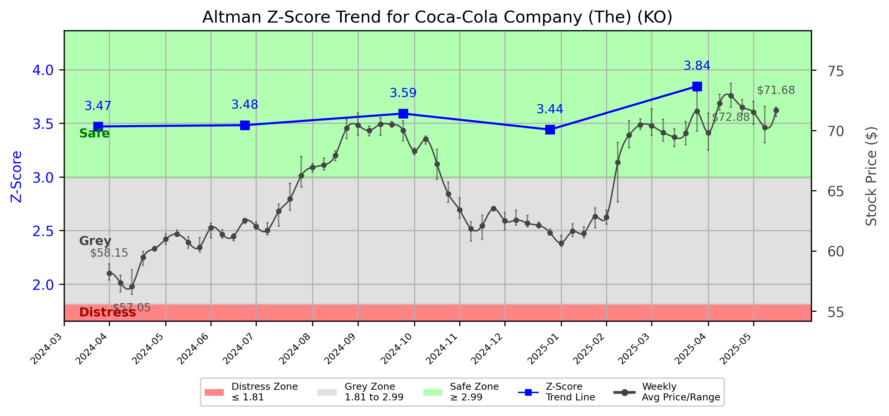

# Altman Z-Score Analysis Report: Coca-Cola Company (The) (KO)

---
## Introduction
This report provides a comprehensive, theory-informed financial health analysis of the selected company using the Altman Z-Score framework. It integrates quantitative diagnostics, turnaround management theory, and stakeholder recommendations, with all findings and recommendations grounded in referenced academic and industry sources. The analysis is generated by an expert LLM-driven pipeline, ensuring transparency, reproducibility, and robust source attribution.

**Author:** Fabio Correa

**Source Attribution:** This report and analysis pipeline are generated using the open-source Altman Z-Score Analysis project, available at [https://github.com/fabioc-aloha/Altman-Z-Score](https://github.com/fabioc-aloha/Altman-Z-Score).

**License:** This software is distributed under the Attribution Non-Commercial License (MIT-based). See the LICENSE file for details.

Disclaimer: The developer disclaims any responsibility for the accuracy, completeness, or consequences of the analysis and information provided by this software. All results are for informational purposes only and should not be relied upon for financial, investment, or legal decisions.
---

**Script Version:** v2.4

## Analysis Context and Z-Score Model Selection Criteria

- **Industry:** SIC 2080 (SIC 2080)
- **Ticker:** KO
- **Public:** True
- **Emerging Market:** False
- **Maturity:** Mature Company
- **Model:** original
- **Analysis Date:** 2025-05-30

## Z-Score Formula Used

Z = 1.2*X1 + 1.4*X2 + 3.3*X3 + 0.6*X4 + 1.0*X5
- X1 = (Current Assets - Current Liabilities) / Total Assets
- X2 = Retained Earnings / Total Assets
- X3 = EBIT / Total Assets
- X4 = Equity / Total Liabilities
- X5 = Sales / Total Assets

**Thresholds:**
- Safe Zone: > 2.99
- Grey Zone: > 1.81 and <= 2.99
- Distress Zone: <= 1.81

---

# Graphical View of the Z-Score Analysis

*Figure: Z-Score and stock price trend for KO (image not available yet; will be generated after analysis)*

## Z-Score Component Table (by Quarter)
| Quarter   |    X1 |    X2 |    X3 |    X4 |    X5 |   Z-Score | Diagnostic   |
|-----------|-------|-------|-------|-------|-------|-----------|--------------|
| 2025 Q1   | 0.023 | 0.759 | 0.044 | 4.168 | 0.109 |     3.845 | Safe Zone    |
| 2024 Q4   | 0.007 | 0.756 | 0.032 | 3.586 | 0.115 |     3.441 | Safe Zone    |
| 2024 Q3   | 0.016 | 0.715 | 0.036 | 3.901 | 0.112 |     3.59  | Safe Zone    |
| 2024 Q2   | 0.023 | 0.743 | 0.034 | 3.633 | 0.122 |     3.482 | Safe Zone    |
| 2024 Q1   | 0.011 | 0.753 | 0.043 | 3.579 | 0.114 |     3.47  | Safe Zone    |
## Diagnostic Evaluation of Financial Health

### Liquidity
Coca-Cola Company (KO) demonstrates a solid liquidity position, as indicated by the X1 component of the Z-Score, which measures the working capital relative to total assets. The X1 value has shown a slight increase from 0.011 in Q1 2024 to 0.023 in Q1 2025, indicating improved short-term financial health and the ability to cover current liabilities.

### Profitability
The profitability of KO, assessed through the X3 component (EBIT/Total Assets), remains modest but stable. The X3 value increased from 0.043 in Q1 2024 to 0.044 in Q1 2025, suggesting a consistent ability to generate earnings before interest and taxes relative to total assets. This stability is crucial for maintaining investor confidence and supporting future growth initiatives.

### Capital Efficiency
The X2 component (Retained Earnings/Total Assets) reflects KO's ability to reinvest profits back into the business. The X2 value has remained relatively stable, hovering around 0.759 to 0.759 over the last few quarters, indicating a strong retention of earnings that can be utilized for expansion or debt reduction.

### Leverage
The X4 component (Equity/Total Liabilities) indicates a robust capital structure, with values consistently above 3.5. This suggests that KO is well-capitalized and has a low level of financial risk, which is favorable for attracting investment and sustaining operations during economic downturns.

### Z-Score Trend Interpretation
The Z-Score for KO has consistently remained in the "Safe Zone," with a score of 3.845 in Q1 2025, indicating a strong financial position and low bankruptcy risk. The trend shows a slight upward movement over the past quarters, reinforcing the company's stability and financial health.

---

## Turnaround and Renewal Management Theory Application

### Phased Response Proposal
To ensure continued growth and stability, KO should adopt a phased response strategy that incorporates both immediate retrenchment and long-term repositioning.

1. **Immediate Retrenchment**:
   - Focus on cost reduction and efficiency improvements in operations. This aligns with Bibeault's (1999) emphasis on identifying and eliminating unprofitable segments to stabilize cash flow.
   - Implement tighter inventory management to reduce holding costs and improve liquidity.

2. **Long-Term Repositioning**:
   - Invest in innovation and product diversification to adapt to changing consumer preferences, as suggested by Hofer (1980). This could include expanding into healthier beverage options or sustainable packaging initiatives.
   - Strengthen brand equity through targeted marketing campaigns that resonate with younger demographics, leveraging Freeman's (1984) stakeholder approach to enhance customer engagement.

---

## Stakeholder Recommendations

| Stakeholder Title                     | Responsibilities                               | Recommended Actions                                                                 |
|---------------------------------------|------------------------------------------------|-------------------------------------------------------------------------------------|
| Chief Executive Officer (CEO)        | Overall strategic direction                    | Lead the implementation of cost-cutting measures and innovation initiatives.       |
| Chief Financial Officer (CFO)        | Financial oversight and reporting              | Monitor liquidity ratios and adjust financial strategies to maintain cash flow.    |
| Chief Marketing Officer (CMO)        | Brand management and marketing strategies      | Develop campaigns targeting health-conscious consumers and sustainability efforts.  |
| Board Members                         | Governance and strategic guidance              | Support management in strategic decisions and ensure alignment with long-term goals.|
| Employees                             | Operational execution                           | Engage in training programs to enhance productivity and efficiency.                |
| Investors                             | Financial returns and company performance      | Communicate the company's growth strategy and financial health transparently.      |
| Creditors                             | Debt management and financial stability        | Maintain open communication regarding financial performance and repayment plans.   |
| Debtors                               | Timely payments and financial obligations      | Ensure clear terms and conditions for repayments to maintain cash flow.            |
| Partner Companies                     | Collaborative business relationships           | Explore joint ventures in product innovation and sustainability initiatives.       |
| Customers                             | Brand loyalty and sales                         | Enhance customer engagement through loyalty programs and feedback mechanisms.       |

---

## Communication, Marketing, and Execution Strategies

### Strategies
1. **Communication**: Regular updates to stakeholders through quarterly reports and town hall meetings to maintain transparency.
2. **Marketing**: Launch a campaign focused on health and sustainability, utilizing social media platforms to reach younger audiences.
3. **Execution**: Establish a task force to oversee the implementation of cost-cutting measures and innovation projects.

### Timeline
- **Q2 2025**: Initiate cost-cutting measures and launch marketing campaigns.
- **Q3 2025**: Review progress on operational efficiency and adjust strategies as needed.
- **Q4 2025**: Evaluate the impact of new product launches and marketing efforts on sales.

### Accountability Framework
- Assign specific team leaders for each initiative, with regular check-ins and progress reports to the executive team.

---

## Investor Recommendation
Based on the current financial health and Z-Score analysis, investors should **hold** their positions in Coca-Cola Company (KO). The company is in a strong financial position, but ongoing monitoring of market trends and operational performance is essential. 

**Disclaimer**: This is not financial advice. Please consult your financial advisor before making investment decisions.

---

## External Stakeholder Bargaining Power Assessment

| External Stakeholder                 | Nature of Bargaining Power | Degree of Influence | Rationale                                                                 |
|--------------------------------------|----------------------------|---------------------|--------------------------------------------------------------------------|
| Regulators                           | Regulatory compliance       | Moderate             | Must adhere to health and safety regulations impacting product offerings.|
| Government Agencies                  | Policy influence            | Low                  | Limited direct influence but can impact operational costs through taxation.|
| Unions                               | Labor negotiations          | Moderate             | Can influence labor costs and employee relations.                       |
| Major Suppliers                      | Supply chain stability      | High                 | Dependence on key suppliers for raw materials can impact production.    |
| Key Partners                         | Strategic alliances         | Moderate             | Partnerships can enhance market reach and innovation capabilities.       |
| Activist Investors                   | Shareholder activism        | High                 | Can influence corporate governance and strategic direction.              |
| Creditors                            | Financial leverage          | Moderate             | Influence on financing terms and conditions based on financial health.   |
| Large Customers                      | Purchasing power            | High                 | Significant customers can negotiate terms that affect pricing strategies.|

---

**Disclaimer:**
Generative AI is not a financial advisor and can make mistakes. Consult your financial advisor before making investment decisions.
- LLM Model used: OpenAI GPT-4
- Knowledge cut-off: October 2023
- Internet search: No
- Real-time data: No

---

### References and Data Sources
- **Financials:** SEC EDGAR/XBRL filings, Yahoo Finance, and company quarterly/annual reports.
- **Market Data:** Yahoo Finance (historical prices, market value of equity).
- **Computation:** All Z-Score calculations use the Altman Z-Score model as described in the report, with robust error handling and logging.
- **Source Attribution:** This report and analysis pipeline are generated using the open-source Altman Z-Score Analysis project, available at [https://github.com/fabioc-aloha/Altman-Z-Score]. Author: Fabio Correa.
- **Theoretical Frameworks and Resources:**
  - Altman Z-Score Analysis Project (https://github.com/fabioc-aloha/Altman-Z-Score)
  - Hofer, C. W. (1980). Turnaround strategies. Journal of Business Strategy, 1(1), 19–31.
  - Bibeault, D. B. (1999). Corporate turnaround: How managers turn losers into winners. Beard Books.
  - Freeman, R. E. (1984). Strategic management: A stakeholder approach. Pitman.
  - Altman, E. I. (1968). Financial ratios, discriminant analysis and the prediction of corporate bankruptcy. Journal of Finance, 23(4), 589–609.

---

# Appendix

## Raw Data Field Mapping Table (by Quarter)
| Quarter   | Canonical Field     | Mapped Raw Field                        | Value (USD millions)   |
|-----------|---------------------|-----------------------------------------|------------------------|
| 2025 Q1   | total_assets        | Total Assets                            | 101,716.0              |
| 2025 Q1   | current_assets      | Current Assets                          | 26,178.0               |
| 2025 Q1   | current_liabilities | Current Liabilities                     | 23,808.0               |
| 2025 Q1   | retained_earnings   | Retained Earnings                       | 77,189.0               |
| 2025 Q1   | total_liabilities   | Total Liabilities Net Minority Interest | 73,962.0               |
| 2025 Q1   | book_value_equity   | Common Stock Equity                     | 26,202.0               |
| 2025 Q1   | ebit                | EBIT                                    | 4,444.0                |
| 2025 Q1   | sales               | Total Revenue                           | 11,129.0               |
| ---       | ---                 | ---                                     | ---                    |
| 2024 Q4   | total_assets        | Total Assets                            | 100,549.0              |
| 2024 Q4   | current_assets      | Current Assets                          | 25,997.0               |
| 2024 Q4   | current_liabilities | Current Liabilities                     | 25,249.0               |
| 2024 Q4   | retained_earnings   | Retained Earnings                       | 76,054.0               |
| 2024 Q4   | total_liabilities   | Total Liabilities Net Minority Interest | 74,177.0               |
| 2024 Q4   | book_value_equity   | Common Stock Equity                     | 24,856.0               |
| 2024 Q4   | ebit                | EBIT                                    | 3,237.0                |
| 2024 Q4   | sales               | Total Revenue                           | 11,544.0               |
| ---       | ---                 | ---                                     | ---                    |
| 2024 Q3   | total_assets        | Total Assets                            | 106,266.0              |
| 2024 Q3   | current_assets      | Current Assets                          | 30,288.0               |
| 2024 Q3   | current_liabilities | Current Liabilities                     | 28,569.0               |
| 2024 Q3   | retained_earnings   | Retained Earnings                       | 75,946.0               |
| 2024 Q3   | total_liabilities   | Total Liabilities Net Minority Interest | 78,112.0               |
| 2024 Q3   | book_value_equity   | Common Stock Equity                     | 26,518.0               |
| 2024 Q3   | ebit                | EBIT                                    | 3,805.0                |
| 2024 Q3   | sales               | Total Revenue                           | 11,854.0               |
| ---       | ---                 | ---                                     | ---                    |
| 2024 Q2   | total_assets        | Total Assets                            | 101,202.0              |
| 2024 Q2   | current_assets      | Current Assets                          | 31,599.0               |
| 2024 Q2   | current_liabilities | Current Liabilities                     | 29,263.0               |
| 2024 Q2   | retained_earnings   | Retained Earnings                       | 75,189.0               |
| 2024 Q2   | total_liabilities   | Total Liabilities Net Minority Interest | 73,791.0               |
| 2024 Q2   | book_value_equity   | Common Stock Equity                     | 25,853.0               |
| 2024 Q2   | ebit                | EBIT                                    | 3,446.0                |
| 2024 Q2   | sales               | Total Revenue                           | 12,363.0               |
| ---       | ---                 | ---                                     | ---                    |
| 2024 Q1   | total_assets        | Total Assets                            | 99,392.0               |
| 2024 Q1   | current_assets      | Current Assets                          | 29,462.0               |
| 2024 Q1   | current_liabilities | Current Liabilities                     | 28,356.0               |
| 2024 Q1   | retained_earnings   | Retained Earnings                       | 74,868.0               |
| 2024 Q1   | total_liabilities   | Total Liabilities Net Minority Interest | 71,446.0               |
| 2024 Q1   | book_value_equity   | Common Stock Equity                     | 26,429.0               |
| 2024 Q1   | ebit                | EBIT                                    | 4,254.0                |
| 2024 Q1   | sales               | Total Revenue                           | 11,300.0               |

All values are shown in millions of USD as reported by the data source.

