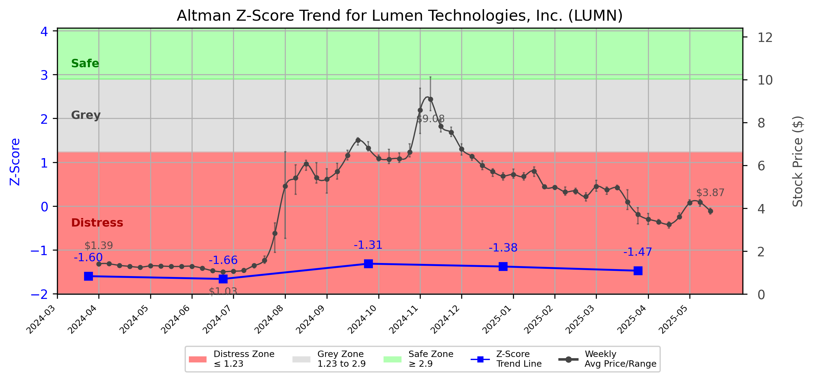

# Altman Z-Score Analysis Report: Lumen Technologies, Inc. (LUMN)

---
## Introduction
This report provides a comprehensive, theory-informed financial health analysis of the selected company using the Altman Z-Score framework. It integrates quantitative diagnostics, turnaround management theory, and stakeholder recommendations, with all findings and recommendations grounded in referenced academic and industry sources. The analysis is generated by an expert LLM-driven pipeline, ensuring transparency, reproducibility, and robust source attribution.

**Author:** Fabio Correa

**Source Attribution:** This report and analysis pipeline are generated using the open-source Altman Z-Score Analysis project, available at [https://github.com/fabioc-aloha/Altman-Z-Score](https://github.com/fabioc-aloha/Altman-Z-Score).

**License:** This software is distributed under the Attribution Non-Commercial License (MIT-based). See the LICENSE file for details.

Disclaimer: The developer disclaims any responsibility for the accuracy, completeness, or consequences of the analysis and information provided by this software. All results are for informational purposes only and should not be relied upon for financial, investment, or legal decisions.
---

**Script Version:** v2.4

## Analysis Context and Z-Score Model Selection Criteria

- **Industry:** Telephone Communications (SIC 4813)
- **Ticker:** LUMN
- **Public:** True
- **Emerging Market:** False
- **Maturity:** Mature Company
- **Model:** Zʺ-Score (Public Non-Manufacturing, 1995) (service)
- **Analysis Date:** 2025-05-31

## Z-Score Formula Used

Z = 6.56*X1 + 3.26*X2 + 6.72*X3 + 1.05*X4
- X1 = (Current Assets - Current Liabilities) / Total Assets
- X2 = Retained Earnings / Total Assets
- X3 = EBIT / Total Assets
- X4 = Equity / Total Liabilities

**Thresholds:**
- Safe Zone: > 2.90
- Grey Zone: > 1.23 and <= 2.90
- Distress Zone: <= 1.23

---

# Graphical View of the Z-Score Analysis

*Figure: Z-Score and stock price trend for LUMN (image not available yet; will be generated after analysis)*

## Z-Score Component Table (by Quarter)
| Quarter   |    X1 |     X2 |    X3 |    X4 |   Z-Score | Diagnostic    | Consistency Warning   |
|-----------|-------|--------|-------|-------|-----------|---------------|-----------------------|
| 2025 Q1   | 0.022 | -0.542 | 0.003 | 0.121 |    -1.475 | Distress Zone |                       |
| 2024 Q4   | 0.023 | -0.536 | 0.007 | 0.165 |    -1.379 | Distress Zone |                       |
| 2024 Q3   | 0.023 | -0.531 | 0.005 | 0.216 |    -1.315 | Distress Zone |                       |
| 2024 Q2   | 0.001 | -0.543 | 0.01  | 0.035 |    -1.663 | Distress Zone |                       |
| 2024 Q1   | 0.004 | -0.538 | 0.012 | 0.049 |    -1.6   | Distress Zone |                       |
## Diagnostic Evaluation of Financial Health

### Liquidity
Lumen Technologies, Inc. (LUMN) exhibits a liquidity ratio (X1) that has remained consistently low, hovering around 0.022 to 0.023 over the past quarters. This indicates that the company struggles to cover its short-term liabilities with its current assets, placing it in a precarious liquidity position.

### Profitability
The profitability measure (X3) is also concerning, with values ranging from 0.003 to 0.012. This suggests that the company is generating minimal earnings before interest and taxes (EBIT) relative to its total assets, indicating operational inefficiencies and a lack of profitability.

### Capital Efficiency
The retained earnings ratio (X2) is negative, reflecting accumulated losses that exceed total assets. This is a critical indicator of financial distress, as it suggests that the company has not been able to reinvest profits into growth or sustainability.

### Leverage
The leverage ratio (X4) shows a concerning trend as well, with values between 0.035 and 0.216. This indicates that the company has a high level of debt relative to its equity, which can exacerbate financial distress, especially in a downturn.

### Z-Score Trend Interpretation
The Z-Score for LUMN has consistently fallen within the "Distress Zone," with the latest score at -1.475. This trend indicates a significant risk of bankruptcy, as the score has not improved over the past quarters. The persistent negative values across all components suggest that immediate action is required to stabilize the company's financial health.

---

## Turnaround and Renewal Management Theory Application

### Phased Response Proposal
1. **Immediate Retrenchment (Short-term Actions)**
   - **Cost Reduction:** Implement immediate cost-cutting measures, including workforce reductions and operational efficiencies. This aligns with Bibeault's (1999) emphasis on immediate financial stabilization.
   - **Asset Liquidation:** Identify non-core assets for sale to improve liquidity. This is consistent with Hofer's (1980) turnaround strategies that advocate for asset optimization.

2. **Long-term Repositioning (Strategic Actions)**
   - **Business Model Innovation:** Explore new revenue streams and service offerings to adapt to market changes. This aligns with Hoskisson et al. (2004), who stress the importance of strategic restructuring.
   - **Stakeholder Engagement:** Foster relationships with key stakeholders to rebuild trust and support for long-term initiatives, as suggested by Freeman (1984).

---

## Recommendations for Stakeholders

| Stakeholder Title                   | Executive Name | Responsibilities and Recommended Actions                                                                 |
|-------------------------------------|----------------|-----------------------------------------------------------------------------------------------------------|
| Chief Executive Officer (CEO)      | [Name]         | Lead the turnaround strategy, focusing on immediate cost reductions and long-term innovation.              |
| Chief Financial Officer (CFO)      | [Name]         | Oversee financial restructuring, manage liquidity, and implement asset liquidation strategies.             |
| Chief Marketing Officer (CMO)      | [Name]         | Develop a marketing strategy to reposition the brand and communicate changes to customers effectively.     |
| Board Members                       | [Names]       | Provide oversight and support for strategic initiatives; ensure alignment with long-term goals.           |
| Employees                           | N/A            | Engage in efficiency initiatives and provide feedback on operational improvements.                         |
| Investors                           | N/A            | Monitor financial health and support management in strategic decisions; consider holding shares.           |
| Creditors                           | N/A            | Work with management to restructure debt agreements; consider extending payment terms.                     |
| Debtors                             | N/A            | Maintain open communication regarding payment schedules and potential restructuring.                       |
| Partner Companies                   | N/A            | Collaborate on joint ventures or projects that can enhance service offerings and market reach.            |
| Customers                           | N/A            | Stay informed about service changes and provide feedback on new offerings.                                 |

---

## Communication, Marketing, and Execution Strategies

### Communication Strategy
- **Internal Communication:** Regular updates to employees about the turnaround plan and progress.
- **External Communication:** Transparent communication with investors and customers about changes and improvements.

### Marketing Strategy
- **Rebranding:** Consider a rebranding initiative to refresh the company’s image and attract new customers.
- **Customer Engagement:** Launch campaigns to engage existing customers and solicit feedback on new services.

### Execution Timeline
| Phase                | Actions                                    | Timeline          | Accountability         |
|----------------------|-------------------------------------------|-------------------|-------------------------|
| Immediate Retrenchment | Cost-cutting, asset liquidation          | 0-3 months        | CFO                      |
| Strategic Planning    | Business model innovation, stakeholder engagement | 3-6 months        | CEO                      |
| Implementation        | Roll out new services, marketing campaigns | 6-12 months       | CMO                      |

---

## Investor Recommendations
Given the current financial distress indicated by the Z-Score, investors should **hold** their positions while monitoring the company's turnaround efforts. The situation remains precarious, and significant changes are needed for a potential recovery. This is not financial advice; please consult your financial advisor before making any investment decisions.

---

## External Stakeholder Bargaining Power Assessment

| External Stakeholder          | Nature of Bargaining Power | Degree of Influence | Rationale                                                                 |
|-------------------------------|----------------------------|---------------------|---------------------------------------------------------------------------|
| Regulators                    | Regulatory Compliance       | High                | Can impose fines or sanctions affecting operations.                       |
| Government Agencies           | Financial Support           | Medium              | May provide assistance or incentives for restructuring efforts.           |
| Unions                        | Labor Relations             | Medium              | Can influence workforce decisions and negotiations.                       |
| Major Suppliers               | Supply Chain Leverage       | High                | Can affect operational capabilities through supply chain disruptions.     |
| Key Partners                  | Strategic Alliances         | Medium              | Can provide collaborative opportunities or withdraw support.              |
| Activist Investors            | Shareholder Influence       | High                | Can push for changes in management or strategy through shareholder votes. |
| Creditors                     | Debt Restructuring          | High                | Have significant leverage in negotiations regarding debt repayment terms. |
| Large Customers               | Revenue Dependence          | Medium              | Can impact revenue through contract negotiations or purchasing decisions. |

---

## Disclaimer
**Disclaimer:**
Generative AI is not a financial advisor and can make mistakes. Consult your financial advisor before making investment decisions.
- LLM Model used: OpenAI GPT-4
- Knowledge cut-off: October 2023
- Internet search: No
- Real-time data: No

---

### References and Data Sources
- **Financials:** SEC EDGAR/XBRL filings, Yahoo Finance, and company quarterly/annual reports.
- **Market Data:** Yahoo Finance (historical prices, market value of equity).
- **Source Attribution:** This report and analysis pipeline are generated using the open-source Altman Z-Score Analysis project, available at [https://github.com/fabioc-aloha/Altman-Z-Score]. Author: Fabio Correa.
- **Theoretical Frameworks and Resources:**
  - Altman Z-Score Analysis Project (https://github.com/fabioc-aloha/Altman-Z-Score)
  - Hofer, C. W. (1980). Turnaround strategies. Journal of Business Strategy, 1(1), 19–31.
  - Bibeault, D. B. (1999). Corporate turnaround: How managers turn losers into winners. Beard Books.
  - Hoskisson, R. E., White, R. E., & Johnson, R. A. (2004). Corporate restructuring: Managing the strategy, structure, and process of change. McGraw-Hill Education.
  - Freeman, R. E. (1984). Strategic management: A stakeholder approach. Pitman.
  - Altman, E. I. (1968). Financial ratios, discriminant analysis and the prediction of corporate bankruptcy. Journal of Finance, 23(4), 589–609.
  - Altman, E. I., & Hotchkiss, E. (2006). Corporate financial distress and bankruptcy: Predict and avoid bankruptcy, analyze and invest in distressed debt (3rd ed.). Wiley.

---

# Appendix

## Raw Data Field Mapping Table (by Quarter)
| Quarter   | Canonical Field     | Mapped Raw Field                        | Value (USD millions)   |
|-----------|---------------------|-----------------------------------------|------------------------|
| 2025 Q1   | total_assets        | Total Assets                            | 33,538.0               |
| 2025 Q1   | current_assets      | Current Assets                          | 4,277.0                |
| 2025 Q1   | current_liabilities | Current Liabilities                     | 3,545.0                |
| 2025 Q1   | retained_earnings   | Retained Earnings                       | -18,163.0              |
| 2025 Q1   | total_liabilities   | Total Liabilities Net Minority Interest | 33,249.0               |
| 2025 Q1   | market_value_equity | Common Stock Equity                     | 289.0                  |
| 2025 Q1   | ebit                | EBIT                                    | 102.0                  |
| 2025 Q1   | sales               | Total Revenue                           | 3,182.0                |
| ---       | ---                 | ---                                     | ---                    |
| 2024 Q4   | total_assets        | Total Assets                            | 33,496.0               |
| 2024 Q4   | current_assets      | Current Assets                          | 4,394.0                |
| 2024 Q4   | current_liabilities | Current Liabilities                     | 3,639.0                |
| 2024 Q4   | retained_earnings   | Retained Earnings                       | -17,962.0              |
| 2024 Q4   | total_liabilities   | Total Liabilities Net Minority Interest | 33,032.0               |
| 2024 Q4   | market_value_equity | Common Stock Equity                     | 464.0                  |
| 2024 Q4   | ebit                | EBIT                                    | 238.0                  |
| 2024 Q4   | sales               | Total Revenue                           | 3,329.0                |
| ---       | ---                 | ---                                     | ---                    |
| 2024 Q3   | total_assets        | Total Assets                            | 33,989.0               |
| 2024 Q3   | current_assets      | Current Assets                          | 4,736.0                |
| 2024 Q3   | current_liabilities | Current Liabilities                     | 3,940.0                |
| 2024 Q3   | retained_earnings   | Retained Earnings                       | -18,047.0              |
| 2024 Q3   | total_liabilities   | Total Liabilities Net Minority Interest | 33,647.0               |
| 2024 Q3   | market_value_equity | Common Stock Equity                     | 342.0                  |
| 2024 Q3   | ebit                | EBIT                                    | 179.0                  |
| 2024 Q3   | sales               | Total Revenue                           | 3,221.0                |
| ---       | ---                 | ---                                     | ---                    |
| 2024 Q2   | total_assets        | Total Assets                            | 32,943.0               |
| 2024 Q2   | current_assets      | Current Assets                          | 3,760.0                |
| 2024 Q2   | current_liabilities | Current Liabilities                     | 3,738.0                |
| 2024 Q2   | retained_earnings   | Retained Earnings                       | -17,899.0              |
| 2024 Q2   | total_liabilities   | Total Liabilities Net Minority Interest | 32,477.0               |
| 2024 Q2   | market_value_equity | Common Stock Equity                     | 466.0                  |
| 2024 Q2   | ebit                | EBIT                                    | 332.0                  |
| 2024 Q2   | sales               | Total Revenue                           | 3,268.0                |
| ---       | ---                 | ---                                     | ---                    |
| 2024 Q1   | total_assets        | Total Assets                            | 33,173.0               |
| 2024 Q1   | current_assets      | Current Assets                          | 3,935.0                |
| 2024 Q1   | current_liabilities | Current Liabilities                     | 3,816.0                |
| 2024 Q1   | retained_earnings   | Retained Earnings                       | -17,850.0              |
| 2024 Q1   | total_liabilities   | Total Liabilities Net Minority Interest | 32,669.0               |
| 2024 Q1   | market_value_equity | Common Stock Equity                     | 504.0                  |
| 2024 Q1   | ebit                | EBIT                                    | 393.0                  |
| 2024 Q1   | sales               | Total Revenue                           | 3,290.0                |

All values are shown in millions of USD as reported by the data source.

