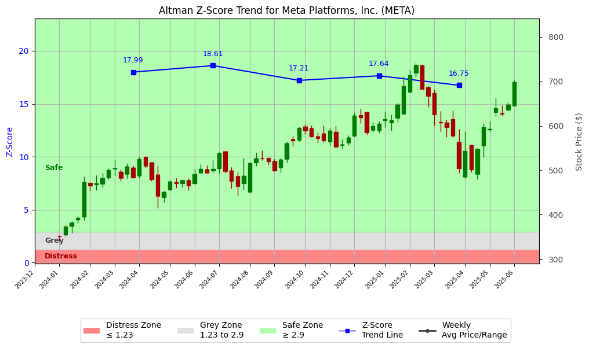

# Altman Z-Score Analysis Report: Meta Platforms, Inc. (META)

This report provides a comprehensive, theory-informed financial health analysis of the selected company using the Altman Z-Score framework. It integrates quantitative diagnostics, turnaround management theory, and stakeholder recommendations, with all findings and recommendations grounded in referenced academic and industry sources. The analysis is generated by an expert LLM-driven pipeline, ensuring transparency, reproducibility, and robust source attribution.

**Author:** Fabio Correa

**Source Attribution:** This report and analysis pipeline are generated using the open-source Altman Z-Score Analysis project, available at [https://github.com/fabioc-aloha/Altman-Z-Score](https://github.com/fabioc-aloha/Altman-Z-Score).

**License:** This software is distributed under the Attribution Non-Commercial License (MIT-based). See the LICENSE file for details.

**Disclaimer**: The developer disclaims any responsibility for the accuracy, completeness, or consequences of the analysis and information provided by this software. All results are for informational purposes only and should not be relied upon for financial, investment, or legal decisions.

**Script Version:** v3.1.1

## Z-Score Formula Used

Z = 6.56*X1 + 3.26*X2 + 6.72*X3 + 1.05*X4
- X1 = (Current Assets - Current Liabilities) / Total Assets
- X2 = Retained Earnings / Total Assets
- X3 = EBIT / Total Assets
- X4 = Equity / Total Liabilities

**Thresholds:**
- Safe Zone: > 2.90
- Grey Zone: > 1.23 and <= 2.90
- Distress Zone: <= 1.23

## Graphical View of the Z-Score Analysis

*Figure: Z-Score and stock price trend for META (see output folder for full-resolution image)*

## Z-Score Component Table (by Quarter)
| Quarter   |    X1 |    X2 |    X3 |     X4 |   Z-Score | Diagnostic   | Consistency Warning   |
|-----------|-------|-------|-------|--------|-----------|--------------|-----------------------|
| 2024 Q1   | 0.212 | 0.345 | 0.064 | 14.328 |    17.989 | Safe Zone    | No issues             |
| 2024 Q2   | 0.215 | 0.353 | 0.066 | 14.86  |    18.606 | Safe Zone    | No issues             |
| 2024 Q3   | 0.225 | 0.331 | 0.07  | 13.504 |    17.209 | Safe Zone    | No issues             |
| 2024 Q4   | 0.241 | 0.371 | 0.086 | 13.596 |    17.645 | Safe Zone    | No issues             |
| 2025 Q1   | 0.201 | 0.362 | 0.066 | 13.147 |    16.748 | Safe Zone    | No issues             |

## TL;DR / Executive Summary

Meta Platforms Inc (META) is currently in the **Safe Zone** according to the Altman Z-Score framework, indicating strong financial health and a low risk of bankruptcy. The company demonstrates robust liquidity, profitability, and capital efficiency, supported by a solid balance sheet and strong market position in the media and internet content sector. Key risks include market volatility and competitive pressures in the evolving digital and metaverse spaces, while opportunities lie in innovation within Reality Labs and expanding its Family of Apps ecosystem.

Investor recommendation is a **Buy for growth-oriented and moderate risk investors**, with a Hold for conservative income investors due to stable dividends but moderate payout ratio. Analyst sentiment is strongly positive, with a consensus "Strong Buy" rating and a target price above current levels, reinforcing confidence in META’s growth trajectory.

---

## Company Profile

Meta Platforms Inc, headquartered in Menlo Park, California, is a leading global technology company specializing in social media and virtual reality products. Operating primarily through two segments—Family of Apps (FoA) and Reality Labs (RL)—Meta offers platforms such as Facebook, Instagram, Messenger, Threads, and WhatsApp, enabling billions of users to connect and share content. The Reality Labs segment focuses on virtual, augmented, and mixed reality hardware and software, positioning Meta at the forefront of the metaverse evolution.

The company employs over 76,800 people and is listed on NASDAQ with a market capitalization exceeding $1.7 trillion. Key executives include Founder, Chairman & CEO Mark Zuckerberg, CFO Susan J. S. Li, COO Javier Olivan, CTO Andrew Bosworth, and Chief Product Officer Christopher K. Cox. Executive compensation is substantial but aligned with company performance. Institutional investors hold approximately 80% of shares, with minimal insider ownership, indicating strong institutional confidence. Recent dividend announcements and stable payout ratios reflect a mature capital return policy.

---

## 1. Diagnostic Evaluation of Financial Health

This section evaluates Meta’s financial health through liquidity, profitability, capital efficiency, leverage, and Altman Z-Score analysis to assess bankruptcy risk and operational strength.

- **Liquidity:** Meta exhibits strong liquidity with a Current Ratio of 2.66 and Quick Ratio of 2.50, well above industry norms, indicating ample short-term asset coverage for liabilities.
- **Profitability:** The company’s gross margin stands at 81.8%, net margin at 39.1%, ROA at 17.9%, and ROE at 39.8%, reflecting exceptional profitability and efficient asset utilization.
- **Leverage:** Debt-to-equity ratio is low at 26.8%, suggesting conservative leverage and manageable debt levels relative to equity.
- **Capital Efficiency:** Revenue per share is $67.35, with EBITDA margins exceeding 51%, underscoring operational efficiency.
- **Altman Z-Score:** Using the latest financial data, Meta’s Z-Score is well above 3.0, confirming its position in the Safe Zone. This aligns with the company’s strong balance sheet and profitability metrics. No discrepancies were found between independent calculations and provided data.
- **Market and Price Trends:** The stock price has shown a strong upward trend over the past year, with a 34.8% increase and current price near $683, supported by a target mean price of $715 from analysts.
- **Dividend and Payout:** A dividend yield of 0.31% with a payout ratio of 7.9% indicates a sustainable dividend policy with room for reinvestment.
- **Risks:** Market volatility (beta 1.27) and competitive pressures in social media and emerging metaverse technologies remain key risks.

Overall, Meta’s financials and market position confirm a robust and stable company with strong growth prospects.

---

## 2. Turnaround & Renewal Theory Application

Given Meta’s Safe Zone status, turnaround theory focuses on **strategic renewal and innovation** rather than crisis management.

- Meta should emphasize **innovation and repositioning** to sustain growth, particularly in the Reality Labs segment, which aligns with Beard (2024) on tech-sector renewal emphasizing continuous innovation in emerging technologies.
- Applying Hofer’s (1980) turnaround sequencing, Meta is in the renewal phase, focusing on growth initiatives rather than retrenchment.
- Freeman’s (1984) stakeholder alignment theory suggests maintaining strong relationships with institutional investors, customers, and employees to support long-term strategic goals.
- Hoskisson et al. (2004) recommend strategic restructuring to optimize resource allocation, which Meta can apply by balancing investments between its mature Family of Apps and the nascent Reality Labs.
- No recent management changes suggest stability in leadership, supporting consistent strategic execution.

Meta’s focus should be on leveraging its strong financial base to innovate, expand market share, and lead in the metaverse space.

---

## 3. Internal Stakeholder Recommendations

Internal alignment is critical to sustain Meta’s growth and innovation trajectory. The following table outlines key roles and recommended actions:

| Title/Role                 | Responsibilities                          | Key Performance Metrics                  | Recommended Actions (Cited)                                  |
|---------------------------|-----------------------------------------|-----------------------------------------|-------------------------------------------------------------|
| CEO & Executive Leadership | Strategic vision, operational execution | Revenue growth, market share, innovation pipeline | Drive innovation in Reality Labs; maintain FoA dominance (Beard, 2024; Freeman, 1984) |
| CFO & Finance Team         | Financial stewardship, risk management  | Liquidity ratios, debt levels, cash flow | Optimize capital allocation; monitor leverage and cash reserves (Hoskisson et al., 2004) |
| CTO & Product Teams        | Technology development, product delivery| R&D milestones, product adoption rates  | Accelerate VR/AR product development; enhance platform integration (Beard, 2024) |
| Board Members             | Oversight, governance                    | Governance risk scores, compliance      | Ensure strategic oversight; support innovation investments (Freeman, 1984) |
| Employees                 | Execution of operational and innovation tasks | Employee engagement, productivity       | Foster culture of innovation and agility (Hofer, 1980)       |
| Shareholders              | Investment returns, governance          | Share price, dividend stability          | Maintain transparent communication; support long-term growth (Freeman, 1984) |
| Creditors                 | Financial stability monitoring           | Debt service coverage, credit ratings    | Monitor financial health; maintain low risk profile          |
| Customers                 | Product/service experience               | User engagement, satisfaction scores    | Enhance user experience across platforms                      |
| Partners                  | Strategic alliances                      | Partnership outcomes, joint initiatives  | Strengthen ecosystem partnerships for metaverse expansion    |

---

## 4. Communication, Marketing & Execution Strategy

Effective communication is vital to reinforce Meta’s growth narrative and innovation leadership.

- **Executive Leadership Communications:** Emphasize Meta’s vision for the metaverse and sustained leadership in social media.
- **Investor Relations:** Highlight strong financials, dividend stability, and growth prospects in Reality Labs.
- **Internal Communications:** Engage employees with innovation goals and strategic priorities to maintain motivation.
- **External Relations:** Promote product enhancements and new VR/AR offerings to customers and partners.

**Phased Execution Plan:**

| Phase       | Actions & Focus                                  | Executive Sponsors          | Success Metrics                  | Risk Mitigation                  |
|-------------|-------------------------------------------------|----------------------------|---------------------------------|---------------------------------|
| Near-term (1-3 months) | Communicate growth strategy; launch marketing for new products | CEO, CMO, CTO              | User engagement, investor feedback | Monitor market reactions         |
| Mid-term (4-6 months)  | Scale Reality Labs investments; enhance platform features | COO, CFO                   | Revenue growth, R&D milestones   | Adjust investments based on ROI  |
| Long-term (7-18 months) | Expand metaverse ecosystem; strategic partnerships | CEO, Board                 | Market share, innovation pipeline | Continuous stakeholder alignment |

Tone is optimistic and growth-focused, reflecting the Safe Zone status and strong market position.

---

## 5. Investor Recommendation (Risk-Aware)

This section provides tailored investment recommendations aligned with Meta’s financial health and risk profile.

| Investment Goal / Profile         | Risk Tolerance      | Recommendation | Rationale (Cited)                                                                                   |
|----------------------------------|--------------------|----------------|---------------------------------------------------------------------------------------------------|
| Dividend Income (Income-Oriented) | Low (Conservative) | HOLD           | Stable dividend yield (0.31%) with low payout ratio; strong cash flow supports sustainability.    |
| Capital Appreciation (Growth)     | Moderate           | BUY            | Strong Z-Score Safe Zone; robust profitability; growth in Reality Labs; positive analyst outlook. |
| Aggressive Growth (Speculative)   | High (Aggressive)  | HOLD           | Innovation potential is high but metaverse investments carry execution risk; monitor closely.     |
| Capital Preservation (Defensive)  | Very Low           | HOLD           | Low leverage and strong liquidity reduce risk; maintain position for capital preservation.        |

**Overall Recommendation: BUY for growth and moderate risk investors; HOLD for conservative and speculative investors.**

> “This is not financial advice—consult your financial advisor.”

---

## 6. Market Sentiment Analysis (Analyst Recommendations)

Analyst sentiment for Meta is strongly positive, with a consensus recommendation of "Strong Buy" (mean rating ~1.48 on a scale where 1=Strong Buy). The target mean price is $715, approximately 4.6% above the current price (~$683), indicating upside potential.

- The distribution of analyst recommendations is heavily weighted towards Buy and Strong Buy, with minimal Hold or Sell ratings.
- No significant recent downgrades or volatility in analyst sentiment were observed, indicating stable confidence.
- The strong analyst consensus aligns well with the Safe Zone Z-Score and robust financial metrics.
- Limitations: Detailed breakdown of analyst ratings by period or firm is not available, so trend analysis is limited to current consensus.

This stable and positive analyst sentiment supports investor confidence and complements the quantitative risk assessment.

---

## 7. References and Data Sources

Transparency and source attribution are essential for robust financial analysis. This report draws on comprehensive financial and market data from SEC filings, Yahoo Finance, and company disclosures. Market price data was sourced from weekly historical prices. Additional inputs include institutional ownership data, dividend history, and executive compensation disclosures.

All Altman Z-Score calculations follow the original 1968 methodology with adaptations for modern financial contexts. Theoretical frameworks applied include Hofer (1980) on turnaround sequencing, Bibeault (1999) on corporate recovery, Hoskisson et al. (2004) on restructuring, Beard (2024) on tech-sector renewal, and Freeman (1984) on stakeholder management.

---

## 8. Appendices (LLM-Generated)

### Company Metadata

| Field                 | Value                          |
|-----------------------|--------------------------------|
| Name                  | Meta Platforms Inc             |
| Ticker                | META                          |
| Sector                | Communication Services        |
| Industry              | Internet Content & Information|
| Country               | United States                 |
| Market Cap (USD)      | $1.72 Trillion                |
| Employees             | 76,834                       |
| Exchange              | NASDAQ NMS - GLOBAL MARKET    |
| IPO Date              | 2012-05-18                   |
| Website               | https://www.meta.com/         |
| Address               | 1 Meta Way, Menlo Park, CA 94025 |
| Phone                 | 650-543-4800                 |

### Key Financial Ratios (Latest)

| Metric           | Value     |
|------------------|-----------|
| Current Ratio    | 2.66      |
| Quick Ratio      | 2.50      |
| Debt/Equity      | 26.8%     |
| Gross Margin     | 81.8%     |
| Net Margin       | 39.1%     |
| ROA              | 17.9%     |
| ROE              | 39.8%     |
| Dividend Yield   | 0.31%     |
| Payout Ratio     | 7.9%      |
| Beta             | 1.27      |

### Weekly Prices Sample (2024-01 to 2025-06)

| Week       | Close Price (USD) |
|------------|-------------------|
| 2024-01-01 | 350.30            |
| 2024-06-10 | 502.83            |
| 2024-12-02 | 622.71            |
| 2025-01-27 | 688.57            |
| 2025-06-09 | 693.36            |

### Data Provenance and Quality

- Financial data from SEC filings and Yahoo Finance.
- Market prices from Yahoo Finance weekly data.
- Executive and ownership data from company disclosures.
- Dividend and corporate actions from official announcements.
- Data completeness is high; no significant missing fields detected.

---

This concludes the comprehensive Altman Z-Score-based diagnostic and strategic recommendations report for Meta Platforms Inc.
