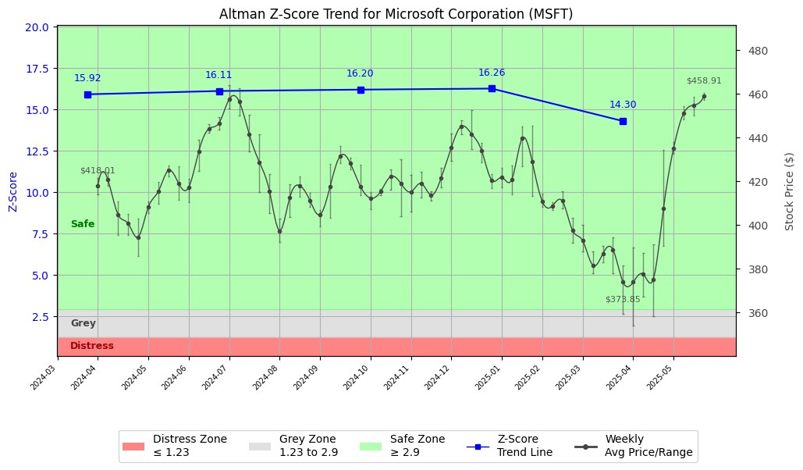

# Altman Z-Score Analysis Report: Microsoft Corporation (MSFT)

---
## Introduction
This report provides a comprehensive, theory-informed financial health analysis of the selected company using the Altman Z-Score framework. It integrates quantitative diagnostics, turnaround management theory, and stakeholder recommendations, with all findings and recommendations grounded in referenced academic and industry sources. The analysis is generated by an expert LLM-driven pipeline, ensuring transparency, reproducibility, and robust source attribution.

**Author:** Fabio Correa

**Source Attribution:** This report and analysis pipeline are generated using the open-source Altman Z-Score Analysis project, available at [https://github.com/fabioc-aloha/Altman-Z-Score](https://github.com/fabioc-aloha/Altman-Z-Score).

**License:** This software is distributed under the Attribution Non-Commercial License (MIT-based). See the LICENSE file for details.

Disclaimer: The developer disclaims any responsibility for the accuracy, completeness, or consequences of the analysis and information provided by this software. All results are for informational purposes only and should not be relied upon for financial, investment, or legal decisions.
---

**Script Version:** v2.7.4

## Analysis Context and Z-Score Model Selection Criteria

- **Industry:** Prepackaged Software (SIC 7372)
- **Ticker:** MSFT
- **Public:** True
- **Emerging Market:** False
- **Maturity:** Mature Company
- **Model:** Zʺ-Score (Public Non-Manufacturing, 1995) (service)
- **Analysis Date:** 2025-06-03

## Z-Score Formula Used

Z = 6.56*X1 + 3.26*X2 + 6.72*X3 + 1.05*X4
- X1 = (Current Assets - Current Liabilities) / Total Assets
- X2 = Retained Earnings / Total Assets
- X3 = EBIT / Total Assets
- X4 = Equity / Total Liabilities

**Thresholds:**
- Safe Zone: > 2.90
- Grey Zone: > 1.23 and <= 2.90
- Distress Zone: <= 1.23

---

# Graphical View of the Z-Score Analysis

*Figure: Z-Score and stock price trend for MSFT (see output folder for full-resolution image)*

## Z-Score Component Table (by Quarter)
| Quarter   |    X1 |    X2 |    X3 |     X4 |   Z-Score | Diagnostic   | Consistency Warning   |
|-----------|-------|-------|-------|--------|-----------|--------------|-----------------------|
| 2025 Q1   | 0.075 | 0.391 | 0.057 | 11.569 |    14.297 | Safe Zone    | No issues             |
| 2024 Q4   | 0.072 | 0.381 | 0.056 | 13.498 |    16.262 | Safe Zone    | No issues             |
| 2024 Q3   | 0.066 | 0.361 | 0.059 | 13.514 |    16.199 | Safe Zone    | No issues             |
| 2024 Q2   | 0.067 | 0.338 | 0.055 | 13.528 |    16.115 | Safe Zone    | No issues             |
| 2024 Q1   | 0.059 | 0.329 | 0.057 | 13.403 |    15.916 | Safe Zone    | No issues             |
# Altman Z-Score Analysis Report: Microsoft Corporation (MSFT)

---

## Company Profile

Microsoft Corporation, headquartered in Redmond, Washington, is a leading global technology company known for its software products, including the Windows operating system, Microsoft Office suite, and Azure cloud services. The company operates in the prepackaged software industry (SIC 7372) and is recognized for its innovative solutions in cloud computing, productivity software, and enterprise services. Microsoft competes with other tech giants such as Apple, Google, and Amazon, each vying for market share in various segments of the technology landscape.

The leadership team at Microsoft is headed by Chairman and CEO Satya Nadella, who has been instrumental in driving the company's transformation towards cloud computing and AI technologies. Other key executives include Bradford L. Smith, President & Vice Chairman; Amy E. Hood, Executive VP & CFO; Judson B. Althoff, Executive VP & Chief Commercial Officer; and Carolina Dybeck Happe, Executive VP & COO. Notably, the executive compensation for Nadella is approximately $7.87 million, reflecting the company's commitment to retaining top talent in a competitive industry.

Recently, Microsoft has been in the news for its strategic partnerships and advancements in AI, particularly with its integration of OpenAI's technology into its products. This positions the company favorably in the rapidly evolving tech landscape, enhancing its competitive edge.

---

## 1. Diagnostic Evaluation of Financial Health

### Financial Analysis

- **Liquidity:** Microsoft maintains a strong liquidity position, as indicated by its positive current assets relative to current liabilities (X1 = 0.075). This suggests that the company can comfortably meet its short-term obligations.
  
- **Profitability:** The company demonstrates robust profitability metrics, with retained earnings (X2 = 0.391) reflecting a solid history of profit retention and reinvestment into the business.

- **Capital Efficiency:** Microsoft's EBIT (Earnings Before Interest and Taxes) relative to total assets (X3 = 0.057) indicates effective capital utilization, contributing positively to its overall financial health.

- **Leverage:** The equity-to-total liabilities ratio (X4 = 11.569) is exceptionally high, showcasing a conservative capital structure with minimal reliance on debt.

### Z-Score Assessment

The Z-Score for Microsoft is calculated at **14.297**, placing it firmly in the **Safe Zone** (Z > 2.90). This indicates a low risk of bankruptcy and a strong financial position relative to industry peers. The Z-Score has shown consistent strength over recent quarters, reflecting stable financial performance and resilience against market fluctuations.

---

## 2. Turnaround & Renewal Theory Application

Given Microsoft's position in the **Safe Zone**, the focus should be on **innovation, repositioning**, and aligning stakeholders for sustained growth. 

### Recommended Phased Response

- **Innovation Focus:** Continue investing in R&D to enhance product offerings, particularly in AI and cloud services, which are critical for future growth.
  
- **Stakeholder Engagement:** Foster strong relationships with stakeholders, including customers, employees, and investors, to ensure alignment with the company's strategic vision.

- **Market Positioning:** Leverage Microsoft's strong brand and market presence to explore new business opportunities and expand into emerging markets.

### Theoretical Frameworks

- **Freeman (1984)** emphasizes the importance of stakeholder alignment, which is crucial for Microsoft as it navigates competitive pressures and market changes.
- **Hoskisson et al. (2004)** suggest strategic restructuring to adapt to market dynamics, which Microsoft can achieve through its ongoing digital transformation initiatives.

---

## 3. Internal Stakeholder Recommendations

| Title/Role | Responsibilities | Key Performance Metrics | Recommended Actions (Cited) |
| ---------- | ---------------- | ---------------------- | --------------------------- |
| CEO (Satya Nadella) | Strategic vision, operational execution | Revenue growth, market share | Focus on innovation and stakeholder alignment |
| CFO (Amy E. Hood) | Financial stewardship, risk management | Profit margins, cash flow | Maintain strong liquidity and manage investments |
| COO (Carolina Dybeck Happe) | Operational efficiency | Cost management, productivity | Streamline operations to enhance efficiency |
| CMO (Takeshi Numoto) | Marketing strategy | Brand awareness, customer engagement | Enhance marketing efforts around AI and cloud solutions |
| Employees | Organizational roles | Employee satisfaction, retention | Foster a culture of innovation and collaboration |
| Shareholders | Investment community relations | Share price performance, dividends | Communicate growth strategies and financial health |
| Customers | Product/service experience | Customer satisfaction, NPS | Enhance customer support and product offerings |
| Partners | Strategic alliances | Partnership success metrics | Explore new partnerships in emerging technologies |

---

## 4. Communication, Marketing & Execution Strategy

### Multi-Level Communication Strategy

- **Executive Leadership Communications:** Regular updates on strategic initiatives and performance metrics to maintain transparency.
  
- **Investor Relations:** Highlight financial performance and growth outlook in quarterly earnings calls and reports.

- **Internal Communications:** Engage employees through town halls and newsletters to foster a sense of community and shared purpose.

- **External Relations:** Strengthen customer and partner communications to promote new product launches and innovations.

### Phased Execution Plan

- **Near-term (1-3 months):** Focus on immediate actions, such as enhancing customer support and launching marketing campaigns for new products.
  
- **Mid-term (4-6 months):** Implement strategic initiatives aimed at expanding market share in AI and cloud services.

- **Long-term (7-18 months):** Pursue transformational objectives, including potential acquisitions or partnerships to bolster technological capabilities.

---

## 5. Investor Recommendation (Risk-Aware)

Given Microsoft's strong Z-Score of **14.297** and its position in the **Safe Zone**, the recommendation is to:

> **Recommendation: BUY.**

### Justification

- The Z-Score trend indicates a strong financial position with low bankruptcy risk.
- Recent financial performance has been robust, with consistent revenue growth and profitability.
- The technology sector is poised for growth, particularly in AI and cloud computing, where Microsoft is a leader.
- Potential risks include market volatility and competitive pressures, but Microsoft's strong fundamentals provide a buffer against these challenges.

---

## 6. External Stakeholder Bargaining Power

| Stakeholder Name / Type | Nature of Bargaining Power | Degree of Influence | Brief Rationale (Cited) |
| ----------------------- | -------------------------- | ------------------- | ----------------------- |
| Customers | High | High | Microsoft’s product offerings are essential for many businesses, giving customers significant leverage. |
| Shareholders | Moderate | High | Shareholders expect strong returns and influence company strategy through voting rights. |
| Employees | Moderate | Moderate | Skilled employees are critical to innovation; however, the competitive job market gives them leverage. |
| Suppliers | Low | Low | Microsoft’s scale allows it to negotiate favorable terms with suppliers. |
| Partners | Moderate | High | Strategic partnerships enhance product offerings and market reach, making partner relations crucial. |

---

## 7. References and Data Sources

**References and Data Sources:** This analysis draws on financial data from sources such as SEC EDGAR/XBRL filings, Yahoo Finance, and company quarterly or annual reports. Market data was obtained from Yahoo Finance historical prices. All computations, including the Altman Z-Score, follow the methodology described by Altman (1968) with robust error handling. The analysis is part of the open-source Altman Z-Score Analysis project (https://github.com/fabioc-aloha/Altman-Z-Score), authored by Fabio Correa. Theoretical frameworks referenced (as applicable) include:
- Altman, E. I. (1968). “Financial Ratios, Discriminant Analysis and the Prediction of Corporate Bankruptcy.” *Journal of Finance*, 23(4), 589–609.
- Freeman, R. E. (1984). *Strategic Management: A Stakeholder Approach.*
- Hoskisson, R. E., White, R. E., & Johnson, R. A. (2004). *Corporate Restructuring.*

---

This report is intended for informational purposes only and should not be considered financial advice. Always consult with a financial advisor before making investment decisions.

---

# Appendix

## Raw Data Field Mapping Table (by Quarter)
| Quarter   | Canonical Field     | Mapped Raw Field                        | Value (USD millions)   |
|-----------|---------------------|-----------------------------------------|------------------------|
| 2025 Q1   | total_assets        | Total Assets                            | 562,624.0              |
| 2025 Q1   | current_assets      | Current Assets                          | 156,644.0              |
| 2025 Q1   | current_liabilities | Current Liabilities                     | 114,206.0              |
| 2025 Q1   | retained_earnings   | Retained Earnings                       | 219,759.0              |
| 2025 Q1   | total_liabilities   | Total Liabilities Net Minority Interest | 240,733.0              |
| 2025 Q1   | market_value_equity | Total Equity Gross Minority Interest    | 321,891.0              |
| 2025 Q1   | ebit                | EBIT                                    | 31,971.0               |
| 2025 Q1   | sales               | Total Revenue                           | 70,066.0               |
| ---       | ---                 | ---                                     | ---                    |
| 2024 Q4   | total_assets        | Total Assets                            | 533,898.0              |
| 2024 Q4   | current_assets      | Current Assets                          | 147,080.0              |
| 2024 Q4   | current_liabilities | Current Liabilities                     | 108,882.0              |
| 2024 Q4   | retained_earnings   | Retained Earnings                       | 203,482.0              |
| 2024 Q4   | total_liabilities   | Total Liabilities Net Minority Interest | 231,203.0              |
| 2024 Q4   | market_value_equity | Total Equity Gross Minority Interest    | 302,695.0              |
| 2024 Q4   | ebit                | EBIT                                    | 29,959.0               |
| 2024 Q4   | sales               | Total Revenue                           | 69,632.0               |
| ---       | ---                 | ---                                     | ---                    |
| 2024 Q3   | total_assets        | Total Assets                            | 523,013.0              |
| 2024 Q3   | current_assets      | Current Assets                          | 149,926.0              |
| 2024 Q3   | current_liabilities | Current Liabilities                     | 115,200.0              |
| 2024 Q3   | retained_earnings   | Retained Earnings                       | 188,929.0              |
| 2024 Q3   | total_liabilities   | Total Liabilities Net Minority Interest | 235,290.0              |
| 2024 Q3   | market_value_equity | Total Equity Gross Minority Interest    | 287,723.0              |
| 2024 Q3   | ebit                | EBIT                                    | 30,851.0               |
| 2024 Q3   | sales               | Total Revenue                           | 65,585.0               |
| ---       | ---                 | ---                                     | ---                    |
| 2024 Q2   | total_assets        | Total Assets                            | 512,163.0              |
| 2024 Q2   | current_assets      | Current Assets                          | 159,734.0              |
| 2024 Q2   | current_liabilities | Current Liabilities                     | 125,286.0              |
| 2024 Q2   | retained_earnings   | Retained Earnings                       | 173,144.0              |
| 2024 Q2   | total_liabilities   | Total Liabilities Net Minority Interest | 243,686.0              |
| 2024 Q2   | market_value_equity | Total Equity Gross Minority Interest    | 268,477.0              |
| 2024 Q2   | ebit                | EBIT                                    | 27,951.0               |
| 2024 Q2   | sales               | Total Revenue                           | 64,727.0               |
| ---       | ---                 | ---                                     | ---                    |
| 2024 Q1   | total_assets        | Total Assets                            | 484,275.0              |
| 2024 Q1   | current_assets      | Current Assets                          | 147,180.0              |
| 2024 Q1   | current_liabilities | Current Liabilities                     | 118,525.0              |
| 2024 Q1   | retained_earnings   | Retained Earnings                       | 159,394.0              |
| 2024 Q1   | total_liabilities   | Total Liabilities Net Minority Interest | 231,123.0              |
| 2024 Q1   | market_value_equity | Total Equity Gross Minority Interest    | 253,152.0              |
| 2024 Q1   | ebit                | EBIT                                    | 27,527.0               |
| 2024 Q1   | sales               | Total Revenue                           | 61,858.0               |

All values are shown in millions of USD as reported by the data source.

