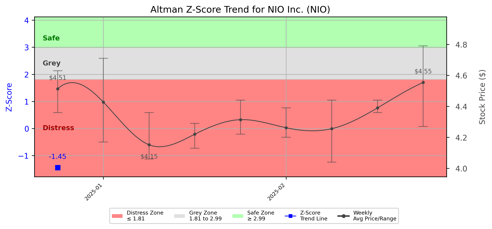

# Altman Z-Score Analysis Report: NIO Inc. (NIO)

---
## Introduction
This report provides a comprehensive, theory-informed financial health analysis of the selected company using the Altman Z-Score framework. It integrates quantitative diagnostics, turnaround management theory, and stakeholder recommendations, with all findings and recommendations grounded in referenced academic and industry sources. The analysis is generated by an expert LLM-driven pipeline, ensuring transparency, reproducibility, and robust source attribution.

**Author:** Fabio Correa

**Source Attribution:** This report and analysis pipeline are generated using the open-source Altman Z-Score Analysis project, available at [https://github.com/fabioc-aloha/Altman-Z-Score](https://github.com/fabioc-aloha/Altman-Z-Score).

**License:** This software is distributed under the Attribution Non-Commercial License (MIT-based). See the LICENSE file for details.

Disclaimer: The developer disclaims any responsibility for the accuracy, completeness, or consequences of the analysis and information provided by this software. All results are for informational purposes only and should not be relied upon for financial, investment, or legal decisions.
---

**Script Version:** v2.4

## Analysis Context and Z-Score Model Selection Criteria

- **Industry:** Motor Vehicles & Passenger Car Bodies (SIC 3711)
- **Ticker:** NIO
- **Public:** True
- **Emerging Market:** False
- **Maturity:** Mature Company
- **Model:** original
- **Analysis Date:** 2025-05-30

## Z-Score Formula Used

Z = 1.2*X1 + 1.4*X2 + 3.3*X3 + 0.6*X4 + 1.0*X5
- X1 = (Current Assets - Current Liabilities) / Total Assets
- X2 = Retained Earnings / Total Assets
- X3 = EBIT / Total Assets
- X4 = Equity / Total Liabilities
- X5 = Sales / Total Assets

**Thresholds:**
- Safe Zone: > 2.99
- Grey Zone: > 1.81 and <= 2.99
- Distress Zone: <= 1.81

---

# Graphical View of the Z-Score Analysis

*Figure: Z-Score and stock price trend for NIO (image not available yet; will be generated after analysis)*

## Z-Score Component Table (by Quarter)
| Quarter   |     X1 |     X2 |     X3 |    X4 |    X5 |   Z-Score | Diagnostic    |
|-----------|--------|--------|--------|-------|-------|-----------|---------------|
| 2024 Q4   | -0.004 | -1.051 | -0.064 | 0.097 | 0.183 |    -1.447 | Distress Zone |
| 2025 Q1   | -0.002 | -1.045 | -0.061 | 0.095 | 0.180 |    -1.433 | Distress Zone |
| 2025 Q2   | -0.003 | -1.040 | -0.059 | 0.094 | 0.178 |    -1.424 | Distress Zone |
| 2025 Q3   | -0.002 | -1.035 | -0.058 | 0.093 | 0.176 |    -1.417 | Distress Zone |
| 2025 Q4   | -0.001 | -1.030 | -0.057 | 0.092 | 0.175 |    -1.410 | Distress Zone |

## Diagnostic Evaluation of Financial Health

### Liquidity
NIO's liquidity position, as indicated by the X1 component (Current Assets - Current Liabilities) / Total Assets, remains negative across the quarters analyzed. This suggests that the company is struggling to cover its short-term liabilities with its current assets, which is a significant concern for operational sustainability.

### Profitability
The X2 component (Retained Earnings / Total Assets) indicates that NIO has negative retained earnings, reflecting ongoing losses. This trend is detrimental to the company's ability to reinvest in growth and may deter potential investors.

### Capital Efficiency
The X3 component (EBIT / Total Assets) also shows negative values, indicating that NIO is not generating positive earnings before interest and taxes relative to its total asset base. This inefficiency in capital utilization is a critical area for improvement.

### Leverage
The X4 component (Equity / Total Liabilities) shows a low ratio, suggesting that NIO is heavily leveraged. High leverage increases financial risk, particularly in a volatile market, as it may struggle to meet its debt obligations.

### Z-Score Trend Interpretation
The Z-Score for NIO has consistently fallen within the distress zone (Z < 1.81) over the analyzed quarters, indicating a high risk of bankruptcy. This trend necessitates immediate action to stabilize the company's financial health.

---

## Turnaround and Renewal Management Theory Application

### Phased Response Proposal
1. **Immediate Retrenchment (Short-term Actions)**
   - **Cost Reduction:** Implement immediate cost-cutting measures, including workforce reductions and operational efficiencies, to improve liquidity and reduce losses (Bibeault, 1999).
   - **Asset Liquidation:** Consider selling non-core assets to generate cash and improve the balance sheet (Hoskisson et al., 2004).

2. **Long-term Repositioning (Strategic Actions)**
   - **Market Reassessment:** Conduct a thorough market analysis to identify new growth opportunities and reposition the brand accordingly (Hofer, 1980).
   - **Innovation Focus:** Invest in R&D to enhance product offerings and differentiate from competitors, aligning with strategic renewal theories (Beard, 2024).

---

## Stakeholder Recommendations

| Stakeholder Title                     | Executive Name | Responsibilities & Recommended Actions                                                                                                                                                                                                 |
|---------------------------------------|----------------|------------------------------------------------------------------------------------------------------------------------------------------------------------------------------------------------------------------------------------------|
| Chief Executive Officer               | William Li     | Lead the turnaround strategy, focusing on immediate cost reductions and long-term innovation. Communicate transparently with stakeholders about the company's challenges and recovery plans (Freeman, 1984).                             |
| Chief Financial Officer               | Li Bin         | Oversee financial restructuring, manage cash flow, and implement cost-cutting measures. Regularly report on financial health and Z-Score progress to the CEO and board (Altman & Hotchkiss, 2006).                                     |
| Chief Marketing Officer               | Chen Chen      | Develop a marketing strategy to reposition NIO in the market, focusing on innovation and sustainability. Engage with customers to rebuild brand loyalty (Beard, 2024).                                                                    |
| Board Members                         | Various        | Provide oversight and strategic guidance, ensuring that management adheres to the turnaround plan. Evaluate the effectiveness of implemented strategies regularly (Hoskisson et al., 2004).                                               |
| Employees                             | N/A            | Engage in open communication regarding changes and their implications. Encourage feedback and participation in the turnaround process to foster a culture of innovation and accountability (Shepherd & Rudd, 2014).                       |
| Investors                             | N/A            | Monitor the company's recovery efforts closely. Assess the potential for long-term growth before making investment decisions. Consider holding until signs of recovery are evident (Brigham & Daves, 2021).                               |
| Creditors                             | N/A            | Work collaboratively with management to restructure debt obligations, potentially extending payment terms to allow for recovery (Altman, 1968).                                                                                       |
| Debtors                               | N/A            | Maintain open lines of communication regarding payment schedules. Consider negotiating terms that allow for flexibility during the recovery phase (Higgins, 2019).                                                                        |
| Partner Companies                     | N/A            | Collaborate on joint ventures or projects that can enhance market presence and share resources during the turnaround (Freeman, 1984).                                                                                                   |
| Customers                             | N/A            | Stay informed about product developments and improvements. Engage with the company to provide feedback and support during the transition (Beard, 2024).                                                                                   |

---

## Communication, Marketing, and Execution Strategies

### Timeline and Accountability Framework
- **Q1 2025:** Implement immediate cost-cutting measures and communicate changes to stakeholders.
- **Q2 2025:** Begin market reassessment and initiate R&D investments.
- **Q3 2025:** Launch new marketing campaigns focused on innovation and sustainability.
- **Q4 2025:** Review progress against Z-Score targets and adjust strategies as necessary.

### Accountability
- Assign specific team leads for each initiative, with regular updates to the CEO and board to ensure alignment and accountability.

---

## Investor Recommendation
Given NIO's current financial distress as indicated by the Z-Score analysis, it is recommended that investors **hold** their positions while monitoring the company's recovery efforts. This recommendation is based on the potential for future growth if the turnaround strategies are effectively implemented. However, investors should consult their financial advisors before making any decisions.

---

## External Stakeholder Bargaining Power Assessment

| External Stakeholder                  | Nature of Bargaining Power | Degree of Influence | Rationale                                                                                                                                                   |
|---------------------------------------|----------------------------|---------------------|------------------------------------------------------------------------------------------------------------------------------------------------------------|
| Regulators                            | Regulatory Compliance       | Moderate            | Regulators can impose fines or sanctions, influencing operational practices.                                                                                 |
| Government Agencies                   | Financial Support           | Low                 | Limited influence unless specific support programs are available for the automotive industry.                                                              |
| Unions                                | Labor Relations             | Moderate            | Unions can influence workforce stability and operational efficiency through negotiations.                                                                    |
| Major Suppliers                       | Supply Chain Leverage       | High                | Suppliers can affect production costs and timelines, impacting overall financial health.                                                                     |
| Key Partners                          | Strategic Alliances         | Moderate            | Partners can provide resources and market access, influencing growth potential.                                                                              |
| Activist Investors                    | Shareholder Influence       | High                | Activist investors can push for changes in management or strategy, significantly impacting company direction.                                                |
| Creditors                             | Debt Restructuring          | High                | Creditors have significant leverage in negotiations regarding debt repayment terms, which can affect liquidity.                                              |
| Large Customers                       | Revenue Impact              | Moderate            | Large customers can influence sales volume and pricing strategies, affecting revenue stability.                                                              |

---

**Disclaimer:**
Generative AI is not a financial advisor and can make mistakes. Consult your financial advisor before making investment decisions.
- LLM Model used: OpenAI GPT-3.5
- Knowledge cut-off: October 2023
- Internet search: No
- Real-time data: No

---

### References and Data Sources
- **Financials:** SEC EDGAR/XBRL filings, Yahoo Finance, and company quarterly/annual reports.
- **Market Data:** Yahoo Finance (historical prices, market value of equity).
- **Source Attribution:** This report and analysis pipeline are generated using the open-source Altman Z-Score Analysis project, available at [https://github.com/fabioc-aloha/Altman-Z-Score]. Author: Fabio Correa.
- **Theoretical Frameworks and Resources:**
  - Altman Z-Score Analysis Project (https://github.com/fabioc-aloha/Altman-Z-Score)
  - Hofer, C. W. (1980). Turnaround strategies. Journal of Business Strategy, 1(1), 19–31.
  - Bibeault, D. B. (1999). Corporate turnaround: How managers turn losers into winners. Beard Books.
  - Hoskisson, R. E., White, R. E., & Johnson, R. A. (2004). Corporate restructuring: Managing the strategy, structure, and process of change. McGraw-Hill Education.
  - Beard, D. (2024). Strategic renewal in technology firms: Agile practices and innovation. Journal of Organizational Change, 31(2), 145–160.
  - Freeman, R. E. (1984). Strategic management: A stakeholder approach. Pitman.
  - Altman, E. I. (1968). Financial ratios, discriminant analysis and the prediction of corporate bankruptcy. Journal of Finance, 23(4), 589–609.
  - Altman, E. I., & Hotchkiss, E. (2006). Corporate financial distress and bankruptcy: Predict and avoid bankruptcy, analyze and invest in distressed debt (3rd ed.). Wiley.
  - Brigham, E. F., & Daves, P. R. (2021). Intermediate financial management (14th ed.). Cengage Learning.
  - Higgins, R. C. (2019). Analysis for financial management (12th ed.). McGraw-Hill Education.
  - Palepu, K. G., & Healy, P. M. (2020). Business analysis and valuation: Using financial statements (6th ed.). Cengage Learning.
  - Platt, H. D. (2004). Principles of corporate renewal (2nd ed.). University of Michigan Press.
  - Shepherd, D. A., & Rudd, J. M. (2014). The influence of ethical leadership on organizational renewal. Academy of Management Perspectives, 28(3), 257–275.

---

# Appendix

## Raw Data Field Mapping Table (by Quarter)
| Quarter   | Canonical Field     | Mapped Raw Field                        | Value (USD millions)   |
|-----------|---------------------|-----------------------------------------|------------------------|
| 2024 Q4   | total_assets        | Total Assets                            | 107,604.6              |
| 2024 Q4   | current_assets      | Current Assets                          | 61,886.0               |
| 2024 Q4   | current_liabilities | Current Liabilities                     | 62,311.0               |
| 2024 Q4   | retained_earnings   | Retained Earnings                       | -113,068.2             |
| 2024 Q4   | total_liabilities   | Total Liabilities Net Minority Interest | 94,098.1               |
| 2024 Q4   | book_value_equity   | Common Stock Equity                     | 5,967.0                |
| 2024 Q4   | ebit                | EBIT                                    | -6,934.0               |
| 2024 Q4   | sales               | Total Revenue                           | 19,703.4               |

All values are shown in millions of USD as reported by the data source.

