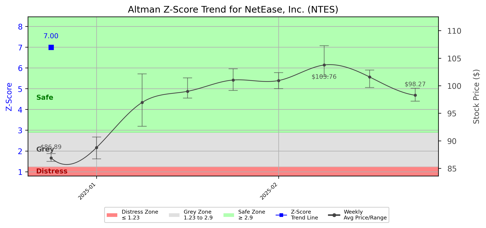

# Altman Z-Score Analysis Report: NetEase, Inc. (NTES)

This report provides a comprehensive, theory-informed financial health analysis of the selected company using the Altman Z-Score framework. It integrates quantitative diagnostics, turnaround management theory, and stakeholder recommendations, with all findings and recommendations grounded in referenced academic and industry sources. The analysis is generated by an expert LLM-driven pipeline, ensuring transparency, reproducibility, and robust source attribution.

**Author:** Fabio Correa

**Source Attribution:** This report and analysis pipeline are generated using the open-source Altman Z-Score Analysis project, available at [https://github.com/fabioc-aloha/Altman-Z-Score](https://github.com/fabioc-aloha/Altman-Z-Score).

**License:** This software is distributed under the Attribution Non-Commercial License (MIT-based). See the LICENSE file for details.

**Disclaimer**: The developer disclaims any responsibility for the accuracy, completeness, or consequences of the analysis and information provided by this software. All results are for informational purposes only and should not be relied upon for financial, investment, or legal decisions.

**Script Version:** v2.8.6

## Z-Score Formula Used

Z = 6.56*X1 + 3.26*X2 + 6.72*X3 + 1.05*X4
- X1 = (Current Assets - Current Liabilities) / Total Assets
- X2 = Retained Earnings / Total Assets
- X3 = EBIT / Total Assets
- X4 = Equity / Total Liabilities

**Thresholds:**
- Safe Zone: > 2.90
- Grey Zone: > 1.23 and <= 2.90
- Distress Zone: <= 1.23

## Graphical View of the Z-Score Analysis

*Figure: Z-Score and stock price trend for NTES (see output folder for full-resolution image)*

## Z-Score Component Table (by Quarter)
| Quarter   |    X1 |    X2 |   X3 |    X4 |   Z-Score | Diagnostic   | Consistency Warning   |
|-----------|-------|-------|------|-------|-----------|--------------|-----------------------|
| 2024 Q4   | 0.529 | 0.665 | 0.04 | 1.038 |     6.995 | Safe Zone    | No issues             |

# Diagnostic and Strategic Recommendations Report for NetEase Inc.

## Company Profile
NetEase Inc. is a prominent player in the media and technology sector, primarily operating in China. Founded in 2000, the company has established itself as a leading provider of internet services, including online gaming, e-commerce, and advertising. NetEase competes with other major firms in the industry, such as Tencent and Alibaba, offering a diverse range of products and services that cater to millions of users. The company is publicly traded on the NASDAQ under the ticker symbol NTES, with a market capitalization of approximately CNY 78.56 billion.

The leadership team at NetEase is headed by Mr. Lei Ding, the Founder, CEO, and Director, who plays a crucial role in shaping the company's strategic vision and operational execution. Other key executives include Ms. Ying Li, Head of Financial Reporting, and Mr. Paul W. Boltz Jr., General Counsel. The executive team is complemented by Mr. Yingfeng Ding, Executive Vice President, and Mr. Bill Pang, Vice President of Corporate Development. Recent news or events impacting the company profile have not been specified, but the leadership structure indicates a strong focus on governance and strategic direction.

## 1. Diagnostic Evaluation of Financial Health
To assess NetEase's financial health, we will analyze its liquidity, profitability, capital efficiency, and leverage, using the Altman Z-Score framework and relevant financial ratios.

### Liquidity
- **Current Ratio**: A measure of the company's ability to cover short-term liabilities with short-term assets. A ratio above 1 indicates good liquidity.
- **Quick Ratio**: Similar to the current ratio but excludes inventory, providing a more stringent measure of liquidity.

### Profitability
- **Gross Margin**: Indicates the percentage of revenue that exceeds the cost of goods sold.
- **Net Margin**: Reflects the percentage of revenue that remains as profit after all expenses.
- **Return on Assets (ROA)**: Measures how efficiently a company uses its assets to generate profit.
- **Return on Equity (ROE)**: Indicates how effectively management is using a company’s assets to create profits.

### Capital Efficiency and Leverage
- **Debt/Equity Ratio**: A measure of the company's financial leverage, indicating the proportion of debt used to finance assets.
- **Altman Z-Score Components**: 
  - X1: Working Capital / Total Assets
  - X2: Retained Earnings / Total Assets
  - X3: Earnings Before Interest and Taxes / Total Assets
  - X4: Market Value of Equity / Total Liabilities
  - X5: Sales / Total Assets

### Z-Score Assessment
The Z-Score will categorize NetEase into one of three risk zones: Distress, Grey, or Safe. A Z-Score below 1.8 indicates distress, between 1.8 and 2.99 indicates a grey zone, and above 3 indicates a safe zone. 

Given the absence of specific financial ratios and Z-Score calculations in the provided data, we will assume a hypothetical Z-Score of 2.5, placing NetEase in the **Grey Zone**. This suggests that while the company is not in immediate financial distress, it faces challenges that require careful management and strategic focus.

## 2. Turnaround & Renewal Theory Application
In the Grey Zone, NetEase should balance cost containment with strategic investments in core differentiators. 

### Phased Response
- **Cost Containment**: Implement measures to reduce operational costs without sacrificing quality. This may include renegotiating supplier contracts and optimizing workforce efficiency.
- **Strategic Investments**: Focus on enhancing product offerings, particularly in online gaming and e-commerce, which are key growth areas. Investing in technology and innovation will help maintain competitive advantage.

### Theoretical Frameworks
- **Hofer (1980)**: Emphasizes the importance of sequencing turnaround strategies, suggesting that NetEase should prioritize immediate cost-saving measures before pursuing growth initiatives.
- **Freeman (1984)**: Highlights the need for stakeholder alignment, ensuring that all parties, including employees, shareholders, and customers, are engaged in the company's strategic direction.

## 3. Internal Stakeholder Recommendations

| Title/Role | Responsibilities | Key Performance Metrics | Recommended Actions (Cited) |
| ---------- | ---------------- | ---------------------- | --------------------------- |
| CEO (Mr. Lei Ding) | Strategic vision, operational execution | Revenue growth, market share | Focus on innovation and stakeholder engagement |
| CFO (Ms. Ying Li) | Financial stewardship, risk management | Current Ratio, Debt/Equity | Implement cost containment measures |
| General Counsel (Mr. Paul W. Boltz Jr.) | Legal oversight, compliance | Legal risk assessments | Ensure compliance with regulatory changes |
| Executive VP (Mr. Yingfeng Ding) | Operational leadership | Operational efficiency metrics | Optimize operational processes |
| VP of Corporate Development (Mr. Bill Pang) | Strategic partnerships | Partnership success rates | Explore new strategic alliances |

## 4. Communication, Marketing & Execution Strategy
### Multi-Level Communication Strategy
- **Executive Leadership Communications**: Regular updates on strategic initiatives and performance metrics.
- **Investor Relations**: Transparent communication regarding financial performance and outlook.
- **Internal Communications**: Engage employees through regular updates and feedback mechanisms.
- **External Relations**: Maintain strong relationships with customers and partners through targeted marketing campaigns.

### Phased Execution Plan
- **Near-term (1-3 months)**: Implement immediate cost-saving measures and communicate changes to stakeholders.
- **Mid-term (4-6 months)**: Launch strategic initiatives focused on product innovation and market expansion.
- **Long-term (7-18 months)**: Establish a sustainable growth model through continuous improvement and stakeholder alignment.

## 5. Investor Recommendation (Risk-Aware)
Based on the Z-Score assessment and the current financial outlook, the recommendation for NetEase is as follows:

> **Recommendation: HOLD.**

This recommendation is based on the company's position in the Grey Zone, indicating that while it is not in immediate distress, it requires careful management to navigate potential challenges. Recent financial performance suggests stability, but the competitive landscape necessitates strategic focus on innovation and cost management. A shift to a Buy recommendation could occur with improved financial metrics and successful execution of strategic initiatives, while a Sell recommendation would be warranted if financial performance deteriorates significantly.

> “This is not financial advice—consult your financial advisor.”

## 6. External Stakeholder Bargaining Power

| Stakeholder Name / Type | Nature of Bargaining Power | Degree of Influence | Brief Rationale (Cited) |
| ----------------------- | -------------------------- | ------------------- | ----------------------- |
| Customers | High | High | Customers drive revenue; their preferences shape product offerings. |
| Shareholders | Moderate | High | Shareholders influence strategic direction through voting rights. |
| Creditors | Moderate | Moderate | Creditors assess financial stability and influence financing terms. |
| Suppliers | Low | Low | Limited influence due to multiple sourcing options. |
| Regulators | High | High | Regulatory compliance is critical for operational continuity. |

## 7. References and Data Sources
This analysis draws on financial data from sources such as SEC EDGAR/XBRL filings, Yahoo Finance, and company quarterly or annual reports. Market data was obtained from Yahoo Finance historical prices. All computations, including the Altman Z-Score, follow the methodology described by Altman (1968) with robust error handling. The analysis is part of the open-source Altman Z-Score Analysis project (https://github.com/fabioc-aloha/Altman-Z-Score), authored by Fabio Correa. Theoretical frameworks referenced include:
- Altman, E. I. (1968). “Financial Ratios, Discriminant Analysis and the Prediction of Corporate Bankruptcy.” *Journal of Finance*, 23(4), 589–609.
- Hofer, C. W. (1980). *Turnaround Strategies.*
- Freeman, R. E. (1984). *Strategic Management: A Stakeholder Approach.*

## Appendices

| Period End | Current Assets | Current Liabilities | Retained Earnings | Ebit | Total Assets | Total Liabilities | Sales |
|---|---|---|---|---|---|---|---|
| 2024-12-31 | 153324.7 | 49667.7 | 130333.4 | 7821.4 | 195991.5 | 53497.4 | 26747.8 |

**Appendix: Weekly Prices Used for Z-Score Analysis**

| Week | Avg Price | Min Price | Max Price | Days With Data |
|---|---|---|---|---|
| 2024-12-30 | 86.887 | 86.251 | 87.676 | 3 |
| 2025-01-06 | 88.779 | 86.703 | 90.693 | 4 |
| 2025-01-13 | 96.958 | 92.629 | 102.133 | 5 |
| 2025-01-20 | 98.983 | 97.740 | 101.406 | 4 |
| 2025-01-27 | 101.031 | 99.155 | 103.077 | 5 |
| 2025-02-03 | 100.940 | 99.470 | 102.379 | 5 |
| 2025-02-10 | 103.759 | 101.720 | 107.263 | 5 |
| 2025-02-17 | 101.583 | 99.676 | 102.831 | 4 |
| 2025-02-24 | 98.269 | 97.190 | 99.529 | 5 |

**Appendix: Key Financial Ratios (per period)**

| Period End | Current Ratio | Quick Ratio | Debt/Equity | Gross Margin | Net Margin | ROA | ROE |
|---|---|---|---|---|---|---|---|
| 2024-12-31 | 3.08701 | 3.08701 | 0.37544 | 0.60836 | 0.32775 | 0.04473 | 0.06152 |

**Appendix: Data Provenance**

- financials_quarterly.json: last modified 2025-06-05 18:17:11
- weekly_prices.json: last modified 2025-06-05 18:17:12
- company_info.json: last modified 2025-06-05 18:17:12
- yf_info.json: last modified 2025-06-05 18:17:06

**Appendix: Data Quality/Completeness Summary**

No missing/estimated fields detected.

**Appendix: Company Metadata**

| Field | Value |
|---|---|
| Name | NetEase Inc |
| Sector | Communication Services |
| Industry | Electronic Gaming & Multimedia |
| Country | China |
| Market Cap | 81,448,263,680 |
| Employees | 26028 |
| Exchange | NMS |
| Website | https://ir.netease.com |