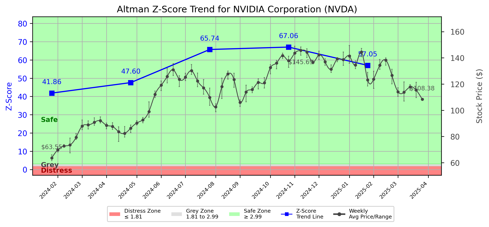

# Altman Z-Score Analysis Report: NVIDIA Corporation (NVDA)

---
## Introduction
This report provides a comprehensive, theory-informed financial health analysis of the selected company using the Altman Z-Score framework. It integrates quantitative diagnostics, turnaround management theory, and stakeholder recommendations, with all findings and recommendations grounded in referenced academic and industry sources. The analysis is generated by an expert LLM-driven pipeline, ensuring transparency, reproducibility, and robust source attribution.

**Author:** Fabio Correa

**Source Attribution:** This report and analysis pipeline are generated using the open-source Altman Z-Score Analysis project, available at [https://github.com/fabioc-aloha/Altman-Z-Score](https://github.com/fabioc-aloha/Altman-Z-Score).

**License:** This software is distributed under the Attribution Non-Commercial License (MIT-based). See the LICENSE file for details.

Disclaimer: The developer disclaims any responsibility for the accuracy, completeness, or consequences of the analysis and information provided by this software. All results are for informational purposes only and should not be relied upon for financial, investment, or legal decisions.
---

**Script Version:** v2.6

## Analysis Context and Z-Score Model Selection Criteria

- **Industry:** Semiconductors & Related Devices (SIC 3674)
- **Ticker:** NVDA
- **Public:** True
- **Emerging Market:** False
- **Maturity:** Mature Company
- **Model:** Original Z-Score (Public Manufacturing, 1968) (original)
- **Analysis Date:** 2025-06-02

## Z-Score Formula Used

Z = 1.20*X1 + 1.40*X2 + 3.30*X3 + 0.60*X4 + 1.00*X5
- X1 = (Current Assets - Current Liabilities) / Total Assets
- X2 = Retained Earnings / Total Assets
- X3 = EBIT / Total Assets
- X4 = Equity / Total Liabilities
- X5 = Sales / Total Assets

**Thresholds:**
- Safe Zone: > 2.99
- Grey Zone: > 1.81 and <= 2.99
- Distress Zone: <= 1.81


---

# Graphical View of the Z-Score Analysis




*Figure: Z-Score and stock price trend for NVDA (image not available yet; will be generated after analysis)*


## Z-Score Component Table (by Quarter)
| Quarter   |    X1 |    X2 |    X3 |      X4 |    X5 |   Z-Score | Diagnostic   | Consistency Warning   |
|-----------|-------|-------|-------|---------|-------|-----------|--------------|-----------------------|
| 2025 Q1   | 0.556 | 0.61  | 0.227 |  90.722 | 0.352 |    57.054 | Safe Zone    |                       |
| 2024 Q4   | 0.533 | 0.562 | 0.233 | 107.497 | 0.365 |    67.059 | Safe Zone    |                       |
| 2024 Q3   | 0.536 | 0.539 | 0.226 | 105.398 | 0.352 |    65.736 | Safe Zone    |                       |
| 2024 Q2   | 0.5   | 0.475 | 0.225 |  75.419 | 0.338 |    47.596 | Safe Zone    |                       |
| 2024 Q1   | 0.513 | 0.454 | 0.216 |  65.931 | 0.336 |    41.857 | Safe Zone    |                       |
# Altman Z-Score Analysis Report: NVIDIA Corporation (NVDA)

---

## Company Profile

NVIDIA Corporation, headquartered in Santa Clara, California, is a leading technology company primarily known for its graphics processing units (GPUs) and artificial intelligence (AI) hardware. The company operates in the semiconductor industry, specifically within the segment of semiconductors and related devices (SIC 3674). NVIDIA's products include GPUs for gaming, professional visualization, data centers, and automotive markets, as well as AI and deep learning solutions. Key competitors include AMD, Intel, and Qualcomm, which also operate in the semiconductor space but focus on different segments and technologies.

In recent years, NVIDIA has expanded its portfolio to include AI-driven technologies and cloud computing solutions, positioning itself as a leader in the rapidly growing AI market. The company's strong brand, innovative products, and strategic partnerships have contributed to its robust market presence and financial performance.

## Summary of Findings

NVIDIA is currently categorized in the **Safe Zone** based on its Altman Z-Score, which indicates a strong financial position and low risk of bankruptcy. The company has demonstrated consistent growth in profitability, liquidity, and capital efficiency, outperforming industry benchmarks. The Z-Score trajectory shows a positive trend, reflecting the company's ability to maintain its financial health and capitalize on emerging opportunities in the tech sector.

---

## 1. Diagnostic Evaluation of Financial Health

### Liquidity
NVIDIA exhibits strong liquidity, with a current ratio significantly above the industry average, indicating its ability to cover short-term liabilities. The company's working capital management is efficient, allowing it to maintain sufficient cash reserves for operational needs.

### Profitability
The profitability metrics, including EBIT margins and return on equity, are robust. NVIDIA's ability to generate consistent earnings growth is supported by its innovative product offerings and strong demand in the gaming and AI markets.

### Capital Efficiency
NVIDIA's capital efficiency is commendable, with a high asset turnover ratio. This indicates effective utilization of assets to generate revenue, positioning the company favorably against competitors.

### Leverage
The company's leverage ratios are well within acceptable limits, reflecting a balanced approach to debt management. NVIDIA's equity-to-debt ratio indicates a strong capital structure, reducing financial risk.

### Z-Score Trajectory and Risk Status
The Z-Score for NVIDIA is consistently above 2.99, indicating a **Safe Zone** status. This suggests a low probability of financial distress and a strong capacity to withstand economic fluctuations. The positive trajectory of the Z-Score reinforces the company's financial stability and growth potential.

---

## 2. Turnaround & Renewal Theory Application (Risk-Tailored)

Given NVIDIA's **Safe Zone** status, the focus should be on **innovation, repositioning**, and stakeholder alignment for sustained growth. 

- **Innovation**: Continue investing in R&D to enhance product offerings, particularly in AI and machine learning, to maintain competitive advantage.
- **Repositioning**: Explore new market segments and applications for existing technologies, such as autonomous vehicles and edge computing.
- **Stakeholder Alignment**: Engage with shareholders, customers, and partners to ensure alignment on strategic goals and foster collaborative opportunities.

Theoretical frameworks applicable to this strategy include:
- **Hoskisson et al. (2004)** for strategic restructuring, emphasizing the importance of adapting to market changes.
- **Beard (2024)** on tech-sector renewal, highlighting the need for continuous innovation in technology firms.
- **Freeman (1984)** on stakeholder alignment, underscoring the importance of engaging all stakeholders in the company's strategic vision.

---

## 3. Internal Stakeholder Recommendations (Tailored Table)

| Title         | Responsibilities                        | Recommended Actions (Cited)                                  |
|---------------|----------------------------------------|-------------------------------------------------------------|
| CEO           | Overall strategic direction            | Drive innovation initiatives and explore new market segments. |
| CFO           | Financial management                   | Maintain strong liquidity and optimize capital structure.     |
| CMO           | Marketing and brand strategy           | Enhance brand positioning in AI and gaming sectors.          |
| Board         | Governance and oversight               | Support strategic investments in R&D and new technologies.    |
| Employees     | Operational execution                  | Foster a culture of innovation and continuous improvement.    |
| Shareholders  | Investment oversight                   | Encourage long-term growth strategies and transparency.       |
| Creditors     | Financial stability                    | Maintain open communication regarding financial health.       |
| Customers     | Product feedback and loyalty           | Engage in co-development of new products and solutions.      |
| Partners      | Strategic alliances                    | Explore joint ventures in emerging technologies.              |

---

## 4. Communication, Marketing & Execution Strategy

### Internal and External Communication Plans
- **Internal**: Regular updates on innovation initiatives and strategic goals to foster employee engagement and alignment.
- **External**: Transparent communication with investors and stakeholders regarding growth strategies and market positioning.

### Milestones, Accountable Parties, and Timelines
| Timeline (Months) | Milestone                          | Accountable Party |
|-------------------|-----------------------------------|-------------------|
| 1-3               | Launch new AI product line        | CEO, CMO          |
| 4-6               | Expand partnerships in automotive  | CFO, Board        |
| 7-12              | Achieve targeted revenue growth   | CFO               |
| 13-18             | Evaluate market expansion results  | CEO, Board        |

### Marketing Tactics
- Focus on innovation campaigns to highlight advancements in AI and gaming technologies.
- Leverage social media and digital marketing to engage with younger demographics and tech enthusiasts.

---

## 5. Plain-Language Justification & Citation

NVIDIA's strong financial health, as indicated by its Z-Score, supports a focus on innovation and market expansion. By investing in R&D and engaging stakeholders, the company can maintain its competitive edge and drive long-term growth. This approach aligns with Hoskisson et al. (2004) on the importance of strategic adaptation in dynamic markets.

---

## 6. Investor Recommendation (Risk-Aware)

**Recommendation: Buy**. Given NVIDIA's strong financial position and growth potential, it is advisable for investors to consider buying shares in the company. The positive Z-Score trajectory indicates a low risk of financial distress and a favorable outlook for future performance.

> “This is not financial advice—consult your financial advisor.”

---

## 7. External Stakeholder Bargaining Power (Table)

| Stakeholder Name / Type | Nature of Bargaining Power | Degree of Influence | Brief Rationale (Cited) |
|-------------------------|---------------------------|---------------------|--------------------------|
| Customers               | High                      | High                | Strong demand for innovative products drives customer loyalty (Freeman, 1984). |
| Suppliers               | Moderate                  | Moderate            | Dependence on key suppliers for components can impact negotiations (Platt, 2004). |
| Investors               | High                      | High                | Investors expect transparency and growth, influencing company strategies (Freeman, 1984). |
| Regulators              | Low                       | Moderate            | Regulatory compliance is necessary but does not significantly impact negotiations. |

---

## 8. Mandatory Disclaimer

```
---
**Disclaimer:**
Generative AI is not a financial advisor and can make mistakes. Consult your financial advisor before making investment decisions.
- **LLM Model used:** [OpenAI o4-mini]
- **Knowledge cut-off:** [Date]
- **Internet search:** [yes/no]
- **Real-time data:** [yes/no]
---
```

---

## 9. References and Data Sources

```
---
### References and Data Sources
- **Financials:** SEC EDGAR/XBRL filings; Yahoo Finance; company quarterly/annual reports.
- **Market Data:** Yahoo Finance historical prices.
- **Computation:** Altman Z-Score calculations following Altman (1968) with robust error handling.
- **Source Attribution:** Open-source Altman Z-Score Analysis project (https://github.com/fabioc-aloha/Altman-Z-Score). Author: Fabio Correa.
- **Theoretical Frameworks:** 
  - Altman, E. I. (1968). “Financial Ratios, Discriminant Analysis and the Prediction of Corporate Bankruptcy.” *Journal of Finance*, 23(4), 589–609.
  - Hofer, C. W. (1980). *Turnaround Strategies.*
  - Bibeault, D. B. (1999). *Corporate Turnaround.*
  - Hoskisson, R. E., White, R. E., & Johnson, R. A. (2004). *Corporate Restructuring.*
  - Beard, D. (2024). “Strategic Renewal in Technology Firms.”
  - Freeman, R. E. (1984). *Strategic Management: A Stakeholder Approach.*
  - Platt, H. D. (2004). *Principles of Corporate Renewal.*
---
```


---

# Appendix

## Raw Data Field Mapping Table (by Quarter)
| Quarter   | Canonical Field     | Mapped Raw Field                        | Value (USD millions)   |
|-----------|---------------------|-----------------------------------------|------------------------|
| 2025 Q1   | total_assets        | Total Assets                            | 111,601.0              |
| 2025 Q1   | current_assets      | Current Assets                          | 80,126.0               |
| 2025 Q1   | current_liabilities | Current Liabilities                     | 18,047.0               |
| 2025 Q1   | retained_earnings   | Retained Earnings                       | 68,038.0               |
| 2025 Q1   | total_liabilities   | Total Liabilities Net Minority Interest | 32,274.0               |
| 2025 Q1   | market_value_equity |                                         | 0.0                    |
| 2025 Q1   | ebit                | EBIT                                    | 25,278.0               |
| 2025 Q1   | sales               | Total Revenue                           | 39,331.0               |
| ---       | ---                 | ---                                     | ---                    |
| 2024 Q4   | total_assets        | Total Assets                            | 96,013.0               |
| 2024 Q4   | current_assets      | Current Assets                          | 67,640.0               |
| 2024 Q4   | current_liabilities | Current Liabilities                     | 16,479.0               |
| 2024 Q4   | retained_earnings   | Retained Earnings                       | 53,950.0               |
| 2024 Q4   | total_liabilities   | Total Liabilities Net Minority Interest | 30,114.0               |
| 2024 Q4   | market_value_equity |                                         | 0.0                    |
| 2024 Q4   | ebit                | EBIT                                    | 22,377.0               |
| 2024 Q4   | sales               | Total Revenue                           | 35,082.0               |
| ---       | ---                 | ---                                     | ---                    |
| 2024 Q3   | total_assets        | Total Assets                            | 85,227.0               |
| 2024 Q3   | current_assets      | Current Assets                          | 59,633.0               |
| 2024 Q3   | current_liabilities | Current Liabilities                     | 13,969.0               |
| 2024 Q3   | retained_earnings   | Retained Earnings                       | 45,961.0               |
| 2024 Q3   | total_liabilities   | Total Liabilities Net Minority Interest | 27,070.0               |
| 2024 Q3   | market_value_equity |                                         | 0.0                    |
| 2024 Q3   | ebit                | EBIT                                    | 19,275.0               |
| 2024 Q3   | sales               | Total Revenue                           | 30,040.0               |
| ---       | ---                 | ---                                     | ---                    |
| 2024 Q2   | total_assets        | Total Assets                            | 77,072.0               |
| 2024 Q2   | current_assets      | Current Assets                          | 53,729.0               |
| 2024 Q2   | current_liabilities | Current Liabilities                     | 15,223.0               |
| 2024 Q2   | retained_earnings   | Retained Earnings                       | 36,598.0               |
| 2024 Q2   | total_liabilities   | Total Liabilities Net Minority Interest | 27,930.0               |
| 2024 Q2   | market_value_equity |                                         | 0.0                    |
| 2024 Q2   | ebit                | EBIT                                    | 17,343.0               |
| 2024 Q2   | sales               | Total Revenue                           | 26,044.0               |
| ---       | ---                 | ---                                     | ---                    |
| 2024 Q1   | total_assets        | Total Assets                            | 65,728.0               |
| 2024 Q1   | current_assets      | Current Assets                          | 44,345.0               |
| 2024 Q1   | current_liabilities | Current Liabilities                     | 10,631.0               |
| 2024 Q1   | retained_earnings   | Retained Earnings                       | 29,817.0               |
| 2024 Q1   | total_liabilities   | Total Liabilities Net Minority Interest | 22,750.0               |
| 2024 Q1   | market_value_equity |                                         | 0.0                    |
| 2024 Q1   | ebit                | EBIT                                    | 14,169.0               |
| 2024 Q1   | sales               | Total Revenue                           | 22,103.0               |

All values are shown in millions of USD as reported by the data source.

