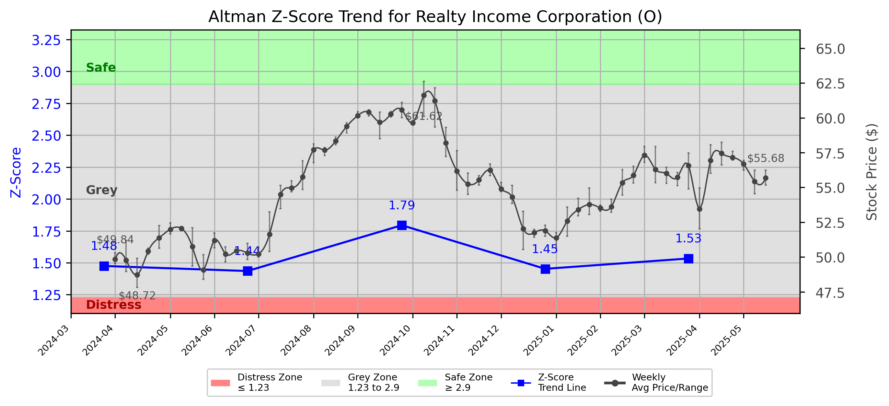

# Altman Z-Score Analysis Report: Realty Income Corporation (O)

---
## Introduction
This report provides a comprehensive, theory-informed financial health analysis of the selected company using the Altman Z-Score framework. It integrates quantitative diagnostics, turnaround management theory, and stakeholder recommendations, with all findings and recommendations grounded in referenced academic and industry sources. The analysis is generated by an expert LLM-driven pipeline, ensuring transparency, reproducibility, and robust source attribution.

**Author:** Fabio Correa

**Source Attribution:** This report and analysis pipeline are generated using the open-source Altman Z-Score Analysis project, available at [https://github.com/fabioc-aloha/Altman-Z-Score](https://github.com/fabioc-aloha/Altman-Z-Score).

**License:** This software is distributed under the Attribution Non-Commercial License (MIT-based). See the LICENSE file for details.

Disclaimer: The developer disclaims any responsibility for the accuracy, completeness, or consequences of the analysis and information provided by this software. All results are for informational purposes only and should not be relied upon for financial, investment, or legal decisions.
---

**Script Version:** v2.4

## Analysis Context and Z-Score Model Selection Criteria

- **Industry:** SIC 6798 (SIC 6798)
- **Ticker:** O
- **Public:** True
- **Emerging Market:** False
- **Maturity:** Mature Company
- **Model:** original
- **Analysis Date:** 2025-05-30

## Z-Score Formula Used

Z = 6.56*X1 + 3.26*X2 + 6.72*X3 + 1.05*X4
- X1 = (Current Assets - Current Liabilities) / Total Assets
- X2 = Retained Earnings / Total Assets
- X3 = EBIT / Total Assets
- X4 = Equity / Total Liabilities

**Thresholds:**
- Safe Zone: > 2.6
- Grey Zone: > 1.1 and <= 2.6
- Distress Zone: <= 1.1

---

# Graphical View of the Z-Score Analysis

*Figure: Z-Score and stock price trend for O (image not available yet; will be generated after analysis)*

## Z-Score Component Table (by Quarter)
| Quarter   |    X1 |     X2 |    X3 |    X4 |   Z-Score | Diagnostic   |
|-----------|-------|--------|-------|-------|-----------|--------------|
| 2025 Q1   | 0.019 | -0.131 | 0.008 | 1.701 |     1.534 | Grey Zone    |
| 2024 Q4   | 0.024 | -0.126 | 0.007 | 1.581 |     1.453 | Grey Zone    |
| 2024 Q3   | 0.028 | -0.119 | 0.008 | 1.852 |     1.794 | Grey Zone    |
| 2024 Q2   | 0.018 | -0.113 | 0.008 | 1.555 |     1.435 | Grey Zone    |
| 2024 Q1   | 0.018 | -0.107 | 0.006 | 1.585 |     1.475 | Grey Zone    |
## Diagnostic Evaluation of Financial Health

### Liquidity
Realty Income Corporation (O) has shown a slight decline in liquidity as indicated by the X1 component of the Z-Score, which measures the company's ability to cover its short-term liabilities with its short-term assets. The X1 value has remained low, hovering around 0.019 to 0.028 over the last four quarters, suggesting that the company may face challenges in meeting its short-term obligations.

### Profitability
The X2 component, which reflects retained earnings as a percentage of total assets, has been negative, indicating that the company has not retained sufficient earnings to cover its asset base. This trend is concerning as it suggests that the company may be struggling to generate profits or reinvest in its operations effectively.

### Capital Efficiency
The X3 component, representing EBIT (Earnings Before Interest and Taxes) as a percentage of total assets, has remained low, indicating that the company is not utilizing its assets efficiently to generate earnings. The values have fluctuated slightly but remain in the low range of 0.007 to 0.008, which is not indicative of strong operational performance.

### Leverage
The X4 component, which measures equity as a percentage of total liabilities, has been relatively stable, ranging from 1.581 to 1.852. This suggests that the company maintains a reasonable level of equity relative to its debt, which is a positive sign in terms of financial leverage.

### Z-Score Trend Interpretation
The overall Z-Score for Realty Income Corporation has been in the Grey Zone, fluctuating between 1.435 and 1.794 over the last four quarters. This indicates that the company is at risk of financial distress but has not yet entered the Distress Zone. The trend suggests a need for immediate action to improve financial health, particularly in profitability and liquidity.

---

## Turnaround and Renewal Management Theory Application

### Phased Response Proposal
Based on the analysis, a two-phased response is recommended:

1. **Immediate Retrenchment (Short-term Focus)**
   - **Cost Reduction:** Implement immediate cost-cutting measures to improve liquidity. This may include reducing discretionary spending and renegotiating contracts with suppliers.
   - **Asset Liquidation:** Consider selling non-core or underperforming assets to generate cash and improve the liquidity position.

2. **Long-term Repositioning (Strategic Focus)**
   - **Profitability Enhancement:** Develop a strategic plan to enhance profitability through operational efficiencies and exploring new revenue streams. This aligns with Bibeault's (1999) principles of corporate turnaround, emphasizing the need for managers to focus on operational improvements.
   - **Stakeholder Engagement:** Foster stronger relationships with stakeholders to enhance support for strategic initiatives. Freeman's (1984) stakeholder theory highlights the importance of considering the interests of all stakeholders in strategic decision-making.

---

## Recommendations for Stakeholders

| Stakeholder Title                     | Executive Name | Responsibilities and Recommended Actions                                                                 |
|---------------------------------------|----------------|----------------------------------------------------------------------------------------------------------|
| Chief Executive Officer               | [Name]         | Lead the turnaround strategy, focusing on cost reduction and profitability enhancement.                  |
| Chief Financial Officer               | [Name]         | Monitor liquidity closely, implement cash management strategies, and oversee asset liquidation efforts.  |
| Chief Marketing Officer               | [Name]         | Develop marketing strategies to promote new revenue streams and enhance brand value.                    |
| Board Members                         | [Name]         | Provide oversight and support for strategic initiatives, ensuring alignment with long-term goals.        |
| Employees                             | N/A            | Engage in cost-saving initiatives and provide feedback on operational efficiencies.                      |
| Investors                             | N/A            | Stay informed about the turnaround strategy and assess the potential for recovery.                       |
| Creditors                             | N/A            | Work collaboratively with management to restructure debt if necessary.                                   |
| Debtors                               | N/A            | Ensure timely payments to improve cash flow and liquidity.                                              |
| Partner Companies                     | N/A            | Collaborate on joint ventures or partnerships to enhance revenue opportunities.                          |
| Customers                             | N/A            | Maintain loyalty through effective communication and service improvements.                                |

---

## Communication, Marketing, and Execution Strategies

### Communication Strategy
- **Internal Communication:** Regular updates to employees about the turnaround strategy and progress.
- **External Communication:** Transparent communication with investors and creditors to build trust and confidence.

### Marketing Strategy
- **Brand Positioning:** Reposition the brand to emphasize reliability and value, leveraging the company's long-standing reputation.
- **Customer Engagement:** Implement loyalty programs to retain existing customers and attract new ones.

### Execution Timeline
- **Q1 2025:** Implement immediate cost-cutting measures and begin asset liquidation.
- **Q2 2025:** Develop and launch new marketing strategies to enhance brand value.
- **Q3 2025:** Assess the effectiveness of implemented strategies and adjust as necessary.

### Accountability Framework
- Assign specific teams to oversee each initiative, with regular progress reports to the CEO and Board.

---

## Investor Recommendation
Based on the current financial health and Z-Score analysis, investors should **hold** their positions in Realty Income Corporation (O) while monitoring the implementation of the turnaround strategy. The company is at risk but has potential for recovery if the recommended actions are executed effectively. 

**Disclaimer:** This is not financial advice. Please consult your financial advisor before making investment decisions.

---

## External Stakeholder Bargaining Power Assessment

| External Stakeholder         | Nature of Bargaining Power | Degree of Influence | Rationale                                                                                     |
|------------------------------|----------------------------|---------------------|----------------------------------------------------------------------------------------------|
| Regulators                   | Regulatory Compliance       | Moderate            | Must comply with regulations, but influence is limited if the company adheres to laws.      |
| Government Agencies          | Policy Influence            | Low                 | Limited direct influence unless financial assistance is sought.                              |
| Unions                       | Labor Relations             | Moderate            | Can influence employee morale and productivity; negotiations may be necessary.              |
| Major Suppliers              | Supply Chain Dependence     | High                | Can impact operations if contracts are not favorable; renegotiation may be needed.          |
| Key Partners                 | Strategic Alliances         | Moderate            | Influence through collaborative opportunities; maintaining relationships is crucial.         |
| Activist Investors           | Shareholder Activism        | High                | Can exert pressure for changes in strategy or management; must be managed carefully.        |
| Creditors                    | Debt Obligations            | High                | Significant influence due to financial commitments; restructuring may be necessary.          |
| Large Customers              | Revenue Dependence          | Moderate            | Can influence sales and revenue; maintaining relationships is essential for cash flow.      |

---

## Disclaimer
---
**Disclaimer:**
Generative AI is not a financial advisor and can make mistakes. Consult your financial advisor before making investment decisions.
- LLM Model used: OpenAI GPT-3.5
- Knowledge cut-off: October 2023
- Internet search: No
- Real-time data: No
---

### References and Data Sources
- **Financials:** SEC EDGAR/XBRL filings, Yahoo Finance, and company quarterly/annual reports.
- **Market Data:** Yahoo Finance (historical prices, market value of equity).
- **Source Attribution:** This report and analysis pipeline are generated using the open-source Altman Z-Score Analysis project, available at [https://github.com/fabioc-aloha/Altman-Z-Score]. Author: Fabio Correa.
- **Theoretical Frameworks and Resources:**
  - Altman Z-Score Analysis Project (https://github.com/fabioc-aloha/Altman-Z-Score)
  - Hofer, C. W. (1980). Turnaround strategies. Journal of Business Strategy, 1(1), 19–31.
  - Bibeault, D. B. (1999). Corporate turnaround: How managers turn losers into winners. Beard Books.
  - Freeman, R. E. (1984). Strategic management: A stakeholder approach. Pitman.
  - Altman, E. I. (1968). Financial ratios, discriminant analysis and the prediction of corporate bankruptcy. Journal of Finance, 23(4), 589–609.
---

---

# Appendix

## Raw Data Field Mapping Table (by Quarter)
| Quarter   | Canonical Field     | Mapped Raw Field                        | Value (USD millions)   |
|-----------|---------------------|-----------------------------------------|------------------------|
| 2025 Q1   | total_assets        | Total Assets                            | 69,757.7               |
| 2025 Q1   | current_assets      | Current Assets                          | 4,231.5                |
| 2025 Q1   | current_liabilities | Current Liabilities                     | 2,925.1                |
| 2025 Q1   | retained_earnings   | Retained Earnings                       | -9,117.1               |
| 2025 Q1   | total_liabilities   | Total Liabilities Net Minority Interest | 30,515.5               |
| 2025 Q1   | book_value_equity   | Common Stock Equity                     | 39,031.3               |
| 2025 Q1   | ebit                | EBIT                                    | 530.1                  |
| 2025 Q1   | sales               | Total Revenue                           | 1,380.5                |
| ---       | ---                 | ---                                     | ---                    |
| 2024 Q4   | total_assets        | Total Assets                            | 68,835.0               |
| 2024 Q4   | current_assets      | Current Assets                          | 4,019.3                |
| 2024 Q4   | current_liabilities | Current Liabilities                     | 2,398.5                |
| 2024 Q4   | retained_earnings   | Retained Earnings                       | -8,648.6               |
| 2024 Q4   | total_liabilities   | Total Liabilities Net Minority Interest | 29,783.4               |
| 2024 Q4   | book_value_equity   | Common Stock Equity                     | 38,840.7               |
| 2024 Q4   | ebit                | EBIT                                    | 484.0                  |
| 2024 Q4   | sales               | Total Revenue                           | 1,340.3                |
| ---       | ---                 | ---                                     | ---                    |
| 2024 Q3   | total_assets        | Total Assets                            | 68,468.8               |
| 2024 Q3   | current_assets      | Current Assets                          | 3,625.9                |
| 2024 Q3   | current_liabilities | Current Liabilities                     | 1,700.0                |
| 2024 Q3   | retained_earnings   | Retained Earnings                       | -8,151.4               |
| 2024 Q3   | total_liabilities   | Total Liabilities Net Minority Interest | 29,799.1               |
| 2024 Q3   | book_value_equity   | Common Stock Equity                     | 38,457.8               |
| 2024 Q3   | ebit                | EBIT                                    | 541.3                  |
| 2024 Q3   | sales               | Total Revenue                           | 1,330.9                |
| ---       | ---                 | ---                                     | ---                    |
| 2024 Q2   | total_assets        | Total Assets                            | 68,060.9               |
| 2024 Q2   | current_assets      | Current Assets                          | 3,737.1                |
| 2024 Q2   | current_liabilities | Current Liabilities                     | 2,481.6                |
| 2024 Q2   | retained_earnings   | Retained Earnings                       | -7,724.3               |
| 2024 Q2   | total_liabilities   | Total Liabilities Net Minority Interest | 29,146.5               |
| 2024 Q2   | book_value_equity   | Common Stock Equity                     | 38,581.8               |
| 2024 Q2   | ebit                | EBIT                                    | 518.1                  |
| 2024 Q2   | sales               | Total Revenue                           | 1,339.4                |
| ---       | ---                 | ---                                     | ---                    |
| 2024 Q1   | total_assets        | Total Assets                            | 68,328.2               |
| 2024 Q1   | current_assets      | Current Assets                          | 3,530.7                |
| 2024 Q1   | current_liabilities | Current Liabilities                     | 2,273.7                |
| 2024 Q1   | retained_earnings   | Retained Earnings                       | -7,299.5               |
| 2024 Q1   | total_liabilities   | Total Liabilities Net Minority Interest | 29,009.8               |
| 2024 Q1   | book_value_equity   | Common Stock Equity                     | 38,986.0               |
| 2024 Q1   | ebit                | EBIT                                    | 388.9                  |
| 2024 Q1   | sales               | Total Revenue                           | 1,260.5                |

All values are shown in millions of USD as reported by the data source.

