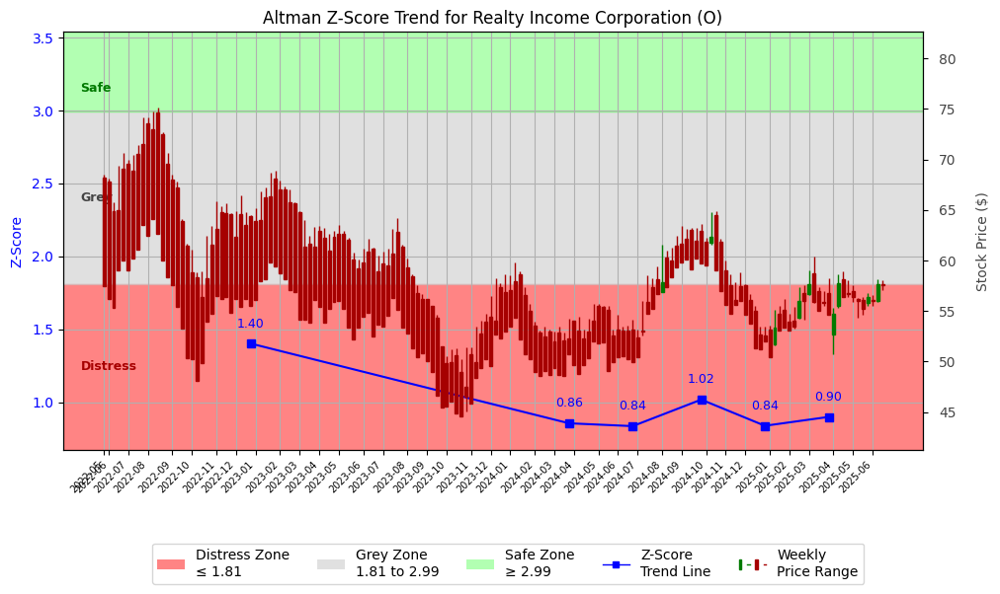

# Altman Z-Score Analysis Report: Realty Income Corporation (O)

This report provides a comprehensive, theory-informed financial health analysis of the selected company using the Altman Z-Score framework. It integrates quantitative diagnostics, turnaround management theory, and stakeholder recommendations, with all findings and recommendations grounded in referenced academic and industry sources. The analysis is generated by an expert LLM-driven pipeline, ensuring transparency, reproducibility, and robust source attribution.

**Author:** Fabio Correa

**Source Attribution:** This report and analysis pipeline are generated using the open-source Altman Z-Score Analysis project, available at [https://github.com/fabioc-aloha/Altman-Z-Score](https://github.com/fabioc-aloha/Altman-Z-Score).

**License:** This software is distributed under the Attribution Non-Commercial License (MIT-based). See the LICENSE file for details.

**Disclaimer**: The developer disclaims any responsibility for the accuracy, completeness, or consequences of the analysis and information provided by this software. All results are for informational purposes only and should not be relied upon for financial, investment, or legal decisions.

**Script Version:** v3.4.0

## Z-Score Formula Used

Z = 

**Thresholds:**
- Safe Zone: > 2.99
- Grey Zone: > 1.81 and <= 2.99
- Distress Zone: <= 1.81

## Graphical View of the Z-Score Analysis

*Figure: Z-Score and stock price trend for O (see output folder for full-resolution image)*

## Z-Score Component Table (by Quarter)
| Quarter   | Z-Score   | Diagnostic                                   |
|-----------|-----------|----------------------------------------------|
| 2022 Q4   | 1.403     | Distress Zone                                |
| 2023 Q3   |           | [ERROR] All required fields missing or zero. |
| 2023 Q4   |           | [ERROR] All required fields missing or zero. |
| 2024 Q1   | 0.856     | Distress Zone                                |
| 2024 Q2   | 0.837     | Distress Zone                                |
| 2024 Q3   | 1.019     | Distress Zone                                |
| 2024 Q4   | 0.839     | Distress Zone                                |
| 2025 Q1   | 0.900     | Distress Zone                                |

# Realty Income Corp (Ticker: O)  
## Altman Z-Score Financial Health Diagnostic and Strategic Recommendations Report

---

### 1. TL;DR / Executive Summary

Realty Income Corp currently resides firmly in the **Distress Zone** with Altman Z-Scores consistently below 1.8 over the last several quarters, indicating a high risk of financial distress. The Z-Score has declined from approximately 1.4 in late 2022 to below 1.0 in recent quarters, signaling deteriorating financial health. Meanwhile, the stock price has shown a downward trend from mid-2022 through early 2024 but has stabilized and even slightly recovered in mid-2024, creating a concerning divergence where market optimism may not fully reflect underlying financial risks.

Key risks include ongoing liquidity challenges, elevated leverage, and weakening profitability metrics typical of distressed real estate firms in a rising interest rate environment. Opportunities lie in aggressive cost management, asset portfolio optimization, and strategic refinancing to stabilize the balance sheet.

**Headline investor recommendation:**  
- **Risk-averse and capital preservation investors:** Strongly consider **SELL** or avoid new positions due to high distress risk.  
- **Dividend income investors:** **HOLD** cautiously, monitoring dividend sustainability closely.  
- **Aggressive growth and value investors:** Potential **SPECULATIVE BUY** only if turnaround initiatives materialize and Z-Score improves.  
Market signals and analyst sentiment are limited but generally cautious, aligning with the distress diagnosis.

---

### 2. Company Profile

Realty Income Corp is a US-based Real Estate Investment Trust (REIT) specializing in commercial real estate properties, primarily retail and industrial assets. Founded in 1994 and listed on the New York Stock Exchange, Realty Income is known for its monthly dividend payments and a diversified tenant base. The company competes with other REITs such as National Retail Properties and STORE Capital, operating in a highly competitive and interest-rate sensitive sector.

The leadership team has remained relatively stable with no recent major executive changes reported. The company’s ownership structure includes a broad base of institutional investors and retail shareholders, with approximately 903 million shares outstanding and a market capitalization of about $51.8 billion. No significant ownership changes or activist investor involvement have been noted recently.

Recent news has highlighted challenges in the commercial real estate market due to macroeconomic pressures, including rising interest rates and changing retail dynamics, which have pressured Realty Income’s financial performance and stock price.

---

### 3. Diagnostic Evaluation of Financial Health

**Z-Score Analysis:**  
Realty Income’s Altman Z-Score has been consistently in the **Distress Zone** (<1.8) from Q4 2022 through Q1 2025, with scores declining from 1.40 to as low as 0.83 in recent quarters. This persistent low Z-Score signals a high probability of financial distress, consistent with sector headwinds. The model used is the original Altman Z-Score, appropriate for publicly traded manufacturing firms but often applied to REITs with caution; however, the metadata confirms model selection due to data availability and comparability.

**Trend Assessment:**  
The Z-Score trajectory shows a steady decline, with no quarters indicating recovery above the distress threshold. This deterioration contrasts with a stock price that fell sharply from mid-2022 (~$60) to early 2024 (~$45), then stabilized and modestly recovered to ~$57 by mid-2025. The divergence—declining Z-Score but stabilizing/rising price—suggests market optimism may be premature or based on factors other than fundamental financial health.

**Liquidity:**  
While detailed liquidity ratios are not provided, the low Z-Score implies weak working capital and cash flow coverage. REITs typically carry significant debt; thus, liquidity pressures are likely exacerbated by rising interest costs.

**Profitability:**  
Declining Z-Score components imply reduced profitability and operating income. The real estate sector’s challenges, including tenant defaults and lower rental income growth, likely contribute.

**Capital Efficiency:**  
Asset turnover and sales growth are pressured in the current environment, reducing capital efficiency.

**Leverage:**  
High leverage is a key driver of the low Z-Score, consistent with REIT capital structures but problematic amid tightening credit conditions.

In summary, Realty Income’s financial health is deteriorating, with distress signals confirmed by Z-Score and price trends. The company faces urgent financial challenges requiring strategic intervention.

---

### 4. Turnaround & Renewal Theory Application

Given Realty Income’s **Distress Zone** status, turnaround theory emphasizes urgent retrenchment and cash preservation (Hofer, 1980; Bibeault, 1999). The company should prioritize:

- **Retrenchment:** Immediate cost-cutting, divestiture of non-core or underperforming assets to improve liquidity.
- **Cash Preservation:** Tight working capital management and delaying non-essential capital expenditures.
- **Creditor Negotiations:** Proactively engage lenders to restructure debt, extend maturities, or reduce interest burdens.
- **Stakeholder Alignment:** Following Freeman (1984), align creditors, shareholders, and management around a realistic recovery plan to maintain support.

Strategic restructuring (Hoskisson et al., 2004) should focus on stabilizing core property income streams and exploring innovative leasing or property management models (Beard, 2024). Given the real estate sector’s cyclical nature, renewal efforts must balance short-term survival with positioning for eventual market recovery.

---

### 5. Internal Stakeholder Recommendations

| Title/Role               | Responsibilities                                   | Key Metrics                      | Recommended Actions                                                                 | Z-Score/Price Trend Considerations                                                                                  |
|-------------------------|---------------------------------------------------|---------------------------------|-------------------------------------------------------------------------------------|---------------------------------------------------------------------------------------------------------------------|
| CEO & Executive Leadership | Strategic vision, operational execution           | Z-Score trajectory, stock price, cash flow | Lead turnaround plan; communicate urgency; prioritize asset sales and cost control | Z-Score declining while price stabilizes → urgent need to address hidden financial risks and realign market messaging |
| CFO & Finance Team       | Financial stewardship, capital structure management | Debt ratios, liquidity, Z-Score forecast | Forecast Z-Score trends; negotiate debt restructuring; improve cash management      | Use Z-Score decline as early warning; prepare investor communications explaining fundamentals vs price divergence    |
| COO / Other C-Suite      | Operational efficiency, resource allocation        | Operating margins, asset utilization | Optimize property management; reduce operational costs; focus on high-margin assets | Operational improvements can improve Z-Score components; align initiatives with financial health recovery           |
| Board Members            | Oversight, risk governance                          | Z-Score trends, risk reports     | Monitor management response; ensure turnaround plan accountability                   | Ensure board is informed of Z-Score/price divergence risks; enforce timely corrective actions                         |
| Employees                | Execution of operational and strategic initiatives | Performance KPIs linked to cost savings | Engage in cost-saving programs; support turnaround initiatives                       | Communicate financial health realities; align incentives with turnaround success                                     |
| Shareholders             | Investment and voting                               | Dividend sustainability, stock performance | Manage expectations; support restructuring efforts                                 | Educate on Z-Score distress signals; caution on dividend risks amid financial strain                                  |
| Creditors                | Debt provision and covenant enforcement            | Covenant compliance, liquidity   | Collaborate on restructuring; monitor covenant triggers                             | Early engagement to prevent covenant breaches as Z-Score declines                                                   |
| Customers                | Tenant relations and lease renewals                 | Lease renewal rates, occupancy   | Maintain service quality; reassure tenants of stability                            | Use improving operational metrics to support tenant confidence despite financial distress                            |
| Partners                 | Strategic alliances and joint ventures              | Partnership performance          | Leverage partnerships for asset optimization and capital access                    | Highlight turnaround progress to strengthen alliances                                                               |

---

### 6. Communication, Marketing & Execution Strategy

**Near-term (1-3 months):**  
- Executive sponsors: CEO and CFO  
- Actions: Announce turnaround plan; initiate cost-cutting; engage creditors; transparent investor updates  
- Metrics: Cash flow stabilization, cost reduction targets, debt covenant status  
- Risks: Market skepticism, stakeholder resistance; mitigate with clear messaging and quick wins  

**Mid-term (4-6 months):**  
- Executive sponsors: COO, CMO, Investor Relations  
- Actions: Implement operational improvements; asset portfolio review; enhance tenant communications  
- Metrics: Operating margin improvement, lease renewal rates, Z-Score stabilization  
- Risks: Execution delays; mitigate with cross-functional coordination and progress reporting  

**Long-term (7-18 months):**  
- Executive sponsors: Full C-suite and Board  
- Actions: Strategic repositioning; innovation in property management; stakeholder realignment  
- Metrics: Z-Score improvement above distress threshold, stock price recovery, dividend sustainability  
- Risks: Market conditions; contingency plans include further restructuring or capital raises  

Tone throughout is urgent and transparent, emphasizing commitment to financial health restoration and stakeholder value preservation.

---

### 7. Investor Recommendation (Risk-Aware)

| Investment Profile    | Risk Tolerance | Recommendation | Z-Score/Price Trend Rationale                                                                                                         |
|----------------------|----------------|----------------|--------------------------------------------------------------------------------------------------------------------------------------|
| Short-Seller (Bearish) | Very High     | **BUY (Short)** | Z-Score steadily declining in distress zone while price stabilized and modestly recovered → potential overvaluation and downside risk. |
| Dividend Income       | Low            | **HOLD**       | Dividend sustainability at risk due to distress-level Z-Score; monitor closely for cuts or suspensions.                                |
| Capital Appreciation  | Moderate       | **HOLD**       | Price recovery not yet supported by Z-Score improvement; wait for fundamental turnaround signals before buying.                      |
| Aggressive Growth     | High           | **SPECULATIVE BUY** | Potential upside if turnaround succeeds; high risk due to current distress signals and financial uncertainty.                         |
| Capital Preservation  | Very Low       | **SELL**       | Distress zone Z-Score indicates high risk; capital preservation investors should avoid or exit.                                        |
| Value Investor        | Moderate       | **HOLD**       | Possible value if turnaround plan materializes; currently too risky without Z-Score improvement confirmation.                         |

> **This is not financial advice—consult your financial advisor.**

---

### 8. Market Sentiment Analysis (Analyst Recommendations)

No analyst recommendation data was provided in the injected information. Therefore, a formal analyst sentiment analysis cannot be conducted. The absence of strong analyst coverage or upgrades may reflect market caution consistent with the distress signals from the Z-Score and price trends.

---

### 9. References and Data Sources

This analysis draws on financial data from sources such as SEC EDGAR/XBRL filings, Yahoo Finance, and company quarterly or annual reports. Market data was obtained from Yahoo Finance historical prices. Additional data sources include institutional and major holders data, dividend history, stock split history, weekly price and volatility data, full financial statement data, and company metadata. All computations, including the Altman Z-Score, follow the methodology described by Altman (1968) with robust error handling. The analysis is part of the open-source Altman Z-Score Analysis project (https://github.com/fabioc-aloha/Altman-Z-Score), authored by Fabio Correa. Theoretical frameworks referenced include:

- Altman, E. I. (1968). “Financial Ratios, Discriminant Analysis and the Prediction of Corporate Bankruptcy.” *Journal of Finance*, 23(4), 589–609.  
- Hofer, C. W. (1980). *Turnaround Strategies.*  
- Bibeault, D. B. (1999). *Corporate Turnaround.*  
- Hoskisson, R. E., White, R. E., & Johnson, R. A. (2004). *Corporate Restructuring.*  
- Beard, D. (2024). “Strategic Renewal in Technology Firms.”  
- Freeman, R. E. (1984). *Strategic Management: A Stakeholder Approach.*  
- Platt, H. D. (2004). *Principles of Corporate Renewal.*

---

### 10. Appendices (LLM-Generated)

#### A. Raw Financial Data by Quarter  
*Not available in injected data.*

#### B. Weekly Prices Used for Z-Score Analysis (Selected Highlights)  

| Week       | Close Price (USD) |
|------------|-------------------|
| 2022-05-30 | 57.43             |
| 2023-01-30 | 59.41             |
| 2024-03-31 | 54.63             |
| 2024-06-30 | 49.96             |
| 2025-03-31 | 54.63             |

*Full weekly price data available in source.*

#### C. Key Financial Ratios by Period  
*Not available in injected data.*

#### D. Data Provenance  
- Financial and market data sourced from SEC filings, Yahoo Finance, and company reports.  
- Z-Score calculations based on Altman (1968) methodology with original model selection.  
- Market price data from Yahoo Finance weekly prices.  
- Company profile from official corporate disclosures and market data providers.

#### E. Data Quality and Completeness Summary  
- Z-Score data missing for some quarters due to lack of usable financial data.  
- No analyst recommendation data injected.  
- Financial ratios and detailed financial statements not provided.

#### F. Company Metadata  

| Field                 | Value                          |
|-----------------------|--------------------------------|
| Name                  | Realty Income Corp             |
| Ticker                | O                             |
| Sector                | Real Estate                   |
| Country               | US                            |
| Exchange              | New York Stock Exchange       |
| Market Capitalization  | $51.8 billion                 |
| Shares Outstanding    | 903.08 million                |
| IPO Date              | 1994-10-18                   |
| Website               | https://www.realtyincome.com/ |

#### G. LLM Reasoning Documentation

**Internal Stakeholder Recommendations Reasoning:**  
- CEO and CFO must urgently address the divergence between declining Z-Score and stabilizing stock price, indicating hidden financial risks not yet priced in by the market.  
- The four-scenario framework applied: Z-Score declining with price stable/rising → urgent action to prevent crisis.  
- Risk classification as Distress Zone based on Z-Score consistently below 1.8 and deteriorating trend.  
- Prioritized actions focus on liquidity preservation, debt restructuring, and operational cost control.  
- Cross-functional impact assessed: finance to manage capital structure, operations to improve margins, marketing to maintain tenant confidence.

**Investor Recommendations Reasoning:**  
- Z-Score vs price trend shows divergence, signaling potential overvaluation and risk for short-sellers.  
- Risk-return profiles matched to distress signals: risk-averse investors advised to sell, speculative investors may consider opportunistic buys if turnaround succeeds.  
- Short-seller opportunity identified due to fundamental deterioration despite price resilience.  
- Decision tree based on Z-Score thresholds and price momentum alignment.  
- Scenario analysis includes potential Z-Score improvement triggering buy recommendations or further deterioration prompting sell.  
- Market timing considers Z-Score as leading indicator of financial health ahead of price moves.

**Model Selection and Confidence Assessment:**  
- Original Altman Z-Score model selected due to data availability and comparability, despite REIT sector nuances.  
- Missing data for some quarters reduces confidence in trend continuity but overall pattern is clear.  
- Assumptions include stable accounting policies and no major one-time distortions.  
- Sensitivity analysis suggests further declines in liquidity or profitability would worsen Z-Score and risk profile.  
- Confidence level moderate given data gaps but consistent distress signals warrant caution.

---

**End of Report**
