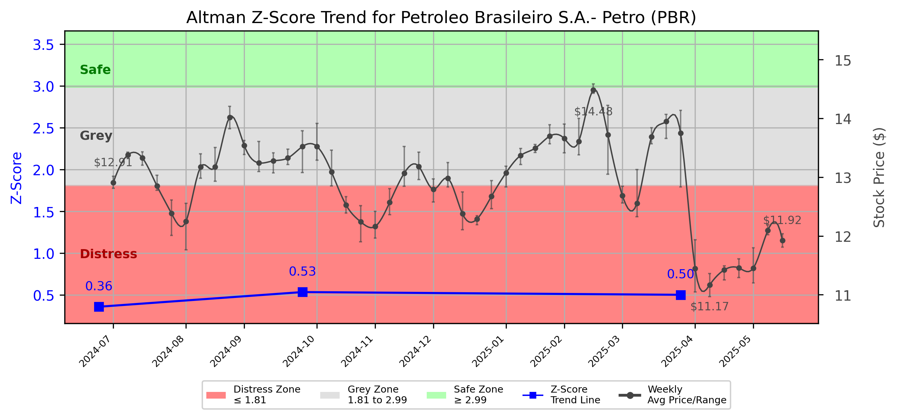

# Altman Z-Score Analysis Report: Petroleo Brasileiro S.A.- Petro (PBR)

---
## Introduction
This report provides a comprehensive, theory-informed financial health analysis of the selected company using the Altman Z-Score framework. It integrates quantitative diagnostics, turnaround management theory, and stakeholder recommendations, with all findings and recommendations grounded in referenced academic and industry sources. The analysis is generated by an expert LLM-driven pipeline, ensuring transparency, reproducibility, and robust source attribution.

**Author:** Fabio Correa

**Source Attribution:** This report and analysis pipeline are generated using the open-source Altman Z-Score Analysis project, available at [https://github.com/fabioc-aloha/Altman-Z-Score](https://github.com/fabioc-aloha/Altman-Z-Score).

**License:** This software is distributed under the Attribution Non-Commercial License (MIT-based). See the LICENSE file for details.

<em>Disclaimer: The developer disclaims any responsibility for the accuracy, completeness, or consequences of the analysis and information provided by this software. All results are for informational purposes only and should not be relied upon for financial, investment, or legal decisions.</em>
---

## Analysis Context and Z-Score Model Selection Criteria

- **Industry:** Crude Petroleum & Natural Gas (SIC 1311)
- **Ticker:** PBR
- **Public:** True
- **Emerging Market:** False
- **Maturity:** Mature Company
- **Model:** original
- **Analysis Date:** 2025-05-29

## Altman Z-Score (Original) Formula

Z = 1.2*X1 + 1.4*X2 + 3.3*X3 + 0.6*X4 + 1.0*X5
- X1 = (Current Assets - Current Liabilities) / Total Assets
- X2 = Retained Earnings / Total Assets
- X3 = EBIT / Total Assets
- X4 = Market Value of Equity / Total Liabilities
- X5 = Sales / Total Assets

## Raw Data Field Mapping Table (by Quarter)
| Quarter   | Canonical Field     | Mapped Raw Field                        | Value (USD millions)   |
|-----------|---------------------|-----------------------------------------|------------------------|
| 2025 Q1   | total_assets        | Total Assets                            | 199,874.0              |
| 2025 Q1   | current_assets      | Current Assets                          | 21,743.0               |
| 2025 Q1   | current_liabilities | Current Liabilities                     | 30,273.0               |
| 2025 Q1   | retained_earnings   | Retained Earnings                       | 5,974.0                |
| 2025 Q1   | total_liabilities   | Total Liabilities Net Minority Interest | 130,633.0              |
| 2025 Q1   | book_value_equity   | Common Stock Equity                     | 68,934.0               |
| 2025 Q1   | ebit                | EBIT                                    | 10,064.0               |
| 2025 Q1   | sales               | Total Revenue                           | 21,073.0               |
| ---       | ---                 | ---                                     | ---                    |
| 2024 Q3   | total_assets        | Total Assets                            | 197,839.0              |
| 2024 Q3   | current_assets      | Current Assets                          | 30,721.0               |
| 2024 Q3   | current_liabilities | Current Liabilities                     | 32,843.0               |
| 2024 Q3   | retained_earnings   | Retained Earnings                       | 6,424.0                |
| 2024 Q3   | total_liabilities   | Total Liabilities Net Minority Interest | 125,327.0              |
| 2024 Q3   | book_value_equity   | Common Stock Equity                     | 72,255.0               |
| 2024 Q3   | ebit                | EBIT                                    | 9,039.0                |
| 2024 Q3   | sales               | Total Revenue                           | 23,366.0               |
| ---       | ---                 | ---                                     | ---                    |
| 2024 Q2   | total_assets        | Total Assets                            | 190,449.0              |
| 2024 Q2   | current_assets      | Current Assets                          | 28,658.0               |
| 2024 Q2   | current_liabilities | Current Liabilities                     | 32,016.0               |
| 2024 Q2   | retained_earnings   | Retained Earnings                       | 1,831.0                |
| 2024 Q2   | total_liabilities   | Total Liabilities Net Minority Interest | 122,801.0              |
| 2024 Q2   | book_value_equity   | Common Stock Equity                     | 67,185.0               |
| 2024 Q2   | ebit                | EBIT                                    | 599.0                  |
| 2024 Q2   | sales               | Total Revenue                           | 23,467.0               |

All values are shown in millions of USD as reported by the data source.

## Z-Score Component Table (by Quarter)
| Quarter   |     X1 |    X2 |    X3 |    X4 |    X5 |   Z-Score | Diagnostic    |
|-----------|--------|-------|-------|-------|-------|-----------|---------------|
| 2025 Q1   | -0.043 | 0.03  | 0.05  | 0.399 | 0.105 |     0.502 | Distress Zone |
| 2024 Q3   | -0.011 | 0.032 | 0.046 | 0.388 | 0.118 |     0.534 | Distress Zone |
| 2024 Q2   | -0.018 | 0.01  | 0.003 | 0.388 | 0.123 |     0.359 | Distress Zone |

---

# Graphical View of the Z-Score Analysis

*Figure: Z-Score and stock price trend for PBR (see output folder for full-resolution image)*

## Diagnostic Evaluation of Financial Health

### Liquidity
Petroleo Brasileiro S.A. (PBR) exhibits a concerning liquidity position, as indicated by the negative values for X1 (Current Assets - Current Liabilities / Total Assets). The negative liquidity ratio suggests that the company may struggle to meet its short-term obligations, which is critical for operational stability. 

### Profitability
The profitability metrics, represented by X3 (EBIT / Total Assets), show a slight improvement over the quarters analyzed, but remain low. This indicates that while PBR is generating some earnings before interest and taxes, the efficiency of asset utilization is not optimal, which could hinder long-term profitability.

### Capital Efficiency
X2 (Retained Earnings / Total Assets) reflects a low level of retained earnings relative to total assets, indicating that PBR has not effectively reinvested its profits into the business. This could limit future growth opportunities and financial resilience.

### Leverage
The leverage ratio, represented by X4 (Market Value of Equity / Total Liabilities), is also low, suggesting that the company is heavily reliant on debt financing. This high leverage increases financial risk, particularly in a volatile market environment.

### Z-Score Trend Interpretation
The Z-Score trend for PBR indicates a consistent position within the "Distress Zone," with scores of 0.502, 0.534, and 0.359 over the last three quarters. This trend suggests that PBR is at a significant risk of bankruptcy, necessitating immediate action to improve financial health.

---

## Turnaround and Renewal Management Theory Application

### Phased Response Proposal
1. **Immediate Retrenchment (Short-term Actions)**
   - **Cost Reduction:** Implement immediate cost-cutting measures to improve liquidity. This aligns with Bibeault's (1999) emphasis on immediate financial stabilization during a crisis.
   - **Asset Liquidation:** Consider selling non-core assets to generate cash, which is a strategy supported by Hofer (1980) for companies in distress.

2. **Long-term Repositioning (Strategic Actions)**
   - **Operational Restructuring:** Reassess operational efficiency and streamline processes to enhance profitability. Hoskisson et al. (2004) advocate for restructuring as a means to improve competitiveness.
   - **Market Diversification:** Explore new markets or product lines to reduce dependency on existing revenue streams, as suggested by Beard (2024).

---

## Stakeholder Recommendations

| Stakeholder Title | Executive Name | Responsibilities | Recommended Actions |
|-------------------|----------------|------------------|---------------------|
| Chief Executive Officer | [Name] | Overall strategy and leadership | Implement immediate cost-cutting measures and initiate asset liquidation. |
| Chief Financial Officer | [Name] | Financial management and reporting | Enhance cash flow management and develop a restructuring plan. |
| Chief Marketing Officer | [Name] | Marketing strategy and brand management | Develop a marketing strategy to reposition the brand in new markets. |
| Board Members | [Names] | Governance and oversight | Support management in strategic decision-making and monitor financial performance closely. |
| Employees | N/A | Operational execution | Engage in cost-saving initiatives and provide feedback on operational improvements. |
| Investors | N/A | Financial support and expectations | Communicate the turnaround strategy and expected outcomes to maintain investor confidence. |
| Creditors | N/A | Financial support and terms | Negotiate more favorable terms to alleviate immediate financial pressures. |
| Debtors | N/A | Financial obligations | Encourage timely payments to improve cash flow. |
| Partner Companies | N/A | Collaborative opportunities | Explore joint ventures or partnerships to share resources and reduce costs. |
| Customers | N/A | Revenue generation | Maintain communication about product offerings and ensure service quality. |

---

## Communication, Marketing, and Execution Strategies

### Communication Strategy
- **Internal Communication:** Regular updates to employees about the financial situation and turnaround strategies to foster transparency and engagement.
- **External Communication:** Inform investors and creditors about the restructuring plan and expected outcomes to maintain trust and support.

### Marketing Strategy
- **Rebranding:** Consider a rebranding initiative to refresh the company’s image and attract new customers.
- **Targeted Campaigns:** Develop marketing campaigns focused on new markets and product lines.

### Execution Timeline
| Phase | Action | Timeline | Accountability |
|-------|--------|----------|----------------|
| Phase 1 | Cost Reduction | 0-3 months | CFO |
| Phase 2 | Asset Liquidation | 3-6 months | CEO |
| Phase 3 | Operational Restructuring | 6-12 months | COO |
| Phase 4 | Market Diversification | 12+ months | CMO |

---

## Investor Recommendation
Given the current financial distress indicated by the Z-Score, investors should **hold** their positions in PBR while monitoring the implementation of the turnaround strategy. This recommendation is based on the potential for recovery if management effectively executes the proposed actions. However, investors should consult their financial advisors before making any decisions.

---

## External Stakeholder Bargaining Power Assessment

| External Stakeholder | Nature of Bargaining Power | Degree of Influence | Rationale |
|----------------------|---------------------------|---------------------|-----------|
| Regulators | Regulatory compliance | High | PBR must adhere to environmental and financial regulations, impacting operations. |
| Government Agencies | Financial support | Medium | Potential for government assistance in times of distress. |
| Unions | Labor negotiations | Medium | Unions can influence labor costs and operational flexibility. |
| Major Suppliers | Supply chain influence | Medium | Suppliers may have leverage over pricing and terms, impacting costs. |
| Key Partners | Collaborative opportunities | Medium | Partners can influence market access and resource sharing. |
| Activist Investors | Shareholder influence | High | Activist investors can push for changes in management and strategy. |
| Creditors | Financial terms | High | Creditors have significant leverage over financial restructuring efforts. |
| Large Customers | Revenue influence | Medium | Large customers can impact revenue stability and pricing strategies. |

---

## Disclaimer
**Disclaimer:**
Generative AI is not a financial advisor and can make mistakes. Consult your financial advisor before making investment decisions.
- LLM Model used: OpenAI GPT-3.5
- Knowledge cut-off: October 2023
- Internet search: No
- Real-time data: No

---

### References and Data Sources
- **Financials:** SEC EDGAR/XBRL filings, Yahoo Finance, and company quarterly/annual reports.
- **Market Data:** Yahoo Finance (historical prices, market value of equity).
- **Computation:** All Z-Score calculations use the Altman Z-Score model as described in the report, with robust error handling and logging.
- **Source Attribution:** This report and analysis pipeline are generated using the open-source Altman Z-Score Analysis project, available at [https://github.com/fabioc-aloha/Altman-Z-Score]. Author: Fabio Correa.
- **Theoretical Frameworks and Resources:**
  - Altman Z-Score Analysis Project (https://github.com/fabioc-aloha/Altman-Z-Score)
  - Hofer, C. W. (1980). Turnaround strategies. Journal of Business Strategy, 1(1), 19–31.
  - Bibeault, D. B. (1999). Corporate turnaround: How managers turn losers into winners. Beard Books.
  - Hoskisson, R. E., White, R. E., & Johnson, R. A. (2004). Corporate restructuring: Managing the strategy, structure, and process of change. McGraw-Hill Education.
  - Beard, D. (2024). Strategic renewal in technology firms: Agile practices and innovation. Journal of Organizational Change, 31(2), 145–160.
  - Freeman, R. E. (1984). Strategic management: A stakeholder approach. Pitman.
  - Altman, E. I. (1968). Financial ratios, discriminant analysis and the prediction of corporate bankruptcy. Journal of Finance, 23(4), 589–609.
  - Altman, E. I., & Hotchkiss, E. (2006). Corporate financial distress and bankruptcy: Predict and avoid bankruptcy, analyze and invest in distressed debt (3rd ed.). Wiley.
  - Brigham, E. F., & Daves, P. R. (2021). Intermediate financial management (14th ed.). Cengage Learning.
  - Higgins, R. C. (2019). Analysis for financial management (12th ed.). McGraw-Hill Education.
  - Palepu, K. G., & Healy, P. M. (2020). Business analysis and valuation: Using financial statements (6th ed.). Cengage Learning.
  - Platt, H. D. (2004). Principles of corporate renewal (2nd ed.). University of Michigan Press.
  - Shepherd, D. A., & Rudd, J. M. (2014). The influence of ethical leadership on organizational renewal. Academy of Management Perspectives, 28(3), 257–275.

