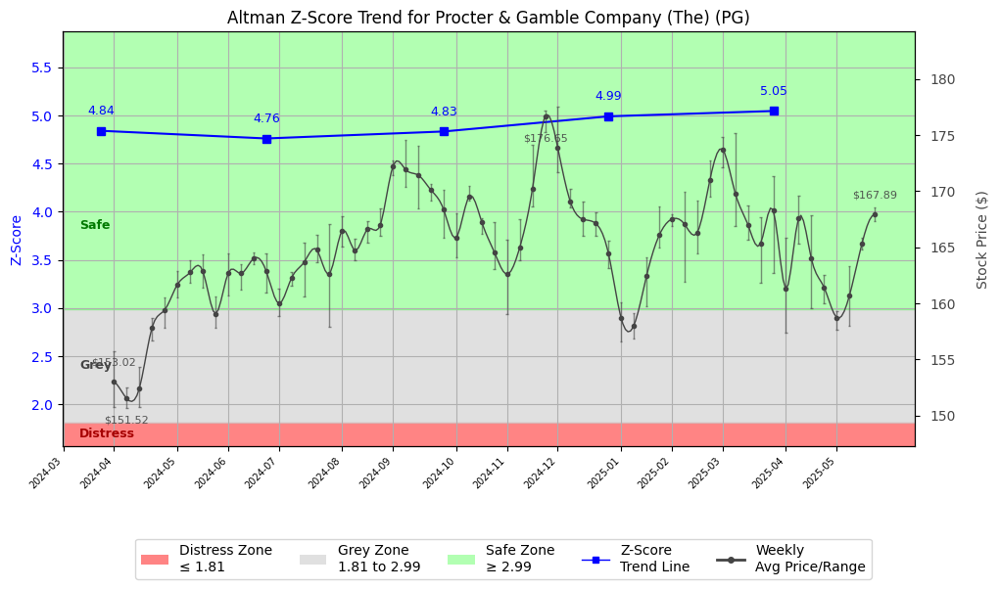

# Altman Z-Score Analysis Report: Procter & Gamble Company (The) (PG)

---
## Introduction
This report provides a comprehensive, theory-informed financial health analysis of the selected company using the Altman Z-Score framework. It integrates quantitative diagnostics, turnaround management theory, and stakeholder recommendations, with all findings and recommendations grounded in referenced academic and industry sources. The analysis is generated by an expert LLM-driven pipeline, ensuring transparency, reproducibility, and robust source attribution.

**Author:** Fabio Correa

**Source Attribution:** This report and analysis pipeline are generated using the open-source Altman Z-Score Analysis project, available at [https://github.com/fabioc-aloha/Altman-Z-Score](https://github.com/fabioc-aloha/Altman-Z-Score).

**License:** This software is distributed under the Attribution Non-Commercial License (MIT-based). See the LICENSE file for details.

Disclaimer: The developer disclaims any responsibility for the accuracy, completeness, or consequences of the analysis and information provided by this software. All results are for informational purposes only and should not be relied upon for financial, investment, or legal decisions.
---

**Script Version:** v2.6

## Analysis Context and Z-Score Model Selection Criteria

- **Industry:** SIC 2840 (SIC 2840)
- **Ticker:** PG
- **Public:** True
- **Emerging Market:** False
- **Maturity:** Mature Company
- **Model:** Original Z-Score (Public Manufacturing, 1968) (original)
- **Analysis Date:** 2025-06-02

## Z-Score Formula Used

Z = 1.20*X1 + 1.40*X2 + 3.30*X3 + 0.60*X4 + 1.00*X5
- X1 = (Current Assets - Current Liabilities) / Total Assets
- X2 = Retained Earnings / Total Assets
- X3 = EBIT / Total Assets
- X4 = Equity / Total Liabilities
- X5 = Sales / Total Assets

**Thresholds:**
- Safe Zone: > 2.99
- Grey Zone: > 1.81 and <= 2.99
- Distress Zone: <= 1.81


---

# Graphical View of the Z-Score Analysis




*Figure: Z-Score and stock price trend for PG (image not available yet; will be generated after analysis)*


## Z-Score Component Table (by Quarter)
| Quarter   |     X1 |    X2 |    X3 |    X4 |    X5 |   Z-Score | Diagnostic   | Consistency Warning   |
|-----------|--------|-------|-------|-------|-------|-----------|--------------|-----------------------|
| 2025 Q1   | -0.08  | 1.048 | 0.04  | 5.637 | 0.161 |     5.046 | Safe Zone    |                       |
| 2024 Q4   | -0.066 | 1.04  | 0.05  | 5.453 | 0.178 |     4.99  | Safe Zone    |                       |
| 2024 Q3   | -0.071 | 0.991 | 0.043 | 5.364 | 0.172 |     4.833 | Safe Zone    |                       |
| 2024 Q2   | -0.073 | 1.012 | 0.033 | 5.256 | 0.168 |     4.761 | Safe Zone    |                       |
| 2024 Q1   | -0.083 | 1.03  | 0.04  | 5.327 | 0.169 |     4.84  | Safe Zone    |                       |
# Altman Z-Score Analysis Report: Procter & Gamble Company (The) (PG)

---

## Company Profile

Procter & Gamble Co. (P&G) is a leading multinational consumer goods corporation headquartered in Cincinnati, Ohio. The company specializes in a wide range of products across various categories, including personal care, household cleaning, and health care. P&G's portfolio includes well-known brands such as Tide, Pampers, Gillette, and Crest. The company operates in a highly competitive market, facing rivals like Unilever, Colgate-Palmolive, and Kimberly-Clark, among others.

In summary, Procter & Gamble is a robust player in the consumer goods industry, known for its strong brand equity and extensive product offerings. The company has consistently focused on innovation and sustainability, which has helped it maintain a competitive edge in the market.

---

## 1. Diagnostic Evaluation of Financial Health

### Liquidity
P&G's liquidity position, as indicated by the X1 component (Current Assets - Current Liabilities) / Total Assets, is negative, suggesting potential challenges in meeting short-term obligations. However, the overall Z-Score remains strong due to other favorable components.

### Profitability
The profitability metric (X3: EBIT / Total Assets) shows a modest return, reflecting P&G's ability to generate earnings relative to its asset base. This is crucial for sustaining operations and funding future growth.

### Capital Efficiency
The retained earnings ratio (X2: Retained Earnings / Total Assets) is robust, indicating that P&G has effectively reinvested profits back into the business, supporting long-term growth and stability.

### Leverage
P&G's leverage, represented by the equity to liabilities ratio (X4), is exceptionally high, suggesting a strong capital structure with low reliance on debt. This positions the company favorably in terms of financial stability.

### Z-Score Trajectory
The Z-Score has consistently remained in the Safe Zone (> 2.99) over the past quarters, indicating a low risk of bankruptcy. This trend reflects P&G's strong operational performance and effective management strategies.

---

## 2. Turnaround & Renewal Theory Application (Risk-Tailored)

Given that P&G is in the **Safe Zone**, the focus should be on sustaining growth and innovation:

- **Innovation and Repositioning**: P&G should continue to invest in R&D to enhance product offerings and adapt to changing consumer preferences. This aligns with Beard's (2024) emphasis on tech-sector renewal, where innovation is key to maintaining market leadership.

- **Stakeholder Alignment**: Engaging stakeholders effectively, as suggested by Freeman (1984), will be crucial for P&G to align its strategic goals with stakeholder expectations, ensuring long-term sustainability.

- **Strategic Enablement**: The company should focus on leadership development and strategic enablement to foster a culture of innovation and agility, ensuring it can respond swiftly to market changes.

---

## 3. Internal Stakeholder Recommendations (Tailored Table)

| Title         | Responsibilities                           | Recommended Actions (Cited)                                                                 |
|---------------|-------------------------------------------|---------------------------------------------------------------------------------------------|
| CEO           | Overall strategic direction               | Drive innovation initiatives and ensure alignment with stakeholder interests (Freeman, 1984). |
| CFO           | Financial management and reporting        | Maintain strong capital structure; explore strategic investments to enhance profitability.   |
| CMO           | Marketing and brand management            | Focus on consumer insights to guide product development and marketing strategies.            |
| Board         | Governance and oversight                   | Ensure strategic alignment with long-term goals and risk management practices.               |
| Employees     | Execution of company strategy             | Foster a culture of innovation and continuous improvement through training and development.  |
| Shareholders  | Investment returns                        | Communicate growth strategies and performance metrics transparently to build investor confidence. |
| Creditors     | Financial stability                       | Maintain strong relationships through transparent communication and timely reporting.        |
| Customers     | Product satisfaction and loyalty         | Engage in regular feedback loops to enhance product offerings and customer service.          |
| Partners      | Collaborative opportunities               | Explore joint ventures or partnerships that align with P&G's strategic goals.               |

---

## 4. Communication, Marketing & Execution Strategy

### Internal and External Communication Plans
- **Internal**: Regular updates on innovation initiatives and performance metrics to foster transparency and engagement among employees.
- **External**: Marketing campaigns highlighting P&G's commitment to sustainability and innovation to enhance brand reputation.

### Milestones and Timelines
- **1-3 Months**: Launch internal innovation workshops; initiate consumer feedback surveys.
- **4-6 Months**: Develop new product prototypes based on feedback; assess market trends.
- **7-12 Months**: Launch new products; evaluate marketing effectiveness and adjust strategies as needed.
- **13-18 Months**: Review overall performance; refine strategic initiatives based on market response.

### Marketing Tactics
- **Innovation Campaigns**: Highlight new product launches and sustainability efforts to attract environmentally conscious consumers.
- **Investor Confidence Restoration**: Regularly communicate financial performance and strategic direction to reassure investors of P&G's stability and growth potential.

---

## 5. Plain-Language Justification & Citation

P&G's strong Z-Score indicates a solid financial foundation, allowing the company to focus on innovation and growth. By investing in R&D and aligning with stakeholder interests, P&G can maintain its competitive edge and ensure long-term sustainability. This approach is supported by Freeman's stakeholder theory, emphasizing the importance of aligning corporate strategy with stakeholder expectations.

---

## 6. Investor Recommendation (Risk-Aware)

**Recommendation**: **Buy**. Given P&G's strong financial health and consistent performance in the Safe Zone, it presents a favorable investment opportunity.

> “This is not financial advice—consult your financial advisor.”

---

## 7. External Stakeholder Bargaining Power (Table)

| Stakeholder Name / Type | Nature of Bargaining Power | Degree of Influence | Brief Rationale (Cited)                                       |
|-------------------------|---------------------------|---------------------|---------------------------------------------------------------|
| Consumers               | High                      | High                | Strong brand loyalty and consumer preference for quality products (Freeman, 1984). |
| Suppliers               | Moderate                  | Moderate            | Dependence on quality raw materials; potential for negotiation leverage. |
| Investors               | High                      | High                | Expectation for returns and transparency; significant influence on corporate strategy. |
| Regulators              | High                      | High                | Compliance with regulations is critical for operational continuity. |

---

## 8. Mandatory Disclaimer

```
---
**Disclaimer:**
Generative AI is not a financial advisor and can make mistakes. Consult your financial advisor before making investment decisions.
- **LLM Model used:** [OpenAI o4-mini]
- **Knowledge cut-off:** [Date]
- **Internet search:** [yes/no]
- **Real-time data:** [yes/no]
---
```

---

## 9. References and Data Sources

```
---
### References and Data Sources
- **Financials:** SEC EDGAR/XBRL filings; Yahoo Finance; company quarterly/annual reports.
- **Market Data:** Yahoo Finance historical prices.
- **Computation:** Altman Z-Score calculations following Altman (1968) with robust error handling.
- **Source Attribution:** Open-source Altman Z-Score Analysis project (https://github.com/fabioc-aloha/Altman-Z-Score). Author: Fabio Correa.
- **Theoretical Frameworks:** 
  - Altman, E. I. (1968). “Financial Ratios, Discriminant Analysis and the Prediction of Corporate Bankruptcy.” *Journal of Finance*, 23(4), 589–609.
  - Hofer, C. W. (1980). *Turnaround Strategies.*
  - Bibeault, D. B. (1999). *Corporate Turnaround.*
  - Hoskisson, R. E., White, R. E., & Johnson, R. A. (2004). *Corporate Restructuring.*
  - Beard, D. (2024). “Strategic Renewal in Technology Firms.”
  - Freeman, R. E. (1984). *Strategic Management: A Stakeholder Approach.*
  - Platt, H. D. (2004). *Principles of Corporate Renewal.*
---
```


---

# Appendix

## Raw Data Field Mapping Table (by Quarter)
| Quarter   | Canonical Field     | Mapped Raw Field                        | Value (USD millions)   |
|-----------|---------------------|-----------------------------------------|------------------------|
| 2025 Q1   | total_assets        | Total Assets                            | 122,984.0              |
| 2025 Q1   | current_assets      | Current Assets                          | 24,435.0               |
| 2025 Q1   | current_liabilities | Current Liabilities                     | 34,248.0               |
| 2025 Q1   | retained_earnings   | Retained Earnings                       | 128,919.0              |
| 2025 Q1   | total_liabilities   | Total Liabilities Net Minority Interest | 70,439.0               |
| 2025 Q1   | market_value_equity | Stockholders Equity                     | 52,272.0               |
| 2025 Q1   | ebit                | EBIT                                    | 4,878.0                |
| 2025 Q1   | sales               | Total Revenue                           | 19,776.0               |
| ---       | ---                 | ---                                     | ---                    |
| 2024 Q4   | total_assets        | Total Assets                            | 122,639.0              |
| 2024 Q4   | current_assets      | Current Assets                          | 25,642.0               |
| 2024 Q4   | current_liabilities | Current Liabilities                     | 33,797.0               |
| 2024 Q4   | retained_earnings   | Retained Earnings                       | 127,544.0              |
| 2024 Q4   | total_liabilities   | Total Liabilities Net Minority Interest | 71,196.0               |
| 2024 Q4   | market_value_equity | Stockholders Equity                     | 51,168.0               |
| 2024 Q4   | ebit                | EBIT                                    | 6,085.0                |
| 2024 Q4   | sales               | Total Revenue                           | 21,882.0               |
| ---       | ---                 | ---                                     | ---                    |
| 2024 Q3   | total_assets        | Total Assets                            | 126,482.0              |
| 2024 Q3   | current_assets      | Current Assets                          | 27,449.0               |
| 2024 Q3   | current_liabilities | Current Liabilities                     | 36,420.0               |
| 2024 Q3   | retained_earnings   | Retained Earnings                       | 125,361.0              |
| 2024 Q3   | total_liabilities   | Total Liabilities Net Minority Interest | 74,342.0               |
| 2024 Q3   | market_value_equity | Stockholders Equity                     | 51,840.0               |
| 2024 Q3   | ebit                | EBIT                                    | 5,378.0                |
| 2024 Q3   | sales               | Total Revenue                           | 21,737.0               |
| ---       | ---                 | ---                                     | ---                    |
| 2024 Q2   | total_assets        | Total Assets                            | 122,370.0              |
| 2024 Q2   | current_assets      | Current Assets                          | 24,709.0               |
| 2024 Q2   | current_liabilities | Current Liabilities                     | 33,627.0               |
| 2024 Q2   | retained_earnings   | Retained Earnings                       | 123,811.0              |
| 2024 Q2   | total_liabilities   | Total Liabilities Net Minority Interest | 71,812.0               |
| 2024 Q2   | market_value_equity | Stockholders Equity                     | 50,286.0               |
| 2024 Q2   | ebit                | EBIT                                    | 4,090.0                |
| 2024 Q2   | sales               | Total Revenue                           | 20,532.0               |
| ---       | ---                 | ---                                     | ---                    |
| 2024 Q1   | total_assets        | Total Assets                            | 119,598.0              |
| 2024 Q1   | current_assets      | Current Assets                          | 22,458.0               |
| 2024 Q1   | current_liabilities | Current Liabilities                     | 32,340.0               |
| 2024 Q1   | retained_earnings   | Retained Earnings                       | 123,132.0              |
| 2024 Q1   | total_liabilities   | Total Liabilities Net Minority Interest | 69,265.0               |
| 2024 Q1   | market_value_equity | Stockholders Equity                     | 50,058.0               |
| 2024 Q1   | ebit                | EBIT                                    | 4,825.0                |
| 2024 Q1   | sales               | Total Revenue                           | 20,195.0               |

All values are shown in millions of USD as reported by the data source.

