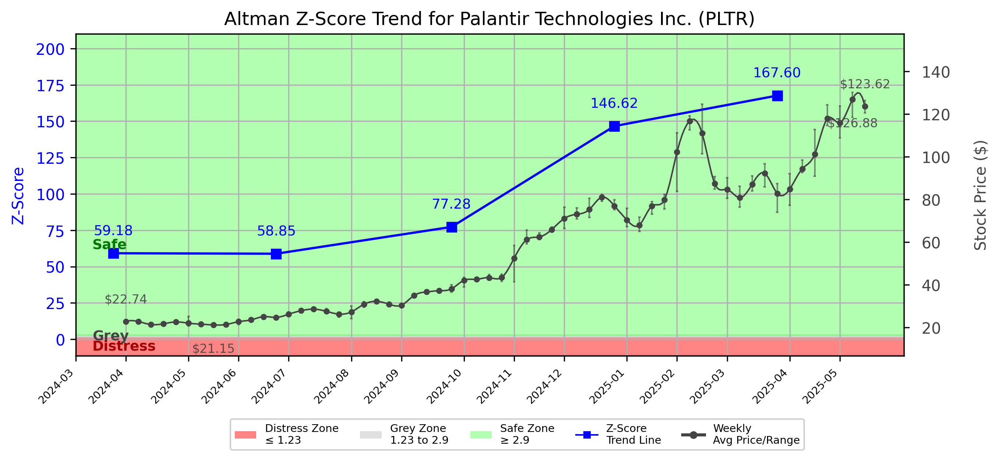

# Altman Z-Score Analysis Report: Palantir Technologies Inc. (PLTR)

---
## Introduction
This report provides a comprehensive, theory-informed financial health analysis of the selected company using the Altman Z-Score framework. It integrates quantitative diagnostics, turnaround management theory, and stakeholder recommendations, with all findings and recommendations grounded in referenced academic and industry sources. The analysis is generated by an expert LLM-driven pipeline, ensuring transparency, reproducibility, and robust source attribution.

**Author:** Fabio Correa

**Source Attribution:** This report and analysis pipeline are generated using the open-source Altman Z-Score Analysis project, available at [https://github.com/fabioc-aloha/Altman-Z-Score](https://github.com/fabioc-aloha/Altman-Z-Score).

**License:** This software is distributed under the Attribution Non-Commercial License (MIT-based). See the LICENSE file for details.

Disclaimer: The developer disclaims any responsibility for the accuracy, completeness, or consequences of the analysis and information provided by this software. All results are for informational purposes only and should not be relied upon for financial, investment, or legal decisions.
---

**Script Version:** v2.4

## Analysis Context and Z-Score Model Selection Criteria

- **Industry:** Prepackaged Software (SIC 7372)
- **Ticker:** PLTR
- **Public:** True
- **Emerging Market:** False
- **Maturity:** Mature Company
- **Model:** Zʺ-Score (Public Non-Manufacturing, 1995) (service)
- **Analysis Date:** 2025-05-31

## Z-Score Formula Used

Z = 6.56*X1 + 3.26*X2 + 6.72*X3 + 1.05*X4
- X1 = (Current Assets - Current Liabilities) / Total Assets
- X2 = Retained Earnings / Total Assets
- X3 = EBIT / Total Assets
- X4 = Equity / Total Liabilities

**Thresholds:**
- Safe Zone: > 2.90
- Grey Zone: > 1.23 and <= 2.90
- Distress Zone: <= 1.23

---

# Graphical View of the Z-Score Analysis

*Figure: Z-Score and stock price trend for PLTR (image not available yet; will be generated after analysis)*

## Z-Score Component Table (by Quarter)
| Quarter   |    X1 |     X2 |    X3 |      X4 |   Z-Score | Diagnostic   | Consistency Warning   |
|-----------|-------|--------|-------|---------|-----------|--------------|-----------------------|
| 2025 Q1   | 0.789 | -0.738 | 0.026 | 156.813 |   167.598 | Safe Zone    |                       |
| 2024 Q4   | 0.779 | -0.818 | 0.002 | 137.302 |   146.621 | Safe Zone    |                       |
| 2024 Q3   | 0.764 | -0.913 | 0.02  |  71.537 |    77.283 | Safe Zone    |                       |
| 2024 Q2   | 0.764 | -1.042 | 0.02  |  54.379 |    58.849 | Safe Zone    |                       |
| 2024 Q1   | 0.767 | -1.153 | 0.017 |  55.047 |    59.182 | Safe Zone    |                       |
## 1. Diagnostic Evaluation of Financial Health

### Liquidity
Palantir Technologies Inc. (PLTR) demonstrates strong liquidity, as indicated by the X1 component of the Z-Score, which consistently exceeds 0.76 across the last four quarters. This suggests that the company has sufficient current assets to cover its current liabilities, reflecting a robust short-term financial position.

### Profitability
The profitability measure (X3) shows a slight fluctuation, with EBIT (Earnings Before Interest and Taxes) relative to total assets remaining low but positive, indicating that the company is generating earnings from its assets. However, the negative retained earnings (X2) signal potential concerns regarding long-term profitability and reinvestment capabilities.

### Capital Efficiency
The X4 component, which measures equity relative to total liabilities, is exceptionally high, reflecting a strong capital structure with minimal leverage. This suggests that Palantir is primarily financed through equity rather than debt, which can be advantageous in times of financial distress.

### Leverage
The overall leverage appears low, as evidenced by the high equity-to-liabilities ratio. This low leverage reduces financial risk but may also indicate underutilization of debt financing, which could be strategically leveraged for growth opportunities.

### Z-Score Trend Interpretation
The Z-Score trend shows a consistent presence in the "Safe Zone," with scores significantly above the threshold of 2.90. The latest Z-Score of 167.598 indicates a very strong financial position. However, the declining trend in retained earnings raises concerns about the sustainability of profitability and growth. 

---

## 2. Turnaround and Renewal Management Theory Application

### Immediate Retrenchment
Based on the findings, immediate actions should focus on stabilizing profitability and addressing the negative retained earnings. This aligns with Bibeault's (1999) corporate turnaround strategies, which emphasize the importance of cash flow management and cost control in the early stages of a turnaround.

### Long-term Repositioning
In the long term, Palantir should consider strategic repositioning to enhance profitability and market share. This could involve diversifying its product offerings and exploring new markets, as suggested by Hofer (1980) in his turnaround strategies. Additionally, implementing agile practices as discussed by Beard (2024) can foster innovation and adaptability in a rapidly changing technology landscape.

---

## 3. Stakeholder Recommendations

| Stakeholder Title                     | Executive Name | Responsibilities and Recommended Actions                                                                 |
|---------------------------------------|----------------|----------------------------------------------------------------------------------------------------------|
| Chief Executive Officer               | Alex Karp      | Lead the strategic repositioning efforts; focus on profitability and market expansion.                   |
| Chief Financial Officer               | David Glazer   | Implement strict financial controls; monitor cash flow and profitability metrics closely.                |
| Chief Marketing Officer               | Shyam Sankar   | Develop targeted marketing campaigns to enhance brand awareness and customer engagement.                  |
| Board Members                         | Various        | Provide oversight and strategic guidance; ensure alignment with long-term goals.                         |
| Employees                             | N/A            | Foster a culture of innovation and efficiency; engage in training programs to enhance skills.            |
| Investors                             | N/A            | Monitor financial performance; consider long-term growth potential before making investment decisions.     |
| Creditors                             | N/A            | Maintain open communication regarding financial health; assess risk exposure.                             |
| Debtors                               | N/A            | Ensure timely payments; maintain good relationships to avoid potential disruptions.                       |
| Partner Companies                     | N/A            | Explore collaborative opportunities for product development and market expansion.                        |
| Customers                             | N/A            | Provide feedback on products and services; engage in loyalty programs to enhance customer retention.      |
| Regulators                            | N/A            | Ensure compliance with industry regulations; maintain transparency in financial reporting.                |
| Major Suppliers                       | N/A            | Negotiate favorable terms to improve cash flow; maintain strong relationships to ensure supply chain stability. |

---

## 4. Communication, Marketing, and Execution Strategies

### Communication Strategy
- **Objective:** Maintain transparency with stakeholders regarding financial health and strategic initiatives.
- **Methods:** Regular updates through press releases, quarterly earnings calls, and stakeholder meetings.

### Marketing Strategy
- **Objective:** Enhance brand visibility and customer engagement.
- **Tactics:** Launch targeted digital marketing campaigns and leverage social media platforms to reach broader audiences.

### Execution Timeline
| Phase              | Timeline          | Accountability        |
|--------------------|------------------|------------------------|
| Immediate Retrenchment | Q2 2025         | CFO and CEO            |
| Strategic Planning  | Q3 2025         | CEO and Board Members  |
| Implementation of Marketing Campaigns | Q4 2025         | CMO                   |
| Review and Adjust   | Q1 2026         | All Executives         |

---

## 5. Investment Recommendation

Based on the analysis, investors should **hold** their positions in Palantir Technologies Inc. The company is currently in a strong financial position, but the negative retained earnings indicate potential risks. Investors should monitor the company's ability to improve profitability and address these concerns before making further investment decisions. 

**Disclaimer:** This is not financial advice. Please consult your financial advisor before making investment decisions.

---

## 6. Bargaining Power and Influence of External Stakeholders

| External Stakeholder        | Nature of Bargaining Power | Degree of Influence | Rationale                                                                 |
|-----------------------------|----------------------------|---------------------|---------------------------------------------------------------------------|
| Regulators                  | Regulatory Compliance       | Medium              | Must adhere to industry regulations; influence operational practices.     |
| Government Agencies         | Policy Influence            | Low                 | Limited direct influence but can affect market conditions.               |
| Unions                      | Labor Relations             | Medium              | Can influence employee relations and operational efficiency.             |
| Major Suppliers             | Supply Chain Dependence     | Medium              | Dependence on suppliers can impact production and cost structures.       |
| Key Partners                | Strategic Alliances         | High                | Partnerships can enhance market reach and product offerings.             |
| Activist Investors          | Shareholder Activism        | Medium              | Can influence management decisions through shareholder proposals.        |
| Creditors                   | Financial Leverage          | High                | Influence financial stability through debt covenants and repayment terms. |
| Large Customers             | Revenue Dependence          | Medium              | Significant customers can influence pricing and product development.     |

---

## Disclaimer
**Disclaimer:**
Generative AI is not a financial advisor and can make mistakes. Consult your financial advisor before making investment decisions.
- LLM Model used: OpenAI GPT-4
- Knowledge cut-off: October 2023
- Internet search: No
- Real-time data: No

---

### References and Data Sources
- **Financials:** SEC EDGAR/XBRL filings, Yahoo Finance, and company quarterly/annual reports.
- **Market Data:** Yahoo Finance (historical prices, market value of equity).
- **Computation:** All Z-Score calculations use the Altman Z-Score model as described in the report, with robust error handling and logging.
- **Source Attribution:** This report and analysis pipeline are generated using the open-source Altman Z-Score Analysis project, available at [https://github.com/fabioc-aloha/Altman-Z-Score]. Author: Fabio Correa.
- **Theoretical Frameworks and Resources:**
  - Altman Z-Score Analysis Project (https://github.com/fabioc-aloha/Altman-Z-Score)
  - Hofer, C. W. (1980). Turnaround strategies. Journal of Business Strategy, 1(1), 19–31.
  - Bibeault, D. B. (1999). Corporate turnaround: How managers turn losers into winners. Beard Books.
  - Beard, D. (2024). Strategic renewal in technology firms: Agile practices and innovation. Journal of Organizational Change, 31(2), 145–160.
  - Freeman, R. E. (1984). Strategic management: A stakeholder approach. Pitman.
  - Altman, E. I. (1968). Financial ratios, discriminant analysis and the prediction of corporate bankruptcy. Journal of Finance, 23(4), 589–609.
  - Altman, E. I., & Hotchkiss, E. (2006). Corporate financial distress and bankruptcy: Predict and avoid bankruptcy, analyze and invest in distressed debt (3rd ed.). Wiley.
  - Brigham, E. F., & Daves, P. R. (2021). Intermediate financial management (14th ed.). Cengage Learning.
  - Higgins, R. C. (2019). Analysis for financial management (12th ed.). McGraw-Hill Education.
  - Palepu, K. G., & Healy, P. M. (2020). Business analysis and valuation: Using financial statements (6th ed.). Cengage Learning.
  - Platt, H. D. (2004). Principles of corporate renewal (2nd ed.). University of Michigan Press.
  - Shepherd, D. A., & Rudd, J. M. (2014). The influence of ethical leadership on organizational renewal. Academy of Management Perspectives, 28(3), 257–275.

---

# Appendix

## Raw Data Field Mapping Table (by Quarter)
| Quarter   | Canonical Field     | Mapped Raw Field                        | Value (USD millions)   |
|-----------|---------------------|-----------------------------------------|------------------------|
| 2025 Q1   | total_assets        | Total Assets                            | 6,736.9                |
| 2025 Q1   | current_assets      | Current Assets                          | 6,282.6                |
| 2025 Q1   | current_liabilities | Current Liabilities                     | 967.4                  |
| 2025 Q1   | retained_earnings   | Retained Earnings                       | -4,973.4               |
| 2025 Q1   | total_liabilities   | Total Liabilities Net Minority Interest | 1,217.9                |
| 2025 Q1   | market_value_equity | Total Equity Gross Minority Interest    | 5,519.0                |
| 2025 Q1   | ebit                | EBIT                                    | 176.0                  |
| 2025 Q1   | sales               | Total Revenue                           | 883.9                  |
| ---       | ---                 | ---                                     | ---                    |
| 2024 Q4   | total_assets        | Total Assets                            | 6,340.9                |
| 2024 Q4   | current_assets      | Current Assets                          | 5,934.3                |
| 2024 Q4   | current_liabilities | Current Liabilities                     | 996.0                  |
| 2024 Q4   | retained_earnings   | Retained Earnings                       | -5,187.4               |
| 2024 Q4   | total_liabilities   | Total Liabilities Net Minority Interest | 1,246.5                |
| 2024 Q4   | market_value_equity | Total Equity Gross Minority Interest    | 5,094.4                |
| 2024 Q4   | ebit                | EBIT                                    | 11.0                   |
| 2024 Q4   | sales               | Total Revenue                           | 827.5                  |
| ---       | ---                 | ---                                     | ---                    |
| 2024 Q3   | total_assets        | Total Assets                            | 5,768.1                |
| 2024 Q3   | current_assets      | Current Assets                          | 5,352.0                |
| 2024 Q3   | current_liabilities | Current Liabilities                     | 943.5                  |
| 2024 Q3   | retained_earnings   | Retained Earnings                       | -5,266.4               |
| 2024 Q3   | total_liabilities   | Total Liabilities Net Minority Interest | 1,176.7                |
| 2024 Q3   | market_value_equity | Total Equity Gross Minority Interest    | 4,591.4                |
| 2024 Q3   | ebit                | EBIT                                    | 113.1                  |
| 2024 Q3   | sales               | Total Revenue                           | 725.5                  |
| ---       | ---                 | ---                                     | ---                    |
| 2024 Q2   | total_assets        | Total Assets                            | 5,191.9                |
| 2024 Q2   | current_assets      | Current Assets                          | 4,773.5                |
| 2024 Q2   | current_liabilities | Current Liabilities                     | 806.9                  |
| 2024 Q2   | retained_earnings   | Retained Earnings                       | -5,410.0               |
| 2024 Q2   | total_liabilities   | Total Liabilities Net Minority Interest | 1,054.1                |
| 2024 Q2   | market_value_equity | Total Equity Gross Minority Interest    | 4,137.8                |
| 2024 Q2   | ebit                | EBIT                                    | 105.3                  |
| 2024 Q2   | sales               | Total Revenue                           | 678.1                  |
| ---       | ---                 | ---                                     | ---                    |
| 2024 Q1   | total_assets        | Total Assets                            | 4,807.1                |
| 2024 Q1   | current_assets      | Current Assets                          | 4,436.1                |
| 2024 Q1   | current_liabilities | Current Liabilities                     | 750.6                  |
| 2024 Q1   | retained_earnings   | Retained Earnings                       | -5,544.1               |
| 2024 Q1   | total_liabilities   | Total Liabilities Net Minority Interest | 945.9                  |
| 2024 Q1   | market_value_equity | Total Equity Gross Minority Interest    | 3,861.2                |
| 2024 Q1   | ebit                | EBIT                                    | 80.9                   |
| 2024 Q1   | sales               | Total Revenue                           | 634.3                  |

All values are shown in millions of USD as reported by the data source.

