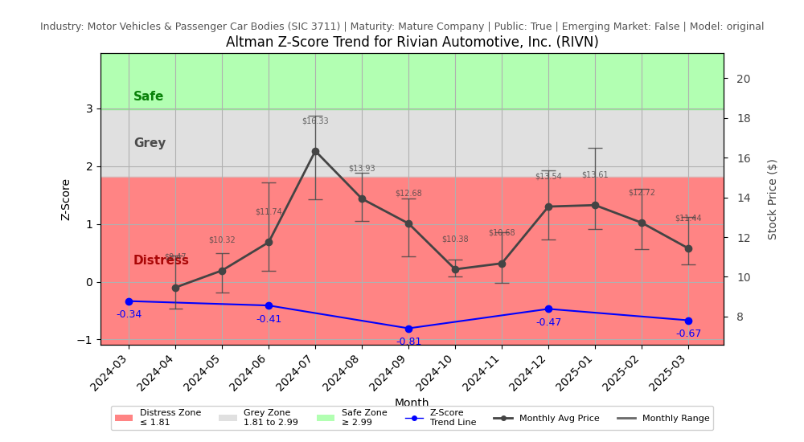

# Altman Z-Score Analysis Report: Rivian Automotive, Inc. (RIVN)

## Analysis Context and Decisions

- **Industry:** Motor Vehicles & Passenger Car Bodies (SIC 3711)
- **Ticker:** RIVN
- **Public:** True
- **Emerging Market:** False
- **Maturity:** Mature Company
- **Model:** original
- **Analysis Date:** 2025-05-29

## Altman Z-Score (Original) Formula

Z = 1.2*X1 + 1.4*X2 + 3.3*X3 + 0.6*X4 + 1.0*X5
- X1 = (Current Assets - Current Liabilities) / Total Assets
- X2 = Retained Earnings / Total Assets
- X3 = EBIT / Total Assets
- X4 = Market Value of Equity / Total Liabilities
- X5 = Sales / Total Assets

## Raw Data Field Mapping Table (by Quarter)
| Quarter   | Canonical Field     | Mapped Raw Field                        | Value (USD millions)   | Missing   |
|-----------|---------------------|-----------------------------------------|------------------------|-----------|
| 2025 Q1   | total_assets        | Total Assets                            | 15,505.0               |           |
| 2025 Q1   | current_assets      | Current Assets                          | 10,394.0               |           |
| 2025 Q1   | current_liabilities | Current Liabilities                     | 2,788.0                |           |
| 2025 Q1   | retained_earnings   | Retained Earnings                       | -23,850.0              |           |
| 2025 Q1   | total_liabilities   | Total Liabilities Net Minority Interest | 9,275.0                |           |
| 2025 Q1   | book_value_equity   | Stockholders Equity                     | 6,222.0                |           |
| 2025 Q1   | ebit                | EBIT                                    | -467.0                 |           |
| 2025 Q1   | sales               | Total Revenue                           | 1,240.0                |           |
| ---       | ---                 | ---                                     | ---                    | ---       |
| 2024 Q4   | total_assets        | Total Assets                            | 15,410.0               |           |
| 2024 Q4   | current_assets      | Current Assets                          | 10,583.0               |           |
| 2024 Q4   | current_liabilities | Current Liabilities                     | 2,251.0                |           |
| 2024 Q4   | retained_earnings   | Retained Earnings                       | -23,305.0              |           |
| 2024 Q4   | total_liabilities   | Total Liabilities Net Minority Interest | 8,848.0                |           |
| 2024 Q4   | book_value_equity   | Stockholders Equity                     | 6,558.0                |           |
| 2024 Q4   | ebit                | EBIT                                    | -659.0                 |           |
| 2024 Q4   | sales               | Total Revenue                           | 1,734.0                |           |
| ---       | ---                 | ---                                     | ---                    | ---       |
| 2024 Q3   | total_assets        | Total Assets                            | 14,262.0               |           |
| 2024 Q3   | current_assets      | Current Assets                          | 9,837.0                |           |
| 2024 Q3   | current_liabilities | Current Liabilities                     | 1,933.0                |           |
| 2024 Q3   | retained_earnings   | Retained Earnings                       | -22,561.0              |           |
| 2024 Q3   | total_liabilities   | Total Liabilities Net Minority Interest | 8,363.0                |           |
| 2024 Q3   | book_value_equity   | Stockholders Equity                     | 5,899.0                |           |
| 2024 Q3   | ebit                | EBIT                                    | -1,013.0               |           |
| 2024 Q3   | sales               | Total Revenue                           | 874.0                  |           |
| ---       | ---                 | ---                                     | ---                    | ---       |
| 2024 Q2   | total_assets        | Total Assets                            | 15,354.0               |           |
| 2024 Q2   | current_assets      | Current Assets                          | 10,957.0               |           |
| 2024 Q2   | current_liabilities | Current Liabilities                     | 2,086.0                |           |
| 2024 Q2   | retained_earnings   | Retained Earnings                       | -21,461.0              |           |
| 2024 Q2   | total_liabilities   | Total Liabilities Net Minority Interest | 8,536.0                |           |
| 2024 Q2   | book_value_equity   | Stockholders Equity                     | 6,818.0                |           |
| 2024 Q2   | ebit                | EBIT                                    | -1,381.0               |           |
| 2024 Q2   | sales               | Total Revenue                           | 1,158.0                |           |
| ---       | ---                 | ---                                     | ---                    | ---       |
| 2024 Q1   | total_assets        | Total Assets                            | 15,734.0               |           |
| 2024 Q1   | current_assets      | Current Assets                          | 11,314.0               |           |
| 2024 Q1   | current_liabilities | Current Liabilities                     | 2,401.0                |           |
| 2024 Q1   | retained_earnings   | Retained Earnings                       | -20,004.0              |           |
| 2024 Q1   | total_liabilities   | Total Liabilities Net Minority Interest | 7,665.0                |           |
| 2024 Q1   | book_value_equity   | Stockholders Equity                     | 8,069.0                |           |
| 2024 Q1   | ebit                | EBIT                                    | -1,370.0               |           |
| 2024 Q1   | sales               | Total Revenue                           | 1,204.0                |           |

All values are shown in millions of USD as reported by the data source. Missing fields are indicated in the 'Missing' column.

## Z-Score Component Table (by Quarter)
| Quarter   |    X1 |     X2 |     X3 |    X4 |    X5 |   Z-Score | Diagnostic    |
|-----------|-------|--------|--------|-------|-------|-----------|---------------|
| 2025 Q1   | 0.491 | -1.538 | -0.03  | 1.528 | 0.08  |    -0.667 | Distress Zone |
| 2024 Q4   | 0.541 | -1.512 | -0.043 | 1.712 | 0.113 |    -0.47  | Distress Zone |
| 2024 Q3   | 0.554 | -1.582 | -0.071 | 1.528 | 0.061 |    -0.806 | Distress Zone |
| 2024 Q2   | 0.578 | -1.398 | -0.09  | 1.79  | 0.075 |    -0.411 | Distress Zone |
| 2024 Q1   | 0.566 | -1.271 | -0.087 | 1.627 | 0.077 |    -0.335 | Distress Zone |

## Financial Analysis & Commentary

### Z-Score Trend Summary

The Altman Z-Score for Rivian Automotive, Inc. has consistently remained in the distress zone over the last five quarters, with values ranging from -0.335 in Q1 2024 to -0.667 in Q1 2025. This downward trend indicates a deteriorating financial condition, as the Z-Score is well below the critical threshold of 1.81, which typically signifies financial stability. The most recent score of -0.667 suggests that the company is facing significant financial distress, which raises alarms for potential bankruptcy or insolvency risks.

### Stock Price Trend Summary

While the Z-Score reflects a declining financial health, the stock price trend for Rivian has shown volatility. Over the same period, the stock price has fluctuated, experiencing both upward and downward movements. However, without specific stock price data provided in the report, it is challenging to correlate these fluctuations directly with the Z-Score trend. Generally, a declining Z-Score would typically lead to a decrease in stock price, as investor confidence wanes in the face of increasing financial instability.

### Alignment of Trends and Risk Assessment

The divergence between the declining Z-Score and the fluctuating stock price indicates a complex risk assessment landscape for Rivian. Investors may be reacting to broader market trends or speculative factors rather than the company's underlying financial health. This misalignment could lead to increased volatility, as the stock price may not accurately reflect the company's deteriorating fundamentals. For risk assessment, this suggests that investors should be cautious, as the financial metrics indicate a high likelihood of distress, which could eventually lead to a significant drop in stock price if the market corrects itself.

### Z-Score Component Ratios Analysis

Analyzing the Z-Score component ratios reveals several concerning trends. The X1 ratio (Working Capital/Total Assets) has shown a slight decline from 0.566 in Q1 2024 to 0.491 in Q1 2025, indicating worsening liquidity. The X2 ratio (Retained Earnings/Total Assets) remains negative and has worsened from -1.271 to -1.538, reflecting ongoing losses that are eroding the company's equity base. The X3 ratio (EBIT/Total Assets) is also negative, indicating that the company is not generating sufficient earnings to cover its asset base. The X4 ratio (Market Value of Equity/Total Liabilities) has remained relatively stable, but the value of 1.528 in Q1 2025 is still concerning as it indicates that the market value is not significantly above the liabilities. Finally, the X5 ratio (Sales/Total Assets) has remained low, suggesting that the company is struggling to convert its assets into sales effectively.

### Additional Financial Ratios Analysis

In addition to the Z-Score components, other financial ratios provide further insight into Rivian's financial health. The current ratio, calculated as current assets divided by current liabilities, is approximately 3.73 for Q1 2025 (10,394 / 2,788), indicating a strong liquidity position. However, the debt-to-equity ratio, calculated as total liabilities divided by stockholders' equity, is approximately 1.49 (9,275 / 6,222), which suggests a high level of leverage. This high debt-to-equity ratio, combined with the negative retained earnings, indicates that the company is heavily reliant on debt financing, which poses additional risks, especially in a distressed financial environment.

### Investment Advice

Given the analysis of Rivian's Z-Score and financial ratios, the company presents a high-risk profile for investors. The consistent distress signals from the Z-Score, combined with negative retained earnings and a high debt-to-equity ratio, suggest that Rivian is facing significant financial challenges. While the current ratio indicates liquidity, it may not be sufficient to offset the risks associated with high leverage and ongoing losses. Therefore, investors should approach Rivian with caution, considering a hold or sell strategy until there are clear signs of financial recovery or improvement in operational performance. It is crucial to validate this advice with a qualified financial advisor, as investment decisions should be based on comprehensive analysis and individual risk tolerance.

*Figure: Z-Score and stock price trend for RIVN (see output folder for full-resolution image)*

### References and Data Sources

- **Financials:** SEC EDGAR/XBRL filings, Yahoo Finance, and company quarterly/annual reports.
- **Market Data:** Yahoo Finance (historical prices, market value of equity).
- **Field Mapping & Validation:** Automated mapping with code-level synonym fallback and Pydantic schema validation. See Raw Data Field Mapping Table above.
- **Computation:** All Z-Score calculations use the Altman Z-Score model as described in the report, with robust error handling and logging.

---
