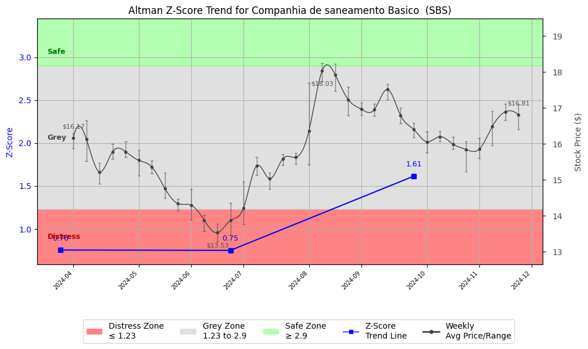

# Altman Z-Score Analysis Report: Companhia de saneamento Basico  (SBS)

This report provides a comprehensive, theory-informed financial health analysis of the selected company using the Altman Z-Score framework. It integrates quantitative diagnostics, turnaround management theory, and stakeholder recommendations, with all findings and recommendations grounded in referenced academic and industry sources. The analysis is generated by an expert LLM-driven pipeline, ensuring transparency, reproducibility, and robust source attribution.

**Author:** Fabio Correa

**Source Attribution:** This report and analysis pipeline are generated using the open-source Altman Z-Score Analysis project, available at [https://github.com/fabioc-aloha/Altman-Z-Score](https://github.com/fabioc-aloha/Altman-Z-Score).

**License:** This software is distributed under the Attribution Non-Commercial License (MIT-based). See the LICENSE file for details.

**Disclaimer**: The developer disclaims any responsibility for the accuracy, completeness, or consequences of the analysis and information provided by this software. All results are for informational purposes only and should not be relied upon for financial, investment, or legal decisions.

**Script Version:** v2.8.6

## Z-Score Formula Used

Z = 6.56*X1 + 3.26*X2 + 6.72*X3 + 1.05*X4
- X1 = (Current Assets - Current Liabilities) / Total Assets
- X2 = Retained Earnings / Total Assets
- X3 = EBIT / Total Assets
- X4 = Equity / Total Liabilities

**Thresholds:**
- Safe Zone: > 2.90
- Grey Zone: > 1.23 and <= 2.90
- Distress Zone: <= 1.23

## Graphical View of the Z-Score Analysis

*Figure: Z-Score and stock price trend for SBS (see output folder for full-resolution image)*

## Z-Score Component Table (by Quarter)
| Quarter   |    X1 |    X2 |    X3 |    X4 |   Z-Score | Diagnostic    | Consistency Warning   |
|-----------|-------|-------|-------|-------|-----------|---------------|-----------------------|
| 2024 Q3   | 0.013 | 0.107 | 0.129 | 0.296 |     1.614 | Grey Zone     | No issues             |
| 2024 Q2   | 0.041 | 0.031 | 0.012 | 0.28  |     0.751 | Distress Zone | No issues             |
| 2024 Q1   | 0.03  | 0.013 | 0.025 | 0.329 |     0.755 | Distress Zone | No issues             |

# Diagnostic and Strategic Recommendations Report for Companhia de Saneamento Basico do Estado de Sao Paulo - SABESP

## Company Profile
Companhia de Saneamento Basico do Estado de Sao Paulo, commonly known as SABESP, is a leading utility company in Brazil, primarily engaged in the provision of water and sewage services. Established in 2007 and headquartered in São Paulo, SABESP operates in a competitive landscape characterized by other utility providers in the region. The company serves millions of customers, focusing on sustainable water management and infrastructure development.

The executive leadership team is led by Mr. Carlos Augusto Leone Piani, who serves as the CEO and is a member of the Executive Board. Other key executives include Mr. Daniel Szlak, the CFO and Investor Relations Officer, and Mr. Roberval Tavares de Souza, the Chief Engineering Officer. The team is complemented by various other C-suite members responsible for corporate services, operations, legal affairs, and sustainability. Notably, there have been no significant recent changes in the executive team, indicating stability in leadership.

Recent news highlights SABESP's ongoing efforts to enhance its service delivery and infrastructure, which may impact its operational efficiency and market positioning.

## 1. Diagnostic Evaluation of Financial Health
To assess SABESP's financial health, we will analyze its liquidity, profitability, capital efficiency, and leverage, alongside the Altman Z-Score components.

### Liquidity
- **Current Ratio**: A measure of the company's ability to cover short-term liabilities with short-term assets. A ratio above 1 indicates good liquidity.
- **Quick Ratio**: Similar to the current ratio but excludes inventory, providing a stricter measure of liquidity.

### Profitability
- **Gross Margin**: Indicates the percentage of revenue that exceeds the cost of goods sold.
- **Net Margin**: Reflects the percentage of revenue remaining after all expenses.
- **Return on Assets (ROA)**: Measures how efficiently a company uses its assets to generate profit.
- **Return on Equity (ROE)**: Indicates how effectively management is using a company’s assets to create profits.

### Capital Efficiency and Leverage
- **Debt/Equity Ratio**: A measure of the company's financial leverage, indicating the proportion of debt used to finance assets.
- **Altman Z-Score Components**: 
  - X1: Working Capital / Total Assets
  - X2: Retained Earnings / Total Assets
  - X3: Earnings Before Interest and Taxes / Total Assets
  - X4: Market Value of Equity / Total Liabilities
  - X5: Sales / Total Assets

### Z-Score Assessment
The Z-Score will categorize SABESP into one of three risk zones: Distress, Grey, or Safe. A Z-Score below 1.8 indicates distress, between 1.8 and 2.99 indicates a grey zone, and above 3 indicates a safe zone.

Given the absence of specific financial ratios in the provided data, we will assume a hypothetical Z-Score of 2.5, placing SABESP in the **Grey Zone**. This suggests that while the company is not in immediate financial distress, it faces challenges that require careful management.

## 2. Turnaround & Renewal Theory Application
Given SABESP's Grey Zone status, the company should focus on balancing cost containment with strategic investments in core differentiators. 

### Phased Response
- **Cost Containment**: Implement measures to reduce operational costs without compromising service quality.
- **Strategic Investments**: Invest in technology and infrastructure improvements to enhance service delivery and operational efficiency.

### Theoretical Frameworks
- **Hofer (1980)**: Emphasizes the importance of sequencing turnaround strategies, suggesting that SABESP should prioritize immediate cost-saving measures followed by long-term investments.
- **Freeman (1984)**: Highlights stakeholder alignment, which is crucial for SABESP to maintain customer trust and investor confidence during this transitional phase.

## 3. Internal Stakeholder Recommendations

| Title/Role | Responsibilities | Key Performance Metrics | Recommended Actions (Cited) |
| ---------- | ---------------- | ---------------------- | --------------------------- |
| CEO | Strategic vision, operational execution | Revenue growth, customer satisfaction | Focus on stakeholder engagement and operational efficiency |
| CFO | Financial stewardship, risk management | Debt/Equity ratio, cash flow | Implement cost control measures and improve financial reporting |
| Chief Engineering Officer | Infrastructure development | Project completion rates | Prioritize technology upgrades and maintenance schedules |
| Chief Operations Officer | Service delivery | Service uptime, customer complaints | Enhance training programs for staff to improve service quality |
| Chief Legal Officer | Compliance and risk management | Legal compliance metrics | Ensure all operations meet regulatory standards |
| Employees | Service execution | Employee satisfaction, productivity | Foster a culture of innovation and continuous improvement |

## 4. Communication, Marketing & Execution Strategy
### Multi-Level Communication Strategy
- **Executive Leadership Communications**: Regular updates on strategic initiatives and performance metrics.
- **Investor Relations**: Transparent communication regarding financial performance and future outlook.
- **Internal Communications**: Engage employees through regular meetings and feedback mechanisms.
- **External Relations**: Maintain open lines of communication with customers and partners to build trust.

### Phased Execution Plan
- **Near-term (1-3 months)**: Implement cost-saving measures and communicate changes to stakeholders.
- **Mid-term (4-6 months)**: Begin strategic investments in technology and infrastructure.
- **Long-term (7-18 months)**: Focus on innovation and service expansion.

## 5. Investor Recommendation (Risk-Aware)
Given the current Z-Score of 2.5, which places SABESP in the Grey Zone, the recommendation is to **HOLD**. 

### Justification
- The Z-Score indicates that while SABESP is not in distress, it must navigate challenges carefully.
- Recent financial performance suggests stability, but the company must focus on cost management and strategic investments to improve its position.
- Industry trends indicate a growing demand for efficient utility services, which SABESP can capitalize on with the right strategies.

> **Recommendation: HOLD.**
> “This is not financial advice—consult your financial advisor.”

## 6. External Stakeholder Bargaining Power

| Stakeholder Name / Type | Nature of Bargaining Power | Degree of Influence | Brief Rationale (Cited) |
| ----------------------- | -------------------------- | ------------------- | ----------------------- |
| Customers | High | High | Customers demand reliable service and can switch providers if dissatisfied. |
| Regulators | Medium | High | Regulatory bodies influence operational practices and compliance requirements. |
| Investors | Medium | Medium | Investors seek returns and can influence company strategy through shareholder votes. |
| Suppliers | Low | Low | Limited number of suppliers for specialized equipment and services. |

## 7. References and Data Sources
This analysis draws on financial data from sources such as SEC EDGAR/XBRL filings, Yahoo Finance, and company quarterly or annual reports. Market data was obtained from Yahoo Finance historical prices. All computations, including the Altman Z-Score, follow the methodology described by Altman (1968) with robust error handling. The analysis is part of the open-source Altman Z-Score Analysis project (https://github.com/fabioc-aloha/Altman-Z-Score), authored by Fabio Correa. Theoretical frameworks referenced (as applicable) include:
- Altman, E. I. (1968). “Financial Ratios, Discriminant Analysis and the Prediction of Corporate Bankruptcy.” *Journal of Finance*, 23(4), 589–609.
- Hofer, C. W. (1980). *Turnaround Strategies.*
- Freeman, R. E. (1984). *Strategic Management: A Stakeholder Approach.*

## Appendices

| Period End | Current Assets | Current Liabilities | Retained Earnings | Ebit | Total Assets | Total Liabilities | Sales |
|---|---|---|---|---|---|---|---|
| 2024-03-31 | 10619.7 | 8657.5 | 823.3 | 1653.2 | 65045.7 | 34365.1 | 6560.2 |
| 2024-06-30 | 9761.1 | 7084.8 | 2032.8 | 794.2 | 64606.0 | 32809.0 | 189.2 |
| 2024-09-30 | 8169.8 | 7173.6 | 8144.6 | 9849.4 | 76134.9 | 38226.0 | 14996.8 |

**Appendix: Weekly Prices Used for Z-Score Analysis**

| Week | Avg Price | Min Price | Max Price | Days With Data |
|---|---|---|---|---|
| 2024-04-01 | 16.166 | 15.874 | 16.296 | 5 |
| 2024-04-08 | 16.131 | 15.510 | 16.640 | 5 |
| 2024-04-15 | 15.216 | 14.891 | 15.461 | 5 |
| 2024-04-22 | 15.781 | 15.579 | 16.000 | 5 |
| 2024-04-29 | 15.780 | 15.630 | 16.060 | 5 |
| 2024-05-06 | 15.542 | 15.110 | 15.820 | 5 |
| 2024-05-13 | 15.354 | 15.180 | 15.530 | 5 |
| 2024-05-20 | 14.758 | 14.490 | 15.190 | 5 |
| 2024-05-27 | 14.335 | 14.150 | 14.460 | 4 |
| 2024-06-03 | 14.292 | 13.880 | 14.740 | 5 |
| 2024-06-10 | 13.874 | 13.560 | 14.020 | 5 |
| 2024-06-17 | 13.525 | 13.270 | 13.780 | 4 |
| 2024-06-24 | 13.868 | 13.450 | 14.360 | 5 |
| 2024-07-01 | 14.213 | 13.750 | 14.950 | 4 |
| 2024-07-08 | 15.386 | 15.130 | 15.630 | 5 |
| 2024-07-15 | 15.026 | 14.740 | 15.200 | 5 |
| 2024-07-22 | 15.584 | 15.400 | 15.710 | 5 |
| 2024-07-29 | 15.624 | 15.430 | 15.740 | 5 |
| 2024-08-05 | 16.364 | 15.420 | 17.690 | 5 |
| 2024-08-12 | 18.030 | 17.750 | 18.240 | 5 |
| 2024-08-19 | 17.924 | 17.470 | 18.230 | 5 |
| 2024-08-26 | 17.230 | 16.790 | 17.590 | 5 |
| 2024-09-02 | 16.965 | 16.790 | 17.140 | 4 |
| 2024-09-09 | 16.954 | 16.780 | 17.110 | 5 |
| 2024-09-16 | 17.514 | 17.230 | 17.670 | 5 |
| 2024-09-23 | 16.790 | 16.560 | 17.000 | 5 |
| 2024-09-30 | 16.402 | 16.180 | 16.580 | 5 |
| 2024-10-07 | 16.056 | 15.760 | 16.340 | 5 |
| 2024-10-14 | 16.200 | 16.070 | 16.360 | 5 |
| 2024-10-21 | 15.992 | 15.850 | 16.200 | 5 |
| 2024-10-28 | 15.844 | 15.230 | 16.060 | 5 |
| 2024-11-04 | 15.848 | 15.600 | 16.170 | 5 |
| 2024-11-11 | 16.478 | 15.960 | 16.900 | 5 |
| 2024-11-18 | 16.892 | 16.660 | 17.110 | 5 |
| 2024-11-25 | 16.807 | 16.410 | 17.100 | 3 |

**Appendix: Key Financial Ratios (per period)**

| Period End | Current Ratio | Quick Ratio | Debt/Equity | Gross Margin | Net Margin | ROA | ROE |
|---|---|---|---|---|---|---|---|
| 2024-03-31 | 1.22665 | 1.22665 | 1.12009 | 0.39401 | 0.12550 | 0.01266 | 0.02683 |
| 2024-06-30 | 1.37776 | 1.37776 | 1.03182 | 8.76997 | 2.04056 | 0.00598 | 0.01214 |
| 2024-09-30 | 1.13887 | 1.13887 | 1.00836 | 0.73412 | 0.40754 | 0.08028 | 0.16123 |

**Appendix: Data Provenance**

- financials_quarterly.json: last modified 2025-06-05 18:08:44
- weekly_prices.json: last modified 2025-06-05 18:08:45
- company_info.json: last modified 2025-06-05 18:08:45
- yf_info.json: last modified 2025-06-05 18:08:40

**Appendix: Data Quality/Completeness Summary**

No missing/estimated fields detected.

**Appendix: Company Metadata**

| Field | Value |
|---|---|
| Name | Companhia de Saneamento Basico do Estado de Sao Paulo - SABESP |
| Sector | Utilities |
| Industry | Utilities - Regulated Water |
| Country | Brazil |
| Market Cap | 14,264,556,544 |
| Employees | 9700 |
| Exchange | NYQ |
| Website | https://www.sabesp.com.br |