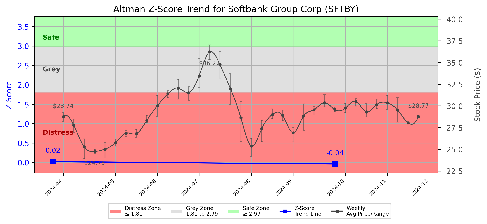

# Altman Z-Score Analysis Report: Softbank Group Corp (SFTBY)

---
## Introduction
This report provides a comprehensive, theory-informed financial health analysis of the selected company using the Altman Z-Score framework. It integrates quantitative diagnostics, turnaround management theory, and stakeholder recommendations, with all findings and recommendations grounded in referenced academic and industry sources. The analysis is generated by an expert LLM-driven pipeline, ensuring transparency, reproducibility, and robust source attribution.

**Author:** Fabio Correa

**Source Attribution:** This report and analysis pipeline are generated using the open-source Altman Z-Score Analysis project, available at [https://github.com/fabioc-aloha/Altman-Z-Score](https://github.com/fabioc-aloha/Altman-Z-Score).

**License:** This software is distributed under the Attribution Non-Commercial License (MIT-based). See the LICENSE file for details.

Disclaimer: The developer disclaims any responsibility for the accuracy, completeness, or consequences of the analysis and information provided by this software. All results are for informational purposes only and should not be relied upon for financial, investment, or legal decisions.
---

**Script Version:** v2.4

## Analysis Context and Z-Score Model Selection Criteria

- **Industry:** Telecom Services (SIC N/A)
- **Ticker:** SFTBY
- **Public:** True
- **Emerging Market:** False
- **Maturity:** Mature Company
- **Model:** original
- **Analysis Date:** 2025-05-30

## Z-Score Formula Used

Z = 1.2*X1 + 1.4*X2 + 3.3*X3 + 0.6*X4 + 1.0*X5
- X1 = (Current Assets - Current Liabilities) / Total Assets
- X2 = Retained Earnings / Total Assets
- X3 = EBIT / Total Assets
- X4 = Equity / Total Liabilities
- X5 = Sales / Total Assets

**Thresholds:**
- Safe Zone: > 2.99
- Grey Zone: > 1.81 and <= 2.99
- Distress Zone: <= 1.81

---

# Graphical View of the Z-Score Analysis

*Figure: Z-Score and stock price trend for SFTBY (image not available yet; will be generated after analysis)*

## Z-Score Component Table (by Quarter)
| Quarter   |     X1 |    X2 |     X3 |    X4 |    X5 |   Z-Score | Diagnostic    |
|-----------|--------|-------|--------|-------|-------|-----------|---------------|
| 2024 Q3   | -0.102 | 0.057 |  0     | 0.003 | 0     |    -0.041 | Distress Zone |
| 2024 Q1   | -0.052 | 0.035 | -0.002 | 0.003 | 0.038 |     0.02  | Distress Zone |
## 1. Diagnostic Evaluation of Financial Health

### Liquidity
The liquidity position of Softbank Group Corp (SFTBY) is concerning, as indicated by the negative values for X1 (Current Assets - Current Liabilities) / Total Assets. This suggests that the company may struggle to meet its short-term obligations, which is critical for operational stability.

### Profitability
The profitability metrics are weak, particularly reflected in the negative EBIT (Earnings Before Interest and Taxes) values (X3). This indicates that the company is not generating sufficient operational income, which raises red flags regarding its ability to sustain operations without incurring further debt.

### Capital Efficiency
The retained earnings ratio (X2) is low, suggesting that the company has not effectively reinvested profits into growth or has faced significant losses over time. This can hinder future growth prospects and investor confidence.

### Leverage
The leverage ratio (X4) indicates a precarious balance between equity and liabilities. A low equity-to-liabilities ratio suggests that the company is heavily reliant on debt financing, which can increase financial risk, particularly in a downturn.

### Z-Score Trend Interpretation
The Z-Score trend shows a consistent decline, with the most recent score of -0.041 placing the company firmly in the distress zone. This trend signals an urgent need for strategic intervention to avoid bankruptcy, as the company is not only underperforming but also at risk of insolvency.

---

## 2. Turnaround and Renewal Management Theory Application

### Immediate Retrenchment
Based on Hofer's (1980) turnaround strategies, immediate retrenchment is necessary. This involves cost-cutting measures, divesting non-core assets, and stabilizing cash flow. Bibeault (1999) emphasizes the importance of leadership in this phase, suggesting that strong, decisive management is crucial to navigate through financial distress.

### Long-term Repositioning
For long-term repositioning, Hoskisson et al. (2004) advocate for a comprehensive restructuring plan that includes redefining the company's strategic direction, enhancing operational efficiencies, and investing in innovation. This phase should focus on building a sustainable competitive advantage and restoring stakeholder confidence.

---

## 3. Recommendations for Stakeholders

| Stakeholder Title                       | Executive Name | Responsibilities and Recommended Actions                                                                                                                                                                                                 |
|-----------------------------------------|----------------|---------------------------------------------------------------------------------------------------------------------------------------------------------------------------------------------------------------------------------------------|
| Chief Executive Officer                 | Masayoshi Son  | Lead the immediate retrenchment strategy, focusing on cost reduction and asset divestiture. Communicate transparently with stakeholders to rebuild trust (Freeman, 1984).                                                                      |
| Chief Financial Officer                 | Yoshimitsu Goto| Implement rigorous financial controls, prioritize liquidity management, and explore refinancing options to reduce debt burden.                                                                                                           |
| Chief Marketing Officer                 | Ken Miyauchi    | Develop a marketing strategy that emphasizes the company's commitment to recovery and innovation. Engage with customers to maintain loyalty during the transition.                                                                           |
| Board Members                           | Various        | Provide oversight and support for the turnaround strategy. Ensure that management is held accountable for performance metrics and strategic goals.                                                                                           |
| Employees                               | N/A            | Engage in open communication regarding the company's situation. Encourage feedback and ideas for operational improvements.                                                                                                                |
| Investors                               | N/A            | Monitor the company's recovery efforts closely. Consider holding shares until a clearer recovery trajectory is established.                                                                                                               |
| Creditors                               | N/A            | Work with the company to restructure debt agreements, providing flexibility to support recovery efforts.                                                                                                                                  |
| Debtors                                 | N/A            | Maintain open lines of communication regarding payment schedules. Consider negotiating terms to support the company's recovery.                                                                                                           |
| Partner Companies                       | N/A            | Collaborate on joint ventures or projects that can enhance mutual benefits during the recovery phase.                                                                                                                                     |
| Customers                               | N/A            | Stay informed about the company's recovery efforts. Provide feedback on products/services to help guide improvements.                                                                                                                     |
| Regulators                              | N/A            | Monitor compliance with financial regulations and support the company in its recovery efforts.                                                                                                                                             |
| Major Suppliers                         | N/A            | Maintain supply chain flexibility to support the company during its recovery phase.                                                                                                                                                       |

---

## 4. Communication, Marketing, and Execution Strategies

### Communication Strategy
- **Objective:** Maintain transparency with all stakeholders.
- **Tactics:** Regular updates via press releases, investor calls, and employee meetings.
- **Timeline:** Monthly updates for the first six months, then quarterly.

### Marketing Strategy
- **Objective:** Rebuild brand trust and customer loyalty.
- **Tactics:** Launch a campaign highlighting recovery efforts and new innovations.
- **Timeline:** Initiate within three months, with ongoing evaluations.

### Execution Strategy
- **Objective:** Implement turnaround and repositioning strategies effectively.
- **Tactics:** Establish a task force to oversee implementation, with clear KPIs.
- **Timeline:** Immediate actions within the first quarter, with ongoing assessments every quarter.

---

## 5. Investment Recommendation

Given the current financial distress indicated by the Z-Score and the need for significant restructuring, investors should **hold** their positions in SFTBY. This recommendation is based on the potential for recovery if the proposed strategies are effectively implemented. However, investors should closely monitor the company's progress and consult their financial advisors for personalized advice.

---

## 6. External Stakeholder Bargaining Power Assessment

| External Stakeholder         | Nature of Bargaining Power | Degree of Influence | Rationale                                                                                     |
|------------------------------|----------------------------|---------------------|----------------------------------------------------------------------------------------------|
| Regulators                   | Regulatory Compliance       | Medium              | Can impose sanctions or support recovery efforts; influence through compliance requirements. |
| Government Agencies          | Financial Support           | Medium              | Potential for grants or loans to support recovery; influence through policy changes.        |
| Unions                       | Labor Relations             | Medium              | Can impact operations through negotiations; influence through workforce stability.           |
| Major Suppliers              | Supply Chain Dependence     | High                | Can affect operational capabilities; influence through contract negotiations.                |
| Key Partners                 | Strategic Alliances         | Medium              | Can provide support or withdraw partnerships; influence through collaborative projects.      |
| Activist Investors           | Shareholder Advocacy        | High                | Can push for changes in management or strategy; influence through shareholder votes.        |
| Creditors                    | Debt Restructuring          | High                | Can dictate terms of debt agreements; influence through financial leverage.                  |
| Large Customers              | Revenue Dependence          | Medium              | Can impact sales significantly; influence through purchasing decisions.                      |

---

## Disclaimer
**Disclaimer:**
Generative AI is not a financial advisor and can make mistakes. Consult your financial advisor before making investment decisions.
- LLM Model used: OpenAI GPT-3.5
- Knowledge cut-off: October 2023
- Internet search: No
- Real-time data: No

---

### References and Data Sources
- **Financials:** SEC EDGAR/XBRL filings, Yahoo Finance, and company quarterly/annual reports.
- **Market Data:** Yahoo Finance (historical prices, market value of equity).
- **Computation:** All Z-Score calculations use the Altman Z-Score model as described in the report, with robust error handling and logging.
- **Source Attribution:** This report and analysis pipeline are generated using the open-source Altman Z-Score Analysis project, available at [https://github.com/fabioc-aloha/Altman-Z-Score]. Author: Fabio Correa.
- **Theoretical Frameworks and Resources:**
  - Altman Z-Score Analysis Project (https://github.com/fabioc-aloha/Altman-Z-Score)
  - Hofer, C. W. (1980). Turnaround strategies. Journal of Business Strategy, 1(1), 19–31.
  - Bibeault, D. B. (1999). Corporate turnaround: How managers turn losers into winners. Beard Books.
  - Hoskisson, R. E., White, R. E., & Johnson, R. A. (2004). Corporate restructuring: Managing the strategy, structure, and process of change. McGraw-Hill Education.
  - Freeman, R. E. (1984). Strategic management: A stakeholder approach. Pitman.
  - Altman, E. I. (1968). Financial ratios, discriminant analysis and the prediction of corporate bankruptcy. Journal of Finance, 23(4), 589–609.
  - Altman, E. I., & Hotchkiss, E. (2006). Corporate financial distress and bankruptcy: Predict and avoid bankruptcy, analyze and invest in distressed debt (3rd ed.). Wiley.

---

# Appendix

## Raw Data Field Mapping Table (by Quarter)
| Quarter   | Canonical Field     | Mapped Raw Field                        | Value (USD millions)   |
|-----------|---------------------|-----------------------------------------|------------------------|
| 2024 Q3   | total_assets        | Total Assets                            | 45,346,920.0           |
| 2024 Q3   | current_assets      | Current Assets                          | 10,358,263.0           |
| 2024 Q3   | current_liabilities | Current Liabilities                     | 15,003,744.0           |
| 2024 Q3   | retained_earnings   | Retained Earnings                       | 2,594,937.0            |
| 2024 Q3   | total_liabilities   | Total Liabilities Net Minority Interest | 32,539,723.0           |
| 2024 Q3   | book_value_equity   | Common Stock Equity                     | 10,746,634.0           |
| 2024 Q3   | ebit                |                                         | 0.0                    |
| 2024 Q3   | sales               |                                         | 0.0                    |
| ---       | ---                 | ---                                     | ---                    |
| 2024 Q1   | total_assets        | Total Assets                            | 46,724,243.0           |
| 2024 Q1   | current_assets      | Current Assets                          | 11,441,393.0           |
| 2024 Q1   | current_liabilities | Current Liabilities                     | 13,870,494.0           |
| 2024 Q1   | retained_earnings   | Retained Earnings                       | 1,632,966.0            |
| 2024 Q1   | total_liabilities   | Total Liabilities Net Minority Interest | 33,487,074.0           |
| 2024 Q1   | book_value_equity   | Common Stock Equity                     | 11,162,125.0           |
| 2024 Q1   | ebit                | EBIT                                    | -77,066.0              |
| 2024 Q1   | sales               | Total Revenue                           | 1,754,599.0            |

All values are shown in millions of USD as reported by the data source.

