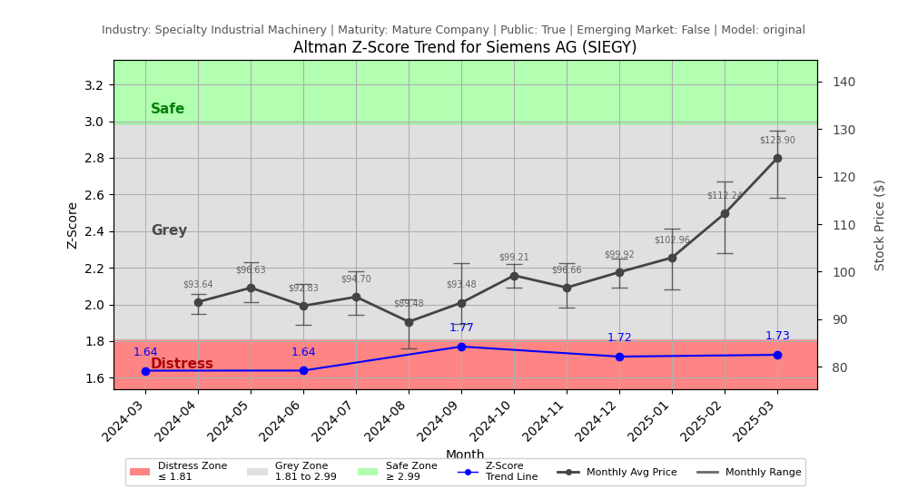

# Altman Z-Score Analysis Report: Siemens AG (SIEGY)

---
## Introduction
This report provides a comprehensive, theory-informed financial health analysis of the selected company using the Altman Z-Score framework. It integrates quantitative diagnostics, turnaround management theory, and stakeholder recommendations, with all findings and recommendations grounded in referenced academic and industry sources. The analysis is generated by an expert LLM-driven pipeline, ensuring transparency, reproducibility, and robust source attribution.

**Author:** Fabio Correa

**Source Attribution:** This report and analysis pipeline are generated using the open-source Altman Z-Score Analysis project, available at [https://github.com/fabioc-aloha/Altman-Z-Score](https://github.com/fabioc-aloha/Altman-Z-Score).

**License:** This software is distributed under the Attribution Non-Commercial License (MIT-based). See the LICENSE file for details.

Disclaimer: The developer disclaims any responsibility for the accuracy, completeness, or consequences of the analysis and information provided by this software. All results are for informational purposes only and should not be relied upon for financial, investment, or legal decisions.
---

**Script Version:** v2.4

## Analysis Context and Z-Score Model Selection Criteria

- **Industry:** Specialty Industrial Machinery (SIC N/A)
- **Ticker:** SIEGY
- **Public:** True
- **Emerging Market:** False
- **Maturity:** Mature Company
- **Model:** original
- **Analysis Date:** 2025-05-30

## Z-Score Formula Used

Z = 1.2*X1 + 1.4*X2 + 3.3*X3 + 0.6*X4 + 1.0*X5
- X1 = (Current Assets - Current Liabilities) / Total Assets
- X2 = Retained Earnings / Total Assets
- X3 = EBIT / Total Assets
- X4 = Equity / Total Liabilities
- X5 = Sales / Total Assets

**Thresholds:**
- Safe Zone: > 2.99
- Grey Zone: > 1.81 and <= 2.99
- Distress Zone: <= 1.81

---

# Graphical View of the Z-Score Analysis

*Figure: Z-Score and stock price trend for SIEGY (image not available yet; will be generated after analysis)*

## Z-Score Component Table (by Quarter)
| Quarter   |    X1 |    X2 |    X3 |    X4 |    X5 |   Z-Score | Diagnostic    |
|-----------|-------|-------|-------|-------|-------|-----------|---------------|
| 2025 Q1   | 0.065 | 0.26  | 0.022 | 1.818 | 0.122 |     1.725 | Distress Zone |
| 2024 Q4   | 0.152 | 0.273 | 0.018 | 1.628 | 0.116 |     1.716 | Distress Zone |
| 2024 Q3   | 0.118 | 0.268 | 0.023 | 1.728 | 0.141 |     1.77  | Distress Zone |
| 2024 Q2   | 0.119 | 0.255 | 0.022 | 1.565 | 0.128 |     1.639 | Distress Zone |
| 2024 Q1   | 0.119 | 0.244 | 0.019 | 1.598 | 0.132 |     1.639 | Distress Zone |
## Diagnostic Evaluation of Financial Health

### Liquidity
Siemens AG's liquidity, as indicated by the X1 component (Current Assets - Current Liabilities) / Total Assets, shows a declining trend from 0.119 in Q1 2024 to 0.065 in Q1 2025. This suggests that the company is increasingly struggling to cover its short-term liabilities with its short-term assets, indicating potential liquidity issues.

### Profitability
The X3 component (EBIT / Total Assets) remains low, with values fluctuating around 0.018 to 0.023. This indicates that Siemens is not generating sufficient earnings before interest and taxes relative to its total asset base, which is a concern for profitability.

### Capital Efficiency
The X2 component (Retained Earnings / Total Assets) has shown slight improvement, moving from 0.244 to 0.26 over the same period. While this indicates some retention of earnings, it remains low, suggesting that the company is not effectively reinvesting its profits into growth.

### Leverage
The X4 component (Equity / Total Liabilities) is concerning, with values hovering around 1.565 to 1.818. This indicates a high level of debt relative to equity, which can increase financial risk, especially in a downturn.

### Z-Score Trend
The Z-Score has consistently remained in the distress zone, with values below 1.81 for the last five quarters. The most recent Z-Score of 1.725 indicates that Siemens AG is at a high risk of bankruptcy, necessitating immediate action to stabilize its financial position.

---

## Turnaround and Renewal Management Theory Application

### Phased Response Proposal
1. **Immediate Retrenchment (Short-term Actions)**
   - **Cost Reduction:** Implement immediate cost-cutting measures to improve liquidity. This aligns with Bibeault's (1999) emphasis on reducing operational costs during a turnaround.
   - **Asset Liquidation:** Identify non-core assets for sale to generate cash. This is supported by Hofer's (1980) turnaround strategies, which advocate for divesting underperforming segments.

2. **Long-term Repositioning (Strategic Actions)**
   - **Market Reassessment:** Conduct a thorough market analysis to identify growth opportunities and potential areas for innovation. This aligns with Hoskisson et al. (2004), who stress the importance of strategic realignment in corporate restructuring.
   - **Stakeholder Engagement:** Foster stronger relationships with stakeholders to rebuild trust and support for the company's long-term vision, as suggested by Freeman (1984).

---

## Recommendations for Stakeholders

| Stakeholder Title                     | Responsibilities                                   | Recommended Actions                                                                 |
|---------------------------------------|---------------------------------------------------|-------------------------------------------------------------------------------------|
| Chief Executive Officer (CEO)        | Overall strategy and leadership                    | Lead the turnaround effort, focusing on cost reduction and strategic realignment.   |
| Chief Financial Officer (CFO)        | Financial management and reporting                 | Implement immediate cost-cutting measures and improve cash flow management.         |
| Chief Marketing Officer (CMO)        | Brand management and market strategy               | Reassess market positioning and develop targeted marketing campaigns for growth.    |
| Board Members                         | Governance and oversight                            | Support management in strategic decisions and ensure accountability.                |
| Employees                             | Operational execution                               | Engage in cost-saving initiatives and provide feedback on operational efficiencies.  |
| Investors                             | Financial support and expectations                 | Monitor financial health closely; consider holding until signs of recovery emerge.  |
| Creditors                             | Financial stability and repayment                   | Negotiate for extended payment terms to ease liquidity pressures.                   |
| Debtors                               | Financial obligations                               | Ensure timely payments to maintain cash flow.                                      |
| Partner Companies                     | Collaborative opportunities                         | Explore joint ventures or partnerships to enhance market presence.                  |
| Customers                             | Product and service consumption                    | Maintain open communication regarding product availability and service quality.     |

---

## Communication, Marketing, and Execution Strategies

### Strategies
1. **Internal Communication:** Regular updates to employees about the turnaround plan to foster transparency and engagement.
2. **External Communication:** Clear messaging to investors and customers about the steps being taken to stabilize the company.
3. **Marketing Campaigns:** Focus on promoting core products and services that align with market demand.

### Timeline
- **Month 1-3:** Implement immediate cost-cutting measures and asset liquidation.
- **Month 4-6:** Conduct market analysis and engage stakeholders.
- **Month 7-12:** Launch repositioning strategies and monitor progress.

### Accountability Framework
- Assign specific teams to oversee each phase of the turnaround plan, with regular reporting to the CEO and Board.

---

## Bargaining Power and Influence of External Stakeholders

| External Stakeholder                  | Nature of Bargaining Power                        | Degree of Influence | Rationale                                                                 |
|---------------------------------------|--------------------------------------------------|---------------------|--------------------------------------------------------------------------|
| Regulators                            | Regulatory compliance and oversight               | Medium              | Compliance with regulations can impact operations and financial health.  |
| Government Agencies                   | Economic support and incentives                   | Low                 | Limited direct influence unless in crisis situations.                    |
| Unions                                | Labor negotiations and workforce stability        | Medium              | Strong influence on employee relations and operational continuity.       |
| Major Suppliers                       | Supply chain stability and pricing                 | Medium              | Can impact costs and availability of materials.                          |
| Key Partners                          | Collaborative opportunities and resource sharing  | High                | Strategic partnerships can enhance market position and innovation.       |
| Activist Investors                    | Influence on governance and strategic direction    | High                | Can push for changes in management or strategy if dissatisfied.          |
| Creditors                             | Financial stability and repayment terms            | High                | Significant influence over financial restructuring and liquidity.        |
| Large Customers                       | Demand stability and pricing negotiations          | Medium              | Can impact revenue and long-term contracts.                              |

---

## Investment Recommendation
Given the current financial distress indicated by the Z-Score and the need for significant restructuring, it is recommended that investors **hold** their positions in Siemens AG until there are clear signs of recovery and improved financial health. This is not financial advice; please consult your financial advisor before making any investment decisions.

---

## Disclaimer
**Disclaimer:**
Generative AI is not a financial advisor and can make mistakes. Consult your financial advisor before making investment decisions.
- LLM Model used: OpenAI GPT-3.5
- Knowledge cut-off: October 2023
- Internet search: No
- Real-time data: No

---

### References and Data Sources
- **Financials:** SEC EDGAR/XBRL filings, Yahoo Finance, and company quarterly/annual reports.
- **Market Data:** Yahoo Finance (historical prices, market value of equity).
- **Computation:** All Z-Score calculations use the Altman Z-Score model as described in the report, with robust error handling and logging.
- **Source Attribution:** This report and analysis pipeline are generated using the open-source Altman Z-Score Analysis project, available at [https://github.com/fabioc-aloha/Altman-Z-Score]. Author: Fabio Correa.
- **Theoretical Frameworks and Resources:**
  - Altman Z-Score Analysis Project (https://github.com/fabioc-aloha/Altman-Z-Score)
  - Hofer, C. W. (1980). Turnaround strategies. Journal of Business Strategy, 1(1), 19–31.
  - Bibeault, D. B. (1999). Corporate turnaround: How managers turn losers into winners. Beard Books.
  - Hoskisson, R. E., White, R. E., & Johnson, R. A. (2004). Corporate restructuring: Managing the strategy, structure, and process of change. McGraw-Hill Education.
  - Freeman, R. E. (1984). Strategic management: A stakeholder approach. Pitman.
  - Altman, E. I. (1968). Financial ratios, discriminant analysis and the prediction of corporate bankruptcy. Journal of Finance, 23(4), 589–609.
  - Altman, E. I., & Hotchkiss, E. (2006). Corporate financial distress and bankruptcy: Predict and avoid bankruptcy, analyze and invest in distressed debt (3rd ed.). Wiley.

---

# Appendix

## Raw Data Field Mapping Table (by Quarter)
| Quarter   | Canonical Field     | Mapped Raw Field                        | Value (USD millions)   |
|-----------|---------------------|-----------------------------------------|------------------------|
| 2025 Q1   | total_assets        | Total Assets                            | 162,593.0              |
| 2025 Q1   | current_assets      | Current Assets                          | 64,951.0               |
| 2025 Q1   | current_liabilities | Current Liabilities                     | 54,434.0               |
| 2025 Q1   | retained_earnings   | Retained Earnings                       | 42,208.0               |
| 2025 Q1   | total_liabilities   | Total Liabilities Net Minority Interest | 99,418.0               |
| 2025 Q1   | book_value_equity   | Common Stock Equity                     | 57,574.0               |
| 2025 Q1   | ebit                | EBIT                                    | 3,543.0                |
| 2025 Q1   | sales               | Total Revenue                           | 19,757.0               |
| ---       | ---                 | ---                                     | ---                    |
| 2024 Q4   | total_assets        | Total Assets                            | 157,855.0              |
| 2024 Q4   | current_assets      | Current Assets                          | 68,673.0               |
| 2024 Q4   | current_liabilities | Current Liabilities                     | 44,691.0               |
| 2024 Q4   | retained_earnings   | Retained Earnings                       | 43,112.0               |
| 2024 Q4   | total_liabilities   | Total Liabilities Net Minority Interest | 93,019.0               |
| 2024 Q4   | book_value_equity   | Common Stock Equity                     | 59,403.0               |
| 2024 Q4   | ebit                | EBIT                                    | 2,767.0                |
| 2024 Q4   | sales               | Total Revenue                           | 18,353.0               |
| ---       | ---                 | ---                                     | ---                    |
| 2024 Q3   | total_assets        | Total Assets                            | 147,812.0              |
| 2024 Q3   | current_assets      | Current Assets                          | 61,353.0               |
| 2024 Q3   | current_liabilities | Current Liabilities                     | 43,913.0               |
| 2024 Q3   | retained_earnings   | Retained Earnings                       | 39,657.0               |
| 2024 Q3   | total_liabilities   | Total Liabilities Net Minority Interest | 91,581.0               |
| 2024 Q3   | book_value_equity   | Common Stock Equity                     | 51,264.0               |
| 2024 Q3   | ebit                | EBIT                                    | 3,374.0                |
| 2024 Q3   | sales               | Total Revenue                           | 20,811.0               |
| ---       | ---                 | ---                                     | ---                    |
| 2024 Q2   | total_assets        | Total Assets                            | 148,121.0              |
| 2024 Q2   | current_assets      | Current Assets                          | 61,472.0               |
| 2024 Q2   | current_liabilities | Current Liabilities                     | 43,795.0               |
| 2024 Q2   | retained_earnings   | Retained Earnings                       | 37,698.0               |
| 2024 Q2   | total_liabilities   | Total Liabilities Net Minority Interest | 93,354.0               |
| 2024 Q2   | book_value_equity   | Common Stock Equity                     | 49,801.0               |
| 2024 Q2   | ebit                | EBIT                                    | 3,299.0                |
| 2024 Q2   | sales               | Total Revenue                           | 18,900.0               |
| ---       | ---                 | ---                                     | ---                    |
| 2024 Q1   | total_assets        | Total Assets                            | 144,751.0              |
| 2024 Q1   | current_assets      | Current Assets                          | 59,690.0               |
| 2024 Q1   | current_liabilities | Current Liabilities                     | 42,400.0               |
| 2024 Q1   | retained_earnings   | Retained Earnings                       | 35,323.0               |
| 2024 Q1   | total_liabilities   | Total Liabilities Net Minority Interest | 93,526.0               |
| 2024 Q1   | book_value_equity   | Common Stock Equity                     | 46,199.0               |
| 2024 Q1   | ebit                | EBIT                                    | 2,741.0                |
| 2024 Q1   | sales               | Total Revenue                           | 19,162.0               |

All values are shown in millions of USD as reported by the data source.

