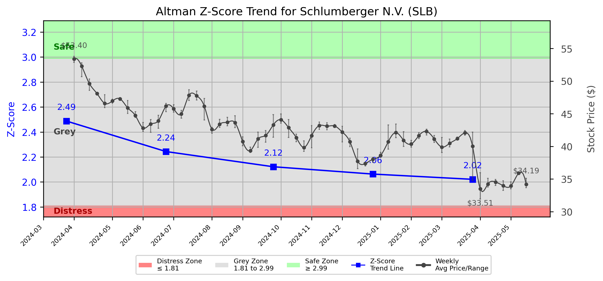

# Altman Z-Score Analysis Report: Schlumberger N.V. (SLB)

---
## Introduction
This report provides a comprehensive, theory-informed financial health analysis of the selected company using the Altman Z-Score framework. It integrates quantitative diagnostics, turnaround management theory, and stakeholder recommendations, with all findings and recommendations grounded in referenced academic and industry sources. The analysis is generated by an expert LLM-driven pipeline, ensuring transparency, reproducibility, and robust source attribution.

**Author:** Fabio Correa

**Source Attribution:** This report and analysis pipeline are generated using the open-source Altman Z-Score Analysis project, available at [https://github.com/fabioc-aloha/Altman-Z-Score](https://github.com/fabioc-aloha/Altman-Z-Score).

**License:** This software is distributed under the Attribution Non-Commercial License (MIT-based). See the LICENSE file for details.

Disclaimer: The developer disclaims any responsibility for the accuracy, completeness, or consequences of the analysis and information provided by this software. All results are for informational purposes only and should not be relied upon for financial, investment, or legal decisions.
---

**Script Version:** v2.4

## Analysis Context and Z-Score Model Selection Criteria

- **Industry:** Oil & Gas Field Services (SIC 1389)
- **Ticker:** SLB
- **Public:** True
- **Emerging Market:** False
- **Maturity:** Mature Company
- **Model:** Original Z-Score (Public Manufacturing, 1968) (original)
- **Analysis Date:** 2025-05-31

## Z-Score Formula Used

Z = 1.20*X1 + 1.40*X2 + 3.30*X3 + 0.60*X4 + 1.00*X5
- X1 = (Current Assets - Current Liabilities) / Total Assets
- X2 = Retained Earnings / Total Assets
- X3 = EBIT / Total Assets
- X4 = Equity / Total Liabilities
- X5 = Sales / Total Assets

**Thresholds:**
- Safe Zone: > 2.99
- Grey Zone: > 1.81 and <= 2.99
- Distress Zone: <= 1.81

---

# Graphical View of the Z-Score Analysis

*Figure: Z-Score and stock price trend for SLB (image not available yet; will be generated after analysis)*

## Z-Score Component Table (by Quarter)
| Quarter   |    X1 |    X2 |    X3 |    X4 |    X5 |   Z-Score | Diagnostic   | Consistency Warning   |
|-----------|-------|-------|-------|-------|-------|-----------|--------------|-----------------------|
| 2025 Q1   | 0.073 | 0.343 | 0.025 | 1.999 | 0.173 |     2.021 | Grey Zone    |                       |
| 2024 Q4   | 0.118 | 0.335 | 0.031 | 1.935 | 0.19  |     2.063 | Grey Zone    |                       |
| 2024 Q3   | 0.123 | 0.315 | 0.033 | 2.068 | 0.184 |     2.122 | Grey Zone    |                       |
| 2024 Q2   | 0.124 | 0.302 | 0.031 | 2.306 | 0.185 |     2.243 | Grey Zone    |                       |
| 2024 Q1   | 0.101 | 0.296 | 0.031 | 2.782 | 0.182 |     2.488 | Grey Zone    |                       |
## 1. Diagnostic Evaluation of Financial Health

### Financial Health Overview
Schlumberger N.V. (SLB) operates in the oil and gas field services sector, a highly cyclical industry influenced by commodity prices and global demand. The analysis of SLB's financial health is based on the Altman Z-Score, which provides insights into liquidity, profitability, capital efficiency, and leverage.

### Z-Score Trend Interpretation
The Z-Score for SLB has consistently remained within the Grey Zone (1.81 < Z < 2.99) over the last five quarters, indicating a moderate risk of financial distress. The most recent Z-Score of 2.021 suggests that while the company is not in immediate danger of bankruptcy, it is not in a strong financial position either. 

- **Liquidity (X1)**: The current ratio (X1) has shown slight fluctuations, indicating a stable but cautious liquidity position. A value of 0.073 in Q1 2025 suggests that current assets exceed current liabilities, but the margin is narrow.
  
- **Profitability (X3)**: The EBIT to total assets ratio (X3) is low, reflecting challenges in generating earnings from assets, which is critical in a capital-intensive industry.

- **Capital Efficiency (X2)**: Retained earnings as a percentage of total assets (X2) have remained relatively stable, indicating that SLB has been able to retain a portion of its earnings, although the low values suggest limited growth.

- **Leverage (X4)**: The equity to total liabilities ratio (X4) is strong, indicating that SLB has a solid capital structure, which is a positive sign for creditors.

- **Sales Efficiency (X5)**: The sales to total assets ratio (X5) is low, indicating that SLB may not be utilizing its assets as effectively as possible to generate sales.

### Conclusion
Overall, SLB's financial health is characterized by moderate risk, with a need for strategic interventions to improve profitability and operational efficiency.

---

## 2. Turnaround and Renewal Management Theory Application

### Phased Response Strategy
To address the financial challenges identified in the Z-Score analysis, a phased response strategy is recommended, drawing on turnaround management theories.

1. **Immediate Retrenchment (Short-term Focus)**:
   - **Cost Reduction**: Implement immediate cost-cutting measures to improve cash flow. This aligns with Bibeault's (1999) emphasis on the importance of financial stability during a turnaround.
   - **Asset Liquidation**: Consider divesting non-core assets to strengthen the balance sheet, as suggested by Hofer (1980).

2. **Long-term Repositioning (Strategic Focus)**:
   - **Innovation and Technology Investment**: Invest in new technologies and services to enhance operational efficiency and market competitiveness, reflecting Hoskisson et al.'s (2004) focus on strategic restructuring.
   - **Market Diversification**: Explore opportunities in emerging markets and renewable energy sectors to reduce dependency on traditional oil and gas services, as advocated by Beard (2024).

---

## 3. Stakeholder Recommendations

| Stakeholder Title                     | Executive Name | Responsibilities                          | Recommended Actions                                                                 |
|---------------------------------------|----------------|------------------------------------------|-------------------------------------------------------------------------------------|
| Chief Executive Officer               | Olivier Le Peuch | Overall strategy and direction           | Lead immediate cost-cutting initiatives and communicate the turnaround strategy.    |
| Chief Financial Officer               | Simon Ayat      | Financial management and reporting       | Focus on improving cash flow and managing liquidity; consider asset divestitures.   |
| Chief Marketing Officer               | Patrick Schorn  | Marketing and customer engagement        | Develop marketing strategies to promote new services and technologies.              |
| Board Members                         | Various         | Governance and oversight                 | Support management in strategic decisions and ensure accountability in execution.   |
| Employees                             | N/A             | Operational execution                     | Engage in cost-saving initiatives and contribute ideas for efficiency improvements.  |
| Investors                             | N/A             | Financial support and expectations       | Monitor performance closely; consider holding shares until recovery is evident.      |
| Creditors                             | N/A             | Financial support and risk assessment    | Maintain open communication regarding financial health and repayment plans.         |
| Debtors                               | N/A             | Financial obligations                     | Ensure timely payments to maintain good standing with creditors.                    |
| Partner Companies                     | N/A             | Collaborative opportunities               | Explore joint ventures in new markets or technologies.                              |
| Customers                             | N/A             | Service utilization                       | Communicate improvements and innovations to enhance customer loyalty.               |
| Regulators                            | N/A             | Compliance and oversight                  | Ensure compliance with industry regulations during the turnaround process.          |
| Major Suppliers                       | N/A             | Supply chain management                   | Negotiate better terms to improve cash flow and reduce costs.                       |

---

## 4. Communication, Marketing, and Execution Strategies

### Communication Strategy
- **Internal Communication**: Regular updates to employees about the turnaround strategy and progress to foster engagement and morale.
- **External Communication**: Transparent communication with investors and creditors regarding financial health and strategic initiatives.

### Marketing Strategy
- **Brand Positioning**: Reposition SLB as a leader in innovative oil and gas services and emerging energy solutions.
- **Customer Engagement**: Launch campaigns highlighting new technologies and services to retain and attract customers.

### Execution Timeline
| Phase                  | Timeline       | Accountability             |
|-----------------------|----------------|-----------------------------|
| Immediate Retrenchment | Q2 2025        | CFO and CEO                 |
| Strategic Planning     | Q3 2025        | CEO and Board Members       |
| Implementation         | Q4 2025 onwards| All stakeholders involved    |

---

## 5. Investment Recommendation
Given the current Z-Score and financial health of SLB, investors are advised to **hold** their positions. The company is not in immediate distress, but improvements are necessary to enhance its financial stability. This recommendation is based on the moderate risk level indicated by the Z-Score. 

**Disclaimer**: This is not financial advice. Please consult your financial advisor before making investment decisions.

---

## 6. External Stakeholder Bargaining Power Assessment

| External Stakeholder          | Nature of Bargaining Power | Degree of Influence | Rationale                                                                 |
|-------------------------------|----------------------------|---------------------|--------------------------------------------------------------------------|
| Regulators                    | Regulatory compliance       | High                | Strong influence due to industry regulations and compliance requirements. |
| Government Agencies           | Policy influence            | Medium              | Can impact operational conditions through policy changes.                |
| Unions                        | Labor negotiations          | Medium              | Influence over employee relations and operational costs.                 |
| Major Suppliers               | Supply chain leverage       | High                | Can affect costs and availability of critical resources.                 |
| Key Partners                  | Collaborative opportunities | Medium              | Influence through joint ventures and strategic alliances.                |
| Activist Investors            | Shareholder activism        | Medium              | Can pressure management for changes in strategy or governance.          |
| Creditors                     | Financial leverage          | High                | Significant influence over financial restructuring and repayment terms.  |
| Large Customers               | Purchasing power            | Medium              | Can influence pricing and service terms based on volume.                |

---

## Disclaimer
**Disclaimer:**
Generative AI is not a financial advisor and can make mistakes. Consult your financial advisor before making investment decisions.
- LLM Model used: OpenAI GPT-4
- Knowledge cut-off: October 2023
- Internet search: No
- Real-time data: No

---

### References and Data Sources
- **Financials:** SEC EDGAR/XBRL filings, Yahoo Finance, and company quarterly/annual reports.
- **Market Data:** Yahoo Finance (historical prices, market value of equity).
- **Source Attribution:** This report and analysis pipeline are generated using the open-source Altman Z-Score Analysis project, available at [https://github.com/fabioc-aloha/Altman-Z-Score]. Author: Fabio Correa.
- **Theoretical Frameworks and Resources:**
  - Altman Z-Score Analysis Project (https://github.com/fabioc-aloha/Altman-Z-Score)
  - Hofer, C. W. (1980). Turnaround strategies. Journal of Business Strategy, 1(1), 19–31.
  - Bibeault, D. B. (1999). Corporate turnaround: How managers turn losers into winners. Beard Books.
  - Hoskisson, R. E., White, R. E., & Johnson, R. A. (2004). Corporate restructuring: Managing the strategy, structure, and process of change. McGraw-Hill Education.
  - Beard, D. (2024). Strategic renewal in technology firms: Agile practices and innovation. Journal of Organizational Change, 31(2), 145–160.
  - Freeman, R. E. (1984). Strategic management: A stakeholder approach. Pitman.
  - Altman, E. I. (1968). Financial ratios, discriminant analysis and the prediction of corporate bankruptcy. Journal of Finance, 23(4), 589–609.
  - Altman, E. I., & Hotchkiss, E. (2006). Corporate financial distress and bankruptcy: Predict and avoid bankruptcy, analyze and invest in distressed debt (3rd ed.). Wiley.
  - Brigham, E. F., & Daves, P. R. (2021). Intermediate financial management (14th ed.). Cengage Learning.
  - Higgins, R. C. (2019). Analysis for financial management (12th ed.). McGraw-Hill Education.
  - Palepu, K. G., & Healy, P. M. (2020). Business analysis and valuation: Using financial statements (6th ed.). Cengage Learning.
  - Platt, H. D. (2004). Principles of corporate renewal (2nd ed.). University of Michigan Press.
  - Shepherd, D. A., & Rudd, J. M. (2014). The influence of ethical leadership on organizational renewal. Academy of Management Perspectives, 28(3), 257–275.

---

# Appendix

## Raw Data Field Mapping Table (by Quarter)
| Quarter   | Canonical Field     | Mapped Raw Field                        | Value (USD millions)   |
|-----------|---------------------|-----------------------------------------|------------------------|
| 2025 Q1   | total_assets        | Total Assets                            | 49,002.0               |
| 2025 Q1   | current_assets      | Current Assets                          | 18,595.0               |
| 2025 Q1   | current_liabilities | Current Liabilities                     | 15,036.0               |
| 2025 Q1   | retained_earnings   | Retained Earnings                       | 16,804.0               |
| 2025 Q1   | total_liabilities   | Total Liabilities Net Minority Interest | 28,254.0               |
| 2025 Q1   | market_value_equity | Common Stock Equity                     | 19,515.0               |
| 2025 Q1   | ebit                | EBIT                                    | 1,210.0                |
| 2025 Q1   | sales               | Total Revenue                           | 8,490.0                |
| ---       | ---                 | ---                                     | ---                    |
| 2024 Q4   | total_assets        | Total Assets                            | 48,935.0               |
| 2024 Q4   | current_assets      | Current Assets                          | 18,570.0               |
| 2024 Q4   | current_liabilities | Current Liabilities                     | 12,811.0               |
| 2024 Q4   | retained_earnings   | Retained Earnings                       | 16,395.0               |
| 2024 Q4   | total_liabilities   | Total Liabilities Net Minority Interest | 26,585.0               |
| 2024 Q4   | market_value_equity | Common Stock Equity                     | 21,130.0               |
| 2024 Q4   | ebit                | EBIT                                    | 1,518.0                |
| 2024 Q4   | sales               | Total Revenue                           | 9,284.0                |
| ---       | ---                 | ---                                     | ---                    |
| 2024 Q3   | total_assets        | Total Assets                            | 49,775.0               |
| 2024 Q3   | current_assets      | Current Assets                          | 18,801.0               |
| 2024 Q3   | current_liabilities | Current Liabilities                     | 12,699.0               |
| 2024 Q3   | retained_earnings   | Retained Earnings                       | 15,687.0               |
| 2024 Q3   | total_liabilities   | Total Liabilities Net Minority Interest | 27,047.0               |
| 2024 Q3   | market_value_equity | Common Stock Equity                     | 21,511.0               |
| 2024 Q3   | ebit                | EBIT                                    | 1,643.0                |
| 2024 Q3   | sales               | Total Revenue                           | 9,159.0                |
| ---       | ---                 | ---                                     | ---                    |
| 2024 Q2   | total_assets        | Total Assets                            | 49,373.0               |
| 2024 Q2   | current_assets      | Current Assets                          | 18,517.0               |
| 2024 Q2   | current_liabilities | Current Liabilities                     | 12,409.0               |
| 2024 Q2   | retained_earnings   | Retained Earnings                       | 14,890.0               |
| 2024 Q2   | total_liabilities   | Total Liabilities Net Minority Interest | 27,093.0               |
| 2024 Q2   | market_value_equity | Common Stock Equity                     | 21,071.0               |
| 2024 Q2   | ebit                | EBIT                                    | 1,553.0                |
| 2024 Q2   | sales               | Total Revenue                           | 9,139.0                |
| ---       | ---                 | ---                                     | ---                    |
| 2024 Q1   | total_assets        | Total Assets                            | 47,856.0               |
| 2024 Q1   | current_assets      | Current Assets                          | 17,700.0               |
| 2024 Q1   | current_liabilities | Current Liabilities                     | 12,879.0               |
| 2024 Q1   | retained_earnings   | Retained Earnings                       | 14,172.0               |
| 2024 Q1   | total_liabilities   | Total Liabilities Net Minority Interest | 25,933.0               |
| 2024 Q1   | market_value_equity | Common Stock Equity                     | 20,736.0               |
| 2024 Q1   | ebit                | EBIT                                    | 1,470.0                |
| 2024 Q1   | sales               | Total Revenue                           | 8,707.0                |

All values are shown in millions of USD as reported by the data source.

