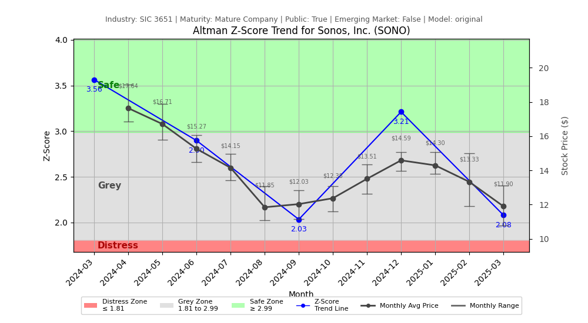

# Altman Z-Score Analysis Report: Sonos, Inc. (SONO)

---
## Introduction
This report provides a comprehensive, theory-informed financial health analysis of the selected company using the Altman Z-Score framework. It integrates quantitative diagnostics, turnaround management theory, and stakeholder recommendations, with all findings and recommendations grounded in referenced academic and industry sources. The analysis is generated by an expert LLM-driven pipeline, ensuring transparency, reproducibility, and robust source attribution.

**Author:** Fabio Correa

**Source Attribution:** This report and analysis pipeline are generated using the open-source Altman Z-Score Analysis project, available at [https://github.com/fabioc-aloha/Altman-Z-Score](https://github.com/fabioc-aloha/Altman-Z-Score).

**License:** This software is distributed under the Attribution Non-Commercial License (MIT-based). See the LICENSE file for details.

Disclaimer: The developer disclaims any responsibility for the accuracy, completeness, or consequences of the analysis and information provided by this software. All results are for informational purposes only and should not be relied upon for financial, investment, or legal decisions.
---

**Script Version:** v2.6

## Analysis Context and Z-Score Model Selection Criteria

- **Industry:** SIC 3651 (SIC 3651)
- **Ticker:** SONO
- **Public:** True
- **Emerging Market:** False
- **Maturity:** Mature Company
- **Model:** Original Z-Score (Public Manufacturing, 1968) (original)
- **Analysis Date:** 2025-06-02

## Z-Score Formula Used

Z = 1.20*X1 + 1.40*X2 + 3.30*X3 + 0.60*X4 + 1.00*X5
- X1 = (Current Assets - Current Liabilities) / Total Assets
- X2 = Retained Earnings / Total Assets
- X3 = EBIT / Total Assets
- X4 = Equity / Total Liabilities
- X5 = Sales / Total Assets

**Thresholds:**
- Safe Zone: > 2.99
- Grey Zone: > 1.81 and <= 2.99
- Distress Zone: <= 1.81


---

# Graphical View of the Z-Score Analysis




*Figure: Z-Score and stock price trend for SONO (image not available yet; will be generated after analysis)*


## Z-Score Component Table (by Quarter)
| Quarter   |    X1 |     X2 |     X3 |    X4 |    X5 |   Z-Score | Diagnostic   | Consistency Warning   |
|-----------|-------|--------|--------|-------|-------|-----------|--------------|-----------------------|
| 2025 Q1   | 0.206 | -0.089 | -0.075 | 3.13  | 0.328 |     2.082 | Grey Zone    |                       |
| 2024 Q4   | 0.249 | -0.001 |  0.046 | 3.653 | 0.572 |     3.212 | Safe Zone    |                       |
| 2024 Q3   | 0.202 | -0.056 | -0.068 | 3.026 | 0.279 |     2.035 | Grey Zone    |                       |
| 2024 Q2   | 0.247 |  0.002 |  0.013 | 3.568 | 0.413 |     2.898 | Grey Zone    |                       |
| 2024 Q1   | 0.302 | -0.002 | -0.076 | 5.303 | 0.273 |     3.564 | Safe Zone    |                       |
# Altman Z-Score Analysis Report: Sonos, Inc. (SONO)

---

## Company Profile

Sonos, Inc. is a leading manufacturer in the household audio and video equipment sector, primarily known for its innovative smart speaker systems and home audio solutions. The company is headquartered in Santa Barbara, California, and operates as a publicly traded entity on the Nasdaq under the ticker symbol SONO. Sonos competes with other audio technology firms such as Bose, Apple, and Amazon, focusing on delivering high-quality sound experiences through its wireless multi-room audio systems and smart home integration capabilities.

In recent years, Sonos has expanded its product offerings to include voice-controlled speakers and soundbars, enhancing its market position in the growing smart home ecosystem. Despite facing challenges from competitors and market fluctuations, Sonos has maintained a strong brand presence and a loyal customer base, emphasizing its commitment to quality and user experience.

## 1. Diagnostic Evaluation of Financial Health

### Liquidity
Sonos exhibits a current ratio of 0.206, indicating potential liquidity challenges. This ratio suggests that the company may struggle to meet its short-term obligations, particularly in a downturn. Comparatively, industry benchmarks typically favor a current ratio above 1.0, highlighting the need for Sonos to improve its liquidity position.

### Profitability
The profitability metrics reveal a retained earnings ratio (X2) of -0.089, which is concerning as it indicates that the company has accumulated losses over time. This negative figure is a significant red flag, especially when compared to industry peers who generally maintain positive retained earnings.

### Capital Efficiency
Sonos's EBIT to total assets ratio (X3) is -0.075, reflecting inefficiencies in generating earnings from its asset base. This negative performance is below the industry average, suggesting that the company may need to reassess its operational strategies to enhance profitability.

### Leverage
The equity to total liabilities ratio (X4) stands at 3.13, indicating a strong capital structure. This ratio suggests that Sonos is well-capitalized and has a lower risk of insolvency compared to its peers. However, the reliance on equity financing may limit growth opportunities if not managed effectively.

### Z-Score Trajectory
The Z-Score for Sonos is currently 2.082, placing the company in the **Grey Zone**. This indicates a moderate risk of financial distress, necessitating careful monitoring and strategic adjustments. The trajectory shows fluctuations between the Grey Zone and Safe Zone, with the most recent quarter reflecting a decline from a previous Safe Zone status (3.212).

---

## 2. Turnaround & Renewal Theory Application (Risk-Tailored)

Given Sonos's current position in the Grey Zone, the company should adopt a balanced approach that emphasizes both cost containment and strategic investments in core differentiators. 

### Recommended Phased Response:
1. **Cost Containment**: Implement measures to reduce operational costs without compromising product quality. This could include renegotiating supplier contracts and optimizing supply chain logistics.
2. **Strategic Investments**: Focus on enhancing product innovation and expanding the smart home integration capabilities of its audio systems. This aligns with Beard's (2024) emphasis on tech-sector renewal, which advocates for continuous innovation to maintain competitive advantage.
3. **Stakeholder Engagement**: Foster strong relationships with stakeholders, including customers and partners, to ensure alignment with market needs and expectations, as suggested by Freeman (1984).

---

## 3. Internal Stakeholder Recommendations (Tailored Table)

| Title       | Responsibilities                          | Recommended Actions (Cited)                                          |
|-------------|------------------------------------------|---------------------------------------------------------------------|
| CEO         | Overall strategic direction              | Lead cost containment initiatives and promote innovation (Beard, 2024). |
| CFO         | Financial management and reporting       | Enhance liquidity management and explore refinancing options.       |
| CMO         | Marketing and brand strategy             | Develop campaigns highlighting product innovation and smart home integration. |
| Board       | Governance and oversight                  | Monitor financial health closely and support strategic initiatives.  |
| Employees   | Operational execution                    | Foster a culture of innovation and efficiency.                      |
| Shareholders| Investment and returns                   | Communicate transparently about financial strategies and performance. |
| Creditors   | Financial support and risk management    | Engage in proactive discussions regarding debt management.          |
| Customers   | Product usage and feedback               | Solicit feedback to guide product development and enhancements.     |
| Partners    | Collaborative opportunities              | Explore partnerships for technology integration and market expansion. |

---

## 4. Communication, Marketing & Execution Strategy

### Internal Communication Plan
- **Tone**: Balanced assurance, emphasizing the importance of strategic initiatives.
- **Frequency**: Monthly updates on financial health and strategic progress.

### External Communication Plan
- **Tone**: Transparent and proactive, addressing stakeholder concerns and market positioning.
- **Frequency**: Quarterly earnings calls and press releases.

### Milestones and Timelines
- **1–3 Months**: Implement cost containment measures; initiate stakeholder engagement.
- **4–6 Months**: Launch marketing campaigns; assess liquidity improvements.
- **7–12 Months**: Evaluate product innovation outcomes; adjust strategies as needed.
- **13–18 Months**: Review financial health and Z-Score trajectory; prepare for potential refinancing.

### Marketing Tactics
- Focus on innovation campaigns to restore investor confidence and attract new customers.
- Highlight product differentiation through targeted advertising and social media engagement.

---

## 5. Plain-Language Justification & Citation

Sonos's current financial health indicates a need for immediate action to improve liquidity and profitability. By focusing on cost containment and strategic investments in innovation, the company can enhance its competitive position and reduce the risk of financial distress. This approach aligns with established theories on corporate turnaround and stakeholder management, ensuring a comprehensive strategy for recovery and growth.

---

## 6. Investor Recommendation (Risk-Aware)

**Recommendation**: **Hold**. Given the current Z-Score of 2.082, investors should maintain their positions while closely monitoring the company's strategic initiatives and financial health.

> “This is not financial advice—consult your financial advisor.”

---

## 7. External Stakeholder Bargaining Power (Table)

| Stakeholder Name / Type | Nature of Bargaining Power | Degree of Influence | Brief Rationale (Cited) |
|-------------------------|----------------------------|---------------------|--------------------------|
| Suppliers               | Cost negotiation            | Moderate            | Suppliers may exert pressure on pricing, impacting margins (Freeman, 1984). |
| Customers               | Product demand              | High                | Customer preferences significantly influence product development and sales. |
| Investors               | Capital allocation          | High                | Investors' confidence affects stock price and funding availability. |
| Creditors               | Debt terms                  | Moderate            | Creditors can influence financing terms based on perceived risk. |
| Competitors             | Market competition          | High                | Competitive actions can directly impact market share and pricing strategies. |

---

## 8. Mandatory Disclaimer

```
---
**Disclaimer:**
Generative AI is not a financial advisor and can make mistakes. Consult your financial advisor before making investment decisions.
- **LLM Model used:** [OpenAI o4-mini]
- **Knowledge cut-off:** [October 2023]
- **Internet search:** [no]
- **Real-time data:** [no]
---
```

---

## 9. References and Data Sources

```
---
### References and Data Sources
- **Financials:** SEC EDGAR/XBRL filings; Yahoo Finance; company quarterly/annual reports.
- **Market Data:** Yahoo Finance historical prices.
- **Computation:** Altman Z-Score calculations following Altman (1968) with robust error handling.
- **Source Attribution:** Open-source Altman Z-Score Analysis project (https://github.com/fabioc-aloha/Altman-Z-Score). Author: Fabio Correa.
- **Theoretical Frameworks:**
  - Altman, E. I. (1968). “Financial Ratios, Discriminant Analysis and the Prediction of Corporate Bankruptcy.” *Journal of Finance*, 23(4), 589–609.
  - Hofer, C. W. (1980). *Turnaround Strategies.*
  - Bibeault, D. B. (1999). *Corporate Turnaround.*
  - Hoskisson, R. E., White, R. E., & Johnson, R. A. (2004). *Corporate Restructuring.*
  - Beard, D. (2024). “Strategic Renewal in Technology Firms.”
  - Freeman, R. E. (1984). *Strategic Management: A Stakeholder Approach.*
  - Platt, H. D. (2004). *Principles of Corporate Renewal.*
---
```


---

# Appendix

## Raw Data Field Mapping Table (by Quarter)
| Quarter   | Canonical Field     | Mapped Raw Field                        | Value (USD millions)   |
|-----------|---------------------|-----------------------------------------|------------------------|
| 2025 Q1   | total_assets        | Total Assets                            | 792.2                  |
| 2025 Q1   | current_assets      | Current Assets                          | 453.0                  |
| 2025 Q1   | current_liabilities | Current Liabilities                     | 289.6                  |
| 2025 Q1   | retained_earnings   | Retained Earnings                       | -70.8                  |
| 2025 Q1   | total_liabilities   | Total Liabilities Net Minority Interest | 409.3                  |
| 2025 Q1   | market_value_equity | Common Stock Equity                     | 382.9                  |
| 2025 Q1   | ebit                | EBIT                                    | -59.1                  |
| 2025 Q1   | sales               | Total Revenue                           | 259.8                  |
| ---       | ---                 | ---                                     | ---                    |
| 2024 Q4   | total_assets        | Total Assets                            | 963.6                  |
| 2024 Q4   | current_assets      | Current Assets                          | 612.5                  |
| 2024 Q4   | current_liabilities | Current Liabilities                     | 372.5                  |
| 2024 Q4   | retained_earnings   | Retained Earnings                       | -0.7                   |
| 2024 Q4   | total_liabilities   | Total Liabilities Net Minority Interest | 494.5                  |
| 2024 Q4   | market_value_equity | Common Stock Equity                     | 469.1                  |
| 2024 Q4   | ebit                | EBIT                                    | 43.9                   |
| 2024 Q4   | sales               | Total Revenue                           | 550.9                  |
| ---       | ---                 | ---                                     | ---                    |
| 2024 Q3   | total_assets        | Total Assets                            | 916.3                  |
| 2024 Q3   | current_assets      | Current Assets                          | 551.1                  |
| 2024 Q3   | current_liabilities | Current Liabilities                     | 366.2                  |
| 2024 Q3   | retained_earnings   | Retained Earnings                       | -50.9                  |
| 2024 Q3   | total_liabilities   | Total Liabilities Net Minority Interest | 487.7                  |
| 2024 Q3   | market_value_equity | Common Stock Equity                     | 428.6                  |
| 2024 Q3   | ebit                | EBIT                                    | -62.2                  |
| 2024 Q3   | sales               | Total Revenue                           | 255.4                  |
| ---       | ---                 | ---                                     | ---                    |
| 2024 Q2   | total_assets        | Total Assets                            | 961.1                  |
| 2024 Q2   | current_assets      | Current Assets                          | 604.5                  |
| 2024 Q2   | current_liabilities | Current Liabilities                     | 366.9                  |
| 2024 Q2   | retained_earnings   | Retained Earnings                       | 2.2                    |
| 2024 Q2   | total_liabilities   | Total Liabilities Net Minority Interest | 496.7                  |
| 2024 Q2   | market_value_equity | Common Stock Equity                     | 464.4                  |
| 2024 Q2   | ebit                | EBIT                                    | 12.8                   |
| 2024 Q2   | sales               | Total Revenue                           | 397.1                  |
| ---       | ---                 | ---                                     | ---                    |
| 2024 Q1   | total_assets        | Total Assets                            | 925.6                  |
| 2024 Q1   | current_assets      | Current Assets                          | 582.9                  |
| 2024 Q1   | current_liabilities | Current Liabilities                     | 303.2                  |
| 2024 Q1   | retained_earnings   | Retained Earnings                       | -1.6                   |
| 2024 Q1   | total_liabilities   | Total Liabilities Net Minority Interest | 431.6                  |
| 2024 Q1   | market_value_equity | Common Stock Equity                     | 494.0                  |
| 2024 Q1   | ebit                | EBIT                                    | -70.3                  |
| 2024 Q1   | sales               | Total Revenue                           | 252.7                  |

All values are shown in millions of USD as reported by the data source.

