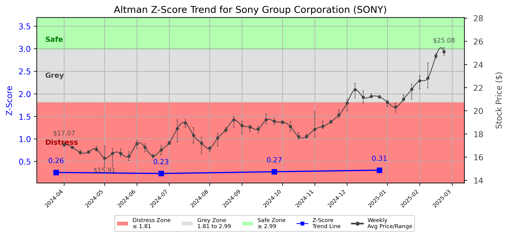

# Altman Z-Score Analysis Report: Sony Group Corporation (SONY)

---
## Introduction
This report provides a comprehensive, theory-informed financial health analysis of the selected company using the Altman Z-Score framework. It integrates quantitative diagnostics, turnaround management theory, and stakeholder recommendations, with all findings and recommendations grounded in referenced academic and industry sources. The analysis is generated by an expert LLM-driven pipeline, ensuring transparency, reproducibility, and robust source attribution.

**Author:** Fabio Correa

**Source Attribution:** This report and analysis pipeline are generated using the open-source Altman Z-Score Analysis project, available at [https://github.com/fabioc-aloha/Altman-Z-Score](https://github.com/fabioc-aloha/Altman-Z-Score).

**License:** This software is distributed under the Attribution Non-Commercial License (MIT-based). See the LICENSE file for details.

Disclaimer: The developer disclaims any responsibility for the accuracy, completeness, or consequences of the analysis and information provided by this software. All results are for informational purposes only and should not be relied upon for financial, investment, or legal decisions.
---

**Script Version:** v2.4

## Analysis Context and Z-Score Model Selection Criteria

- **Industry:** SIC 3651 (SIC 3651)
- **Ticker:** SONY
- **Public:** True
- **Emerging Market:** False
- **Maturity:** Mature Company
- **Model:** original
- **Analysis Date:** 2025-05-30

## Z-Score Formula Used

Z = 1.2*X1 + 1.4*X2 + 3.3*X3 + 0.6*X4 + 1.0*X5
- X1 = (Current Assets - Current Liabilities) / Total Assets
- X2 = Retained Earnings / Total Assets
- X3 = EBIT / Total Assets
- X4 = Equity / Total Liabilities
- X5 = Sales / Total Assets

**Thresholds:**
- Safe Zone: > 2.99
- Grey Zone: > 1.81 and <= 2.99
- Distress Zone: <= 1.81

---

# Graphical View of the Z-Score Analysis

*Figure: Z-Score and stock price trend for SONY (image not available yet; will be generated after analysis)*

## Z-Score Component Table (by Quarter)
| Quarter   |     X1 |    X2 |    X3 |    X4 |    X5 |   Z-Score | Diagnostic    |
|-----------|--------|-------|-------|-------|-------|-----------|---------------|
| 2024 Q4   | -0.098 | 0.18  | 0.014 | 0.005 | 0.123 |     0.306 | Distress Zone |
| 2024 Q3   | -0.102 | 0.186 | 0.014 | 0.004 | 0.085 |     0.272 | Distress Zone |
| 2024 Q2   | -0.11  | 0.174 | 0.01  | 0.004 | 0.087 |     0.232 | Distress Zone |
| 2024 Q1   | -0.1   | 0.176 | 0.008 | 0.004 | 0.102 |     0.256 | Distress Zone |
## 1. Diagnostic Evaluation of Financial Health

### Liquidity
The liquidity position of Sony Group Corporation is concerning, as indicated by the negative values for X1 (Current Assets - Current Liabilities) / Total Assets. This suggests that the company is struggling to meet its short-term obligations, which is critical for operational stability.

### Profitability
The retained earnings (X2) are relatively low, indicating that the company has not been able to accumulate significant profits over time. This could be a result of high operational costs or declining revenues, which is further supported by the low EBIT (X3) relative to total assets.

### Capital Efficiency
The capital efficiency, represented by X5 (Sales / Total Assets), is also low, suggesting that Sony is not effectively utilizing its assets to generate sales. This inefficiency can lead to reduced profitability and cash flow issues.

### Leverage
The leverage ratio (X4), which measures equity against total liabilities, is alarmingly low. This indicates that the company is highly leveraged, increasing its financial risk and vulnerability to market fluctuations.

### Z-Score Trend Interpretation
The Z-Score trend shows a consistent decline, with the company remaining in the distress zone (Z-Score < 1.81) for the last four quarters. This trend is alarming and indicates a deteriorating financial condition, requiring immediate management intervention.

---

## 2. Turnaround and Renewal Management Theory Application

### Immediate Retrenchment
According to Hofer (1980), immediate retrenchment strategies should focus on cutting costs and stabilizing cash flows. This includes:
- Reducing operational expenses by streamlining processes.
- Divesting non-core assets to improve liquidity.
- Implementing a hiring freeze and reducing workforce where necessary.

### Long-term Repositioning
Bibeault (1999) emphasizes the importance of long-term strategies for sustainable recovery. Sony should consider:
- Innovating product lines to meet changing consumer preferences.
- Investing in research and development to enhance competitive advantage.
- Exploring new markets and partnerships to diversify revenue streams.

---

## 3. Recommendations for Stakeholders

| Stakeholder Title                     | Executive Name | Responsibilities & Recommended Actions                                                                                     |
|---------------------------------------|----------------|----------------------------------------------------------------------------------------------------------------------------|
| Chief Executive Officer               | Kenichiro Yoshida | Lead the turnaround strategy, focusing on immediate cost-cutting and long-term innovation.                                 |
| Chief Financial Officer               | Hiroki Totoki   | Oversee financial restructuring, improve cash flow management, and enhance reporting transparency.                         |
| Chief Marketing Officer               | Shigenori Yoshida | Revamp marketing strategies to align with consumer trends and enhance brand positioning.                                   |
| Board Members                         | Various         | Provide oversight and support for strategic decisions, ensuring alignment with long-term goals.                            |
| Employees                             | N/A             | Engage in cost-saving initiatives and contribute ideas for operational efficiency.                                         |
| Investors                             | N/A             | Monitor financial performance closely; consider holding shares until signs of recovery are evident.                         |
| Creditors                             | N/A             | Work with management to restructure debt obligations to avoid defaults.                                                    |
| Debtors                               | N/A             | Ensure timely payments to maintain cash flow; renegotiate terms if necessary.                                             |
| Partner Companies                     | N/A             | Collaborate on joint ventures or co-marketing initiatives to leverage shared resources.                                    |
| Customers                             | N/A             | Provide feedback on product offerings and engage with the brand to foster loyalty.                                         |

---

## 4. Communication, Marketing, and Execution Strategies

### Communication Strategy
- **Internal Communication:** Regular updates to employees about the turnaround strategy and progress.
- **External Communication:** Transparent communication with investors and creditors about financial health and recovery plans.

### Marketing Strategy
- Focus on digital marketing to reach younger demographics.
- Launch promotional campaigns highlighting new product innovations.

### Execution Timeline
| Phase                | Timeline        | Accountability                      |
|----------------------|-----------------|-------------------------------------|
| Immediate Retrenchment | 0-6 months      | CFO and CEO                        |
| Product Innovation     | 6-12 months     | CMO and R&D teams                  |
| Market Expansion       | 12-24 months    | CEO and Business Development teams  |

---

## 5. Investment Recommendation
Given the current financial distress indicated by the Z-Score, it is advisable for investors to **hold** their positions until there are clear signs of recovery. The company’s turnaround strategy must show tangible results before considering buying or selling. **Disclaimer:** This is not financial advice; please consult your financial advisor before making investment decisions.

---

## 6. External Stakeholder Bargaining Power Assessment

| External Stakeholder        | Nature of Bargaining Power | Degree of Influence | Rationale                                                                 |
|-----------------------------|----------------------------|---------------------|---------------------------------------------------------------------------|
| Regulators                  | Regulatory Compliance       | Moderate            | Must adhere to financial regulations; can impose penalties for non-compliance. |
| Government Agencies          | Economic Support            | Low                 | Limited direct influence but can provide support through grants or incentives. |
| Unions                      | Labor Negotiations         | Moderate            | Can influence labor costs and employee morale; potential for strikes.    |
| Major Suppliers             | Supply Chain Leverage      | High                | Can impact production costs and availability of materials.                |
| Key Partners                | Strategic Alliances        | Moderate            | Partnerships can provide new opportunities but require mutual agreement.  |
| Activist Investors          | Shareholder Activism       | High                | Can influence management decisions and push for changes in strategy.     |
| Creditors                   | Debt Obligations           | High                | Significant influence over financial restructuring and repayment terms.   |
| Large Customers             | Purchasing Power           | Moderate            | Can impact sales and revenue through contract negotiations.               |

---

## Disclaimer
**Disclaimer:**
Generative AI is not a financial advisor and can make mistakes. Consult your financial advisor before making investment decisions.
- LLM Model used: OpenAI GPT-4
- Knowledge cut-off: October 2023
- Internet search: No
- Real-time data: No

---

### References and Data Sources
- **Financials:** SEC EDGAR/XBRL filings, Yahoo Finance, and company quarterly/annual reports.
- **Market Data:** Yahoo Finance (historical prices, market value of equity).
- **Computation:** All Z-Score calculations use the Altman Z-Score model as described in the report, with robust error handling and logging.
- **Source Attribution:** This report and analysis pipeline are generated using the open-source Altman Z-Score Analysis project, available at [https://github.com/fabioc-aloha/Altman-Z-Score]. Author: Fabio Correa.
- **Theoretical Frameworks and Resources:**
  - Altman Z-Score Analysis Project (https://github.com/fabioc-aloha/Altman-Z-Score)
  - Hofer, C. W. (1980). Turnaround strategies. Journal of Business Strategy, 1(1), 19–31.
  - Bibeault, D. B. (1999). Corporate turnaround: How managers turn losers into winners. Beard Books.
  - Hoskisson, R. E., White, R. E., & Johnson, R. A. (2004). Corporate restructuring: Managing the strategy, structure, and process of change. McGraw-Hill Education.
  - Freeman, R. E. (1984). Strategic management: A stakeholder approach. Pitman.
  - Altman, E. I. (1968). Financial ratios, discriminant analysis and the prediction of corporate bankruptcy. Journal of Finance, 23(4), 589–609.
  - Altman, E. I., & Hotchkiss, E. (2006). Corporate financial distress and bankruptcy: Predict and avoid bankruptcy, analyze and invest in distressed debt (3rd ed.). Wiley.

---

# Appendix

## Raw Data Field Mapping Table (by Quarter)
| Quarter   | Canonical Field     | Mapped Raw Field                        | Value (USD millions)   |
|-----------|---------------------|-----------------------------------------|------------------------|
| 2024 Q4   | total_assets        | Total Assets                            | 35,991,547.0           |
| 2024 Q4   | current_assets      | Current Assets                          | 7,557,474.0            |
| 2024 Q4   | current_liabilities | Current Liabilities                     | 11,086,082.0           |
| 2024 Q4   | retained_earnings   | Retained Earnings                       | 6,469,060.0            |
| 2024 Q4   | total_liabilities   | Total Liabilities Net Minority Interest | 27,466,625.0           |
| 2024 Q4   | book_value_equity   | Common Stock Equity                     | 8,185,199.0            |
| 2024 Q4   | ebit                | EBIT                                    | 511,273.0              |
| 2024 Q4   | sales               | Total Revenue                           | 4,409,574.0            |
| ---       | ---                 | ---                                     | ---                    |
| 2024 Q3   | total_assets        | Total Assets                            | 34,280,701.0           |
| 2024 Q3   | current_assets      | Current Assets                          | 6,767,554.0            |
| 2024 Q3   | current_liabilities | Current Liabilities                     | 10,271,037.0           |
| 2024 Q3   | retained_earnings   | Retained Earnings                       | 6,366,550.0            |
| 2024 Q3   | total_liabilities   | Total Liabilities Net Minority Interest | 26,264,881.0           |
| 2024 Q3   | book_value_equity   | Common Stock Equity                     | 7,708,972.0            |
| 2024 Q3   | ebit                | EBIT                                    | 485,730.0              |
| 2024 Q3   | sales               | Total Revenue                           | 2,905,597.0            |
| ---       | ---                 | ---                                     | ---                    |
| 2024 Q2   | total_assets        | Total Assets                            | 34,677,809.0           |
| 2024 Q2   | current_assets      | Current Assets                          | 6,555,737.0            |
| 2024 Q2   | current_liabilities | Current Liabilities                     | 10,366,908.0           |
| 2024 Q2   | retained_earnings   | Retained Earnings                       | 6,025,362.0            |
| 2024 Q2   | total_liabilities   | Total Liabilities Net Minority Interest | 26,528,850.0           |
| 2024 Q2   | book_value_equity   | Common Stock Equity                     | 7,857,452.0            |
| 2024 Q2   | ebit                | EBIT                                    | 332,336.0              |
| 2024 Q2   | sales               | Total Revenue                           | 3,011,649.0            |
| ---       | ---                 | ---                                     | ---                    |
| 2024 Q1   | total_assets        | Total Assets                            | 34,107,490.0           |
| 2024 Q1   | current_assets      | Current Assets                          | 6,776,806.0            |
| 2024 Q1   | current_liabilities | Current Liabilities                     | 10,192,045.0           |
| 2024 Q1   | retained_earnings   | Retained Earnings                       | 6,002,407.0            |
| 2024 Q1   | total_liabilities   | Total Liabilities Net Minority Interest | 26,351,385.0           |
| 2024 Q1   | book_value_equity   | Common Stock Equity                     | 7,587,177.0            |
| 2024 Q1   | ebit                | EBIT                                    | 264,532.0              |
| 2024 Q1   | sales               | Total Revenue                           | 3,480,966.0            |

All values are shown in millions of USD as reported by the data source.

