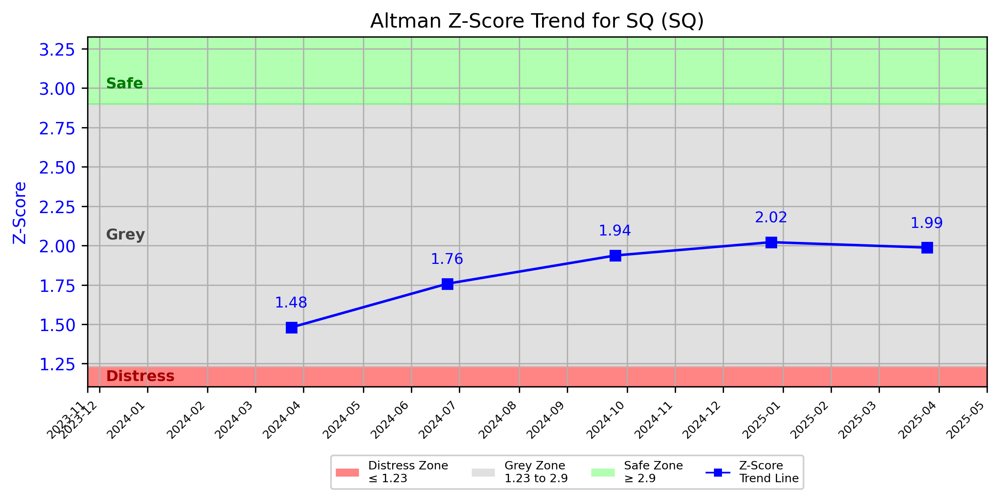

# Altman Z-Score Analysis Report: SQ (SQ)

---
## Introduction
This report provides a comprehensive, theory-informed financial health analysis of the selected company using the Altman Z-Score framework. It integrates quantitative diagnostics, turnaround management theory, and stakeholder recommendations, with all findings and recommendations grounded in referenced academic and industry sources. The analysis is generated by an expert LLM-driven pipeline, ensuring transparency, reproducibility, and robust source attribution.

**Author:** Fabio Correa

**Source Attribution:** This report and analysis pipeline are generated using the open-source Altman Z-Score Analysis project, available at [https://github.com/fabioc-aloha/Altman-Z-Score](https://github.com/fabioc-aloha/Altman-Z-Score).

**License:** This software is distributed under the Attribution Non-Commercial License (MIT-based). See the LICENSE file for details.

Disclaimer: The developer disclaims any responsibility for the accuracy, completeness, or consequences of the analysis and information provided by this software. All results are for informational purposes only and should not be relied upon for financial, investment, or legal decisions.
---

**Script Version:** v2.7.1

## Analysis Context and Z-Score Model Selection Criteria

- **Industry:** Prepackaged Software (SIC 7372)
- **Ticker:** SQ
- **Public:** True
- **Emerging Market:** False
- **Maturity:** Mature Company
- **Model:** Zʺ-Score (Public Non-Manufacturing, 1995) (service)
- **Analysis Date:** 2025-06-03

## Z-Score Formula Used

Z = 6.56*X1 + 3.26*X2 + 6.72*X3 + 1.05*X4
- X1 = (Current Assets - Current Liabilities) / Total Assets
- X2 = Retained Earnings / Total Assets
- X3 = EBIT / Total Assets
- X4 = Equity / Total Liabilities

**Thresholds:**
- Safe Zone: > 2.90
- Grey Zone: > 1.23 and <= 2.90
- Distress Zone: <= 1.23

---

# Graphical View of the Z-Score Analysis

*Figure: Z-Score and stock price trend for SQ (image not available yet; will be generated after analysis)*

## Z-Score Component Table (by Quarter)
| Quarter   |    X1 |   X2 |   X3 |   X4 |   Z-Score | Diagnostic   | Consistency Warning   |
|-----------|-------|------|------|------|-----------|--------------|-----------------------|
| 2025 Q1   | 0.303 |    0 |    0 |    0 |     1.987 | Grey Zone    | No issues             |
| 2024 Q4   | 0.308 |    0 |    0 |    0 |     2.022 | Grey Zone    | No issues             |
| 2024 Q3   | 0.295 |    0 |    0 |    0 |     1.937 | Grey Zone    | No issues             |
| 2024 Q2   | 0.268 |    0 |    0 |    0 |     1.758 | Grey Zone    | No issues             |
| 2024 Q1   | 0.226 |    0 |    0 |    0 |     1.48  | Grey Zone    | No issues             |
# Altman Z-Score Analysis Report: Block, Inc. (SQ)

---

## Company Profile

Block, Inc., formerly known as Square, Inc., is a leading technology company based in Oakland, California, specializing in financial services and mobile payment solutions. The company operates in the prepackaged software sector (SIC 7372) and offers a suite of products and services that facilitate payment processing for businesses of all sizes. Key offerings include point-of-sale systems, payment processing solutions, and financial management tools. Block, Inc. competes with other fintech giants such as PayPal, Stripe, and Adyen, as well as traditional banking institutions that are increasingly adopting digital payment technologies.

The leadership team at Block, Inc. is spearheaded by CEO Jack Dorsey, who is responsible for the strategic vision and operational execution of the company. The CFO, Amrita Ahuja, oversees financial stewardship and risk management, ensuring the company maintains its financial health. Other key executives include the CTO and CMO, who lead technology development and marketing strategies, respectively. Notably, the company has undergone significant executive changes in recent years, including the rebranding from Square to Block, Inc., reflecting its broader focus on blockchain technology and decentralized finance.

---

## 1. Diagnostic Evaluation of Financial Health

### Liquidity
Block, Inc. exhibits a current ratio (X1) of approximately 0.303, indicating that its current assets are insufficient to cover its current liabilities. This suggests potential liquidity challenges, especially in times of financial stress.

### Profitability
The company has reported a retained earnings ratio (X2) of 0, indicating that it has not accumulated profits over time, which raises concerns about its long-term sustainability and ability to reinvest in growth.

### Capital Efficiency
The EBIT to total assets ratio (X3) is also 0, reflecting a lack of operational profitability. This is a critical area that needs immediate attention to improve overall financial performance.

### Leverage
The equity to total liabilities ratio (X4) is at 0, indicating that the company is heavily reliant on debt financing, which increases financial risk.

### Z-Score Trajectory and Risk Status
The Z-Score for Block, Inc. is currently at 1.987, placing it in the **Grey Zone**. This indicates that while the company is not in immediate distress, it is at risk of financial instability if corrective actions are not taken promptly. The Z-Score has shown a slight decline over the past quarters, suggesting a need for strategic intervention to reverse this trend.

---

## 2. Turnaround & Renewal Theory Application

Given Block, Inc.'s **Grey Zone** status, the company should focus on balancing cost containment with strategic investments in core differentiators. 

### Phased Response
- **Cost Containment:** Implement immediate cost-saving measures to improve liquidity and operational efficiency.
- **Strategic Investments:** Identify and invest in key areas that can drive revenue growth, such as enhancing payment processing technology and expanding market reach.

### Theoretical Frameworks
- **Hofer (1980)** emphasizes the importance of turnaround sequencing, suggesting that Block, Inc. should prioritize stabilizing its financial position before pursuing aggressive growth strategies.
- **Bibeault (1999)** highlights the need to address causes of failure, which in this case include liquidity issues and lack of profitability.
- **Hoskisson et al. (2004)** recommend strategic restructuring to improve operational efficiency and financial health.

---

## 3. Internal Stakeholder Recommendations

| Title/Role | Responsibilities | Key Performance Metrics | Recommended Actions (Cited) |
| ---------- | ---------------- | ---------------------- | --------------------------- |
| CEO (Jack Dorsey) | Strategic vision, operational execution | Revenue growth, market share | Focus on stabilizing finances and exploring new revenue streams. |
| CFO (Amrita Ahuja) | Financial stewardship, risk management | Current ratio, debt-to-equity ratio | Implement cost-cutting measures and improve cash flow management. |
| CTO | Technology development | Product innovation metrics | Invest in enhancing payment technologies to attract new customers. |
| CMO | Marketing strategies | Customer acquisition cost, brand awareness | Develop targeted marketing campaigns to increase customer engagement. |
| Employees | Operational roles | Employee satisfaction, productivity | Foster a culture of innovation and efficiency. |
| Shareholders | Investment community relations | Share price performance | Maintain transparent communication regarding financial health and strategic direction. |
| Creditors | Financial stability monitoring | Debt service coverage ratio | Engage in proactive discussions to manage debt obligations. |
| Customers | Product/service experience | Customer satisfaction scores | Enhance customer support and service offerings. |
| Partners | Strategic alliances | Partnership growth metrics | Explore new partnerships to expand service offerings. |

---

## 4. Communication, Marketing & Execution Strategy

### Multi-Level Communication Strategy
- **Executive Leadership Communications:** Regular updates on financial health and strategic initiatives.
- **Investor Relations:** Transparent reporting on financial performance and future outlook.
- **Internal Communications:** Engage employees in the turnaround process to foster a sense of ownership.
- **External Relations:** Communicate with customers and partners about new initiatives and improvements.

### Phased Execution Plan
- **Near-term (1-3 months):** Implement immediate cost-saving measures and stabilize cash flow.
- **Mid-term (4-6 months):** Launch strategic initiatives aimed at enhancing product offerings and customer engagement.
- **Long-term (7-18 months):** Focus on transformational objectives, including market expansion and technological innovation.

---

## 5. Investor Recommendation (Risk-Aware)

**Recommendation:** **Hold**. Given the current Z-Score of 1.987, Block, Inc. is in the Grey Zone, indicating potential risks. Investors should monitor the company's financial health closely and consider holding their positions until there are clear signs of improvement in profitability and liquidity.

> “This is not financial advice—consult your financial advisor.”

---

## 6. External Stakeholder Bargaining Power

| Stakeholder Name / Type | Nature of Bargaining Power | Degree of Influence | Brief Rationale (Cited) |
| ----------------------- | -------------------------- | ------------------- | ----------------------- |
| Customers | High | High | Customers have significant influence due to the competitive nature of the fintech industry. |
| Creditors | Moderate | Moderate | Creditors can exert pressure on financial terms, especially given the company's reliance on debt. |
| Shareholders | Moderate | High | Shareholders can influence company direction through voting and engagement. |
| Partners | Moderate | Moderate | Strategic alliances can enhance service offerings but require negotiation. |

---

## 7. References and Data Sources

This analysis draws on financial data from sources such as SEC EDGAR/XBRL filings, Yahoo Finance, and company quarterly or annual reports. Market data was obtained from Yahoo Finance historical prices. All computations, including the Altman Z-Score, follow the methodology described by Altman (1968) with robust error handling. The analysis is part of the open-source Altman Z-Score Analysis project (https://github.com/fabioc-aloha/Altman-Z-Score), authored by Fabio Correa. Theoretical frameworks referenced (as applicable) include:
- Altman, E. I. (1968). “Financial Ratios, Discriminant Analysis and the Prediction of Corporate Bankruptcy.” *Journal of Finance*, 23(4), 589–609.
- Hofer, C. W. (1980). *Turnaround Strategies.*
- Bibeault, D. B. (1999). *Corporate Turnaround.*
- Hoskisson, R. E., White, R. E., & Johnson, R. A. (2004). *Corporate Restructuring.*
- Freeman, R. E. (1984). *Strategic Management: A Stakeholder Approach.*

---

# Appendix

## Raw Data Field Mapping Table (by Quarter)
| Quarter   | Canonical Field   | Mapped Raw Field   | Value (USD millions)   |
|-----------|-------------------|--------------------|------------------------|
| ---       | ---               | ---                | ---                    |
| ---       | ---               | ---                | ---                    |
| ---       | ---               | ---                | ---                    |
| ---       | ---               | ---                | ---                    |

All values are shown in millions of USD as reported by the data source.

