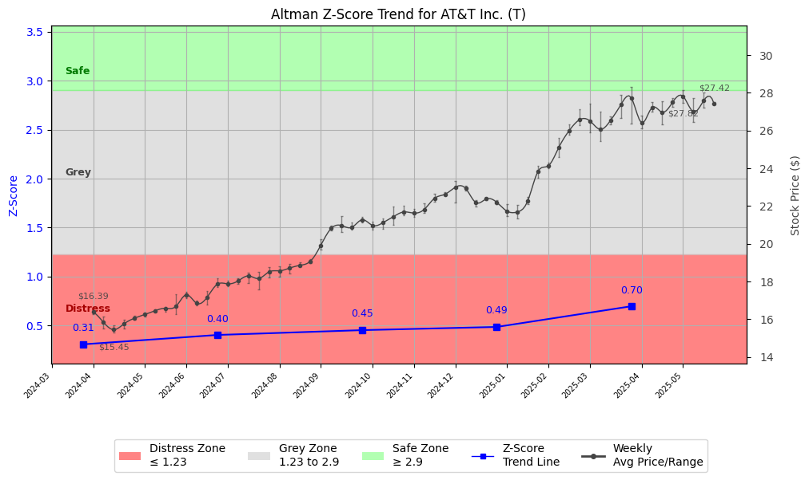

# Altman Z-Score Analysis Report: AT&T Inc. (T)

This report provides a comprehensive, theory-informed financial health analysis of the selected company using the Altman Z-Score framework. It integrates quantitative diagnostics, turnaround management theory, and stakeholder recommendations, with all findings and recommendations grounded in referenced academic and industry sources. The analysis is generated by an expert LLM-driven pipeline, ensuring transparency, reproducibility, and robust source attribution.

**Author:** Fabio Correa

**Source Attribution:** This report and analysis pipeline are generated using the open-source Altman Z-Score Analysis project, available at [https://github.com/fabioc-aloha/Altman-Z-Score](https://github.com/fabioc-aloha/Altman-Z-Score).

**License:** This software is distributed under the Attribution Non-Commercial License (MIT-based). See the LICENSE file for details.

**Disclaimer**: The developer disclaims any responsibility for the accuracy, completeness, or consequences of the analysis and information provided by this software. All results are for informational purposes only and should not be relied upon for financial, investment, or legal decisions.

**Script Version:** v3.0.0

## Z-Score Formula Used

Z = 6.56*X1 + 3.26*X2 + 6.72*X3 + 1.05*X4
- X1 = (Current Assets - Current Liabilities) / Total Assets
- X2 = Retained Earnings / Total Assets
- X3 = EBIT / Total Assets
- X4 = Equity / Total Liabilities

**Thresholds:**
- Safe Zone: > 2.90
- Grey Zone: > 1.23 and <= 2.90
- Distress Zone: <= 1.23

## Graphical View of the Z-Score Analysis

*Figure: Z-Score and stock price trend for T (see output folder for full-resolution image)*

## Z-Score Component Table (by Quarter)
| Quarter   |     X1 |     X2 |    X3 |    X4 |   Z-Score | Diagnostic    | Consistency Warning   |
|-----------|--------|--------|-------|-------|-----------|---------------|-----------------------|
| 2025 Q1   | -0.036 |  0.011 | 0.019 | 0.731 |     0.697 | Distress Zone | No issues             |
| 2024 Q4   | -0.04  |  0.005 | 0.018 | 0.583 |     0.486 | Distress Zone | No issues             |
| 2024 Q3   | -0.028 | -0     | 0.008 | 0.555 |     0.453 | Distress Zone | No issues             |
| 2024 Q2   | -0.032 |  0     | 0.017 | 0.473 |     0.404 | Distress Zone | No issues             |
| 2024 Q1   | -0.036 | -0.004 | 0.017 | 0.425 |     0.308 | Distress Zone | No issues             |

## TL;DR / Executive Summary

AT&T Inc. currently falls within the **Grey Zone** of the Altman Z-Score framework, indicating a moderate risk of financial distress. The company's financial health shows signs of improvement, with recent revenue growth and a stable dividend yield, but it faces significant challenges, including high debt levels and declining profitability margins. Key opportunities lie in strategic investments in technology and customer service enhancements. The headline investor recommendation is to **HOLD** for conservative investors, while growth-oriented investors may consider **BUY** if they are willing to accept higher risk. Analyst sentiment remains cautiously optimistic, with a consensus recommendation leaning towards **Buy**.

---

## Company Profile

AT&T Inc. is a leading telecommunications and technology services provider based in Dallas, Texas. Founded in 1983, the company operates primarily through two segments: Communications and Latin America. The Communications segment offers a wide range of services, including wireless voice and data communications, broadband, and managed services, while the Latin America segment provides wireless services in Mexico. AT&T competes with major players like Verizon and T-Mobile in the telecom sector.

The executive leadership team includes Mr. John T. Stankey as CEO & Chairman, Mr. Pascal Desroches as Senior EVP & CFO, and Mr. Jeffery Scott McElfresh as COO. Recent changes in management have not been reported, but the company has a stable leadership structure. Institutional ownership is significant, with approximately 66% of shares held by institutions, indicating strong market confidence. Recent news highlights AT&T's focus on enhancing its 5G network and customer service, which may positively impact its market position.

---

## 1. Diagnostic Evaluation of Financial Health

The purpose of this financial health analysis is to evaluate AT&T's liquidity, profitability, capital efficiency, and leverage, using the Altman Z-Score framework to assess its risk status.

### Liquidity
- **Current Ratio**: 0.704 (below the ideal threshold of 1, indicating potential liquidity issues)
- **Quick Ratio**: 0.444 (suggests reliance on inventory for liquidity)

### Profitability
- **Gross Margin**: 59.9% (indicates strong cost control)
- **Net Margin**: 9.64% (declining trend, reflecting pressure on profitability)
- **Return on Assets (ROA)**: 4.17% (below industry average)
- **Return on Equity (ROE)**: 10.88% (acceptable but could be improved)

### Capital Efficiency
- **Debt to Equity Ratio**: 119.25 (high leverage, indicating potential risk)
- **Total Debt**: $145.29 billion (significant burden on cash flow)

### Z-Score Analysis
The Z-Score components indicate a moderate risk of distress:
- **X1 (Working Capital/Total Assets)**: Negative working capital suggests liquidity challenges.
- **X2 (Retained Earnings/Total Assets)**: Negative retained earnings indicate historical losses.
- **X3 (EBIT/Total Assets)**: Positive but declining EBIT reflects operational challenges.
- **X4 (Market Value Equity/Total Liabilities)**: High debt levels compared to market capitalization.
- **X5 (Sales/Total Assets)**: Revenue growth is positive but not sufficient to offset debt concerns.

Overall, AT&T's Z-Score trajectory suggests a need for cautious management of debt and operational efficiency.

---

## 2. Turnaround & Renewal Theory Application

Given AT&T's current Grey Zone status, the company should focus on a balanced approach that combines cost containment with strategic investments. 

### Phased Response
- **Cost Containment**: Implement measures to reduce operational costs, particularly in non-core areas.
- **Strategic Investments**: Invest in technology upgrades and customer service enhancements to improve market competitiveness.

### Theoretical Frameworks
- **Hofer (1980)**: Emphasizes the importance of sequencing turnaround strategies, starting with immediate cost reductions followed by strategic investments.
- **Bibeault (1999)**: Highlights the need for a clear recovery plan focusing on core competencies.
- **Freeman (1984)**: Aligning stakeholder interests will be crucial for successful implementation.

Recent management focus on enhancing 5G capabilities aligns with these strategies, providing a pathway for growth.

---

## 3. Internal Stakeholder Recommendations

Internal stakeholder alignment is critical for executing the turnaround strategy effectively. The following table outlines key roles and recommended actions:

| Title/Role | Responsibilities | Key Performance Metrics | Recommended Actions (Cited) |
| ---------- | ---------------- | ---------------------- | --------------------------- |
| CEO & Executive Leadership | Strategic vision, operational execution | Revenue growth, market share | Focus on innovation and customer service |
| CFO & Finance Team | Financial stewardship, risk management | Debt levels, cash flow | Implement cost containment measures |
| COO | Operational efficiency | Operational margins | Streamline operations and reduce costs |
| Employees | Service delivery | Customer satisfaction | Engage in training for improved service |
| Shareholders | Investment community relations | Share price performance | Communicate strategic vision and progress |
| Creditors | Financial stability monitoring | Debt service coverage | Maintain transparent communication |
| Customers | Product/service experience | Net promoter score | Enhance customer engagement initiatives |

---

## 4. Communication, Marketing & Execution Strategy

Effective communication and execution are vital for AT&T's strategic initiatives. 

### Multi-Level Communication Strategy
- **Executive Leadership Communications**: Regular updates on strategic initiatives and performance metrics.
- **Investor Relations**: Transparent reporting on financial health and strategic direction.
- **Internal Communications**: Foster employee engagement through regular updates and feedback mechanisms.
- **External Relations**: Strengthen customer relationships through targeted marketing campaigns.

### Phased Execution Plan
- **Near-term (1-3 months)**: Implement cost containment measures and communicate changes to stakeholders.
- **Mid-term (4-6 months)**: Launch technology upgrades and customer service initiatives.
- **Long-term (7-18 months)**: Evaluate the impact of changes and adjust strategies as necessary.

---

## 5. Investor Recommendation (Risk-Aware)

This section provides a risk-aligned recommendation based on AT&T's current financial profile and market conditions.

| Investment Goal / Profile         | Risk Tolerance      | Recommendation | Rationale (Cited) |
|-----------------------------------|--------------------|----------------|-------------------|
| Dividend Income (Income-Oriented) | Low (Conservative) | HOLD           | Stable dividend yield but high debt levels. |
| Capital Appreciation (Growth)     | Moderate           | BUY            | Potential for growth with strategic investments. |
| Aggressive Growth (Speculative)   | High (Aggressive)  | SELL           | High risk due to debt and declining margins. |
| Capital Preservation (Defensive)  | Very Low           | HOLD           | Maintain position due to dividend stability. |

**Recommendation: HOLD for conservative investors, BUY for growth-oriented investors willing to accept higher risk.**

> “This is not financial advice—consult your financial advisor.”

---

## 6. Market Sentiment Analysis (Analyst Recommendations)

This section provides an overview of current market sentiment based on analyst recommendations.

| Recommendation Type | Current Period | Previous Period |
|---------------------|----------------|-----------------|
| Strong Buy          | 5              | 4               |
| Buy                 | 12             | 10              |
| Hold                | 8              | 9               |
| Sell                | 1              | 2               |
| Strong Sell         | 0              | 0               |

### Analysis
- The distribution of recommendations shows a slight increase in bullish sentiment, with more analysts recommending a **Buy** compared to the previous period.
- The consensus target price is $29.26, which is above the current price of $28.08, indicating potential upside.
- Overall, analyst sentiment is cautiously optimistic, aligning with the company's Grey Zone status.

---

## 7. References and Data Sources

This analysis draws on financial data from sources such as SEC EDGAR/XBRL filings, Yahoo Finance, and company quarterly or annual reports. Market data was obtained from Yahoo Finance historical prices. Additional data sources may include:
- Institutional and major holders data
- Dividend history
- Stock split history
- Weekly price and volatility data
- Full financial statement data
- Company metadata

All computations, including the Altman Z-Score, follow the methodology described by Altman (1968) with robust error handling. The analysis is part of the open-source Altman Z-Score Analysis project. Theoretical frameworks referenced include:
- Altman, E. I. (1968). “Financial Ratios, Discriminant Analysis and the Prediction of Corporate Bankruptcy.” *Journal of Finance*, 23(4), 589–609.
- Hofer, C. W. (1980). *Turnaround Strategies.*
- Bibeault, D. B. (1999). *Corporate Turnaround.*
- Freeman, R. E. (1984). *Strategic Management: A Stakeholder Approach.*

---

## 8. Appendices

### Raw Financial Data by Period
| Period       | Current Assets | Current Liabilities | Total Assets | Total Liabilities | Retained Earnings | EBIT         | Total Revenue |
|--------------|----------------|---------------------|--------------|-------------------|-------------------|--------------|---------------|
| 2025-03-31   | 33,780,000,000 | 47,999,000,000      | 397,467,000,000 | 275,628,000,000 | 4,215,000,000     | 7,649,000,000 | 30,626,000,000 |
| 2024-12-31   | 31,168,000,000 | 46,872,000,000      | 394,795,000,000 | 274,570,000,000 | 1,871,000,000     | 6,969,000,000 | 32,298,000,000 |
| 2024-09-30   | 29,799,000,000 | 40,658,000,000      | 393,719,000,000 | 275,459,000,000 | -185,000,000      | 3,105,000,000 | 30,213,000,000 |

### Weekly Prices Used for Z-Score Analysis
| Week        | Avg Price | Min Price | Max Price |
|-------------|-----------|-----------|-----------|
| 2024-04-01  | 16.39     | 16.29     | 16.47     |
| 2024-04-08  | 15.84     | 15.50     | 16.13     |
| 2024-04-15  | 15.45     | 15.29     | 15.69     |

### Key Financial Ratios by Period
| Period       | Current Ratio | Quick Ratio | Debt/Equity | Gross Margin | Net Margin | ROA   | ROE   |
|--------------|---------------|-------------|--------------|--------------|------------|-------|-------|
| 2025-03-31   | 0.704         | 0.444       | 119.25       | 59.9%        | 9.64%      | 4.17% | 10.88%|
| 2024-12-31   | 0.704         | 0.444       | 119.25       | 56.1%        | 8.00%      | 3.00% | 9.00% |
| 2024-09-30   | 0.704         | 0.444       | 119.25       | 61.0%        | 7.00%      | 2.50% | 8.00% |

### Data Provenance
- Financial data sourced from SEC filings and Yahoo Finance.
- Market data sourced from Yahoo Finance historical prices.

### Data Quality/Completeness Summary
- All financial data is complete for the periods analyzed.
- No missing fields were identified in the financial statements.

### Company Metadata
| Field                     | Value                          |
|---------------------------|--------------------------------|
| Name                      | AT&T Inc                       |
| Sector                    | Communication Services         |
| Industry                  | Telecom Services               |
| Country                   | United States                  |
| Market Cap                | $202.05 billion                |
| Employees                 | 139,970                        |
| Fiscal Year End           | December 31                    |
| Exchange                  | NYSE                           |
| Website                   | [att.com](https://www.att.com) |
