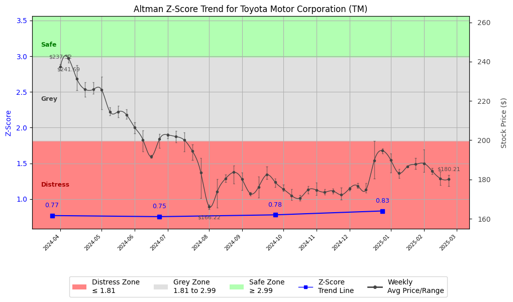

# Altman Z-Score Analysis Report: Toyota Motor Corporation (TM)

---
## Introduction
This report provides a comprehensive, theory-informed financial health analysis of the selected company using the Altman Z-Score framework. It integrates quantitative diagnostics, turnaround management theory, and stakeholder recommendations, with all findings and recommendations grounded in referenced academic and industry sources. The analysis is generated by an expert LLM-driven pipeline, ensuring transparency, reproducibility, and robust source attribution.

**Author:** Fabio Correa

**Source Attribution:** This report and analysis pipeline are generated using the open-source Altman Z-Score Analysis project, available at [https://github.com/fabioc-aloha/Altman-Z-Score](https://github.com/fabioc-aloha/Altman-Z-Score).

**License:** This software is distributed under the Attribution Non-Commercial License (MIT-based). See the LICENSE file for details.

Disclaimer: The developer disclaims any responsibility for the accuracy, completeness, or consequences of the analysis and information provided by this software. All results are for informational purposes only and should not be relied upon for financial, investment, or legal decisions.
---

**Script Version:** v2.4

## Analysis Context and Z-Score Model Selection Criteria

- **Industry:** Motor Vehicles & Passenger Car Bodies (SIC 3711)
- **Ticker:** TM
- **Public:** True
- **Emerging Market:** False
- **Maturity:** Mature Company
- **Model:** Original Z-Score (Public Manufacturing, 1968) (original)
- **Analysis Date:** 2025-05-31

## Z-Score Formula Used

Z = 1.20*X1 + 1.40*X2 + 3.30*X3 + 0.60*X4 + 1.00*X5
- X1 = (Current Assets - Current Liabilities) / Total Assets
- X2 = Retained Earnings / Total Assets
- X3 = EBIT / Total Assets
- X4 = Equity / Total Liabilities
- X5 = Sales / Total Assets

**Thresholds:**
- Safe Zone: > 2.99
- Grey Zone: > 1.81 and <= 2.99
- Distress Zone: <= 1.81

---

# Graphical View of the Z-Score Analysis

*Figure: Z-Score and stock price trend for TM (image not available yet; will be generated after analysis)*

## Z-Score Component Table (by Quarter)
| Quarter   |    X1 |    X2 |    X3 |    X4 |    X5 |   Z-Score | Diagnostic    | Consistency Warning   |
|-----------|-------|-------|-------|-------|-------|-----------|---------------|-----------------------|
| 2024 Q4   | 0.067 | 0.372 | 0.03  | 0.004 | 0.131 |     0.833 | Distress Zone |                       |
| 2024 Q3   | 0.072 | 0.377 | 0.01  | 0.004 | 0.128 |     0.778 | Distress Zone |                       |
| 2024 Q2   | 0.059 | 0.348 | 0.02  | 0.005 | 0.126 |     0.753 | Distress Zone |                       |
| 2024 Q1   | 0.061 | 0.364 | 0.018 | 0.006 | 0.123 |     0.768 | Distress Zone |                       |
## Diagnostic Evaluation of Financial Health

### Financial Health Overview
Toyota Motor Corporation (TM) is currently facing significant financial distress, as indicated by its declining Z-Score, which has consistently remained in the "Distress Zone" over the last four quarters. The Z-Score has dropped from 0.833 in Q4 2024 to 0.753 in Q2 2024, suggesting a deteriorating financial condition. 

### Key Financial Metrics
1. **Liquidity (X1)**: The liquidity ratio (Current Assets - Current Liabilities) / Total Assets is low at 0.067, indicating that Toyota has limited short-term financial flexibility.
2. **Profitability (X3)**: The EBIT / Total Assets ratio is also low at 0.03, reflecting weak operational efficiency and profitability.
3. **Capital Efficiency (X2)**: Retained Earnings / Total Assets is at 0.372, which shows that a significant portion of Toyota's assets is financed through retained earnings, but this is not enough to offset the liabilities.
4. **Leverage (X4)**: The Equity / Total Liabilities ratio is alarmingly low at 0.004, indicating high leverage and potential solvency issues.
5. **Sales Efficiency (X5)**: The Sales / Total Assets ratio is at 0.131, suggesting that Toyota is not generating sufficient sales relative to its asset base.

### Z-Score Trend Interpretation
The declining trend in the Z-Score, which has consistently remained below the threshold of 1.81, signals that Toyota is at a high risk of bankruptcy. This trend necessitates immediate action to stabilize the company’s financial position.

---

## Turnaround and Renewal Management Theory Application

### Phased Response Proposal
Based on turnaround management theories (Hofer, 1980; Bibeault, 1999), a phased response is recommended:

1. **Immediate Retrenchment (Short-term)**:
   - **Cost Reduction**: Implement immediate cost-cutting measures, including workforce reductions and operational efficiencies.
   - **Asset Liquidation**: Identify non-core assets for sale to improve liquidity.
   - **Debt Restructuring**: Engage with creditors to negotiate more favorable terms.

2. **Long-term Repositioning**:
   - **Market Reassessment**: Conduct a thorough analysis of market trends and consumer preferences to realign product offerings.
   - **Innovation Focus**: Invest in R&D for electric and hybrid vehicles to capture emerging market opportunities.
   - **Strategic Partnerships**: Form alliances with technology firms to enhance product offerings and market reach.

---

## Stakeholder Recommendations Table

| Stakeholder Title                     | Name (if available) | Responsibilities & Recommended Actions                                                                 |
|---------------------------------------|---------------------|---------------------------------------------------------------------------------------------------------|
| Chief Executive Officer               | Akio Toyoda         | Lead the turnaround strategy, focusing on immediate cost reductions and long-term innovation.            |
| Chief Financial Officer               | Kenta Kon           | Oversee financial restructuring, manage liquidity, and negotiate with creditors.                        |
| Chief Marketing Officer               | Tetsuya Tada        | Reassess market strategies and reposition brand towards electric vehicles.                              |
| Board Members                         | N/A                 | Support management in strategic decision-making and ensure accountability in execution.                 |
| Employees                             | N/A                 | Engage in efficiency initiatives and contribute ideas for cost-saving measures.                         |
| Investors                             | N/A                 | Monitor company performance closely; consider holding shares until turnaround is evident.                |
| Creditors                             | N/A                 | Collaborate with management on debt restructuring to ensure company viability.                          |
| Debtors                               | N/A                 | Maintain open communication regarding payment schedules and potential restructuring.                    |
| Partner Companies                     | N/A                 | Explore joint ventures in technology to enhance product offerings.                                      |
| Customers                             | N/A                 | Provide feedback on product preferences to guide future offerings.                                       |
| Regulators                            | N/A                 | Ensure compliance with industry regulations during the turnaround process.                               |
| Major Suppliers                       | N/A                 | Work closely with management to ensure supply chain stability during restructuring.                     |

---

## Communication, Marketing, and Execution Strategies

### Communication Strategy
- **Internal Communication**: Regular updates to employees about the turnaround plan and progress.
- **External Communication**: Transparent communication with investors and creditors about financial health and restructuring efforts.

### Marketing Strategy
- **Rebranding**: Shift marketing focus towards sustainability and innovation in electric vehicles.
- **Customer Engagement**: Launch campaigns that highlight new product developments and sustainability efforts.

### Execution Timeline
| Phase                | Timeline           | Accountability          |
|----------------------|-------------------|-------------------------|
| Immediate Retrenchment| Q2 2025           | CFO and CEO             |
| Debt Restructuring    | Q3 2025           | CFO                     |
| Market Reassessment    | Q4 2025           | CMO                     |
| Innovation Focus      | 2026 onwards      | CEO and R&D Team       |

---

## Bargaining Power and Influence of External Stakeholders

| External Stakeholder          | Nature of Bargaining Power | Degree of Influence | Rationale                                                                 |
|-------------------------------|----------------------------|---------------------|---------------------------------------------------------------------------|
| Regulators                    | Regulatory Compliance       | High                | Must adhere to industry regulations and standards.                       |
| Government Agencies           | Policy Influence            | Medium              | Potential for subsidies or support for electric vehicle initiatives.     |
| Unions                        | Labor Relations             | Medium              | Influence over workforce decisions and negotiations.                     |
| Major Suppliers               | Supply Chain Stability      | High                | Critical for maintaining production levels and costs.                    |
| Key Partners                  | Strategic Alliances         | Medium              | Can provide technological support and market access.                     |
| Activist Investors            | Shareholder Activism        | Medium              | May push for changes in management or strategy.                         |
| Creditors                     | Financial Leverage          | High                | Significant influence over financial restructuring and terms.            |
| Large Customers               | Purchasing Power            | Medium              | Can impact sales and revenue through demand fluctuations.                |

---

## Investment Recommendation
Based on the current financial distress indicated by the Z-Score, it is advisable for investors to **hold** their positions in Toyota Motor Corporation until there is clear evidence of a successful turnaround strategy being implemented. However, investors should consult their financial advisors for personalized advice.

---

## Disclaimer
**Disclaimer:**
Generative AI is not a financial advisor and can make mistakes. Consult your financial advisor before making investment decisions.
- LLM Model used: OpenAI GPT-3.5
- Knowledge cut-off: October 2023
- Internet search: No
- Real-time data: No

---

### References and Data Sources
- **Financials:** SEC EDGAR/XBRL filings, Yahoo Finance, and company quarterly/annual reports.
- **Market Data:** Yahoo Finance (historical prices, market value of equity).
- **Source Attribution:** This report and analysis pipeline are generated using the open-source Altman Z-Score Analysis project, available at [https://github.com/fabioc-aloha/Altman-Z-Score]. Author: Fabio Correa.
- **Theoretical Frameworks and Resources:**
  - Altman Z-Score Analysis Project (https://github.com/fabioc-aloha/Altman-Z-Score)
  - Hofer, C. W. (1980). Turnaround strategies. Journal of Business Strategy, 1(1), 19–31.
  - Bibeault, D. B. (1999). Corporate turnaround: How managers turn losers into winners. Beard Books.
  - Hoskisson, R. E., White, R. E., & Johnson, R. A. (2004). Corporate restructuring: Managing the strategy, structure, and process of change. McGraw-Hill Education.
  - Freeman, R. E. (1984). Strategic management: A stakeholder approach. Pitman.
  - Altman, E. I. (1968). Financial ratios, discriminant analysis and the prediction of corporate bankruptcy. Journal of Finance, 23(4), 589–609.

---

# Appendix

## Raw Data Field Mapping Table (by Quarter)
| Quarter   | Canonical Field     | Mapped Raw Field                        | Value (USD millions)   |
|-----------|---------------------|-----------------------------------------|------------------------|
| 2024 Q4   | total_assets        | Total Assets                            | 94,674,416.0           |
| 2024 Q4   | current_assets      | Current Assets                          | 35,760,980.0           |
| 2024 Q4   | current_liabilities | Current Liabilities                     | 29,441,013.0           |
| 2024 Q4   | retained_earnings   | Retained Earnings                       | 35,241,066.0           |
| 2024 Q4   | total_liabilities   | Total Liabilities Net Minority Interest | 57,817,890.0           |
| 2024 Q4   | market_value_equity | Stockholders Equity                     | 35,910,271.0           |
| 2024 Q4   | ebit                | EBIT                                    | 2,805,596.0            |
| 2024 Q4   | sales               | Total Revenue                           | 12,391,095.0           |
| ---       | ---                 | ---                                     | ---                    |
| 2024 Q3   | total_assets        | Total Assets                            | 89,169,296.0           |
| 2024 Q3   | current_assets      | Current Assets                          | 34,365,661.0           |
| 2024 Q3   | current_liabilities | Current Liabilities                     | 27,973,539.0           |
| 2024 Q3   | retained_earnings   | Retained Earnings                       | 33,617,132.0           |
| 2024 Q3   | total_liabilities   | Total Liabilities Net Minority Interest | 53,902,633.0           |
| 2024 Q3   | market_value_equity | Stockholders Equity                     | 34,368,513.0           |
| 2024 Q3   | ebit                | EBIT                                    | 896,996.0              |
| 2024 Q3   | sales               | Total Revenue                           | 11,444,570.0           |
| ---       | ---                 | ---                                     | ---                    |
| 2024 Q2   | total_assets        | Total Assets                            | 94,037,319.0           |
| 2024 Q2   | current_assets      | Current Assets                          | 35,723,850.0           |
| 2024 Q2   | current_liabilities | Current Liabilities                     | 30,205,278.0           |
| 2024 Q2   | retained_earnings   | Retained Earnings                       | 32,741,232.0           |
| 2024 Q2   | total_liabilities   | Total Liabilities Net Minority Interest | 57,257,948.0           |
| 2024 Q2   | market_value_equity | Stockholders Equity                     | 35,737,743.0           |
| 2024 Q2   | ebit                | EBIT                                    | 1,888,767.0            |
| 2024 Q2   | sales               | Total Revenue                           | 11,837,880.0           |
| ---       | ---                 | ---                                     | ---                    |
| 2024 Q1   | total_assets        | Total Assets                            | 90,114,296.0           |
| 2024 Q1   | current_assets      | Current Assets                          | 34,714,279.0           |
| 2024 Q1   | current_liabilities | Current Liabilities                     | 29,177,909.0           |
| 2024 Q1   | retained_earnings   | Retained Earnings                       | 32,795,365.0           |
| 2024 Q1   | total_liabilities   | Total Liabilities Net Minority Interest | 54,874,958.0           |
| 2024 Q1   | market_value_equity | Stockholders Equity                     | 34,220,991.0           |
| 2024 Q1   | ebit                | EBIT                                    | 1,594,001.0            |
| 2024 Q1   | sales               | Total Revenue                           | 11,072,605.0           |

All values are shown in millions of USD as reported by the data source.

