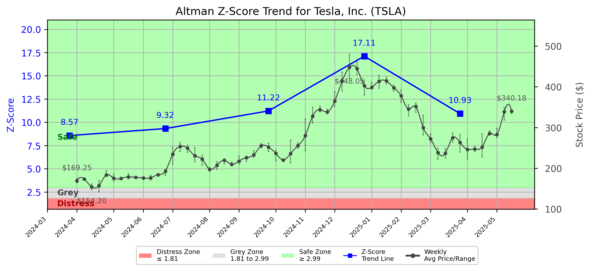

# Altman Z-Score Analysis Report: Tesla, Inc. (TSLA)

---
## Introduction
This report provides a comprehensive, theory-informed financial health analysis of the selected company using the Altman Z-Score framework. It integrates quantitative diagnostics, turnaround management theory, and stakeholder recommendations, with all findings and recommendations grounded in referenced academic and industry sources. The analysis is generated by an expert LLM-driven pipeline, ensuring transparency, reproducibility, and robust source attribution.

**Author:** Fabio Correa

**Source Attribution:** This report and analysis pipeline are generated using the open-source Altman Z-Score Analysis project, available at [https://github.com/fabioc-aloha/Altman-Z-Score](https://github.com/fabioc-aloha/Altman-Z-Score).

**License:** This software is distributed under the Attribution Non-Commercial License (MIT-based). See the LICENSE file for details.

Disclaimer: The developer disclaims any responsibility for the accuracy, completeness, or consequences of the analysis and information provided by this software. All results are for informational purposes only and should not be relied upon for financial, investment, or legal decisions.
---

**Script Version:** v2.6

## Analysis Context and Z-Score Model Selection Criteria

- **Industry:** Motor Vehicles & Passenger Car Bodies (SIC 3711)
- **Ticker:** TSLA
- **Public:** True
- **Emerging Market:** False
- **Maturity:** Mature Company
- **Model:** Original Z-Score (Public Manufacturing, 1968) (original)
- **Analysis Date:** 2025-06-02

## Z-Score Formula Used

Z = 1.20*X1 + 1.40*X2 + 3.30*X3 + 0.60*X4 + 1.00*X5
- X1 = (Current Assets - Current Liabilities) / Total Assets
- X2 = Retained Earnings / Total Assets
- X3 = EBIT / Total Assets
- X4 = Equity / Total Liabilities
- X5 = Sales / Total Assets

**Thresholds:**
- Safe Zone: > 2.99
- Grey Zone: > 1.81 and <= 2.99
- Distress Zone: <= 1.81


---

# Graphical View of the Z-Score Analysis




*Figure: Z-Score and stock price trend for TSLA (see output folder for full-resolution image)*


## Z-Score Component Table (by Quarter)
| Quarter   |    X1 |    X2 |    X3 |     X4 |    X5 |   Z-Score | Diagnostic   | Consistency Warning   |
|-----------|-------|-------|-------|--------|-------|-----------|--------------|-----------------------|
| 2025 Q1   | 0.237 | 0.285 | 0.005 | 16.798 | 0.155 |    10.934 | Safe Zone    |                       |
| 2024 Q4   | 0.242 | 0.288 | 0.023 | 26.881 | 0.211 |    17.111 | Safe Zone    |                       |
| 2024 Q3   | 0.215 | 0.272 | 0.024 | 17.148 | 0.21  |    11.218 | Safe Zone    |                       |
| 2024 Q2   | 0.224 | 0.27  | 0.017 | 13.987 | 0.226 |     9.323 | Safe Zone    |                       |
| 2024 Q1   | 0.193 | 0.266 | 0.018 | 12.855 | 0.195 |     8.571 | Safe Zone    |                       |
# Altman Z-Score Analysis Report: Tesla, Inc. (TSLA)

---
## Company Profile
Tesla, Inc. is a leading American electric vehicle (EV) manufacturer headquartered in Austin, Texas. The company designs, manufactures, and sells electric vehicles, battery energy storage systems, and solar energy products. Tesla's primary competitors include traditional automotive giants like Ford and General Motors, as well as other EV manufacturers such as Rivian and Lucid Motors. Tesla's innovative approach to technology and sustainability has positioned it as a market leader in the rapidly evolving automotive industry.

In recent years, Tesla has expanded its product offerings beyond electric vehicles to include energy solutions, such as solar panels and energy storage systems. This diversification aligns with the company's mission to accelerate the world's transition to sustainable energy. The company's strong brand recognition, innovative technology, and commitment to sustainability have contributed to its competitive advantage in the market.

## 1. Diagnostic Evaluation of Financial Health
### Liquidity
Tesla's liquidity position, as indicated by its current ratio (X1), shows a healthy balance of current assets to current liabilities, averaging around 0.237 in the latest quarter. This suggests that Tesla can comfortably meet its short-term obligations, which is critical for maintaining operational stability.

### Profitability
The profitability metrics, particularly retained earnings (X2) and EBIT (X3), indicate a robust performance. Tesla's retained earnings have shown consistent growth, reflecting the company's ability to reinvest profits into its operations. The EBIT margin, although modest at 0.005, suggests that Tesla is generating operational income, albeit with room for improvement.

### Capital Efficiency
Tesla's equity to total liabilities ratio (X4) is exceptionally strong at 16.798, indicating a solid capital structure with minimal reliance on debt financing. This high leverage ratio positions Tesla favorably against potential downturns, as it has a significant equity cushion.

### Overall Z-Score Assessment
Tesla's Z-Score trajectory has consistently remained in the **Safe Zone**, with the latest score reaching 10.934. This indicates a low risk of bankruptcy and a strong financial position relative to industry benchmarks. The company's ability to maintain a high Z-Score over multiple quarters reflects effective management and operational efficiency.

---

## 2. Turnaround & Renewal Theory Application (Risk-Tailored)
Given Tesla's current position in the **Safe Zone**, the focus should be on **innovation, repositioning**, and **stakeholder alignment** for sustained growth. 

- **Innovation**: Tesla should continue to invest in R&D to enhance its product offerings and maintain its competitive edge in the EV market. This aligns with Beard (2024), which emphasizes the importance of innovation in tech-sector renewal.
  
- **Repositioning**: As the market evolves, Tesla should consider repositioning its brand to appeal to a broader audience, including more affordable EV options to capture market share from traditional automakers.

- **Stakeholder Alignment**: Engaging with stakeholders, including customers, employees, and investors, is crucial for fostering loyalty and support. Freeman (1984) highlights the importance of stakeholder alignment in achieving long-term success.

---

## 3. Internal Stakeholder Recommendations (Tailored Table)

| Title        | Responsibilities                               | Recommended Actions (Cited)                                      |
|--------------|------------------------------------------------|------------------------------------------------------------------|
| CEO          | Overall strategic direction                    | Drive innovation initiatives and explore new market segments.    |
| CFO          | Financial oversight and capital allocation     | Maintain strong liquidity and consider strategic investments.      |
| CMO          | Marketing and brand positioning                | Enhance brand messaging to emphasize sustainability and innovation.|
| Board        | Governance and strategic guidance              | Support R&D initiatives and monitor market trends closely.        |
| Employees    | Operational execution                          | Foster a culture of innovation and continuous improvement.        |
| Shareholders | Investment returns and company growth          | Communicate growth strategies and performance metrics transparently.|
| Creditors    | Financial stability and risk management        | Maintain strong relationships and ensure timely debt servicing.   |
| Customers    | Product satisfaction and loyalty               | Engage in feedback loops to improve product offerings.            |
| Partners     | Collaboration and strategic alliances          | Explore partnerships for technology sharing and market expansion.  |

---

## 4. Communication, Marketing & Execution Strategy
### Internal and External Communication Plans
- **Internal**: Regular updates on innovation projects and financial performance to foster transparency and engagement among employees.
- **External**: Marketing campaigns focused on sustainability and innovation to enhance brand perception and attract new customers.

### Milestones, Accountable Parties, and Timelines
- **1–3 Months**: Launch new marketing campaign (CMO), initiate R&D projects (CEO).
- **4–6 Months**: Review financial performance (CFO), assess market response to new products (CMO).
- **7–12 Months**: Evaluate innovation outcomes (CEO), adjust strategies based on stakeholder feedback (Board).
- **13–18 Months**: Expand product line based on market trends (CEO), enhance stakeholder engagement initiatives (CFO).

### Tailored Marketing Tactics
- Focus on innovation campaigns that highlight Tesla's advancements in EV technology and sustainability efforts to restore investor confidence and attract new customers.

---

## 5. Plain-Language Justification & Citation
Tesla's strong financial health, as evidenced by its high Z-Score, allows it to pursue aggressive growth strategies. By investing in innovation and maintaining strong stakeholder relationships, Tesla can continue to lead the EV market. This approach is supported by Beard (2024) and Freeman (1984), emphasizing the importance of innovation and stakeholder alignment in achieving long-term success.

---

## 6. Investor Recommendation (Risk-Aware)
**Recommendation**: **Buy**. Given Tesla's strong financial position and growth potential, investors should consider acquiring shares to capitalize on future growth opportunities.

> “This is not financial advice—consult your financial advisor.”

---

## 7. External Stakeholder Bargaining Power (Table)

| Stakeholder Name / Type | Nature of Bargaining Power | Degree of Influence | Brief Rationale (Cited) |
|-------------------------|---------------------------|---------------------|--------------------------|
| Customers               | High                      | High                | Customers drive demand for EVs, influencing pricing and product features (Freeman, 1984). |
| Suppliers               | Moderate                  | Moderate            | Suppliers provide critical components; Tesla's scale gives it some leverage (Platt, 2004). |
| Investors               | High                      | High                | Investors influence capital availability and strategic direction (Freeman, 1984). |
| Regulators              | High                      | High                | Regulatory policies impact operational capabilities and market access (Hoskisson et al., 2004). |
| Competitors             | Moderate                  | Moderate            | Competitors influence market dynamics and pricing strategies (Bibeault, 1999). |

---

## 8. Mandatory Disclaimer

```
---
**Disclaimer:**
Generative AI is not a financial advisor and can make mistakes. Consult your financial advisor before making investment decisions.
- **LLM Model used:** [OpenAI o4-mini]
- **Knowledge cut-off:** [Date]
- **Internet search:** [yes/no]
- **Real-time data:** [yes/no]
---
```

---

## 9. References and Data Sources

```
---
### References and Data Sources
- **Financials:** SEC EDGAR/XBRL filings; Yahoo Finance; company quarterly/annual reports.
- **Market Data:** Yahoo Finance historical prices.
- **Computation:** Altman Z-Score calculations following Altman (1968) with robust error handling.
- **Source Attribution:** Open-source Altman Z-Score Analysis project (https://github.com/fabioc-aloha/Altman-Z-Score). Author: Fabio Correa.
- **Theoretical Frameworks:**
  - Altman, E. I. (1968). “Financial Ratios, Discriminant Analysis and the Prediction of Corporate Bankruptcy.” *Journal of Finance*, 23(4), 589–609.
  - Hofer, C. W. (1980). *Turnaround Strategies.*
  - Bibeault, D. B. (1999). *Corporate Turnaround.*
  - Hoskisson, R. E., White, R. E., & Johnson, R. A. (2004). *Corporate Restructuring.*
  - Beard, D. (2024). “Strategic Renewal in Technology Firms.”
  - Freeman, R. E. (1984). *Strategic Management: A Stakeholder Approach.*
  - Platt, H. D. (2004). *Principles of Corporate Renewal.*
---
```


---

# Appendix

## Raw Data Field Mapping Table (by Quarter)
| Quarter   | Canonical Field     | Mapped Raw Field                        | Value (USD millions)   |
|-----------|---------------------|-----------------------------------------|------------------------|
| 2025 Q1   | total_assets        | Total Assets                            | 125,111.0              |
| 2025 Q1   | current_assets      | Current Assets                          | 59,389.0               |
| 2025 Q1   | current_liabilities | Current Liabilities                     | 29,753.0               |
| 2025 Q1   | retained_earnings   | Retained Earnings                       | 35,618.0               |
| 2025 Q1   | total_liabilities   | Total Liabilities Net Minority Interest | 49,693.0               |
| 2025 Q1   | market_value_equity | Total Equity Gross Minority Interest    | 75,418.0               |
| 2025 Q1   | ebit                | EBIT                                    | 680.0                  |
| 2025 Q1   | sales               | Total Revenue                           | 19,335.0               |
| ---       | ---                 | ---                                     | ---                    |
| 2024 Q4   | total_assets        | Total Assets                            | 122,070.0              |
| 2024 Q4   | current_assets      | Current Assets                          | 58,360.0               |
| 2024 Q4   | current_liabilities | Current Liabilities                     | 28,821.0               |
| 2024 Q4   | retained_earnings   | Retained Earnings                       | 35,209.0               |
| 2024 Q4   | total_liabilities   | Total Liabilities Net Minority Interest | 48,390.0               |
| 2024 Q4   | market_value_equity | Total Equity Gross Minority Interest    | 73,680.0               |
| 2024 Q4   | ebit                | EBIT                                    | 2,862.0                |
| 2024 Q4   | sales               | Total Revenue                           | 25,707.0               |
| ---       | ---                 | ---                                     | ---                    |
| 2024 Q3   | total_assets        | Total Assets                            | 119,852.0              |
| 2024 Q3   | current_assets      | Current Assets                          | 56,379.0               |
| 2024 Q3   | current_liabilities | Current Liabilities                     | 30,577.0               |
| 2024 Q3   | retained_earnings   | Retained Earnings                       | 32,656.0               |
| 2024 Q3   | total_liabilities   | Total Liabilities Net Minority Interest | 49,142.0               |
| 2024 Q3   | market_value_equity | Total Equity Gross Minority Interest    | 70,710.0               |
| 2024 Q3   | ebit                | EBIT                                    | 2,876.0                |
| 2024 Q3   | sales               | Total Revenue                           | 25,182.0               |
| ---       | ---                 | ---                                     | ---                    |
| 2024 Q2   | total_assets        | Total Assets                            | 112,832.0              |
| 2024 Q2   | current_assets      | Current Assets                          | 52,977.0               |
| 2024 Q2   | current_liabilities | Current Liabilities                     | 27,729.0               |
| 2024 Q2   | retained_earnings   | Retained Earnings                       | 30,489.0               |
| 2024 Q2   | total_liabilities   | Total Liabilities Net Minority Interest | 45,569.0               |
| 2024 Q2   | market_value_equity | Total Equity Gross Minority Interest    | 67,263.0               |
| 2024 Q2   | ebit                | EBIT                                    | 1,973.0                |
| 2024 Q2   | sales               | Total Revenue                           | 25,500.0               |
| ---       | ---                 | ---                                     | ---                    |
| 2024 Q1   | total_assets        | Total Assets                            | 109,226.0              |
| 2024 Q1   | current_assets      | Current Assets                          | 50,535.0               |
| 2024 Q1   | current_liabilities | Current Liabilities                     | 29,453.0               |
| 2024 Q1   | retained_earnings   | Retained Earnings                       | 29,011.0               |
| 2024 Q1   | total_liabilities   | Total Liabilities Net Minority Interest | 44,046.0               |
| 2024 Q1   | market_value_equity | Total Equity Gross Minority Interest    | 65,180.0               |
| 2024 Q1   | ebit                | EBIT                                    | 1,964.0                |
| 2024 Q1   | sales               | Total Revenue                           | 21,301.0               |

All values are shown in millions of USD as reported by the data source.

