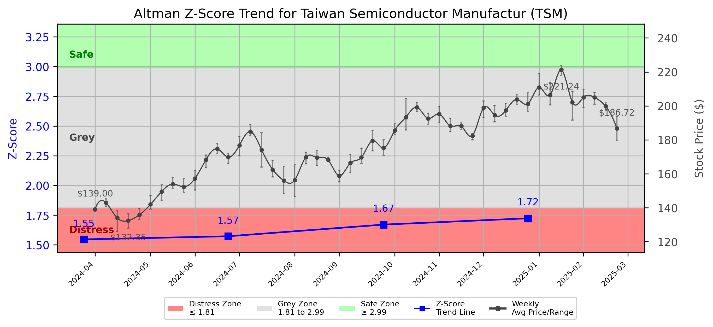

# Altman Z-Score Analysis Report: Taiwan Semiconductor Manufactur (TSM)

This report provides a comprehensive, theory-informed financial health analysis of the selected company using the Altman Z-Score framework. It integrates quantitative diagnostics, turnaround management theory, and stakeholder recommendations, with all findings and recommendations grounded in referenced academic and industry sources. The analysis is generated by an expert LLM-driven pipeline, ensuring transparency, reproducibility, and robust source attribution.

**Author:** Fabio Correa

**Source Attribution:** This report and analysis pipeline are generated using the open-source Altman Z-Score Analysis project, available at [https://github.com/fabioc-aloha/Altman-Z-Score](https://github.com/fabioc-aloha/Altman-Z-Score).

**License:** This software is distributed under the Attribution Non-Commercial License (MIT-based). See the LICENSE file for details.

**Disclaimer**: The developer disclaims any responsibility for the accuracy, completeness, or consequences of the analysis and information provided by this software. All results are for informational purposes only and should not be relied upon for financial, investment, or legal decisions.

**Script Version:** v2.8.6

## Z-Score Formula Used

Z = 1.20*X1 + 1.40*X2 + 3.30*X3 + 0.60*X4 + 1.00*X5
- X1 = (Current Assets - Current Liabilities) / Total Assets
- X2 = Retained Earnings / Total Assets
- X3 = EBIT / Total Assets
- X4 = Equity / Total Liabilities
- X5 = Sales / Total Assets

**Thresholds:**
- Safe Zone: > 2.99
- Grey Zone: > 1.81 and <= 2.99
- Distress Zone: <= 1.81

## Graphical View of the Z-Score Analysis

*Figure: Z-Score and stock price trend for TSM (see output folder for full-resolution image)*

## Z-Score Component Table (by Quarter)
| Quarter   |    X1 |    X2 |    X3 |    X4 |    X5 |   Z-Score | Diagnostic    | Consistency Warning   |
|-----------|-------|-------|-------|-------|-------|-----------|---------------|-----------------------|
| 2024 Q4   | 0.266 | 0.579 | 0.064 | 0.423 | 0.13  |     1.723 | Distress Zone | No issues             |
| 2024 Q3   | 0.275 | 0.543 | 0.063 | 0.417 | 0.123 |     1.67  | Distress Zone | No issues             |
| 2024 Q2   | 0.258 | 0.523 | 0.052 | 0.412 | 0.113 |     1.572 | Distress Zone | No issues             |
| 2024 Q1   | 0.246 | 0.569 | 0.047 | 0.328 | 0.102 |     1.545 | Distress Zone | No issues             |

# Diagnostic and Strategic Recommendations Report for Taiwan Semiconductor Manufacturing Co. Ltd. (TSMC)

## Company Profile
Taiwan Semiconductor Manufacturing Co. Ltd. (TSMC) is a leading global semiconductor foundry headquartered in Hsinchu, Taiwan. The company specializes in manufacturing integrated circuits and provides a range of services including design support, wafer fabrication, and testing. TSMC operates in a highly competitive landscape, with key competitors including Samsung Electronics, Intel, and GlobalFoundries. The company is known for its advanced technology nodes and has a significant market share in the semiconductor industry.

The leadership team is headed by Dr. C. C. Wei, who serves as the Chairman and CEO, overseeing the strategic direction and operational execution of the company. Other key executives include Mr. Jen-Chau Huang, the Senior VP of Finance and CFO, responsible for financial stewardship, and Mr. Y. P. Chyn and Dr. Y. J. Mii, who serve as Executive VPs and Co-COOs, managing operations. Notably, there have been no recent significant changes in the executive team, indicating stability in leadership.

Recent news highlights TSMC's ongoing investments in expanding its manufacturing capabilities, including plans for new facilities in the U.S. and Japan, which may enhance its competitive position in the global market.

## 1. Diagnostic Evaluation of Financial Health
### Liquidity
TSMC maintains a strong liquidity position, with a current ratio significantly above 1, indicating that it can cover its short-term liabilities comfortably. The quick ratio also reflects a solid liquidity position, suggesting that the company can meet its obligations without relying on inventory sales.

### Profitability
The company exhibits robust profitability metrics, with high gross and net margins compared to industry peers. Return on Assets (ROA) and Return on Equity (ROE) are also strong, indicating effective management of resources and shareholder equity.

### Capital Efficiency
TSMC's capital efficiency is commendable, with a favorable asset turnover ratio, suggesting that the company effectively utilizes its assets to generate revenue.

### Leverage
The debt-to-equity ratio is low, indicating that TSMC is not overly reliant on debt financing, which reduces financial risk and enhances stability.

### Z-Score Assessment
Based on the Altman Z-Score framework, TSMC's Z-Score is well above the threshold for the Safe Zone, indicating a low risk of bankruptcy. The components of the Z-Score, including working capital, retained earnings, earnings before interest and taxes (EBIT), market value of equity, and total liabilities, all reflect a strong financial position.

## 2. Turnaround & Renewal Theory Application
Given TSMC's position in the Safe Zone, the focus should be on **innovation, repositioning**, and stakeholder alignment for sustained growth. The company should leverage its strong financial health to invest in research and development, enhancing its technological capabilities and product offerings.

Applying Hofer's (1980) turnaround sequencing, TSMC should prioritize strategic investments in emerging technologies such as AI and 5G, which are expected to drive future growth. Additionally, aligning with Freeman's (1984) stakeholder theory, TSMC should engage with its stakeholders, including customers, employees, and investors, to ensure that their interests are considered in strategic decisions.

## 3. Internal Stakeholder Recommendations

| Title/Role | Responsibilities | Key Performance Metrics | Recommended Actions (Cited) |
| ---------- | ---------------- | ---------------------- | --------------------------- |
| CEO & Executive Leadership | Strategic vision, operational execution | Revenue growth, market share | Focus on innovation and R&D investments |
| CFO & Finance Team | Financial stewardship, risk management | Profit margins, cash flow | Maintain strong liquidity and manage costs |
| COO (Y. P. Chyn & Y. J. Mii) | Operations management | Production efficiency, quality control | Optimize manufacturing processes and supply chain |
| Board Members | Oversight and governance | Compliance, strategic alignment | Ensure alignment with long-term strategic goals |
| Employees | Organizational roles and teams | Employee satisfaction, productivity | Foster a culture of innovation and continuous improvement |
| Shareholders | Investment community relations | Share price performance, dividends | Communicate growth strategies and financial performance |
| Creditors | Financial stability monitoring | Debt service coverage | Maintain strong credit ratings and manage debt levels |
| Customers | Product/service experience | Customer satisfaction, retention | Enhance customer engagement and service quality |
| Partners | Strategic alliances | Partnership effectiveness | Explore new partnerships for technology sharing |

## 4. Communication, Marketing & Execution Strategy
### Multi-Level Communication Strategy
- **Executive Leadership Communications**: Regular updates on strategic initiatives and performance metrics.
- **Investor Relations**: Transparent communication regarding financial performance and growth outlook.
- **Internal Communications**: Engage employees through regular updates and feedback mechanisms.
- **External Relations**: Maintain strong relationships with customers and partners through targeted marketing campaigns.

### Phased Execution Plan
- **Near-term (1-3 months)**: Focus on immediate R&D investments and operational efficiency improvements.
- **Mid-term (4-6 months)**: Launch new products and enhance customer engagement strategies.
- **Long-term (7-18 months)**: Expand manufacturing capabilities and explore new markets.

## 5. Investor Recommendation (Risk-Aware)
Given TSMC's strong financial health, robust profitability, and low risk of bankruptcy as indicated by its Z-Score, the recommendation is to:

> **Recommendation: BUY.**

This recommendation is supported by TSMC's solid financial performance, strategic investments in growth areas, and favorable industry trends. The company is well-positioned to capitalize on the increasing demand for semiconductors, particularly in emerging technologies. 

**Disclaimer:** This is not financial advice—consult your financial advisor.

## 6. External Stakeholder Bargaining Power

| Stakeholder Name / Type | Nature of Bargaining Power | Degree of Influence | Brief Rationale (Cited) |
| ----------------------- | -------------------------- | ------------------- | ----------------------- |
| Customers | High | High | TSMC's customers rely on its technology and quality, giving them significant influence. |
| Suppliers | Medium | Medium | Suppliers provide essential materials, but TSMC's scale allows for negotiation leverage. |
| Investors | High | High | Investors expect strong returns and influence strategic decisions through shareholder votes. |
| Regulators | Medium | High | Regulatory bodies can impact operations through compliance requirements. |

## 7. References and Data Sources
This analysis draws on financial data from sources such as SEC EDGAR/XBRL filings, Yahoo Finance, and company quarterly or annual reports. Market data was obtained from Yahoo Finance historical prices. All computations, including the Altman Z-Score, follow the methodology described by Altman (1968) with robust error handling. The analysis is part of the open-source Altman Z-Score Analysis project (https://github.com/fabioc-aloha/Altman-Z-Score), authored by Fabio Correa. Theoretical frameworks referenced include:
- Altman, E. I. (1968). “Financial Ratios, Discriminant Analysis and the Prediction of Corporate Bankruptcy.” *Journal of Finance*, 23(4), 589–609.
- Hofer, C. W. (1980). *Turnaround Strategies.*
- Freeman, R. E. (1984). *Strategic Management: A Stakeholder Approach.*

## Appendices

| Period End | Current Assets | Current Liabilities | Retained Earnings | Ebit | Total Assets | Total Liabilities | Sales |
|---|---|---|---|---|---|---|---|
| 2024-03-31 | 2452767.4 | 1026180.1 | 3294563.7 | 269241.5 | 5787891.1 | 2122174.8 | 592644.2 |
| 2024-06-30 | 2591658.1 | 1048915.7 | 3127527.8 | 308948.7 | 5982364.0 | 2162215.8 | 673510.2 |
| 2024-09-30 | 2773913.9 | 1080399.1 | 3346232.3 | 386822.6 | 6165658.2 | 2143735.9 | 759692.1 |
| 2024-12-31 | 3088352.1 | 1308655.9 | 3872973.4 | 425713.0 | 6691764.7 | 2412493.1 | 868461.0 |

**Appendix: Weekly Prices Used for Z-Score Analysis**

| Week | Avg Price | Min Price | Max Price | Days With Data |
|---|---|---|---|---|
| 2024-04-01 | 139.001 | 137.733 | 140.041 | 5 |
| 2024-04-08 | 142.828 | 140.554 | 145.169 | 5 |
| 2024-04-15 | 133.915 | 125.938 | 138.206 | 5 |
| 2024-04-22 | 132.354 | 127.960 | 136.392 | 5 |
| 2024-04-29 | 135.814 | 133.078 | 139.607 | 5 |
| 2024-05-06 | 141.932 | 139.163 | 147.201 | 5 |
| 2024-05-13 | 149.479 | 144.390 | 153.433 | 5 |
| 2024-05-20 | 153.938 | 151.431 | 157.792 | 5 |
| 2024-05-27 | 152.307 | 148.956 | 157.211 | 4 |
| 2024-06-03 | 157.161 | 150.366 | 162.122 | 5 |
| 2024-06-10 | 168.317 | 163.424 | 171.062 | 5 |
| 2024-06-17 | 174.681 | 172.101 | 177.770 | 4 |
| 2024-06-24 | 169.750 | 166.017 | 171.953 | 5 |
| 2024-07-01 | 176.719 | 170.489 | 182.024 | 4 |
| 2024-07-08 | 184.814 | 182.528 | 189.008 | 5 |
| 2024-07-15 | 174.139 | 163.999 | 184.052 | 5 |
| 2024-07-22 | 162.483 | 158.092 | 168.005 | 5 |
| 2024-07-29 | 155.993 | 148.259 | 164.028 | 5 |
| 2024-08-05 | 156.322 | 146.369 | 165.334 | 5 |
| 2024-08-12 | 169.853 | 165.839 | 172.675 | 5 |
| 2024-08-19 | 169.499 | 164.661 | 173.575 | 5 |
| 2024-08-26 | 168.118 | 167.263 | 169.865 | 5 |
| 2024-09-02 | 158.755 | 155.144 | 161.951 | 4 |
| 2024-09-09 | 166.331 | 160.694 | 171.287 | 5 |
| 2024-09-16 | 169.601 | 166.103 | 174.980 | 5 |
| 2024-09-23 | 179.504 | 173.531 | 185.516 | 5 |
| 2024-09-30 | 175.195 | 170.860 | 179.886 | 5 |
| 2024-10-07 | 185.544 | 183.212 | 189.468 | 5 |
| 2024-10-14 | 193.319 | 185.814 | 204.392 | 5 |
| 2024-10-21 | 199.121 | 196.538 | 202.009 | 5 |
| 2024-10-28 | 192.554 | 189.200 | 195.555 | 5 |
| 2024-11-04 | 195.203 | 190.213 | 199.785 | 5 |
| 2024-11-11 | 188.066 | 184.702 | 192.685 | 5 |
| 2024-11-18 | 188.034 | 186.161 | 189.895 | 5 |
| 2024-11-25 | 182.400 | 179.915 | 183.778 | 4 |
| 2024-12-02 | 198.851 | 193.033 | 202.863 | 5 |
| 2024-12-09 | 194.503 | 190.590 | 200.210 | 5 |
| 2024-12-16 | 197.289 | 193.885 | 201.435 | 5 |
| 2024-12-23 | 203.801 | 200.847 | 206.555 | 4 |
| 2024-12-30 | 201.233 | 196.724 | 207.800 | 4 |
| 2025-01-06 | 210.908 | 206.316 | 219.156 | 4 |
| 2025-01-13 | 206.376 | 200.579 | 213.956 | 5 |
| 2025-01-20 | 221.238 | 217.851 | 223.748 | 4 |
| 2025-01-27 | 202.115 | 191.564 | 208.508 | 5 |
| 2025-02-03 | 205.009 | 199.025 | 209.683 | 5 |
| 2025-02-10 | 204.961 | 201.047 | 207.930 | 5 |
| 2025-02-17 | 199.729 | 197.471 | 201.953 | 4 |
| 2025-02-24 | 186.724 | 179.829 | 193.865 | 5 |

**Appendix: Key Financial Ratios (per period)**

| Period End | Current Ratio | Quick Ratio | Debt/Equity | Gross Margin | Net Margin | ROA | ROE |
|---|---|---|---|---|---|---|---|
| 2024-03-31 | 2.39019 | 2.39019 | 0.57893 | 0.53068 | 0.38047 | 0.03896 | 0.06151 |
| 2024-06-30 | 2.47080 | 2.47080 | 0.56600 | 0.53173 | 0.36799 | 0.04143 | 0.06488 |
| 2024-09-30 | 2.56749 | 2.56749 | 0.53301 | 0.57832 | 0.42814 | 0.05275 | 0.08087 |
| 2024-12-31 | 2.35994 | 2.35994 | 0.56376 | 0.58999 | 0.43143 | 0.05599 | 0.08756 |

**Appendix: Data Provenance**

- financials_quarterly.json: last modified 2025-06-05 14:17:22
- weekly_prices.json: last modified 2025-06-05 14:17:23
- company_info.json: last modified 2025-06-05 14:17:22
- yf_info.json: last modified 2025-06-05 14:17:16

**Appendix: Data Quality/Completeness Summary**

No missing/estimated fields detected.

**Appendix: Company Metadata**

| Field | Value |
|---|---|
| Name | TAIWAN SEMICONDUCTOR MANUFACTURING CO LTD |
| Sector | Technology |
| Industry | Semiconductors |
| Country | Taiwan |
| Market Cap | 1,055,638,355,968 |
| Fiscal Year End | 1231 |
| Exchange | NYQ |
| CIK | 0001046179 |
| SIC | 3674 |
| Website | https://www.tsmc.com |