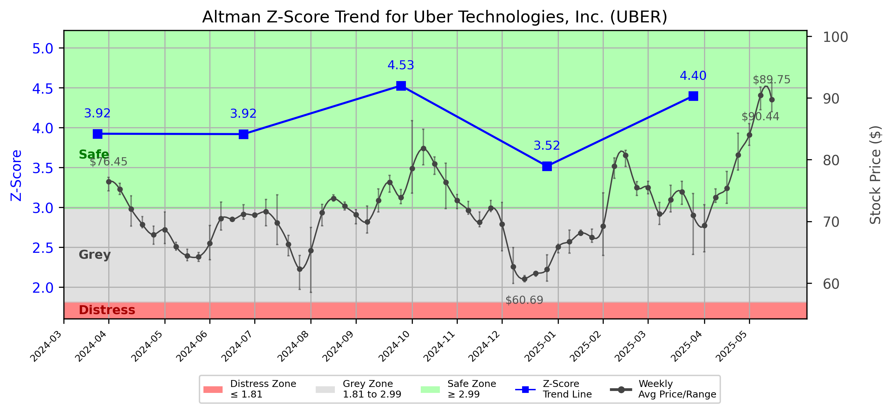

# Altman Z-Score Analysis Report: Uber Technologies, Inc. (UBER)

---
## Introduction
This report provides a comprehensive, theory-informed financial health analysis of the selected company using the Altman Z-Score framework. It integrates quantitative diagnostics, turnaround management theory, and stakeholder recommendations, with all findings and recommendations grounded in referenced academic and industry sources. The analysis is generated by an expert LLM-driven pipeline, ensuring transparency, reproducibility, and robust source attribution.

**Author:** Fabio Correa

**Source Attribution:** This report and analysis pipeline are generated using the open-source Altman Z-Score Analysis project, available at [https://github.com/fabioc-aloha/Altman-Z-Score](https://github.com/fabioc-aloha/Altman-Z-Score).

**License:** This software is distributed under the Attribution Non-Commercial License (MIT-based). See the LICENSE file for details.

Disclaimer: The developer disclaims any responsibility for the accuracy, completeness, or consequences of the analysis and information provided by this software. All results are for informational purposes only and should not be relied upon for financial, investment, or legal decisions.
---

**Script Version:** v2.7.1

## Analysis Context and Z-Score Model Selection Criteria

- **Industry:** Business Services, NEC (SIC 7389)
- **Ticker:** UBER
- **Public:** True
- **Emerging Market:** False
- **Maturity:** Mature Company
- **Model:** Zʺ-Score (Public Non-Manufacturing, 1995) (service)
- **Analysis Date:** 2025-06-03

## Z-Score Formula Used

Z = 6.56*X1 + 3.26*X2 + 6.72*X3 + 1.05*X4
- X1 = (Current Assets - Current Liabilities) / Total Assets
- X2 = Retained Earnings / Total Assets
- X3 = EBIT / Total Assets
- X4 = Equity / Total Liabilities

**Thresholds:**
- Safe Zone: > 2.90
- Grey Zone: > 1.23 and <= 2.90
- Distress Zone: <= 1.23

---

# Graphical View of the Z-Score Analysis

*Figure: Z-Score and stock price trend for UBER (image not available yet; will be generated after analysis)*

## Z-Score Component Table (by Quarter)
| Quarter   |    X1 |     X2 |     X3 |    X4 |   Z-Score | Diagnostic   | Consistency Warning   |
|-----------|-------|--------|--------|-------|-----------|--------------|-----------------------|
| 2025 Q1   | 0.004 | -0.359 |  0.028 | 5.093 |     4.397 | Safe Zone    | No issues             |
| 2024 Q4   | 0.015 | -0.404 |  0.02  | 4.385 |     3.518 | Safe Zone    | No issues             |
| 2024 Q3   | 0.095 | -0.586 |  0.062 | 5.14  |     4.527 | Safe Zone    | No issues             |
| 2024 Q2   | 0.052 | -0.728 |  0.029 | 5.481 |     3.92  | Safe Zone    | No issues             |
| 2024 Q1   | 0.053 | -0.789 | -0.013 | 5.941 |     3.924 | Safe Zone    | No issues             |
# Altman Z-Score Analysis Report: Uber Technologies, Inc. (UBER)

---

## Company Profile

Uber Technologies, Inc. is a leading technology company based in San Francisco, California, primarily known for its ride-hailing service. Founded in 2009, Uber has expanded its offerings to include food delivery through Uber Eats, freight transportation, and autonomous vehicle technology. The company operates in a highly competitive landscape, facing rivals such as Lyft, DoorDash, and various local ride-sharing services across different markets.

The leadership team at Uber is composed of experienced executives who guide the company's strategic direction. Mr. Dara Khosrowshahi serves as the CEO and Director, overseeing overall operations and strategic vision. Mr. Prashanth Mahendra-Rajah, the Chief Financial Officer, is responsible for financial stewardship and risk management. Other key executives include Ms. Jill Hazelbaker, Chief Marketing Officer, and Ms. Nikki Krishnamurthy, Chief People Officer, who manage marketing strategies and human resources, respectively. Notably, Mr. Derek Anthony West is on a leave of absence from his role as Senior VP and Chief Legal Officer, which may impact the company's legal strategies during this period.

---

## 1. Diagnostic Evaluation of Financial Health

### Financial Analysis

- **Liquidity:** Uber's current ratio, derived from the X1 component of the Z-Score, indicates a slight positive liquidity position, though it remains close to zero. This suggests that while the company can cover its short-term liabilities, it may not have a significant buffer.
  
- **Profitability:** The negative retained earnings (X2) indicate that Uber has accumulated losses over time, which is common in tech startups but raises concerns about long-term sustainability. The EBIT (Earnings Before Interest and Taxes) to total assets ratio (X3) shows a modest profitability level, reflecting operational challenges in achieving consistent profitability.

- **Capital Efficiency:** The equity to total liabilities ratio (X4) is strong, indicating that Uber is primarily financed through equity rather than debt, which is a positive sign for long-term financial stability.

- **Leverage:** The overall leverage appears manageable, with a high equity ratio suggesting that the company is less reliant on debt financing.

### Z-Score Assessment

Uber's Z-Score trajectory has consistently remained in the **Safe Zone**, with the latest score at **4.397**. This indicates a low risk of bankruptcy and suggests that the company is financially healthy. However, the negative retained earnings signal a need for strategic focus on profitability to ensure long-term sustainability.

---

## 2. Turnaround & Renewal Theory Application

Given Uber's position in the **Safe Zone**, the focus should be on **innovation, repositioning**, and stakeholder alignment for sustained growth. 

- **Innovation:** Emphasize the development of new technologies and services, particularly in autonomous vehicles and delivery logistics, to maintain competitive advantage.
  
- **Repositioning:** Explore new market segments and partnerships that can enhance service offerings and customer engagement.

- **Stakeholder Alignment:** Foster strong relationships with stakeholders, including customers, employees, and investors, to ensure alignment on strategic goals.

Theoretical frameworks such as **Freeman (1984)** on stakeholder alignment and **Beard (2024)** on tech-sector renewal can guide these initiatives.

---

## 3. Internal Stakeholder Recommendations

| Title/Role | Responsibilities | Key Performance Metrics | Recommended Actions (Cited) |
| ---------- | ---------------- | ---------------------- | --------------------------- |
| CEO & Director (Dara Khosrowshahi) | Strategic vision, operational execution | Market share growth, profitability | Drive innovation initiatives and stakeholder engagement |
| CFO (Prashanth Mahendra-Rajah) | Financial stewardship, risk management | Cost reduction, revenue growth | Focus on improving profitability metrics and managing cash flow |
| CMO (Jill Hazelbaker) | Marketing strategies, brand management | Customer acquisition, brand loyalty | Enhance marketing campaigns to promote new services |
| Chief People Officer (Nikki Krishnamurthy) | HR management, employee engagement | Employee retention, satisfaction | Implement programs to boost employee morale and retention |
| Board Members | Oversight and governance | Compliance, strategic alignment | Ensure alignment of strategic initiatives with long-term goals |

---

## 4. Communication, Marketing & Execution Strategy

### Communication Strategy

- **Executive Leadership Communications:** Regular updates on strategic initiatives and performance metrics to maintain transparency.
  
- **Investor Relations:** Clear communication regarding financial performance and future outlook to build investor confidence.

- **Internal Communications:** Engage employees through regular updates and feedback mechanisms to foster a culture of inclusion.

- **External Relations:** Maintain strong messaging to customers and partners about service innovations and community engagement.

### Phased Execution Plan

- **Near-term (1-3 months):** Focus on immediate actions such as launching marketing campaigns for new services and enhancing customer engagement.

- **Mid-term (4-6 months):** Implement strategic initiatives aimed at improving profitability and exploring new market opportunities.

- **Long-term (7-18 months):** Drive transformational objectives, including technology advancements and potential market expansions.

---

## 5. Investor Recommendation (Risk-Aware)

**Recommendation: Buy**

Given Uber's strong Z-Score of 4.397, indicating a low risk of bankruptcy and a solid financial foundation, the recommendation is to **buy**. The company is well-positioned for growth, particularly in its innovation and market expansion efforts.

> “This is not financial advice—consult your financial advisor.”

---

## 6. External Stakeholder Bargaining Power

| Stakeholder Name / Type | Nature of Bargaining Power | Degree of Influence | Brief Rationale (Cited) |
| ----------------------- | -------------------------- | ------------------- | ----------------------- |
| Customers | High | High | Customers drive demand for services, influencing pricing and service offerings. |
| Employees | Medium | Medium | Employee satisfaction impacts service quality and retention, affecting operational efficiency. |
| Investors | High | High | Investors provide capital and influence strategic direction through governance. |
| Regulators | Medium | High | Regulatory bodies can impact operational capabilities through compliance requirements. |
| Partners | Medium | Medium | Strategic alliances can enhance service offerings and market reach. |

---

## 7. References and Data Sources

This analysis draws on financial data from sources such as SEC EDGAR/XBRL filings, Yahoo Finance, and company quarterly or annual reports. Market data was obtained from Yahoo Finance historical prices. All computations, including the Altman Z-Score, follow the methodology described by Altman (1968) with robust error handling. The analysis is part of the open-source Altman Z-Score Analysis project (https://github.com/fabioc-aloha/Altman-Z-Score), authored by Fabio Correa. Theoretical frameworks referenced include:

- Altman, E. I. (1968). “Financial Ratios, Discriminant Analysis and the Prediction of Corporate Bankruptcy.” *Journal of Finance*, 23(4), 589–609.
- Beard, D. (2024). “Strategic Renewal in Technology Firms.”
- Freeman, R. E. (1984). *Strategic Management: A Stakeholder Approach.* 

--- 

This report provides a comprehensive overview of Uber Technologies, Inc.'s financial health and strategic recommendations based on the Altman Z-Score framework. The analysis indicates a strong position in the Safe Zone, allowing for growth-oriented strategies to be implemented effectively.

---

# Appendix

## Raw Data Field Mapping Table (by Quarter)
| Quarter   | Canonical Field     | Mapped Raw Field                        | Value (USD millions)   |
|-----------|---------------------|-----------------------------------------|------------------------|
| 2025 Q1   | total_assets        | Total Assets                            | 52,822.0               |
| 2025 Q1   | current_assets      | Current Assets                          | 12,350.0               |
| 2025 Q1   | current_liabilities | Current Liabilities                     | 12,113.0               |
| 2025 Q1   | retained_earnings   | Retained Earnings                       | -18,946.0              |
| 2025 Q1   | total_liabilities   | Total Liabilities Net Minority Interest | 29,917.0               |
| 2025 Q1   | market_value_equity | Stockholders Equity                     | 21,975.0               |
| 2025 Q1   | ebit                | EBIT                                    | 1,490.0                |
| 2025 Q1   | sales               | Total Revenue                           | 11,533.0               |
| ---       | ---                 | ---                                     | ---                    |
| 2024 Q4   | total_assets        | Total Assets                            | 51,244.0               |
| 2024 Q4   | current_assets      | Current Assets                          | 12,245.0               |
| 2024 Q4   | current_liabilities | Current Liabilities                     | 11,476.0               |
| 2024 Q4   | retained_earnings   | Retained Earnings                       | -20,726.0              |
| 2024 Q4   | total_liabilities   | Total Liabilities Net Minority Interest | 28,768.0               |
| 2024 Q4   | market_value_equity | Stockholders Equity                     | 21,558.0               |
| 2024 Q4   | ebit                | EBIT                                    | 1,026.0                |
| 2024 Q4   | sales               | Total Revenue                           | 11,959.0               |
| ---       | ---                 | ---                                     | ---                    |
| 2024 Q3   | total_assets        | Total Assets                            | 47,117.0               |
| 2024 Q3   | current_assets      | Current Assets                          | 15,331.0               |
| 2024 Q3   | current_liabilities | Current Liabilities                     | 10,835.0               |
| 2024 Q3   | retained_earnings   | Retained Earnings                       | -27,621.0              |
| 2024 Q3   | total_liabilities   | Total Liabilities Net Minority Interest | 30,578.0               |
| 2024 Q3   | market_value_equity | Stockholders Equity                     | 14,780.0               |
| 2024 Q3   | ebit                | EBIT                                    | 2,912.0                |
| 2024 Q3   | sales               | Total Revenue                           | 11,188.0               |
| ---       | ---                 | ---                                     | ---                    |
| 2024 Q2   | total_assets        | Total Assets                            | 41,514.0               |
| 2024 Q2   | current_assets      | Current Assets                          | 12,483.0               |
| 2024 Q2   | current_liabilities | Current Liabilities                     | 10,318.0               |
| 2024 Q2   | retained_earnings   | Retained Earnings                       | -30,233.0              |
| 2024 Q2   | total_liabilities   | Total Liabilities Net Minority Interest | 27,731.0               |
| 2024 Q2   | market_value_equity | Stockholders Equity                     | 12,350.0               |
| 2024 Q2   | ebit                | EBIT                                    | 1,216.0                |
| 2024 Q2   | sales               | Total Revenue                           | 10,700.0               |
| ---       | ---                 | ---                                     | ---                    |
| 2024 Q1   | total_assets        | Total Assets                            | 39,599.0               |
| 2024 Q1   | current_assets      | Current Assets                          | 12,074.0               |
| 2024 Q1   | current_liabilities | Current Liabilities                     | 9,993.0                |
| 2024 Q1   | retained_earnings   | Retained Earnings                       | -31,248.0              |
| 2024 Q1   | total_liabilities   | Total Liabilities Net Minority Interest | 27,100.0               |
| 2024 Q1   | market_value_equity | Stockholders Equity                     | 11,058.0               |
| 2024 Q1   | ebit                | EBIT                                    | -506.0                 |
| 2024 Q1   | sales               | Total Revenue                           | 10,131.0               |

All values are shown in millions of USD as reported by the data source.

